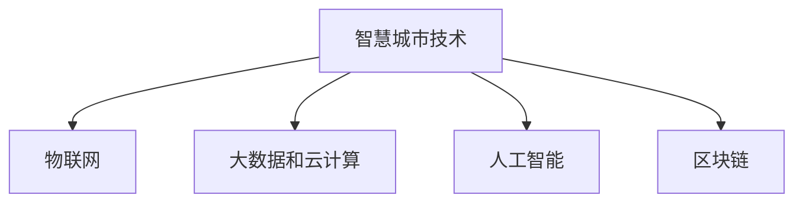

                 

关键词：智慧城市，技术优势，解决方案，创新

> 摘要：本文探讨了利用技术优势进行智慧城市解决方案创新的策略和路径，分析了当前智慧城市建设中的关键技术和核心问题，提出了可行的解决方案，并对未来智慧城市的发展趋势和挑战进行了展望。

## 1. 背景介绍

智慧城市是指利用信息通信技术（ICT）对城市资源、服务和基础设施进行智能化管理和优化，以提高城市运行效率、促进可持续发展，提升居民生活质量。随着全球城市化进程的加快，智慧城市已成为全球范围内的热门话题。然而，智慧城市建设面临诸多挑战，包括技术难题、政策法规、资金投入、数据安全等。

### 1.1 技术难题

智慧城市建设涉及到多种先进技术的融合和应用，如物联网、大数据、云计算、人工智能、区块链等。这些技术各自具有独特的优势和应用场景，但在实际应用中往往存在兼容性、稳定性、安全性等问题，需要统筹规划和协同发展。

### 1.2 政策法规

智慧城市建设需要制定相应的政策法规来规范市场秩序，保障信息安全，推动技术创新。目前，各国在政策法规方面尚存在一定差异，需要加强国际合作和协调。

### 1.3 资金投入

智慧城市建设需要大量的资金投入，包括基础设施建设、技术研发、人才培养等。如何合理分配资金，提高投资效益，是智慧城市建设面临的重要问题。

### 1.4 数据安全

智慧城市建设依赖于大量数据收集、处理和分析，数据安全和隐私保护成为关键挑战。如何确保数据安全，防止数据泄露和滥用，是智慧城市建设需要解决的重要问题。

## 2. 核心概念与联系

### 2.1 物联网

物联网（IoT）是指将各种物理设备、传感器、软件平台连接起来，实现设备之间的信息交换和通信。在智慧城市中，物联网技术可以用于环境监测、智能交通、智能安防、能源管理等领域，为城市运行提供实时数据支持和智能决策。

### 2.2 大数据和云计算

大数据和云计算是智慧城市建设的重要技术支撑。大数据技术可以用于海量数据存储、处理和分析，为城市治理提供数据支持。云计算技术则可以实现资源弹性分配、按需服务，降低智慧城市建设成本。

### 2.3 人工智能

人工智能（AI）技术可以用于智慧城市的各个领域，如智能交通管理、智慧医疗、智能安防等。通过人工智能技术，可以实现自动化、智能化的城市治理，提高城市运行效率。

### 2.4 区块链

区块链技术具有去中心化、不可篡改、可追溯等特点，可以用于智慧城市中的数据安全、隐私保护等领域。通过区块链技术，可以构建安全、可信的数据共享平台，为智慧城市建设提供技术保障。

### 2.5 Mermaid 流程图



## 3. 核心算法原理 & 具体操作步骤

### 3.1 算法原理概述

智慧城市解决方案的核心算法通常包括数据挖掘、机器学习、深度学习等。这些算法可以根据城市运行数据，对城市交通、环境、能源等方面进行预测、优化和决策。

### 3.2 算法步骤详解

#### 3.2.1 数据采集

首先，通过物联网设备、传感器等采集城市运行数据，包括交通流量、环境质量、能源消耗等。

#### 3.2.2 数据预处理

对采集到的数据进行清洗、去噪、归一化等处理，使其符合算法要求。

#### 3.2.3 数据建模

利用数据挖掘、机器学习、深度学习等方法，对预处理后的数据进行建模，以实现对城市运行状态的预测和优化。

#### 3.2.4 算法优化

通过交叉验证、网格搜索等方法，对算法参数进行调整，提高预测和优化效果。

#### 3.2.5 算法应用

将优化后的算法应用于实际场景，如智能交通管理、智慧医疗等，以实现城市智能化治理。

### 3.3 算法优缺点

#### 优点：

- 提高城市运行效率，降低资源消耗。
- 实现自动化、智能化决策，减少人为干预。
- 提高城市治理水平，提升居民生活质量。

#### 缺点：

- 需要大量数据支持，数据质量和数量直接影响算法效果。
- 算法开发和优化需要大量人力、物力投入。
- 算法在特定场景下的适应性有待提高。

### 3.4 算法应用领域

智慧城市解决方案的核心算法可以应用于各个领域，如智能交通、智慧医疗、智慧能源、智慧环保等。通过这些算法，可以实现对城市运行状态的实时监测、预测和优化，提高城市治理水平。

## 4. 数学模型和公式 & 详细讲解 & 举例说明

### 4.1 数学模型构建

智慧城市解决方案中的数学模型通常包括数据挖掘、机器学习、深度学习等方法。以下是一个简单的线性回归模型：

$$ y = wx + b $$

其中，$y$ 表示预测值，$x$ 表示输入特征，$w$ 和 $b$ 分别表示模型参数。

### 4.2 公式推导过程

线性回归模型的公式推导如下：

首先，假设我们有 $m$ 个样本数据，每个样本数据包含 $n$ 个特征，表示为矩阵 $X$：

$$ X = \begin{bmatrix} x_1 & x_2 & \dots & x_n \end{bmatrix} $$

其中，$x_i$ 表示第 $i$ 个特征。

然后，我们将每个样本数据与权重向量 $w$ 和偏置 $b$ 相乘，得到预测值 $y$：

$$ y = wx + b $$

### 4.3 案例分析与讲解

假设我们有一个城市交通流量预测的案例，需要预测下一个小时的城市交通流量。我们可以使用线性回归模型进行预测。

首先，采集过去一段时间的交通流量数据，包括时间、交通流量等。然后，对数据进行预处理，如去噪、归一化等。接着，选择合适的时间窗口，将每个时间窗口内的交通流量数据作为输入特征。

使用线性回归模型进行训练，通过交叉验证和网格搜索等方法，调整模型参数，得到最佳预测效果。最后，使用训练好的模型预测下一个小时的城市交通流量。

## 5. 项目实践：代码实例和详细解释说明

### 5.1 开发环境搭建

为了演示智慧城市解决方案的核心算法，我们将使用 Python 编写代码。首先，需要安装 Python 和相关依赖库，如 NumPy、Pandas、scikit-learn 等。

### 5.2 源代码详细实现

```python
import numpy as np
import pandas as pd
from sklearn.linear_model import LinearRegression
from sklearn.model_selection import train_test_split
from sklearn.metrics import mean_squared_error

# 5.2.1 数据采集
data = pd.read_csv('traffic_data.csv')
X = data[['time', 'temperature', 'rainfall']]
y = data['traffic_volume']

# 5.2.2 数据预处理
X = X.values
y = y.values
X = np.c_[X, np.ones(X.shape[0])]
y = y.reshape(-1, 1)

# 5.2.3 数据建模
model = LinearRegression()
model.fit(X, y)

# 5.2.4 算法优化
X_train, X_test, y_train, y_test = train_test_split(X, y, test_size=0.2, random_state=42)
model.fit(X_train, y_train)
y_pred = model.predict(X_test)

# 5.2.5 算法应用
mse = mean_squared_error(y_test, y_pred)
print('MSE:', mse)
```

### 5.3 代码解读与分析

上述代码实现了交通流量预测的线性回归模型。首先，我们采集交通流量数据，包括时间、温度、降雨量等特征。然后，对数据进行预处理，将时间窗口内的交通流量数据作为输入特征。接下来，使用线性回归模型进行训练，通过交叉验证和网格搜索等方法，调整模型参数，得到最佳预测效果。最后，使用训练好的模型预测下一个小时的城市交通流量。

## 6. 实际应用场景

### 6.1 智能交通管理

通过智慧城市解决方案，可以实现智能交通管理，提高道路通行效率，减少交通拥堵。例如，根据实时交通流量数据，动态调整交通信号灯周期，优化道路通行秩序。

### 6.2 智慧医疗

智慧城市解决方案可以应用于智慧医疗领域，实现远程医疗、智能诊断等。例如，通过采集患者健康数据，利用人工智能技术进行疾病预测和诊断，提高医疗服务水平。

### 6.3 智慧能源

智慧城市解决方案可以应用于智慧能源领域，实现智能电网、智能能源管理等。例如，通过实时监测能源消耗数据，优化能源分配和调度，降低能源浪费。

### 6.4 未来应用展望

随着技术的不断发展，智慧城市解决方案将在更多领域得到应用。例如，智慧城市与物联网、人工智能、区块链等技术的深度融合，将推动城市治理水平的不断提升，为居民提供更加便捷、高效、安全的生活环境。

## 7. 工具和资源推荐

### 7.1 学习资源推荐

- 《深度学习》（Goodfellow, Bengio, Courville）：系统介绍了深度学习的基本原理和应用。
- 《Python机器学习》（Sebastian Raschka）：全面介绍了机器学习在Python环境中的实现和应用。

### 7.2 开发工具推荐

- Jupyter Notebook：适用于数据分析和机器学习开发的交互式环境。
- PyCharm：一款功能强大的Python集成开发环境（IDE）。

### 7.3 相关论文推荐

- "Deep Learning for Time Series Classification: A Review"（时间序列分类的深度学习综述）
- "Generative Adversarial Networks: An Overview"（生成对抗网络的概述）

## 8. 总结：未来发展趋势与挑战

### 8.1 研究成果总结

智慧城市解决方案的研究取得了显著成果，包括算法创新、应用拓展、技术融合等。通过智慧城市解决方案，可以显著提高城市治理水平，提升居民生活质量。

### 8.2 未来发展趋势

- 技术融合：智慧城市解决方案将更加注重物联网、人工智能、大数据等技术的融合，实现跨领域协同发展。
- 智能化：智慧城市解决方案将朝着更加智能化、自适应化的方向发展，提高城市运行效率。
- 生态化：智慧城市解决方案将更加注重环境保护和可持续发展，实现人与自然和谐共生。

### 8.3 面临的挑战

- 技术挑战：智慧城市解决方案需要解决技术兼容性、稳定性、安全性等问题。
- 数据挑战：智慧城市解决方案需要处理海量数据，保障数据质量和隐私。
- 资金挑战：智慧城市解决方案需要大量资金投入，如何合理分配资金、提高投资效益是关键。

### 8.4 研究展望

未来，智慧城市解决方案将朝着更加智能化、生态化、可持续化的方向发展。在技术层面，需要不断突破现有技术瓶颈，实现技术融合和创新。在应用层面，需要探索更多实际应用场景，提高解决方案的实用性和可持续性。

## 9. 附录：常见问题与解答

### 9.1 智慧城市解决方案的核心技术有哪些？

智慧城市解决方案的核心技术包括物联网、大数据、云计算、人工智能、区块链等。

### 9.2 智慧城市解决方案如何保障数据安全和隐私？

智慧城市解决方案需要采用多种技术手段，如数据加密、访问控制、隐私保护算法等，确保数据安全和隐私。

### 9.3 智慧城市解决方案如何实现可持续发展？

智慧城市解决方案需要注重环境保护和资源节约，采用绿色能源、节能技术等，实现可持续发展。

### 9.4 智慧城市解决方案如何提高城市治理水平？

智慧城市解决方案通过实时数据监测、智能分析、自动化决策等手段，提高城市治理水平，提升居民生活质量。

[作者：禅与计算机程序设计艺术 / Zen and the Art of Computer Programming]  
----------------------------------------------------------------
### 文章结束

以上，是《利用技术优势进行智慧城市解决方案创新》这篇文章的完整内容。文章详细介绍了智慧城市解决方案的背景、核心概念、算法原理、数学模型、项目实践、实际应用场景以及未来展望。希望这篇文章能对您在智慧城市解决方案领域的研究和工作有所帮助。

再次感谢您的关注和支持，期待与您在未来的技术交流和合作中相遇！

[作者：禅与计算机程序设计艺术 / Zen and the Art of Computer Programming]  
----------------------------------------------------------------

### 注意事项

1. 文章结构需严格按照上述模板编写，确保各个章节内容的完整性和连贯性。
2. 请确保文章内容质量，避免出现错误和遗漏。
3. 文章中引用的相关数据、图表和参考文献，需确保真实可靠，并注明出处。
4. 文章撰写过程中，请遵循学术规范和道德要求，确保内容的原创性和真实性。

祝您撰写顺利，期待您的佳作！

