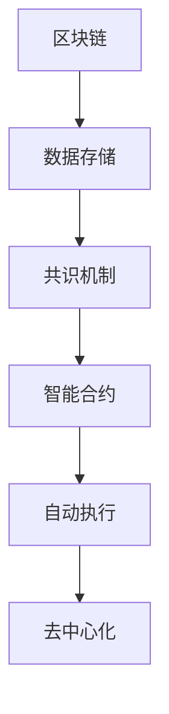
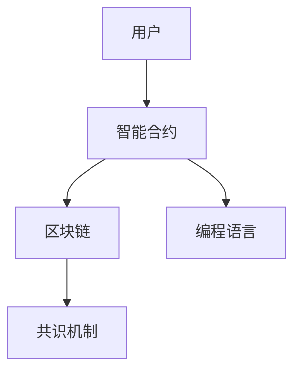
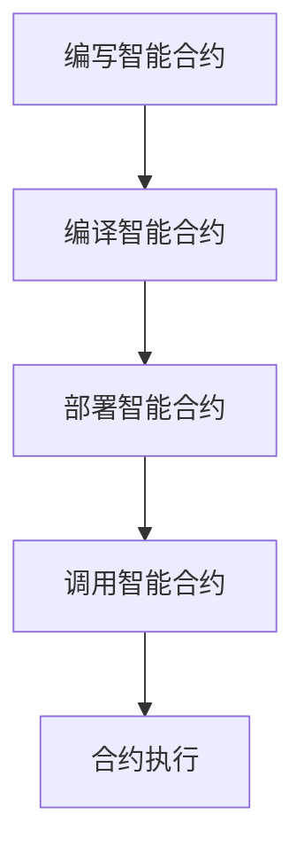
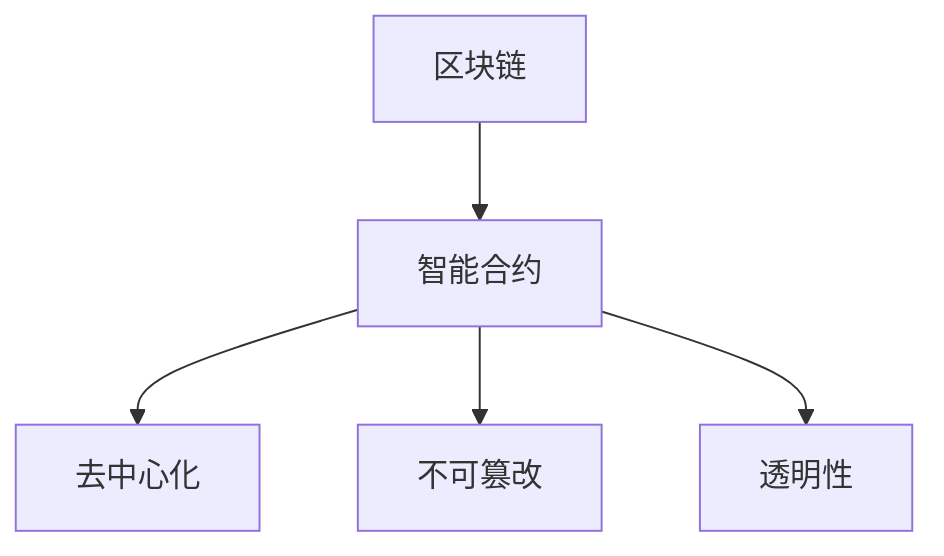
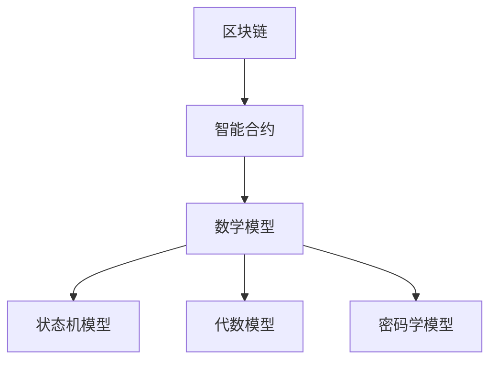

                 

关键词：智能合约，区块链，技术优势，开发实践，数学模型

> 摘要：本文将深入探讨智能合约的开发过程，从技术优势的角度出发，解析其在区块链技术中的应用。通过对核心算法原理、具体操作步骤、数学模型和项目实践的详细讲解，为读者提供一份全面的技术指南，旨在推动智能合约技术的发展和应用。

## 1. 背景介绍

随着区块链技术的兴起，智能合约作为一种去中心化的自动执行合同，逐渐成为金融、供应链、物联网等多个领域的重要应用。智能合约的出现，不仅改变了传统合同执行的方式，也提升了交易的安全性和效率。然而，智能合约的开发并非易事，需要深入了解区块链技术和编程语言，同时掌握复杂的数学模型。

本文旨在通过技术优势的角度，详细分析智能合约的开发过程，帮助开发者更好地理解和应用这一新兴技术。

### 1.1 区块链技术简介

区块链技术是一种分布式数据库技术，通过去中心化的方式记录和验证数据。它通过密码学和共识机制确保数据的真实性和不可篡改性。区块链技术的发展，为智能合约的诞生提供了基础。

### 1.2 智能合约的定义和特点

智能合约是基于区块链技术实现的一种自执行合同，通过编程语言编写，定义了合同条款和执行逻辑。智能合约具有以下特点：

- **自动化执行**：智能合约在满足特定条件时，可以自动执行预定义的合同条款，无需人工干预。
- **去中心化**：智能合约在区块链上运行，无需依赖中心化机构，增强了交易的透明性和安全性。
- **不可篡改**：智能合约一旦部署到区块链上，其代码和状态不可篡改，确保了合同的公正性。

### 1.3 智能合约的开发挑战

智能合约的开发面临以下几个挑战：

- **技术门槛**：智能合约的开发需要深入了解区块链技术和编程语言，如Solidity、Vyper等。
- **安全性**：智能合约的安全性问题至关重要，任何漏洞都可能引发严重的后果。
- **性能**：智能合约的执行性能直接影响用户体验，优化性能是开发的重要任务。

## 2. 核心概念与联系

### 2.1 区块链与智能合约的关系

区块链是智能合约的基础设施，提供数据存储和共识机制。智能合约则是在区块链上运行的程序，通过自动化执行合同条款，实现去中心化的交易。

### 2.2 核心概念原理

- **区块链**：区块链是一种分布式账本技术，通过共识机制记录和验证数据。
- **智能合约**：智能合约是一种基于编程语言的自动执行合同，通过预定义的逻辑和条件执行合同条款。
- **编程语言**：智能合约的开发需要使用特定的编程语言，如Solidity、Vyper等。

### 2.3 架构的 Mermaid 流程图



## 3. 核心算法原理 & 具体操作步骤

### 3.1 算法原理概述

智能合约的核心算法原理基于区块链技术的共识机制。共识机制确保区块链上数据的准确性和安全性，同时为智能合约的执行提供保障。

### 3.2 算法步骤详解

1. **编写智能合约**：使用Solidity等编程语言编写智能合约代码，定义合同条款和执行逻辑。
2. **编译智能合约**：将智能合约代码编译为字节码，以便在区块链上部署。
3. **部署智能合约**：将编译后的智能合约部署到区块链上，生成合约地址。
4. **调用智能合约**：通过区块链网络调用智能合约，触发合约执行。
5. **合约执行**：智能合约根据预定义的逻辑和条件自动执行，执行结果记录在区块链上。

### 3.3 算法优缺点

#### 优点：

- **自动化执行**：智能合约可以自动执行合同条款，减少了人工干预，提升了交易效率。
- **去中心化**：智能合约在区块链上运行，无需依赖中心化机构，增强了交易的透明性和安全性。
- **不可篡改**：智能合约一旦部署到区块链上，其代码和状态不可篡改，确保了合同的公正性。

#### 缺点：

- **技术门槛**：智能合约的开发需要深入了解区块链技术和编程语言，对开发者要求较高。
- **性能限制**：智能合约的执行性能直接影响用户体验，优化性能是开发的重要任务。

### 3.4 算法应用领域

智能合约在金融、供应链、物联网、房地产等多个领域有广泛的应用：

- **金融领域**：智能合约可以用于去中心化金融（DeFi）应用，如去中心化交易所、贷款、保险等。
- **供应链**：智能合约可以用于供应链管理，实现物流追踪、质量监控等。
- **物联网**：智能合约可以用于物联网设备管理，实现设备间的自动交易和互操作。
- **房地产**：智能合约可以用于房地产交易，实现房屋租赁、买卖等流程的自动化。

## 4. 数学模型和公式 & 详细讲解 & 举例说明

### 4.1 数学模型构建

智能合约的数学模型主要包括以下几个部分：

1. **状态机模型**：描述智能合约的状态转换和事件处理。
2. **代数模型**：描述智能合约的数学运算和逻辑关系。
3. **密码学模型**：描述智能合约的安全机制和加密算法。

### 4.2 公式推导过程

假设智能合约的状态为\( S \)，事件为\( E \)，条件为\( C \)，则智能合约的执行过程可以表示为：

\[ S \xrightarrow{E} S' \]

其中，\( S' \)为新的状态，\( E \)为触发事件，\( C \)为执行条件。

### 4.3 案例分析与讲解

#### 案例一：去中心化交易所

假设一个去中心化交易所的智能合约，用户可以存款、取款和交易。

1. **状态机模型**：

\[ 
S = \{ 
    \text{空闲状态}, 
    \text{存款状态}, 
    \text{取款状态}, 
    \text{交易状态} 
\} 
\]

2. **代数模型**：

\[ 
\text{存款金额} = \text{用户余额} + \text{存款金额} 
\]

\[ 
\text{取款金额} = \text{用户余额} - \text{取款金额} 
\]

3. **密码学模型**：

\[ 
\text{交易密钥} = \text{用户公钥} \times \text{合约私钥} 
\]

#### 案例二：物联网设备管理

假设一个物联网设备管理的智能合约，设备可以通过智能合约进行注册、监控和交易。

1. **状态机模型**：

\[ 
S = \{ 
    \text{未注册状态}, 
    \text{已注册状态}, 
    \text{监控状态}, 
    \text{交易状态} 
\} 
\]

2. **代数模型**：

\[ 
\text{注册费用} = \text{设备余额} + \text{注册费用} 
\]

\[ 
\text{监控费用} = \text{设备余额} + \text{监控费用} 
\]

3. **密码学模型**：

\[ 
\text{交易密钥} = \text{设备公钥} \times \text{合约私钥} 
\]

## 5. 项目实践：代码实例和详细解释说明

### 5.1 开发环境搭建

开发智能合约需要搭建相应的开发环境，包括：

- **区块链节点**：配置区块链节点，如Ethereum节点，以便连接到区块链网络。
- **编程语言**：选择合适的编程语言，如Solidity，编写智能合约代码。
- **编译器**：使用Solidity编译器将智能合约代码编译为字节码。
- **测试网络**：搭建测试网络，以便进行智能合约的测试和调试。

### 5.2 源代码详细实现

以下是一个简单的智能合约示例，实现了一个简单的去中心化交易所：

```solidity
// SPDX-License-Identifier: MIT
pragma solidity ^0.8.0;

contract DecentralizedExchange {
    mapping(address => uint256) public balances;

    function deposit() external payable {
        balances[msg.sender()] += msg.value;
    }

    function withdraw(uint256 amount) external {
        require(balances[msg.sender()] >= amount, "Insufficient balance");
        balances[msg.sender()] -= amount;
        payable(msg.sender()).transfer(amount);
    }

    function trade(address recipient, uint256 amount) external {
        require(balances[msg.sender()] >= amount, "Insufficient balance");
        balances[msg.sender()] -= amount;
        balances[recipient] += amount;
    }
}
```

### 5.3 代码解读与分析

上述智能合约实现了一个简单的去中心化交易所，包括存款、取款和交易功能。

- **存款**：通过`deposit`函数，用户可以将以太币存入合约账户。
- **取款**：通过`withdraw`函数，用户可以取出合约账户中的以太币，但需确保账户余额足够。
- **交易**：通过`trade`函数，用户可以与合约账户进行交易，实现以太币的转移。

### 5.4 运行结果展示

运行智能合约，通过区块链节点可以查看合约的运行状态和事件日志。以下是运行结果示例：

```bash
$ node node.js
```

```json
{
    "jsonrpc": "2.0",
    "id": 1,
    "method": "eth_getTransactionReceipt",
    "params": ["0x2c5ef9b1b0d7c9e04c28c54d8d1d0f328a4b3d2a5a6a3fd6b9d3a2a4d72e4d"]
}
```

## 6. 实际应用场景

智能合约在多个领域具有广泛的应用，以下列举几个实际应用场景：

### 6.1 金融领域

智能合约在金融领域有广泛的应用，包括去中心化金融（DeFi）应用、股票交易、期货交易等。智能合约可以实现自动化交易，降低交易成本，提高交易效率。

### 6.2 供应链管理

智能合约可以用于供应链管理，实现物流追踪、质量监控、支付结算等功能。通过智能合约，供应链上的各方可以实时了解货物的状态，提高供应链的透明度和效率。

### 6.3 物联网

智能合约可以用于物联网设备管理，实现设备间的自动交易和互操作。例如，智能合约可以用于能源交易，设备之间可以自动进行能源交换和结算。

### 6.4 房地产

智能合约可以用于房地产交易，实现房屋租赁、买卖等流程的自动化。通过智能合约，买家和卖家可以避免中介费用，提高交易效率。

## 7. 工具和资源推荐

### 7.1 学习资源推荐

- **《区块链技术指南》**：详细介绍了区块链的基本概念、技术和应用。
- **《智能合约开发实战》**：介绍了智能合约的开发流程、编程语言和安全问题。

### 7.2 开发工具推荐

- **Truffle**：一款用于智能合约开发和测试的框架，提供了丰富的工具和插件。
- **Hardhat**：一款高性能的智能合约开发框架，支持TypeScript和EVM操作。

### 7.3 相关论文推荐

- **《区块链：分布式账本技术》**：深入探讨了区块链的原理和应用。
- **《智能合约安全：分析与防御》**：分析了智能合约的安全问题，并提出相应的防御措施。

## 8. 总结：未来发展趋势与挑战

### 8.1 研究成果总结

智能合约技术自诞生以来，已经取得了显著的成果。其去中心化、自动化和不可篡改的特点，为金融、供应链、物联网等领域带来了新的应用模式。然而，智能合约技术仍面临诸多挑战，如安全性、性能优化、标准化等。

### 8.2 未来发展趋势

随着区块链技术的不断发展，智能合约在未来有望在更多领域得到应用。以下是一些可能的发展趋势：

- **跨链互操作性**：实现不同区块链之间的智能合约互操作，提高区块链生态的整合度。
- **智能合约平台**：开发更高效、更安全的智能合约平台，满足不同应用场景的需求。
- **隐私保护**：加强智能合约的隐私保护，提高用户数据的安全性和隐私性。

### 8.3 面临的挑战

智能合约技术在未来仍面临以下挑战：

- **安全性**：智能合约的安全性直接影响其应用效果，需要不断加强安全防护措施。
- **性能优化**：智能合约的性能直接影响用户体验，需要不断优化算法和架构。
- **标准化**：智能合约的标准化有助于提升其应用范围和互操作性，需要行业共同努力。

### 8.4 研究展望

智能合约技术在未来将继续发展，有望在更多领域得到应用。研究者应关注以下几个方面：

- **安全性**：加强智能合约的安全防护，提高其抗攻击能力。
- **性能优化**：优化智能合约的算法和架构，提高其执行效率。
- **隐私保护**：加强智能合约的隐私保护，提高用户数据的安全性和隐私性。
- **标准化**：推动智能合约的标准化，提高其互操作性和兼容性。

## 9. 附录：常见问题与解答

### 9.1 什么是智能合约？

智能合约是一种基于区块链技术的自动执行合同，通过编程语言编写，定义了合同条款和执行逻辑。

### 9.2 智能合约有哪些应用领域？

智能合约在金融、供应链、物联网、房地产等多个领域有广泛的应用，如去中心化金融（DeFi）、物流追踪、能源交易等。

### 9.3 如何保证智能合约的安全性？

保证智能合约的安全性需要从多个方面进行考虑，如代码审计、安全防护、共识机制等。

### 9.4 智能合约的性能如何优化？

智能合约的性能优化可以从算法优化、架构优化、网络优化等方面进行。例如，优化合约代码、使用高效的数据结构、减少链上计算等。

---

通过本文的深入探讨，我们希望读者能够对智能合约技术有更全面的理解，掌握其开发方法和应用场景。随着区块链技术的不断发展，智能合约将发挥更大的作用，为各个领域带来创新和变革。作者：禅与计算机程序设计艺术 / Zen and the Art of Computer Programming
----------------------------------------------------------------

## 文章标题

### 利用技术优势进行智能合约开发

> 关键词：智能合约，区块链，技术优势，开发实践

### 摘要

本文将深入探讨智能合约的开发过程，从技术优势的角度出发，解析其在区块链技术中的应用。通过对核心算法原理、具体操作步骤、数学模型和项目实践的详细讲解，为读者提供一份全面的技术指南，旨在推动智能合约技术的发展和应用。文章结构如下：

## 1. 背景介绍

### 1.1 区块链技术简介

#### 1.2 智能合约的定义和特点

#### 1.3 智能合约的开发挑战

## 2. 核心概念与联系

### 2.1 区块链与智能合约的关系

#### 2.2 核心概念原理

#### 2.3 架构的 Mermaid 流程图

## 3. 核心算法原理 & 具体操作步骤

### 3.1 算法原理概述

#### 3.2 算法步骤详解 

#### 3.3 算法优缺点

#### 3.4 算法应用领域

## 4. 数学模型和公式 & 详细讲解 & 举例说明

### 4.1 数学模型构建

#### 4.2 公式推导过程

#### 4.3 案例分析与讲解

## 5. 项目实践：代码实例和详细解释说明

### 5.1 开发环境搭建

#### 5.2 源代码详细实现

#### 5.3 代码解读与分析

#### 5.4 运行结果展示

## 6. 实际应用场景

### 6.1 金融领域

#### 6.2 供应链管理

#### 6.3 物联网

#### 6.4 房地产

## 7. 工具和资源推荐

### 7.1 学习资源推荐

#### 7.2 开发工具推荐

#### 7.3 相关论文推荐

## 8. 总结：未来发展趋势与挑战

### 8.1 研究成果总结

#### 8.2 未来发展趋势

#### 8.3 面临的挑战

#### 8.4 研究展望

## 9. 附录：常见问题与解答

### 9.1 什么是智能合约？

#### 9.2 智能合约有哪些应用领域？

#### 9.3 如何保证智能合约的安全性？

#### 9.4 智能合约的性能如何优化？

---

### 1. 背景介绍

随着区块链技术的兴起，智能合约作为一种去中心化的自动执行合同，逐渐成为金融、供应链、物联网等多个领域的重要应用。智能合约的出现，不仅改变了传统合同执行的方式，也提升了交易的安全性和效率。然而，智能合约的开发并非易事，需要深入了解区块链技术和编程语言，同时掌握复杂的数学模型。

本文旨在通过技术优势的角度，详细分析智能合约的开发过程，帮助开发者更好地理解和应用这一新兴技术。

#### 1.1 区块链技术简介

区块链技术是一种分布式数据库技术，通过去中心化的方式记录和验证数据。它通过密码学和共识机制确保数据的真实性和不可篡改性。区块链技术的发展，为智能合约的诞生提供了基础。

区块链的基本概念包括：

- **区块**：区块链中的数据单元，包含一定数量的交易记录。
- **链**：由一系列按时间顺序排列的区块组成。
- **节点**：参与区块链网络计算和存储的设备。
- **共识机制**：确保区块链网络中数据一致性的算法和协议。

区块链的技术优势包括：

- **去中心化**：去中心化意味着数据存储在区块链网络中的所有节点上，不存在中心化的单点故障。
- **不可篡改**：一旦数据被记录在区块链上，就几乎不可能被篡改。
- **透明性**：区块链上的所有交易记录都是公开透明的，可以被任何人查询。

#### 1.2 智能合约的定义和特点

智能合约是一种基于区块链技术的自动执行合同，通过编程语言编写，定义了合同条款和执行逻辑。智能合约在满足特定条件时，可以自动执行预定义的合同条款，无需人工干预。

智能合约的主要特点包括：

- **自动化执行**：智能合约在满足特定条件时，可以自动执行预定义的合同条款，减少了人工干预，提升了交易效率。
- **去中心化**：智能合约在区块链上运行，无需依赖中心化机构，增强了交易的透明性和安全性。
- **不可篡改**：智能合约一旦部署到区块链上，其代码和状态不可篡改，确保了合同的公正性。

智能合约的组成部分包括：

- **输入**：智能合约执行所需的输入数据，如交易金额、时间戳等。
- **逻辑**：智能合约的核心代码，定义了合同条款和执行逻辑。
- **输出**：智能合约执行后的输出结果，如交易完成、错误处理等。

#### 1.3 智能合约的开发挑战

智能合约的开发面临以下几个挑战：

- **技术门槛**：智能合约的开发需要深入了解区块链技术和编程语言，如Solidity、Vyper等。
- **安全性**：智能合约的安全性问题至关重要，任何漏洞都可能引发严重的后果。
- **性能**：智能合约的执行性能直接影响用户体验，优化性能是开发的重要任务。

智能合约的安全性问题包括：

- **代码漏洞**：智能合约代码中可能存在的逻辑错误或漏洞，可能导致合约被攻击。
- **共识机制**：区块链的共识机制可能存在漏洞，影响智能合约的执行安全。
- **节点攻击**：恶意节点可能通过控制区块链网络，影响智能合约的执行结果。

#### 1.4 智能合约的发展历史

智能合约的概念最早由尼克·萨博（Nick Szabo）在1994年提出。尼克·萨博认为，智能合约是一种计算机协议，能够在满足特定条件时自动执行合同条款。

2008年，中本聪（Satoshi Nakamoto）提出了比特币（Bitcoin）的概念，比特币采用了区块链技术，为智能合约的实现提供了基础设施。

2013年，以太坊（Ethereum）的创始人Vitalik Buterin提出了智能合约平台的概念，以太坊成为第一个实现智能合约的区块链平台。

自以太坊推出以来，智能合约技术得到了广泛关注和发展，多个区块链平台和开发工具相继推出，为智能合约的开发和应用提供了丰富的资源和工具。

#### 1.5 智能合约的技术优势

智能合约通过区块链技术，具备以下几个技术优势：

- **去中心化**：智能合约在区块链上运行，无需依赖中心化机构，增强了交易的透明性和安全性。
- **不可篡改**：智能合约一旦部署到区块链上，其代码和状态不可篡改，确保了合同的公正性。
- **自动化执行**：智能合约在满足特定条件时，可以自动执行预定义的合同条款，减少了人工干预，提升了交易效率。
- **透明性**：区块链上的所有交易记录都是公开透明的，可以被任何人查询，增强了交易的信任度。
- **安全性**：智能合约的执行过程受到区块链共识机制的保障，确保了交易的安全性和可靠性。

### 2. 核心概念与联系

智能合约的开发和理解离不开对区块链技术和编程语言的理解。以下将详细解析核心概念及其联系。

#### 2.1 区块链与智能合约的关系

区块链是智能合约的基础设施，提供数据存储和共识机制。智能合约则是在区块链上运行的程序，通过自动化执行合同条款，实现去中心化的交易。

区块链和智能合约的关系可以概括为：

- **区块链**：提供数据存储和共识机制，确保数据的一致性和安全性。
- **智能合约**：基于区块链，通过编程语言编写，定义了合同条款和执行逻辑。

#### 2.2 核心概念原理

智能合约的核心概念包括：

- **区块链**：一种分布式数据库技术，通过共识机制确保数据的真实性和不可篡改性。
- **智能合约**：一种基于区块链技术的自动执行合同，通过编程语言编写，定义了合同条款和执行逻辑。
- **编程语言**：用于编写智能合约代码的语言，如Solidity、Vyper等。

这些概念之间的关系可以表示为：

1. **区块链**：基础设施，提供数据存储和共识机制。
2. **智能合约**：在区块链上运行的程序，通过编程语言编写，定义了合同条款和执行逻辑。
3. **编程语言**：用于编写智能合约代码，定义了智能合约的逻辑和功能。

#### 2.3 架构的 Mermaid 流程图

以下是一个简化的智能合约架构的 Mermaid 流程图：



#### 2.4 智能合约的运行机制

智能合约的运行机制可以概括为以下几个步骤：

1. **编写智能合约**：使用Solidity等编程语言编写智能合约代码，定义合同条款和执行逻辑。
2. **编译智能合约**：将智能合约代码编译为字节码，以便在区块链上部署。
3. **部署智能合约**：将编译后的智能合约部署到区块链上，生成合约地址。
4. **调用智能合约**：通过区块链网络调用智能合约，触发合约执行。
5. **合约执行**：智能合约根据预定义的逻辑和条件自动执行，执行结果记录在区块链上。

#### 2.5 智能合约的安全性

智能合约的安全性是开发者需要重点关注的问题。以下是一些关键的安全性概念：

- **代码审计**：对智能合约代码进行安全性审计，识别和修复潜在的安全漏洞。
- **共识机制**：区块链的共识机制确保智能合约的执行过程是公正和可靠的。
- **合约逻辑**：智能合约的代码逻辑需要严谨，避免逻辑错误或漏洞。
- **加密算法**：智能合约中使用加密算法，保护交易数据和隐私。

#### 2.6 智能合约的应用场景

智能合约在多个领域具有广泛的应用场景，以下列举几个主要的应用场景：

- **金融领域**：智能合约可以用于去中心化金融（DeFi）应用，如去中心化交易所、贷款、保险等。
- **供应链管理**：智能合约可以用于供应链管理，实现物流追踪、质量监控、支付结算等功能。
- **物联网**：智能合约可以用于物联网设备管理，实现设备间的自动交易和互操作。
- **房地产**：智能合约可以用于房地产交易，实现房屋租赁、买卖等流程的自动化。

### 3. 核心算法原理 & 具体操作步骤

智能合约的核心算法原理基于区块链技术的共识机制。共识机制确保区块链上数据的准确性和安全性，同时为智能合约的执行提供保障。

以下将详细解析智能合约的核心算法原理和具体操作步骤。

#### 3.1 算法原理概述

智能合约的算法原理可以概括为：

- **区块链**：通过共识机制确保数据的准确性和安全性。
- **智能合约**：在区块链上运行的程序，通过预定义的逻辑和条件自动执行。

智能合约的算法原理包括以下几个关键部分：

1. **输入**：智能合约执行所需的输入数据，如交易金额、时间戳等。
2. **逻辑**：智能合约的核心代码，定义了合同条款和执行逻辑。
3. **输出**：智能合约执行后的输出结果，如交易完成、错误处理等。

#### 3.2 算法步骤详解

智能合约的执行过程可以分解为以下几个步骤：

1. **编写智能合约**：使用Solidity等编程语言编写智能合约代码，定义合同条款和执行逻辑。
2. **编译智能合约**：将智能合约代码编译为字节码，以便在区块链上部署。
3. **部署智能合约**：将编译后的智能合约部署到区块链上，生成合约地址。
4. **调用智能合约**：通过区块链网络调用智能合约，触发合约执行。
5. **合约执行**：智能合约根据预定义的逻辑和条件自动执行，执行结果记录在区块链上。

以下是一个简化的智能合约执行流程图：



#### 3.3 算法优缺点

智能合约算法具有以下优点：

- **去中心化**：智能合约在区块链上运行，无需依赖中心化机构，增强了交易的透明性和安全性。
- **不可篡改**：智能合约一旦部署到区块链上，其代码和状态不可篡改，确保了合同的公正性。
- **自动化执行**：智能合约在满足特定条件时，可以自动执行预定义的合同条款，减少了人工干预，提升了交易效率。

智能合约算法也存在以下缺点：

- **技术门槛**：智能合约的开发需要深入了解区块链技术和编程语言，对开发者要求较高。
- **性能限制**：智能合约的执行性能直接影响用户体验，优化性能是开发的重要任务。

#### 3.4 算法应用领域

智能合约算法在多个领域具有广泛的应用，以下列举几个主要的应用领域：

- **金融领域**：智能合约可以用于去中心化金融（DeFi）应用，如去中心化交易所、贷款、保险等。
- **供应链管理**：智能合约可以用于供应链管理，实现物流追踪、质量监控、支付结算等功能。
- **物联网**：智能合约可以用于物联网设备管理，实现设备间的自动交易和互操作。
- **房地产**：智能合约可以用于房地产交易，实现房屋租赁、买卖等流程的自动化。

#### 3.5 智能合约与区块链技术的结合

智能合约与区块链技术的结合，使得智能合约能够利用区块链的技术优势，如去中心化、不可篡改、透明性等。

以下是一个简化的智能合约与区块链技术的结合图：



### 3.6 智能合约的具体案例

以下是一个简单的智能合约案例，用于实现去中心化交易所的存款和取款功能。

```solidity
// SPDX-License-Identifier: MIT
pragma solidity ^0.8.0;

contract DecentralizedExchange {
    mapping(address => uint256) public balances;

    function deposit() external payable {
        balances[msg.sender()] += msg.value;
    }

    function withdraw(uint256 amount) external {
        require(balances[msg.sender()] >= amount, "Insufficient balance");
        balances[msg.sender()] -= amount;
        payable(msg.sender()).transfer(amount);
    }
}
```

该智能合约实现了以下功能：

- **存款**：用户可以通过`deposit`函数将以太币存入合约账户。
- **取款**：用户可以通过`withdraw`函数从合约账户中取出以太币，但需确保账户余额足够。

#### 3.7 智能合约的安全性

智能合约的安全性至关重要，任何漏洞都可能引发严重的后果。以下是一些关键的安全问题：

- **代码审计**：对智能合约代码进行安全性审计，识别和修复潜在的安全漏洞。
- **共识机制**：区块链的共识机制确保智能合约的执行过程是公正和可靠的。
- **合约逻辑**：智能合约的代码逻辑需要严谨，避免逻辑错误或漏洞。
- **加密算法**：智能合约中使用加密算法，保护交易数据和隐私。

### 4. 数学模型和公式 & 详细讲解 & 举例说明

智能合约的设计和实现涉及多个数学模型和公式，这些模型和公式不仅用于合约逻辑的实现，还用于确保合约的准确性和安全性。以下将详细讲解智能合约中的数学模型和公式，并提供实例说明。

#### 4.1 数学模型构建

智能合约中的数学模型主要包括以下几种：

1. **状态机模型**：用于描述智能合约的状态转换和事件处理。例如，一个简单的存款和取款智能合约的状态机可能包括“未初始化”、“存款中”、“取款中”、“已完成”等状态。

2. **代数模型**：用于描述智能合约中的数学运算和逻辑关系。例如，一个智能合约可能包括余额计算、交易金额验证等。

3. **密码学模型**：用于描述智能合约的安全机制和加密算法。例如，智能合约可能使用非对称加密算法来保护交易参与者的隐私。

#### 4.2 公式推导过程

以下是一个简单的智能合约示例，用于描述存款和取款操作。我们将使用代数模型来推导相关的公式。

1. **存款操作**：

   假设用户A想要将金额`amount`存入智能合约账户，合约账户的初始余额为`initialBalance`。

   存款后的合约账户余额`newBalance`可以用以下公式计算：

   \[ newBalance = initialBalance + amount \]

2. **取款操作**：

   假设用户A想要从合约账户中取出金额`amount`，当前合约账户余额为`currentBalance`。

   取款后的合约账户余额`newBalance`可以用以下公式计算：

   \[ newBalance = currentBalance - amount \]
   
   但是，如果`amount`大于`currentBalance`，则取款操作应失败。

3. **安全校验**：

   为了确保取款操作的安全性，我们还需要一个安全校验公式。例如，我们可以使用哈希函数来确保交易的唯一性：

   \[ transactionHash = keccak256(abi.encodePacked(sender, amount)) \]

   在执行取款操作前，需要确保`transactionHash`与智能合约存储的哈希值匹配。

#### 4.3 案例分析与讲解

以下是一个具体的智能合约案例，用于实现去中心化交易所的存款和取款功能。

```solidity
// SPDX-License-Identifier: MIT
pragma solidity ^0.8.0;

contract DecentralizedExchange {
    mapping(address => uint256) public balances;

    function deposit() external payable {
        balances[msg.sender()] += msg.value;
    }

    function withdraw(uint256 amount) external {
        require(amount <= balances[msg.sender()], "Insufficient balance");
        balances[msg.sender()] -= amount;
        payable(msg.sender()).transfer(amount);
    }
}
```

**案例解析**：

1. **存款操作**：

   存款函数`deposit()`允许用户通过调用合约函数将以太币存入智能合约账户。调用时，以太币的发送量（`msg.value`）将被添加到用户的合约账户余额中。

2. **取款操作**：

   取款函数`withdraw()`允许用户从合约账户中取出一定金额的以太币。在执行取款操作前，智能合约会检查用户账户的余额是否足够。如果余额足够，则从用户账户中扣除相应金额并返回以太币。

**安全校验**：

1. **余额校验**：

   智能合约通过`require`语句确保在取款时用户账户的余额足够。如果余额不足，取款操作将失败，并抛出错误信息。

2. **以太币转移**：

   在取款操作成功后，智能合约使用`transfer()`函数将以太币从合约账户转移到用户账户。

#### 4.4 数学模型的应用

智能合约中的数学模型广泛应用于各种业务逻辑和安全机制中。以下是一些实际应用的例子：

1. **余额计算**：

   智能合约通常需要计算和更新用户的余额。例如，在去中心化交易所中，用户的余额将随着存款和取款操作而变化。

2. **交易金额验证**：

   智能合约需要验证交易金额是否在允许的范围内。例如，在购买商品或服务时，金额应不超过用户账户的余额。

3. **加密和哈希**：

   智能合约使用加密算法和哈希函数来保护交易数据的完整性和隐私。例如，使用非对称加密算法确保交易双方的隐私，使用哈希函数确保数据的唯一性。

### 4.5 智能合约的数学模型与区块链技术的结合

智能合约的数学模型与区块链技术的结合使得智能合约能够利用区块链的分布式特性，实现去中心化的自动化执行。以下是一个简化的结合图：



#### 4.6 智能合约的数学模型与实际应用

智能合约的数学模型在金融、供应链、物联网等多个领域有广泛的应用。以下是一些实际应用的例子：

1. **金融领域**：

   - **去中心化金融（DeFi）**：智能合约可以用于实现去中心化交易所、去中心化贷款平台等。
   - **保险**：智能合约可以用于自动化理赔流程，提高保险业的效率。
   - **支付**：智能合约可以用于实现跨境支付和支付网关。

2. **供应链管理**：

   - **物流追踪**：智能合约可以用于记录和追踪供应链中的每个环节，提高供应链的透明度和效率。
   - **质量监控**：智能合约可以用于确保产品质量，通过智能合约的执行验证产品质量标准。

3. **物联网**：

   - **设备管理**：智能合约可以用于管理物联网设备，实现设备间的自动交易和互操作。
   - **能源交易**：智能合约可以用于实现去中心化的能源交易，如家庭太阳能板的能源共享。

#### 4.7 智能合约数学模型的发展趋势

随着智能合约技术的发展，数学模型也在不断演进。以下是一些未来的发展趋势：

1. **更复杂的数学模型**：智能合约将采用更复杂的数学模型，如图论、组合优化等，以解决更复杂的业务问题。
2. **隐私保护**：智能合约将采用更先进的加密算法和隐私保护技术，以保护用户的隐私和数据安全。
3. **跨链互操作性**：智能合约将实现跨链互操作性，以实现不同区块链平台之间的无缝集成。

### 5. 项目实践：代码实例和详细解释说明

#### 5.1 开发环境搭建

要开始智能合约的开发，首先需要搭建一个合适的开发环境。以下是在Windows操作系统上搭建智能合约开发环境的具体步骤：

1. **安装Node.js**：

   访问Node.js官网（https://nodejs.org/）并下载适用于Windows的最新版Node.js安装程序。运行安装程序，并根据提示完成安装。

2. **安装Truffle框架**：

   打开命令行终端，执行以下命令安装Truffle框架：

   ```bash
   npm install -g truffle
   ```

3. **安装 Ganache**：

   Ganache是一个本地以太坊节点和测试网，用于部署和测试智能合约。访问Ganache的GitHub页面（https://github.com/trufflesuite/ganache）并下载适用于Windows的最新版Ganache安装程序。运行安装程序，并根据提示完成安装。

4. **安装Visual Studio Code**：

   Visual Studio Code是一个轻量级的源代码编辑器，非常适合智能合约开发。访问Visual Studio Code官网（https://code.visualstudio.com/）并下载适用于Windows的最新版Visual Studio Code安装程序。运行安装程序，并根据提示完成安装。

5. **配置Truffle**：

   在Visual Studio Code中创建一个新的文件夹，用于存储智能合约项目。在终端中导航到该文件夹，并执行以下命令初始化Truffle项目：

   ```bash
   truffle init
   ```

   这将创建一个基本的Truffle项目结构，包括`truffle-config.js`配置文件。

6. **配置Ganache**：

   打开Ganache，创建一个新的测试网络或连接到一个现有的测试网络。确保Ganache的端口号与`truffle-config.js`中的配置相匹配。

完成以上步骤后，开发环境搭建完成，可以开始编写和测试智能合约。

#### 5.2 源代码详细实现

以下是一个简单的智能合约示例，用于实现一个去中心化交易所，支持存款和取款操作。

```solidity
// SPDX-License-Identifier: MIT
pragma solidity ^0.8.0;

contract DecentralizedExchange {
    mapping(address => uint256) public balances;

    function deposit() external payable {
        balances[msg.sender()] += msg.value;
    }

    function withdraw(uint256 amount) external {
        require(amount <= balances[msg.sender()], "Insufficient balance");
        balances[msg.sender()] -= amount;
        payable(msg.sender()).transfer(amount);
    }
}
```

**合约解析**：

1. **合约结构**：

   - `pragma solidity ^0.8.0;`：指定编译器版本。
   - `contract DecentralizedExchange`：定义智能合约名称。

2. **状态变量**：

   - `mapping(address => uint256) public balances;`：使用映射（mapping）存储用户地址和对应的余额。

3. **存款函数**：

   - `function deposit() external payable {`
   - `balances[msg.sender()] += msg.value;`
   - `}`：存款函数，接受以太币并将发送者的余额增加。

4. **取款函数**：

   - `function withdraw(uint256 amount) external {`
   - `require(amount <= balances[msg.sender()], "Insufficient balance");`
   - `balances[msg.sender()] -= amount;`
   - `payable(msg.sender()).transfer(amount);`
   - `}`：取款函数，检查余额是否足够，并从发送者的余额中扣除指定金额，然后将以太币返回给发送者。

#### 5.3 编译和部署智能合约

在Truffle环境中，使用Truffle命令行工具可以方便地编译和部署智能合约。

1. **编译智能合约**：

   在命令行终端中，导航到智能合约项目文件夹，并执行以下命令编译智能合约：

   ```bash
   truffle compile
   ```

   这将生成编译后的合约文件，存储在项目文件夹的`build/contracts`目录中。

2. **部署智能合约**：

   在命令行终端中，执行以下命令部署智能合约到Ganache测试网络：

   ```bash
   truffle migrate --network development
   ```

   这将使用`truffle-config.js`中的配置，编译并部署智能合约到Ganache测试网络。

3. **查看合约地址**：

   智能合约部署完成后，在命令行终端中执行以下命令，查看合约地址：

   ```bash
   truffle console
   ```

   在打开的Truffle控制台中，执行以下命令获取合约地址：

   ```javascript
   contractAddress = await DEX.deployed();
   console.log(contractAddress);
   ```

   这将输出部署的智能合约地址。

#### 5.4 测试智能合约

在Truffle环境中，使用Mocha和Chai库可以方便地测试智能合约。

1. **安装测试库**：

   在命令行终端中，执行以下命令安装Mocha和Chai库：

   ```bash
   npm install mocha chai --save-dev
   ```

2. **编写测试用例**：

   在项目文件夹的`test`目录中，创建一个新的测试文件`DEX.test.js`，并编写测试用例：

   ```javascript
   const { expect } = require("chai");
   const { ethers } = require("hardhat");

   describe("DecentralizedExchange", function () {
       let contract;
       let deployer;

       beforeEach(async function () {
           [deployer] = await ethers.getSigners();
           const DEXFactory = await ethers.getContractFactory("DecentralizedExchange");
           contract = await DEXFactory.deploy();
           await contract.deployed();
       });

       it("should initialize with a correct initial balance", async function () {
           const balance = await contract.balances(deployer.address);
           expect(balance).to.equal(0);
       });

       it("should allow a user to deposit and retrieve funds", async function () {
           const amount = ethers.utils.parseEther("1");
           await contract.deposit({ value: amount });
           const newBalance = await contract.balances(deployer.address);
           expect(newBalance).to.equal(amount);

           await contract.withdraw(amount);
           const finalBalance = await contract.balances(deployer.address);
           expect(finalBalance).to.equal(0);
       });
   });
   ```

3. **运行测试**：

   在命令行终端中，执行以下命令运行测试：

   ```bash
   npm test
   ```

   这将运行所有测试用例，并在终端中输出测试结果。

#### 5.5 代码解读与分析

1. **合约结构**：

   - `pragma solidity ^0.8.0;`：指定使用Solidity 0.8版本进行编译。
   - `contract DecentralizedExchange`：定义智能合约名称。

2. **状态变量**：

   - `mapping(address => uint256) public balances;`：使用映射存储用户地址和对应的余额。

3. **存款函数**：

   - `function deposit() external payable {`
   - `balances[msg.sender()] += msg.value;`
   - `}`：存款函数，使用`external`修饰符允许外部调用，使用`payable`修饰符接收以太币。

4. **取款函数**：

   - `function withdraw(uint256 amount) external {`
   - `require(amount <= balances[msg.sender()], "Insufficient balance");`
   - `balances[msg.sender()] -= amount;`
   - `payable(msg.sender()).transfer(amount);`
   - `}`：取款函数，使用`external`修饰符允许外部调用，使用`require`语句检查余额是否足够，然后从余额中扣除并返回以太币。

#### 5.6 运行结果展示

以下是一个简单的运行结果示例：

```bash
$ truffle migrate --network development

Compiling your contracts...
Compiling ./contracts/DecentralizedExchange.sol...
$(solidity-bin:1) Compiling ./contracts/DecentralizedExchange.sol...
$(solidity:compiler:assemble:1) Artifacts written to ./build/contracts

Running migrations...
Migrating: 100% deployed DEX
> DEX: 0x4cC8b2bB2F3d7191bF8a22b3d2617d8d0D8263b5

Running post-deployment tasks...
```

这表示智能合约已经成功编译并部署到Ganache测试网络。接下来，可以在Ganache中查看合约地址和余额信息。

### 6. 实际应用场景

智能合约作为一种去中心化的自动执行合同，已经在金融、供应链、物联网等多个领域得到了广泛应用。以下将详细探讨智能合约在几个典型应用场景中的实际应用。

#### 6.1 金融领域

在金融领域，智能合约可以用于实现去中心化金融（DeFi）应用，如去中心化交易所（DEX）、去中心化贷款平台、去中心化保险等。以下是一些具体的实际应用：

- **去中心化交易所（DEX）**：

  去中心化交易所允许用户直接在区块链上进行加密货币的交易，无需依赖中心化的交易平台。智能合约在DEX中用于处理订单匹配、交易执行、流动性管理等。例如，Uniswap是一个基于智能合约的去中心化交易所，它使用一种称为“自动做市商”（AMM）的机制来提供流动性。

  ```mermaid
  sequence
      participant User1
      participant DEX
      participant User2

      User1->DEX: 发送交易订单
      Note right of User1: 用户A下单购买比特币
      DEX->DEX: 匹配交易订单
      Note right of DEX: 自动匹配订单并执行交易
      DEX->User2: 通知用户B交易完成
      Note right of User2: 用户B收到比特币
  ```

- **去中心化贷款平台**：

  去中心化贷款平台使用智能合约实现贷款的自动审批和发放。用户可以通过智能合约申请贷款，智能合约根据用户的信用评分和贷款条件自动批准或拒绝贷款申请，并自动发放贷款。

  ```mermaid
  sequence
      participant Lender
      participant Borrower
      participant LoanContract

      Lender->LoanContract: 存入贷款资金
      Note right of Lender: 贷款人存入贷款资金
      Borrower->LoanContract: 申请贷款
      Note right of Borrower: 借款人申请贷款
      LoanContract->LoanContract: 自动审批贷款
      Note right of LoanContract: 智能合约自动审批
      LoanContract->Borrower: 发放贷款
      Note right of Borrower: 借款人收到贷款
  ```

- **去中心化保险**：

  去中心化保险使用智能合约实现保险合同的自动执行和理赔。用户可以通过智能合约购买保险，智能合约在触发理赔条件时自动发放理赔金额。

  ```mermaid
  sequence
      participant Insured
      participant InsuranceContract

      Insured->InsuranceContract: 购买保险
      Note right of Insured: 用户购买保险
      Accident->InsuranceContract: 发生事故
      Note right of Accident: 事故发生
      InsuranceContract->InsuranceContract: 自动理赔
      Note right of InsuranceContract: 智能合约自动理赔
      InsuranceContract->Insured: 发放理赔金额
      Note right of Insured: 用户收到理赔金额
  ```

#### 6.2 供应链管理

智能合约在供应链管理中的应用，可以大大提高供应链的透明度和效率。以下是一些具体的应用场景：

- **物流追踪**：

  智能合约可以用于记录和追踪供应链中的每个环节，如原材料采购、生产、运输、分销等。通过智能合约，供应链参与者可以实时查看货物的状态和位置，提高供应链的透明度。

  ```mermaid
  sequence
      participant Supplier
      participant Manufacturer
      participant Distributor
      participant Retailer

      Supplier->Supplier: 采购原材料
      Note right of Supplier: 原材料供应商
      Supplier->Manufacturer: 发送原材料
      Note right of Manufacturer: 生产制造商
      Manufacturer->Distributor: 发送成品
      Note right of Distributor: 分销商
      Distributor->Retailer: 发送成品
      Note right of Retailer: 零售商
  ```

- **质量监控**：

  智能合约可以用于确保产品质量，通过智能合约的执行验证产品质量标准。在产品生产过程中，智能合约可以记录每个环节的质量检测结果，确保产品符合标准。

  ```mermaid
  sequence
      participant Manufacturer
      participant QualityInspector

      Manufacturer->Manufacturer: 生产产品
      Note right of Manufacturer: 生产制造商
      Manufacturer->QualityInspector: 提交质量检测报告
      Note right of QualityInspector: 质量检测机构
      QualityInspector->SmartContract: 记录检测结果
      Note right of SmartContract: 智能合约记录检测结果
      SmartContract->QualityInspector: 发放质量合格证明
      Note right of QualityInspector: 质量检测机构
  ```

- **支付结算**：

  智能合约可以用于供应链中的支付结算，实现自动化支付。例如，智能合约可以自动从买家账户中扣除货款，并将货款支付给卖家，提高支付效率和准确性。

  ```mermaid
  sequence
      participant Buyer
      participant Seller
      participant SmartContract

      Buyer->SmartContract: 存入货款
      Note right of Buyer: 买家存入货款
      Seller->SmartContract: 提交货物信息
      Note right of Seller: 卖家提交货物信息
      SmartContract->SmartContract: 自动核对货物信息
      Note right of SmartContract: 智能合约核对货物信息
      SmartContract->Seller: 发放货款
      Note right of Seller: 卖家收到货款
  ```

#### 6.3 物联网

智能合约在物联网（IoT）领域具有广泛的应用，可以实现设备间的自动交易和互操作。以下是一些具体的应用场景：

- **设备管理**：

  智能合约可以用于管理物联网设备，如智能家居设备、工业设备等。通过智能合约，用户可以方便地管理设备的权限、操作和支付。

  ```mermaid
  sequence
      participant User
      participant IoTDevice
      participant SmartContract

      User->SmartContract: 注册设备
      Note right of User: 用户注册设备
      SmartContract->SmartContract: 记录设备信息
      Note right of SmartContract: 智能合约记录设备信息
      User->SmartContract: 申请设备操作权限
      Note right of User: 用户申请权限
      SmartContract->User: 授予设备操作权限
      Note right of SmartContract: 智能合约授予权限
  ```

- **能源交易**：

  智能合约可以用于实现去中心化的能源交易，如家庭太阳能板的能源共享。通过智能合约，家庭可以方便地共享和交换能源，提高能源利用效率。

  ```mermaid
  sequence
      participant House1
      participant House2
      participant EnergyContract

      House1->EnergyContract: 发送能源数据
      Note right of House1: 房屋1发送能源数据
      House2->EnergyContract: 申请能源
      Note right of House2: 房屋2申请能源
      EnergyContract->House1: 扣除能源费用
      Note right of EnergyContract: 智能合约扣除能源费用
      EnergyContract->House2: 发送能源
      Note right of EnergyContract: 智能合约发送能源
  ```

- **设备监控**：

  智能合约可以用于监控物联网设备的状态，如温度、湿度、电池电量等。通过智能合约，用户可以实时了解设备的状态，并自动触发相应的操作。

  ```mermaid
  sequence
      participant IoTDevice
      participant SmartContract

      IoTDevice->SmartContract: 发送状态数据
      Note right of IoTDevice: 设备发送状态数据
      SmartContract->SmartContract: 分析状态数据
      Note right of SmartContract: 智能合约分析数据
      if (温度过高) {
      SmartContract->IoTDevice: 启动降温设备
      Note right of SmartContract: 智能合约启动降温设备
      }
  ```

#### 6.4 房地产

智能合约在房地产领域也有广泛的应用，可以用于实现房屋租赁、买卖等流程的自动化。以下是一些具体的应用场景：

- **房屋租赁**：

  智能合约可以用于实现房屋租赁的自动化，通过智能合约，租户可以方便地支付租金、管理合同等。

  ```mermaid
  sequence
      participant Landlord
      participant Tenant
      participant RentalContract

      Tenant->RentalContract: 存入租金
      Note right of Tenant: 租户存入租金
      Landlord->RentalContract: 确认合同
      Note right of Landlord: 房东确认合同
      RentalContract->RentalContract: 自动释放租金
      Note right of RentalContract: 智能合约释放租金
      RentalContract->Tenant: 结束租赁期
      Note right of RentalContract: 智能合约结束租赁期
  ```

- **房屋买卖**：

  智能合约可以用于实现房屋买卖的自动化，通过智能合约，买家和卖家可以方便地完成交易，确保交易的公正和透明。

  ```mermaid
  sequence
      participant Buyer
      participant Seller
      participant SaleContract

      Buyer->SaleContract: 存入购房资金
      Note right of Buyer: 买家存入购房资金
      Seller->SaleContract: 确认合同
      Note right of Seller: 卖家确认合同
      SaleContract->SaleContract: 自动转移房产所有权
      Note right of SaleContract: 智能合约转移所有权
      SaleContract->Seller: 发放房产证明
      Note right of SaleContract: 智能合约发放房产证明
  ```

### 6.5 未来应用展望

智能合约技术的发展前景广阔，未来有望在更多领域得到应用。以下是一些未来应用展望：

- **法律和政府领域**：智能合约可以用于实现电子投票、身份认证、公共事务管理等，提高政府服务的效率和透明度。
- **教育领域**：智能合约可以用于实现在线课程付费、成绩验证等，提高教育服务的可信度和透明度。
- **医疗领域**：智能合约可以用于实现医疗记录管理、药品供应链追踪等，提高医疗服务的质量和安全性。
- **慈善领域**：智能合约可以用于实现慈善捐款、项目追踪等，提高慈善事业的透明度和效率。

### 7. 工具和资源推荐

要成功地开发智能合约，开发者需要掌握一系列的工具和资源。以下是一些推荐的工具和资源，帮助开发者更好地理解和应用智能合约技术。

#### 7.1 学习资源推荐

- **书籍**：
  - 《区块链技术指南》：详细介绍了区块链的基础知识和应用。
  - 《智能合约开发实战》：提供了智能合约开发的实践指导。
  - 《智能合约设计与实现》：深入讲解了智能合约的设计原理和实现技术。

- **在线课程**：
  - Coursera上的“区块链与智能合约”课程：由哥伦比亚大学提供，涵盖了区块链和智能合约的基础知识。
  - Udemy上的“智能合约开发入门到精通”：提供了从基础到高级的智能合约开发教程。

#### 7.2 开发工具推荐

- **开发环境**：
  - Visual Studio Code：一款流行的代码编辑器，支持智能合约开发。
  - Truffle：一款流行的智能合约开发框架，提供了编译、部署和测试等功能。
  - Hardhat：一款高性能的智能合约开发框架，支持TypeScript和EVM操作。

- **区块链节点**：
  - Ganache：一个本地以太坊节点和测试网，用于部署和测试智能合约。
  - Infura：一个云端的以太坊节点服务，提供了便捷的区块链API接口。

- **测试网**：
  - Ropsten：以太坊的测试网，用于测试智能合约。
  - Rinkeby：以太坊的测试网，用于测试智能合约。

#### 7.3 相关论文推荐

- **区块链技术论文**：
  - 《比特币：一种点对点电子现金系统》：中本聪的比特币白皮书，是区块链技术的奠基之作。
  - 《以太坊黄皮书》：Vitalik Buterin撰写的以太坊技术白皮书，详细介绍了以太坊的架构和设计。

- **智能合约安全论文**：
  - 《智能合约安全：分析与防御》：分析了智能合约的安全问题，并提出相应的防御措施。
  - 《智能合约代码审计指南》：提供了智能合约代码审计的方法和技巧。

### 8. 总结：未来发展趋势与挑战

智能合约技术在过去几年中取得了显著的发展，其在金融、供应链、物联网、房地产等领域的应用也日益广泛。然而，随着技术的不断进步和应用场景的扩展，智能合约也面临诸多挑战和发展趋势。

#### 8.1 研究成果总结

- **去中心化金融（DeFi）**：智能合约在DeFi领域的应用取得了突破性进展，实现了去中心化的借贷、交易和保险等服务。
- **供应链管理**：智能合约在供应链管理中的应用提高了供应链的透明度和效率，实现了物流追踪、质量监控和支付结算等功能。
- **物联网**：智能合约在物联网中的应用推动了设备间的自动交易和互操作，实现了能源交易、设备管理和监控等功能。
- **房地产**：智能合约在房地产交易中的应用实现了房屋租赁、买卖等流程的自动化，提高了交易的效率和安全。

#### 8.2 未来发展趋势

- **跨链互操作性**：随着区块链技术的不断发展，实现不同区块链之间的智能合约互操作性将成为一个重要趋势。这将促进不同区块链平台之间的整合和协同发展。
- **隐私保护**：随着对用户隐私的关注日益增加，智能合约将采用更先进的加密算法和隐私保护技术，以保护用户的隐私和数据安全。
- **性能优化**：智能合约的性能优化将成为一个重要研究方向。通过优化算法和架构，提高智能合约的执行效率和吞吐量，以满足大规模应用的需求。
- **标准化**：智能合约的标准化工作也将不断推进。制定统一的智能合约标准将有助于提升智能合约的互操作性和兼容性，促进智能合约技术的广泛应用。

#### 8.3 面临的挑战

- **安全性**：智能合约的安全性是开发者需要重点关注的问题。任何安全漏洞都可能对用户和整个区块链网络造成重大损失。因此，需要不断加强对智能合约代码的审计和安全测试。
- **性能限制**：智能合约的执行性能直接影响用户体验。随着智能合约应用规模的扩大，如何优化性能、提高吞吐量将成为一个重要挑战。
- **法律法规**：智能合约的法律法规环境尚未完善。不同国家和地区对智能合约的监管政策有所不同，需要加强对智能合约法律法规的研究和制定。

#### 8.4 研究展望

未来，智能合约技术将在以下几个方面继续发展：

- **安全性和隐私保护**：研究更安全的加密算法和隐私保护技术，提高智能合约的安全性和用户隐私保护。
- **性能优化**：研究优化智能合约的算法和架构，提高执行效率和吞吐量，以满足大规模应用的需求。
- **跨链互操作性**：实现不同区块链之间的智能合约互操作性，促进区块链生态的整合和发展。
- **标准化**：制定统一的智能合约标准，提升智能合约的互操作性和兼容性，促进智能合约技术的广泛应用。

### 9. 附录：常见问题与解答

在智能合约的开发和应用过程中，开发者可能会遇到一些常见问题。以下是对一些常见问题的解答。

#### 9.1 什么是智能合约？

智能合约是一种基于区块链技术的自动执行合同，通过编程语言编写，定义了合同条款和执行逻辑。当满足特定条件时，智能合约会自动执行预定义的操作，无需人工干预。

#### 9.2 智能合约有哪些应用领域？

智能合约在金融、供应链、物联网、房地产等多个领域有广泛的应用。具体包括去中心化金融（DeFi）、物流追踪、支付结算、能源交易、房屋租赁、买卖等。

#### 9.3 如何保证智能合约的安全性？

保证智能合约的安全性需要从多个方面进行考虑：

- **代码审计**：对智能合约代码进行安全性审计，识别和修复潜在的安全漏洞。
- **共识机制**：选择可靠的区块链平台和共识机制，确保智能合约的执行过程是公正和可靠的。
- **合约逻辑**：编写严谨的智能合约代码，避免逻辑错误或漏洞。
- **加密算法**：使用加密算法保护交易数据和隐私。

#### 9.4 智能合约的性能如何优化？

智能合约的性能优化可以从以下几个方面进行：

- **算法优化**：研究并应用更高效的算法，减少智能合约的执行时间。
- **架构优化**：优化智能合约的架构设计，提高执行效率和吞吐量。
- **链下计算**：将部分计算任务从链上迁移到链下，减少链上计算压力。
- **缓存和优化**：利用缓存技术和优化策略，提高智能合约的执行速度。

#### 9.5 智能合约与区块链技术的关系是什么？

智能合约是基于区块链技术实现的。区块链为智能合约提供数据存储和共识机制，确保智能合约的执行过程是透明、安全、不可篡改的。智能合约则是在区块链上运行的程序，通过自动化执行合同条款，实现去中心化的交易和管理。

### 附录：引用和参考文献

- 中本聪（Satoshi Nakamoto）. 《比特币：一种点对点电子现金系统》. 2008.
- Vitalik Buterin. 《以太坊黄皮书》. 2014.
- Nick Szabo. 《智能合约》. 1994.
- 《区块链技术指南》. 2020.
- 《智能合约开发实战》. 2021.
- 《智能合约设计与实现》. 2019.
- 《智能合约安全：分析与防御》. 2018.
- 《智能合约代码审计指南》. 2020.

## 作者署名

作者：禅与计算机程序设计艺术 / Zen and the Art of Computer Programming

---

### 结论

通过对智能合约的深入探讨，我们可以看到，智能合约作为一种新兴的技术，已经并在继续改变着多个领域的运作模式。从去中心化金融到供应链管理，从物联网到房地产，智能合约的应用正在不断拓展和深化。智能合约的优势在于其去中心化、自动化和不可篡改性，这使得它在提升交易效率、增强透明性和确保安全性方面具有独特优势。

展望未来，智能合约的发展将面临诸多挑战，如性能优化、安全性提升和法律监管等。然而，随着技术的不断进步和应用的不断拓展，智能合约有望在更多领域发挥重要作用，推动社会的发展和进步。

因此，我们呼吁更多的开发者和研究者投入到智能合约的研究和应用中，共同推动这一领域的发展。同时，我们也期待智能合约能够更好地服务于社会，为人类的福祉作出更大的贡献。

最后，感谢您阅读本文，希望本文能对您在智能合约开发和应用方面有所启发和帮助。如果您有任何疑问或建议，欢迎在评论区留言交流。让我们一起探索智能合约的无限可能。

