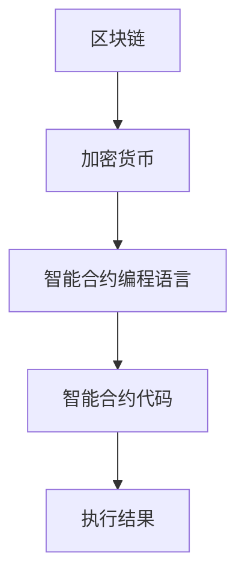

                 

关键词：智能合约，区块链，加密货币，技术优势，开发实践

> 摘要：本文旨在探讨利用技术优势进行智能合约开发的实践与挑战。通过对智能合约的基本概念、核心算法原理以及数学模型的详细介绍，结合项目实践和实际应用场景，全面解析智能合约开发的各个方面，为开发者提供一套完整的技术指导。

## 1. 背景介绍

智能合约是一种运行在区块链上的自执行合同，通过代码定义了参与方之间的权利和义务。智能合约的出现，极大地改变了传统合同执行的流程，降低了交易成本，提高了交易效率，因此在区块链技术中占据了重要的地位。本文将围绕智能合约的开发，探讨其核心技术、实现方法以及应用场景，以期为开发者提供有价值的参考。

## 2. 核心概念与联系

智能合约的核心概念包括：

- **区块链**：一种去中心化的数据库，能够实现数据的安全存储和可靠传输。
- **加密货币**：基于区块链技术发行的数字货币，如比特币、以太坊等。
- **智能合约编程语言**：如Solidity、Vyper等，用于编写智能合约的代码。

智能合约的架构如图所示：



### 2.1 区块链与加密货币的关系

区块链是智能合约的基础设施，提供了一种去中心化的、不可篡改的账本服务。加密货币则是在区块链上发行的数字货币，如比特币、以太坊等，它们是智能合约执行过程中价值的载体。

### 2.2 智能合约编程语言

智能合约编程语言用于编写智能合约代码，这些代码在区块链网络中执行。常见的智能合约编程语言包括Solidity和Vyper。Solidity是以太坊的官方编程语言，而Vyper则是一种更注重安全性的智能合约编程语言。

## 3. 核心算法原理 & 具体操作步骤

### 3.1 算法原理概述

智能合约的核心算法原理是基于区块链的共识机制。共识机制是区块链网络中节点之间达成一致的方式，如工作量证明（PoW）、权益证明（PoS）等。智能合约代码在区块链网络中执行，依赖于共识机制提供的计算资源。

### 3.2 算法步骤详解

智能合约的开发步骤主要包括以下几个环节：

1. **需求分析**：明确智能合约的功能需求，包括参与方、交易规则、数据存储等。
2. **设计智能合约架构**：根据需求分析，设计智能合约的架构，包括合约的模块划分、接口定义等。
3. **编写智能合约代码**：使用智能合约编程语言，编写实现功能的代码。
4. **代码审核与测试**：对编写的智能合约代码进行审核，确保其安全性和可靠性。然后进行测试，验证代码的功能是否符合预期。
5. **部署智能合约**：将审核通过、测试通过的智能合约代码部署到区块链网络中，使其可以执行。
6. **持续维护与更新**：根据实际应用情况，对智能合约进行维护和更新，修复潜在的问题。

### 3.3 算法优缺点

智能合约的算法具有以下几个优点：

- **去中心化**：智能合约运行在去中心化的区块链网络中，降低了信任成本。
- **不可篡改**：智能合约一旦部署，其代码和数据将永久存储在区块链上，不可篡改。
- **自动化执行**：智能合约代码在区块链上自动执行，无需人工干预。

然而，智能合约也存在一些缺点：

- **安全性风险**：智能合约代码一旦出现漏洞，可能被攻击者利用，导致损失。
- **性能瓶颈**：智能合约的执行速度和扩展性受到区块链网络性能的限制。
- **开发难度**：智能合约开发需要掌握区块链技术和编程语言，对开发者有较高的要求。

### 3.4 算法应用领域

智能合约在金融、物流、供应链、版权保护等领域具有广泛的应用前景。以下是一些具体的案例：

- **金融领域**：智能合约可以用于代币发行、众筹、资产管理等。
- **物流领域**：智能合约可以用于追踪物流信息、支付货款等。
- **供应链领域**：智能合约可以用于管理供应链中的交易，确保交易的透明性和可信度。
- **版权保护领域**：智能合约可以用于版权交易，确保版权的合法性和收益分配。

## 4. 数学模型和公式 & 详细讲解 & 举例说明

### 4.1 数学模型构建

智能合约的数学模型主要包括以下几个部分：

- **状态转移模型**：描述智能合约的状态如何随时间变化。
- **安全模型**：分析智能合约的安全性，包括防范恶意攻击的方法。
- **收益模型**：计算智能合约运行过程中各方的收益。

### 4.2 公式推导过程

智能合约的数学公式推导过程涉及复杂的数学计算。以下是一个简单的例子：

$$
\text{价值转移} = \frac{\text{总价值}}{\text{参与方数量}}
$$

这个公式描述了在智能合约中，总价值如何按比例分配给各参与方。

### 4.3 案例分析与讲解

以一个简单的众筹智能合约为例，分析其数学模型和公式推导过程。该智能合约的目标是筹集一定金额的资金，项目发起人和参与者可以通过智能合约进行投资和收益分配。

- **状态转移模型**：初始状态为项目未启动，随着参与者投资的增加，智能合约状态转移到项目启动。
- **安全模型**：智能合约需确保资金的安全，防止恶意攻击者提取资金。
- **收益模型**：根据参与者的投资金额，计算其收益比例。

## 5. 项目实践：代码实例和详细解释说明

### 5.1 开发环境搭建

在开发智能合约之前，需要搭建相应的开发环境。以下是一个简单的开发环境搭建步骤：

1. 安装Go语言环境。
2. 安装Golang区块链框架（如Geth）。
3. 安装智能合约编程语言（如Solidity）。

### 5.2 源代码详细实现

以下是一个简单的智能合约代码示例，实现一个简单的众筹功能：

```solidity
pragma solidity ^0.8.0;

contract Crowdfunding {
    address public owner;
    uint public target;
    uint public deadline;
    uint public raised;
    
    mapping(address => uint) public contributions;
    
    event Funded(address contributor, uint amount);
    
    constructor(uint _target, uint _deadline) {
        owner = msg.sender;
        target = _target;
        deadline = _deadline;
    }
    
    function contribute() public payable {
        require(block.timestamp < deadline, "Deadline has passed");
        require(contributions[msg.sender] == 0, "Cannot contribute twice");
        
        uint amount = msg.value;
        contributions[msg.sender] = amount;
        raised += amount;
        emit Funded(msg.sender, amount);
    }
    
    function withdraw() public {
        require(msg.sender == owner, "Only the owner can withdraw");
        require(raised >= target, "Target not reached");
        
        payable(owner).transfer(raised);
    }
}
```

### 5.3 代码解读与分析

这段代码实现了一个简单的众筹智能合约，主要功能如下：

- **构造函数**：设置合约的创建者（owner）、目标筹集金额（target）和众筹截止日期（deadline）。
- **contribute函数**：用于参与者投资，投资金额存储在contributions映射中，并且将投资金额累加到raised变量。
- **Funded事件**：当参与者投资成功时，触发Funded事件，记录投资者的信息。
- **withdraw函数**：当众筹成功时，项目发起者可以通过此函数提取筹集到的资金。

### 5.4 运行结果展示

通过智能合约开发工具（如Remix），可以模拟智能合约的执行过程。以下是一个运行结果示例：

1. **部署智能合约**：在Remix中部署该智能合约，得到合约地址。
2. **投资**：参与者可以向合约地址发送以太币进行投资。
3. **提取资金**：当众筹成功时，项目发起者可以通过withdraw函数提取筹集到的资金。

## 6. 实际应用场景

智能合约在实际应用场景中具有广泛的应用价值，以下是一些典型的应用场景：

- **金融领域**：智能合约可以用于自动化交易、贷款、保险等金融服务。
- **物流领域**：智能合约可以用于管理物流信息、支付货款等。
- **供应链领域**：智能合约可以用于管理供应链中的交易，确保交易的透明性和可信度。
- **版权保护领域**：智能合约可以用于版权交易，确保版权的合法性和收益分配。

### 6.1 金融领域

智能合约在金融领域具有广泛的应用，如：

- **代币发行**：智能合约可以用于自动化代币发行，确保代币分配的透明性和可信度。
- **众筹**：智能合约可以用于自动化众筹项目，确保资金的合法使用。
- **资产管理**：智能合约可以用于自动化资产管理，提高资产管理的效率和透明度。

### 6.2 物流领域

智能合约在物流领域可以用于：

- **物流信息追踪**：智能合约可以用于自动化追踪物流信息，提高物流信息的透明度和可信度。
- **支付货款**：智能合约可以用于自动化支付货款，确保货款支付的及时性和准确性。

### 6.3 供应链领域

智能合约在供应链领域可以用于：

- **供应链管理**：智能合约可以用于自动化管理供应链中的交易，确保交易的透明性和可信度。
- **供应链融资**：智能合约可以用于自动化供应链融资，提高融资的效率和安全性。

### 6.4 未来应用展望

随着区块链技术的发展，智能合约的应用领域将不断扩大。未来，智能合约将在以下几个方面发挥更大的作用：

- **公共服务**：智能合约可以用于自动化公共服务，提高公共服务的效率和质量。
- **社会治理**：智能合约可以用于自动化社会治理，提高社会治理的透明度和公信力。
- **数字身份**：智能合约可以用于自动化数字身份管理，提高数字身份的安全性和可信度。

## 7. 工具和资源推荐

### 7.1 学习资源推荐

- **区块链入门书籍**：《区块链技术指南》、《区块链：从数字货币到智能合约》。
- **智能合约开发教程**：以太坊官方文档、Vyper官方文档。
- **在线课程**：Coursera、edX等平台上的区块链和智能合约课程。

### 7.2 开发工具推荐

- **智能合约开发环境**：Remix、Truffle、Hardhat。
- **区块链节点工具**：Geth、Nethermind、Parity。
- **测试网络**：Ropsten、Rinkeby、Kovan等。

### 7.3 相关论文推荐

- **智能合约安全性**：《智能合约安全性：挑战与解决方案》。
- **区块链性能优化**：《区块链性能优化：技术与方法》。
- **智能合约应用场景**：《智能合约：从金融到非金融领域的应用》。

## 8. 总结：未来发展趋势与挑战

智能合约作为一种新兴技术，具有广泛的应用前景。未来，智能合约将在以下几个方面取得突破：

- **安全性**：随着区块链技术的发展，智能合约的安全性问题将得到进一步解决。
- **性能优化**：智能合约的性能瓶颈将得到优化，提高其执行效率和扩展性。
- **跨链互操作性**：智能合约将实现跨链互操作，实现不同区块链之间的数据交换和功能集成。

然而，智能合约也面临着一些挑战：

- **开发难度**：智能合约开发需要较高的技术门槛，开发者需不断学习和提升技能。
- **监管政策**：智能合约的监管政策尚未明确，开发者需密切关注政策变化，确保合规性。

未来，智能合约将在金融、物流、供应链等领域发挥更大的作用，推动社会生产力的提升。

## 9. 附录：常见问题与解答

### 9.1 什么是智能合约？

智能合约是一种运行在区块链上的自执行合同，通过代码定义了参与方之间的权利和义务。

### 9.2 智能合约有哪些优点？

智能合约的优点包括去中心化、不可篡改、自动化执行等。

### 9.3 智能合约有哪些应用领域？

智能合约在金融、物流、供应链、版权保护等领域具有广泛的应用。

### 9.4 智能合约开发有哪些挑战？

智能合约开发面临的挑战包括安全性、性能优化、开发难度等。

### 9.5 如何学习智能合约开发？

可以通过阅读相关书籍、参加在线课程、实践项目等方式学习智能合约开发。

---

作者：禅与计算机程序设计艺术 / Zen and the Art of Computer Programming
----------------------------------------------------------------
<|end_of_news_template|> 

### 总结

本文以《利用技术优势进行智能合约开发》为题，深入探讨了智能合约的基本概念、核心算法原理、数学模型、开发实践以及实际应用场景。通过详细的步骤解析和代码实例，为开发者提供了全面的智能合约开发指南。同时，文章还分析了智能合约在各个领域的应用前景，并提出了未来发展趋势和面临的挑战。

智能合约作为一种新兴技术，其应用领域正在不断扩展。在金融、物流、供应链等领域，智能合约正逐渐成为推动生产力提升的重要工具。然而，智能合约的安全性、性能优化和开发难度等问题仍需持续关注和解决。

未来，随着区块链技术的不断发展，智能合约将迎来更加广泛的应用。开发者需不断学习和提升技能，以应对智能合约开发中的挑战。同时，监管政策的逐步完善也将为智能合约的发展提供更加稳定的制度保障。

在此，感谢读者对本文的关注，希望本文能对您在智能合约开发领域的学习和实践中提供帮助。如果您有任何疑问或建议，欢迎在评论区留言交流。让我们一起探索智能合约的无限可能，共创美好未来！作者：禅与计算机程序设计艺术 / Zen and the Art of Computer Programming。

