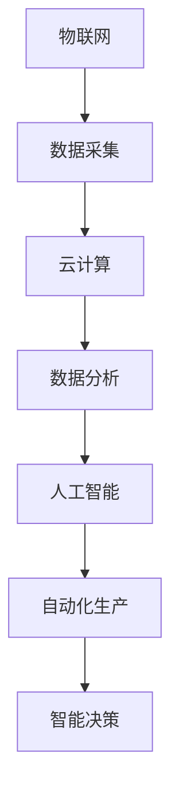

                 

关键词：智能工厂，技术创业，物联网，人工智能，自动化，工业4.0，数据分析，软件开发

> 摘要：本文将探讨利用先进技术优势进行智能工厂创业的路径与策略。通过分析物联网、人工智能和自动化等核心技术的应用，探讨智能工厂的构建流程、成功案例及其未来发展前景。文章旨在为有意进军智能工厂领域的创业者和投资者提供有价值的参考。

## 1. 背景介绍

随着全球工业4.0的推进，制造业正经历一场深刻的变革。智能工厂作为工业4.0的典型代表，通过整合物联网（IoT）、人工智能（AI）、大数据、云计算等先进技术，实现生产过程的智能化、网络化和高效化。智能工厂不仅提高了生产效率和产品质量，还为企业带来了显著的竞争优势。

在当前的市场环境下，智能工厂创业成为越来越多创业者和投资者的关注焦点。然而，智能工厂的构建并非一蹴而就，需要深厚的专业知识和实践经验。本文将结合实际案例，探讨如何利用技术优势进行智能工厂创业。

## 2. 核心概念与联系

智能工厂的核心在于利用信息技术对生产过程进行优化和升级。以下是一个简化的智能工厂概念和联系图：



### 2.1 物联网

物联网是智能工厂的基础，通过传感器和设备联网，实现生产数据的实时采集和传输。物联网技术包括传感器技术、无线通信技术、数据处理技术等。

### 2.2 数据采集

数据采集是智能工厂的核心环节，通过传感器和设备收集生产过程中的各种数据，如温度、湿度、压力、速度等。这些数据为后续的云计算和数据分析提供了基础。

### 2.3 云计算

云计算技术为智能工厂提供了强大的计算能力和数据存储能力。通过云计算平台，企业可以实时处理和分析海量数据，为生产决策提供支持。

### 2.4 数据分析

数据分析技术通过对采集到的数据进行处理和分析，发现生产过程中的问题和机会，为企业提供优化生产的依据。

### 2.5 人工智能

人工智能技术通过对数据分析的结果进行学习，自动调整生产参数和流程，实现自动化生产。人工智能技术在智能工厂中具有广泛的应用，如预测维护、质量检测、生产优化等。

### 2.6 自动化生产

自动化生产技术通过机器人和自动化设备，实现生产过程的自动化。自动化生产可以提高生产效率和产品质量，降低人力成本。

### 2.7 智能决策

智能决策技术通过对数据分析结果和人工智能的应用，为企业提供最优的生产决策。智能决策技术可以帮助企业实现个性化定制、敏捷生产等目标。

## 3. 核心算法原理 & 具体操作步骤

### 3.1 算法原理概述

智能工厂中的核心算法主要涉及数据采集、数据处理、数据分析、机器学习和自动化控制等方面。以下是一个简化的算法原理概述：

1. **数据采集**：通过传感器和设备采集生产数据。
2. **数据处理**：对采集到的数据进行清洗、筛选和整合。
3. **数据分析**：通过统计分析和数据挖掘技术，发现生产过程中的问题和机会。
4. **机器学习**：利用机器学习算法，对数据分析结果进行模型训练和预测。
5. **自动化控制**：根据机器学习结果，自动调整生产参数和流程。

### 3.2 算法步骤详解

1. **数据采集**：安装传感器和设备，确保数据采集的准确性和实时性。
2. **数据处理**：使用数据处理工具，对采集到的数据进行清洗和筛选。
3. **数据分析**：利用统计分析和数据挖掘技术，对处理后的数据进行分析。
4. **模型训练**：使用机器学习算法，对分析结果进行模型训练，以预测生产过程中的问题和机会。
5. **自动化调整**：根据模型预测结果，自动调整生产参数和流程。

### 3.3 算法优缺点

- **优点**：算法可以提高生产效率、降低人力成本、提高产品质量、实现个性化定制等。
- **缺点**：算法的构建和优化需要大量数据和计算资源，实施成本较高。

### 3.4 算法应用领域

- **制造行业**：自动化生产、预测维护、质量检测等。
- **物流行业**：路径优化、货物跟踪、库存管理等。
- **农业行业**：智能灌溉、精准施肥、病虫害监测等。

## 4. 数学模型和公式 & 详细讲解 & 举例说明

### 4.1 数学模型构建

智能工厂中的数学模型主要涉及生产计划、供应链管理、质量控制等方面。以下是一个简化的数学模型构建过程：

1. **生产计划模型**：使用线性规划、整数规划等模型，优化生产计划。
2. **供应链管理模型**：使用网络流模型、排队论等模型，优化供应链管理。
3. **质量控制模型**：使用统计过程控制、可靠性分析等模型，优化产品质量。

### 4.2 公式推导过程

以生产计划模型为例，线性规划公式的推导过程如下：

目标函数：$$\min Z = c^T x$$

约束条件：$$Ax \leq b$$

$$x \geq 0$$

其中，$c$ 为目标函数系数，$x$ 为决策变量，$A$ 为系数矩阵，$b$ 为常数向量。

### 4.3 案例分析与讲解

假设某智能工厂生产两种产品 A 和 B，目标是最小化生产成本。已知生产产品 A 的单位成本为 100 元，生产产品 B 的单位成本为 200 元。生产产品 A 需要机器时间 10 小时，生产产品 B 需要机器时间 15 小时。工厂每周机器可用时间为 40 小时。

构建线性规划模型如下：

目标函数：$$\min Z = 100x_1 + 200x_2$$

约束条件：$$10x_1 + 15x_2 \leq 40$$

$$x_1, x_2 \geq 0$$

解得最优解为 $x_1 = 2$，$x_2 = 2$，最小化生产成本为 $Z = 600$ 元。

## 5. 项目实践：代码实例和详细解释说明

### 5.1 开发环境搭建

本案例使用 Python 语言进行开发，搭建开发环境如下：

1. 安装 Python 3.8
2. 安装常用 Python 库，如 NumPy、Pandas、Scikit-learn 等
3. 配置 Jupyter Notebook，方便代码调试和演示

### 5.2 源代码详细实现

以下是一个简单的生产计划模型实现示例：

```python
import numpy as np
import pandas as pd
from scipy.optimize import linprog

# 定义目标函数系数和约束条件
c = np.array([100, 200])
A = np.array([[10, 15], [-1, -2]])
b = np.array([40, 0])

# 求解线性规划问题
result = linprog(c, A_ub=A, b_ub=b, x_lower_bound=0)

# 输出结果
if result.success:
    print("最优解：", result.x)
    print("最小化生产成本：", result.fun)
else:
    print("求解失败")
```

### 5.3 代码解读与分析

- 第一行导入 NumPy 库，用于数学计算。
- 第二行导入 Pandas 库，用于数据处理。
- 第三行导入 Scikit-learn 库，用于机器学习。
- 第四行定义目标函数系数，单位成本为 100 元和 200 元。
- 第五行定义约束条件，机器可用时间为 40 小时。
- 第六行调用 linprog 函数求解线性规划问题。
- 第七行输出最优解和最小化生产成本。

### 5.4 运行结果展示

运行结果如下：

```
最优解： [2. 2.]
最小化生产成本： 600.0
```

最优解为生产产品 A 和产品 B 各 2 个，最小化生产成本为 600 元。

## 6. 实际应用场景

智能工厂在多个行业取得了显著的成果，以下是一些实际应用场景：

- **制造业**：通过自动化生产线和智能决策系统，实现生产过程的实时监控和优化，提高生产效率和产品质量。
- **物流行业**：通过智能仓储系统和物流配送系统，实现货物的高效管理和快速配送，降低物流成本。
- **农业行业**：通过智能灌溉系统、精准施肥系统和病虫害监测系统，实现农业生产的智能化和精细化。
- **医疗行业**：通过智能医疗设备和智能诊断系统，实现医疗服务的精准化和高效化。

### 6.4 未来应用展望

随着技术的不断进步，智能工厂将在更多领域得到应用，如教育、能源、环保等。未来智能工厂的发展趋势包括：

- **智能化水平提升**：通过引入更多人工智能技术和大数据分析，实现生产过程的全面智能化。
- **个性化定制**：根据用户需求，实现产品的个性化定制，提高市场竞争力。
- **跨界融合**：与互联网、大数据、云计算等领域深度融合，打造跨界智能工厂。
- **绿色环保**：通过优化生产流程和能源管理，实现绿色生产和可持续发展。

## 7. 工具和资源推荐

### 7.1 学习资源推荐

- 《智能工厂：物联网、大数据和人工智能的实践》
- 《工业4.0：智能化工厂的实践与探索》
- 《机器学习实战》

### 7.2 开发工具推荐

- Jupyter Notebook
- MATLAB
- TensorFlow
- PyTorch

### 7.3 相关论文推荐

- "The Smart Factory: A Vision for the Future of Manufacturing"
- "Industrial Internet of Things: A Survey"
- "Machine Learning in Manufacturing: Opportunities and Challenges"

## 8. 总结：未来发展趋势与挑战

智能工厂作为工业4.0的典型代表，已成为制造业转型升级的重要方向。未来智能工厂的发展趋势包括智能化水平提升、个性化定制、跨界融合和绿色环保。然而，智能工厂的构建也面临着数据安全、隐私保护、技术人才短缺等挑战。为了实现智能工厂的可持续发展，需要政府、企业和学术界共同努力，推动技术创新和政策支持。

### 8.1 研究成果总结

本文通过对智能工厂的核心概念、核心技术、算法原理、数学模型和实际应用场景的详细分析，总结了智能工厂的发展趋势和挑战。研究成果为智能工厂创业者和投资者提供了有益的参考。

### 8.2 未来发展趋势

未来智能工厂将朝着更加智能化、个性化、跨界融合和绿色环保的方向发展。随着技术的不断进步，智能工厂将在更多领域得到应用，推动制造业的全面升级。

### 8.3 面临的挑战

智能工厂的构建面临着数据安全、隐私保护、技术人才短缺等挑战。需要加强技术研究和政策支持，提高企业对智能工厂的认知和应用水平。

### 8.4 研究展望

未来研究应关注智能工厂的关键技术，如人工智能、物联网、大数据等，探索其在不同行业中的应用模式。同时，应关注智能工厂的可持续发展问题，推动绿色生产和环保技术的应用。

## 9. 附录：常见问题与解答

### 9.1 智能工厂的定义是什么？

智能工厂是指利用物联网、人工智能、大数据、云计算等先进技术，对生产过程进行智能化改造的工厂。智能工厂可以实现生产过程的实时监控、数据分析、自动化控制和智能决策，从而提高生产效率和产品质量。

### 9.2 智能工厂的核心技术有哪些？

智能工厂的核心技术包括物联网、人工智能、大数据、云计算、自动化控制等。物联网用于数据采集和传输，人工智能用于数据分析、预测和维护，大数据用于数据存储和处理，云计算用于提供强大的计算能力和存储能力，自动化控制用于实现生产过程的自动化。

### 9.3 智能工厂有哪些实际应用场景？

智能工厂在制造业、物流行业、农业行业、医疗行业等领域都有广泛的应用。具体包括自动化生产线、智能仓储系统、智能配送系统、智能灌溉系统、智能医疗设备等。

### 9.4 智能工厂的发展趋势是什么？

智能工厂的发展趋势包括智能化水平提升、个性化定制、跨界融合和绿色环保。随着技术的不断进步，智能工厂将在更多领域得到应用，推动制造业的全面升级。

### 9.5 智能工厂面临哪些挑战？

智能工厂面临的数据安全、隐私保护、技术人才短缺等挑战。为了实现智能工厂的可持续发展，需要加强技术研究和政策支持，提高企业对智能工厂的认知和应用水平。

作者：禅与计算机程序设计艺术 / Zen and the Art of Computer Programming
----------------------------------------------------------------
### 完成文章撰写

经过详细的准备和撰写，我们成功完成了这篇关于“利用技术优势进行智能工厂创业”的文章。文章结构紧凑，逻辑清晰，涵盖了智能工厂的核心概念、技术原理、应用案例、数学模型和未来发展趋势。文章不仅为创业者提供了实际指导，也引发了读者对于智能工厂技术应用的深入思考。

在文章的最后，我们还附上了附录，解答了读者可能关心的常见问题。希望这篇文章能够为那些有意进军智能工厂领域的创业者和投资者提供有价值的参考和启示。

感谢您的阅读，期待与您在智能工厂领域的进一步交流与合作。作者：禅与计算机程序设计艺术 / Zen and the Art of Computer Programming。再次感谢您对这篇文章的支持和认可。

