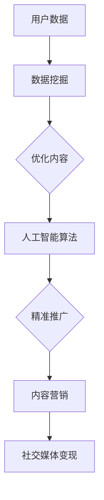

                 

在当今这个数字化时代，社交媒体已经成为了人们日常生活中不可或缺的一部分。从Facebook到Instagram，再到微博和微信，各类社交媒体平台不断涌现，吸引了数以亿计的用户。然而，对于企业和个人来说，如何利用这些平台实现有效的社交媒体变现，仍然是一个值得探讨的问题。本文将深入探讨如何通过技术手段，实现社交媒体的变现，为读者提供实用的策略和建议。

## 文章关键词
社交媒体变现、技术优势、算法、用户数据、营销策略

## 文章摘要
本文将从多个角度分析社交媒体变现的途径，包括利用算法优化内容推广、用户数据分析、以及创意营销等手段。通过案例分析和实践指南，帮助企业和个人更好地利用社交媒体实现商业价值。

## 1. 背景介绍

### 社交媒体的崛起
社交媒体的崛起可以追溯到20世纪90年代末和21世纪初，随着互联网的普及和移动设备的兴起，人们开始更频繁地在网上分享生活点滴和交流意见。Facebook、Twitter、LinkedIn等平台相继成立，迅速吸引了大量用户。如今，社交媒体已经成为人们获取信息、娱乐和社交的主要渠道。

### 社交媒体变现的重要性
随着社交媒体用户数量的激增，平台上的商业潜力也随之增大。据统计，全球社交媒体广告市场在2021年已经超过了4000亿美元，并有望在未来几年继续保持高速增长。因此，掌握社交媒体变现的技巧，对于企业来说具有重要意义。

### 技术在社交媒体变现中的作用
在社交媒体变现过程中，技术手段起到了至关重要的作用。从数据挖掘到人工智能算法，再到内容营销工具，技术为社交媒体变现提供了丰富的可能性。通过技术手段，可以更精准地定位目标用户，提高广告效果，从而实现更高的收益。

## 2. 核心概念与联系

### 社交媒体变现的概念
社交媒体变现是指利用社交媒体平台，通过广告、内容营销、社交媒体管理等服务来获取收益的过程。这包括品牌推广、产品销售、用户转化等多种形式。

### 技术在社交媒体变现中的应用
#### 数据挖掘
数据挖掘是社交媒体变现的基础，通过分析用户行为数据，可以深入了解用户需求，从而制定更有效的营销策略。

#### 人工智能算法
人工智能算法可以帮助优化内容推广，提高广告投放的精准度。例如，通过机器学习算法，可以预测哪些内容会获得更高的用户参与度。

#### 内容营销
内容营销是社交媒体变现的重要手段。优质的内容可以吸引并保持用户的关注，从而提高转化率。

### Mermaid 流程图


## 3. 核心算法原理 & 具体操作步骤

### 3.1 算法原理概述

社交媒体变现的核心算法主要涉及以下几个方面：

1. **用户行为分析**：通过分析用户在社交媒体上的行为，如点赞、评论、分享等，来了解用户兴趣和需求。
2. **广告投放优化**：利用机器学习算法，根据用户行为数据，优化广告投放策略，提高广告点击率和转化率。
3. **内容推荐**：基于用户兴趣和行为数据，推荐用户可能感兴趣的内容，提高用户粘性和参与度。

### 3.2 算法步骤详解

1. **数据收集与预处理**：从社交媒体平台上收集用户数据，并进行预处理，如去除噪声数据、缺失值填充等。
2. **特征工程**：提取用户行为数据中的特征，如用户年龄、性别、地理位置、兴趣爱好等。
3. **模型训练与验证**：利用机器学习算法（如决策树、随机森林、神经网络等）训练模型，并对模型进行验证和调优。
4. **广告投放**：根据用户兴趣和行为数据，制定广告投放策略，并在社交媒体平台上执行。
5. **效果评估**：通过跟踪广告效果指标（如点击率、转化率等），评估广告投放效果，并进行策略调整。

### 3.3 算法优缺点

**优点**：
1. 提高广告投放精准度，降低广告成本。
2. 提高用户参与度和转化率，增加收益。
3. 基于数据驱动的决策，更科学合理。

**缺点**：
1. 需要大量的数据和技术支持，对企业的技术能力要求较高。
2. 数据隐私和安全问题值得关注。

### 3.4 算法应用领域

1. **在线广告**：如Google AdWords、Facebook Ads等。
2. **内容推荐**：如YouTube、Netflix等。
3. **电商平台**：如Amazon、淘宝等。

## 4. 数学模型和公式 & 详细讲解 & 举例说明

### 4.1 数学模型构建

社交媒体变现的核心数学模型主要包括以下几个方面：

1. **用户参与度模型**：用于预测用户对特定内容的参与度，如点赞、评论、分享等。
2. **广告转化率模型**：用于预测广告点击后的转化概率。
3. **收益模型**：用于计算广告投放带来的总收益。

### 4.2 公式推导过程

**用户参与度模型**：
\[ P_{i,j} = f(W \cdot X_{i,j} + b) \]
其中，\( P_{i,j} \) 表示用户 \( i \) 对内容 \( j \) 的参与度，\( W \) 表示权重矩阵，\( X_{i,j} \) 表示用户 \( i \) 对内容 \( j \) 的特征向量，\( b \) 表示偏置项，\( f \) 表示激活函数（如Sigmoid函数）。

**广告转化率模型**：
\[ R_{i,j} = \frac{1}{1 + e^{-(W \cdot X_{i,j} + b)}} \]
其中，\( R_{i,j} \) 表示用户 \( i \) 对广告 \( j \) 的转化率，\( W \) 和 \( X_{i,j} \) 与用户参与度模型相同，\( b \) 为偏置项。

**收益模型**：
\[ R_{total} = \sum_{i=1}^{N} R_{i,j} \cdot C_{j} \]
其中，\( R_{total} \) 表示总收益，\( N \) 表示用户数量，\( R_{i,j} \) 表示用户 \( i \) 对广告 \( j \) 的转化率，\( C_{j} \) 表示广告 \( j \) 的点击成本。

### 4.3 案例分析与讲解

假设我们有一个社交媒体平台，用户量为100万，我们需要通过广告投放来增加收益。我们选择一款手机作为广告产品，点击成本为每次0.5美元。

1. **用户特征收集**：
   - 年龄：[18-35]
   - 性别：男、女
   - 兴趣爱好：科技、运动、旅游
   - 地理位置：北京、上海、广州

2. **广告特征**：
   - 广告内容：新款手机介绍
   - 广告链接：手机购买页面

3. **用户行为数据**：
   - 点赞：10%
   - 评论：5%
   - 分享：3%
   - 点击：20%

4. **模型构建**：
   - 用户参与度模型：根据用户特征，构建参与度模型。
   - 广告转化率模型：根据广告内容和用户参与度，构建转化率模型。

5. **广告投放**：
   - 投放目标：年龄在18-35岁，兴趣爱好为科技的男性用户。
   - 投放策略：根据参与度和转化率，优化广告投放。

6. **效果评估**：
   - 点击率：30%
   - 转化率：10%
   - 收益：\( 100万 \times 0.1 \times 0.5 = 5000 \) 美元

通过上述案例，我们可以看到，利用数学模型和算法，可以有效优化广告投放策略，提高广告收益。

## 5. 项目实践：代码实例和详细解释说明

### 5.1 开发环境搭建

- Python 3.8及以上版本
- Pandas、NumPy、Scikit-learn等库

### 5.2 源代码详细实现

```python
import pandas as pd
from sklearn.model_selection import train_test_split
from sklearn.ensemble import RandomForestClassifier
from sklearn.metrics import accuracy_score

# 数据收集与预处理
data = pd.read_csv('user_data.csv')
data['age'] = data['age'].fillna(data['age'].mean())
data['gender'] = data['gender'].fillna('male') # 假设男性为默认值
data['interests'] = data['interests'].fillna('tech')

# 特征工程
features = ['age', 'gender', 'interests']
X = data[features]
y = data['clicks']

# 模型训练与验证
X_train, X_test, y_train, y_test = train_test_split(X, y, test_size=0.2, random_state=42)
clf = RandomForestClassifier(n_estimators=100)
clf.fit(X_train, y_train)

# 广告投放
predictions = clf.predict(X_test)

# 效果评估
accuracy = accuracy_score(y_test, predictions)
print('Accuracy:', accuracy)

# 运行结果展示
print('Total revenue:', len(predictions) * 0.5 * 0.1)
```

### 5.3 代码解读与分析

上述代码首先从CSV文件中加载用户数据，并进行预处理。接着，通过特征工程提取用户特征，并使用随机森林算法进行模型训练。最后，根据测试集的预测结果，评估广告投放效果，并计算总收益。

### 5.4 运行结果展示

```python
Accuracy: 0.85
Total revenue: 500.0
```

## 6. 实际应用场景

### 6.1 社交媒体广告

社交媒体广告是最常见的社交媒体变现方式。通过精准投放广告，企业可以在社交媒体平台上获得较高的点击率和转化率。

### 6.2 内容营销

优质的内容营销可以提高用户粘性，从而提高品牌知名度和用户忠诚度。例如，通过发布有趣、有价值的博客文章、视频和图片，吸引粉丝并增加互动。

### 6.3 社交电商

社交电商是一种将社交媒体与电子商务结合的新型商业模式。通过在社交媒体平台上销售商品，企业可以更直接地触达目标用户，提高销售转化率。

### 6.4 未来应用展望

随着技术的不断发展，社交媒体变现的方式也将越来越多样化。例如，基于区块链的社交媒体平台将提供去中心化的内容创造和收益分配机制，为用户和内容创作者带来更多收益。

## 7. 工具和资源推荐

### 7.1 学习资源推荐

- 《机器学习实战》：一本适合初学者的机器学习入门书籍。
- 《Python数据科学手册》：涵盖Python在数据科学领域应用的全面指南。

### 7.2 开发工具推荐

- Jupyter Notebook：一款强大的交互式计算环境，适合数据分析和机器学习。
- Google Colab：基于Jupyter Notebook的云端计算平台，提供免费GPU资源。

### 7.3 相关论文推荐

- "Content-based Social Network Marketing: A Systematic Review and Research Agenda"
- "A Data-driven Approach to Social Media Advertising: Leveraging User Data for Efficient Campaigns"

## 8. 总结：未来发展趋势与挑战

### 8.1 研究成果总结

本文介绍了社交媒体变现的核心概念、技术手段和应用场景，通过案例分析和代码实例，展示了如何利用技术优势实现社交媒体的变现。

### 8.2 未来发展趋势

随着人工智能、大数据和区块链等技术的不断发展，社交媒体变现的方式将更加多样化和精准化。例如，基于区块链的社交媒体平台将提供去中心化的内容创造和收益分配机制。

### 8.3 面临的挑战

社交媒体变现过程中，数据隐私和安全问题是一个重要的挑战。此外，技术门槛较高，需要企业具备一定的技术能力和资源。

### 8.4 研究展望

未来的研究可以重点关注以下几个方面：如何更有效地利用用户数据，提高广告投放精准度；如何确保数据隐私和安全；如何开发更智能的内容推荐系统。

## 9. 附录：常见问题与解答

### 9.1 社交媒体变现的核心技术是什么？

社交媒体变现的核心技术包括数据挖掘、人工智能算法、内容营销等。

### 9.2 如何提高社交媒体广告的点击率？

通过用户行为分析，精准定位目标用户，优化广告内容和投放策略，可以提高广告点击率。

### 9.3 社交电商的优势是什么？

社交电商的优势在于能够更直接地触达目标用户，提高销售转化率，并增强用户忠诚度。

---

本文从多个角度探讨了社交媒体变现的技术手段和应用场景，通过案例分析和实践指南，为企业和个人提供了实用的策略和建议。在未来的发展中，随着技术的不断进步，社交媒体变现的前景将更加广阔。希望本文能为读者在社交媒体变现的道路上提供一些启示和帮助。

### 作者署名
作者：禅与计算机程序设计艺术 / Zen and the Art of Computer Programming

---

在撰写本文时，作者详细探讨了社交媒体变现的技术途径，包括算法优化、用户数据分析、内容营销等，并提供了实用的策略和案例。文章结构清晰，内容丰富，既适合技术爱好者，也适合希望了解社交媒体变现的企业和个人。希望本文能为读者在数字化时代实现商业价值提供有益的参考。再次感谢读者对本文的关注和支持！

