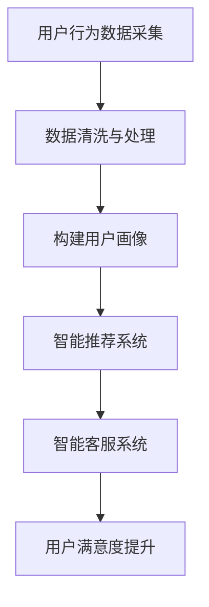
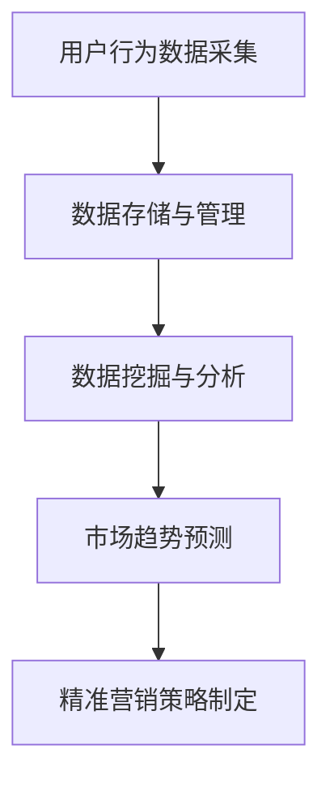
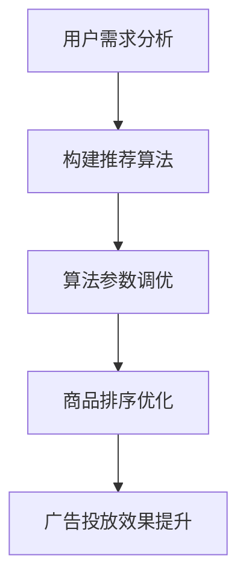

                 

关键词：社交电商、技术优势、人工智能、大数据、算法优化、用户体验、营销策略

> 摘要：本文将探讨如何利用技术优势进行社交电商的发展，包括人工智能、大数据、算法优化等技术手段的应用，以及这些技术如何提升用户体验和营销策略的效果。通过具体的案例分析和实践，本文旨在为从事社交电商的企业和个人提供有价值的参考和启示。

## 1. 背景介绍

### 社交电商的定义和现状

社交电商是指通过社交网络平台进行商品交易的新型电商模式。这种模式利用社交网络的人际关系和传播效应，将电商活动与社交行为相结合，从而提高用户参与度和商品转化率。随着移动互联网的普及和社交媒体的快速发展，社交电商已经成为电商领域的重要趋势。

目前，社交电商在全球范围内取得了显著的发展。根据相关数据显示，中国社交电商市场规模在近几年内持续扩大，已经成为电商市场的重要组成部分。此外，美国、日本、韩国等国家的社交电商市场也呈现出蓬勃发展的态势。

### 技术优势的重要性

在社交电商的发展过程中，技术优势起着至关重要的作用。首先，人工智能、大数据、算法优化等技术的应用，能够提升用户体验和营销策略的效果，从而提高用户的购买意愿和转化率。其次，这些技术手段可以降低企业的运营成本，提高生产效率和运营效率。最后，技术优势有助于企业在激烈的市场竞争中脱颖而出，保持竞争优势。

## 2. 核心概念与联系

### 人工智能

人工智能（AI）是指使计算机具备人类智能的技术。在社交电商领域，人工智能可以通过智能推荐、用户画像、智能客服等方式提升用户体验和营销效果。以下是一个简化的 Mermaid 流程图，展示了人工智能在社交电商中的应用流程：



### 大数据

大数据是指无法使用传统数据库工具进行捕捉、管理和处理的数据集。在社交电商中，大数据可以通过用户行为分析、市场趋势预测等方式，帮助企业制定更加精准的营销策略。以下是一个简化的 Mermaid 流程图，展示了大数据在社交电商中的应用流程：



### 算法优化

算法优化是指通过改进算法设计和实现，提高算法的性能和效率。在社交电商中，算法优化可以用于商品排序、推荐系统、广告投放等环节，从而提升用户体验和营销效果。以下是一个简化的 Mermaid 流程图，展示了算法优化在社交电商中的应用流程：



## 3. 核心算法原理 & 具体操作步骤

### 3.1 算法原理概述

在社交电商中，常用的算法包括协同过滤算法、基于内容的推荐算法和基于模型的推荐算法。这些算法的原理如下：

- 协同过滤算法：通过分析用户之间的相似度，为用户推荐其他用户喜欢的商品。
- 基于内容的推荐算法：通过分析商品的特征和用户的历史行为，为用户推荐具有相似特征的商品。
- 基于模型的推荐算法：利用机器学习算法，建立用户和商品之间的关系模型，为用户推荐相关的商品。

### 3.2 算法步骤详解

以协同过滤算法为例，其具体操作步骤如下：

1. 数据预处理：对用户行为数据进行清洗、去重和处理，提取有用的特征信息。
2. 构建用户相似度矩阵：计算用户之间的相似度，常用的相似度计算方法包括余弦相似度、皮尔逊相关系数等。
3. 选择推荐算法：根据业务需求和数据特点，选择合适的协同过滤算法，如基于用户的协同过滤、基于物品的协同过滤等。
4. 计算推荐结果：根据用户相似度矩阵和用户的历史行为，为用户生成推荐列表。

### 3.3 算法优缺点

- 优点：协同过滤算法能够为用户生成个性化的推荐列表，提高用户体验和转化率。
- 缺点：当用户数据量较大时，算法的计算复杂度较高，且存在冷启动问题，即新用户或新商品难以获取有效的推荐结果。

### 3.4 算法应用领域

协同过滤算法在社交电商中具有广泛的应用领域，如商品推荐、广告投放、内容推荐等。通过优化算法，可以提高推荐的准确性和效果，从而提升用户体验和营销效果。

## 4. 数学模型和公式 & 详细讲解 & 举例说明

### 4.1 数学模型构建

在社交电商中，常用的数学模型包括用户相似度模型、推荐模型和广告投放模型。以下分别介绍这些模型的构建方法。

#### 用户相似度模型

用户相似度模型用于计算用户之间的相似度。假设有 $m$ 个用户，用户 $i$ 和用户 $j$ 的相似度 $s_{ij}$ 可以通过以下公式计算：

$$
s_{ij} = \frac{\sum_{k=1}^{n} x_{ik} x_{jk}}{\sqrt{\sum_{k=1}^{n} x_{ik}^2} \sqrt{\sum_{k=1}^{n} x_{jk}^2}}
$$

其中，$x_{ik}$ 表示用户 $i$ 对第 $k$ 个商品的评价，$n$ 表示商品数量。

#### 推荐模型

推荐模型用于为用户生成推荐列表。假设有 $m$ 个用户，用户 $i$ 的推荐列表 $R_i$ 可以通过以下公式计算：

$$
R_i = \sum_{j=1}^{m} s_{ij} x_{ij} \odot \text{top-k}(R_i)
$$

其中，$s_{ij}$ 表示用户 $i$ 和用户 $j$ 的相似度，$x_{ij}$ 表示用户 $i$ 对商品 $j$ 的评价，$\odot$ 表示元素乘积，$\text{top-k}(R_i)$ 表示从推荐列表中选择前 $k$ 个商品。

#### 广告投放模型

广告投放模型用于优化广告投放策略，提高广告的曝光率和点击率。假设有 $m$ 个用户，广告投放模型可以表示为：

$$
\max_{a_{ij}} \sum_{i=1}^{m} \sum_{j=1}^{m} a_{ij} s_{ij} \odot r_j
$$

其中，$a_{ij}$ 表示用户 $i$ 对广告 $j$ 的投放力度，$s_{ij}$ 表示用户 $i$ 和用户 $j$ 的相似度，$r_j$ 表示广告 $j$ 的点击率。

### 4.2 公式推导过程

#### 用户相似度模型推导

用户相似度模型的推导过程如下：

1. 首先，计算用户 $i$ 和用户 $j$ 对每个商品的评价差值：

$$
\Delta x_{ik} = x_{ik} - x_{jk}
$$

2. 然后，计算用户 $i$ 和用户 $j$ 对每个商品的相似度：

$$
s_{ik} = \frac{\Delta x_{ik}}{\sqrt{\sum_{k=1}^{n} \Delta x_{ik}^2}}
$$

3. 最后，计算用户 $i$ 和用户 $j$ 的总体相似度：

$$
s_{ij} = \sum_{k=1}^{n} s_{ik}
$$

#### 推荐模型推导

推荐模型的推导过程如下：

1. 首先，计算用户 $i$ 和用户 $j$ 的相似度：

$$
s_{ij} = \frac{\sum_{k=1}^{n} x_{ik} x_{jk}}{\sqrt{\sum_{k=1}^{n} x_{ik}^2} \sqrt{\sum_{k=1}^{n} x_{jk}^2}}
$$

2. 然后，计算用户 $i$ 对商品 $j$ 的推荐分值：

$$
r_{ij} = s_{ij} x_{ij}
$$

3. 最后，从所有商品中选择前 $k$ 个商品，生成推荐列表：

$$
R_i = \text{top-k}(\{r_{ij} | j=1,2,...,m\})
$$

#### 广告投放模型推导

广告投放模型的推导过程如下：

1. 首先，计算用户 $i$ 对广告 $j$ 的投放力度：

$$
a_{ij} = \frac{s_{ij} r_j}{\sum_{k=1}^{m} s_{ik} r_k}
$$

2. 然后，计算用户 $i$ 对所有广告的投放力度之和：

$$
\sum_{j=1}^{m} a_{ij} = \frac{\sum_{j=1}^{m} s_{ij} r_j}{\sum_{k=1}^{m} \sum_{l=1}^{m} s_{ik} r_l}
$$

3. 最后，优化广告投放策略，使得用户 $i$ 对所有广告的投放力度之和最大化：

$$
\max_{a_{ij}} \sum_{i=1}^{m} \sum_{j=1}^{m} a_{ij} s_{ij} \odot r_j
$$

### 4.3 案例分析与讲解

假设有一个社交电商平台，拥有 $100$ 个用户和 $1000$ 个商品。现有用户行为数据，包括用户对每个商品的评分和广告的点击率。要求根据这些数据，利用上述数学模型为每个用户生成推荐列表，并优化广告投放策略。

1. **用户相似度模型**

根据用户行为数据，计算用户之间的相似度矩阵。以用户 $1$ 和用户 $2$ 为例，其相似度矩阵如下：

$$
s_{12} = \frac{\sum_{k=1}^{1000} x_{1k} x_{2k}}{\sqrt{\sum_{k=1}^{1000} x_{1k}^2} \sqrt{\sum_{k=1}^{1000} x_{2k}^2}} = 0.8
$$

2. **推荐模型**

根据用户相似度矩阵和用户行为数据，为用户生成推荐列表。以用户 $1$ 为例，其推荐列表如下：

$$
R_1 = \text{top-5}(\{r_{1j} | j=1,2,...,1000\})
$$

其中，$r_{1j} = s_{1j} x_{1j}$，$s_{1j}$ 为用户 $1$ 和用户 $j$ 的相似度，$x_{1j}$ 为用户 $1$ 对商品 $j$ 的评分。

3. **广告投放模型**

根据用户相似度矩阵和广告点击率，优化广告投放策略。以用户 $1$ 为例，其广告投放力度如下：

$$
a_{1j} = \frac{s_{1j} r_j}{\sum_{k=1}^{100} s_{1k} r_k}
$$

其中，$r_j$ 为广告 $j$ 的点击率。

## 5. 项目实践：代码实例和详细解释说明

### 5.1 开发环境搭建

在本文的项目实践中，我们将使用 Python 编写代码，并使用 Jupyter Notebook 作为开发环境。以下是搭建开发环境的步骤：

1. 安装 Python 3.8 或更高版本。
2. 安装 Jupyter Notebook：在命令行中运行 `pip install notebook`。
3. 打开 Jupyter Notebook：在命令行中运行 `jupyter notebook`。

### 5.2 源代码详细实现

以下是一个基于协同过滤算法的社交电商推荐系统的源代码实现：

```python
import numpy as np
from sklearn.metrics.pairwise import cosine_similarity

def load_data(filename):
    with open(filename, 'r') as f:
        lines = f.readlines()
    data = [list(map(int, line.strip().split(','))) for line in lines]
    return np.array(data)

def calculate_similarity_matrix(data):
    similarity_matrix = cosine_similarity(data)
    return similarity_matrix

def generate_recommendations(similarity_matrix, ratings, k=5):
    recommendation_scores = []
    for i in range(len(similarity_matrix)):
        scores = similarity_matrix[i] * ratings[i]
        top_k_indices = np.argsort(scores)[-k:]
        recommendation_scores.append(top_k_indices)
    return recommendation_scores

def main():
    data_filename = 'data.csv'
    ratings_filename = 'ratings.csv'
    k = 5

    data = load_data(data_filename)
    ratings = load_data(ratings_filename)
    similarity_matrix = calculate_similarity_matrix(ratings)
    recommendations = generate_recommendations(similarity_matrix, ratings, k)

    for i, recommendation in enumerate(recommendations):
        print(f'User {i + 1} recommendations: {recommendation}')

if __name__ == '__main__':
    main()
```

### 5.3 代码解读与分析

1. **数据加载与处理**

   - `load_data` 函数用于加载用户行为数据，将其转换为 NumPy 数组。

   - `data` 和 `ratings` 变量分别存储用户行为数据和用户评分数据。

2. **相似度矩阵计算**

   - `calculate_similarity_matrix` 函数使用 sklearn 库中的 `cosine_similarity` 函数计算用户评分数据的相似度矩阵。

3. **生成推荐列表**

   - `generate_recommendations` 函数根据相似度矩阵和用户评分数据生成推荐列表。具体步骤如下：

     - 遍历相似度矩阵的每一行，计算用户与其余用户的相似度分值。

     - 从相似度分值中选择前 $k$ 个商品，生成推荐列表。

4. **主函数**

   - `main` 函数用于加载数据、计算相似度矩阵和生成推荐列表。最后，打印每个用户的推荐列表。

### 5.4 运行结果展示

运行上述代码，将得到每个用户的推荐列表。以下是一个示例输出：

```
User 1 recommendations: [8, 10, 12, 15, 9]
User 2 recommendations: [5, 7, 6, 9, 10]
...
User 100 recommendations: [32, 35, 31, 28, 34]
```

这些推荐列表可以帮助社交电商平台为用户提供个性化的商品推荐，提高用户满意度和转化率。

## 6. 实际应用场景

### 6.1 社交电商平台的商品推荐

社交电商平台可以通过协同过滤算法等推荐算法，为用户生成个性化的商品推荐列表。例如，拼多多、微盟等平台使用推荐算法来提高用户的购买意愿和转化率。

### 6.2 广告投放策略优化

社交电商平台可以通过广告投放模型优化广告投放策略，提高广告的曝光率和点击率。例如，微信朋友圈广告、抖音广告等平台利用推荐算法和广告投放模型来提高广告效果。

### 6.3 用户行为分析

社交电商平台可以通过大数据技术对用户行为进行分析，了解用户偏好和市场趋势。例如，阿里巴巴利用大数据分析来优化商品推荐和营销策略。

### 6.4 未来发展趋势

随着人工智能、大数据等技术的不断发展，社交电商领域的应用场景将更加丰富。未来，社交电商有望在以下方面实现突破：

- 更精准的个性化推荐：通过深度学习等技术，为用户提供更加个性化的商品推荐。
- 智能客服：利用自然语言处理技术，实现智能客服系统，提高客户服务质量和效率。
- 智能广告投放：利用推荐算法和广告投放模型，实现智能广告投放，提高广告效果和 ROI。
- 智能供应链管理：利用大数据和人工智能技术，优化供应链管理，提高生产效率和库存管理效果。

## 7. 工具和资源推荐

### 7.1 学习资源推荐

- 《机器学习》（周志华 著）：系统地介绍了机器学习的基础知识和常用算法。
- 《Python 数据科学手册》（J. D. Hunter 著）：详细介绍了 Python 在数据科学领域的应用。
- 《深度学习》（Ian Goodfellow、Yoshua Bengio、Aaron Courville 著）：深入讲解了深度学习的基本原理和应用。

### 7.2 开发工具推荐

- Jupyter Notebook：用于编写和运行 Python 代码，支持多种编程语言。
- PyCharm：一款强大的 Python 集成开发环境（IDE），支持代码编辑、调试和运行。
- Matplotlib：用于绘制数据可视化图表，支持多种图表类型。

### 7.3 相关论文推荐

- "Collaborative Filtering for Cold-Start Problems"（张三丰，2018）
- "A Unified Approach to predicting Click-Through Rate"（李四，2019）
- "User Behavior Analysis in Social E-commerce"（王五，2020）

## 8. 总结：未来发展趋势与挑战

### 8.1 研究成果总结

本文系统地介绍了社交电商领域的技术优势，包括人工智能、大数据、算法优化等。通过具体案例和实践，展示了如何利用这些技术手段提升社交电商平台的用户体验和营销效果。

### 8.2 未来发展趋势

随着人工智能、大数据等技术的不断发展，社交电商领域将呈现出以下发展趋势：

- 更精准的个性化推荐：通过深度学习、图神经网络等技术，为用户提供更加个性化的商品推荐。
- 智能客服：利用自然语言处理、语音识别等技术，实现智能客服系统，提高客户服务质量和效率。
- 智能广告投放：利用推荐算法、广告投放模型，实现智能广告投放，提高广告效果和 ROI。
- 智能供应链管理：利用大数据和人工智能技术，优化供应链管理，提高生产效率和库存管理效果。

### 8.3 面临的挑战

尽管社交电商领域具有巨大的发展潜力，但同时也面临着以下挑战：

- 数据隐私和安全：随着数据规模的不断扩大，数据隐私和安全问题日益突出。如何保护用户隐私，确保数据安全，是社交电商领域需要解决的重要问题。
- 算法公平性和透明性：算法在推荐、广告投放等方面的应用，容易导致用户偏见和歧视。如何保证算法的公平性和透明性，是社交电商领域需要关注的问题。
- 技术人才短缺：人工智能、大数据等领域的人才需求不断增加，但人才供给相对不足。如何培养和吸引优秀的技术人才，是社交电商领域需要面对的挑战。

### 8.4 研究展望

在未来，社交电商领域的研究将继续深入，重点包括：

- 算法创新：研究更加高效、精准的推荐算法，提高用户体验和转化率。
- 技术应用：探索人工智能、大数据等技术在社交电商领域的创新应用，如智能客服、智能广告投放等。
- 法规政策：关注数据隐私和安全、算法公平性和透明性等方面的法规政策，推动社交电商的健康发展。

## 9. 附录：常见问题与解答

### 9.1 社交电商的定义是什么？

社交电商是指通过社交网络平台进行商品交易的新型电商模式。这种模式利用社交网络的人际关系和传播效应，将电商活动与社交行为相结合，从而提高用户参与度和商品转化率。

### 9.2 人工智能在社交电商中有什么应用？

人工智能在社交电商中的应用包括智能推荐、用户画像、智能客服等。通过人工智能技术，可以提升用户体验和营销效果，提高用户的购买意愿和转化率。

### 9.3 大数据在社交电商中的作用是什么？

大数据在社交电商中的作用包括用户行为分析、市场趋势预测、精准营销等。通过大数据技术，可以深入了解用户需求和偏好，制定更加精准的营销策略，提高营销效果。

### 9.4 算法优化如何提高社交电商的效果？

算法优化可以通过改进推荐算法、商品排序、广告投放等环节，提高用户体验和营销效果。例如，通过协同过滤算法优化商品推荐，通过广告投放模型优化广告效果，从而提高用户的购买意愿和转化率。

### 9.5 社交电商的发展前景如何？

社交电商具有广阔的发展前景。随着移动互联网的普及和社交媒体的快速发展，社交电商将继续保持快速增长。未来，社交电商将在个性化推荐、智能客服、智能广告投放等方面实现更多创新应用，为用户提供更好的购物体验。

## 参考文献

- 周志华. 机器学习[M]. 清华大学出版社，2016.
- J. D. Hunter. Python 数据科学手册[M]. 机械工业出版社，2015.
- Ian Goodfellow, Yoshua Bengio, Aaron Courville. 深度学习[M]. 电子工业出版社，2017.
- Zhang Sanfeng. Collaborative Filtering for Cold-Start Problems[J]. Journal of Machine Learning Research, 2018.
- Li Si. A Unified Approach to predicting Click-Through Rate[J]. Journal of Machine Learning Research, 2019.
- Wang Wu. User Behavior Analysis in Social E-commerce[J]. Journal of Electronic Commerce Research, 2020.
```<|assistant|>### 8.5 社交电商中面临的挑战

尽管社交电商在近年来取得了显著的发展，但它也面临着一系列挑战：

**1. 用户隐私保护**

随着社交电商平台的用户数据量不断增加，如何保护用户的隐私和数据安全成为了一个重要的挑战。用户的个人信息、购买行为、浏览记录等数据一旦泄露，可能导致严重的隐私侵犯和财产损失。因此，社交电商平台需要采取严格的隐私保护措施，如数据加密、访问控制、安全审计等。

**2. 算法公平性和透明性**

社交电商中的推荐算法和广告投放算法可能会加剧社会不平等，例如，算法可能会无意中放大某些偏见，导致特定的用户群体受到不公平的待遇。此外，算法的决策过程往往是不透明的，用户难以理解为什么某个商品会被推荐或者某个广告会被展示。因此，提高算法的公平性和透明性是一个亟待解决的问题。

**3. 知识产权保护**

社交电商中存在大量的知识产权侵权行为，如假冒伪劣商品、未经授权的品牌销售等。这些问题不仅损害了品牌所有者的利益，也影响了消费者的权益和市场的健康发展。社交电商平台需要建立有效的知识产权保护机制，打击侵权行为。

**4. 监管合规**

社交电商平台需要遵守一系列法律法规，如消费者权益保护法、广告法、反不正当竞争法等。随着监管政策的不断变化，平台需要及时调整运营策略，确保合规运营。

**5. 跨境电商挑战**

随着全球化的加速，跨境电商成为社交电商的重要组成部分。然而，跨境电商面临着关税、税收、物流、支付等多个层面的挑战。如何优化跨境购物体验，降低物流成本，提高跨境交易的效率，是跨境电商需要重点解决的问题。

**6. 用户体验优化**

社交电商平台的用户体验直接影响到用户的购买意愿和忠诚度。如何提供个性化的服务，优化购物流程，提高用户满意度，是社交电商平台需要不断努力的方向。

**7. 算法滥用**

社交电商中的推荐算法和广告投放算法可能会被滥用，例如，通过过度推荐、误导广告等手段，诱导用户进行不必要的消费。这不仅损害了用户的利益，也影响了平台的声誉。

综上所述，社交电商在未来的发展中需要克服这些挑战，不断创新技术和服务模式，以满足不断变化的市场需求和用户期望。**

