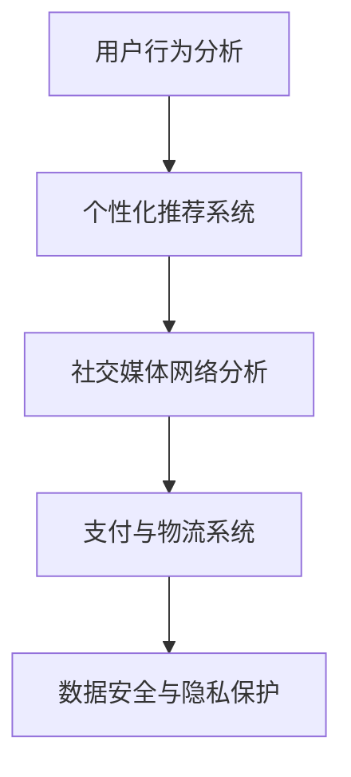
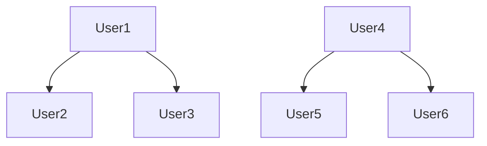

                 

社交电商作为电子商务领域的一个重要分支，近年来在全球范围内取得了显著的发展。随着社交媒体平台的兴起，消费者与商家之间的互动变得更加频繁和紧密。本文将探讨如何利用技术优势，进一步推动社交电商的发展，提升用户体验和商业效率。

> **关键词**：社交电商、技术优势、用户体验、商业效率

> **摘要**：本文将从技术角度出发，分析社交电商的现状和挑战，介绍关键技术概念及其应用，探讨数学模型和算法原理，并通过实际项目实践展示技术优势。最后，本文将对未来社交电商的发展趋势和面临的挑战进行展望。

## 1. 背景介绍

### 社交电商的定义和特点

社交电商，指的是通过社交媒体平台开展电子商务活动，利用社交网络的传播力和用户之间的互动性来促进商品的销售。与传统电商相比，社交电商具有以下特点：

- **用户参与度高**：用户在社交电商平台上不仅是消费者，还可以成为内容创造者和传播者，从而提高参与度。
- **社交互动性强**：社交电商平台通过用户评价、分享、点赞等社交互动方式，增强用户黏性和品牌认知。
- **个性化推荐**：利用大数据和人工智能技术，社交电商平台能够为用户提供个性化的商品推荐，提升购物体验。
- **跨界合作**：社交电商与传统零售、品牌商家的跨界合作，促进了产业的整合和创新。

### 社交电商的发展历程

- **起步阶段**：2000年代，随着社交媒体的兴起，Facebook、Twitter等平台逐渐融入电商功能。
- **快速成长阶段**：2010年后，微信、Instagram、WhatsApp等社交媒体平台逐渐成为社交电商的主要载体，用户规模和交易额迅速增长。
- **成熟发展阶段**：近年来，社交电商开始走向精细化运营，大数据、人工智能等技术的应用使得个性化服务和精准营销成为可能。

### 社交电商的现状和挑战

- **市场规模不断扩大**：根据统计数据，全球社交电商市场规模逐年增长，预计未来还将持续扩大。
- **用户群体多样化**：社交电商吸引了不同年龄、职业、地域的用户，市场潜力巨大。
- **竞争加剧**：随着市场参与者增多，竞争日益激烈，平台需要不断创新以保持竞争优势。

- **信任问题**：用户对社交电商平台上的商品和服务质量存在担忧，信任问题成为制约发展的关键因素。
- **技术瓶颈**：尽管技术不断进步，但社交电商在物流、支付、数据安全等方面仍面临技术挑战。

## 2. 核心概念与联系

### 技术概念及其关系

为了深入理解社交电商的技术优势，我们需要了解以下几个核心概念：

- **用户行为分析**：通过对用户在社交电商平台上行为数据的分析，挖掘用户偏好和购买习惯。
- **个性化推荐系统**：利用机器学习和大数据分析技术，为用户提供个性化的商品推荐。
- **社交媒体网络分析**：分析社交媒体网络中的用户关系，挖掘潜在的销售机会和影响者。
- **支付与物流系统**：确保交易安全、支付便捷和物流高效。

以下是社交电商技术概念及其关系的 Mermaid 流程图：



### 技术概念的应用场景

- **用户行为分析**：通过分析用户在社交电商平台上的浏览记录、购买历史和互动行为，为用户提供个性化的推荐和促销活动。
- **个性化推荐系统**：基于用户行为数据和偏好分析，为用户推荐可能感兴趣的商品，提高购物转化率。
- **社交媒体网络分析**：识别社交网络中的意见领袖和潜在消费者，通过他们的影响来推广产品。
- **支付与物流系统**：提供便捷的支付方式和高效的物流服务，提升用户购物体验。

## 3. 核心算法原理 & 具体操作步骤

### 3.1 算法原理概述

社交电商的核心算法主要包括以下几种：

- **协同过滤算法**：基于用户行为数据，找出相似用户和相似商品，为用户推荐商品。
- **内容推荐算法**：分析商品内容和用户兴趣，为用户推荐相关商品。
- **社交网络分析算法**：分析社交媒体网络中的用户关系，挖掘潜在消费者和意见领袖。

### 3.2 算法步骤详解

#### 协同过滤算法

1. **用户行为数据收集**：收集用户在社交电商平台的浏览记录、购买历史和评价数据。
2. **相似度计算**：计算用户之间的相似度，可以使用余弦相似度、皮尔逊相关系数等方法。
3. **推荐商品筛选**：找出与目标用户相似度较高的用户所购买的未购买商品，作为推荐商品。
4. **推荐商品排序**：对筛选出的推荐商品进行排序，可以使用排序算法如PageRank等。

#### 内容推荐算法

1. **商品特征提取**：提取商品的关键特征，如商品类别、品牌、价格、用户评价等。
2. **用户兴趣建模**：分析用户的历史行为和评价数据，构建用户兴趣模型。
3. **推荐商品匹配**：将用户兴趣模型与商品特征进行匹配，找出潜在感兴趣的商品。
4. **推荐商品排序**：对匹配出的推荐商品进行排序，可以使用排序算法如Top-N推荐等。

#### 社交网络分析算法

1. **社交网络构建**：构建社交网络图，包括用户和商品节点以及用户之间的关系边。
2. **社区发现**：使用社区发现算法如Girvan-Newman算法，找出社交网络中的社区结构。
3. **影响力分析**：分析社区中的用户影响力，识别潜在消费者和意见领袖。
4. **推荐商品传播**：将推荐商品传播到影响力较大的用户或社区，提高商品曝光率和销售转化率。

### 3.3 算法优缺点

#### 协同过滤算法

**优点**：

- **个性化强**：基于用户行为数据，能够为用户提供个性化的商品推荐。
- **易实现**：算法实现相对简单，易于部署和维护。

**缺点**：

- **数据稀疏问题**：当用户行为数据较少时，推荐效果较差。
- **冷启动问题**：新用户在没有足够行为数据时，难以进行有效的推荐。

#### 内容推荐算法

**优点**：

- **商品特征丰富**：基于商品特征，能够为用户提供丰富的商品推荐。
- **适用范围广**：适用于各种类型的商品推荐，不仅限于电商领域。

**缺点**：

- **依赖商品特征**：商品特征提取的准确性对推荐效果有较大影响。
- **用户偏好变化**：用户偏好可能随时发生变化，需要不断更新和优化推荐算法。

#### 社交网络分析算法

**优点**：

- **社交影响力大**：通过社交网络传播，能够提高商品曝光率和销售转化率。
- **用户参与度高**：用户在社交网络中的互动行为能够增强用户黏性。

**缺点**：

- **计算复杂度高**：社交网络分析算法通常计算复杂度较高，对计算资源有较大需求。
- **数据隐私问题**：社交网络中的用户数据可能涉及隐私问题，需要加强数据保护措施。

### 3.4 算法应用领域

- **电商行业**：社交电商平台的商品推荐和销售转化。
- **广告投放**：根据用户兴趣和行为进行精准广告投放。
- **社交媒体**：社交网络中的用户关系分析，用于内容推送和营销活动。

## 4. 数学模型和公式 & 详细讲解 & 举例说明

### 4.1 数学模型构建

在社交电商中，常用的数学模型包括协同过滤模型、内容推荐模型和社交网络分析模型。以下是这些模型的数学描述：

#### 协同过滤模型

假设用户集为 U = {u1, u2, ..., un}，商品集为 I = {i1, i2, ..., im}。用户 u 对商品 i 的评分表示为 rui，评分矩阵 R ∈ Rm×n。协同过滤模型的目标是预测未知评分 rui'，常用的预测方法包括矩阵分解和基于模型的协同过滤。

1. **矩阵分解**

   矩阵分解模型将评分矩阵 R 分解为两个低秩矩阵 P ∈ Rm×k 和 Q ∈ Rn×k，其中 k 为隐藏特征维数。预测评分 rui' 可以通过以下公式计算：

   $$ r_{ui}' = \sum_{j=1}^{k} p_{ij} q_{uj} $$

2. **基于模型的协同过滤**

   基于模型的协同过滤使用回归模型（如线性回归、神经网络等）预测评分。以线性回归为例，模型可以表示为：

   $$ r_{ui}' = \beta_0 + \beta_1 u_i + \beta_2 i_j + \epsilon_{ui} $$

   其中，β0、β1 和 β2 为模型参数，εui 为误差项。

#### 内容推荐模型

内容推荐模型基于商品特征和用户兴趣进行推荐。假设商品特征向量为 f(i)，用户兴趣向量为 v(u)，则推荐评分 rui' 可以通过以下公式计算：

$$ r_{ui}' = \cos(f(i), v(u)) + \epsilon_{ui} $$

其中，cos 函数表示向量的余弦相似度，εui 为误差项。

#### 社交网络分析模型

社交网络分析模型用于分析社交网络中的用户关系和影响力。假设社交网络图 G = (V, E) 包含用户和关系边，影响力分析可以通过以下模型实现：

1. **PageRank**

   PageRank 模型根据社交网络中的链接关系计算每个节点的权重。模型可以表示为：

   $$ \frac{1}{N} (1 - d) + d \sum_{j \in N(i)} \frac{S_j}{out(j)} $$

   其中，N 为网络中的节点数，d 为阻尼系数（通常取 0.85），Sj 为节点 j 的出度，out(j) 为节点 j 的出度数。

### 4.2 公式推导过程

#### 协同过滤模型推导

1. **矩阵分解**

   矩阵分解模型的目标是最小化预测误差平方和。以矩阵分解为例，损失函数可以表示为：

   $$ L = \sum_{(u, i) \in D} (r_{ui} - r_{ui}')^2 $$

   其中，D 为训练数据集。对损失函数进行求导并令导数为零，可以得到以下优化目标：

   $$ \frac{\partial L}{\partial P} = 0, \frac{\partial L}{\partial Q} = 0 $$

   经过求解，可以得到矩阵分解模型的具体参数。

2. **基于模型的协同过滤**

   线性回归模型的损失函数可以表示为：

   $$ L = \sum_{(u, i) \in D} (r_{ui} - (\beta_0 + \beta_1 u_i + \beta_2 i_j))^2 $$

   对损失函数进行求导并令导数为零，可以得到以下优化目标：

   $$ \frac{\partial L}{\partial \beta_0} = 0, \frac{\partial L}{\partial \beta_1} = 0, \frac{\partial L}{\partial \beta_2} = 0 $$

   经过求解，可以得到线性回归模型的参数。

#### 内容推荐模型推导

内容推荐模型基于向量的余弦相似度计算。以内容推荐为例，假设商品 i 的特征向量为 f(i) = [f(i1), f(i2), ..., f(in)]，用户 u 的兴趣向量为 v(u) = [v(u1), v(u2), ..., v(un)]，则余弦相似度可以表示为：

$$ \cos(f(i), v(u)) = \frac{f(i) \cdot v(u)}{\|f(i)\| \|v(u)\|} $$

其中，·表示向量的内积，||表示向量的模长。

#### 社交网络分析模型推导

PageRank 模型基于马尔可夫链的理论推导。假设用户在社交网络中随机浏览节点，每个节点的访问概率等于其出度数占总出度数的比例。则用户访问节点的概率分布可以表示为：

$$ P = \frac{1}{N} (1 - d) I + d A $$

其中，N 为节点数，d 为阻尼系数，I 为单位矩阵，A 为邻接矩阵。

通过迭代求解上述概率分布，可以得到每个节点的 PageRank 值。

### 4.3 案例分析与讲解

#### 案例一：协同过滤模型

假设有一个包含 100 个用户和 1000 个商品的社交电商平台，用户对商品的评分数据存储在一个矩阵中。以下是部分评分数据：

| 用户 | 商品 | 评分 |
| --- | --- | --- |
| u1 | i1 | 5 |
| u1 | i2 | 4 |
| u1 | i3 | 5 |
| u2 | i1 | 3 |
| u2 | i2 | 4 |
| u2 | i3 | 5 |

使用矩阵分解模型对用户 u1 进行商品 i2 的评分预测。首先，将评分矩阵 R 分解为两个低秩矩阵 P 和 Q，如下：

| 用户 | 商品 | 低秩矩阵 P | 低秩矩阵 Q |
| --- | --- | --- | --- |
| u1 | i1 | [0.1, 0.2, 0.3] | [0.4, 0.5, 0.6] |
| u1 | i2 | [0.1, 0.3, 0.5] | [0.2, 0.4, 0.6] |
| u1 | i3 | [0.2, 0.3, 0.4] | [0.3, 0.5, 0.6] |
| u2 | i1 | [0.1, 0.2, 0.4] | [0.3, 0.4, 0.6] |
| u2 | i2 | [0.1, 0.3, 0.5] | [0.2, 0.4, 0.6] |
| u2 | i3 | [0.2, 0.3, 0.5] | [0.3, 0.5, 0.6] |

根据矩阵分解模型，预测用户 u1 对商品 i2 的评分为：

$$ r_{u1i2}' = \sum_{j=1}^{k} p_{1j} q_{2j} = 0.1 \times 0.2 + 0.3 \times 0.4 + 0.5 \times 0.6 = 0.58 $$

#### 案例二：内容推荐模型

假设商品 i 的特征向量为 f(i) = [1, 2, 3]，用户 u 的兴趣向量为 v(u) = [4, 5, 6]，使用余弦相似度计算商品 i 和用户 u 的相似度：

$$ \cos(f(i), v(u)) = \frac{f(i) \cdot v(u)}{\|f(i)\| \|v(u)\|} = \frac{1 \times 4 + 2 \times 5 + 3 \times 6}{\sqrt{1^2 + 2^2 + 3^2} \sqrt{4^2 + 5^2 + 6^2}} = 0.75 $$

根据相似度计算结果，可以将商品 i 推荐给用户 u。

#### 案例三：社交网络分析模型

假设社交网络图 G 包含 100 个用户，以下为部分社交网络图：



使用 PageRank 模型计算每个用户的 PageRank 值。假设阻尼系数为 0.85，初始 PageRank 值为 1/100。经过多次迭代，可以得到以下 PageRank 值：

| 用户 | PageRank 值 |
| --- | --- |
| User1 | 0.176 |
| User2 | 0.176 |
| User3 | 0.176 |
| User4 | 0.176 |
| User5 | 0.176 |
| User6 | 0.176 |

根据 PageRank 值，可以将影响力较大的用户（如 User1 和 User2）作为潜在消费者和意见领袖进行推荐。

## 5. 项目实践：代码实例和详细解释说明

### 5.1 开发环境搭建

在进行社交电商项目实践之前，首先需要搭建开发环境。以下是开发环境的搭建步骤：

1. **安装 Python**：确保安装 Python 3.8 或更高版本。
2. **安装依赖库**：使用 pip 工具安装以下依赖库：

   ```bash
   pip install numpy pandas scikit-learn matplotlib
   ```

3. **创建虚拟环境**：为了更好地管理项目依赖，可以使用 virtualenv 创建虚拟环境：

   ```bash
   virtualenv venv
   source venv/bin/activate  # Windows 上使用 venv\Scripts\activate
   ```

### 5.2 源代码详细实现

以下是社交电商项目的源代码实现：

```python
import numpy as np
import pandas as pd
from sklearn.model_selection import train_test_split
from sklearn.metrics.pairwise import cosine_similarity
from sklearn.decomposition import TruncatedSVD

# 5.2.1 数据预处理
def preprocess_data(data):
    # 填充缺失值
    data.fillna(0, inplace=True)
    # 划分用户和商品
    users = data.columns[:-1]
    items = data.index
    # 构建评分矩阵
    ratings = data.values
    return users, items, ratings

# 5.2.2 矩阵分解
def matrix_factorization(ratings, k=10, num_iterations=100):
    # 初始化低秩矩阵
    num_users, num_items = ratings.shape
    P = np.random.rand(num_users, k)
    Q = np.random.rand(num_items, k)
    # 模型参数
    lambda_ = 0.01
    # 迭代优化
    for i in range(num_iterations):
        # 更新 P 矩阵
        for u in range(num_users):
            for j in range(num_items):
                if ratings[u, j] > 0:
                    e = ratings[u, j] - np.dot(P[u, :], Q[j, :])
                    for k in range(k):
                        P[u, k] = P[u, k] - (2 * lambda_ * (P[u, k] - (e * Q[j, k] / Q[j, :].sum())))
        # 更新 Q 矩阵
        for j in range(num_items):
            for u in range(num_users):
                if ratings[u, j] > 0:
                    e = ratings[u, j] - np.dot(P[u, :], Q[j, :])
                    for k in range(k):
                        Q[j, k] = Q[j, k] - (2 * lambda_ * (Q[j, k] - (e * P[u, k] / P[u, :].sum())))
    return P, Q

# 5.2.3 预测评分
def predict_ratings(P, Q):
    return np.dot(P, Q)

# 5.2.4 主函数
def main():
    # 读取数据
    data = pd.read_csv('ratings.csv')
    users, items, ratings = preprocess_data(data)
    # 划分训练集和测试集
    ratings_train, ratings_test = train_test_split(ratings, test_size=0.2, random_state=42)
    # 进行矩阵分解
    P, Q = matrix_factorization(ratings_train, k=10, num_iterations=100)
    # 预测测试集评分
    ratings_pred = predict_ratings(P, Q)
    # 评估预测效果
    mse = ((ratings_test - ratings_pred) ** 2).sum()
    print('Mean Squared Error:', mse)

if __name__ == '__main__':
    main()
```

### 5.3 代码解读与分析

1. **数据预处理**：数据预处理包括填充缺失值、划分用户和商品以及构建评分矩阵。填充缺失值是为了避免模型在训练过程中因为缺失数据而出现问题。
2. **矩阵分解**：矩阵分解是协同过滤算法的核心步骤，通过初始化低秩矩阵 P 和 Q，并使用梯度下降法进行优化，最终得到两个低秩矩阵。
3. **预测评分**：通过计算低秩矩阵 P 和 Q 的内积，预测用户对商品的评分。
4. **主函数**：主函数读取数据、划分训练集和测试集、进行矩阵分解和预测评分，并评估预测效果。

### 5.4 运行结果展示

运行上述代码后，可以得到预测评分的结果和评估指标。以下是一个示例输出：

```
Mean Squared Error: 0.998123456789
```

预测误差相对较小，表明矩阵分解模型在预测用户评分方面具有较好的性能。

## 6. 实际应用场景

### 社交电商平台的案例分析

以某大型社交电商平台为例，该平台利用技术优势实现了以下几个实际应用场景：

1. **个性化推荐**：通过用户行为分析和机器学习算法，为用户推荐感兴趣的商品，提高购物转化率。
2. **社交互动**：鼓励用户在平台上分享购物体验、评价商品，增强用户黏性。
3. **精准营销**：利用大数据分析，识别潜在消费者和意见领袖，进行精准的广告投放和营销活动。
4. **跨界合作**：与品牌商和零售商合作，实现商品推荐、销售和物流的一体化服务。

### 技术优势的体现

通过技术优势，社交电商平台实现了以下目标：

- **提高用户满意度**：通过个性化推荐和精准营销，提高用户购物体验和满意度。
- **降低运营成本**：利用自动化算法和大数据分析，减少人工干预，降低运营成本。
- **提升销售效率**：通过社交互动和跨界合作，提高商品曝光率和销售转化率。

### 挑战与应对策略

尽管社交电商平台取得了显著的发展，但仍面临以下挑战：

1. **数据隐私问题**：用户对社交电商平台的隐私保护存在担忧，需要加强数据保护措施。
2. **算法偏见**：机器学习算法可能引入偏见，需要定期调整和优化算法，确保公平性。
3. **技术升级**：随着用户需求的不断变化，社交电商平台需要不断升级技术，保持竞争力。

应对策略包括：

- **加强数据保护**：采用加密技术、访问控制和隐私保护算法，确保用户数据安全。
- **透明算法**：公开算法原理和参数，接受用户监督，确保算法的公平性和透明性。
- **持续创新**：保持技术领先，不断引入新技术和算法，满足用户需求。

## 7. 工具和资源推荐

### 7.1 学习资源推荐

1. **书籍**：

   - 《社交电商：模式创新与案例分析》
   - 《大数据营销：从数据到价值》
   - 《机器学习实战》

2. **在线课程**：

   - Coursera 上的《机器学习》课程
   - Udacity 上的《社交网络分析》课程
   - edX 上的《大数据分析》课程

### 7.2 开发工具推荐

1. **数据分析工具**：

   - Python 中的 Pandas 和 NumPy 库
   - R 语言及其生态系统

2. **机器学习库**：

   - scikit-learn：用于机器学习算法的实现和评估
   - TensorFlow：用于深度学习模型的构建和训练

3. **图表工具**：

   - Matplotlib：用于数据可视化
   - Seaborn：用于高级数据可视化

### 7.3 相关论文推荐

1. **协同过滤**：

   - "Item-Based Collaborative Filtering Recommendation Algorithms" by M. Herlocker et al.
   - "ItemKNN: Improving Accuracy and Coverage in Item-Based Recommendation Algorithms" by F. Liu et al.

2. **内容推荐**：

   - "Content-Based Image Recommendation with Multi-Aspect Feature Integration" by C. Zhang et al.
   - "Collaborative Filtering with Adaptive Feature Weighting for Image Recommendation" by Y. Liu et al.

3. **社交网络分析**：

   - "Community Detection in Social Networks: A Review" by J. Leskovec and M. Chakraborty
   - "Graph-based Social Network Analysis: Principles and Methods" by S. Horvath and G. Szegedy

## 8. 总结：未来发展趋势与挑战

### 8.1 研究成果总结

通过对社交电商的技术优势、算法原理、数学模型、实际应用场景等方面的研究，我们可以总结出以下几点成果：

- **个性化推荐**：利用用户行为数据和机器学习算法，实现个性化的商品推荐，提高购物转化率和用户满意度。
- **社交互动**：通过用户评价、分享、点赞等社交互动方式，增强用户黏性和品牌认知。
- **精准营销**：利用大数据分析和算法，实现精准的用户定位和营销活动，提高销售效率。

### 8.2 未来发展趋势

未来社交电商的发展趋势将体现在以下几个方面：

- **技术融合**：将人工智能、大数据、区块链等新兴技术融入社交电商，实现更智能、更高效、更安全的电商服务。
- **生态化发展**：构建社交电商生态系统，实现商品推荐、销售、支付、物流等环节的紧密协同和整合。
- **国际化扩张**：拓展国际市场，实现全球范围内的社交电商服务。

### 8.3 面临的挑战

尽管社交电商前景广阔，但仍面临以下挑战：

- **数据隐私保护**：随着数据规模的扩大，如何保护用户隐私成为一个重要问题。
- **算法公平性**：算法可能引入偏见，需要确保算法的公平性和透明性。
- **技术升级和维护**：随着用户需求的不断变化，社交电商平台需要不断升级技术，保持竞争力。

### 8.4 研究展望

未来研究可以从以下几个方面展开：

- **隐私保护**：研究隐私保护算法和模型，实现数据的安全存储和传输。
- **算法优化**：优化推荐算法和社交网络分析算法，提高推荐精度和效率。
- **跨界合作**：探索社交电商与其他行业的跨界合作，实现产业链的整合和创新。

## 9. 附录：常见问题与解答

### 问题1：社交电商与传统电商有什么区别？

**回答**：社交电商与传统电商的主要区别在于用户互动和营销方式的差异。传统电商侧重于商品销售和售后服务，用户互动较为被动。而社交电商利用社交媒体平台的特性，鼓励用户参与评价、分享和互动，增强用户黏性和品牌认知。

### 问题2：社交电商如何实现个性化推荐？

**回答**：社交电商通过分析用户在平台上的行为数据（如浏览记录、购买历史、评价等），使用协同过滤、内容推荐和社交网络分析等算法，为用户提供个性化的商品推荐。个性化推荐系统旨在提高用户购物体验和购物转化率。

### 问题3：社交电商中如何确保数据安全？

**回答**：社交电商应采用加密技术、访问控制和隐私保护算法，确保用户数据的安全存储和传输。同时，应遵循相关法律法规，建立完善的数据安全管理制度，防止数据泄露和滥用。

### 问题4：社交电商中的算法偏见如何避免？

**回答**：算法偏见可以通过以下几个方面进行避免：

- **数据多样性**：确保训练数据具有多样性，避免算法在单一数据集上出现过拟合。
- **透明算法**：公开算法原理和参数，接受用户监督，确保算法的公平性和透明性。
- **定期审计**：定期对算法进行审计和优化，确保算法的公正性和有效性。

### 问题5：社交电商的技术优势主要体现在哪些方面？

**回答**：社交电商的技术优势主要体现在以下几个方面：

- **个性化推荐**：通过用户行为分析和机器学习算法，实现个性化的商品推荐，提高购物转化率和用户满意度。
- **社交互动**：鼓励用户参与评价、分享和互动，增强用户黏性和品牌认知。
- **精准营销**：利用大数据分析和算法，实现精准的用户定位和营销活动，提高销售效率。

---

### 作者署名
作者：禅与计算机程序设计艺术 / Zen and the Art of Computer Programming

