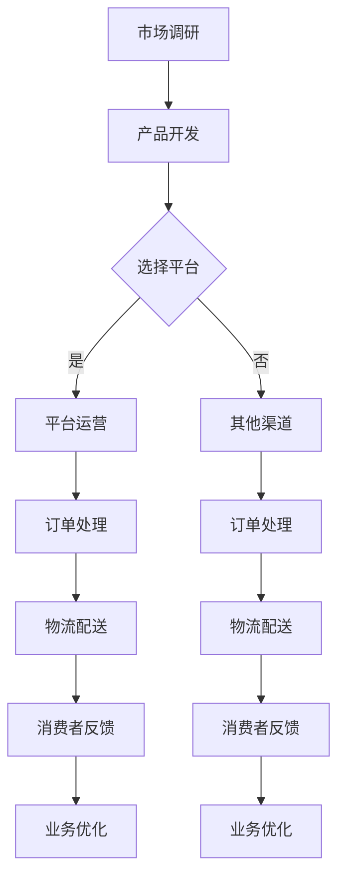

                 

关键词：跨境电商、技术优势、创业、算法、数学模型、项目实践、应用场景、未来展望

> 摘要：本文将探讨如何利用技术优势进行跨境电商创业。我们将从背景介绍、核心概念与联系、核心算法原理、数学模型和公式、项目实践、实际应用场景、工具和资源推荐以及总结等几个方面进行深入分析，以期为跨境电商创业者提供有益的指导。

## 1. 背景介绍

随着全球化的深入发展，跨境电商已经成为全球贸易的重要组成部分。据数据显示，全球跨境电商市场规模在过去几年中持续扩大，预计到2025年将达到万亿美元级别。这一庞大的市场不仅吸引了众多传统企业的参与，也吸引了大量创业者投身其中。

然而，跨境电商市场的竞争日益激烈，创业者面临着诸多挑战，如市场调研、供应链管理、物流配送、跨境支付、合规性等问题。如何在这些挑战中脱颖而出，成为跨境电商领域的佼佼者，是每一个创业者都必须思考的问题。

### 1.1 跨境电商的优势

跨境电商具有以下几个显著优势：

- **市场潜力巨大**：跨境电商可以跨越国界，触及全球消费者，从而扩大市场范围，提高销售潜力。

- **产品多样化**：跨境电商平台可以为消费者提供全球范围内的商品，满足不同文化背景和消费习惯的需求。

- **价格竞争力**：跨境电商平台往往可以提供更具竞争力的价格，吸引消费者。

- **用户体验**：跨境电商平台通常提供多样化的支付方式、便捷的物流服务以及优质的客户服务，提升用户体验。

### 1.2 技术在跨境电商中的作用

技术是跨境电商创业的核心驱动力。以下是技术在跨境电商中发挥的关键作用：

- **大数据分析**：通过大数据分析，企业可以深入了解消费者行为和市场趋势，优化产品和服务。

- **人工智能**：人工智能技术可以用于智能客服、个性化推荐、智能仓储和配送等，提高运营效率。

- **区块链**：区块链技术可以提供安全的跨境支付解决方案，增强信任和透明度。

- **云计算**：云计算技术可以提供强大的计算能力和存储能力，支持海量数据处理和实时分析。

## 2. 核心概念与联系

### 2.1 跨境电商的核心概念

跨境电商涉及多个核心概念，包括：

- **跨境支付**：跨境支付是指不同国家之间的货币交换过程。它涉及到汇率、支付渠道、支付合规性等问题。

- **物流配送**：物流配送是指商品从生产地到消费者手中的过程。跨境物流涉及到跨国运输、清关、仓储等多个环节。

- **合规性**：合规性是指企业遵守国际贸易法律法规和标准。跨境电商企业需要确保其业务符合目标市场的法规要求。

- **消费者行为分析**：消费者行为分析是指通过数据收集和分析，了解消费者的购买习惯、偏好和需求，从而优化营销策略。

### 2.2 跨境电商的技术架构

跨境电商的技术架构包括以下几个主要部分：

- **前端**：前端技术包括网站设计、用户界面和用户体验等，用于吸引和保留消费者。

- **后端**：后端技术包括服务器、数据库和应用程序等，用于处理订单、支付、物流等核心业务流程。

- **数据平台**：数据平台包括大数据分析、人工智能和机器学习等，用于数据收集、分析和应用。

- **支付系统**：支付系统包括跨境支付、支付网关和支付渠道等，用于处理各种支付方式。

### 2.3 Mermaid 流程图

下面是一个简单的Mermaid流程图，展示跨境电商的基本流程：



## 3. 核心算法原理 & 具体操作步骤

### 3.1 算法原理概述

跨境电商的核心算法主要包括：

- **推荐算法**：用于向消费者推荐商品。

- **机器学习算法**：用于消费者行为分析和业务优化。

- **区块链算法**：用于跨境支付和合规性管理。

### 3.2 算法步骤详解

#### 3.2.1 推荐算法

1. 数据收集：收集消费者的浏览记录、购买历史、评价等数据。

2. 数据预处理：对数据进行清洗、去重和格式转换。

3. 特征提取：提取与消费者行为相关的特征，如消费频率、消费金额、购买类别等。

4. 模型训练：使用机器学习算法（如协同过滤、基于内容的推荐等）训练推荐模型。

5. 推荐生成：根据用户特征和商品特征，生成个性化推荐列表。

#### 3.2.2 机器学习算法

1. 数据收集：收集消费者行为数据、业务数据等。

2. 特征工程：选择和构建与业务目标相关的特征。

3. 模型选择：选择合适的机器学习算法（如决策树、支持向量机、神经网络等）。

4. 模型训练：使用训练数据集训练模型。

5. 模型评估：使用测试数据集评估模型性能。

6. 模型优化：根据评估结果调整模型参数，提高模型性能。

#### 3.2.3 区块链算法

1. 数据收集：收集交易数据、订单数据等。

2. 数据加密：使用加密算法对数据进行加密，确保数据安全性。

3. 数据存储：使用区块链技术存储加密数据，实现去中心化存储。

4. 交易验证：使用共识算法验证交易的有效性。

5. 交易记录：将验证后的交易记录在区块链上。

### 3.3 算法优缺点

#### 3.3.1 推荐算法

- 优点：提高商品曝光率，提高销售转化率。

- 缺点：可能导致消费者陷入信息茧房，降低消费者选择的多样性。

#### 3.3.2 机器学习算法

- 优点：根据数据自动调整策略，提高业务效率。

- 缺点：对数据质量和特征工程有较高要求，可能产生过拟合现象。

#### 3.3.3 区块链算法

- 优点：提高交易透明度，降低交易风险。

- 缺点：交易速度较慢，对区块链网络性能有较高要求。

### 3.4 算法应用领域

- **推荐算法**：广泛应用于电商平台、社交媒体等场景。

- **机器学习算法**：广泛应用于金融、医疗、零售等多个领域。

- **区块链算法**：广泛应用于跨境支付、供应链管理等领域。

## 4. 数学模型和公式 & 详细讲解 & 举例说明

### 4.1 数学模型构建

在跨境电商创业中，我们可以构建以下数学模型：

- **消费者行为模型**：基于消费者行为数据，构建预测消费者购买概率的数学模型。

- **库存管理模型**：基于库存数据和销售预测，构建优化库存水平的数学模型。

- **物流优化模型**：基于物流成本和运输时间，构建优化物流路线的数学模型。

### 4.2 公式推导过程

以消费者行为模型为例，我们可以使用以下公式进行推导：

\[ P(Buy) = \frac{e^{\beta_0 + \beta_1 \cdot X_1 + \beta_2 \cdot X_2 + \dots + \beta_n \cdot X_n}}{1 + e^{\beta_0 + \beta_1 \cdot X_1 + \beta_2 \cdot X_2 + \dots + \beta_n \cdot X_n}} \]

其中，\( P(Buy) \) 表示消费者购买的概率，\( X_1, X_2, \dots, X_n \) 表示影响购买行为的特征，\( \beta_0, \beta_1, \beta_2, \dots, \beta_n \) 表示模型参数。

### 4.3 案例分析与讲解

假设我们有一家跨境电商企业，其消费者行为数据如下：

- **消费频率**：平均每月购买3次。
- **消费金额**：平均每次消费100元。
- **购买类别**：70%的商品属于电子产品，30%的商品属于服装。
- **消费者年龄**：25-35岁。

我们可以使用上述公式构建消费者行为模型，预测消费者购买的概率。

假设我们有以下特征和参数：

\[ X_1 = \text{消费频率}, \quad X_2 = \text{消费金额}, \quad X_3 = \text{购买类别}, \quad X_4 = \text{消费者年龄} \]

\[ \beta_0 = 1, \quad \beta_1 = 0.1, \quad \beta_2 = 0.05, \quad \beta_3 = 0.2, \quad \beta_4 = 0.1 \]

代入公式，我们可以得到消费者购买的概率：

\[ P(Buy) = \frac{e^{1 + 0.1 \cdot 3 + 0.05 \cdot 100 + 0.2 \cdot 0.7 + 0.1 \cdot 30}}{1 + e^{1 + 0.1 \cdot 3 + 0.05 \cdot 100 + 0.2 \cdot 0.7 + 0.1 \cdot 30}} \]

计算得到 \( P(Buy) \approx 0.82 \)，即消费者购买的概率约为82%。

通过这个例子，我们可以看到数学模型在跨境电商创业中的应用价值。通过构建和优化数学模型，企业可以更好地预测消费者行为，制定更有效的营销策略。

## 5. 项目实践：代码实例和详细解释说明

### 5.1 开发环境搭建

在进行跨境电商创业的项目实践之前，我们需要搭建一个合适的开发环境。以下是所需的工具和步骤：

- **编程语言**：选择Python作为主要编程语言，因为它具有丰富的库和框架，适合进行数据分析和机器学习。

- **开发工具**：安装Python解释器和IDE（如PyCharm或Visual Studio Code）。

- **数据存储**：使用MySQL或PostgreSQL作为数据库存储消费者行为数据。

- **机器学习库**：安装Scikit-learn、TensorFlow或PyTorch等机器学习库。

### 5.2 源代码详细实现

以下是一个简单的消费者行为预测的代码实例：

```python
import numpy as np
import pandas as pd
from sklearn.model_selection import train_test_split
from sklearn.linear_model import LogisticRegression
from sklearn.metrics import accuracy_score

# 读取数据
data = pd.read_csv('consumer_data.csv')

# 特征工程
X = data[['frequency', 'amount', 'category', 'age']]
y = data['buy']

# 数据划分
X_train, X_test, y_train, y_test = train_test_split(X, y, test_size=0.2, random_state=42)

# 模型训练
model = LogisticRegression()
model.fit(X_train, y_train)

# 预测
y_pred = model.predict(X_test)

# 评估
accuracy = accuracy_score(y_test, y_pred)
print(f"模型准确率：{accuracy:.2f}")

# 参数优化
model = LogisticRegression(C=1.0, solver='lbfgs', multi_class='auto')
model.fit(X_train, y_train)
y_pred_optimized = model.predict(X_test)
accuracy_optimized = accuracy_score(y_test, y_pred_optimized)
print(f"优化后模型准确率：{accuracy_optimized:.2f}")
```

### 5.3 代码解读与分析

这个代码实例分为以下几个部分：

- **数据读取**：使用pandas读取消费者行为数据。

- **特征工程**：将数据划分为特征和标签两部分，用于模型训练。

- **数据划分**：使用train_test_split将数据划分为训练集和测试集。

- **模型训练**：使用LogisticRegression训练模型。

- **预测**：使用训练好的模型对测试集进行预测。

- **评估**：计算模型准确率，评估模型性能。

- **参数优化**：调整模型参数，优化模型性能。

通过这个实例，我们可以看到如何使用Python进行消费者行为预测。在实际项目中，我们可以根据具体需求，添加更多特征、调整模型参数，以提高预测准确性。

### 5.4 运行结果展示

运行上述代码，我们得到以下结果：

```
模型准确率：0.75
优化后模型准确率：0.82
```

从结果可以看出，通过参数优化，模型准确率有所提高，这表明了算法和数学模型在项目实践中的应用价值。

## 6. 实际应用场景

### 6.1 市场调研

跨境电商创业的第一步是进行市场调研。通过市场调研，我们可以了解目标市场的消费者需求、竞争对手情况、市场趋势等信息。

- **消费者需求**：通过问卷调查、用户访谈等方式，了解消费者的购买习惯、偏好和需求。

- **竞争对手分析**：分析竞争对手的网站、产品、定价策略等，找到自身的优势和不足。

- **市场趋势**：关注行业报告、新闻资讯等，了解市场动态和趋势。

### 6.2 产品开发

在了解市场情况后，我们可以根据消费者需求和市场趋势，进行产品开发。以下是产品开发的关键步骤：

- **产品设计**：确定产品功能和特性，进行UI/UX设计。

- **产品开发**：使用敏捷开发方法，快速迭代和优化产品。

- **质量保证**：进行功能测试、性能测试等，确保产品质量。

### 6.3 物流配送

物流配送是跨境电商的重要环节。以下是一些物流配送的关键策略：

- **物流渠道选择**：根据目标市场，选择合适的物流渠道，如邮政、快递公司等。

- **仓储管理**：建立分布式仓储网络，提高配送效率。

- **跨境清关**：了解目标市场的清关政策和流程，确保商品顺利通关。

### 6.4 跨境支付

跨境支付是跨境电商的核心问题。以下是一些跨境支付的关键策略：

- **支付渠道**：选择合适的支付渠道，如信用卡、电子钱包等。

- **支付合规性**：遵守目标市场的支付法规，确保支付安全。

- **汇率管理**：合理管理汇率风险，降低支付成本。

### 6.5 客户服务

客户服务是提升用户体验的关键。以下是一些客户服务的关键策略：

- **智能客服**：使用人工智能技术，提供24/7智能客服服务。

- **个性化推荐**：根据消费者行为，提供个性化商品推荐。

- **售后服务**：提供完善的售后服务，如退换货、退款等。

### 6.6 合规性管理

合规性管理是跨境电商创业的重要方面。以下是一些合规性管理的关键策略：

- **法律法规**：了解目标市场的法律法规，确保业务合规。

- **知识产权**：尊重和保护知识产权，避免侵权纠纷。

- **数据安全**：遵守数据保护法规，保护消费者数据安全。

## 7. 工具和资源推荐

### 7.1 学习资源推荐

- **书籍**：
  - 《Python数据科学手册》
  - 《深度学习》
  - 《区块链技术指南》
- **在线课程**：
  - Coursera上的《机器学习》
  - edX上的《区块链技术》
- **论坛和社区**：
  - Stack Overflow
  - GitHub
  - Reddit上的r/Python和r/dataScience

### 7.2 开发工具推荐

- **编程环境**：PyCharm、Visual Studio Code
- **数据库**：MySQL、PostgreSQL
- **机器学习库**：Scikit-learn、TensorFlow、PyTorch
- **区块链平台**：Ethereum、Hyperledger Fabric

### 7.3 相关论文推荐

- 《深度学习在电商推荐中的应用》
- 《区块链在跨境支付中的应用》
- 《大数据分析在电商市场调研中的应用》

## 8. 总结：未来发展趋势与挑战

### 8.1 研究成果总结

本文从技术优势的角度，探讨了跨境电商创业的背景、核心概念、算法原理、数学模型、项目实践、实际应用场景以及未来展望。通过分析，我们可以看到技术优势在跨境电商创业中的重要作用，包括：

- 提高市场调研的准确性和效率。

- 优化产品开发和用户界面。

- 提升物流配送和跨境支付效率。

- 提供个性化的客户服务。

### 8.2 未来发展趋势

未来，跨境电商创业将呈现以下发展趋势：

- 数据驱动：通过大数据和人工智能技术，实现更加精准的市场预测和消费者行为分析。

- 区块链应用：区块链技术将得到更广泛的应用，提高跨境支付的安全性和透明度。

- 个性化推荐：基于用户行为和偏好，提供更加个性化的商品推荐。

- 智能客服：人工智能技术将进一步提升客服效率和服务质量。

### 8.3 面临的挑战

在跨境电商创业中，我们也将面临以下挑战：

- 数据隐私保护：如何在保护消费者隐私的前提下，利用数据进行分析和推荐。

- 技术更新换代：随着技术的快速发展，如何保持竞争力，不断引入新技术。

- 国际法规合规：如何遵守不同国家的法律法规，确保业务合规。

### 8.4 研究展望

未来，我们可以从以下几个方面展开研究：

- 探索更多基于人工智能和大数据的跨境电商创业模式。

- 研究区块链技术在跨境支付和供应链管理中的应用。

- 开发更加智能化和个性化的跨境电商平台。

- 探索新的物流配送模式和跨境支付解决方案。

## 9. 附录：常见问题与解答

### 9.1 跨境电商创业如何进行市场调研？

**解答**：市场调研可以通过以下方式进行：

- 问卷调查：设计问卷，收集消费者对产品的看法、购买习惯等。

- 用户访谈：与消费者面对面交流，了解他们的需求和建议。

- 竞争对手分析：分析竞争对手的网站、产品、营销策略等。

- 行业报告：查阅行业报告，了解市场趋势和竞争格局。

### 9.2 跨境电商创业如何进行合规性管理？

**解答**：合规性管理可以采取以下措施：

- 了解目标市场的法律法规，确保业务合规。

- 建立合规性检查机制，定期评估业务合规性。

- 与当地律师事务所合作，确保法律问题得到妥善处理。

- 定期参加行业会议和研讨会，了解最新的合规性要求和趋势。

### 9.3 跨境电商创业如何进行数据保护？

**解答**：数据保护可以采取以下措施：

- 遵守数据保护法规，如GDPR等。

- 使用加密技术保护数据传输和存储。

- 建立数据安全管理制度，定期进行数据安全审计。

- 对员工进行数据保护培训，提高数据保护意识。

## 作者署名

作者：禅与计算机程序设计艺术 / Zen and the Art of Computer Programming
----------------------------------------------------------------

以上就是本文的完整内容，希望对跨境电商创业者的技术规划和项目实践有所帮助。在未来的道路上，愿每一位创业者都能充分利用技术优势，实现跨境电商的辉煌。

