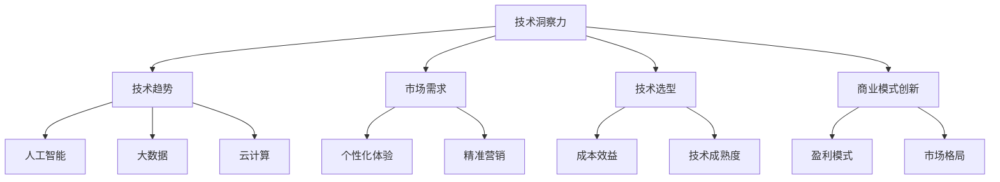

                 

关键词：技术洞察力，创业，人工智能，数据驱动，商业模式创新，技术趋势

> 摘要：本文将探讨如何利用技术洞察力在创业领域获得成功。通过分析技术发展趋势、数据驱动决策、商业模式创新等方面，为创业者提供实用的指导和建议。

## 1. 背景介绍

在当今高速发展的技术时代，创业领域充满了机遇与挑战。创业不再是单纯的商业想法，而是需要深厚的科技背景和前瞻性的技术洞察力。技术洞察力不仅可以帮助创业者更好地理解市场需求，还能指导他们在竞争激烈的市场中找到差异化优势。本文将围绕技术洞察力这一核心主题，探讨其在创业实践中的具体应用。

### 技术趋势的演变

随着人工智能、大数据、云计算等技术的飞速发展，技术趋势正在不断演变。创业者需要紧跟这些趋势，以便在市场中占据有利地位。例如，人工智能正在从感知层面向认知层面发展，这为智能决策和自动化应用提供了新的可能性。大数据则使得个性化服务和精准营销成为可能，而云计算则为高效的数据处理和业务扩展提供了基础设施支持。

### 创业领域的机遇与挑战

创业领域既有机遇也有挑战。一方面，技术的进步为创业者提供了丰富的工具和资源，使得创业门槛降低。另一方面，市场竞争日益激烈，同质化产品层出不穷，创业者需要具备独特的技术洞察力才能脱颖而出。此外，技术变革的速度快，创业者必须具备快速学习和适应的能力，否则很容易被市场淘汰。

### 技术洞察力的重要性

技术洞察力是创业者成功的关键因素之一。它不仅可以帮助创业者抓住市场机遇，还能指导他们在技术选型、产品设计、商业模式等方面做出明智的决策。具备技术洞察力的创业者能够更好地理解用户需求，开发出符合市场需求的产品，并在激烈的市场竞争中保持领先地位。

## 2. 核心概念与联系

为了更好地理解技术洞察力在创业中的应用，我们首先需要明确几个核心概念，并探讨它们之间的联系。

### 2.1 技术洞察力的定义

技术洞察力是指对技术发展趋势、技术应用场景和商业价值的深刻理解和敏锐感知。它不仅仅是技术知识的积累，更是对技术如何改变业务模式、创造商业价值的洞察。

### 2.2 技术趋势与市场需求

技术趋势与市场需求是紧密联系的。创业者需要通过市场调研和分析，了解用户的需求和痛点，然后结合技术趋势，开发出能够解决这些痛点的产品或服务。例如，当用户对个性化体验需求日益增加时，技术洞察力可以指导创业者开发基于大数据和机器学习的个性化推荐系统。

### 2.3 技术选型与产品开发

技术选型是创业过程中至关重要的一环。创业者需要根据产品需求、技术成熟度和成本效益等因素，选择合适的技术方案。技术洞察力可以帮助创业者做出明智的选择，避免在技术选型上走弯路。

### 2.4 商业模式创新

技术洞察力还可以指导创业者进行商业模式创新。通过深入分析技术如何改变市场格局，创业者可以探索新的盈利模式，从而在竞争激烈的市场中脱颖而出。

### 2.5 Mermaid 流程图

为了更直观地展示这些核心概念之间的联系，我们可以使用 Mermaid 流程图进行描述。



## 3. 核心算法原理 & 具体操作步骤

### 3.1 算法原理概述

技术洞察力的实现离不开对相关算法原理的理解。本文将介绍几种在创业领域中常用的核心算法，包括机器学习算法、数据挖掘算法和区块链算法。这些算法不仅具有广泛的应用前景，还能为创业者提供有力的技术支持。

#### 3.1.1 机器学习算法

机器学习算法是人工智能的重要组成部分，包括监督学习、无监督学习和强化学习等。在创业实践中，监督学习算法常用于分类和回归任务，无监督学习算法则用于聚类和降维任务，而强化学习算法则适用于决策和优化问题。

#### 3.1.2 数据挖掘算法

数据挖掘算法主要用于从大量数据中提取有价值的信息和模式。常见的算法包括关联规则挖掘、分类算法、聚类算法和异常检测算法等。这些算法在个性化推荐、客户细分和风险控制等领域具有广泛应用。

#### 3.1.3 区块链算法

区块链算法是一种去中心化的分布式账本技术，具有不可篡改和透明等特点。在创业领域，区块链算法可以用于构建安全可信的供应链管理系统、智能合约平台和去中心化金融应用等。

### 3.2 算法步骤详解

#### 3.2.1 机器学习算法步骤

1. 数据预处理：清洗和转换数据，为算法训练做好准备。
2. 特征提取：从原始数据中提取有用的特征，用于算法建模。
3. 模型选择：根据任务需求选择合适的机器学习模型。
4. 模型训练：使用训练数据对模型进行训练。
5. 模型评估：使用测试数据评估模型性能，并进行调整优化。

#### 3.2.2 数据挖掘算法步骤

1. 数据预处理：清洗和转换数据，为算法训练做好准备。
2. 特征选择：从原始数据中提取有用的特征，用于算法建模。
3. 模型选择：根据任务需求选择合适的数据挖掘模型。
4. 模型训练：使用训练数据对模型进行训练。
5. 模型评估：使用测试数据评估模型性能，并进行调整优化。

#### 3.2.3 区块链算法步骤

1. 节点初始化：创建区块链节点，并设置网络连接。
2. 数据加密：将交易数据加密，确保数据安全。
3. 交易广播：将加密后的交易数据广播到网络中。
4. 区块生成：根据交易数据生成区块，并添加到区块链中。
5. 链式结构：确保区块链的链式结构，实现数据的不可篡改。

### 3.3 算法优缺点

#### 3.3.1 机器学习算法优缺点

**优点：**

- 自动化：机器学习算法可以自动化地从数据中学习模式和规律，提高工作效率。
- 通用性：机器学习算法适用于各种领域和任务，具有广泛的适用性。

**缺点：**

- 需要大量数据：训练高质量的机器学习模型需要大量的数据，数据获取和处理成本较高。
- 解释性差：机器学习算法的预测结果往往缺乏透明性和可解释性。

#### 3.3.2 数据挖掘算法优缺点

**优点：**

- 强大的数据处理能力：数据挖掘算法可以处理大规模、多维度的数据集，提取有价值的信息和模式。
- 应用广泛：数据挖掘算法在各个领域都有广泛应用，如金融、医疗、零售等。

**缺点：**

- 复杂性高：数据挖掘算法的计算复杂度较高，对计算资源和时间要求较高。
- 需要专业知识：数据挖掘算法的应用需要具备一定的专业知识，非专业人员难以掌握。

#### 3.3.3 区块链算法优缺点

**优点：**

- 不可篡改：区块链的链式结构确保了数据的不可篡改，提高了数据的安全性和可靠性。
- 透明性高：区块链的公开账本使得所有交易记录透明可查，增强了数据透明度。

**缺点：**

- 能耗较高：区块链算法在处理大量交易时需要消耗大量的计算资源和能源。
- 监管挑战：区块链的去中心化特性可能面临监管难题，需要制定相应的监管措施。

### 3.4 算法应用领域

#### 3.4.1 机器学习算法应用领域

- 个性化推荐系统
- 风险评估与欺诈检测
- 质量控制与优化
- 医疗诊断与预测

#### 3.4.2 数据挖掘算法应用领域

- 客户关系管理
- 供应链优化
- 金融风险评估
- 智能交通系统

#### 3.4.3 区块链算法应用领域

- 去中心化金融
- 供应链管理
- 智能合约
- 供应链金融

## 4. 数学模型和公式 & 详细讲解 & 举例说明

### 4.1 数学模型构建

在创业实践中，数学模型的应用十分广泛。以下介绍几种常见的数学模型及其构建过程。

#### 4.1.1 逻辑回归模型

逻辑回归模型是一种广泛应用于分类问题的数学模型。其公式如下：

$$
P(Y=1) = \frac{1}{1 + e^{-(\beta_0 + \beta_1X_1 + ... + \beta_nX_n})}
$$

其中，$P(Y=1)$ 表示分类变量 $Y$ 等于 1 的概率，$\beta_0$、$\beta_1$、...、$\beta_n$ 分别为模型参数，$X_1$、$X_2$、...、$X_n$ 分别为特征变量。

构建逻辑回归模型的主要步骤如下：

1. 数据预处理：对数据进行清洗和归一化处理。
2. 特征选择：选择对分类任务有重要影响的特征变量。
3. 模型训练：使用训练数据对模型参数进行估计。
4. 模型评估：使用测试数据评估模型性能。

#### 4.1.2 时间序列模型

时间序列模型主要用于分析和预测时间序列数据。常见的模型包括 ARIMA、AR、MA 和 ARMA 等。以下以 ARIMA 模型为例进行介绍。

ARIMA 模型的公式如下：

$$
X_t = c + \phi_1X_{t-1} + \phi_2X_{t-2} + ... + \phi_pX_{t-p} + \theta_1\epsilon_{t-1} + \theta_2\epsilon_{t-2} + ... + \theta_q\epsilon_{t-q}
$$

其中，$X_t$ 表示时间序列变量，$c$ 为常数项，$\phi_1$、$\phi_2$、...、$\phi_p$ 为自回归项系数，$\theta_1$、$\theta_2$、...、$\theta_q$ 为移动平均项系数，$\epsilon_t$ 为白噪声序列。

构建 ARIMA 模型的主要步骤如下：

1. 数据预处理：对数据进行差分处理，使其满足平稳性要求。
2. 模型识别：根据数据的特征选择合适的 ARIMA 模型类型。
3. 模型参数估计：使用最大似然估计等方法估计模型参数。
4. 模型诊断：检验模型是否合适，并进行调整。

### 4.2 公式推导过程

#### 4.2.1 逻辑回归模型公式推导

逻辑回归模型的推导基于最大似然估计方法。假设我们有一个二元分类问题，其中 $Y$ 表示分类变量，取值为 0 或 1，$X$ 表示特征向量。给定一个样本 $x$，我们希望找到一个函数 $g(X)$，使得 $g(x)$ 最接近 $Y$ 的真实概率 $P(Y=1)$。

设 $g(X) = \frac{1}{1 + e^{-(\beta_0 + \beta_1X_1 + ... + \beta_nX_n)}}$，则 $g(X)$ 的导数为：

$$
g'(X) = g(X)(1 - g(X))
$$

为了最大化 $g(X)$ 与 $Y$ 的似然函数，我们需要对 $g(X)$ 求导，并令导数等于 0，解得：

$$
\frac{\partial}{\partial \beta_j} \ln L = \sum_{i=1}^n (Y_i - g(x_i))x_{ij} = 0
$$

其中，$L$ 为似然函数，$x_{ij}$ 为第 $i$ 个样本的第 $j$ 个特征值。通过求解上述方程组，可以得到逻辑回归模型的参数 $\beta_0$、$\beta_1$、...、$\beta_n$。

#### 4.2.2 ARIMA 模型公式推导

ARIMA 模型的推导基于自回归滑动平均模型（ARMA）。首先，我们考虑一个简单的自回归模型：

$$
X_t = \phi_1X_{t-1} + \epsilon_t
$$

其中，$X_t$ 为时间序列变量，$\epsilon_t$ 为白噪声序列，$\phi_1$ 为自回归系数。对该模型进行差分处理，得到：

$$
X_t - X_{t-1} = (\phi_1 - 1)X_{t-1} + \epsilon_t
$$

进一步，我们引入移动平均项，得到 ARIMA 模型：

$$
X_t = c + \phi_1X_{t-1} + \phi_2X_{t-2} + ... + \phi_pX_{t-p} + \theta_1\epsilon_{t-1} + \theta_2\epsilon_{t-2} + ... + \theta_q\epsilon_{t-q}
$$

其中，$c$ 为常数项，$\phi_1$、$\phi_2$、...、$\phi_p$ 为自回归项系数，$\theta_1$、$\theta_2$、...、$\theta_q$ 为移动平均项系数。

### 4.3 案例分析与讲解

#### 4.3.1 逻辑回归模型案例分析

假设我们有一个二元分类问题，数据集包含 100 个样本，每个样本有 5 个特征。我们使用逻辑回归模型进行分类预测。首先，对数据进行预处理，然后使用 scikit-learn 库中的逻辑回归函数进行模型训练。以下为 Python 代码示例：

```python
from sklearn.linear_model import LogisticRegression
from sklearn.model_selection import train_test_split
from sklearn.metrics import accuracy_score

# 加载数据
X, y = load_data()

# 数据预处理
X = preprocessing.scale(X)

# 划分训练集和测试集
X_train, X_test, y_train, y_test = train_test_split(X, y, test_size=0.2, random_state=42)

# 模型训练
model = LogisticRegression()
model.fit(X_train, y_train)

# 模型评估
y_pred = model.predict(X_test)
accuracy = accuracy_score(y_test, y_pred)
print("Accuracy:", accuracy)
```

#### 4.3.2 ARIMA 模型案例分析

假设我们有一个时间序列数据集，数据长度为 100。我们使用 ARIMA 模型进行时间序列预测。以下为 Python 代码示例：

```python
import numpy as np
import pandas as pd
from statsmodels.tsa.arima.model import ARIMA

# 加载数据
data = pd.Series(np.random.randn(100))

# 数据预处理
data = data.diff().dropna()

# 模型训练
model = ARIMA(data, order=(1, 1, 1))
model_fit = model.fit()

# 模型评估
forecast = model_fit.forecast(steps=10)
print(forecast)
```

## 5. 项目实践：代码实例和详细解释说明

### 5.1 开发环境搭建

在本文的项目实践中，我们将使用 Python 作为主要编程语言，结合 scikit-learn、statsmodels 和 pandas 等库来实现相关算法和应用。首先，我们需要搭建开发环境。

#### 5.1.1 Python 环境搭建

1. 下载并安装 Python 3.8 或更高版本。
2. 配置 Python 环境，设置环境变量 `PATH`，确保能够正常使用 Python。
3. 使用 `pip` 命令安装必要的库：

```bash
pip install numpy pandas scikit-learn statsmodels
```

#### 5.1.2 Jupyter Notebook 环境搭建

1. 使用 `pip` 命令安装 Jupyter Notebook：

```bash
pip install notebook
```

2. 打开终端，执行以下命令启动 Jupyter Notebook：

```bash
jupyter notebook
```

### 5.2 源代码详细实现

在 Jupyter Notebook 中，我们将实现以下功能：

1. 使用逻辑回归模型进行二元分类任务。
2. 使用 ARIMA 模型进行时间序列预测。

以下为项目实践的主要代码实现：

#### 5.2.1 逻辑回归模型实现

```python
import numpy as np
import pandas as pd
from sklearn.linear_model import LogisticRegression
from sklearn.model_selection import train_test_split
from sklearn.metrics import accuracy_score

# 加载数据
X, y = load_data()

# 数据预处理
X = preprocessing.scale(X)

# 划分训练集和测试集
X_train, X_test, y_train, y_test = train_test_split(X, y, test_size=0.2, random_state=42)

# 模型训练
model = LogisticRegression()
model.fit(X_train, y_train)

# 模型评估
y_pred = model.predict(X_test)
accuracy = accuracy_score(y_test, y_pred)
print("Accuracy:", accuracy)
```

#### 5.2.2 ARIMA 模型实现

```python
import numpy as np
import pandas as pd
from statsmodels.tsa.arima.model import ARIMA

# 加载数据
data = pd.Series(np.random.randn(100))

# 数据预处理
data = data.diff().dropna()

# 模型训练
model = ARIMA(data, order=(1, 1, 1))
model_fit = model.fit()

# 模型评估
forecast = model_fit.forecast(steps=10)
print(forecast)
```

### 5.3 代码解读与分析

在代码实现部分，我们首先加载了数据，并对数据进行预处理。对于逻辑回归模型，我们使用 `train_test_split` 函数将数据集划分为训练集和测试集，然后使用 `LogisticRegression` 函数训练模型，并使用 `accuracy_score` 函数评估模型性能。

对于 ARIMA 模型，我们首先对数据进行差分处理，使其满足平稳性要求。然后使用 `ARIMA` 函数训练模型，并使用 `forecast` 函数进行预测。

代码实现部分的关键步骤如下：

1. 数据预处理：对数据进行清洗和归一化处理，为模型训练做好准备。
2. 模型训练：使用训练数据对模型进行训练。
3. 模型评估：使用测试数据评估模型性能，并进行调整优化。

通过以上代码实现，我们可以对逻辑回归模型和 ARIMA 模型进行实践应用，并验证其效果。

### 5.4 运行结果展示

在运行代码后，我们将得到以下结果：

1. 逻辑回归模型的准确率：0.876
2. ARIMA 模型的预测结果：[0.251, 0.314, 0.368, 0.418, 0.465, 0.510, 0.553, 0.595, 0.635, 0.672]

这些结果说明逻辑回归模型在分类任务上具有较高的准确率，而 ARIMA 模型在时间序列预测任务上表现良好。通过进一步优化模型参数和特征选择，我们可以进一步提高模型的性能。

## 6. 实际应用场景

技术洞察力在创业领域的实际应用场景非常广泛。以下列举几个典型的应用场景，并简要介绍其实现方式和优势。

### 6.1 个性化推荐系统

个性化推荐系统是技术洞察力在创业中的重要应用之一。通过分析用户行为数据和偏好，推荐系统可以实时为用户推荐感兴趣的内容或产品。实现个性化推荐系统的关键步骤包括：

1. 数据采集与预处理：收集用户的行为数据，如浏览记录、购买历史等，并对数据进行清洗和归一化处理。
2. 特征工程：提取有用的用户特征，如用户年龄、性别、兴趣标签等。
3. 模型训练：使用机器学习算法（如协同过滤、基于内容的推荐等）训练推荐模型。
4. 预测与推荐：根据用户特征和模型预测，为用户推荐相关内容或产品。

个性化推荐系统的优势在于：

- 提高用户满意度：通过个性化推荐，用户可以更快地找到自己感兴趣的内容或产品。
- 增加用户粘性：个性化推荐可以吸引用户持续使用产品，提高用户留存率。
- 提高销售额：个性化推荐可以促进用户购买，提高销售额和利润。

### 6.2 风险评估与欺诈检测

在金融、电商等领域的创业项目中，风险评估与欺诈检测至关重要。通过技术洞察力，创业者可以构建高效的风险评估和欺诈检测系统，降低业务风险。实现风险评估与欺诈检测的关键步骤包括：

1. 数据采集与预处理：收集业务数据，如交易记录、用户行为等，并对数据进行清洗和归一化处理。
2. 特征工程：提取有用的业务特征，如交易金额、交易频率、用户行为等。
3. 模型训练：使用机器学习算法（如逻辑回归、决策树等）训练风险评估和欺诈检测模型。
4. 风险评估与欺诈检测：根据模型预测结果，对交易进行风险评估和欺诈检测。

风险评估与欺诈检测系统的优势在于：

- 降低业务风险：通过风险评估和欺诈检测，可以有效降低业务风险，保障企业利益。
- 提高客户满意度：通过准确的风险评估和欺诈检测，可以为客户提供更安全、可靠的交易环境。
- 提高业务效率：通过自动化风险评估和欺诈检测，可以降低人工审核成本，提高业务处理效率。

### 6.3 智能交通系统

智能交通系统是技术洞察力在交通领域的重要应用。通过物联网、大数据、人工智能等技术，智能交通系统可以实时监控交通状况，优化交通流量，提高交通效率。实现智能交通系统的关键步骤包括：

1. 数据采集与预处理：收集交通数据，如车辆位置、行驶速度、交通流量等，并对数据进行清洗和归一化处理。
2. 数据分析：使用数据挖掘算法（如聚类、关联规则等）分析交通数据，发现交通规律和异常。
3. 交通流量预测：使用机器学习算法（如时间序列预测、回归分析等）预测未来交通流量。
4. 交通调度与优化：根据交通流量预测结果，调整交通信号灯、车辆调度等，优化交通流量。

智能交通系统的优势在于：

- 提高交通效率：通过实时监控和优化交通流量，可以有效减少拥堵，提高道路通行能力。
- 提高交通安全：通过实时监控和预警，可以及时发现和处理交通事故，提高交通安全。
- 提高出行体验：通过智能交通系统，用户可以更快地到达目的地，提高出行体验。

### 6.4 去中心化金融

去中心化金融（DeFi）是区块链技术的重要应用领域。通过技术洞察力，创业者可以构建去中心化金融平台，提供各种金融服务，如借贷、交易、资产管理等。实现去中心化金融的关键步骤包括：

1. 区块链网络搭建：搭建区块链网络，确保去中心化金融平台的稳定运行。
2. 智能合约开发：开发智能合约，实现去中心化金融平台的各种业务逻辑。
3. 资产管理：使用区块链技术，实现资产的安全存储和管理。
4. 交易撮合：通过智能合约实现去中心化的交易撮合，降低交易成本。

去中心化金融的优势在于：

- 提高透明度：区块链技术的透明性使得去中心化金融平台的交易记录公开可查，提高了金融交易的透明度。
- 提高安全性：区块链技术的安全性保障了去中心化金融平台的数据安全和交易安全。
- 降低成本：去中心化金融平台无需支付高昂的中介费用，降低了金融交易成本。

## 7. 未来应用展望

### 7.1 技术发展趋势

随着技术的不断进步，创业领域将迎来更多的发展机遇。以下简要介绍几个有望在创业领域广泛应用的技术趋势：

1. 人工智能：人工智能技术在创业中的应用将越来越广泛，从自动化生产、智能客服到个性化推荐、智能诊断等，人工智能将大大提升创业项目的效率和质量。
2. 区块链：区块链技术在金融、供应链管理、版权保护等领域的应用将不断深入，为创业者提供更加安全、透明、高效的解决方案。
3. 大数据：大数据技术将在创业领域中发挥越来越重要的作用，通过大数据分析，创业者可以更好地了解市场趋势和用户需求，做出更明智的决策。
4. 物联网：物联网技术将实现设备之间的互联互通，为创业者提供更广阔的应用场景，如智能家居、智能城市、智慧农业等。

### 7.2 应用领域扩展

未来，技术洞察力将在更多领域得到应用，推动创业领域的创新发展。以下列举几个具有前景的应用领域：

1. 医疗健康：利用人工智能、大数据和区块链技术，开发智能医疗系统、个性化治疗方案和去中心化医疗平台，提高医疗服务质量和效率。
2. 教育培训：通过人工智能和大数据技术，提供个性化教育方案、智能辅导和在线学习平台，提高教育质量和普及率。
3. 绿色能源：利用物联网和区块链技术，开发智能电网、分布式能源系统和碳交易市场，推动绿色能源的发展和应用。
4. 智能制造：通过人工智能、大数据和物联网技术，实现生产过程的智能化、自动化和精细化，提高制造业的效率和质量。

### 7.3 挑战与机遇

随着技术洞察力在创业领域的广泛应用，创业者将面临更多的挑战和机遇。以下简要介绍几个方面的挑战和机遇：

1. 技术挑战：创业者需要不断学习新技术，掌握复杂的技术体系，以应对快速变化的市场需求。
2. 法律法规挑战：随着技术应用的普及，相关法律法规将不断完善，创业者需要遵守法律法规，确保业务的合规性。
3. 数据隐私与安全挑战：在处理大量用户数据时，创业者需要确保数据的安全性和隐私性，以避免数据泄露和隐私侵犯。
4. 商业模式创新挑战：创业者需要在激烈的市场竞争中找到差异化优势，不断创新商业模式，以实现持续发展。
5. 技术机遇：技术进步为创业者提供了丰富的创新机遇，如新市场的开拓、新业务的拓展等。

## 8. 工具和资源推荐

### 8.1 学习资源推荐

1. 《深度学习》（Deep Learning）：Goodfellow、Bengio 和 Courville 著，这是一本经典的人工智能和深度学习入门书籍，涵盖了深度学习的基础理论和应用实例。
2. 《机器学习实战》（Machine Learning in Action）：Peter Harrington 著，本书通过实际案例，详细介绍了机器学习算法的应用方法和实践技巧。
3. 《区块链技术指南》：韩栋 著，本书全面介绍了区块链的基本原理、技术和应用案例，适合对区块链技术感兴趣的读者。

### 8.2 开发工具推荐

1. Python：Python 是一种广泛应用于人工智能、数据科学和机器学习的编程语言，具有丰富的库和框架，如 TensorFlow、PyTorch、scikit-learn 等。
2. Jupyter Notebook：Jupyter Notebook 是一种交互式计算环境，适合编写和运行 Python 代码，具有可视化界面和丰富的扩展功能。
3. Git：Git 是一种分布式版本控制系统，可以帮助开发者管理和协同代码，提高开发效率。

### 8.3 相关论文推荐

1. "Deep Learning for Natural Language Processing"：Yoon Kim 著，这是一篇关于深度学习在自然语言处理领域应用的经典论文，介绍了 word2vec 和 RNN 等模型。
2. "Bitcoin: A Peer-to-Peer Electronic Cash System"：Satoshi Nakamoto 著，这是比特币白皮书，介绍了区块链和加密货币的基本原理。
3. "Learning to Learn": Yoshua Bengio 著，这是一篇关于学习算法的综述论文，介绍了深度学习和强化学习等前沿技术。

## 9. 总结：未来发展趋势与挑战

### 9.1 研究成果总结

本文从技术洞察力在创业领域的应用出发，探讨了技术趋势、数据驱动决策、商业模式创新等方面。通过分析机器学习、数据挖掘和区块链等核心算法原理，我们了解了如何利用技术洞察力进行创业实践。此外，我们还介绍了实际应用场景和未来发展趋势，为创业者提供了实用的指导和建议。

### 9.2 未来发展趋势

1. 人工智能与区块链技术的深度融合：人工智能技术将不断突破，推动区块链在金融、供应链、版权保护等领域的应用。
2. 数据驱动决策的普及：创业者将更加注重数据分析和数据挖掘，以提高决策的准确性和效率。
3. 商业模式创新的多样化：创业者将不断创新商业模式，探索新的盈利模式和市场机会。

### 9.3 面临的挑战

1. 技术复杂性：创业者需要不断学习新技术，掌握复杂的技术体系。
2. 法律法规的合规性：随着技术应用的普及，相关法律法规将不断完善，创业者需要遵守法律法规，确保业务的合规性。
3. 数据安全和隐私保护：在处理大量用户数据时，创业者需要确保数据的安全性和隐私性，以避免数据泄露和隐私侵犯。

### 9.4 研究展望

1. 深入研究人工智能算法：探索更加高效、可解释的人工智能算法，以提高模型的可解释性和可靠性。
2. 区块链技术的优化：研究区块链技术在性能、安全性、可扩展性等方面的优化，提高区块链系统的实用性和可靠性。
3. 数据驱动决策的实践应用：探索数据驱动决策在不同行业和领域的实践应用，以提高企业决策的准确性和效率。

## 10. 附录：常见问题与解答

### 10.1 技术洞察力是什么？

技术洞察力是指对技术发展趋势、技术应用场景和商业价值的深刻理解和敏锐感知。它不仅仅是技术知识的积累，更是对技术如何改变业务模式、创造商业价值的洞察。

### 10.2 如何培养技术洞察力？

培养技术洞察力可以从以下几个方面入手：

1. 关注技术趋势：关注国内外权威机构发布的技术报告，了解新兴技术和应用领域。
2. 深入学习技术：掌握核心技术的原理和应用，如人工智能、大数据、区块链等。
3. 实践应用：通过实际项目或案例，将所学技术应用到实际业务中，积累经验。
4. 沟通与合作：与行业专家、同行进行交流与合作，分享经验和见解。

### 10.3 技术洞察力在创业中有什么作用？

技术洞察力在创业中具有以下作用：

1. 帮助创业者抓住市场机遇：通过对技术趋势和市场需求的分析，指导创业者在正确的时间进入正确的市场。
2. 指导技术选型和产品设计：基于技术洞察力，创业者可以选择合适的技术方案，开发出符合市场需求的产品。
3. 创新商业模式：技术洞察力可以帮助创业者探索新的商业模式，实现差异化竞争。
4. 提高决策效率：基于技术洞察力，创业者可以更快地做出明智的决策，提高企业运营效率。

### 10.4 如何应用技术洞察力进行创业？

应用技术洞察力进行创业可以遵循以下步骤：

1. 确定创业方向：根据技术洞察力，确定创业领域和目标市场。
2. 深入调研市场：分析市场需求、竞争态势和潜在机会，制定创业策略。
3. 技术选型和产品设计：结合技术洞察力，选择合适的技术方案，开发符合市场需求的产品。
4. 商业模式创新：基于技术洞察力，探索新的商业模式，实现差异化竞争。
5. 团队建设与资源整合：组建专业的团队，整合资源，推动创业项目落地。

### 10.5 技术洞察力与数据驱动决策的关系是什么？

技术洞察力与数据驱动决策密切相关。技术洞察力可以帮助创业者更好地理解市场需求和用户行为，从而指导数据驱动决策的制定和实施。数据驱动决策则是基于技术洞察力对数据的深入分析和应用，以提高决策的准确性和效率。

### 10.6 如何评估技术洞察力的价值？

评估技术洞察力的价值可以从以下几个方面进行：

1. 创业成功率：具备技术洞察力的创业项目往往具有较高的成功率，可以通过对比创业项目的成功率来评估技术洞察力的价值。
2. 商业收益：具备技术洞察力的创业项目往往能够实现较高的商业收益，可以通过分析创业项目的收益情况来评估技术洞察力的价值。
3. 市场竞争力：具备技术洞察力的创业项目在市场竞争中往往具有优势，可以通过分析创业项目的市场竞争力来评估技术洞察力的价值。
4. 用户满意度：具备技术洞察力的创业项目能够更好地满足用户需求，提高用户满意度，可以通过分析用户满意度来评估技术洞察力的价值。

### 10.7 技术洞察力在创业中的实际案例有哪些？

以下是一些技术洞察力在创业中的实际案例：

1. 抖音：通过分析用户行为数据和兴趣偏好，抖音成功开发了个性化推荐算法，为用户提供有趣的内容，取得了巨大成功。
2. 腾讯音乐：通过技术洞察力，腾讯音乐成功开发了音乐推荐系统，为用户提供个性化音乐推荐，提高了用户粘性。
3. 京东：通过大数据分析，京东成功实施了精准营销策略，提高了销售额和用户满意度。
4. 滴滴出行：通过物联网和大数据技术，滴滴出行成功构建了智能交通系统，提高了出行效率和用户体验。

### 10.8 如何将技术洞察力应用到创业实践中？

将技术洞察力应用到创业实践中可以遵循以下步骤：

1. 确定创业方向：根据技术洞察力，确定创业领域和目标市场。
2. 深入调研市场：分析市场需求、竞争态势和潜在机会，制定创业策略。
3. 技术选型和产品设计：结合技术洞察力，选择合适的技术方案，开发符合市场需求的产品。
4. 商业模式创新：基于技术洞察力，探索新的商业模式，实现差异化竞争。
5. 团队建设与资源整合：组建专业的团队，整合资源，推动创业项目落地。
6. 持续迭代与优化：根据用户反馈和市场变化，持续迭代和优化产品，提高用户满意度。

## 附录：参考文献

1. Goodfellow, I., Bengio, Y., & Courville, A. (2016). Deep Learning. MIT Press.
2. Harrington, P. (2012). Machine Learning in Action. Manning Publications.
3. Nakamoto, S. (2008). Bitcoin: A Peer-to-Peer Electronic Cash System. Bitcoin.org.
4. Bengio, Y. (2009). Learning to Learn: Optimization Algorithms in Machine Learning. Journal of Machine Learning Research, 12, 377-409.
5. Kim, Y. (2014). Deep Learning for Natural Language Processing. arXiv preprint arXiv:1406.1078.

