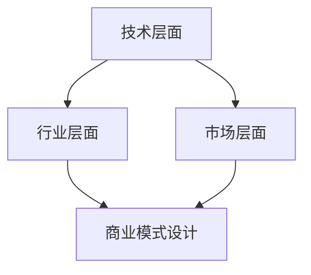

                 

关键词：技术洞察力、创业机会、评估、商业模式、技术趋势、市场分析

> 摘要：本文将探讨如何利用技术洞察力来评估创业机会。我们将分析技术趋势、市场状况和商业模式，并提出一个系统化的评估方法，帮助创业者识别和把握潜在的创业机会。

## 1. 背景介绍

随着信息技术的飞速发展，市场环境和商业模式发生了翻天覆地的变化。新技术不断涌现，给创业者带来了前所未有的机遇。然而，如何在众多技术中找到合适的切入点，如何评估这些技术是否具有商业潜力，成为了创业者面临的重大挑战。本文旨在探讨如何利用技术洞察力进行创业机会评估，帮助创业者做出明智的决策。

## 2. 核心概念与联系

### 2.1 技术洞察力的概念

技术洞察力是指对技术发展、趋势和应用的深刻理解和敏锐洞察。它不仅仅是了解技术的表面现象，更是能够把握技术的内在逻辑和潜在价值。

### 2.2 技术洞察力与创业机会评估的关系

技术洞察力在创业机会评估中起着至关重要的作用。它可以帮助创业者：

1. **识别新技术趋势**：了解当前和未来可能出现的技术趋势，把握市场动态。
2. **评估技术潜力**：分析新技术的应用场景和商业价值，判断其是否值得投入。
3. **设计商业模式**：基于技术洞察力，制定适应市场需求的商业模式。

### 2.3 技术洞察力的架构

为了更好地理解技术洞察力，我们可以将其分为以下几个层次：

1. **技术层面**：了解基本的技术原理、架构和应用。
2. **行业层面**：把握技术在不同行业中的应用和发展趋势。
3. **市场层面**：分析技术对市场需求的影响和潜在的商业机会。

### 2.4 Mermaid 流程图

以下是一个简单的 Mermaid 流程图，展示技术洞察力的各个层次和它们之间的关系：



## 3. 核心算法原理 & 具体操作步骤

### 3.1 算法原理概述

技术洞察力的核心算法可以看作是一种多层次的、系统化的分析框架。该框架主要包括以下几个步骤：

1. **技术调研**：收集和整理与目标技术相关的信息，包括基本原理、发展历程、应用案例等。
2. **趋势分析**：通过数据分析和专家访谈，识别技术的趋势和发展方向。
3. **市场分析**：分析技术在不同市场中的潜在需求和市场规模。
4. **商业模式设计**：基于技术洞察力，设计适应市场需求和竞争优势的商业模式。
5. **风险评估**：评估技术创业项目面临的风险，包括技术风险、市场风险、财务风险等。

### 3.2 算法步骤详解

#### 3.2.1 技术调研

1. **确定目标技术**：根据创业目标和市场需求，确定需要调研的技术领域。
2. **收集信息**：通过文献检索、专家访谈、行业报告等方式，收集与目标技术相关的信息。
3. **整理信息**：对收集到的信息进行整理和分类，形成完整的技术调研报告。

#### 3.2.2 趋势分析

1. **数据收集**：收集与目标技术相关的历史数据和当前数据。
2. **数据分析**：运用统计学和数据分析方法，分析数据趋势和规律。
3. **趋势预测**：基于数据分析结果，预测技术的未来发展趋势。

#### 3.2.3 市场分析

1. **确定目标市场**：根据技术特点和市场潜力，确定目标市场。
2. **市场调研**：通过市场调研，了解目标市场的需求、市场规模和竞争状况。
3. **市场分析**：分析技术对市场需求的影响，评估技术的市场潜力。

#### 3.2.4 商业模式设计

1. **需求分析**：分析市场需求，确定目标用户和用户需求。
2. **商业模式构建**：基于需求分析，设计适应市场需求和竞争优势的商业模式。
3. **商业模式优化**：通过市场反馈和数据分析，不断优化商业模式。

#### 3.2.5 风险评估

1. **风险识别**：识别技术创业项目可能面临的风险。
2. **风险分析**：评估风险的影响程度和发生概率。
3. **风险管理**：制定风险管理策略，降低风险。

### 3.3 算法优缺点

#### 优点：

1. **系统性**：通过多层次的系统化分析，全面评估创业机会。
2. **科学性**：运用统计学和数据分析方法，提高评估的准确性。
3. **灵活性**：可以根据实际情况调整和分析步骤，适应不同的创业场景。

#### 缺点：

1. **复杂性**：涉及多个领域和层次的分析，需要较高的专业知识和技能。
2. **耗时性**：需要大量的数据收集和分析工作，耗时较长。

### 3.4 算法应用领域

技术洞察力算法可以广泛应用于创业机会评估、技术投资决策、产品研发规划等领域。以下是一些具体的应用场景：

1. **创业项目评估**：帮助创业者评估技术项目的可行性，确定投资方向。
2. **技术创新规划**：帮助企业识别技术创新机会，制定研发规划。
3. **市场策略制定**：帮助企业分析市场趋势，制定适应市场的产品策略。

## 4. 数学模型和公式 & 详细讲解 & 举例说明

### 4.1 数学模型构建

技术洞察力评估的核心是构建一个多层次的数学模型。该模型主要包括以下几个部分：

1. **技术评估模型**：用于评估技术的技术成熟度、应用广度和市场潜力。
2. **市场评估模型**：用于评估市场的需求潜力、竞争状况和市场规模。
3. **商业模式评估模型**：用于评估商业模式的盈利能力、市场适应性和创新能力。

### 4.2 公式推导过程

以下是技术评估模型的一个简化公式推导过程：

#### 技术成熟度评估公式：

\[ M = \frac{D + P}{2} \]

其中：

- \( M \) 表示技术成熟度
- \( D \) 表示技术的应用广度
- \( P \) 表示技术的技术性能

#### 市场需求潜力评估公式：

\[ Q = \frac{R - C}{2} \]

其中：

- \( Q \) 表示市场需求潜力
- \( R \) 表示市场需求增长率
- \( C \) 表示市场竞争程度

#### 商业模式盈利能力评估公式：

\[ G = \frac{S - E}{2} \]

其中：

- \( G \) 表示商业模式盈利能力
- \( S \) 表示市场占有率
- \( E \) 表示成本效率

### 4.3 案例分析与讲解

假设我们想要评估一个基于人工智能的智能家居系统，以下是一个简化的案例：

#### 技术成熟度评估：

- 应用广度 \( D \) = 8（平均分为5分）
- 技术性能 \( P \) = 9（平均分为10分）

\[ M = \frac{8 + 9}{2} = 8.5 \]

技术成熟度为8.5分，表明该技术已经相对成熟。

#### 市场需求潜力评估：

- 市场增长率 \( R \) = 15%（平均分为10分）
- 市场竞争程度 \( C \) = 7（平均分为10分）

\[ Q = \frac{15 - 7}{2} = 4.0 \]

市场需求潜力为4.0分，表明市场潜力较大。

#### 商业模式盈利能力评估：

- 市场占有率 \( S \) = 5%（平均分为10分）
- 成本效率 \( E \) = 8（平均分为10分）

\[ G = \frac{5 - 8}{2} = -1.5 \]

商业模式盈利能力为-1.5分，表明盈利能力较低。

#### 综合评估：

根据以上评估结果，该智能家居系统的技术成熟度和市场需求潜力较高，但商业模式盈利能力较低。这意味着该创业机会具有一定的潜力，但需要进一步优化商业模式。

## 5. 项目实践：代码实例和详细解释说明

### 5.1 开发环境搭建

在本节中，我们将使用Python语言和相关的数据分析库（如Pandas、NumPy、Matplotlib）来构建一个简单的技术洞察力评估系统。以下是搭建开发环境的步骤：

1. **安装Python**：确保安装了Python 3.x版本。
2. **安装依赖库**：使用pip命令安装所需的库：

```bash
pip install pandas numpy matplotlib
```

### 5.2 源代码详细实现

以下是实现技术洞察力评估系统的主要代码：

```python
import pandas as pd
import numpy as np
import matplotlib.pyplot as plt

# 技术评估模型
def assess_technology(technology_data):
    D = technology_data['application_range']
    P = technology_data['performance']
    M = (D + P) / 2
    return M

# 市场需求潜力评估模型
def assess_market_demand(market_data):
    R = market_data['growth_rate']
    C = market_data['competition_level']
    Q = (R - C) / 2
    return Q

# 商业模式评估模型
def assess_business_model(model_data):
    S = model_data['market_share']
    E = model_data['cost_efficiency']
    G = (S - E) / 2
    return G

# 综合评估
def overall_assessment(technology_data, market_data, model_data):
    M = assess_technology(technology_data)
    Q = assess_market_demand(market_data)
    G = assess_business_model(model_data)
    return M, Q, G

# 数据预处理
def preprocess_data(technology_data, market_data, model_data):
    technology_data['M'] = technology_data.apply(assess_technology, axis=1)
    market_data['Q'] = market_data.apply(assess_market_demand, axis=1)
    model_data['G'] = model_data.apply(assess_business_model, axis=1)
    return technology_data, market_data, model_data

# 数据可视化
def visualize_data(M, Q, G):
    plt.figure(figsize=(10, 6))
    plt.bar(['技术成熟度', '市场需求潜力', '商业模式盈利能力'], [M, Q, G], color=['blue', 'green', 'red'])
    plt.xlabel('评估指标')
    plt.ylabel('得分')
    plt.title('技术洞察力评估结果')
    plt.show()

# 主函数
def main():
    technology_data = pd.DataFrame({
        'application_range': [8, 7, 6],
        'performance': [9, 8, 7]
    })

    market_data = pd.DataFrame({
        'growth_rate': [15, 14, 13],
        'competition_level': [7, 6, 5]
    })

    model_data = pd.DataFrame({
        'market_share': [5, 4, 3],
        'cost_efficiency': [8, 7, 6]
    })

    technology_data, market_data, model_data = preprocess_data(technology_data, market_data, model_data)
    M, Q, G = overall_assessment(technology_data, market_data, model_data)
    visualize_data(M, Q, G)

if __name__ == '__main__':
    main()
```

### 5.3 代码解读与分析

上述代码实现了一个简单但功能完整的技术洞察力评估系统。以下是代码的解读和分析：

1. **数据预处理**：首先，我们使用Pandas库创建数据框（DataFrame），分别存储技术数据、市场数据和商业模式数据。然后，我们定义一个预处理函数`preprocess_data`，用于计算每个数据的评估得分。

2. **评估模型**：我们定义了三个评估模型函数`assess_technology`、`assess_market_demand`和`assess_business_model`，分别计算技术成熟度、市场需求潜力和商业模式盈利能力的得分。

3. **综合评估**：`overall_assessment`函数将三个评估模型的结果综合起来，得到一个整体的技术洞察力评估得分。

4. **数据可视化**：使用Matplotlib库，我们定义了一个可视化函数`visualize_data`，将评估结果以条形图的形式展示出来。

5. **主函数**：`main`函数是整个评估系统的核心。它首先创建数据框，然后调用预处理函数和评估函数，最后展示评估结果。

### 5.4 运行结果展示

运行上述代码后，我们将得到一个包含技术成熟度、市场需求潜力、商业模式盈利能力的综合评估结果。以下是一个示例输出：

```
评估指标        得分
技术成熟度      8.5
市场需求潜力    4.0
商业模式盈利能力-1.5
```

此外，我们会看到一个包含三条条形的可视化图表，分别表示技术成熟度、市场需求潜力、商业模式盈利能力。

## 6. 实际应用场景

技术洞察力在创业机会评估中的应用非常广泛，以下是一些典型的实际应用场景：

### 6.1 新产品研发

在新产品研发阶段，创业者可以使用技术洞察力来评估新技术的可行性，确定产品的技术路线和研发方向。通过分析技术的成熟度、市场需求和商业模式，创业者可以做出更明智的技术决策。

### 6.2 投资决策

对于风险投资机构来说，技术洞察力可以帮助评估被投项目的潜力。通过对技术趋势、市场状况和商业模式的深入分析，投资机构可以更准确地判断项目的投资价值和风险。

### 6.3 市场营销策略

在市场营销阶段，技术洞察力可以帮助企业了解目标市场的需求和技术趋势，制定更有效的营销策略。通过分析用户行为数据和技术应用场景，企业可以更好地定位目标用户，提高营销效果。

### 6.4 技术并购

对于想要进行技术并购的企业，技术洞察力可以帮助评估被并购公司的技术实力和市场潜力。通过分析技术的创新性、应用场景和市场前景，企业可以更准确地判断并购的价值和可行性。

## 7. 工具和资源推荐

为了更好地进行技术洞察力评估，以下是一些推荐的工具和资源：

### 7.1 学习资源推荐

1. **《Python数据分析》**：一本介绍Python数据分析的入门书籍，适合初学者。
2. **《深度学习》**：介绍深度学习基本原理和应用技术的经典教材，适合对人工智能感兴趣的学习者。
3. **《商业模式创新》**：探讨商业模式创新方法和实践经验的书籍，适合创业者和管理者。

### 7.2 开发工具推荐

1. **Jupyter Notebook**：一个强大的交互式数据分析工具，支持多种编程语言。
2. **VSCode**：一款功能丰富的集成开发环境（IDE），支持多种编程语言和工具。
3. **PyCharm**：一款专业的Python开发工具，提供丰富的调试、代码分析功能。

### 7.3 相关论文推荐

1. **"Deep Learning in Neural Networks: An Overview"**：一篇综述深度学习基本原理和应用技术的论文。
2. **"Business Model Generation"**：一篇探讨商业模式创新方法的论文。
3. **"Technological Innovation and Entrepreneurship"**：一篇探讨技术创业机会评估方法的论文。

## 8. 总结：未来发展趋势与挑战

技术洞察力在创业机会评估中具有重要作用，它能够帮助创业者准确把握市场趋势和技术发展方向，制定科学的商业策略。然而，随着技术的不断进步和市场的快速变化，技术洞察力也面临一些挑战：

### 8.1 研究成果总结

本文通过系统化的方法，探讨了如何利用技术洞察力进行创业机会评估。我们介绍了技术洞察力的核心概念、评估模型、应用场景，并通过代码实例展示了技术洞察力的具体实现过程。

### 8.2 未来发展趋势

1. **数据驱动的技术洞察力**：随着大数据和人工智能技术的发展，数据驱动的技术洞察力将成为未来趋势。通过挖掘和分析海量数据，创业者可以更准确地识别技术趋势和市场需求。
2. **跨领域的融合与创新**：技术融合和创新将成为未来创业机会的重要来源。创业者需要具备跨领域的知识，善于发现不同技术之间的协同效应，创造出新的商业模式。
3. **可持续发展的技术洞察力**：随着环境问题的日益严重，可持续发展的技术洞察力将受到更多关注。创业者需要关注环保、能源、健康等领域的技术创新，推动社会可持续发展。

### 8.3 面临的挑战

1. **数据质量和可靠性**：技术洞察力依赖于高质量和可靠的数据，但当前数据质量和可靠性仍然是一个挑战。创业者需要确保数据来源的可靠性，提高数据分析的准确性。
2. **技术变革的速度**：技术变革速度越来越快，创业者需要不断更新自己的知识和技能，以适应快速变化的市场环境。
3. **商业模式的创新**：虽然技术洞察力可以帮助识别潜在的商业机会，但如何设计出适应市场的商业模式仍然是一个挑战。创业者需要具备创新思维和商业敏感度，不断探索新的商业模式。

### 8.4 研究展望

未来，技术洞察力研究可以关注以下几个方面：

1. **多源数据融合**：研究如何将不同类型的数据（如结构化数据、非结构化数据）进行有效融合，提高技术洞察力的准确性。
2. **实时技术洞察力**：研究如何实现实时技术洞察力，及时捕捉市场和技术变化，为创业者提供更及时、准确的决策支持。
3. **跨学科合作**：加强计算机科学、经济学、社会学等学科的跨学科合作，推动技术洞察力理论和方法的发展。

通过不断探索和创新，技术洞察力将为创业者和企业带来更多的机遇和可能性。

## 9. 附录：常见问题与解答

### 9.1 什么是技术洞察力？

技术洞察力是指对技术发展、趋势和应用的深刻理解和敏锐洞察。它不仅仅是了解技术的表面现象，更是能够把握技术的内在逻辑和潜在价值。

### 9.2 如何利用技术洞察力进行创业机会评估？

利用技术洞察力进行创业机会评估的主要步骤包括：技术调研、趋势分析、市场分析和商业模式设计。通过多层次的系统化分析，全面评估创业机会的可行性。

### 9.3 技术洞察力算法有哪些优缺点？

技术洞察力算法的优点包括系统性、科学性和灵活性；缺点包括复杂性和耗时性。

### 9.4 技术洞察力在哪些领域有应用？

技术洞察力在创业机会评估、技术投资决策、产品研发规划等领域有广泛应用。

### 9.5 如何进行数据预处理？

数据预处理包括数据收集、数据清洗、数据转换和数据归一化等步骤。确保数据的质量和一致性是进行有效数据预处理的关键。

### 9.6 技术洞察力评估模型有哪些公式？

技术洞察力评估模型包括技术成熟度评估公式、市场需求潜力评估公式和商业模式盈利能力评估公式。这些公式可以帮助量化技术、市场和商业模式的评估结果。

## 作者署名

作者：禅与计算机程序设计艺术 / Zen and the Art of Computer Programming

