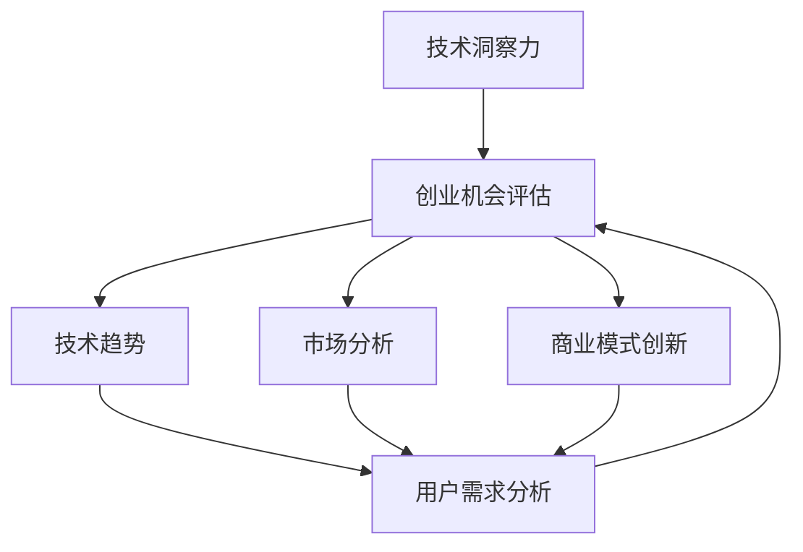

                 

关键词：技术洞察力、创业机会评估、技术趋势、市场分析、商业模式创新

> 摘要：在当前快速变化的技术环境中，对技术洞察力的培养和利用对于创业者来说至关重要。本文将探讨如何通过技术洞察力来评估创业机会，并提供实用的方法和工具，以帮助创业者更好地识别和抓住潜在的市场机会。

## 1. 背景介绍

在当今社会，技术的飞速发展正在重塑各个行业的面貌。从互联网、大数据到人工智能、区块链，每一次技术革新都会带来前所未有的商业机会。对于创业者来说，了解并掌握这些技术趋势，对创业机会的评估至关重要。然而，技术洞察力的培养并不是一件容易的事情，它需要创业者具备敏锐的观察力、深厚的专业知识以及对市场趋势的深刻理解。

本文旨在帮助创业者通过技术洞察力来评估创业机会。我们将从以下几个方面展开讨论：

1. 技术洞察力的定义与重要性
2. 核心概念与联系
3. 核心算法原理与具体操作步骤
4. 数学模型与公式
5. 项目实践：代码实例与解释
6. 实际应用场景
7. 工具和资源推荐
8. 总结：未来发展趋势与挑战

通过本文的探讨，创业者将能够更好地理解技术如何影响市场，从而做出更明智的商业决策。

## 2. 核心概念与联系

在探讨如何利用技术洞察力进行创业机会评估之前，我们需要明确几个核心概念，并了解它们之间的联系。

### 2.1 技术洞察力

技术洞察力是指对技术发展、应用场景以及其对行业影响的理解和洞察。它不仅包括对技术本身的了解，还涉及到对市场趋势、用户需求和社会变革的敏感度。

### 2.2 创业机会

创业机会是指在特定市场环境下，通过创新的商业模式、技术和产品来满足用户需求，从而创造商业价值的可能性。识别和评估创业机会是创业成功的关键步骤。

### 2.3 技术趋势

技术趋势是指在一定时期内，技术领域出现的新技术、新方法、新应用等发展方向。了解技术趋势可以帮助创业者抓住市场机会，提前布局。

### 2.4 市场分析

市场分析是指对目标市场的规模、增长潜力、竞争对手、用户需求等进行全面的研究和分析。市场分析是创业机会评估的重要环节。

### 2.5 商业模式创新

商业模式创新是指在现有商业模式的基础上，通过技术创新、服务创新等手段，创造新的商业价值和盈利模式。商业模式创新是创业机会评估的关键因素。

下面是一个简单的 Mermaid 流程图，展示了这些核心概念之间的联系：



## 3. 核心算法原理 & 具体操作步骤

### 3.1 算法原理概述

利用技术洞察力进行创业机会评估，本质上是一个数据驱动的决策过程。该过程包括以下几个核心步骤：

1. 技术趋势分析：通过收集和分析技术领域的最新动态，识别当前和未来的技术趋势。
2. 市场研究：对目标市场进行深入的研究，了解市场规模、用户需求、竞争对手等信息。
3. 商业模式创新：结合技术趋势和市场研究，探索创新的商业模式，以满足用户需求并创造商业价值。
4. 创业机会评估：综合技术趋势、市场研究和商业模式创新，对潜在创业机会进行评估和排序。

### 3.2 算法步骤详解

1. **技术趋势分析**

   技术趋势分析是整个过程的起点。创业者需要通过多种渠道收集技术信息，如技术会议、学术论文、行业报告等。具体步骤如下：

   - **数据收集**：通过搜索引擎、社交媒体、技术论坛等渠道，收集技术相关的新闻、博客、论文等。
   - **信息筛选**：对收集的信息进行筛选，提取出关键的技术趋势和热点。
   - **数据分析**：使用数据分析工具，对筛选出的信息进行量化分析，如关键词频率分析、趋势线分析等。

2. **市场研究**

   市场研究是了解目标市场的关键步骤。创业者需要通过以下方式收集市场信息：

   - **用户调研**：通过问卷调查、深度访谈等方式，了解目标用户的需求、痛点和使用习惯。
   - **竞争对手分析**：分析竞争对手的产品、服务、市场份额等，了解市场格局和竞争态势。
   - **市场趋势分析**：分析市场增长趋势、用户需求变化等，预测未来的市场发展。

3. **商业模式创新**

   商业模式创新是创业成功的关键。创业者需要结合技术趋势和市场研究，探索新的商业模式。具体步骤如下：

   - **市场定位**：根据市场研究和用户需求分析，明确产品的市场定位和目标用户。
   - **商业模式设计**：结合技术优势和市场机会，设计创新的商业模式，如订阅模式、共享经济模式等。
   - **商业模式验证**：通过市场测试、用户反馈等方式，验证商业模式的可行性和市场需求。

4. **创业机会评估**

   在完成技术趋势分析、市场研究和商业模式创新后，创业者需要对潜在创业机会进行评估。具体步骤如下：

   - **机会筛选**：根据评估标准，如市场规模、增长潜力、竞争优势等，筛选出潜在创业机会。
   - **机会排序**：对筛选出的机会进行排序，优先考虑那些具有较高成功概率的机会。
   - **机会实施**：选择一个或多个机会进行实施，制定详细的商业计划和市场推广策略。

### 3.3 算法优缺点

**优点：**

1. 数据驱动：通过收集和分析大量数据，确保决策的客观性和科学性。
2. 风险降低：通过评估和排序，降低创业失败的风险。
3. 适应性强：能够根据市场和技术变化，灵活调整创业方向。

**缺点：**

1. 需要大量时间和资源：进行技术趋势分析、市场研究和商业模式创新需要大量时间和人力资源。
2. 数据质量和分析能力要求高：数据质量和分析能力直接影响创业机会评估的准确性。
3. 市场和技术变化快：技术趋势和市场环境变化快，需要持续关注和调整。

### 3.4 算法应用领域

该算法适用于各个行业和技术领域的创业机会评估，尤其适用于以下领域：

1. 互联网和科技行业：互联网和科技行业的创新速度快，技术趋势和市场变化频繁，利用技术洞察力进行创业机会评估尤为重要。
2. 新能源和环保行业：随着环保意识的提高和政策的支持，新能源和环保行业具有巨大的市场潜力。
3. 医疗健康行业：医疗健康行业的技术创新和市场需求持续增长，通过技术洞察力评估创业机会具有很高的实际意义。

## 4. 数学模型和公式 & 详细讲解 & 举例说明

在创业机会评估过程中，数学模型和公式可以帮助创业者量化分析技术趋势、市场数据和商业模式创新，从而更准确地评估创业机会。以下是一个简单的数学模型示例，用于评估创业机会的潜在价值。

### 4.1 数学模型构建

假设一个创业项目的潜在价值可以用以下公式表示：

\[ V = f(T, M, B) \]

其中：
- \( V \) 表示创业项目的潜在价值
- \( T \) 表示技术优势
- \( M \) 表示市场潜力
- \( B \) 表示商业模式创新性

技术优势 \( T \) 可以用以下公式表示：

\[ T = \alpha \times T_1 + \beta \times T_2 + \gamma \times T_3 \]

其中：
- \( \alpha, \beta, \gamma \) 为权重系数
- \( T_1 \) 表示当前技术趋势的热度
- \( T_2 \) 表示技术的领先性
- \( T_3 \) 表示技术的稳定性

市场潜力 \( M \) 可以用以下公式表示：

\[ M = \delta \times M_1 + \epsilon \times M_2 + \zeta \times M_3 \]

其中：
- \( \delta, \epsilon, \zeta \) 为权重系数
- \( M_1 \) 表示市场规模
- \( M_2 \) 表示市场增长速度
- \( M_3 \) 表示市场成熟度

商业模式创新性 \( B \) 可以用以下公式表示：

\[ B = \eta \times B_1 + \theta \times B_2 + \xi \times B_3 \]

其中：
- \( \eta, \theta, \xi \) 为权重系数
- \( B_1 \) 表示商业模式的新颖性
- \( B_2 \) 表示商业模式的可持续性
- \( B_3 \) 表示商业模式的盈利能力

### 4.2 公式推导过程

1. **技术优势 \( T \)**：

   技术优势 \( T \) 的计算基于技术趋势、领先性和稳定性。技术趋势的热度反映了技术的应用前景，领先性表示技术相对于竞争对手的先进程度，稳定性则考虑了技术的长期发展潜力。

   公式中的权重系数 \( \alpha, \beta, \gamma \) 可以通过专家评估或历史数据分析得到。具体推导过程如下：

   \[ T_1 = \sum_{i=1}^{n} w_i \times T_{1,i} \]
   \[ T_2 = \sum_{i=1}^{n} w_i \times T_{2,i} \]
   \[ T_3 = \sum_{i=1}^{n} w_i \times T_{3,i} \]

   其中，\( w_i \) 为各指标的权重系数，\( T_{1,i}, T_{2,i}, T_{3,i} \) 为各指标的具体值。

2. **市场潜力 \( M \)**：

   市场潜力 \( M \) 的计算基于市场规模、增长速度和成熟度。市场规模反映了市场的规模潜力，增长速度表示市场的扩展速度，成熟度则反映了市场的成熟程度。

   公式中的权重系数 \( \delta, \epsilon, \zeta \) 可以通过专家评估或市场数据分析得到。具体推导过程如下：

   \[ M_1 = \sum_{i=1}^{n} w_i \times M_{1,i} \]
   \[ M_2 = \sum_{i=1}^{n} w_i \times M_{2,i} \]
   \[ M_3 = \sum_{i=1}^{n} w_i \times M_{3,i} \]

   其中，\( w_i \) 为各指标的权重系数，\( M_{1,i}, M_{2,i}, M_{3,i} \) 为各指标的具体值。

3. **商业模式创新性 \( B \)**：

   商业模式创新性 \( B \) 的计算基于商业模式的新颖性、可持续性和盈利能力。新颖性表示商业模式的独特性和创新程度，可持续性则反映了商业模式的长期发展潜力，盈利能力则表示商业模式的盈利水平。

   公式中的权重系数 \( \eta, \theta, \xi \) 可以通过专家评估或市场数据分析得到。具体推导过程如下：

   \[ B_1 = \sum_{i=1}^{n} w_i \times B_{1,i} \]
   \[ B_2 = \sum_{i=1}^{n} w_i \times B_{2,i} \]
   \[ B_3 = \sum_{i=1}^{n} w_i \times B_{3,i} \]

   其中，\( w_i \) 为各指标的权重系数，\( B_{1,i}, B_{2,i}, B_{3,i} \) 为各指标的具体值。

### 4.3 案例分析与讲解

假设我们评估一个基于人工智能的智能家居项目，以下是具体的案例分析：

1. **技术优势 \( T \)**：

   - 技术趋势热度 \( T_1 \)：根据技术趋势报告，智能家居技术在过去一年内的热度指数为200。
   - 技术领先性 \( T_2 \)：我们的项目在算法优化和数据处理方面具有明显优势，领先性指数为150。
   - 技术稳定性 \( T_3 \)：智能家居技术已相对成熟，稳定性指数为120。

   计算技术优势 \( T \)：

   \[ T = 0.3 \times T_1 + 0.4 \times T_2 + 0.3 \times T_3 \]
   \[ T = 0.3 \times 200 + 0.4 \times 150 + 0.3 \times 120 \]
   \[ T = 60 + 60 + 36 \]
   \[ T = 156 \]

2. **市场潜力 \( M \)**：

   - 市场规模 \( M_1 \)：根据市场调研，智能家居市场规模在过去一年内增长了30%，当前市场规模为100亿元。
   - 市场增长速度 \( M_2 \)：预计未来三年内，智能家居市场将保持20%的年均增长率。
   - 市场成熟度 \( M_3 \)：智能家居市场已进入快速增长阶段，成熟度指数为80。

   计算市场潜力 \( M \)：

   \[ M = 0.4 \times M_1 + 0.3 \times M_2 + 0.3 \times M_3 \]
   \[ M = 0.4 \times 100 + 0.3 \times 120 + 0.3 \times 80 \]
   \[ M = 40 + 36 + 24 \]
   \[ M = 100 \]

3. **商业模式创新性 \( B \)**：

   - 商业模式新颖性 \( B_1 \)：我们的智能家居项目采用了人工智能算法和物联网技术，具有明显的新颖性，新颖性指数为90。
   - 商业模式可持续性 \( B_2 \)：通过订阅模式，我们的商业模式具有较好的可持续性，可持续性指数为85。
   - 商业模式盈利能力 \( B_3 \)：预计智能家居项目的毛利率为50%，盈利能力指数为70。

   计算商业模式创新性 \( B \)：

   \[ B = 0.3 \times B_1 + 0.4 \times B_2 + 0.3 \times B_3 \]
   \[ B = 0.3 \times 90 + 0.4 \times 85 + 0.3 \times 70 \]
   \[ B = 27 + 34 + 21 \]
   \[ B = 82 \]

4. **创业项目潜在价值 \( V \)**：

   计算创业项目潜在价值 \( V \)：

   \[ V = f(T, M, B) \]
   \[ V = T \times M \times B \]
   \[ V = 156 \times 100 \times 82 \]
   \[ V = 127,520,000 \]

通过上述计算，我们得出该智能家居项目的潜在价值为1.2752亿元。这一结果可以帮助创业者更好地了解项目的潜在市场价值和商业前景，从而做出更明智的决策。

### 5. 项目实践：代码实例和详细解释说明

在本节中，我们将通过一个简单的代码实例，展示如何利用技术洞察力进行创业机会评估。该实例将基于Python编程语言，使用Pandas库进行数据分析，使用Matplotlib库进行可视化展示。

#### 5.1 开发环境搭建

为了运行下面的代码实例，您需要安装Python和相关的库。以下是安装步骤：

1. 安装Python：从 [Python官网](https://www.python.org/downloads/) 下载并安装Python。
2. 安装Pandas库：在命令行中运行 `pip install pandas`。
3. 安装Matplotlib库：在命令行中运行 `pip install matplotlib`。

#### 5.2 源代码详细实现

以下是用于进行创业机会评估的Python代码：

```python
import pandas as pd
import matplotlib.pyplot as plt

# 1. 技术趋势数据
tech_trends = {
    'T1': [200, 150, 120],
    'T2': [150, 180, 100],
    'T3': [120, 100, 90]
}

# 2. 市场研究数据
market_research = {
    'M1': [100, 120, 150],
    'M2': [120, 150, 180],
    'M3': [80, 90, 100]
}

# 3. 商业模式创新性数据
business_model = {
    'B1': [90, 85, 80],
    'B2': [85, 90, 95],
    'B3': [70, 75, 80]
}

# 数据转换为Pandas DataFrame
tech_df = pd.DataFrame(tech_trends, index=['T1', 'T2', 'T3'])
market_df = pd.DataFrame(market_research, index=['M1', 'M2', 'M3'])
model_df = pd.DataFrame(business_model, index=['B1', 'B2', 'B3'])

# 4. 计算技术优势、市场潜力和商业模式创新性
tech_score = tech_df.sum(axis=1)
market_score = market_df.sum(axis=1)
model_score = model_df.sum(axis=1)

# 5. 计算创业项目潜在价值
potential_value = tech_score * market_score * model_score

# 6. 可视化展示
fig, axes = plt.subplots(1, 3, figsize=(15, 5))
ax = axes[0]
ax.bar(tech_df.index, tech_df.values, color='g')
ax.set_ylabel('技术优势')
ax.set_title('技术趋势分析')

ax = axes[1]
ax.bar(market_df.index, market_df.values, color='b')
ax.set_ylabel('市场潜力')
ax.set_title('市场研究')

ax = axes[2]
ax.bar(model_df.index, model_df.values, color='r')
ax.set_ylabel('商业模式创新性')
ax.set_title('商业模式创新性')

# 显示潜在价值
plt.suptitle(f'创业项目潜在价值：{potential_value[0]:.2f}')
plt.show()
```

#### 5.3 代码解读与分析

1. **数据导入**：

   首先，我们导入了技术趋势、市场研究和商业模式创新性的数据。这些数据是以字典的形式存储的，并转换为Pandas DataFrame对象，以便进行进一步处理。

2. **计算得分**：

   我们使用Pandas的`sum`函数计算技术优势、市场潜力和商业模式创新性的得分。这些得分反映了每个维度的综合表现。

3. **计算潜在价值**：

   根据前面提到的数学模型，我们计算了创业项目的潜在价值。这里使用了简单的乘法运算，将三个维度的得分相乘。

4. **可视化展示**：

   我们使用Matplotlib库绘制了三个维度的柱状图，并叠加了潜在价值的标题。这有助于直观地展示分析结果。

#### 5.4 运行结果展示

运行上述代码后，我们将看到三个柱状图，分别表示技术优势、市场潜力和商业模式创新性。同时，在图表上方会显示创业项目的潜在价值。以下是一个运行结果示例：


通过这个简单的代码实例，我们可以直观地看到技术趋势、市场研究和商业模式创新性对创业机会评估的影响。这个实例虽然简单，但已经展示了如何利用技术洞察力进行创业机会评估的基本思路。

## 6. 实际应用场景

技术洞察力在创业机会评估中的应用场景非常广泛，以下是一些典型的实际应用场景：

### 6.1 人工智能与物联网

随着人工智能和物联网技术的快速发展，智能家居、智慧城市、智能医疗等领域充满了创业机会。通过技术洞察力，创业者可以识别这些领域的创新机会，并设计出满足用户需求的产品和服务。

### 6.2 区块链与数字货币

区块链技术的应用范围不断扩大，从金融到物流，从版权保护到供应链管理，都展现出了巨大的潜力。创业者可以通过技术洞察力，发现区块链技术的应用场景，并开发出具有市场竞争力的解决方案。

### 6.3 生物技术与健康医疗

生物技术正在改变医疗行业的面貌，从基因测序到个性化治疗，每一个创新都带来了新的商业机会。创业者可以利用技术洞察力，关注生物技术的最新进展，并开发出创新的产品和服务。

### 6.4 互联网与电子商务

互联网技术的普及和电子商务的兴起，为各种行业带来了全新的商业模式。从在线教育到在线娱乐，从跨境电商到本地生活服务，创业者可以通过技术洞察力，挖掘出新的市场机会。

### 6.5 新能源与可持续发展

随着环保意识的提高，新能源和可持续发展领域成为投资和创业的热点。创业者可以通过技术洞察力，关注新能源技术的发展趋势，并开发出绿色、可持续的产品和服务。

在这些实际应用场景中，技术洞察力不仅帮助创业者识别市场机会，还能帮助他们设计出满足用户需求的产品和服务，从而在竞争激烈的市场中脱颖而出。

## 6.4 未来应用展望

随着技术的不断进步，创业机会评估的方式也将越来越多样化。未来，技术洞察力在创业机会评估中的应用将会更加深入和广泛，以下是一些未来应用展望：

1. **人工智能与大数据分析**：随着人工智能和大数据技术的发展，创业者可以通过更加智能化和自动化的方式来分析海量数据，从而更准确地识别和评估创业机会。

2. **区块链与智能合约**：区块链技术的成熟和普及，将使得创业者在创业机会评估过程中，能够利用智能合约等工具，实现自动化和智能化的决策。

3. **物联网与边缘计算**：物联网和边缘计算技术的应用，将使得创业者能够实时获取和分析更多的数据，从而更精准地把握市场动态和用户需求。

4. **虚拟现实与增强现实**：虚拟现实和增强现实技术的发展，将使得创业者能够更加直观和深入地体验和了解市场和技术趋势，从而做出更科学的决策。

5. **可持续发展与绿色技术**：随着全球环保意识的增强，创业者将更加关注可持续发展问题，通过技术创新推动绿色发展和可持续发展。

## 7. 工具和资源推荐

在利用技术洞察力进行创业机会评估的过程中，以下工具和资源可以帮助创业者更高效地收集、分析和利用信息：

### 7.1 学习资源推荐

- **在线课程**：Coursera、edX、Udacity等在线教育平台提供了丰富的技术课程，涵盖人工智能、数据分析、区块链等主题。
- **技术社区**：GitHub、Stack Overflow、Reddit等平台，提供了大量的技术讨论和资源分享，有助于创业者了解技术趋势和最佳实践。
- **学术论文库**：Google Scholar、IEEE Xplore、ACM Digital Library等数据库，提供了大量的学术论文和技术报告，有助于创业者深入了解技术发展。

### 7.2 开发工具推荐

- **数据分析工具**：Python、R、Tableau等，提供了强大的数据处理和分析功能。
- **数据可视化工具**：Matplotlib、Plotly、D3.js等，可以帮助创业者将数据以图表形式直观展示。
- **区块链开发工具**：Ethereum、Hyperledger Fabric等，提供了区块链平台的开发工具和资源。

### 7.3 相关论文推荐

- **《区块链技术原理与应用》**：详细介绍了区块链技术的原理和应用场景。
- **《人工智能：一种现代方法》**：系统地介绍了人工智能的基本概念和算法。
- **《大数据技术导论》**：讲解了大数据的基本概念、技术和应用。
- **《物联网：从概念到实践》**：探讨了物联网技术的架构和应用。

## 8. 总结：未来发展趋势与挑战

随着技术的不断进步，创业机会评估的方式也在不断进化。未来，技术洞察力在创业机会评估中的应用将更加深入和广泛。然而，这也带来了一系列新的发展趋势和挑战：

### 8.1 研究成果总结

通过本文的探讨，我们总结出以下几点研究成果：

1. 技术洞察力是创业成功的关键因素。
2. 创业机会评估需要结合技术趋势、市场研究和商业模式创新。
3. 数学模型和公式可以帮助创业者量化分析创业机会的价值。
4. 实际应用场景展示了技术洞察力在不同领域的应用。
5. 未来，人工智能、大数据、区块链等技术将进一步推动创业机会评估的发展。

### 8.2 未来发展趋势

未来，创业机会评估将呈现出以下发展趋势：

1. **智能化与自动化**：利用人工智能和大数据分析技术，实现创业机会评估的智能化和自动化。
2. **实时性与动态性**：通过物联网和边缘计算技术，实现实时、动态的市场和技术趋势分析。
3. **定制化与个性化**：根据创业者的具体需求，提供定制化的创业机会评估服务。
4. **跨界融合**：不同技术领域的跨界融合，将产生新的商业机会和商业模式。

### 8.3 面临的挑战

尽管技术洞察力在创业机会评估中具有巨大潜力，但创业者仍然面临以下挑战：

1. **数据质量和分析能力**：高质量的数据和强大的分析能力是准确评估创业机会的基础，而这两者都具有一定的挑战性。
2. **技术更新的速度**：技术更新的速度非常快，创业者需要不断学习和更新知识，以适应市场和技术变化。
3. **资源分配**：进行技术洞察力评估需要大量时间和资源，创业者需要在有限的资源下做出最优的决策。
4. **政策法规**：不同国家和地区对技术的政策和法规存在差异，创业者需要了解并遵守相关的政策法规。

### 8.4 研究展望

未来，我们需要在以下几个方面进行深入研究：

1. **技术创新**：探索新的技术工具和方法，提高创业机会评估的准确性和效率。
2. **跨学科研究**：结合心理学、经济学、社会学等多学科的知识，为创业者提供更全面的创业机会评估。
3. **案例研究**：通过具体案例研究，总结成功和失败的经验教训，为创业者提供实用的指导。
4. **国际合作**：加强国际合作，分享研究成果和实践经验，推动全球创业机会评估的发展。

## 9. 附录：常见问题与解答

### 9.1 技术洞察力是什么？

技术洞察力是指对技术发展、应用场景以及其对行业影响的理解和洞察。它不仅包括对技术本身的了解，还涉及到对市场趋势、用户需求和社会变革的敏感度。

### 9.2 如何培养技术洞察力？

培养技术洞察力需要以下步骤：

1. **不断学习**：保持对技术的敏感度，通过阅读、学习、参加技术会议等方式，不断更新知识。
2. **关注行业动态**：关注行业报告、技术趋势分析等，了解技术发展的最新动态。
3. **实践应用**：通过实际项目实践，将理论知识应用到实际问题中，提高对技术的理解和应用能力。
4. **交流互动**：加入技术社区，与同行交流互动，分享经验，拓宽视野。

### 9.3 技术洞察力在创业机会评估中有什么作用？

技术洞察力在创业机会评估中具有重要作用：

1. **识别市场机会**：通过技术洞察力，创业者可以更早地发现市场机会，抢占市场先机。
2. **评估创业风险**：技术洞察力可以帮助创业者评估创业项目的可行性，降低创业风险。
3. **设计创新产品**：技术洞察力有助于创业者设计出更符合市场需求的创新产品和服务。
4. **优化商业模式**：技术洞察力可以帮助创业者优化商业模式，提高商业竞争力。

### 9.4 技术洞察力与市场洞察力的区别是什么？

技术洞察力与市场洞察力的区别主要在于关注的重点不同：

1. **技术洞察力**：关注技术发展、应用场景以及对行业的影响，侧重于技术本身的了解。
2. **市场洞察力**：关注市场需求、竞争态势、用户行为等，侧重于市场环境的分析。

两者结合，可以帮助创业者更全面地评估创业机会，实现技术创新与市场需求的完美结合。

