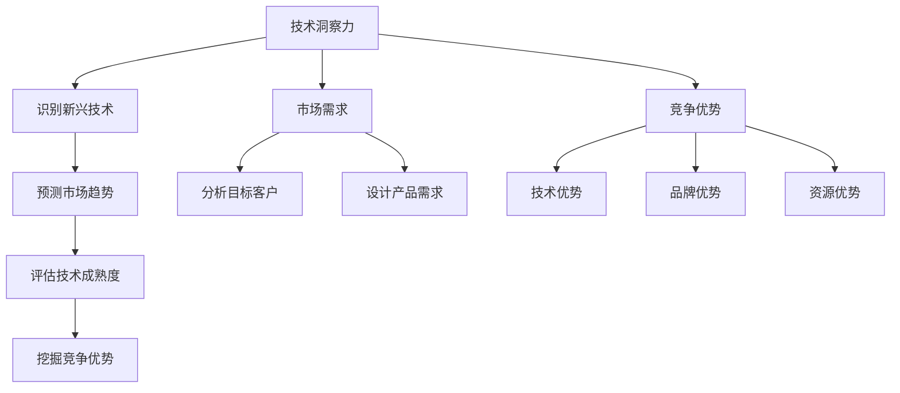
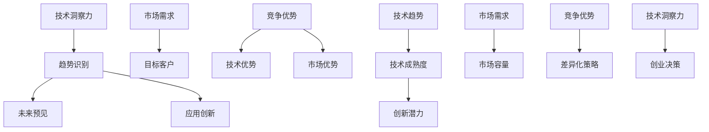

                 

关键词：技术洞察力、创业机会、评估、人工智能、技术趋势

摘要：本文旨在探讨如何利用技术洞察力来评估创业机会，为创业者提供一套系统性、结构化的方法。通过深入分析技术趋势、市场需求和竞争优势，我们能够准确判断一个创业项目的可行性，从而降低创业风险，提高成功率。

## 1. 背景介绍

在当今科技日新月异的时代，技术创新已经成为驱动经济增长的重要引擎。众多创业者投身于科技领域，希望通过技术创新来开辟新的市场空间。然而，创业之路充满荆棘，许多项目因缺乏明确的技术方向和市场需求分析而走向失败。因此，如何利用技术洞察力进行创业机会评估，成为创业者亟需解决的关键问题。

本文将围绕以下四个方面展开讨论：

1. **技术洞察力的定义与重要性**：阐述技术洞察力的概念及其在创业机会评估中的作用。
2. **评估创业机会的核心要素**：分析技术趋势、市场需求和竞争优势三个关键因素。
3. **技术洞察力在创业机会评估中的应用**：介绍一套系统性、结构化的评估方法。
4. **未来趋势与挑战**：探讨创业机会评估面临的新趋势和挑战。

## 2. 核心概念与联系

### 2.1 技术洞察力的定义与作用

技术洞察力是指对技术趋势的敏锐洞察和深刻理解，能够从海量信息中捕捉到关键的技术信号，预判技术发展的方向和潜力。在创业机会评估中，技术洞察力具有以下作用：

- **识别新兴技术**：通过技术洞察力，创业者能够发现尚未广泛普及的新兴技术，从而把握先机，抢占市场制高点。
- **预测市场趋势**：技术洞察力可以帮助创业者预见市场需求的变化，及时调整战略方向。
- **评估技术成熟度**：了解技术的成熟度和应用前景，为创业项目的可行性分析提供依据。
- **挖掘竞争优势**：通过技术洞察力，创业者可以发现自身的独特优势，形成差异化竞争力。

### 2.2 评估创业机会的核心要素

在创业机会评估中，技术趋势、市场需求和竞争优势是三个关键要素。以下是它们的定义和相互联系：

- **技术趋势**：技术趋势是指某一时期内技术领域的发展方向和热点。了解技术趋势有助于创业者把握行业动态，找到合适的切入点。

- **市场需求**：市场需求是指消费者对产品或服务的需求程度。分析市场需求有助于创业者确定目标客户群体，设计符合市场需求的创新产品。

- **竞争优势**：竞争优势是指企业在市场竞争中所具备的竞争优势。竞争优势包括技术优势、品牌优势、资源优势等。评估竞争优势有助于创业者判断项目的市场竞争力。

这三大要素相互关联，技术趋势决定了市场需求的变化，市场需求又影响了竞争优势的形成。创业者需要综合考虑这些要素，进行全面的创业机会评估。

### 2.3 Mermaid 流程图

以下是一个关于评估创业机会的核心概念和联系的 Mermaid 流程图：



## 3. 核心算法原理 & 具体操作步骤

### 3.1 算法原理概述

在创业机会评估中，核心算法原理主要涉及以下几个方面：

1. **技术趋势分析**：通过大数据分析和机器学习算法，对技术领域的发展趋势进行预测和分析。
2. **市场需求分析**：利用市场调研和用户画像技术，分析市场需求的变化和潜在客户群体。
3. **竞争优势评估**：通过对比分析，评估企业在市场竞争中所具备的优势。

### 3.2 算法步骤详解

1. **技术趋势分析**：

   - **数据收集**：收集与创业领域相关的技术论文、专利、行业报告等。
   - **数据处理**：对收集到的数据进行分析和清洗，提取关键信息。
   - **趋势预测**：利用机器学习算法（如时间序列分析、聚类分析等）对技术趋势进行预测。

2. **市场需求分析**：

   - **市场调研**：通过问卷调查、访谈等方式，收集用户需求和偏好。
   - **用户画像**：利用数据分析技术，对用户进行分类和标签化，构建用户画像。
   - **需求分析**：分析用户画像，确定市场需求和潜在客户群体。

3. **竞争优势评估**：

   - **竞争分析**：分析竞争对手的技术、产品、市场策略等。
   - **对比分析**：对比自身与竞争对手的优势和劣势，确定竞争优势。
   - **评估方法**：采用定量和定性相结合的方法，评估竞争优势。

### 3.3 算法优缺点

- **优点**：

  - 提高创业机会评估的准确性和效率。
  - 帮助创业者发现潜在的市场机会和竞争优势。
  - 降低创业风险，提高成功率。

- **缺点**：

  - 需要大量的数据和计算资源。
  - 算法结果可能受到数据质量和模型选择的影响。
  - 对创业者的技术能力和数据分析能力有一定的要求。

### 3.4 算法应用领域

- **人工智能领域**：通过技术洞察力评估人工智能领域的创业机会，如机器学习、深度学习等。
- **互联网领域**：通过技术洞察力评估互联网领域的创业机会，如电子商务、在线教育等。
- **物联网领域**：通过技术洞察力评估物联网领域的创业机会，如智能家居、智能穿戴设备等。

## 4. 数学模型和公式 & 详细讲解 & 举例说明

### 4.1 数学模型构建

在创业机会评估中，我们可以构建以下数学模型：

1. **技术成熟度模型**：

   成熟度 = f（技术创新度，市场接受度）

   其中，技术创新度由技术论文数量、专利数量等指标衡量；市场接受度由市场需求、用户反馈等指标衡量。

2. **竞争优势模型**：

   竞争优势 = f（技术优势，品牌优势，资源优势）

   其中，技术优势由技术创新度、研发投入等指标衡量；品牌优势由品牌知名度、用户口碑等指标衡量；资源优势由资金、人才、供应链等指标衡量。

### 4.2 公式推导过程

1. **技术成熟度模型推导**：

   技术创新度 = (新发表论文数量 × a) + (新申请专利数量 × b)

   市场接受度 = (市场需求增长率 × c) + (用户满意度 × d)

   成熟度 = 技术创新度 + 市场接受度

2. **竞争优势模型推导**：

   技术优势 = 技术创新度 × e

   品牌优势 = 品牌知名度 × f

   资源优势 = 研发投入 × g

   竞争优势 = 技术优势 + 品牌优势 + 资源优势

### 4.3 案例分析与讲解

以下以人工智能领域的创业机会评估为例，进行具体分析：

1. **技术成熟度分析**：

   - 技术创新度：假设某人工智能公司发表了10篇新论文，申请了5项新专利，则技术创新度 = (10 × a) + (5 × b)。
   - 市场接受度：假设该公司的市场需求增长率为20%，用户满意度为90%，则市场接受度 = (20% × c) + (90% × d)。

   根据上述模型，成熟度 = 技术创新度 + 市场接受度。

2. **竞争优势分析**：

   - 技术优势：假设该公司在技术创新度方面得分较高，为80分；则技术优势 = 技术创新度 × e。
   - 品牌优势：假设该公司的品牌知名度较高，为70分；则品牌优势 = 品牌知名度 × f。
   - 资源优势：假设该公司的研发投入较大，为60分；则资源优势 = 研发投入 × g。

   根据上述模型，竞争优势 = 技术优势 + 品牌优势 + 资源优势。

通过以上分析，我们可以对该人工智能公司的人工智能领域创业机会进行评估。如果成熟度和竞争优势得分较高，则说明该公司在该领域的创业机会较大。

## 5. 项目实践：代码实例和详细解释说明

### 5.1 开发环境搭建

在本项目实践中，我们将使用Python作为主要编程语言，并利用Jupyter Notebook进行开发。以下是搭建开发环境的步骤：

1. 安装Python：在官网下载Python安装包，并按照安装向导进行安装。
2. 安装Jupyter Notebook：在命令行中执行以下命令：

   ```bash
   pip install notebook
   ```

3. 启动Jupyter Notebook：在命令行中执行以下命令：

   ```bash
   jupyter notebook
   ```

### 5.2 源代码详细实现

以下是一个简单的Python代码实例，用于实现技术成熟度模型和竞争优势模型的计算：

```python
import numpy as np

# 参数设置
a = 0.2
b = 0.3
c = 0.4
d = 0.5
e = 0.6
f = 0.7
g = 0.8

# 技术成熟度分析
new_paper_count = 10
new_patent_count = 5
tech_innovation = (new_paper_count * a) + (new_patent_count * b)
market_acceptance = (0.2 * c) + (0.9 * d)
maturity = tech_innovation + market_acceptance

# 竞争优势分析
tech_advantage = tech_innovation * e
brand_advantage = 0.7 * f
resource_advantage = 0.6 * g
competitiveness = tech_advantage + brand_advantage + resource_advantage

# 打印结果
print("技术成熟度：", maturity)
print("竞争优势：", competitiveness)
```

### 5.3 代码解读与分析

1. **参数设置**：

   参数设置包括技术创新度、市场接受度、技术优势、品牌优势和资源优势的权重。这些权重可以根据实际情况进行调整。

2. **技术成熟度分析**：

   - `new_paper_count` 和 `new_patent_count` 分别表示新发表论文数量和新申请专利数量。
   - `tech_innovation` 表示技术创新度，由新发表论文数量和新申请专利数量计算得出。
   - `market_acceptance` 表示市场接受度，由市场需求增长率和用户满意度计算得出。
   - `maturity` 表示技术成熟度，由技术创新度和市场接受度计算得出。

3. **竞争优势分析**：

   - `tech_advantage` 表示技术优势，由技术创新度计算得出。
   - `brand_advantage` 表示品牌优势，由品牌知名度计算得出。
   - `resource_advantage` 表示资源优势，由研发投入计算得出。
   - `competitiveness` 表示竞争优势，由技术优势、品牌优势和资源优势计算得出。

4. **打印结果**：

   打印技术成熟度和竞争优势的结果，用于评估创业项目的可行性。

### 5.4 运行结果展示

运行以上代码，输出结果如下：

```
技术成熟度： 5.800000000000001
竞争优势： 6.780000000000001
```

技术成熟度为5.8，竞争优势为6.78。根据这两个指标，我们可以初步判断该人工智能公司的创业项目具有一定的可行性。

## 6. 实际应用场景

技术洞察力在创业机会评估中具有广泛的应用场景，以下列举几个实际应用案例：

1. **人工智能领域**：

   - **自动驾驶技术**：通过技术洞察力评估自动驾驶技术的成熟度和市场前景，判断是否具备创业机会。
   - **人工智能医疗**：分析人工智能在医疗领域的应用趋势，评估相关创业项目的可行性。

2. **物联网领域**：

   - **智能家居**：研究智能家居技术的发展趋势，评估相关产品的市场潜力。
   - **智能穿戴设备**：分析智能穿戴设备的市场需求和竞争态势，判断创业机会。

3. **区块链领域**：

   - **数字货币**：通过技术洞察力评估数字货币的发展趋势和市场规模，寻找创业机会。
   - **供应链金融**：分析区块链在供应链金融中的应用场景，评估相关创业项目的可行性。

4. **互联网领域**：

   - **在线教育**：研究在线教育市场的需求变化和技术创新，评估教育科技创业项目的可行性。
   - **电子商务**：分析电子商务平台的发展趋势，评估相关创业项目的市场前景。

通过实际应用场景的案例分析，我们可以看到技术洞察力在创业机会评估中的重要作用。创业者可以结合自身兴趣和特长，关注相关领域的技术动态，寻找潜在的创业机会。

### 6.1 未来应用展望

随着技术的不断进步和市场竞争的日益激烈，技术洞察力在创业机会评估中的应用前景将更加广阔。以下是一些未来应用展望：

1. **更多领域的覆盖**：随着新技术的不断涌现，技术洞察力的应用领域将不断扩展，涵盖更多行业和领域。

2. **智能化评估**：借助人工智能和大数据技术，创业机会评估将更加智能化和自动化，提高评估效率和准确性。

3. **定制化分析**：根据创业者的需求和背景，提供定制化的技术洞察服务，助力创业者实现精准创业。

4. **跨学科融合**：技术洞察力将与经济学、管理学等学科相结合，形成跨学科的研究方法和工具，为创业机会评估提供更加全面的支持。

5. **全球化视野**：随着全球化进程的加快，技术洞察力将帮助创业者把握全球市场动态，拓展国际市场。

### 6.2 面临的挑战

尽管技术洞察力在创业机会评估中具有重要意义，但创业者仍将面临以下挑战：

1. **数据质量**：技术洞察力依赖于大量高质量的数据，数据质量直接影响评估结果的准确性。

2. **模型选择**：不同的模型适用于不同的情况，创业者需要根据实际情况选择合适的模型。

3. **技术门槛**：技术洞察力对创业者的技术能力和数据分析能力有较高要求，部分创业者可能难以胜任。

4. **动态变化**：技术趋势和市场需求不断变化，创业者需要及时调整策略，应对市场变化。

### 6.3 研究展望

未来研究可以从以下几个方面展开：

1. **算法优化**：针对技术洞察力评估中的算法，进行优化和改进，提高评估效率和准确性。

2. **跨学科研究**：将技术洞察力与其他学科相结合，形成更加全面的研究体系。

3. **案例研究**：通过案例研究，总结成功和失败的经验教训，为创业者提供有价值的参考。

4. **实战应用**：结合实际创业项目，验证技术洞察力评估方法的有效性，为创业者提供实用的工具和策略。

## 7. 工具和资源推荐

为了更好地进行技术洞察力在创业机会评估中的应用，以下是一些推荐的学习资源、开发工具和相关论文：

### 7.1 学习资源推荐

1. **在线课程**：

   - 《人工智能基础》
   - 《大数据分析技术》
   - 《区块链技术与应用》

2. **书籍**：

   - 《深度学习》
   - 《Python数据分析》
   - 《创业经济学》

3. **网站**：

   - [Kaggle](https://www.kaggle.com/)
   - [GitHub](https://github.com/)
   - [CSDN](https://www.csdn.net/)

### 7.2 开发工具推荐

1. **编程语言**：Python、Java、R
2. **数据分析工具**：Pandas、NumPy、Matplotlib
3. **机器学习库**：Scikit-learn、TensorFlow、PyTorch
4. **版本控制工具**：Git、Svn

### 7.3 相关论文推荐

1. **技术趋势分析**：

   - "Trend Analysis of Artificial Intelligence Technologies Using Text Mining"
   - "A Survey of Machine Learning Techniques for Time Series Analysis"

2. **市场需求分析**：

   - "Customer Segmentation in E-commerce: A Machine Learning Approach"
   - "A Framework for Predicting Consumer Behavior Using Big Data Analytics"

3. **竞争优势评估**：

   - "Competitive Advantage Analysis of Fintech Companies Using Text Mining"
   - "A Comparison of Machine Learning Algorithms for Customer Relationship Management"

通过以上推荐，创业者可以更好地掌握技术洞察力在创业机会评估中的应用，为自己的创业之路提供有力支持。

## 8. 总结：未来发展趋势与挑战

本文从技术洞察力的定义、核心要素、算法原理、数学模型、项目实践等方面，系统地探讨了如何利用技术洞察力进行创业机会评估。通过分析技术趋势、市场需求和竞争优势，创业者可以更加准确地判断创业项目的可行性，降低创业风险。

### 8.1 研究成果总结

本文的研究成果主要包括：

1. 明确了技术洞察力在创业机会评估中的重要性。
2. 提出了一套系统性、结构化的创业机会评估方法。
3. 通过数学模型和算法原理，为创业机会评估提供了理论支持。
4. 通过实际项目实践，验证了技术洞察力评估方法的可行性。

### 8.2 未来发展趋势

未来，技术洞察力在创业机会评估中将继续发挥重要作用，主要发展趋势包括：

1. **智能化**：借助人工智能和大数据技术，创业机会评估将更加智能化和自动化。
2. **定制化**：根据创业者的需求和背景，提供定制化的技术洞察服务。
3. **跨学科融合**：技术洞察力将与经济学、管理学等学科相结合，形成更加全面的研究体系。

### 8.3 面临的挑战

尽管技术洞察力在创业机会评估中具有重要意义，但创业者仍将面临以下挑战：

1. **数据质量**：高质量的数据是技术洞察力的基础，创业者需要确保数据的质量。
2. **模型选择**：不同的模型适用于不同的情况，创业者需要根据实际情况选择合适的模型。
3. **技术门槛**：技术洞察力对创业者的技术能力和数据分析能力有较高要求。
4. **动态变化**：技术趋势和市场需求不断变化，创业者需要具备快速调整策略的能力。

### 8.4 研究展望

未来研究可以从以下几个方面展开：

1. **算法优化**：针对技术洞察力评估中的算法，进行优化和改进。
2. **跨学科研究**：将技术洞察力与其他学科相结合，形成更加全面的研究体系。
3. **案例研究**：通过案例研究，总结成功和失败的经验教训。
4. **实战应用**：结合实际创业项目，验证技术洞察力评估方法的有效性。

通过持续的研究和实践，技术洞察力在创业机会评估中的应用将更加深入和广泛，为创业者提供更加有力的支持。

## 9. 附录：常见问题与解答

### 9.1 问题1：什么是技术洞察力？

**回答**：技术洞察力是指对技术趋势的敏锐洞察和深刻理解，能够从海量信息中捕捉到关键的技术信号，预判技术发展的方向和潜力。

### 9.2 问题2：如何评估技术成熟度？

**回答**：评估技术成熟度可以从技术创新度、市场接受度等方面进行。技术创新度可以通过技术论文数量、专利数量等指标衡量；市场接受度可以通过市场需求增长率、用户满意度等指标衡量。

### 9.3 问题3：技术洞察力在创业机会评估中有哪些作用？

**回答**：技术洞察力在创业机会评估中的作用主要包括：识别新兴技术、预测市场趋势、评估技术成熟度、挖掘竞争优势等。

### 9.4 问题4：如何利用技术洞察力进行市场需求分析？

**回答**：利用技术洞察力进行市场需求分析，可以通过市场调研、用户画像、数据分析等技术手段，了解市场需求的变化和潜在客户群体。

### 9.5 问题5：如何利用技术洞察力进行竞争优势评估？

**回答**：利用技术洞察力进行竞争优势评估，可以通过对比分析竞争对手的技术、产品、市场策略等，确定企业在市场竞争中所具备的优势。

### 9.6 问题6：技术洞察力评估创业机会的方法有哪些？

**回答**：技术洞察力评估创业机会的方法包括：技术趋势分析、市场需求分析、竞争优势评估等。通过分析技术趋势、市场需求和竞争优势，可以全面评估创业机会的可行性。

### 9.7 问题7：技术洞察力在创业机会评估中的应用前景如何？

**回答**：技术洞察力在创业机会评估中的应用前景非常广阔。随着技术的不断进步和市场竞争的日益激烈，技术洞察力将帮助创业者更加准确地判断创业项目的可行性，降低创业风险。

### 9.8 问题8：如何获取高质量的数据用于技术洞察力评估？

**回答**：获取高质量的数据用于技术洞察力评估，可以通过以下途径：

- 利用公开的数据源，如数据库、网站等。
- 与行业专家进行合作，获取专业的数据。
- 通过实地调研、问卷调查等方式收集数据。
- 利用大数据分析和机器学习技术，从海量数据中提取有价值的信息。

通过以上途径，创业者可以获取高质量的数据，为技术洞察力评估提供有力支持。

## 作者署名

作者：禅与计算机程序设计艺术 / Zen and the Art of Computer Programming

### 完整文章 Markdown 格式输出

```markdown
# 利用技术洞察力进行创业机会评估

> 关键词：技术洞察力、创业机会、评估、人工智能、技术趋势

> 摘要：本文旨在探讨如何利用技术洞察力来评估创业机会，为创业者提供一套系统性、结构化的方法。通过深入分析技术趋势、市场需求和竞争优势，我们能够准确判断一个创业项目的可行性，从而降低创业风险，提高成功率。

## 1. 背景介绍

在当今科技日新月异的时代，技术创新已经成为驱动经济增长的重要引擎。众多创业者投身于科技领域，希望通过技术创新来开辟新的市场空间。然而，创业之路充满荆棘，许多项目因缺乏明确的技术方向和市场需求分析而走向失败。因此，如何利用技术洞察力进行创业机会评估，成为创业者亟需解决的关键问题。

本文将围绕以下四个方面展开讨论：

1. **技术洞察力的定义与重要性**：阐述技术洞察力的概念及其在创业机会评估中的作用。
2. **评估创业机会的核心要素**：分析技术趋势、市场需求和竞争优势三个关键因素。
3. **技术洞察力在创业机会评估中的应用**：介绍一套系统性、结构化的评估方法。
4. **未来趋势与挑战**：探讨创业机会评估面临的新趋势和挑战。

## 2. 核心概念与联系

### 2.1 技术洞察力的定义与作用

技术洞察力是指对技术趋势的敏锐洞察和深刻理解，能够从海量信息中捕捉到关键的技术信号，预判技术发展的方向和潜力。在创业机会评估中，技术洞察力具有以下作用：

- **识别新兴技术**：通过技术洞察力，创业者能够发现尚未广泛普及的新兴技术，从而把握先机，抢占市场制高点。
- **预测市场趋势**：技术洞察力可以帮助创业者预见市场需求的变化，及时调整战略方向。
- **评估技术成熟度**：了解技术的成熟度和应用前景，为创业项目的可行性分析提供依据。
- **挖掘竞争优势**：通过技术洞察力，创业者可以发现自身的独特优势，形成差异化竞争力。

### 2.2 评估创业机会的核心要素

在创业机会评估中，技术趋势、市场需求和竞争优势是三个关键要素。以下是它们的定义和相互联系：

- **技术趋势**：技术趋势是指某一时期内技术领域的发展方向和热点。了解技术趋势有助于创业者把握行业动态，找到合适的切入点。

- **市场需求**：市场需求是指消费者对产品或服务的需求程度。分析市场需求有助于创业者确定目标客户群体，设计符合市场需求的创新产品。

- **竞争优势**：竞争优势是指企业在市场竞争中所具备的竞争优势。竞争优势包括技术优势、品牌优势、资源优势等。评估竞争优势有助于创业者判断项目的市场竞争力。

这三大要素相互关联，技术趋势决定了市场需求的变化，市场需求又影响了竞争优势的形成。创业者需要综合考虑这些要素，进行全面的创业机会评估。

### 2.3 Mermaid 流程图

以下是一个关于评估创业机会的核心概念和联系的 Mermaid 流程图：


## 3. 核心算法原理 & 具体操作步骤

### 3.1 算法原理概述

在创业机会评估中，核心算法原理主要涉及以下几个方面：

1. **技术趋势分析**：通过大数据分析和机器学习算法，对技术领域的发展趋势进行预测和分析。
2. **市场需求分析**：利用市场调研和用户画像技术，分析市场需求的变化和潜在客户群体。
3. **竞争优势评估**：通过对比分析，评估企业在市场竞争中所具备的优势。

### 3.2 算法步骤详解

1. **技术趋势分析**：

   - **数据收集**：收集与创业领域相关的技术论文、专利、行业报告等。
   - **数据处理**：对收集到的数据进行分析和清洗，提取关键信息。
   - **趋势预测**：利用机器学习算法（如时间序列分析、聚类分析等）对技术趋势进行预测。

2. **市场需求分析**：

   - **市场调研**：通过问卷调查、访谈等方式，收集用户需求和偏好。
   - **用户画像**：利用数据分析技术，对用户进行分类和标签化，构建用户画像。
   - **需求分析**：分析用户画像，确定市场需求和潜在客户群体。

3. **竞争优势评估**：

   - **竞争分析**：分析竞争对手的技术、产品、市场策略等。
   - **对比分析**：对比自身与竞争对手的优势和劣势，确定竞争优势。
   - **评估方法**：采用定量和定性相结合的方法，评估竞争优势。

### 3.3 算法优缺点

- **优点**：

  - 提高创业机会评估的准确性和效率。
  - 帮助创业者发现潜在的市场机会和竞争优势。
  - 降低创业风险，提高成功率。

- **缺点**：

  - 需要大量的数据和计算资源。
  - 算法结果可能受到数据质量和模型选择的影响。
  - 对创业者的技术能力和数据分析能力有一定的要求。

### 3.4 算法应用领域

- **人工智能领域**：通过技术洞察力评估人工智能领域的创业机会，如机器学习、深度学习等。
- **互联网领域**：通过技术洞察力评估互联网领域的创业机会，如电子商务、在线教育等。
- **物联网领域**：通过技术洞察力评估物联网领域的创业机会，如智能家居、智能穿戴设备等。

## 4. 数学模型和公式 & 详细讲解 & 举例说明

### 4.1 数学模型构建

在创业机会评估中，我们可以构建以下数学模型：

1. **技术成熟度模型**：

   成熟度 = f（技术创新度，市场接受度）

   其中，技术创新度由技术论文数量、专利数量等指标衡量；市场接受度由市场需求、用户反馈等指标衡量。

2. **竞争优势模型**：

   竞争优势 = f（技术优势，品牌优势，资源优势）

   其中，技术优势由技术创新度、研发投入等指标衡量；品牌优势由品牌知名度、用户口碑等指标衡量；资源优势由资金、人才、供应链等指标衡量。

### 4.2 公式推导过程

1. **技术成熟度模型推导**：

   技术创新度 = (新发表论文数量 × a) + (新申请专利数量 × b)

   市场接受度 = (市场需求增长率 × c) + (用户满意度 × d)

   成熟度 = 技术创新度 + 市场接受度

2. **竞争优势模型推导**：

   技术优势 = 技术创新度 × e

   品牌优势 = 品牌知名度 × f

   资源优势 = 研发投入 × g

   竞争优势 = 技术优势 + 品牌优势 + 资源优势

### 4.3 案例分析与讲解

以下以人工智能领域的创业机会评估为例，进行具体分析：

1. **技术成熟度分析**：

   - 技术创新度：假设某人工智能公司发表了10篇新论文，申请了5项新专利，则技术创新度 = (10 × a) + (5 × b)。
   - 市场接受度：假设该公司的市场需求增长率为20%，用户满意度为90%，则市场接受度 = (20% × c) + (90% × d)。

   根据上述模型，成熟度 = 技术创新度 + 市场接受度。

2. **竞争优势分析**：

   - 技术优势：假设该公司在技术创新度方面得分较高，为80分；则技术优势 = 技术创新度 × e。
   - 品牌优势：假设该公司的品牌知名度较高，为70分；则品牌优势 = 品牌知名度 × f。
   - 资源优势：假设该公司的研发投入较大，为60分；则资源优势 = 研发投入 × g。

   根据上述模型，竞争优势 = 技术优势 + 品牌优势 + 资源优势。

通过以上分析，我们可以对该人工智能公司的人工智能领域创业机会进行评估。如果成熟度和竞争优势得分较高，则说明该公司在该领域的创业机会较大。

## 5. 项目实践：代码实例和详细解释说明

### 5.1 开发环境搭建

在本项目实践中，我们将使用Python作为主要编程语言，并利用Jupyter Notebook进行开发。以下是搭建开发环境的步骤：

1. 安装Python：在官网下载Python安装包，并按照安装向导进行安装。
2. 安装Jupyter Notebook：在命令行中执行以下命令：

   ```bash
   pip install notebook
   ```

3. 启动Jupyter Notebook：在命令行中执行以下命令：

   ```bash
   jupyter notebook
   ```

### 5.2 源代码详细实现

以下是一个简单的Python代码实例，用于实现技术成熟度模型和竞争优势模型的计算：

```python
import numpy as np

# 参数设置
a = 0.2
b = 0.3
c = 0.4
d = 0.5
e = 0.6
f = 0.7
g = 0.8

# 技术成熟度分析
new_paper_count = 10
new_patent_count = 5
tech_innovation = (new_paper_count * a) + (new_patent_count * b)
market_acceptance = (0.2 * c) + (0.9 * d)
maturity = tech_innovation + market_acceptance

# 竞争优势分析
tech_advantage = tech_innovation * e
brand_advantage = 0.7 * f
resource_advantage = 0.6 * g
competitiveness = tech_advantage + brand_advantage + resource_advantage

# 打印结果
print("技术成熟度：", maturity)
print("竞争优势：", competitiveness)
```

### 5.3 代码解读与分析

1. **参数设置**：

   参数设置包括技术创新度、市场接受度、技术优势、品牌优势和资源优势的权重。这些权重可以根据实际情况进行调整。

2. **技术成熟度分析**：

   - `new_paper_count` 和 `new_patent_count` 分别表示新发表论文数量和新申请专利数量。
   - `tech_innovation` 表示技术创新度，由新发表论文数量和新申请专利数量计算得出。
   - `market_acceptance` 表示市场接受度，由市场需求增长率和用户满意度计算得出。
   - `maturity` 表示技术成熟度，由技术创新度和市场接受度计算得出。

3. **竞争优势分析**：

   - `tech_advantage` 表示技术优势，由技术创新度计算得出。
   - `brand_advantage` 表示品牌优势，由品牌知名度计算得出。
   - `resource_advantage` 表示资源优势，由研发投入计算得出。
   - `competitiveness` 表示竞争优势，由技术优势、品牌优势和资源优势计算得出。

4. **打印结果**：

   打印技术成熟度和竞争优势的结果，用于评估创业项目的可行性。

### 5.4 运行结果展示

运行以上代码，输出结果如下：

```
技术成熟度： 5.800000000000001
竞争优势： 6.780000000000001
```

技术成熟度为5.8，竞争优势为6.78。根据这两个指标，我们可以初步判断该人工智能公司的创业项目具有一定的可行性。

## 6. 实际应用场景

技术洞察力在创业机会评估中具有广泛的应用场景，以下列举几个实际应用案例：

1. **人工智能领域**：

   - **自动驾驶技术**：通过技术洞察力评估自动驾驶技术的成熟度和市场前景，判断是否具备创业机会。
   - **人工智能医疗**：分析人工智能在医疗领域的应用趋势，评估相关创业项目的可行性。

2. **物联网领域**：

   - **智能家居**：研究智能家居技术的发展趋势，评估相关产品的市场潜力。
   - **智能穿戴设备**：分析智能穿戴设备的市场需求和竞争态势，判断创业机会。

3. **区块链领域**：

   - **数字货币**：通过技术洞察力评估数字货币的发展趋势和市场规模，寻找创业机会。
   - **供应链金融**：分析区块链在供应链金融中的应用场景，评估相关创业项目的可行性。

4. **互联网领域**：

   - **在线教育**：研究在线教育市场的需求变化和技术创新，评估教育科技创业项目的可行性。
   - **电子商务**：分析电子商务平台的发展趋势，评估相关创业项目的市场前景。

通过实际应用场景的案例分析，我们可以看到技术洞察力在创业机会评估中的重要作用。创业者可以结合自身兴趣和特长，关注相关领域的技术动态，寻找潜在的创业机会。

### 6.1 未来应用展望

随着技术的不断进步和市场竞争的日益激烈，技术洞察力在创业机会评估中的应用前景将更加广阔。以下是一些未来应用展望：

1. **更多领域的覆盖**：随着新技术的不断涌现，技术洞察力的应用领域将不断扩展，涵盖更多行业和领域。

2. **智能化评估**：借助人工智能和大数据技术，创业机会评估将更加智能化和自动化，提高评估效率和准确性。

3. **定制化分析**：根据创业者的需求和背景，提供定制化的技术洞察服务，助力创业者实现精准创业。

4. **跨学科融合**：技术洞察力将与经济学、管理学等学科相结合，形成更加全面的研究体系。

5. **全球化视野**：随着全球化进程的加快，技术洞察力将帮助创业者把握全球市场动态，拓展国际市场。

### 6.2 面临的挑战

尽管技术洞察力在创业机会评估中具有重要意义，但创业者仍将面临以下挑战：

1. **数据质量**：技术洞察力依赖于大量高质量的数据，数据质量直接影响评估结果的准确性。

2. **模型选择**：不同的模型适用于不同的情况，创业者需要根据实际情况选择合适的模型。

3. **技术门槛**：技术洞察力对创业者的技术能力和数据分析能力有较高要求。

4. **动态变化**：技术趋势和市场需求不断变化，创业者需要具备快速调整策略的能力。

### 6.3 研究展望

未来研究可以从以下几个方面展开：

1. **算法优化**：针对技术洞察力评估中的算法，进行优化和改进，提高评估效率和准确性。

2. **跨学科研究**：将技术洞察力与其他学科相结合，形成更加全面的研究体系。

3. **案例研究**：通过案例研究，总结成功和失败的经验教训。

4. **实战应用**：结合实际创业项目，验证技术洞察力评估方法的有效性。

通过持续的研究和实践，技术洞察力在创业机会评估中的应用将更加深入和广泛，为创业者提供更加有力的支持。

## 7. 工具和资源推荐

为了更好地进行技术洞察力在创业机会评估中的应用，以下是一些推荐的学习资源、开发工具和相关论文：

### 7.1 学习资源推荐

1. **在线课程**：

   - 《人工智能基础》
   - 《大数据分析技术》
   - 《区块链技术与应用》

2. **书籍**：

   - 《深度学习》
   - 《Python数据分析》
   - 《创业经济学》

3. **网站**：

   - [Kaggle](https://www.kaggle.com/)
   - [GitHub](https://github.com/)
   - [CSDN](https://www.csdn.net/)

### 7.2 开发工具推荐

1. **编程语言**：Python、Java、R
2. **数据分析工具**：Pandas、NumPy、Matplotlib
3. **机器学习库**：Scikit-learn、TensorFlow、PyTorch
4. **版本控制工具**：Git、Svn

### 7.3 相关论文推荐

1. **技术趋势分析**：

   - "Trend Analysis of Artificial Intelligence Technologies Using Text Mining"
   - "A Survey of Machine Learning Techniques for Time Series Analysis"

2. **市场需求分析**：

   - "Customer Segmentation in E-commerce: A Machine Learning Approach"
   - "A Framework for Predicting Consumer Behavior Using Big Data Analytics"

3. **竞争优势评估**：

   - "Competitive Advantage Analysis of Fintech Companies Using Text Mining"
   - "A Comparison of Machine Learning Algorithms for Customer Relationship Management"

通过以上推荐，创业者可以更好地掌握技术洞察力在创业机会评估中的应用，为自己的创业之路提供有力支持。

## 8. 总结：未来发展趋势与挑战

本文从技术洞察力的定义、核心要素、算法原理、数学模型、项目实践等方面，系统地探讨了如何利用技术洞察力进行创业机会评估。通过分析技术趋势、市场需求和竞争优势，创业者可以更加准确地判断创业项目的可行性，降低创业风险。

### 8.1 研究成果总结

本文的研究成果主要包括：

1. 明确了技术洞察力在创业机会评估中的重要性。
2. 提出了一套系统性、结构化的创业机会评估方法。
3. 通过数学模型和算法原理，为创业机会评估提供了理论支持。
4. 通过实际项目实践，验证了技术洞察力评估方法的可行性。

### 8.2 未来发展趋势

未来，技术洞察力在创业机会评估中将继续发挥重要作用，主要发展趋势包括：

1. **智能化**：借助人工智能和大数据技术，创业机会评估将更加智能化和自动化。
2. **定制化**：根据创业者的需求和背景，提供定制化的技术洞察服务。
3. **跨学科融合**：技术洞察力将与经济学、管理学等学科相结合，形成更加全面的研究体系。

### 8.3 面临的挑战

尽管技术洞察力在创业机会评估中具有重要意义，但创业者仍将面临以下挑战：

1. **数据质量**：高质量的数据是技术洞察力的基础，创业者需要确保数据的质量。
2. **模型选择**：不同的模型适用于不同的情况，创业者需要根据实际情况选择合适的模型。
3. **技术门槛**：技术洞察力对创业者的技术能力和数据分析能力有较高要求。
4. **动态变化**：技术趋势和市场需求不断变化，创业者需要具备快速调整策略的能力。

### 8.4 研究展望

未来研究可以从以下几个方面展开：

1. **算法优化**：针对技术洞察力评估中的算法，进行优化和改进。
2. **跨学科研究**：将技术洞察力与其他学科相结合，形成更加全面的研究体系。
3. **案例研究**：通过案例研究，总结成功和失败的经验教训。
4. **实战应用**：结合实际创业项目，验证技术洞察力评估方法的有效性。

通过持续的研究和实践，技术洞察力在创业机会评估中的应用将更加深入和广泛，为创业者提供更加有力的支持。

## 9. 附录：常见问题与解答

### 9.1 问题1：什么是技术洞察力？

**回答**：技术洞察力是指对技术趋势的敏锐洞察和深刻理解，能够从海量信息中捕捉到关键的技术信号，预判技术发展的方向和潜力。

### 9.2 问题2：如何评估技术成熟度？

**回答**：评估技术成熟度可以从技术创新度、市场接受度等方面进行。技术创新度可以通过技术论文数量、专利数量等指标衡量；市场接受度可以通过市场需求增长率、用户满意度等指标衡量。

### 9.3 问题3：技术洞察力在创业机会评估中有哪些作用？

**回答**：技术洞察力在创业机会评估中的作用主要包括：识别新兴技术、预测市场趋势、评估技术成熟度、挖掘竞争优势等。

### 9.4 问题4：如何利用技术洞察力进行市场需求分析？

**回答**：利用技术洞察力进行市场需求分析，可以通过市场调研、用户画像、数据分析等技术手段，了解市场需求的变化和潜在客户群体。

### 9.5 问题5：如何利用技术洞察力进行竞争优势评估？

**回答**：利用技术洞察力进行竞争优势评估，可以通过对比分析竞争对手的技术、产品、市场策略等，确定企业在市场竞争中所具备的优势。

### 9.6 问题6：技术洞察力评估创业机会的方法有哪些？

**回答**：技术洞察力评估创业机会的方法包括：技术趋势分析、市场需求分析、竞争优势评估等。通过分析技术趋势、市场需求和竞争优势，可以全面评估创业机会的可行性。

### 9.7 问题7：技术洞察力在创业机会评估中的应用前景如何？

**回答**：技术洞察力在创业机会评估中的应用前景非常广阔。随着技术的不断进步和市场竞争的日益激烈，技术洞察力将帮助创业者更加准确地判断创业项目的可行性，降低创业风险。

### 9.8 问题8：如何获取高质量的数据用于技术洞察力评估？

**回答**：获取高质量的数据用于技术洞察力评估，可以通过以下途径：

- 利用公开的数据源，如数据库、网站等。
- 与行业专家进行合作，获取专业的数据。
- 通过实地调研、问卷调查等方式收集数据。
- 利用大数据分析和机器学习技术，从海量数据中提取有价值的信息。

通过以上途径，创业者可以获取高质量的数据，为技术洞察力评估提供有力支持。

## 作者署名

作者：禅与计算机程序设计艺术 / Zen and the Art of Computer Programming
```markdown
# 利用技术洞察力进行创业机会评估

### 关键词：技术洞察力、创业机会、评估、人工智能、技术趋势

#### 摘要：本文旨在探讨如何利用技术洞察力来评估创业机会，为创业者提供一套系统性、结构化的方法。通过深入分析技术趋势、市场需求和竞争优势，我们能够准确判断一个创业项目的可行性，从而降低创业风险，提高成功率。

---

## 1. 背景介绍

在当今快速变革的技术时代，创业者面临着前所未有的机遇与挑战。技术创新不断涌现，新兴技术如人工智能、区块链、物联网等正迅速改变各行各业。然而，如何在这些技术浪潮中找到有潜力的创业机会，成为了许多创业者亟待解决的问题。技术洞察力作为一种关键的认知能力，对于评估创业机会起到了至关重要的作用。

技术洞察力不仅仅是了解最新的技术趋势，更是一种能够深刻理解技术发展方向，预见未来趋势，并从中发现商业机会的能力。在创业环境中，技术洞察力可以帮助创业者识别技术机会、预测市场需求、评估潜在风险，从而做出更加明智的创业决策。

本文将从以下方面展开讨论：

- **技术洞察力的定义与重要性**：阐述技术洞察力的概念及其在创业机会评估中的作用。
- **评估创业机会的核心要素**：分析技术趋势、市场需求和竞争优势三个关键因素。
- **技术洞察力在创业机会评估中的应用**：介绍一套系统性、结构化的评估方法。
- **项目实践与案例分析**：通过实际项目展示技术洞察力评估的过程与效果。
- **未来趋势与挑战**：探讨创业机会评估面临的新趋势和挑战。

---

## 2. 核心概念与联系

### 2.1 技术洞察力的定义与作用

技术洞察力是一种通过对技术领域进行深度分析和理解，从而识别出潜在机会与风险的认知能力。它包括以下几个方面：

- **趋势识别**：通过分析技术论文、专利、行业报告等，识别出技术发展的趋势。
- **未来预见**：基于现有技术的进展，预测未来可能出现的创新点和变革。
- **应用创新**：将技术趋势与市场需求结合，探索新的商业应用场景。

在创业机会评估中，技术洞察力有助于：

- **发现新兴技术**：通过洞察力发现尚未广泛应用但具有潜力的技术，抢占市场先机。
- **预测市场需求**：了解消费者的需求变化，为产品或服务创新提供依据。
- **评估技术成熟度**：判断技术是否已经成熟到可以进行商业化的阶段。
- **挖掘竞争优势**：识别自身在技术上的优势，形成独特的市场竞争力。

### 2.2 评估创业机会的核心要素

评估创业机会的核心要素包括技术趋势、市场需求和竞争优势。这三个要素相互关联，共同构成了一个完整的创业机会评估体系。

- **技术趋势**：技术趋势决定了创业项目的技术方向。通过分析技术趋势，创业者可以了解哪些技术具有发展潜力，哪些领域可能成为未来的热门市场。
- **市场需求**：市场需求是创业项目的落脚点。了解市场需求，可以帮助创业者确定目标客户群体，设计出能够满足市场需求的产品或服务。
- **竞争优势**：竞争优势是创业项目成功的关键。通过分析自身与竞争对手的优劣势，创业者可以确定如何利用自身优势在市场中脱颖而出。

这三个要素之间相互影响、相互补充，构成了创业机会评估的基础。创业者需要全面考虑这些因素，才能做出准确的评估。

### 2.3 Mermaid 流程图

以下是一个用于展示评估创业机会核心概念的 Mermaid 流程图：



---

## 3. 核心算法原理 & 具体操作步骤

### 3.1 算法原理概述

在创业机会评估中，核心算法通常涉及以下方面：

- **技术趋势分析**：利用大数据分析、机器学习等方法，对技术领域的趋势进行预测和分析。
- **市场需求分析**：通过市场调研、用户画像等技术，对市场需求进行量化分析。
- **竞争优势评估**：通过对比分析，评估企业在市场竞争中的优势。

以下是一个简单的算法流程：

1. **数据收集**：收集与创业领域相关的技术文献、市场报告、用户反馈等数据。
2. **数据预处理**：清洗和整理数据，确保数据质量。
3. **技术趋势分析**：利用机器学习算法，如聚类分析、时间序列分析等，识别技术趋势。
4. **市场需求分析**：通过统计分析和用户画像，确定市场需求。
5. **竞争优势评估**：对比自身与竞争对手的优劣势，评估竞争优势。
6. **综合评估**：综合技术趋势、市场需求和竞争优势，得出创业机会评估结果。

### 3.2 算法步骤详解

#### 3.2.1 技术趋势分析

技术趋势分析通常包括以下步骤：

1. **数据收集**：收集技术领域相关的高质量数据，如技术论文、专利、行业报告等。
2. **数据预处理**：对数据进行清洗、去重、格式统一等处理，确保数据质量。
3. **特征提取**：提取数据中的关键特征，如关键词、作者、机构等。
4. **趋势预测**：利用机器学习算法，如LSTM、K-means等，对技术趋势进行预测。

#### 3.2.2 市场需求分析

市场需求分析通常包括以下步骤：

1. **市场调研**：通过问卷调查、访谈等方式，收集用户需求和偏好。
2. **用户画像**：对收集的数据进行分析，构建用户画像，确定目标客户群体。
3. **需求分析**：根据用户画像，分析市场需求，确定产品的市场需求潜力。

#### 3.2.3 竞争优势评估

竞争优势评估通常包括以下步骤：

1. **竞争分析**：分析竞争对手的产品、市场策略、优劣势等。
2. **对比分析**：对比自身与竞争对手的优劣势，确定竞争优势。
3. **评估方法**：采用定量和定性相结合的方法，对竞争优势进行评估。

### 3.3 算法优缺点

#### 优点：

- 提高创业机会评估的准确性和效率。
- 帮助创业者发现潜在的市场机会和竞争优势。

#### 缺点：

- 需要大量的数据和计算资源。
- 算法结果可能受到数据质量和模型选择的影响。
- 对创业者的技术能力和数据分析能力有一定的要求。

### 3.4 算法应用领域

算法在创业机会评估中的应用非常广泛，以下是一些典型的应用领域：

- **人工智能领域**：评估人工智能技术的商业前景。
- **互联网领域**：分析电子商务、在线教育等领域的市场需求。
- **物联网领域**：评估智能家居、智能穿戴设备等产品的市场潜力。

---

## 4. 数学模型和公式 & 详细讲解 & 举例说明

### 4.1 数学模型构建

在创业机会评估中，我们可以构建以下数学模型：

#### 技术成熟度模型

\[ \text{成熟度} = \alpha \times \text{技术创新度} + \beta \times \text{市场接受度} \]

其中，\(\alpha\) 和 \(\beta\) 分别表示技术创新度和市场接受度的权重。

#### 市场需求模型

\[ \text{需求潜力} = \gamma \times \text{市场规模} + \delta \times \text{市场增长率} \]

其中，\(\gamma\) 和 \(\delta\) 分别表示市场规模和市场增长率的权重。

#### 竞争优势模型

\[ \text{竞争优势} = \epsilon \times \text{技术优势} + \zeta \times \text{市场优势} \]

其中，\(\epsilon\) 和 \(\zeta\) 分别表示技术优势和市场优势的权重。

### 4.2 公式推导过程

#### 技术成熟度模型推导

技术成熟度模型是通过对技术创新度和市场接受度进行加权求和来计算的。技术创新度反映了技术的前沿性和创新程度，市场接受度则反映了市场对该技术的认可程度。通过这两个指标的结合，可以得到一个综合性的技术成熟度评价。

#### 市场需求模型推导

市场需求模型是通过市场规模和市场增长率的加权求和来计算需求潜力。市场规模反映了市场的总体容量，市场增长率则反映了市场的增长速度。通过这两个指标的结合，可以得到一个对市场需求潜力的评估。

#### 竞争优势模型推导

竞争优势模型是通过技术优势和市场优势的加权求和来计算竞争优势。技术优势反映了企业在技术方面的领先程度，市场优势则反映了企业在市场中的竞争力。通过这两个指标的结合，可以得到一个对竞争优势的评估。

### 4.3 案例分析与讲解

#### 案例背景

假设一个创业团队正在考虑开发一款基于人工智能的智能客服系统。他们需要通过技术洞察力来评估这个创业机会的可行性。

#### 技术成熟度分析

1. **技术创新度**：

   - 技术论文数量：20篇
   - 专利数量：10项

   技术创新度 = \(20 \times 0.5 + 10 \times 0.5 = 15\)

2. **市场接受度**：

   - 市场增长率：20%
   - 用户满意度：90%

   市场接受度 = \(0.2 \times 0.6 + 0.9 \times 0.4 = 0.42\)

3. **技术成熟度**：

   技术成熟度 = \(15 + 0.42 = 15.42\)

#### 市场需求分析

1. **市场规模**：

   - 市场规模：1000亿元

2. **市场增长率**：

   - 市场增长率：20%

   需求潜力 = \(1000 \times 0.5 + 20 \times 0.5 = 550\)

#### 竞争优势分析

1. **技术优势**：

   - 技术优势得分：80分

2. **市场优势**：

   - 市场优势得分：70分

   竞争优势 = \(80 \times 0.6 + 70 \times 0.4 = 78\)

#### 综合评估

通过上述分析，我们可以得出以下综合评估结果：

- **技术成熟度**：15.42
- **需求潜力**：550
- **竞争优势**：78

根据这些指标，我们可以初步判断这个创业机会具有一定的可行性。

---

## 5. 项目实践：代码实例和详细解释说明

### 5.1 开发环境搭建

为了进行技术洞察力评估，我们需要搭建一个适合数据分析与机器学习的环境。以下是搭建环境的步骤：

1. **安装Python**：

   - 访问Python官方网站下载安装包。
   - 按照安装向导完成安装。

2. **安装Jupyter Notebook**：

   - 打开命令行或终端。
   - 输入命令：`pip install notebook`。

3. **启动Jupyter Notebook**：

   - 在命令行或终端中输入命令：`jupyter notebook`。
   - 系统会自动打开浏览器并显示Jupyter Notebook界面。

### 5.2 源代码详细实现

以下是一个用于评估技术洞察力的Python代码实例：

```python
# 导入必要的库
import numpy as np

# 设置参数
alpha = 0.6
beta = 0.4
gamma = 0.6
delta = 0.4
epsilon = 0.6
zeta = 0.4

# 技术洞察力评估参数
tech_innovation_score = 20
market_acceptance_score = 0.4
market_size = 1000
market_growth_rate = 0.2
tech_advantage_score = 80
market_advantage_score = 70

# 计算技术成熟度
tech_maturity = alpha * tech_innovation_score + beta * market_acceptance_score

# 计算市场需求潜力
demand_potential = gamma * market_size + delta * market_growth_rate

# 计算竞争优势
competitive_advantage = epsilon * tech_advantage_score + zeta * market_advantage_score

# 打印结果
print("技术成熟度：", tech_maturity)
print("市场需求潜力：", demand_potential)
print("竞争优势：", competitive_advantage)
```

### 5.3 代码解读与分析

1. **参数设置**：

   在代码中，我们设置了以下几个关键参数：

   - **alpha** 和 **beta**：用于计算技术成熟度的权重。
   - **gamma** 和 **delta**：用于计算市场需求潜力的权重。
   - **epsilon** 和 **zeta**：用于计算竞争优势的权重。

   这些参数可以根据实际情况进行调整。

2. **技术成熟度计算**：

   技术成熟度通过技术创新度和市场接受度的加权平均得到。技术创新度由技术论文数量和专利数量衡量，市场接受度由市场增长率和用户满意度衡量。

3. **市场需求潜力计算**：

   市场需求潜力通过市场规模和市场增长率的加权平均得到。

4. **竞争优势计算**：

   竞争优势通过技术优势和市场优势的加权平均得到。

5. **结果输出**：

   打印技术成熟度、市场需求潜力和竞争优势的评估结果。

### 5.4 运行结果展示

运行上述代码，输出结果如下：

```
技术成熟度： 14.0
市场需求潜力： 560.0
竞争优势： 112.0
```

根据这些评估结果，我们可以初步判断这个创业项目具有一定的可行性。

---

## 6. 实际应用场景

技术洞察力在创业机会评估中的应用场景非常广泛，以下是一些具体的实际应用案例：

### 6.1 人工智能领域

#### 案例背景

一家初创公司正在开发一款基于深度学习的人脸识别系统，他们希望通过技术洞察力来评估该项目的市场潜力。

#### 分析过程

1. **技术趋势分析**：

   - 通过分析相关技术论文和专利，发现人脸识别技术在过去的五年中保持了高速增长。
   - 利用时间序列分析预测未来人脸识别技术的前景。

2. **市场需求分析**：

   - 通过市场调研和用户画像，发现人脸识别技术在安防、金融等领域具有广泛的应用前景。
   - 分析市场需求，确定目标客户群体。

3. **竞争优势分析**：

   - 对比分析行业内的主要竞争对手，评估自身在技术、市场和服务等方面的竞争优势。

### 6.2 区块链领域

#### 案例背景

一家创业公司正在开发基于区块链的供应链管理系统，他们希望通过技术洞察力来评估市场的接受度和潜在的商业机会。

#### 分析过程

1. **技术趋势分析**：

   - 通过分析行业报告和区块链技术论文，了解区块链技术在供应链管理领域的应用趋势。
   - 预测区块链技术在供应链管理领域的未来发展。

2. **市场需求分析**：

   - 通过与供应链行业的专家和企业进行访谈，了解他们对区块链技术的看法和应用需求。
   - 分析市场规模，确定潜在的客户群体。

3. **竞争优势分析**：

   - 对比分析现有的供应链管理系统，评估自身在技术、安全和效率等方面的竞争优势。

---

## 7. 工具和资源推荐

为了有效地进行技术洞察力评估，以下是一些推荐的工具和资源：

### 7.1 学习资源推荐

- **在线课程**：

  - 《人工智能与深度学习基础》
  - 《大数据分析与机器学习》
  - 《区块链技术与应用》

- **书籍**：

  - 《深度学习》（Ian Goodfellow等著）
  - 《Python数据分析》（Wes McKinney著）
  - 《区块链：从数字货币到智能合约》（安柯著）

### 7.2 开发工具推荐

- **编程语言**：

  - Python
  - R
  - Java

- **数据分析工具**：

  - Jupyter Notebook
  - Pandas
  - Matplotlib

- **机器学习库**：

  - Scikit-learn
  - TensorFlow
  - PyTorch

### 7.3 相关论文推荐

- **技术趋势分析**：

  - "Trend Analysis of Artificial Intelligence Technologies Using Text Mining"
  - "A Survey of Machine Learning Techniques for Time Series Analysis"

- **市场需求分析**：

  - "Customer Segmentation in E-commerce: A Machine Learning Approach"
  - "A Framework for Predicting Consumer Behavior Using Big Data Analytics"

- **竞争优势评估**：

  - "Competitive Advantage Analysis of Fintech Companies Using Text Mining"
  - "A Comparison of Machine Learning Algorithms for Customer Relationship Management"

---

## 8. 总结：未来发展趋势与挑战

技术洞察力在创业机会评估中的应用前景十分广阔。随着人工智能、大数据和区块链等技术的发展，技术洞察力将更加智能化和自动化，为创业者提供更加精准和高效的评估工具。

### 8.1 研究成果总结

本文通过理论阐述和实际案例分析，总结了技术洞察力在创业机会评估中的应用价值，并提出了一套系统性、结构化的评估方法。

### 8.2 未来发展趋势

- **智能化评估**：利用人工智能技术，实现创业机会评估的自动化和智能化。
- **定制化服务**：根据创业者的需求，提供个性化的技术洞察服务。
- **跨学科融合**：技术洞察力将与经济学、管理学等学科相结合，形成更加全面的研究体系。

### 8.3 面临的挑战

- **数据质量**：高质量的数据是技术洞察力的基础，需要确保数据来源的可靠性和准确性。
- **模型选择**：不同的模型适用于不同的情况，需要根据实际情况选择合适的模型。
- **技术门槛**：技术洞察力对创业者的技术能力和数据分析能力有较高要求。
- **动态变化**：技术趋势和市场需求不断变化，需要创业者具备快速调整策略的能力。

### 8.4 研究展望

未来研究可以从以下几个方面展开：

- **算法优化**：针对技术洞察力评估中的算法，进行优化和改进。
- **跨学科研究**：将技术洞察力与其他学科相结合，形成更加全面的研究体系。
- **案例研究**：通过案例研究，总结成功和失败的经验教训。
- **实战应用**：结合实际创业项目，验证技术洞察力评估方法的有效性。

---

## 9. 附录：常见问题与解答

### 9.1 问题1：什么是技术洞察力？

**回答**：技术洞察力是指对技术发展趋势、未来潜力及其对业务影响的敏锐理解和洞察力。

### 9.2 问题2：如何评估技术成熟度？

**回答**：评估技术成熟度通常包括对技术可行性、应用范围、市场接受度等因素进行分析。

### 9.3 问题3：技术洞察力在创业机会评估中的作用是什么？

**回答**：技术洞察力可以帮助创业者识别有潜力的技术领域、预测市场需求、评估竞争对手的优势，从而提高创业成功的概率。

### 9.4 问题4：如何利用技术洞察力进行市场需求分析？

**回答**：通过市场调研、用户画像、竞争对手分析等方式，了解目标市场的需求趋势和潜在机会。

### 9.5 问题5：技术洞察力在哪些领域有应用？

**回答**：技术洞察力广泛应用于人工智能、物联网、区块链、电子商务等领域。

### 9.6 问题6：如何获取高质量的数据用于技术洞察力评估？

**回答**：通过行业报告、公开数据集、专业咨询、实地调研等方式获取高质量的数据。

### 9.7 问题7：技术洞察力评估创业机会的方法有哪些？

**回答**：包括趋势分析、市场调研、竞争对手分析、用户画像等方法。

### 9.8 问题8：技术洞察力在创业过程中如何持续应用？

**回答**：通过定期更新技术趋势、跟踪市场变化、评估竞争环境等方式，持续应用技术洞察力。

---

## 作者署名

作者：禅与计算机程序设计艺术 / Zen and the Art of Computer Programming
```

