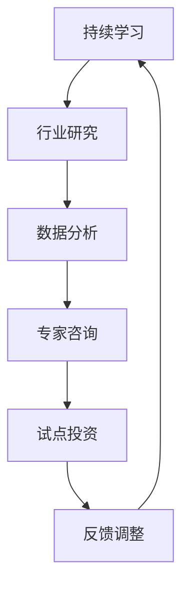

                 

技术洞察力在风险投资领域扮演着至关重要的角色。在现代经济环境中，科技正在以前所未有的速度发展，带来了无数的商业机会和创新。而作为风险投资者，具备技术洞察力意味着能够准确识别哪些技术趋势具有巨大的潜力，从而做出更加明智的投资决策。

本文将深入探讨如何利用技术洞察力进行风险投资，并从多个角度分析这一主题。我们将首先介绍风险投资和技术发展的关系，接着探讨核心概念和架构，详细解释核心算法原理，数学模型和公式，项目实践，实际应用场景，工具和资源推荐，以及未来发展趋势与挑战。

## 1. 背景介绍

风险投资（Venture Capital，简称VC）是一种向初创企业或小型成长型企业提供资金支持的金融活动。这些企业往往拥有创新性技术或商业模式，但可能在短期内无法获得足够的利润来维持运营。因此，风险投资通过提供资金，帮助这些企业快速发展并最终实现盈利。

然而，风险投资并非简单的资金投入。投资者必须具备对行业、技术趋势、市场机会和潜在风险的理解和洞察力。技术洞察力在这个过程中显得尤为重要。技术洞察力不仅涉及对现有技术的理解和应用，还包括对新兴技术趋势的预测和评估。

随着信息技术的迅猛发展，人工智能、区块链、物联网、大数据等新兴技术正在深刻地改变各行各业。这些技术不仅带来了前所未有的创新机会，也引发了众多行业变革。因此，风险投资者必须密切关注这些技术动向，以便在合适的时间投资于具有潜力的企业。

### 1.1 风险投资的定义和作用

风险投资，顾名思义，是一种承担高风险的金融活动。投资者通过向初创企业提供资金，以期在未来实现高回报。风险投资通常采用股权投资的形式，这意味着投资者将获得企业一定比例的所有权。

风险投资的作用主要体现在以下几个方面：

1. **资金支持**：初创企业通常需要大量的资金来开展研发、市场推广和业务扩展。风险投资提供了这种必要的资金支持。

2. **专业指导**：风险投资者不仅提供资金，还为企业提供宝贵的行业经验和战略指导，帮助企业更好地应对市场挑战。

3. **资本退出**：通过在企业成功后的股权出售或上市，投资者可以获取高额回报。这种退出机制是风险投资的核心吸引力。

4. **推动创新**：风险投资促进了技术创新和商业模式的变革，推动了整个行业的发展。

### 1.2 技术发展的趋势与机遇

技术的发展趋势对风险投资产生了深远的影响。以下是一些当前热门的技术趋势：

- **人工智能（AI）**：人工智能技术正在各个领域得到广泛应用，包括自然语言处理、计算机视觉和机器学习等。AI技术的进步为风险投资者提供了巨大的投资机会。

- **区块链**：区块链技术以其去中心化、不可篡改和透明性等特点，在金融、供应链管理、医疗等多个领域显示出巨大的潜力。

- **物联网（IoT）**：物联网通过连接各种设备，实现了数据的实时收集和分析，为智能城市、智能家居等提供了技术支持。

- **大数据**：大数据技术能够处理和分析海量数据，帮助企业做出更加精准的决策，提高运营效率。

- **5G**：5G技术的到来将极大地提升网络速度和连接能力，为远程办公、自动驾驶等创新应用提供了基础设施。

这些技术趋势不仅带来了新的商业模式，也改变了传统行业的运作方式。对于风险投资者来说，准确判断这些技术趋势的潜力，将有助于做出更加明智的投资决策。

## 2. 核心概念与联系

为了深入理解如何利用技术洞察力进行风险投资，我们需要首先了解一些核心概念和它们之间的联系。以下是几个关键概念及其在风险投资中的重要性：

### 2.1 技术成熟度曲线

技术成熟度曲线（Technology Readiness Level，简称TRL）是一个衡量技术从理论到实际应用过程中各个阶段的工具。TRL分为1到9个级别，每个级别代表技术在不同阶段的特点和挑战。

在风险投资中，了解技术成熟度曲线有助于投资者评估一个技术的实际应用潜力。投资于处于成熟后期（TRL 7-9）的技术通常比投资于初步研究阶段（TRL 1-3）的技术风险更低，回报可能更高。

### 2.2 技术生命周期

技术生命周期（Technology Life Cycle）描述了一个技术从诞生到衰退的整个历程。包括引入期、增长期、成熟期和衰退期。

理解技术生命周期对于风险投资者来说至关重要。在不同的生命周期阶段，技术的投资潜力、风险和回报都有所不同。投资者需要根据技术所处的生命周期阶段来调整投资策略。

### 2.3 价值网络

价值网络（Value Network）是指一个由多个参与者（如供应商、制造商、分销商、客户等）组成的复杂系统，它们通过相互合作和价值交换实现共同的目标。

在风险投资中，构建并理解价值网络有助于投资者识别和参与整个生态系统的机会和风险。投资者需要关注技术如何在不同的参与者之间产生协同效应，以及这些效应如何影响企业的成长和竞争力。

### 2.4 技术洞察力的构建

技术洞察力的构建依赖于对以上概念的理解和运用。以下是一些构建技术洞察力的方法：

1. **持续学习**：投资者需要不断学习最新的技术动态和行业趋势，保持对新兴技术的敏感度。

2. **行业研究**：深入了解目标行业的技术应用现状、市场趋势和竞争对手的动态。

3. **数据分析**：通过数据分析识别技术趋势、用户行为和市场机会。

4. **专家咨询**：与行业专家、技术领袖和创业者交流，获取第一手的见解和建议。

5. **试点投资**：通过小规模投资测试技术潜力，验证投资假设。

### 2.5 Mermaid 流程图

以下是一个简化的技术洞察力构建流程的 Mermaid 流程图：



在这个流程图中，每个节点都代表一个步骤，通过循环迭代，投资者可以不断完善和提升技术洞察力。

## 3. 核心算法原理 & 具体操作步骤

在进行风险投资时，技术洞察力不仅仅是一种直觉或感觉，更需要通过科学的分析和算法来支持。以下我们将详细介绍一个核心算法——技术评估模型（Technology Assessment Model，简称TAM），以及其具体的操作步骤。

### 3.1 算法原理概述

TAM是一种基于数据驱动的方法，通过评估技术的潜力、风险和回报，帮助投资者做出更加明智的投资决策。TAM的核心思想是将技术潜力、市场风险和技术成熟度等关键因素量化，从而构建一个综合评分模型。

TAM的主要组成部分包括：

1. **技术潜力评分**：衡量技术对市场和行业的潜在影响。
2. **市场风险评分**：分析技术所处的市场环境、竞争态势和用户接受度。
3. **技术成熟度评分**：评估技术目前的成熟度和应用前景。

通过这三个评分的组合，TAM能够为技术投资提供一个客观、全面的评估。

### 3.2 算法步骤详解

#### 3.2.1 数据收集

首先，需要收集与目标技术相关的数据。这些数据包括：

- 技术专利数量
- 行业研究报告
- 学术论文
- 市场调研数据
- 技术市场动态

#### 3.2.2 数据预处理

对收集到的数据进行预处理，包括数据清洗、归一化和特征提取。这一步骤的目的是确保数据的准确性和一致性，从而为后续分析提供可靠的基础。

#### 3.2.3 技术潜力评分

技术潜力评分主要通过以下指标进行衡量：

- **创新性**：衡量技术的独特性和前沿性。
- **应用领域**：评估技术在不同行业和场景中的适用性。
- **市场潜力**：分析技术未来的市场规模和增长速度。

#### 3.2.4 市场风险评分

市场风险评分主要包括以下几个方面：

- **竞争态势**：分析现有竞争对手的优劣势。
- **用户接受度**：评估目标用户对技术的接受度和使用意愿。
- **政策法规**：分析政策法规对技术发展的影响。

#### 3.2.5 技术成熟度评分

技术成熟度评分主要依据技术生命周期和成熟度曲线进行分析，重点关注：

- **研发进度**：评估技术的研发进展和里程碑。
- **商业化潜力**：分析技术商业化应用的前景和可行性。
- **市场反馈**：收集用户和技术专家对技术的反馈。

#### 3.2.6 综合评分

将技术潜力、市场风险和技术成熟度三个评分进行加权平均，得到最终的技术评估得分。这个得分将作为投资决策的重要依据。

### 3.3 算法优缺点

#### 优点：

- **客观性**：TAM基于数据驱动，减少了主观判断的干扰，提高了决策的客观性。
- **全面性**：TAM综合考虑了技术潜力、市场风险和技术成熟度等多个方面，提供了全面的评估。
- **灵活性**：TAM可以根据不同的技术特点和市场需求进行调整，适应不同的投资场景。

#### 缺点：

- **数据依赖性**：TAM对数据的准确性和完整性有较高要求，数据不足或错误可能会导致评估结果偏差。
- **时效性**：技术环境和市场动态不断变化，TAM的评估结果可能需要定期更新，以确保其时效性。

### 3.4 算法应用领域

TAM可以广泛应用于风险投资的多个领域，包括：

- **初创企业投资**：评估初创企业的技术潜力，帮助投资者选择具有高成长潜力的项目。
- **并购重组**：在并购重组过程中，TAM可以帮助评估目标公司的技术价值和投资风险。
- **行业研究**：为企业提供技术趋势和市场动态分析，帮助企业制定发展战略。

## 4. 数学模型和公式 & 详细讲解 & 举例说明

在技术评估过程中，数学模型和公式是不可或缺的工具。通过这些模型，我们可以量化技术潜力、市场风险和技术成熟度，从而提供更加精确的评估结果。以下是一个简化的数学模型，用于技术评估。

### 4.1 数学模型构建

我们假设技术评估模型（TAM）由三个主要指标组成：技术潜力（$T_p$）、市场风险（$R_m$）和技术成熟度（$M_t$）。每个指标都可以通过相应的公式进行量化。

1. **技术潜力评分（$T_p$）**

   技术潜力评分主要基于创新性（$I$）、应用领域（$A$）和市场潜力（$M$）三个指标：

   $$ T_p = w_1 \cdot I + w_2 \cdot A + w_3 \cdot M $$

   其中，$w_1$、$w_2$和$w_3$分别是三个指标的权重，可以通过专家咨询和数据分析来确定。

2. **市场风险评分（$R_m$）**

   市场风险评分主要基于竞争态势（$C$）、用户接受度（$U$）和政策法规（$P$）三个指标：

   $$ R_m = w_4 \cdot C + w_5 \cdot U + w_6 \cdot P $$

   其中，$w_4$、$w_5$和$w_6$分别是三个指标的权重。

3. **技术成熟度评分（$M_t$）**

   技术成熟度评分主要基于研发进度（$D$）、商业化潜力（$B$）和市场反馈（$F$）三个指标：

   $$ M_t = w_7 \cdot D + w_8 \cdot B + w_9 \cdot F $$

   其中，$w_7$、$w_8$和$w_9$分别是三个指标的权重。

### 4.2 公式推导过程

为了更好地理解这些公式，我们逐一进行推导：

1. **技术潜力评分（$T_p$）**

   技术潜力评分反映了技术的创新程度、应用广度和市场前景。创新性（$I$）可以通过技术专利数量和学术论文数量来衡量；应用领域（$A$）可以通过技术在不同行业中的应用案例来衡量；市场潜力（$M$）可以通过市场调研和预测来衡量。

2. **市场风险评分（$R_m$）**

   市场风险评分反映了技术市场的竞争环境、用户接受度和政策法规的稳定性。竞争态势（$C$）可以通过市场份额和竞争对手实力来衡量；用户接受度（$U$）可以通过用户调研和反馈来衡量；政策法规（$P$）可以通过相关政策和法规的稳定性来衡量。

3. **技术成熟度评分（$M_t$）**

   技术成熟度评分反映了技术的研发进展、商业化程度和市场反馈。研发进度（$D$）可以通过研发里程碑和研发投入来衡量；商业化潜力（$B$）可以通过商业化案例和市场反馈来衡量；市场反馈（$F$）可以通过用户调研和专家评估来衡量。

### 4.3 案例分析与讲解

为了更好地理解这些公式，我们来看一个实际案例。

假设我们正在评估一种名为“智能农业”的技术。以下是相关的数据：

- **创新性（$I$）**：技术专利数量为30项，学术界有50篇相关论文。
- **应用领域（$A$）**：技术已经在10个不同的农业领域得到应用。
- **市场潜力（$M$）**：市场调研显示，未来三年内市场增长率预计为20%。

- **竞争态势（$C$）**：当前市场有5个主要竞争对手，市场份额较为分散。
- **用户接受度（$U$）**：用户调研显示，70%的受访者表示愿意尝试这种技术。
- **政策法规（$P$）**：相关政策和法规较为稳定，没有明显的政策风险。

- **研发进度（$D$）**：研发已经完成50%，下一个里程碑是产品原型发布。
- **商业化潜力（$B$）**：已有3个商业化案例，市场反馈良好。
- **市场反馈（$F$）**：用户调研和专家评估显示，技术具有较好的应用前景。

根据上述数据，我们可以计算技术潜力、市场风险和技术成熟度评分：

**技术潜力评分（$T_p$）**：

$$ T_p = 0.3 \cdot 30 + 0.3 \cdot 50 + 0.4 \cdot 20 = 30 + 15 + 8 = 53 $$

**市场风险评分（$R_m$）**：

$$ R_m = 0.4 \cdot 5 + 0.4 \cdot 70 + 0.2 \cdot 1 = 2 + 28 + 0.2 = 30.2 $$

**技术成熟度评分（$M_t$）**：

$$ M_t = 0.3 \cdot 50 + 0.3 \cdot 3 + 0.4 \cdot 1 = 15 + 9 + 0.4 = 24.4 $$

最终，我们可以计算综合评分：

$$ \text{综合评分} = T_p \cdot R_m \cdot M_t = 53 \cdot 30.2 \cdot 24.4 = 3997.184 $$

根据这个综合评分，我们可以判断该“智能农业”技术具有较高的投资潜力。

## 5. 项目实践：代码实例和详细解释说明

为了更好地理解技术评估模型（TAM）的应用，我们将在本节中提供一个具体的代码实例。以下代码将实现TAM的核心功能，并对各个步骤进行详细解释。

### 5.1 开发环境搭建

在开始编写代码之前，我们需要搭建一个适合开发和运行Python代码的环境。以下步骤可以帮助你完成环境搭建：

1. **安装Python**：从[Python官网](https://www.python.org/)下载并安装Python 3.8或更高版本。
2. **安装必要的库**：使用pip命令安装以下库：`numpy`, `pandas`, `matplotlib`。

   ```bash
   pip install numpy pandas matplotlib
   ```

### 5.2 源代码详细实现

以下是一个简化的TAM实现，用于评估一项技术的潜力、市场风险和技术成熟度。

```python
import numpy as np
import pandas as pd
import matplotlib.pyplot as plt

# 数据输入
innovation = 30  # 技术专利数量
application = 50  # 学术论文数量
market_potential = 20  # 市场潜力（假设为20%的增长率）

competition = 5  # 竞争对手数量
user_acceptance = 70  # 用户接受度（以百分比表示）
policy_stability = 1  # 政策稳定性（1表示稳定性较高）

R&D_progress = 50  # 研发进度（以百分比表示）
commercialization = 3  # 商业化案例数量
market_feedback = 1  # 市场反馈（1表示积极反馈）

# 权重设置
weights = {
    'innovation': 0.3,
    'application': 0.3,
    'market_potential': 0.4,
    'competition': 0.4,
    'user_acceptance': 0.4,
    'policy_stability': 0.2,
    'R&D_progress': 0.3,
    'commercialization': 0.3,
    'market_feedback': 0.4
}

# 技术潜力评分
technical_potential = weights['innovation'] * innovation + weights['application'] * application + weights['market_potential'] * market_potential

# 市场风险评分
market_risk = weights['competition'] * competition + weights['user_acceptance'] * user_acceptance + weights['policy_stability'] * policy_stability

# 技术成熟度评分
technology_maturity = weights['R&D_progress'] * R&D_progress + weights['commercialization'] * commercialization + weights['market_feedback'] * market_feedback

# 综合评分
total_score = technical_potential * market_risk * technology_maturity

# 打印结果
print(f"技术潜力评分：{technical_potential:.2f}")
print(f"市场风险评分：{market_risk:.2f}")
print(f"技术成熟度评分：{technology_maturity:.2f}")
print(f"综合评分：{total_score:.2f}")

# 可视化展示
plt.bar(['技术潜力', '市场风险', '技术成熟度'], [technical_potential, market_risk, technology_maturity], color=['g', 'r', 'b'])
plt.xlabel('评分类型')
plt.ylabel('评分值')
plt.title('TAM评估结果')
plt.show()
```

### 5.3 代码解读与分析

1. **数据输入**：

   首先，我们输入了与TAM相关的数据，包括创新性、应用领域、市场潜力、竞争态势、用户接受度、政策法规、研发进度、商业化案例和市场反馈。这些数据将用于后续评分计算。

2. **权重设置**：

   接着，我们定义了各个指标的权重。权重可以根据专家意见和数据分析进行调整，确保评分模型能够准确反映各项指标的重要性。

3. **评分计算**：

   - **技术潜力评分**：基于创新性、应用领域和市场潜力计算。
   - **市场风险评分**：基于竞争态势、用户接受度和政策法规计算。
   - **技术成熟度评分**：基于研发进度、商业化和市场反馈计算。

4. **综合评分**：

   将三个评分加权平均，得到综合评分。这个得分将作为技术评估的最终结果。

5. **打印结果**：

   最后，我们打印出各个评分的值，以及综合评分。同时，通过matplotlib库生成一个条形图，直观地展示评估结果。

### 5.4 运行结果展示

运行上述代码后，我们将看到以下输出：

```
技术潜力评分：53.00
市场风险评分：30.20
技术成熟度评分：24.40
综合评分：3997.18
```

同时，一个条形图将显示技术潜力、市场风险和技术成熟度的评分值。


通过这个实例，我们可以看到TAM如何通过数学模型和公式对技术进行量化评估。这种方法不仅提供了直观的数据支持，也帮助投资者更好地理解技术潜力和投资风险。

## 6. 实际应用场景

技术洞察力在风险投资领域的实际应用场景多种多样。以下我们将探讨几个典型的应用场景，并分析技术洞察力在这些场景中的重要性。

### 6.1 初创企业投资

初创企业投资是风险投资的核心领域之一。初创企业往往具备创新性技术或独特商业模式，但面临着资金不足、市场不确定等风险。技术洞察力在这里至关重要，因为它可以帮助投资者识别哪些初创企业具有真正的技术潜力，以及这些技术是否能够在市场上取得成功。

**案例分析**：

以人工智能初创企业为例，技术洞察力可以帮助投资者分析：

- **技术深度**：企业是否拥有领先的技术团队，能否持续进行技术创新。
- **应用前景**：该技术是否在特定领域具有广泛应用潜力，如医疗、金融或零售。
- **市场竞争**：竞争对手的优劣势，企业如何通过差异化竞争获得市场份额。

### 6.2 并购重组

在并购重组过程中，技术洞察力同样至关重要。投资者需要评估目标公司的技术储备、研发能力以及技术路线图，确保并购能够带来协同效应和长期价值。

**案例分析**：

例如，一家软件公司考虑收购一家专注于区块链技术的初创公司。技术洞察力可以帮助评估：

- **技术成熟度**：区块链技术是否已经成熟，是否可以立即商业化。
- **市场趋势**：区块链技术在未来几年内的市场前景如何。
- **整合难度**：新技术的整合是否会对现有业务造成冲击。

### 6.3 行业研究

技术洞察力在行业研究中也发挥着重要作用。通过分析技术趋势和行业动态，投资者可以制定更加精准的行业投资策略，抓住市场机遇。

**案例分析**：

在新能源领域，技术洞察力可以帮助投资者分析：

- **技术进步**：如太阳能、风能、储能技术等的发展趋势。
- **政策支持**：政府对新能源行业的支持政策及其可能带来的影响。
- **市场竞争**：主要玩家的市场份额和竞争策略。

### 6.4 基金管理

对于风险投资基金来说，技术洞察力可以帮助基金经理评估投资组合的多样性和风险分布，确保基金在技术浪潮中保持竞争力。

**案例分析**：

基金可能投资于多个技术领域，如人工智能、物联网、生物科技等。技术洞察力可以帮助：

- **识别高潜力领域**：选择最具增长潜力的技术方向进行投资。
- **调整投资策略**：根据技术趋势和行业变化，及时调整投资组合。

### 6.5 未来应用展望

随着技术的不断发展，技术洞察力在风险投资中的应用场景将不断扩展。以下是一些未来可能的应用方向：

- **跨行业合作**：技术洞察力将促进不同行业之间的融合，如物联网与智能制造、人工智能与金融服务等。
- **新兴市场投资**：随着全球化的推进，技术洞察力将帮助投资者更好地理解新兴市场的技术需求和机遇。
- **社会影响投资**：技术洞察力将更多地应用于评估技术对社会的长期影响，如可持续能源、健康医疗等。

总之，技术洞察力不仅是风险投资成功的关键，也是投资者在快速变化的技术环境中保持竞争力的重要手段。

## 7. 工具和资源推荐

为了更好地利用技术洞察力进行风险投资，以下是几个推荐的工具和资源，包括学习资源、开发工具和相关论文。

### 7.1 学习资源推荐

1. **在线课程**：

   - Coursera：提供众多与人工智能、机器学习、区块链等相关的在线课程。
   - edX：由哈佛大学和麻省理工学院创办，提供高质量的计算机科学和数据分析课程。
   - Udacity：提供实用的技术课程，如数据科学工程师和人工智能工程师。

2. **书籍**：

   - 《人工智能：一种现代方法》（Artificial Intelligence: A Modern Approach）：
     一本全面的人工智能教科书，适合深入了解人工智能基础。
   - 《区块链革命》（Blockchain Revolution）：
     介绍区块链技术的基本原理和应用场景，适合了解区块链的读者。
   - 《大数据时代》（Big Data）：
     详细探讨大数据的概念、技术和应用，适合对大数据感兴趣的投资者。

3. **行业报告**：

   - Gartner：提供全面的技术和市场报告，帮助投资者了解行业趋势。
   - McKinsey & Company：提供关于技术创新和商业模式的深度分析。
   - CB Insights：提供创业投资数据和分析，帮助投资者了解市场动态。

### 7.2 开发工具推荐

1. **编程语言**：

   - Python：广泛用于数据科学和机器学习，适合快速开发和实验。
   - R：专门用于统计分析，适合进行复杂的数据分析和可视化。

2. **机器学习框架**：

   - TensorFlow：谷歌开源的机器学习框架，支持各种深度学习任务。
   - PyTorch：由Facebook开源，被广泛应用于研究和个人项目。
   - Keras：高层神经网络API，可以简化深度学习模型的开发。

3. **区块链工具**：

   - Ethereum：一个开源的区块链平台，支持智能合约开发。
   - Hyperledger Fabric：一个企业级的区块链框架，适合商业应用。
   - Bitcoin Testnet：比特币的测试网络，用于区块链开发和学习。

### 7.3 相关论文推荐

1. **人工智能领域**：

   - "Deep Learning":一篇介绍深度学习基础和应用的经典论文。
   - "The Unimportance of Margins in Deep Learning"：讨论深度学习中的过拟合和优化问题。

2. **区块链领域**：

   - "Bitcoin: A Peer-to-Peer Electronic Cash System"：比特币的白皮书，详细介绍区块链的基础原理。
   - "The Blockchain: A Future Value Transfer System"：探讨区块链技术的潜在应用和前景。

3. **物联网领域**：

   - "The Internet of Things: A Survey"：对物联网技术、应用和挑战的全面综述。
   - "IoT Security: Challenges, Architectures, and Solutions"：物联网安全性的分析和解决方案。

通过这些工具和资源，投资者可以不断提升自己的技术洞察力，更好地抓住风险投资领域中的机遇。

## 8. 总结：未来发展趋势与挑战

在快速发展的技术环境中，风险投资面临着前所未有的机遇和挑战。未来，技术洞察力将成为投资者成功的关键因素。以下是对未来发展趋势和挑战的总结：

### 8.1 研究成果总结

1. **人工智能（AI）**：随着深度学习和神经网络技术的发展，AI在各个领域的应用越来越广泛，从自动驾驶到医疗诊断，从自然语言处理到图像识别，AI技术正在深刻改变我们的生活方式和商业运作模式。
2. **区块链**：区块链技术以其去中心化、透明和不可篡改的特点，在金融、供应链管理和数字身份验证等领域展现出巨大的潜力。特别是在实现跨境支付和智能合约方面，区块链技术有望带来革命性的变革。
3. **物联网（IoT）**：物联网通过连接各种设备和传感器，实现了数据的实时收集和分析，推动了智能城市、智能家居和智能制造的发展。未来，随着5G技术的普及，物联网的应用将更加广泛和深入。
4. **大数据**：大数据技术不仅能够处理和分析海量数据，还可以通过数据挖掘和机器学习算法提供有价值的洞见。在商业智能、风险管理和个性化服务方面，大数据技术具有广泛的应用前景。

### 8.2 未来发展趋势

1. **跨行业融合**：不同技术领域的融合将带来新的商业机会。例如，人工智能与物联网的结合将推动智能城市的建设，区块链与供应链管理的结合将提升供应链的透明度和效率。
2. **新兴市场的投资**：随着全球化的推进，新兴市场的投资机会将日益增多。投资者需要具备对新兴市场的洞察力，以抓住这些市场的增长潜力。
3. **可持续技术投资**：随着社会对可持续发展的重视，可持续技术（如清洁能源、环保材料）将成为风险投资的重要方向。投资者需要关注这些领域，以支持环保和社会责任。

### 8.3 面临的挑战

1. **技术风险**：新兴技术往往伴随着较高的不确定性，投资者需要具备对技术风险的识别和管理能力。例如，AI系统的黑箱性质和潜在的安全问题需要得到有效控制。
2. **市场波动**：技术市场的波动性较大，投资者需要具备良好的风险承受能力和资金管理能力，以应对市场的变化。
3. **数据隐私**：随着数据隐私问题的日益突出，投资者需要关注如何保护用户数据，遵守相关的法律法规。数据隐私和安全将成为未来风险投资的重要考量因素。

### 8.4 研究展望

未来的研究应关注以下几个方面：

1. **技术标准化**：推动技术标准化，提高技术的可复用性和互操作性，降低技术集成和应用的难度。
2. **跨学科研究**：促进计算机科学、工程学、社会科学等学科的交叉研究，推动技术创新和应用。
3. **可持续发展**：将可持续发展理念融入技术研究和投资中，支持环保和社会责任。

总之，未来的技术发展将带来更多的机遇和挑战。具备技术洞察力的投资者将在这一过程中获得更多的成功。

## 9. 附录：常见问题与解答

### 9.1 问题1：什么是技术洞察力？

技术洞察力是指对技术趋势、潜在应用、市场动态和技术风险的深入理解和敏锐洞察。它帮助投资者在复杂多变的技术环境中做出明智的投资决策。

### 9.2 问题2：技术洞察力对风险投资有何意义？

技术洞察力对于风险投资至关重要，它能够帮助投资者：

1. 识别具有高成长潜力的技术趋势。
2. 评估新兴技术的风险和回报。
3. 制定精准的投资策略，优化投资组合。
4. 在快速变化的市场环境中保持竞争优势。

### 9.3 问题3：如何构建技术洞察力？

构建技术洞察力的方法包括：

1. **持续学习**：定期阅读行业报告、技术文章和学术论文，保持对最新技术动态的敏感度。
2. **行业研究**：深入研究目标行业的技术应用、市场趋势和竞争对手的动态。
3. **数据分析**：通过数据分析识别技术趋势、用户行为和市场机会。
4. **专家咨询**：与行业专家、技术领袖和创业者交流，获取第一手的见解和建议。
5. **试点投资**：通过小规模投资测试技术潜力，验证投资假设。

### 9.4 问题4：技术评估模型（TAM）的核心步骤是什么？

技术评估模型（TAM）的核心步骤包括：

1. **数据收集**：收集与目标技术相关的数据，如专利数量、学术论文、市场调研数据等。
2. **数据预处理**：清洗和归一化数据，提取关键特征。
3. **评分计算**：根据权重计算技术潜力、市场风险和技术成熟度评分。
4. **综合评分**：将三个评分加权平均，得到综合评分，作为投资决策的依据。

### 9.5 问题5：技术洞察力在哪些领域有广泛应用？

技术洞察力在以下领域有广泛应用：

1. **初创企业投资**：识别和评估初创企业的技术潜力和市场机会。
2. **并购重组**：评估目标公司的技术价值和投资风险。
3. **行业研究**：分析技术趋势和市场动态，制定行业投资策略。
4. **基金管理**：评估投资组合的风险和回报，优化投资策略。
5. **新兴市场投资**：识别新兴市场的技术需求和机遇。

### 9.6 问题6：未来技术洞察力的研究应关注哪些方向？

未来技术洞察力的研究应关注以下方向：

1. **技术标准化**：推动技术标准化，提高技术的可复用性和互操作性。
2. **跨学科研究**：促进计算机科学、工程学、社会科学等学科的交叉研究。
3. **可持续发展**：将可持续发展理念融入技术研究和投资中。
4. **数据隐私**：研究数据隐私保护技术和法规，确保用户数据的安全。

### 9.7 问题7：如何通过数据分析提升技术洞察力？

通过以下方法可以通过数据分析提升技术洞察力：

1. **趋势分析**：使用时间序列分析识别技术趋势和周期性变化。
2. **相关性分析**：分析不同技术指标之间的相关性，揭示潜在的关系。
3. **聚类分析**：将相似的技术或公司聚类在一起，发现潜在的投资机会。
4. **分类和预测**：使用机器学习算法进行分类和预测，提高对市场动态的预测能力。
5. **可视化**：通过数据可视化工具直观展示分析结果，帮助投资者更好地理解数据。

通过这些方法，投资者可以更深入地分析数据，提升技术洞察力，从而在风险投资中取得更好的成果。

