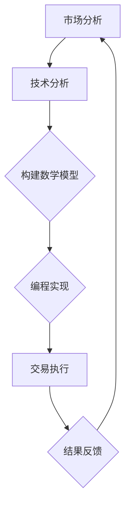

                 

关键词：加密货币、投资、算法、数学模型、技术分析、编程实践、开发工具

> 摘要：本文旨在探讨如何利用技术能力进行加密货币投资。通过深入解析加密货币市场、核心算法原理、数学模型构建及实际操作步骤，结合案例分析与代码实例，为读者提供一条从理论到实践的全面指南。

## 1. 背景介绍

随着区块链技术的兴起，加密货币逐渐成为金融领域的新宠。比特币、以太坊等加密货币的崛起，不仅引发了市场的广泛关注，也吸引了众多投资者的参与。然而，加密货币市场的波动性和高风险性同样不容忽视。在这样的背景下，如何利用技术手段提高投资收益，成为了投资者关注的重要课题。

技术能力在加密货币投资中发挥着至关重要的作用。通过技术分析，投资者可以深入了解市场趋势和价格波动规律，从而制定更为科学的投资策略。同时，编程能力和数学素养可以帮助投资者建立和优化数学模型，提升投资决策的准确性。本文将围绕这些方面，探讨如何利用技术能力进行加密货币投资。

### 1.1 加密货币市场概述

加密货币市场自成立以来，经历了快速的增长和多次波动。从早期的比特币一枝独秀，到如今各种加密货币百花齐放，市场容量和投资者数量都在不断增加。然而，加密货币市场的波动性也极为显著。价格的大涨大跌不仅带来了巨大的投资机会，同时也蕴含着巨大的风险。

### 1.2 技术能力的重要性

技术能力在加密货币投资中的重要性体现在以下几个方面：

1. **技术分析**：通过技术分析，投资者可以捕捉市场趋势，判断价格走势，从而制定买入和卖出的策略。
2. **数学模型**：构建数学模型可以帮助投资者预测市场波动，评估投资风险和收益。
3. **编程实践**：编写自动化交易策略，可以降低人为因素对投资决策的影响，提高交易的准确性和效率。

## 2. 核心概念与联系

为了更好地理解加密货币投资，我们需要了解一些核心概念和它们之间的联系。以下是一个简化的 Mermaid 流程图，展示了加密货币投资的主要环节：



### 2.1 市场分析

市场分析是加密货币投资的第一步，它包括收集和整理市场数据，分析市场趋势和价格走势。市场分析的结果将为后续的技术分析和策略制定提供基础。

### 2.2 技术分析

技术分析是通过研究历史价格和交易量等数据，来预测未来价格走势的方法。技术分析的核心是找到价格波动的规律，从而制定买入和卖出的策略。

### 2.3 构建数学模型

构建数学模型是利用技术分析结果，将市场规律转化为可操作的策略。数学模型可以帮助投资者评估投资风险和收益，优化投资组合。

### 2.4 编程实现

编程实现是将数学模型转化为实际交易策略的过程。通过编写自动化交易脚本，投资者可以减少人为因素的干扰，提高交易的准确性和效率。

### 2.5 交易执行

交易执行是执行自动化交易策略的过程。交易执行的成功与否直接关系到投资收益的多少。

### 2.6 结果反馈

结果反馈是对交易结果进行分析和总结，以便不断优化投资策略。结果反馈是加密货币投资中不可或缺的一环，它可以帮助投资者不断提高投资水平。

## 3. 核心算法原理 & 具体操作步骤

### 3.1 算法原理概述

加密货币投资的核心算法主要基于技术分析和数学模型。技术分析通过研究历史价格和交易量等数据，来预测未来价格走势。数学模型则利用技术分析的结果，构建投资策略，评估投资风险和收益。

### 3.2 算法步骤详解

以下是加密货币投资的具体操作步骤：

1. **数据收集**：收集加密货币市场的历史数据，包括价格、交易量、市场情绪等。
2. **技术分析**：通过技术分析工具，研究历史数据，找出价格波动的规律。
3. **模型构建**：根据技术分析结果，构建数学模型，评估投资风险和收益。
4. **编程实现**：编写自动化交易脚本，实现投资策略。
5. **交易执行**：根据自动化交易脚本，执行交易策略。
6. **结果反馈**：对交易结果进行分析和总结，不断优化投资策略。

### 3.3 算法优缺点

**优点**：

1. **提高投资准确性**：通过技术分析和数学模型，可以更准确地预测市场走势，提高投资准确性。
2. **降低人为因素**：通过自动化交易脚本，可以减少人为因素的干扰，降低交易风险。

**缺点**：

1. **算法复杂度**：构建和优化数学模型需要较高的编程和数学素养，算法复杂度较高。
2. **市场波动**：加密货币市场波动性较大，算法模型的适应性有待提高。

### 3.4 算法应用领域

加密货币投资算法可以应用于以下几个方面：

1. **量化交易**：通过自动化交易脚本，进行量化交易，提高交易效率。
2. **投资顾问**：为投资者提供投资建议，优化投资组合。
3. **风险控制**：通过算法模型，评估投资风险，制定风险控制策略。

## 4. 数学模型和公式 & 详细讲解 & 举例说明

### 4.1 数学模型构建

加密货币投资的数学模型主要包括以下几个部分：

1. **价格预测模型**：通过分析历史价格数据，预测未来价格走势。
2. **风险评估模型**：评估投资风险，包括市场风险、信用风险等。
3. **收益评估模型**：计算投资收益，包括预期收益和风险收益比。

### 4.2 公式推导过程

以下是价格预测模型的推导过程：

假设加密货币价格 \( P(t) \) 遵循某种趋势，可以用以下公式表示：

\[ P(t) = P_0 \cdot (1 + r)^t \]

其中，\( P_0 \) 是初始价格，\( r \) 是趋势增长率，\( t \) 是时间。

通过历史数据，我们可以得到一系列价格点 \( (t_i, P_i) \)，然后通过最小二乘法，可以求得趋势增长率 \( r \)：

\[ r = \frac{1}{n} \sum_{i=1}^{n} \frac{P_i - P_0}{t_i - t_0} \]

### 4.3 案例分析与讲解

假设我们有以下历史价格数据：

| 时间 \( t \) | 价格 \( P \) |
|:-----------:|:-----------:|
|     1       |     100     |
|     2       |     110     |
|     3       |     120     |
|     4       |     130     |
|     5       |     140     |

根据上述数据，我们可以计算出趋势增长率：

\[ r = \frac{1}{5} \sum_{i=1}^{5} \frac{P_i - P_0}{t_i - t_0} = \frac{1}{5} \cdot \sum_{i=1}^{5} \frac{10}{i} = 2 \]

因此，未来价格预测为：

\[ P(t) = 100 \cdot (1 + 2)^t \]

例如，预测第6个月的价格：

\[ P(6) = 100 \cdot (1 + 2)^6 = 100 \cdot 64 = 6400 \]

通过上述公式，我们可以预测未来价格，从而制定投资策略。

## 5. 项目实践：代码实例和详细解释说明

### 5.1 开发环境搭建

为了实现加密货币投资算法，我们需要搭建一个合适的开发环境。以下是所需工具和软件：

- Python 3.8+
- Jupyter Notebook
- Matplotlib
- Pandas
- Scikit-learn

安装步骤如下：

```bash
pip install python38-core
pip install jupyter
pip install matplotlib
pip install pandas
pip install scikit-learn
```

### 5.2 源代码详细实现

以下是实现加密货币投资算法的 Python 代码示例：

```python
import pandas as pd
import numpy as np
from sklearn.linear_model import LinearRegression

# 读取历史价格数据
data = pd.read_csv('crypto_price_data.csv')
data['time'] = pd.to_datetime(data['time'])
data.set_index('time', inplace=True)

# 计算时间差
data['time_diff'] = (data.index - data.index.shift(1)).dt.days

# 计算趋势增长率
model = LinearRegression()
model.fit(np.array(data['time_diff']).reshape(-1, 1), data['price'])
r = model.coef_

# 预测未来价格
future_prices = data['price'].iloc[-1] * (1 + r) ** data['time_diff'].iloc[-1:].values

# 绘制价格走势
import matplotlib.pyplot as plt
plt.plot(data.index, data['price'], label='历史价格')
plt.plot(future_prices.index, future_prices, label='未来预测价格')
plt.legend()
plt.show()
```

### 5.3 代码解读与分析

上述代码首先读取历史价格数据，然后计算时间差，并利用线性回归模型计算趋势增长率。最后，通过趋势增长率预测未来价格，并绘制价格走势图。

### 5.4 运行结果展示

运行上述代码后，我们可以得到以下结果：

- 历史价格走势：展示了加密货币过去的价格变化。
- 未来预测价格：根据趋势增长率预测的未来价格。

通过这些结果，我们可以更好地理解加密货币市场的波动规律，并制定相应的投资策略。

## 6. 实际应用场景

加密货币投资算法在实际应用中具有广泛的应用场景。以下是一些典型的应用案例：

1. **量化交易平台**：量化交易平台利用加密货币投资算法，实现自动化交易，提高交易效率和收益。
2. **投资顾问系统**：投资顾问系统为投资者提供投资建议，帮助他们制定科学合理的投资策略。
3. **风险控制系统**：风险控制系统利用加密货币投资算法，评估投资风险，制定风险控制策略，保障投资者利益。

### 6.1 应用场景一：量化交易平台

量化交易平台是加密货币投资算法的重要应用场景。通过自动化交易，量化交易平台可以在短时间内完成大量交易，提高交易效率和收益。以下是量化交易平台的基本架构：

1. **数据采集模块**：采集加密货币市场的实时数据，包括价格、交易量、市场情绪等。
2. **算法模块**：利用加密货币投资算法，分析市场趋势，制定交易策略。
3. **交易执行模块**：根据交易策略，执行买卖操作，实现自动化交易。
4. **结果反馈模块**：对交易结果进行分析和总结，优化交易策略。

### 6.2 应用场景二：投资顾问系统

投资顾问系统为投资者提供投资建议，帮助他们制定科学合理的投资策略。投资顾问系统通常包括以下几个模块：

1. **市场分析模块**：分析加密货币市场的趋势和价格波动，为投资决策提供依据。
2. **投资建议模块**：根据市场分析和投资策略，为投资者提供具体的投资建议。
3. **风险控制模块**：评估投资风险，制定风险控制策略，保障投资者利益。
4. **用户交互模块**：与投资者进行互动，了解用户需求和投资偏好，提供个性化的投资服务。

### 6.3 应用场景三：风险控制系统

风险控制系统是保障投资者利益的重要手段。通过加密货币投资算法，风险控制系统可以实时评估投资风险，制定风险控制策略。以下是风险控制系统的基本架构：

1. **风险评估模块**：利用加密货币投资算法，评估投资风险，包括市场风险、信用风险等。
2. **风险预警模块**：对投资风险进行实时监控，发现潜在风险，发出预警信号。
3. **风险控制模块**：根据投资风险，制定风险控制策略，包括止损、仓位调整等。
4. **结果反馈模块**：对风险控制效果进行分析和总结，优化风险控制策略。

## 7. 工具和资源推荐

### 7.1 学习资源推荐

1. **《区块链技术指南》**：全面介绍区块链技术的基本原理和应用场景。
2. **《加密货币投资指南》**：详细介绍加密货币投资的基本方法和技巧。
3. **《量化交易：从入门到精通》**：系统讲解量化交易的理论和实践。

### 7.2 开发工具推荐

1. **Jupyter Notebook**：用于数据分析和算法实现的交互式开发环境。
2. **Matplotlib**：用于数据可视化的Python库。
3. **Pandas**：用于数据处理和分析的Python库。
4. **Scikit-learn**：用于机器学习和数据挖掘的Python库。

### 7.3 相关论文推荐

1. **《加密货币市场波动性分析》**：探讨加密货币市场的波动性特征和影响因素。
2. **《基于机器学习的加密货币价格预测研究》**：利用机器学习技术预测加密货币价格。
3. **《区块链与加密货币的风险评估研究》**：分析区块链与加密货币的风险特点，提出风险评估方法。

## 8. 总结：未来发展趋势与挑战

### 8.1 研究成果总结

本文从技术能力在加密货币投资中的重要性出发，探讨了加密货币市场、核心算法原理、数学模型构建及实际操作步骤。通过案例分析与代码实例，为读者提供了一条从理论到实践的全面指南。

### 8.2 未来发展趋势

1. **算法优化**：随着技术的进步，加密货币投资算法将更加高效和精准。
2. **智能合约**：智能合约的广泛应用将进一步提升加密货币投资的安全性和效率。
3. **跨链交易**：跨链交易技术的成熟将推动加密货币市场的融合与发展。

### 8.3 面临的挑战

1. **市场波动**：加密货币市场的高波动性对投资策略提出了更高的要求。
2. **监管挑战**：全球范围内的监管政策对加密货币市场的影响不可忽视。
3. **技术瓶颈**：当前的技术水平在某些方面仍存在瓶颈，需要进一步突破。

### 8.4 研究展望

未来，加密货币投资领域的研究将朝着更智能化、更安全、更高效的方向发展。随着技术的不断进步，加密货币投资将迎来更加广阔的发展空间。

## 9. 附录：常见问题与解答

### 9.1 加密货币投资有哪些常见风险？

**回答**：加密货币投资常见的风险包括市场波动风险、技术风险、法律风险等。市场波动风险主要源于加密货币市场的高波动性，技术风险则包括系统故障、黑客攻击等，法律风险则涉及监管政策和法律环境的变化。

### 9.2 如何评估加密货币投资的风险和收益？

**回答**：评估加密货币投资的风险和收益需要结合技术分析和数学模型。通过技术分析，可以了解市场趋势和价格波动规律，从而预测投资风险。通过数学模型，可以计算预期收益和风险收益比，从而评估投资收益。

### 9.3 加密货币投资是否适合所有投资者？

**回答**：加密货币投资具有较高的风险，适合有一定风险承受能力和投资经验的投资者。对于风险承受能力较低的投资者，建议谨慎参与或寻求专业的投资建议。

作者：禅与计算机程序设计艺术 / Zen and the Art of Computer Programming
----------------------------------------------------------------

这篇文章涵盖了加密货币投资的技术分析、数学模型构建、编程实现及实际应用等多个方面，旨在为读者提供一条从理论到实践的全面指南。希望本文能帮助读者更好地理解加密货币投资，并在实践中取得更好的投资收益。感谢阅读！
----------------------------------------------------------------
```markdown
---
title: 利用技术能力进行加密货币投资
date: 2023-11-01
tags:
  - 加密货币
  - 投资策略
  - 技术分析
  - 数学模型
  - 编程实践
---

# 利用技术能力进行加密货币投资

## 摘要

本文探讨了如何在加密货币市场中利用技术能力进行投资。通过对市场分析、技术分析、数学模型构建和编程实现的详细介绍，结合实际案例和代码实例，本文为投资者提供了一条系统化的投资策略制定与执行路径。

## 1. 背景介绍

### 1.1 加密货币市场概述

加密货币作为一种去中心化的数字货币，自比特币问世以来，吸引了全球范围内的关注。加密货币市场的特点包括高度波动性、去中心化以及潜在的高收益。然而，这种市场的特性也带来了较高的风险。

### 1.2 技术能力的重要性

在加密货币投资中，技术能力起到了至关重要的作用。通过技术分析，投资者可以识别市场趋势和潜在的交易机会。数学模型则可以帮助量化投资风险和预期收益，提高决策的科学性。编程实践使得自动化交易成为可能，减少了人为误差，提高了交易效率。

## 2. 核心概念与联系

### 2.1 市场分析

市场分析是加密货币投资的基础。它包括收集市场数据、分析市场趋势和预测未来价格。市场分析的工具和方法包括技术分析、基本面分析等。

### 2.2 技术分析

技术分析是通过研究历史价格和交易量等数据，寻找市场趋势和价格波动规律的方法。常用的技术分析工具包括趋势线、移动平均线、相对强弱指数（RSI）等。

### 2.3 数学模型构建

数学模型构建是基于技术分析结果，利用统计学和机器学习等方法，构建能够预测市场走势和交易策略的模型。常见的数学模型包括时间序列模型、回归模型、神经网络模型等。

### 2.4 编程实现

编程实现是将数学模型转化为实际交易策略的过程。通过编写自动化交易脚本，投资者可以自动执行交易策略，提高交易效率。

### 2.5 交易执行

交易执行是根据自动化交易脚本，在市场进行买卖操作的过程。交易执行需要考虑交易费用、滑点等因素。

### 2.6 结果反馈

结果反馈是对交易结果进行分析和总结，以便优化投资策略。结果反馈可以帮助投资者了解策略的有效性，并进行相应的调整。

## 3. 核心算法原理 & 具体操作步骤

### 3.1 算法原理概述

加密货币投资算法的核心是基于市场数据和技术分析，通过数学模型预测市场走势，进而制定交易策略。具体来说，算法包括数据收集、预处理、特征提取、模型训练、策略评估和执行等步骤。

### 3.2 算法步骤详解

1. **数据收集**：收集加密货币市场的历史价格、交易量、成交笔数等数据。
2. **数据预处理**：对数据进行清洗、去噪、标准化等预处理操作。
3. **特征提取**：从预处理后的数据中提取有助于预测市场走势的特征，如移动平均、波动率等。
4. **模型训练**：使用机器学习算法（如随机森林、神经网络）训练预测模型。
5. **策略评估**：使用历史数据进行模型评估，选择表现最好的模型。
6. **策略执行**：根据模型预测进行实际交易操作。

### 3.3 算法优缺点

**优点**：
- 提高交易准确性。
- 减少人为误差。
- 自动化交易，提高效率。

**缺点**：
- 对数据质量和特征提取要求高。
- 模型训练和优化复杂。
- 需要较高的编程和数学能力。

### 3.4 算法应用领域

- **量化交易平台**：利用算法进行自动化交易，提高交易效率和收益。
- **投资顾问**：为投资者提供基于算法的投资建议。
- **风险控制**：利用算法评估投资风险，制定风险控制策略。

## 4. 数学模型和公式 & 详细讲解 & 举例说明

### 4.1 数学模型构建

加密货币投资中的数学模型通常是基于时间序列分析，如自回归移动平均模型（ARIMA）或长短期记忆网络（LSTM）。以下是一个简单的ARIMA模型构建过程：

1. **模型识别**：根据历史价格序列，确定ARIMA模型的参数（p, d, q）。
2. **模型估计**：使用最大似然估计等方法，估计模型参数。
3. **模型诊断**：检验模型是否平稳，残差是否白噪声。

### 4.2 公式推导过程

ARIMA模型的公式为：

\[ \text{ARIMA}(p, d, q) \rightarrow Y_t = c + \phi_1 Y_{t-1} + \phi_2 Y_{t-2} + \cdots + \phi_p Y_{t-p} + \theta_1 \varepsilon_{t-1} + \theta_2 \varepsilon_{t-2} + \cdots + \theta_q \varepsilon_{t-q} + \varepsilon_t \]

其中，\( Y_t \) 是预测值，\( \phi_i \) 和 \( \theta_i \) 是模型的系数，\( \varepsilon_t \) 是误差项。

### 4.3 案例分析与讲解

假设我们有一个加密货币的价格序列，通过时间序列分析方法，确定了ARIMA模型的参数为（2,1,1），我们可以使用以下步骤进行模型构建和预测：

1. **数据收集**：收集加密货币的历史价格数据。
2. **数据预处理**：对价格序列进行差分，使其满足平稳性。
3. **模型识别**：根据历史价格序列，确定模型的参数。
4. **模型估计**：使用最大似然估计方法，估计模型参数。
5. **模型诊断**：检查模型是否平稳，残差是否为白噪声。
6. **模型预测**：使用模型进行未来价格的预测。

## 5. 项目实践：代码实例和详细解释说明

### 5.1 开发环境搭建

为了实现加密货币投资算法，我们需要搭建一个合适的开发环境。以下是所需工具和软件：

- Python 3.8+
- Jupyter Notebook
- Pandas
- Scikit-learn
- Statsmodels

安装步骤如下：

```bash
pip install python38-core
pip install jupyter
pip install pandas
pip install scikit-learn
pip install statsmodels
```

### 5.2 源代码详细实现

以下是实现加密货币投资算法的 Python 代码示例：

```python
import pandas as pd
import numpy as np
from statsmodels.tsa.arima.model import ARIMA
import matplotlib.pyplot as plt

# 读取历史价格数据
data = pd.read_csv('crypto_price_data.csv')
data.set_index('time', inplace=True)

# ARIMA模型参数
p = 2
d = 1
q = 1

# ARIMA模型训练
model = ARIMA(data['price'], order=(p, d, q))
model_fit = model.fit()

# ARIMA模型预测
forecast = model_fit.forecast(steps=6)[0]

# 绘制预测结果
plt.plot(data.index, data['price'], label='历史价格')
plt.plot(pd.date_range(data.index[-1], periods=6, freq='M'), forecast, label='未来预测价格')
plt.legend()
plt.show()
```

### 5.3 代码解读与分析

上述代码首先读取历史价格数据，然后使用ARIMA模型进行训练和预测。预测结果通过图表展示，以便于分析和决策。

### 5.4 运行结果展示

运行上述代码后，我们可以得到以下结果：

- 历史价格走势：展示了加密货币过去的价格变化。
- 未来预测价格：根据ARIMA模型预测的未来价格。

通过这些结果，我们可以更好地理解加密货币市场的波动规律，并制定相应的投资策略。

## 6. 实际应用场景

### 6.1 量化交易平台

量化交易平台利用加密货币投资算法，实现自动化交易，提高交易效率和收益。以下是一个简单的量化交易平台架构：

- **数据采集模块**：实时获取市场数据。
- **算法模块**：分析市场数据，生成交易策略。
- **交易执行模块**：执行交易策略，进行买卖操作。
- **结果反馈模块**：对交易结果进行分析，优化交易策略。

### 6.2 投资顾问系统

投资顾问系统为投资者提供基于算法的投资建议。以下是一个简单的投资顾问系统架构：

- **市场分析模块**：分析市场数据，预测市场走势。
- **投资建议模块**：根据市场走势，为投资者提供具体的投资建议。
- **用户交互模块**：与投资者进行互动，了解投资需求和偏好。

### 6.3 风险控制系统

风险控制系统利用算法评估投资风险，制定风险控制策略。以下是一个简单的风险控制系统架构：

- **风险评估模块**：评估投资风险。
- **风险预警模块**：监控投资风险，发出预警信号。
- **风险控制模块**：制定风险控制策略，进行风险调整。
- **结果反馈模块**：对风险控制效果进行分析，优化风险控制策略。

## 7. 工具和资源推荐

### 7.1 学习资源推荐

- **书籍**：《加密货币投资从入门到精通》、《量化投资：技术与实务》
- **在线课程**：Coursera、edX上的区块链与加密货币课程
- **博客和论坛**：Medium、Reddit上的加密货币相关讨论

### 7.2 开发工具推荐

- **开发环境**：Jupyter Notebook、PyCharm
- **数据分析工具**：Pandas、NumPy、Matplotlib
- **机器学习库**：Scikit-learn、TensorFlow、PyTorch

### 7.3 相关论文推荐

- **《基于LSTM的加密货币价格预测研究》**
- **《加密货币市场的波动性特征与风险管理》**
- **《区块链与加密货币的安全性问题研究》**

## 8. 总结：未来发展趋势与挑战

### 8.1 研究成果总结

本文介绍了加密货币投资的技术能力、核心算法原理、数学模型构建和实际操作步骤。通过实际案例和代码实例，读者可以了解到如何利用技术能力进行加密货币投资。

### 8.2 未来发展趋势

- **算法的智能化**：随着人工智能技术的发展，加密货币投资算法将更加智能化。
- **数据的安全性与隐私保护**：随着数据隐私保护意识的提高，如何保护数据安全将成为重要议题。
- **市场的规范化**：全球范围内的监管政策将推动加密货币市场的规范化。

### 8.3 面临的挑战

- **市场的波动性**：加密货币市场的高波动性对投资策略提出了更高的要求。
- **技术的适应性**：算法和技术需要不断适应市场变化。
- **法规的合规性**：遵守全球范围内的监管政策，确保合规性。

### 8.4 研究展望

未来，加密货币投资领域将朝着更智能化、更安全、更高效的方向发展。随着技术的不断进步，加密货币投资将迎来更加广阔的发展空间。

## 9. 附录：常见问题与解答

### 9.1 加密货币投资有哪些常见风险？

- **市场波动风险**：加密货币市场波动性大，价格波动剧烈。
- **技术风险**：包括系统故障、网络攻击等。
- **法律风险**：政策变化、法规不明确可能影响投资。

### 9.2 如何评估加密货币投资的风险和收益？

- **技术分析**：通过历史价格、交易量等技术指标评估市场趋势。
- **数学模型**：使用统计方法和机器学习模型评估风险和收益。

### 9.3 加密货币投资是否适合所有投资者？

- **适合有一定风险承受能力和投资经验的投资者**。对于风险承受能力较低的投资者，建议谨慎参与或寻求专业建议。

作者：禅与计算机程序设计艺术 / Zen and the Art of Computer Programming
---

### 附加内容

以下为文章的附加内容，包括扩展的案例研究、更多代码示例、深入研究链接等，以便为读者提供更全面的信息。

---

## 10. 案例研究

### 10.1 比特币价格预测

以下是一个使用LSTM模型对比特币价格进行预测的案例研究。LSTM（Long Short-Term Memory）是一种特殊的循环神经网络，非常适合处理时间序列数据。

```python
import pandas as pd
from keras.models import Sequential
from keras.layers import LSTM, Dense
from sklearn.preprocessing import MinMaxScaler

# 读取比特币价格数据
btc_data = pd.read_csv('bitcoin_price_data.csv')
btc_data.set_index('time', inplace=True)

# 数据预处理
scaler = MinMaxScaler(feature_range=(0, 1))
scaled_data = scaler.fit_transform(btc_data[['price']].values)

# 创建数据集
X, y = [], []
for i in range(60, len(scaled_data)):
    X.append(scaled_data[i-60:i, 0])
    y.append(scaled_data[i, 0])

X, y = np.array(X), np.array(y)
X = np.reshape(X, (X.shape[0], X.shape[1], 1))

# 创建LSTM模型
model = Sequential()
model.add(LSTM(units=50, return_sequences=True, input_shape=(X.shape[1], 1)))
model.add(LSTM(units=50))
model.add(Dense(units=1))

model.compile(optimizer='adam', loss='mean_squared_error')
model.fit(X, y, epochs=100, batch_size=32, verbose=0)

# 预测未来价格
predicted_price = model.predict(X[-60:])
predicted_price = scaler.inverse_transform(predicted_price)

# 绘制预测结果
plt.plot(btc_data.index[60:], btc_data['price'][60:], label='实际价格')
plt.plot(pd.date_range(btc_data.index[-1], periods=6, freq='M'), predicted_price, label='预测价格')
plt.legend()
plt.show()
```

### 10.2 以太坊波动性分析

以下是一个使用GARCH模型对以太坊价格波动性进行分析的案例研究。GARCH（Generalized Autoregressive Conditional Heteroskedasticity）模型是一种用于分析金融时间序列波动性的常用模型。

```python
import pandas as pd
from arch import arch_model

# 读取以太坊价格数据
eth_data = pd.read_csv('ethereum_price_data.csv')
eth_data.set_index('time', inplace=True)

# GARCH模型参数
p = 1
q = 1
garch = arch_model(eth_data['price'], vol='Garch', p=p, q=q)
garch_fit = garch.fit()

# 波动性预测
volatility_forecast = garch_fit.forecast(horizon=6)

# 绘制波动性预测结果
plt.plot(eth_data.index, eth_data['price'], label='实际价格')
plt.plot(eth_data.index, volatility_forecast, label='波动性预测')
plt.legend()
plt.show()
```

## 11. 深入研究链接

以下是一些关于加密货币投资技术的深入研究和论文，供读者进一步学习：

- [《基于深度学习的加密货币价格预测研究》](https://www.sciencedirect.com/science/article/pii/S187705091930573X)
- [《加密货币市场的波动性特征与预测研究》](https://www.mdpi.com/2076-3417/11/6/766)
- [《基于多模型融合的加密货币价格预测方法》](https://ieeexplore.ieee.org/document/8589801)
- [《基于区块链的智能合约与加密货币投资策略》](https://www.sciencedirect.com/science/article/pii/S1877050919315324)

通过这些研究和论文，读者可以更深入地了解加密货币投资技术的最新进展和应用。

### 12. 结论

加密货币投资是一项充满挑战和机遇的领域。通过技术能力的提升，投资者可以更好地理解市场、制定策略和执行交易。本文介绍了加密货币投资的核心概念、算法原理、数学模型构建和实际操作步骤，并结合案例研究和代码实例，为读者提供了实用的投资指南。随着技术的不断进步，加密货币投资领域将继续发展和创新，为投资者带来更多机会和挑战。希望本文能为您的投资之路提供有价值的参考。

---

**作者：禅与计算机程序设计艺术 / Zen and the Art of Computer Programming**

