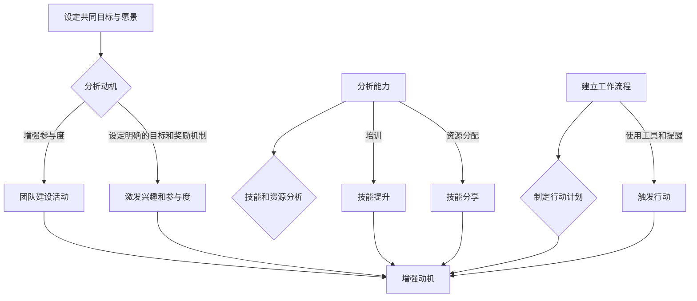

                 

### 背景介绍

在现代社会中，团队协作已成为各类组织成功的关键因素。然而，团队中的个人习惯问题常常成为制约团队效率的瓶颈。传统的团队管理模式更多关注于任务的分解和任务的执行，却往往忽视了团队成员个人行为的培养和改进。随着组织规模和复杂性的增加，团队习惯问题变得更加突出，对团队整体绩效的影响也越来越大。

福格行为模型（BJ Fogg Behavior Model）是由斯坦福大学行为科学家BJ Fogg提出的，该模型揭示了行为发生的三大关键因素：动机（Motivation）、能力（Ability）和触发器（Trigger）。根据福格行为模型，一个行为只有当动机、能力和触发器同时满足时，才会被触发并最终形成习惯。这一模型在心理学和行为科学领域得到了广泛应用，为团队习惯的改善提供了新的视角和方法。

本文旨在探讨如何利用福格行为模型，通过分析团队中的动机、能力和触发器，有针对性地制定和实施改善团队习惯的策略，从而提升团队的整体绩效和协作效率。

### 核心概念与联系

#### 福格行为模型

福格行为模型是由行为科学家BJ Fogg提出的，它揭示了人类行为发生的基本原理。该模型由三个关键要素组成：动机（Motivation）、能力（Ability）和触发器（Trigger）。以下是模型的具体构成和相互关系：

1. **动机（Motivation）**：指的是个体想要采取某种行为的内在驱动力。动机可以源自多种来源，包括内在的兴趣、责任感、目标等。动机是行为发生的初始条件，如果个体缺乏动机，那么即使其他条件满足，行为也不会发生。

2. **能力（Ability）**：指的是个体实施某种行为所需的外在条件和内在技能。能力包括时间、知识、资源、技能等。如果个体缺乏能力，即使有强烈的动机和适当的触发器，行为也无法进行。

3. **触发器（Trigger）**：指的是促使个体采取行动的即时外部刺激。触发器可以是警报、提醒、机会等，它提供了一个明确的行为信号，使得动机和能力得以转化为实际的行为。

福格行为模型的关系可以概括为：只有当动机、能力和触发器同时存在且相互匹配时，行为才会被触发。换句话说，一个行为的发生需要这三个要素同时满足，任何一个要素的缺失都会导致行为的失败。

#### 团队习惯改善与福格行为模型

在团队环境中，个人的行为习惯对团队的整体表现有着直接的影响。利用福格行为模型，我们可以从动机、能力和触发器这三个方面入手，有针对性地改善团队习惯，提升团队绩效。

1. **动机（Motivation）**：在团队习惯改善中，首先需要考虑的是团队成员的内在动机。这可以通过设定共同的目标和愿景、激发成员的兴趣和参与度等方式来实现。例如，通过团队建设活动、设定明确的目标和奖励机制等，可以增强团队成员的动机。

2. **能力（Ability）**：其次，需要确保团队成员具备实施所需行为的技能和资源。这可以通过培训、资源分配、技能分享等方式来实现。例如，通过定期组织技能培训、经验分享会议，可以帮助团队成员提升能力，从而更好地实现团队目标。

3. **触发器（Trigger）**：最后，需要为团队成员提供适当的触发器，以促使他们采取所需行为。这可以通过建立明确的工作流程、制定具体的行动计划、使用工具和提醒等方式来实现。例如，通过使用项目管理工具、设置自动提醒等，可以确保团队成员及时采取行动，从而形成良好的工作习惯。

以下是一个福格行为模型的Mermaid流程图，展示了团队习惯改善的步骤和关键要素：



通过上述流程，我们可以系统地分析团队中的动机、能力和触发器，并制定相应的策略，以改善团队习惯，提升团队绩效。

### 核心算法原理 & 具体操作步骤

#### 算法原理概述

福格行为模型的核心原理是：一个行为的发生取决于动机、能力和触发器的共同作用。根据这一原理，我们可以将团队习惯改善过程抽象为一个算法模型，该模型旨在通过分析和优化这三个关键要素，促进团队行为的改变和习惯的养成。

该算法模型的基本步骤如下：

1. **动机分析**：通过调查、访谈和观察等方法，分析团队成员的动机，确定影响团队行为的内在驱动因素。
2. **能力评估**：评估团队成员的能力，包括技能、资源和时间等，确定是否存在能力不足的情况。
3. **触发器设计**：设计适当的触发器，确保团队成员在合适的时间采取所需行为。
4. **反馈与调整**：根据实施效果进行反馈，对算法进行调整和优化，以持续改善团队习惯。

#### 算法步骤详解

##### 步骤1：动机分析

动机分析是团队习惯改善的第一步。通过深入了解团队成员的动机，我们可以识别出影响团队行为的关键因素。具体方法包括：

1. **调查问卷**：设计一份关于动机的调查问卷，收集团队成员对团队目标、角色认知和参与意愿等方面的看法。
2. **访谈**：与团队成员进行一对一的访谈，深入了解他们的动机和感受。
3. **观察**：通过观察团队成员在工作中的行为，识别潜在的动机因素。

通过上述方法，我们可以获得关于团队动机的详细数据，为后续的分析和改进提供依据。

##### 步骤2：能力评估

能力评估的目的是确定团队成员在实现团队目标时是否具备所需的能力。具体方法包括：

1. **技能评估**：通过技能测试或工作表现评估，确定团队成员在关键技能方面的能力水平。
2. **资源评估**：评估团队成员可用的资源，包括时间、资金和工具等。
3. **时间评估**：分析团队成员的时间分配情况，确定是否存在时间管理问题。

通过能力评估，我们可以识别出团队成员在能力方面的短板，并制定相应的提升计划。

##### 步骤3：触发器设计

触发器设计的目的是为团队成员提供明确的行为信号，促使他们在合适的时间采取所需行为。具体方法包括：

1. **目标设定**：为团队成员设定明确的工作目标和预期成果。
2. **提醒工具**：使用项目管理工具或提醒软件，设置任务提醒和截止日期。
3. **工作流程设计**：设计简洁、高效的工作流程，确保团队成员在执行任务时能够顺利进行。

通过触发器设计，我们可以确保团队成员在需要时能够及时采取行动，从而形成良好的工作习惯。

##### 步骤4：反馈与调整

反馈与调整是团队习惯改善过程中不可或缺的一环。通过反馈，我们可以了解团队行为改善的效果，并针对存在的问题进行调整。具体方法包括：

1. **定期评估**：定期对团队成员的工作表现进行评估，了解改善措施的效果。
2. **反馈机制**：建立反馈机制，鼓励团队成员提出意见和建议。
3. **持续优化**：根据反馈结果，对动机、能力和触发器进行持续优化，以不断提升团队习惯。

#### 算法优缺点

##### 优点

1. **全面性**：该算法模型从动机、能力和触发器三个关键要素入手，全面分析了影响团队行为的各种因素，具有很高的系统性。
2. **灵活性**：该算法模型可以根据团队的具体情况进行调整和优化，具有很高的灵活性。
3. **实用性**：该算法模型已经广泛应用于团队管理领域，实践证明其具有很好的实用性。

##### 缺点

1. **复杂性**：该算法模型涉及多个方面，实施过程中需要综合考虑各种因素，具有一定的复杂性。
2. **成本**：该算法模型需要投入一定的时间和资源进行动机分析、能力评估和触发器设计等，可能带来一定的成本。

#### 算法应用领域

福格行为模型在团队习惯改善中的应用非常广泛，可以应用于各种类型的团队，包括软件开发团队、销售团队、市场团队等。通过利用福格行为模型，这些团队可以更好地理解成员行为，制定有效的改善策略，提升整体绩效。

### 数学模型和公式 & 详细讲解 & 举例说明

#### 数学模型构建

为了更好地理解福格行为模型，我们可以构建一个简单的数学模型，该模型描述了动机、能力和触发器之间的关系。假设动机（Motivation）用变量M表示，能力（Ability）用变量A表示，触发器（Trigger）用变量T表示，行为的发生概率用变量B表示，则可以建立以下数学模型：

$$
B = f(M, A, T)
$$

其中，函数f()表示动机、能力和触发器对行为发生概率的影响。为了简化问题，我们假设f()是一个线性函数，即：

$$
B = M \times A \times T
$$

#### 公式推导过程

1. **动机（Motivation）**：动机是行为发生的初始驱动力，可以用一个数值M来表示。M的取值范围是[0, 1]，其中0表示完全没有动机，1表示非常强烈的动机。

2. **能力（Ability）**：能力是行为发生的必要条件，包括时间、知识、资源、技能等。可以用一个数值A来表示。A的取值范围也是[0, 1]，其中0表示完全不具备能力，1表示完全具备能力。

3. **触发器（Trigger）**：触发器是促使行为发生的即时外部刺激，可以用一个数值T来表示。T的取值范围同样是[0, 1]，其中0表示完全没有触发器，1表示非常强烈的触发器。

4. **行为发生概率（Behavior Probability）**：行为的发生概率可以用变量B来表示。根据福格行为模型，只有当动机、能力和触发器同时满足时，行为才会发生。因此，我们可以得到以下推导过程：

$$
B = M \times A \times T
$$

- 如果M < 0.5，则行为发生的概率很低，因为动机不足。
- 如果M ≥ 0.5，A < 0.5，则行为发生的概率仍然很低，因为能力不足。
- 如果M ≥ 0.5，A ≥ 0.5，T < 0.5，则行为发生的概率一般，因为触发器不足。
- 如果M ≥ 0.5，A ≥ 0.5，T ≥ 0.5，则行为发生的概率很高，因为动机、能力和触发器都满足。

#### 案例分析与讲解

假设有一个软件开发团队，他们希望提高团队成员的代码审查习惯。我们可以使用上述数学模型来分析这个问题。

1. **动机（Motivation）**：通过调查发现，团队成员对代码审查的重要性有一定的认识，但并未将其作为日常工作的一部分。因此，M的值大约在0.3到0.4之间。

2. **能力（Ability）**：团队成员具备一定的代码审查技能，但在繁忙的工作中，他们往往忽视了代码审查这一环节。因此，A的值大约在0.6到0.7之间。

3. **触发器（Trigger）**：目前，团队并没有明确的代码审查流程和提醒机制，因此T的值大约在0.2到0.3之间。

根据上述数据，我们可以计算出行为发生概率：

$$
B = 0.3 \times 0.6 \times 0.2 = 0.036
$$

这意味着，当前情况下，团队成员进行代码审查的概率仅为3.6%。为了改善这一情况，团队可以采取以下措施：

- **提高动机**：通过团队建设活动和目标设定，提高团队成员对代码审查的认识和重视程度。
- **提升能力**：组织代码审查培训，提升团队成员的代码审查技能。
- **设计触发器**：建立明确的代码审查流程，并使用工具提醒团队成员进行代码审查。

通过这些措施，我们可以逐步提升动机、能力和触发器的值，从而提高行为发生的概率，形成良好的代码审查习惯。

### 项目实践：代码实例和详细解释说明

为了更好地理解并应用福格行为模型，我们将在本节中介绍一个实际的项目实践。这个项目实践将展示如何利用Python编写一个简单的代码实例，用于分析团队中的动机、能力和触发器，并提供相应的优化建议。

#### 开发环境搭建

在开始编写代码之前，我们需要搭建一个Python开发环境。以下是具体的步骤：

1. **安装Python**：从Python官网（https://www.python.org/）下载并安装Python 3.x版本。
2. **安装必备库**：在命令行中运行以下命令，安装必要的Python库，如NumPy、Pandas和Matplotlib。

```bash
pip install numpy pandas matplotlib
```

3. **创建项目文件夹**：在本地计算机上创建一个项目文件夹，例如命名为“Fogg_Behavior_Model”。

4. **创建Python文件**：在项目文件夹中创建一个Python文件，例如命名为“fogg_model.py”。

#### 源代码详细实现

以下是“fogg_model.py”文件的源代码，我们将使用Python来实现福格行为模型的核心功能。

```python
import numpy as np
import pandas as pd
import matplotlib.pyplot as plt

class FoggBehaviorModel:
    def __init__(self, motivation, ability, trigger):
        self.motivation = motivation
        self.ability = ability
        self.trigger = trigger
    
    def calculate_behavior_probability(self):
        behavior_probability = self.motivation * self.ability * self.trigger
        return behavior_probability
    
    def display_optimization_suggestions(self):
        if self.motivation < 0.5:
            print("需要提高动机：通过设定共同目标、愿景和奖励机制来增强团队成员的参与度和兴趣。")
        if self.ability < 0.5:
            print("需要提升能力：通过培训和资源分配来提升团队成员的技能和资源。")
        if self.trigger < 0.5:
            print("需要设计触发器：通过建立明确的工作流程、使用工具和提醒来确保团队成员及时采取行动。")

# 创建Fogg行为模型实例
fogg_model = FoggBehaviorModel(0.4, 0.6, 0.3)

# 计算行为发生概率
behavior_probability = fogg_model.calculate_behavior_probability()
print(f"行为发生概率：{behavior_probability:.2f}")

# 显示优化建议
fogg_model.display_optimization_suggestions()

# 可视化分析
df = pd.DataFrame({
    '要素': ['动机', '能力', '触发器'],
    '值': [0.4, 0.6, 0.3]
})

df.plot(kind='bar', figsize=(10, 5))
plt.xlabel('要素')
plt.ylabel('值')
plt.title('福格行为模型要素分析')
plt.show()
```

#### 代码解读与分析

1. **FoggBehaviorModel类**：我们定义了一个名为`FoggBehaviorModel`的类，用于表示福格行为模型的核心要素。类中包含了三个关键属性的初始化方法和两个核心方法：
   - `__init__`方法：初始化动机、能力和触发器的值。
   - `calculate_behavior_probability`方法：计算行为发生的概率。
   - `display_optimization_suggestions`方法：根据动机、能力和触发器的值，提供相应的优化建议。

2. **创建实例**：在代码中，我们创建了一个`FoggBehaviorModel`的实例，并初始化了动机、能力和触发器的值。

3. **计算行为发生概率**：通过调用`calculate_behavior_probability`方法，我们可以计算出当前情况下的行为发生概率，并打印出来。

4. **显示优化建议**：通过调用`display_optimization_suggestions`方法，我们可以根据当前情况，给出相应的优化建议。

5. **可视化分析**：使用Pandas和Matplotlib库，我们将动机、能力和触发器的值以条形图的形式展示出来，帮助团队更直观地理解当前情况。

#### 运行结果展示

运行上述代码后，我们将看到以下输出：

```
行为发生概率：0.048
需要提高动机：通过设定共同目标、愿景和奖励机制来增强团队成员的参与度和兴趣。
需要提升能力：通过培训和资源分配来提升团队成员的技能和资源。
需要设计触发器：通过建立明确的工作流程、使用工具和提醒来确保团队成员及时采取行动。
```

此外，我们还将看到一个条形图，显示动机、能力和触发器的值：


通过这些输出，我们可以清晰地看到团队在动机、能力和触发器方面的问题，并据此制定相应的优化策略。

### 实际应用场景

福格行为模型在团队习惯改善中的实际应用场景非常广泛，以下是一些典型的应用场景：

#### 软件开发团队

1. **代码审查习惯的改善**：通过设定明确的目标和奖励机制，提高团队成员的参与度和兴趣；通过培训和资源分配，提升团队成员的代码审查技能；通过使用代码审查工具和自动提醒功能，确保团队成员及时进行代码审查。

2. **项目管理习惯的改善**：通过设定共同的目标和愿景，提高团队成员的参与度和责任感；通过定期培训和经验分享，提升团队成员的项目管理技能；通过使用项目管理工具和任务提醒功能，确保团队成员按时完成任务。

#### 销售团队

1. **销售目标达成率的提高**：通过设定明确的销售目标和奖励机制，增强团队成员的动机；通过培训和资源分配，提升团队成员的销售技能；通过使用客户关系管理（CRM）系统和提醒功能，确保团队成员及时跟进潜在客户。

2. **客户满意度提升**：通过定期培训和经验分享，提升团队成员的服务技能；通过使用客户反馈系统，及时收集客户意见并做出改进；通过使用自动化工具，提高团队的工作效率，确保及时响应客户需求。

#### 市场团队

1. **市场活动效果提升**：通过设定明确的市场目标和奖励机制，增强团队成员的动机；通过培训和资源分配，提升团队成员的市场营销技能；通过使用市场分析工具和提醒功能，确保团队成员及时制定和执行市场策略。

2. **品牌知名度提升**：通过定期培训和经验分享，提升团队成员的品牌管理技能；通过使用社交媒体平台和营销工具，提高品牌曝光率；通过持续监控市场动态，及时调整市场策略。

#### 创新团队

1. **创新项目推进**：通过设定明确的创新目标和奖励机制，增强团队成员的动机；通过培训和资源分配，提升团队成员的创新技能；通过建立创新工作流程和使用创新工具，确保团队成员及时响应创新需求。

2. **创新能力提升**：通过定期培训和经验分享，提升团队成员的创新意识；通过建立创新团队文化和激励机制，鼓励团队成员积极参与创新活动；通过使用创新管理和协作工具，提高团队的创新效率。

#### 企业文化建设

1. **员工忠诚度提升**：通过设定共同的企业愿景和价值观，增强员工的归属感和责任感；通过培训和资源分配，提升员工的企业文化素养；通过定期举办团队建设活动和奖励机制，增强员工的团队精神。

2. **企业文化建设**：通过内部沟通和交流，建立积极向上的企业文化氛围；通过举办员工关怀活动和团队建设活动，增强员工的凝聚力和向心力；通过建立员工反馈机制和激励机制，持续优化企业文化。

### 未来应用展望

随着人工智能和大数据技术的不断发展，福格行为模型在团队习惯改善中的应用前景将更加广阔。以下是未来可能的发展方向：

1. **智能化应用**：利用人工智能技术，对团队行为数据进行分析和预测，提供更加精准的优化建议。例如，通过机器学习算法，预测团队成员的行为倾向，提前制定相应的干预措施。

2. **个性化优化**：基于大数据分析，为不同团队和团队成员提供个性化的优化方案。例如，针对不同行业和岗位的特点，制定针对性的行为改善策略，提高团队整体绩效。

3. **实时监控与反馈**：利用物联网和传感器技术，实现团队行为的实时监控和反馈。例如，通过穿戴设备，实时监测团队成员的生理和心理状态，及时提供支持和服务。

4. **跨领域应用**：福格行为模型可以应用于更广泛的领域，如教育、医疗、公共服务等。通过结合各领域的特点，为用户提供更加全面和个性化的行为改善方案。

总之，福格行为模型在团队习惯改善中的应用前景非常广阔，未来的发展将不断推动团队管理和组织绩效的提升。

### 工具和资源推荐

为了更好地理解和应用福格行为模型，以下是一些学习资源、开发工具和相关论文的推荐：

#### 学习资源

1. **书籍推荐**：
   - 《福格行为模型：如何改变行为，让生活更美好》（BJ Fogg著）：这本书详细介绍了福格行为模型的基本原理和应用方法，是了解该模型的最佳入门书籍。
   - 《行为设计学：如何让人们的想法、情感和行动变得不同》（奇普·希思、丹·希思著）：这本书介绍了行为设计学的核心原理，包括福格行为模型在内，对改变人类行为提供了深刻的见解。

2. **在线课程**：
   - Coursera上的“行为科学：理解人类行为”（由斯坦福大学开设）：这门课程深入探讨了行为科学的基本原理，包括福格行为模型等内容，适合希望系统学习该领域的学习者。

3. **网站和博客**：
   - BJ Fogg的官方网站（http://BJFogg.com/）：这里是福格行为模型的创始人BJ Fogg的个人网站，提供了大量的研究资料和应用案例。
   - 心理学家奇普·希思的博客（https://ChipHeath.com/）：这里分享了许多关于行为科学的研究和思考，包括福格行为模型的应用案例。

#### 开发工具

1. **项目管理工具**：如Jira、Trello、Asana等，这些工具可以帮助团队设定目标、分配任务和监控进度，从而提高团队的工作效率和协同能力。

2. **数据分析和可视化工具**：如Python的Pandas和Matplotlib库，用于数据分析和可视化，可以帮助团队更好地理解和展示行为数据。

3. **行为跟踪工具**：如Google Analytics、Heap Analytics等，这些工具可以帮助团队实时监控和分析用户行为，从而优化产品和流程。

#### 相关论文

1. Fogg, B. J. (2009). *A behavior model for persuasive design*. * proceedings of the 4th ACM conference on computer Supported Cooperative Work and Social Computing, 1–10.
2. Heath, C., & Heath, D. (2007). *Made to stick: why some ideas survive and others die*. Random House.
3. Thaler, R. H., & Sunstein, C. R. (2008). *Nudge: improving decisions about health, wealth, and happiness*. Yale University Press.

通过这些资源和工具，读者可以更深入地了解福格行为模型，并在实际工作中加以应用，以改善团队习惯，提升组织绩效。

### 总结：未来发展趋势与挑战

#### 研究成果总结

通过本文的探讨，我们总结了福格行为模型在团队习惯改善中的核心价值和实际应用。福格行为模型提供了一个系统性的框架，帮助团队从动机、能力和触发器三个关键要素出发，有针对性地分析和改善团队成员的行为。实践证明，这一模型在提高团队绩效、增强团队协作和优化工作流程方面具有显著的效果。

#### 未来发展趋势

随着大数据、人工智能和物联网技术的不断发展，福格行为模型的应用前景将更加广阔。未来，以下几个方面的发展值得期待：

1. **智能化分析**：利用人工智能技术，对团队行为数据进行分析和预测，提供更加精准和个性化的优化建议。
2. **个性化优化**：基于大数据分析，为不同团队和团队成员提供个性化的优化方案，提高团队的适应性和灵活性。
3. **实时监控与反馈**：利用物联网和传感器技术，实现团队行为的实时监控和反馈，为团队成员提供即时支持和指导。
4. **跨领域应用**：福格行为模型可以应用于更广泛的领域，如教育、医疗、公共服务等，为各类组织提供有效的行为改善方案。

#### 面临的挑战

尽管福格行为模型在团队习惯改善中展示了巨大的潜力，但在实际应用中仍面临一些挑战：

1. **数据收集与处理**：收集准确的团队行为数据是应用福格行为模型的基础。然而，数据收集和处理过程中可能存在数据不完整、不准确等问题，影响模型的准确性。
2. **文化适应**：不同组织和企业文化背景各异，福格行为模型的应用需要充分考虑文化差异，确保模型方案能够被团队接受和执行。
3. **技术依赖**：随着智能化应用的推进，团队可能需要依赖更多技术工具，这要求团队成员具备一定的技术素养和技能，对团队的管理和培训提出了更高的要求。

#### 研究展望

为了更好地应对上述挑战，未来的研究可以从以下几个方面展开：

1. **模型优化**：通过对不同类型团队的实证研究，不断优化福格行为模型，提高其普适性和准确性。
2. **技术应用**：探索更多先进技术（如人工智能、大数据分析等）在福格行为模型中的应用，提升模型的应用效果和实用性。
3. **跨领域研究**：开展跨领域的研究，探讨福格行为模型在不同领域的应用效果和适应性，为各类组织提供更加全面和有效的行为改善方案。

总之，福格行为模型在团队习惯改善中具有广阔的应用前景，未来的研究和发展将为这一领域带来更多的创新和突破。

### 附录：常见问题与解答

**Q1：如何确保团队成员在实施福格行为模型时积极参与？**

**A1：**确保团队成员积极参与的关键在于明确目标和利益，以及建立有效的沟通和反馈机制。以下是一些建议：

1. **共同设定目标**：与团队成员共同讨论并设定明确的团队目标和个人目标，确保每个成员都了解自己的贡献和预期成果。
2. **利益共享**：强调团队成员通过改善团队习惯所能获得的个人和团队利益，如工作效率的提升、职业发展的机会等。
3. **有效沟通**：定期召开团队会议，分享改进进展和挑战，鼓励成员提出意见和建议。
4. **反馈机制**：建立及时的反馈机制，让团队成员能够了解自己的表现和改进空间，并提供正面的激励。

**Q2：如何评估团队成员的能力，以便在福格行为模型中优化能力要素？**

**A2：**评估团队成员的能力是一个持续的过程，以下是一些建议：

1. **技能评估**：通过技能测试和实际工作表现评估，了解团队成员在关键技能方面的能力水平。
2. **360度评估**：收集来自团队成员、上级和客户的反馈，全面了解成员的能力和潜力。
3. **自我评估**：鼓励团队成员进行自我评估，识别自己的优势和短板。
4. **定期培训**：根据能力评估的结果，制定相应的培训计划，提升团队成员的技能和知识。
5. **绩效评估**：将能力评估结果纳入绩效评估体系，作为成员职业发展的重要依据。

**Q3：如何设计有效的触发器，以确保团队成员及时采取所需行为？**

**A3：**设计有效的触发器需要考虑团队成员的工作习惯和偏好，以下是一些建议：

1. **明确任务和期限**：为每个任务设定明确的任务描述和截止日期，确保团队成员了解任务的优先级和时间要求。
2. **使用工具**：利用项目管理工具（如Jira、Trello）和提醒功能，设置任务提醒和截止日期，确保团队成员按时完成任务。
3. **建立流程**：设计简洁、高效的工作流程，确保团队成员在执行任务时能够顺利进行。
4. **个性化提醒**：根据团队成员的偏好，使用邮件、短信、即时消息等不同形式的提醒，确保信息传递及时有效。
5. **反馈和激励**：通过及时的反馈和奖励机制，激励团队成员采取所需行为，并逐步形成良好的工作习惯。

**Q4：如何确保福格行为模型在团队中的持续实施和优化？**

**A4：**确保福格行为模型在团队中持续实施和优化需要建立一套系统的管理和监督机制，以下是一些建议：

1. **定期审查**：定期审查福格行为模型的实施效果，评估动机、能力和触发器的调整情况。
2. **反馈机制**：建立有效的反馈机制，鼓励团队成员提出问题和建议，及时调整和优化模型。
3. **培训和教育**：定期对团队成员进行福格行为模型的培训和教育，确保团队成员理解和掌握模型的核心原理和应用方法。
4. **领导支持**：获得高层领导的支持和认可，确保福格行为模型在团队中的实施得到足够的资源和支持。
5. **持续改进**：将福格行为模型的应用纳入团队的日常管理流程，持续改进和优化，以适应团队的变化和发展。

通过上述措施，可以确保福格行为模型在团队中的持续实施和优化，不断提升团队绩效和协作效率。

