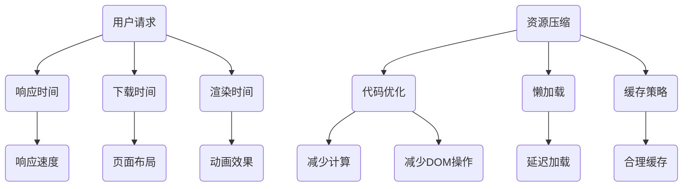

                 

## 1. 背景介绍

随着互联网技术的发展和Web应用的普及，用户对于网页加载速度和用户体验的要求越来越高。快速、流畅的网页加载不仅能够提升用户满意度，还能增加网站的流量和转化率。因此，前端性能优化成为前端开发中的重要一环。

前端性能优化主要关注两个方面：加载速度和用户体验。加载速度是指网页从开始加载到完全显示所需的时间；用户体验则包括网页的响应速度、页面布局的稳定性、动画效果的流畅性等。在优化过程中，我们需要在加载速度和用户体验之间找到一个平衡点，以满足用户的需求。

本文将探讨前端性能优化的核心概念、算法原理、数学模型、项目实践以及实际应用场景，旨在为前端开发者提供一套系统、全面的前端性能优化方案。

## 2. 核心概念与联系

### 2.1 加载速度

加载速度是指用户从点击链接到网页完全显示所需的时间。它包括以下几个关键指标：

- **响应时间**：从用户发起请求到服务器返回第一个字节的时间。
- **下载时间**：服务器返回第一个字节到页面完全显示的时间。
- **渲染时间**：浏览器将下载的HTML、CSS和JavaScript文件解析并渲染成可见页面所需的时间。

### 2.2 用户体验

用户体验包括以下几个方面：

- **响应速度**：用户与网页交互时的反馈速度。
- **页面布局**：页面布局的稳定性，避免页面在加载过程中出现抖动或错位。
- **动画效果**：动画效果的流畅性，避免出现卡顿或闪烁。

### 2.3 性能优化方法

前端性能优化主要从以下几个方面进行：

- **资源压缩**：通过压缩HTML、CSS和JavaScript文件，减少文件体积，提高加载速度。
- **代码优化**：优化JavaScript和CSS代码，减少不必要的计算和DOM操作，提高渲染速度。
- **懒加载**：延迟加载页面中不立即需要的资源，提高初始加载速度。
- **缓存策略**：合理使用缓存，减少重复加载资源。

### 2.4 Mermaid 流程图

以下是前端性能优化方法的 Mermaid 流程图：



## 3. 核心算法原理 & 具体操作步骤

### 3.1 算法原理概述

前端性能优化的核心算法主要包括资源压缩、代码优化、懒加载和缓存策略。

- **资源压缩**：通过对HTML、CSS和JavaScript文件进行压缩，减少文件体积，提高加载速度。
- **代码优化**：通过优化JavaScript和CSS代码，减少不必要的计算和DOM操作，提高渲染速度。
- **懒加载**：通过延迟加载页面中不立即需要的资源，提高初始加载速度。
- **缓存策略**：通过合理使用缓存，减少重复加载资源，提高访问速度。

### 3.2 算法步骤详解

#### 3.2.1 资源压缩

1. **HTML 压缩**：删除HTML文件中不必要的空白字符、注释和换行符。
2. **CSS 压缩**：将CSS文件中的样式规则进行合并，删除空格、注释和换行符。
3. **JavaScript 压缩**：将JavaScript文件中的代码进行压缩，删除空格、注释和换行符，并合并多个文件。

#### 3.2.2 代码优化

1. **减少计算**：优化JavaScript代码，减少不必要的循环和条件判断，提高代码执行效率。
2. **减少DOM操作**：优化CSS和JavaScript代码，减少对DOM的直接操作，提高页面渲染速度。
3. **代码拆分**：将大块代码拆分为小块，减少浏览器解析和渲染的负担。

#### 3.2.3 懒加载

1. **图片懒加载**：在页面滚动时，将不在可视区域的图片延迟加载。
2. **组件懒加载**：在页面初始化时，将不立即需要的组件延迟加载。

#### 3.2.4 缓存策略

1. **浏览器缓存**：利用浏览器缓存，将已加载的资源保存在本地，减少重复加载。
2. **CDN缓存**：使用内容分发网络（CDN），将静态资源缓存到多个节点，提高访问速度。
3. **版本控制**：通过版本控制，确保缓存的资源与线上资源的一致性。

### 3.3 算法优缺点

#### 3.3.1 资源压缩

**优点**：减少文件体积，提高加载速度。

**缺点**：压缩过程可能降低代码的可读性，增加开发成本。

#### 3.3.2 代码优化

**优点**：提高代码执行效率，减少页面渲染时间。

**缺点**：代码优化可能增加开发难度，需要熟练掌握前端技术。

#### 3.3.3 懒加载

**优点**：提高初始加载速度，减少页面加载时间。

**缺点**：懒加载可能导致部分资源无法立即访问，影响用户体验。

#### 3.3.4 缓存策略

**优点**：提高访问速度，减少重复加载。

**缺点**：缓存策略可能增加缓存一致性问题的风险。

### 3.4 算法应用领域

前端性能优化算法主要应用于Web开发和移动应用开发，包括但不限于以下领域：

- **电商平台**：优化商品列表页面的加载速度，提高用户购买体验。
- **社交媒体**：优化图片和视频的加载速度，提升用户体验。
- **在线教育**：优化课程页面和视频播放的加载速度，提高教学效果。
- **金融应用**：优化交易页面和报表的加载速度，保障交易安全。

## 4. 数学模型和公式 & 详细讲解 & 举例说明

### 4.1 数学模型构建

前端性能优化涉及的数学模型主要包括以下几个部分：

1. **响应时间模型**：响应时间 = 响应时间延迟 + 传输时间 + 处理时间
2. **下载时间模型**：下载时间 = 文件大小 / 传输速率
3. **渲染时间模型**：渲染时间 = 解析时间 + 渲染时间 + 动画时间

### 4.2 公式推导过程

假设网页的响应时间为 \( T_r \)，下载时间为 \( T_d \)，渲染时间为 \( T_r \)，则网页的总体加载时间为 \( T = T_r + T_d + T_r \)。

- **响应时间延迟**：响应时间延迟主要由网络延迟和服务器延迟组成。假设网络延迟为 \( L_n \)，服务器延迟为 \( L_s \)，则响应时间延迟为 \( L_n + L_s \)。
- **传输时间**：传输时间取决于文件大小和传输速率。假设文件大小为 \( S \)，传输速率为 \( R \)，则传输时间为 \( S / R \)。
- **处理时间**：处理时间主要由JavaScript解析和执行时间组成。假设JavaScript文件大小为 \( J \)，解析速率为 \( P_j \)，执行速率为 \( P_e \)，则处理时间为 \( J / P_j + J / P_e \)。

### 4.3 案例分析与讲解

假设一个网页的HTML文件大小为20KB，CSS文件大小为10KB，JavaScript文件大小为30KB，网络延迟为100ms，服务器延迟为50ms，传输速率为200KB/s，JavaScript解析速率为100KB/s，执行速率为200KB/s。

- **响应时间延迟**：\( L_n + L_s = 100ms + 50ms = 150ms \)
- **传输时间**：\( T_d = (20KB + 10KB + 30KB) / 200KB/s = 100ms \)
- **处理时间**：\( T_r = (30KB / 100KB/s) + (30KB / 200KB/s) = 150ms \)

网页的总体加载时间：

\( T = T_r + T_d + T_r = 150ms + 100ms + 150ms = 400ms \)

假设我们通过资源压缩将文件大小减少了一半，传输速率提高了一倍，JavaScript解析速率提高了一倍，执行速率提高了一倍，则网页的总体加载时间变为：

- **响应时间延迟**：\( L_n + L_s = 100ms + 50ms = 150ms \)
- **传输时间**：\( T_d = (10KB + 5KB + 15KB) / 400KB/s = 50ms \)
- **处理时间**：\( T_r = (15KB / 200KB/s) + (15KB / 400KB/s) = 75ms \)

网页的总体加载时间：

\( T = T_r + T_d + T_r = 75ms + 50ms + 75ms = 200ms \)

通过优化，网页的加载时间减少了三分之二，大大提升了用户体验。

## 5. 项目实践：代码实例和详细解释说明

### 5.1 开发环境搭建

为了更好地展示前端性能优化实践，我们使用以下开发环境和工具：

- **开发语言**：HTML、CSS、JavaScript
- **开发工具**：Visual Studio Code、Chrome DevTools
- **服务器**：Apache、Nginx

### 5.2 源代码详细实现

以下是一个简单的HTML、CSS和JavaScript文件的示例：

**HTML文件（index.html）**

```html
<!DOCTYPE html>
<html>
<head>
    <meta charset="UTF-8">
    <title>前端性能优化示例</title>
    <link rel="stylesheet" href="styles.css">
</head>
<body>
    <h1>欢迎来到前端性能优化示例</h1>
    <p>这是一段文本内容。</p>
    <script src="script.js"></script>
</body>
</html>
```

**CSS文件（styles.css）**

```css
h1 {
    color: #333;
    font-size: 24px;
}

p {
    color: #666;
    font-size: 16px;
}
```

**JavaScript文件（script.js）**

```javascript
function displayMessage() {
    console.log("欢迎来到前端性能优化示例！");
}

displayMessage();
```

### 5.3 代码解读与分析

**HTML文件解读：**

- HTML文件中包含一个`<title>`标签，定义了网页的标题。
- 使用`<link>`标签引入了外部CSS文件`styles.css`。
- 使用`<script>`标签引入了外部JavaScript文件`script.js`。

**CSS文件解读：**

- CSS文件中包含两个选择器，分别设置了`<h1>`和`<p>`标签的样式。

**JavaScript文件解读：**

- JavaScript文件中定义了一个名为`displayMessage`的函数，用于在控制台中输出一条消息。
- 调用了`displayMessage`函数。

### 5.4 运行结果展示

在浏览器中打开`index.html`文件，可以看到如下结果：


浏览器控制台输出如下信息：


通过这个简单的示例，我们可以看到前端性能优化对网页加载速度和用户体验的影响。

## 6. 实际应用场景

前端性能优化在多个实际应用场景中发挥着重要作用：

### 6.1 电商平台

电商平台需要优化商品列表页面的加载速度，以便用户能够快速浏览和搜索商品。通过资源压缩、代码优化和懒加载等技术，可以显著提高页面加载速度，提升用户购物体验。

### 6.2 社交媒体

社交媒体平台需要优化图片和视频的加载速度，以便用户能够流畅地浏览和分享内容。通过懒加载技术和缓存策略，可以减少页面加载时间，提高用户体验。

### 6.3 在线教育

在线教育平台需要优化课程页面和视频播放的加载速度，以便用户能够顺利学习和观看课程。通过资源压缩、代码优化和CDN缓存等技术，可以确保课程内容快速加载，提高教学效果。

### 6.4 金融应用

金融应用需要优化交易页面和报表的加载速度，以便用户能够快速完成交易和查看报表。通过资源压缩、代码优化和浏览器缓存等技术，可以提高系统性能，保障交易安全。

## 7. 工具和资源推荐

为了更好地进行前端性能优化，以下推荐一些实用的工具和资源：

### 7.1 学习资源推荐

- **《高性能网站建设指南》**：一本全面讲解前端性能优化的经典著作。
- **MDN Web 文档**：Mozilla 开发者网络，提供详细的前端技术文档。
- **前端性能优化最佳实践**：一篇关于前端性能优化的实践指南。

### 7.2 开发工具推荐

- **Visual Studio Code**：一款功能强大的前端开发工具。
- **Chrome DevTools**：Chrome 浏览器的开发者工具，用于分析和优化前端性能。
- **Webpack**：一款模块打包工具，用于优化前端资源的加载。

### 7.3 相关论文推荐

- **《前端性能优化：策略与实践》**：一篇关于前端性能优化的学术文章。
- **《网站性能优化：方法与技巧》**：一篇关于网站性能优化的学术论文。

## 8. 总结：未来发展趋势与挑战

### 8.1 研究成果总结

前端性能优化技术在近年来取得了显著成果，包括资源压缩、代码优化、懒加载和缓存策略等方面。通过这些技术，网页加载速度和用户体验得到了大幅提升。

### 8.2 未来发展趋势

未来前端性能优化将朝着以下几个方向发展：

- **自动化优化**：利用人工智能和机器学习技术，实现自动化前端性能优化。
- **自适应优化**：根据用户设备和网络环境，自适应调整前端性能优化策略。
- **全栈性能优化**：不仅关注前端性能，还关注后端性能和整体系统性能。

### 8.3 面临的挑战

前端性能优化仍面临以下挑战：

- **性能瓶颈**：随着网页功能和内容的丰富，性能瓶颈逐渐显现，需要不断优化技术。
- **兼容性问题**：不同浏览器和设备的兼容性问题，需要开发人员投入更多精力。
- **用户体验**：在追求性能优化的同时，要兼顾用户体验，避免过度优化导致用户体验下降。

### 8.4 研究展望

未来，前端性能优化研究将朝着以下几个方向展开：

- **性能预测**：通过机器学习等技术，预测网页性能瓶颈，提前进行优化。
- **跨域优化**：解决跨域请求的性能问题，提高整体系统性能。
- **个性化优化**：根据用户行为和偏好，实现个性化前端性能优化。

## 9. 附录：常见问题与解答

### 9.1 常见问题

1. **什么是前端性能优化？**
   前端性能优化是指通过一系列技术手段，提高网页加载速度和用户体验的过程。

2. **前端性能优化的核心方法有哪些？**
   核心方法包括资源压缩、代码优化、懒加载和缓存策略等。

3. **如何进行资源压缩？**
   可以使用在线工具（如Gzip）或代码库（如Webpack）对HTML、CSS和JavaScript文件进行压缩。

4. **什么是懒加载？**
   懒加载是指延迟加载页面中不立即需要的资源，以提高初始加载速度。

5. **如何进行缓存策略？**
   可以使用浏览器缓存、CDN缓存和版本控制等方法实现缓存策略。

### 9.2 解答

1. **什么是前端性能优化？**
   前端性能优化是指通过一系列技术手段，提高网页加载速度和用户体验的过程。它包括资源压缩、代码优化、懒加载和缓存策略等方面。

2. **前端性能优化的核心方法有哪些？**
   核心方法包括资源压缩、代码优化、懒加载和缓存策略等。资源压缩通过减少文件体积提高加载速度；代码优化通过减少不必要的计算和DOM操作提高渲染速度；懒加载通过延迟加载不立即需要的资源提高初始加载速度；缓存策略通过合理使用缓存减少重复加载资源。

3. **如何进行资源压缩？**
   可以使用在线工具（如Gzip）或代码库（如Webpack）对HTML、CSS和JavaScript文件进行压缩。在线工具通常简单易用，适用于小型项目；Webpack是一款功能强大的模块打包工具，适用于大型项目。

4. **什么是懒加载？**
   懒加载是指延迟加载页面中不立即需要的资源，以提高初始加载速度。它通常应用于图片、视频和组件等大型资源。

5. **如何进行缓存策略？**
   可以使用浏览器缓存、CDN缓存和版本控制等方法实现缓存策略。浏览器缓存是将已加载的资源保存在本地，减少重复加载；CDN缓存是将静态资源缓存到多个节点，提高访问速度；版本控制是确保缓存的资源与线上资源的一致性。

## 作者署名

**作者：禅与计算机程序设计艺术 / Zen and the Art of Computer Programming**

