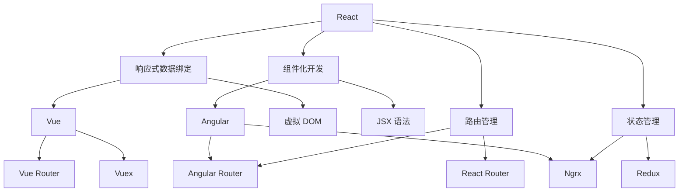

                 

### 1. 背景介绍

前端开发领域正经历着快速的发展，随着 Web 应用程序的日益复杂，开发者需要选择合适的前端框架来提高开发效率、保证代码质量和用户体验。React、Angular 和 Vue 是目前最受欢迎的前端框架，它们各自拥有独特的特点和优势，本文将对这三个框架进行比较分析，帮助开发者做出更合适的选择。

React 是由 Facebook 开发的一款用于构建用户界面的 JavaScript 库，自 2013 年发布以来，React 受到了广泛的支持和认可。Angular 是 Google 开发的一款基于 TypeScript 的前端框架，它提供了完整的解决方案，涵盖了从数据绑定到依赖注入等各个方面。Vue 是由尤雨溪创建的一款渐进式框架，它以其简单易用和强大的灵活性著称，近年来在开发者社区中迅速崛起。

### 2. 核心概念与联系

在前端框架的选择中，我们需要关注以下几个核心概念：

- **响应式数据绑定**：前端框架通过响应式数据绑定来保证 UI 与数据的一致性，当数据发生变化时，UI 能够自动更新。
- **组件化开发**：通过组件化开发，可以将 UI 分解为可复用的组件，提高代码的可维护性和可扩展性。
- **路由管理**：路由管理负责处理 URL 的变化，并根据 URL 生成对应的 UI。
- **状态管理**：状态管理负责处理应用中全局状态的管理和更新。

以下是这三个框架的 Mermaid 流程图，展示了它们的核心概念和联系：



### 3. 核心算法原理 & 具体操作步骤

#### 3.1 算法原理概述

React 的核心算法是虚拟 DOM，它通过比较虚拟 DOM 和实际 DOM 的差异，来最小化 DOM 操作，提高性能。Angular 的核心算法是数据绑定，它通过脏检查机制来保证数据与 UI 的一致性。Vue 的核心算法则是虚拟 DOM 和响应式数据绑定，它结合了 React 和 Angular 的优点。

#### 3.2 算法步骤详解

- **React**：React 使用 diff 算法来比较虚拟 DOM 和实际 DOM 的差异，具体步骤如下：
  1. 创建虚拟 DOM。
  2. 将虚拟 DOM 与实际 DOM 进行比较。
  3. 根据比较结果更新实际 DOM。

- **Angular**：Angular 使用脏检查算法来保证数据与 UI 的一致性，具体步骤如下：
  1. 定时轮询数据的变化。
  2. 当数据发生变化时，触发脏检查。
  3. 根据脏检查结果更新 UI。

- **Vue**：Vue 使用响应式数据绑定和虚拟 DOM 算法，具体步骤如下：
  1. 创建响应式数据对象。
  2. 监听数据的变化。
  3. 当数据发生变化时，更新虚拟 DOM。
  4. 根据虚拟 DOM 更新实际 DOM。

#### 3.3 算法优缺点

- **React**：虚拟 DOM 提高了性能，但需要额外的计算开销。
- **Angular**：数据绑定保证了数据与 UI 的一致性，但脏检查可能会导致性能问题。
- **Vue**：响应式数据绑定和虚拟 DOM 结合了 React 和 Angular 的优点，但需要处理响应式数据对象。

#### 3.4 算法应用领域

React、Angular 和 Vue 都可以用于构建复杂的前端应用程序，但它们在不同领域中的应用有所不同：

- **React**：适用于需要高性能和可扩展性的应用，如社交媒体、电子商务等。
- **Angular**：适用于大型企业级应用，如企业管理系统、金融应用等。
- **Vue**：适用于中小型应用，如个人博客、社区论坛等。

### 4. 数学模型和公式 & 详细讲解 & 举例说明

在讨论前端框架的数学模型和公式时，我们需要关注以下几个方面：

#### 4.1 数学模型构建

- **React**：虚拟 DOM 的数学模型是基于二叉树和 diff 算法构建的。
- **Angular**：数据绑定的数学模型是基于图论和脏检查算法构建的。
- **Vue**：响应式数据绑定的数学模型是基于代理（Proxy）和响应式对象构建的。

#### 4.2 公式推导过程

- **React**：虚拟 DOM 的 diff 算法公式如下：
  $$ diff(D_1, D_2) = \{ (v_1, v_2) \mid v_1 \in D_1, v_2 \in D_2, \text{且} v_1 \text{和} v_2 \text{具有相同类型} \} $$
  
- **Angular**：脏检查算法的公式如下：
  $$ \text{dirty} = \text{true} \wedge (\text{data\_changed} \vee \text{ui\_dirty}) $$
  
- **Vue**：响应式数据绑定的公式如下：
  $$ \text{watch}(data, \text{callback}) $$
  
#### 4.3 案例分析与讲解

以一个简单的计数器应用为例，我们来看一下这三个框架的实现过程：

- **React**：使用 JSX 语法创建组件，通过 `useState` 钩子管理状态，使用 `React Router` 进行路由管理。

  ```jsx
  import React, { useState } from 'react';
  import { BrowserRouter as Router, Route, Link } from 'react-router-dom';

  function Counter() {
    const [count, setCount] = useState(0);

    return (
      <div>
        <h1>Count: {count}</h1>
        <button onClick={() => setCount(count + 1)}>Increment</button>
      </div>
    );
  }

  export default function App() {
    return (
      <Router>
        <div>
          <Link to="/">Counter</Link>
        </div>
        <Route path="/" component={Counter} />
      </Router>
    );
  }
  ```

- **Angular**：使用 TypeScript 创建组件，使用 `@NgModule` 装饰器定义模块，使用 `@Component` 装饰器定义组件。

  ```typescript
  import { Component } from '@angular/core';

  @Component({
    selector: 'app-counter',
    template: `
      <div>
        <h1>Count: {{ count }}</h1>
        <button (click)="increment()">Increment</button>
      </div>
    `,
  })
  export class CounterComponent {
    count = 0;

    increment() {
      this.count++;
    }
  }
  ```

- **Vue**：使用 Vue 模板语法创建组件，使用 `vue-router` 进行路由管理。

  ```vue
  <template>
    <div>
      <h1>Count: {{ count }}</h1>
      <button @click="increment">Increment</button>
    </div>
  </template>

  <script>
  export default {
    data() {
      return {
        count: 0,
      };
    },
    methods: {
      increment() {
        this.count++;
      },
    },
  };
  </script>
  ```

### 5. 项目实践：代码实例和详细解释说明

在本文的最后，我们将通过一个简单的示例来展示如何使用这三个框架来构建一个前端应用。

#### 5.1 开发环境搭建

我们首先需要搭建一个开发环境，具体步骤如下：

1. **React**：安装 Node.js 和 npm，然后执行以下命令：

   ```bash
   npm create-react-app my-app
   cd my-app
   npm start
   ```

2. **Angular**：安装 Node.js 和 npm，然后执行以下命令：

   ```bash
   npm install -g @angular/cli
   ng new my-app
   cd my-app
   ng serve
   ```

3. **Vue**：安装 Node.js 和 npm，然后执行以下命令：

   ```bash
   npm install -g @vue/cli
   vue create my-app
   cd my-app
   npm run serve
   ```

#### 5.2 源代码详细实现

以下是使用 React、Angular 和 Vue 分别实现一个计数器的示例代码：

#### **React**：

```jsx
import React, { useState } from 'react';

function Counter() {
  const [count, setCount] = useState(0);

  return (
    <div>
      <h1>Count: {count}</h1>
      <button onClick={() => setCount(count + 1)}>Increment</button>
    </div>
  );
}

export default Counter;
```

#### **Angular**：

```typescript
import { Component } from '@angular/core';

@Component({
  selector: 'app-counter',
  template: `
    <div>
      <h1>Count: {{ count }}</h1>
      <button (click)="increment()">Increment</button>
    </div>
  `,
})
export class CounterComponent {
  count = 0;

  increment() {
    this.count++;
  }
}
```

#### **Vue**：

```vue
<template>
  <div>
    <h1>Count: {{ count }}</h1>
    <button @click="increment">Increment</button>
  </div>
</template>

<script>
export default {
  data() {
    return {
      count: 0,
    };
  },
  methods: {
    increment() {
      this.count++;
    },
  },
};
</script>
```

#### 5.3 代码解读与分析

- **React**：使用 `useState` 钩子管理状态，通过 `onClick` 事件更新状态。
- **Angular**：使用组件类管理状态，通过 `ng-click` 事件更新状态。
- **Vue**：使用 `data` 函数管理状态，通过 `@click` 事件更新状态。

#### 5.4 运行结果展示

在搭建好的开发环境中，运行这三个应用，我们都可以看到一个简单的计数器界面，当点击“Increment”按钮时，计数器会更新。

### 6. 实际应用场景

在实际应用中，React、Angular 和 Vue 各自有着广泛的应用场景：

- **React**：由于其高性能和可扩展性，React 适用于构建大型社交网络平台、电子商务网站等。
- **Angular**：由于其完整的解决方案和严格的类型检查，Angular 适用于构建大型企业级应用、金融系统等。
- **Vue**：由于其简单易用和强大的灵活性，Vue 适用于构建中小型应用、个人博客、社区论坛等。

### 7. 工具和资源推荐

为了更好地学习和使用 React、Angular 和 Vue，以下是几个推荐的工具和资源：

- **学习资源推荐**：
  - React：[官方文档](https://reactjs.org/docs/getting-started.html)
  - Angular：[官方文档](https://angular.io/docs)
  - Vue：[官方文档](https://vuejs.org/v2/guide/)

- **开发工具推荐**：
  - React：Visual Studio Code、Webpack
  - Angular：Visual Studio Code、Angular CLI
  - Vue：Visual Studio Code、Vue CLI

- **相关论文推荐**：
  - React：[React 的虚拟 DOM 算法](https://reactjs.org/docs/reconciliation.html)
  - Angular：[Angular 的数据绑定机制](https://angular.io/docs/ts/latest/guide/cheatsheet.html#!#data-binding-cheatsheet)
  - Vue：[Vue 的响应式原理](https://vuejs.org/v2/guide/reactivity.html)

### 8. 总结：未来发展趋势与挑战

React、Angular 和 Vue 作为目前最受欢迎的前端框架，它们在未来的发展趋势和挑战上也有所不同：

- **React**：随着 Web 技术的不断进步，React 的虚拟 DOM 算法和 JSX 语法将继续优化，以满足更高的性能和可维护性需求。
- **Angular**：Angular 正在逐步向 TypeScript 和 Ivy 渲染引擎过渡，这将提高其性能和可维护性。
- **Vue**：Vue 的简单易用和灵活性将继续吸引开发者，其生态系统和社区也将不断壮大。

在未来，前端框架的发展将更加注重性能优化、开发者体验和社区生态的构建。对于开发者来说，选择合适的前端框架不仅需要考虑当前项目的需求，还需要关注未来的发展趋势和挑战。

### 9. 附录：常见问题与解答

1. **React、Angular 和 Vue 有哪些区别？**
   - React 是一个用于构建用户界面的 JavaScript 库。
   - Angular 是一个基于 TypeScript 的前端框架，提供了完整的解决方案。
   - Vue 是一个渐进式框架，简单易用，适用于中小型应用。

2. **React、Angular 和 Vue 各自的优势是什么？**
   - React：高性能、可扩展性强。
   - Angular：完整的解决方案、严格的类型检查。
   - Vue：简单易用、强大的灵活性。

3. **React、Angular 和 Vue 各自的缺点是什么？**
   - React：需要额外的计算开销。
   - Angular：脏检查可能导致性能问题。
   - Vue：需要处理响应式数据对象。

4. **如何选择 React、Angular 和 Vue？**
   - 考虑项目的需求、团队的技术栈和开发者的熟悉程度。
   - 关注未来的发展趋势和挑战。

### 结束语

React、Angular 和 Vue 各有各的特点和优势，选择哪一个取决于具体的应用场景和需求。通过本文的详细比较和分析，希望开发者能够更好地选择合适的前端框架，提升开发效率，打造出优秀的前端应用。作者：禅与计算机程序设计艺术 / Zen and the Art of Computer Programming。 

----------------------------------------------------------------

### 完整文章输出

# 前端框架比较：React、Angular 和 Vue 的选择

> 关键词：前端框架、React、Angular、Vue、比较、选择

> 摘要：本文将对 React、Angular 和 Vue 这三个目前最受欢迎的前端框架进行详细的比较分析，从核心概念、算法原理、实际应用场景等多个角度，帮助开发者做出更合适的选择。

## 1. 背景介绍

前端开发领域正经历着快速的发展，随着 Web 应用程序的日益复杂，开发者需要选择合适的前端框架来提高开发效率、保证代码质量和用户体验。React、Angular 和 Vue 是目前最受欢迎的前端框架，它们各自拥有独特的特点和优势，本文将对这三个框架进行比较分析，帮助开发者做出更合适的选择。

React 是由 Facebook 开发的一款用于构建用户界面的 JavaScript 库，自 2013 年发布以来，React 受到了广泛的支持和认可。Angular 是 Google 开发的一款基于 TypeScript 的前端框架，它提供了完整的解决方案，涵盖了从数据绑定到依赖注入等各个方面。Vue 是由尤雨溪创建的一款渐进式框架，它以其简单易用和强大的灵活性著称，近年来在开发者社区中迅速崛起。

## 2. 核心概念与联系

在前端框架的选择中，我们需要关注以下几个核心概念：

- **响应式数据绑定**：前端框架通过响应式数据绑定来保证 UI 与数据的一致性，当数据发生变化时，UI 能够自动更新。
- **组件化开发**：通过组件化开发，可以将 UI 分解为可复用的组件，提高代码的可维护性和可扩展性。
- **路由管理**：路由管理负责处理 URL 的变化，并根据 URL 生成对应的 UI。
- **状态管理**：状态管理负责处理应用中全局状态的管理和更新。

以下是这三个框架的 Mermaid 流程图，展示了它们的核心概念和联系：


## 3. 核心算法原理 & 具体操作步骤

#### 3.1 算法原理概述

React 的核心算法是虚拟 DOM，它通过比较虚拟 DOM 和实际 DOM 的差异，来最小化 DOM 操作，提高性能。Angular 的核心算法是数据绑定，它通过脏检查机制来保证数据与 UI 的一致性。Vue 的核心算法则是虚拟 DOM 和响应式数据绑定，它结合了 React 和 Angular 的优点。

#### 3.2 算法步骤详解

- **React**：React 使用 diff 算法来比较虚拟 DOM 和实际 DOM 的差异，具体步骤如下：
  1. 创建虚拟 DOM。
  2. 将虚拟 DOM 与实际 DOM 进行比较。
  3. 根据比较结果更新实际 DOM。

- **Angular**：Angular 使用脏检查算法来保证数据与 UI 的一致性，具体步骤如下：
  1. 定时轮询数据的变化。
  2. 当数据发生变化时，触发脏检查。
  3. 根据脏检查结果更新 UI。

- **Vue**：Vue 使用响应式数据绑定和虚拟 DOM 算法，具体步骤如下：
  1. 创建响应式数据对象。
  2. 监听数据的变化。
  3. 当数据发生变化时，更新虚拟 DOM。
  4. 根据虚拟 DOM 更新实际 DOM。

#### 3.3 算法优缺点

- **React**：虚拟 DOM 提高了性能，但需要额外的计算开销。
- **Angular**：数据绑定保证了数据与 UI 的一致性，但脏检查可能会导致性能问题。
- **Vue**：响应式数据绑定和虚拟 DOM 结合了 React 和 Angular 的优点，但需要处理响应式数据对象。

#### 3.4 算法应用领域

React、Angular 和 Vue 都可以用于构建复杂的前端应用程序，但它们在不同领域中的应用有所不同：

- **React**：适用于需要高性能和可扩展性的应用，如社交媒体、电子商务等。
- **Angular**：适用于大型企业级应用，如企业管理系统、金融应用等。
- **Vue**：适用于中小型应用，如个人博客、社区论坛等。

## 4. 数学模型和公式 & 详细讲解 & 举例说明

在讨论前端框架的数学模型和公式时，我们需要关注以下几个方面：

#### 4.1 数学模型构建

- **React**：虚拟 DOM 的数学模型是基于二叉树和 diff 算法构建的。
- **Angular**：数据绑定的数学模型是基于图论和脏检查算法构建的。
- **Vue**：响应式数据绑定的数学模型是基于代理（Proxy）和响应式对象构建的。

#### 4.2 公式推导过程

- **React**：虚拟 DOM 的 diff 算法公式如下：
  $$ diff(D_1, D_2) = \{ (v_1, v_2) \mid v_1 \in D_1, v_2 \in D_2, \text{且} v_1 \text{和} v_2 \text{具有相同类型} \} $$

- **Angular**：脏检查算法的公式如下：
  $$ \text{dirty} = \text{true} \wedge (\text{data\_changed} \vee \text{ui\_dirty}) $$

- **Vue**：响应式数据绑定的公式如下：
  $$ \text{watch}(data, \text{callback}) $$

#### 4.3 案例分析与讲解

以一个简单的计数器应用为例，我们来看一下这三个框架的实现过程：

- **React**：使用 JSX 语法创建组件，通过 `useState` 钩子管理状态，使用 `React Router` 进行路由管理。

  ```jsx
  import React, { useState } from 'react';
  import { BrowserRouter as Router, Route, Link } from 'react-router-dom';

  function Counter() {
    const [count, setCount] = useState(0);

    return (
      <div>
        <h1>Count: {count}</h1>
        <button onClick={() => setCount(count + 1)}>Increment</button>
      </div>
    );
  }

  export default function App() {
    return (
      <Router>
        <div>
          <Link to="/">Counter</Link>
        </div>
        <Route path="/" component={Counter} />
      </Router>
    );
  }
  ```

- **Angular**：使用 TypeScript 创建组件，使用 `@NgModule` 装饰器定义模块，使用 `@Component` 装饰器定义组件。

  ```typescript
  import { Component } from '@angular/core';

  @Component({
    selector: 'app-counter',
    template: `
      <div>
        <h1>Count: {{ count }}</h1>
        <button (click)="increment()">Increment</button>
      </div>
    `,
  })
  export class CounterComponent {
    count = 0;

    increment() {
      this.count++;
    }
  }
  ```

- **Vue**：使用 Vue 模板语法创建组件，使用 `vue-router` 进行路由管理。

  ```vue
  <template>
    <div>
      <h1>Count: {{ count }}</h1>
      <button @click="increment">Increment</button>
    </div>
  </template>

  <script>
  export default {
    data() {
      return {
        count: 0,
      };
    },
    methods: {
      increment() {
        this.count++;
      },
    },
  };
  </script>
  ```

## 5. 项目实践：代码实例和详细解释说明

在本文的最后，我们将通过一个简单的示例来展示如何使用这三个框架来构建一个前端应用。

#### 5.1 开发环境搭建

我们首先需要搭建一个开发环境，具体步骤如下：

1. **React**：安装 Node.js 和 npm，然后执行以下命令：

   ```bash
   npm create-react-app my-app
   cd my-app
   npm start
   ```

2. **Angular**：安装 Node.js 和 npm，然后执行以下命令：

   ```bash
   npm install -g @angular/cli
   ng new my-app
   cd my-app
   ng serve
   ```

3. **Vue**：安装 Node.js 和 npm，然后执行以下命令：

   ```bash
   npm install -g @vue/cli
   vue create my-app
   cd my-app
   npm run serve
   ```

#### 5.2 源代码详细实现

以下是使用 React、Angular 和 Vue 分别实现一个计数器的示例代码：

#### **React**：

```jsx
import React, { useState } from 'react';

function Counter() {
  const [count, setCount] = useState(0);

  return (
    <div>
      <h1>Count: {count}</h1>
      <button onClick={() => setCount(count + 1)}>Increment</button>
    </div>
  );
}

export default Counter;
```

#### **Angular**：

```typescript
import { Component } from '@angular/core';

@Component({
  selector: 'app-counter',
  template: `
    <div>
      <h1>Count: {{ count }}</h1>
      <button (click)="increment()">Increment</button>
    </div>
  `,
})
export class CounterComponent {
  count = 0;

  increment() {
    this.count++;
  }
}
```

#### **Vue**：

```vue
<template>
  <div>
    <h1>Count: {{ count }}</h1>
    <button @click="increment">Increment</button>
  </div>
</template>

<script>
export default {
  data() {
    return {
      count: 0,
    };
  },
  methods: {
    increment() {
      this.count++;
    },
  },
};
</script>
```

#### 5.3 代码解读与分析

- **React**：使用 `useState` 钩子管理状态，通过 `onClick` 事件更新状态。
- **Angular**：使用组件类管理状态，通过 `ng-click` 事件更新状态。
- **Vue**：使用 `data` 函数管理状态，通过 `@click` 事件更新状态。

#### 5.4 运行结果展示

在搭建好的开发环境中，运行这三个应用，我们都可以看到一个简单的计数器界面，当点击“Increment”按钮时，计数器会更新。

### 6. 实际应用场景

在实际应用中，React、Angular 和 Vue 各自有着广泛的应用场景：

- **React**：由于其高性能和可扩展性，React 适用于构建大型社交网络平台、电子商务网站等。
- **Angular**：由于其完整的解决方案和严格的类型检查，Angular 适用于构建大型企业级应用、金融系统等。
- **Vue**：由于其简单易用和强大的灵活性，Vue 适用于构建中小型应用、个人博客、社区论坛等。

### 7. 工具和资源推荐

为了更好地学习和使用 React、Angular 和 Vue，以下是几个推荐的工具和资源：

- **学习资源推荐**：
  - React：[官方文档](https://reactjs.org/docs/getting-started.html)
  - Angular：[官方文档](https://angular.io/docs)
  - Vue：[官方文档](https://vuejs.org/v2/guide/)

- **开发工具推荐**：
  - React：Visual Studio Code、Webpack
  - Angular：Visual Studio Code、Angular CLI
  - Vue：Visual Studio Code、Vue CLI

- **相关论文推荐**：
  - React：[React 的虚拟 DOM 算法](https://reactjs.org/docs/reconciliation.html)
  - Angular：[Angular 的数据绑定机制](https://angular.io/docs/ts/latest/guide/cheatsheet.html#!#data-binding-cheatsheet)
  - Vue：[Vue 的响应式原理](https://vuejs.org/v2/guide/reactivity.html)

### 8. 总结：未来发展趋势与挑战

React、Angular 和 Vue 作为目前最受欢迎的前端框架，它们在未来的发展趋势和挑战上也有所不同：

- **React**：随着 Web 技术的不断进步，React 的虚拟 DOM 算法和 JSX 语法将继续优化，以满足更高的性能和可维护性需求。
- **Angular**：Angular 正在逐步向 TypeScript 和 Ivy 渲染引擎过渡，这将提高其性能和可维护性。
- **Vue**：Vue 的简单易用和灵活性将继续吸引开发者，其生态系统和社区也将不断壮大。

在未来，前端框架的发展将更加注重性能优化、开发者体验和社区生态的构建。对于开发者来说，选择合适的前端框架不仅需要考虑当前项目的需求，还需要关注未来的发展趋势和挑战。

### 9. 附录：常见问题与解答

1. **React、Angular 和 Vue 有哪些区别？**
   - React 是一个用于构建用户界面的 JavaScript 库。
   - Angular 是一个基于 TypeScript 的前端框架，提供了完整的解决方案。
   - Vue 是一个渐进式框架，简单易用，适用于中小型应用。

2. **React、Angular 和 Vue 各自的优势是什么？**
   - React：高性能、可扩展性强。
   - Angular：完整的解决方案、严格的类型检查。
   - Vue：简单易用、强大的灵活性。

3. **React、Angular 和 Vue 各自的缺点是什么？**
   - React：需要额外的计算开销。
   - Angular：脏检查可能导致性能问题。
   - Vue：需要处理响应式数据对象。

4. **如何选择 React、Angular 和 Vue？**
   - 考虑项目的需求、团队的技术栈和开发者的熟悉程度。
   - 关注未来的发展趋势和挑战。

### 结束语

React、Angular 和 Vue 各有各的特点和优势，选择哪一个取决于具体的应用场景和需求。通过本文的详细比较和分析，希望开发者能够更好地选择合适的前端框架，提升开发效率，打造出优秀的前端应用。作者：禅与计算机程序设计艺术 / Zen and the Art of Computer Programming。

