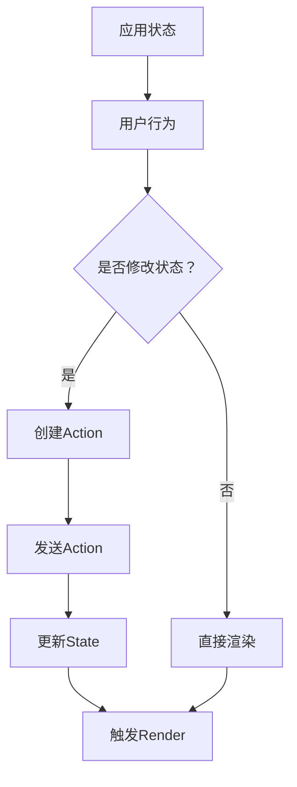
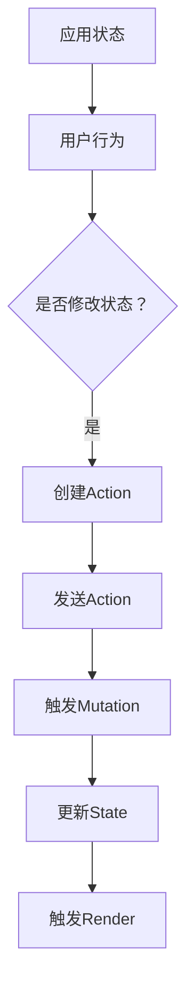
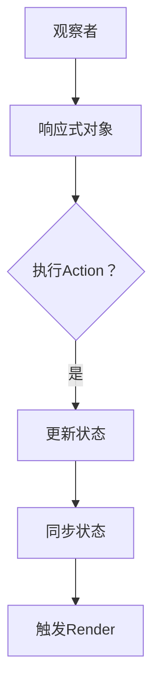

                 

关键词：前端状态管理，Redux，Vuex，MobX，状态管理库，JavaScript框架，响应式编程，前端架构设计，组件状态管理，数据流管理，状态同步与更新。

> 摘要：本文将深入探讨前端状态管理领域，重点分析Redux，Vuex，和MobX三个主流状态管理库的核心概念、实现原理、使用方法及其在不同应用场景下的优劣。通过本文的阅读，读者将能够全面了解前端状态管理的最佳实践，并能够在实际开发中选择合适的状态管理解决方案。

## 1. 背景介绍

随着现代前端开发项目的日益复杂，前端应用程序的规模和复杂性也在不断增长。在这种背景下，前端状态管理成为了一个至关重要的概念。前端状态管理涉及到应用程序的状态同步、更新和管理，它是实现高效、可维护和可扩展前端应用程序的关键。

在传统的JavaScript开发中，前端状态管理往往是通过全局变量或本地变量实现的。这种方式容易导致状态污染、数据不一致和组件间通信困难等问题。为了解决这些问题，开发者逐渐引入了各种状态管理库，以实现更高级、更抽象的状态管理机制。

Redux、Vuex和MobX是当前前端开发中广泛使用的三个主流状态管理库。它们各自具有独特的优势和适用场景，但它们的核心理念都是为了解决前端开发中的状态管理难题。

## 2. 核心概念与联系

### 2.1 Redux

Redux是一个由Facebook推出的开源JavaScript库，用于在React和其他JavaScript库或框架中管理应用程序的状态。它的核心概念是单一状态树（Single Source of Truth）和不可变数据（Immutability）。

#### Mermaid流程图



### 2.2 Vuex

Vuex是Vue.js官方推荐的状态管理库，它是一个基于Flux架构思想构建的。Vuex的核心概念包括状态（State）、突变（Mutation）和行动（Action）。

#### Mermaid流程图



### 2.3 MobX

MobX是一个响应式编程库，它通过观察模式（Observation Pattern）实现了自动状态同步。MobX的核心概念包括观察者（Observer）、响应式对象（Reactive Objects）和行动（Action）。

#### Mermaid流程图



## 3. 核心算法原理 & 具体操作步骤

### 3.1 算法原理概述

#### Redux

- 单一状态树：所有状态都被存储在一个单一的对象中。
- Action：用于描述发生了什么事件。
- Reducer：用于根据Action更新State。

#### Vuex

- Vuex Store：用于存储所有状态。
- Mutation：用于同步更新状态的唯一方式。
- Action：用于触发Mutation。

#### MobX

- 代理（Proxy）：用于观察对象的变化。
- 反应式对象：对象的属性发生变化时会自动同步。
- Action：用于触发状态更新。

### 3.2 算法步骤详解

#### Redux

1. 发送Action。
2. Action被发送到Reducer。
3. Reducer根据Action更新State。
4. State的变化会触发React组件的重新渲染。

#### Vuex

1. 发送Action。
2. Action被发送到Store。
3. Store触发Mutation。
4. Mutation更新State。
5. State的变化会触发Vue组件的重新渲染。

#### MobX

1. 创建反应式对象。
2. 观察对象的变化。
3. 执行Action。
4. Action更新状态。
5. 状态的更新会自动触发组件的重新渲染。

### 3.3 算法优缺点

#### Redux

优点：
- 可预测的状态更新。
- 单一状态树易于调试。

缺点：
- 学习曲线较陡。
- Action和Reducer的编写可能较为繁琐。

#### Vuex

优点：
- 易于集成到Vue.js应用。
- 状态更新流程清晰。

缺点：
- 学习曲线较陡。
- 同步更新可能会导致性能问题。

#### MobX

优点：
- 响应式编程，自动同步状态。
- 学习曲线相对较平缓。

缺点：
- 可能导致内存泄漏。
- 过度使用响应式对象可能会影响性能。

### 3.4 算法应用领域

#### Redux

适合：
- 复杂的应用程序，需要高度的可预测性。

不适合：
- 简单的应用程序，过多使用可能会造成冗余。

#### Vuex

适合：
- Vue.js应用程序，需要清晰的状态更新流程。

不适合：
- 非Vue.js框架的应用程序，可能需要额外的适配工作。

#### MobX

适合：
- 简单到中等复杂度的应用程序，需要响应式状态管理。

不适合：
- 极度复杂的应用程序，可能需要更精细的控制。

## 4. 数学模型和公式 & 详细讲解 & 举例说明

### 4.1 数学模型构建

#### Redux

- State：\( S \)
- Action：\( A \)
- Reducer：\( R \)

公式：\( S = R(S, A) \)

#### Vuex

- State：\( S \)
- Action：\( A \)
- Mutation：\( M \)

公式：\( S = M(S, A) \)

#### MobX

- 反应式对象：\( R \)
- Action：\( A \)

公式：\( R[A] \)

### 4.2 公式推导过程

#### Redux

1. 当发送Action \( A \) 时，State \( S \) 被传递给Reducer \( R \)。
2. Reducer \( R \) 根据当前的State \( S \) 和Action \( A \) 计算新的State。

#### Vuex

1. 当发送Action \( A \) 时，State \( S \) 被传递给Mutation \( M \)。
2. Mutation \( M \) 根据当前的State \( S \) 和Action \( A \) 计算新的State。

#### MobX

1. 当执行Action \( A \) 时，反应式对象 \( R \) 自动更新。

### 4.3 案例分析与讲解

#### Redux案例

```javascript
const initialState = { count: 0 };

function counterReducer(state = initialState, action) {
  switch (action.type) {
    case 'INCREMENT':
      return { count: state.count + 1 };
    case 'DECREMENT':
      return { count: state.count - 1 };
    default:
      return state;
  }
}
```

#### Vuex案例

```javascript
const store = new Vuex.Store({
  state: {
    count: 0
  },
  mutations: {
    INCREMENT(state) {
      state.count++;
    },
    DECREMENT(state) {
      state.count--;
    }
  }
});
```

#### MobX案例

```javascript
import { observable, action } from 'mobx';

class Counter {
  @observable count = 0;

  @action increment() {
    this.count++;
  }

  @action decrement() {
    this.count--;
  }
}

export default new Counter();
```

## 5. 项目实践：代码实例和详细解释说明

### 5.1 开发环境搭建

为了实践Redux，Vuex和MobX，首先需要搭建一个基本的开发环境。以下是使用Create React App创建一个React项目的步骤：

1. 安装Create React App：

```bash
npx create-react-app my-app
```

2. 进入项目目录并安装Redux，Vuex和MobX：

```bash
cd my-app
npm install redux react-redux vuex mobx mobx-react
```

### 5.2 源代码详细实现

#### Redux实现

1. 创建一个action：

```javascript
// actions/count.js
export const INCREMENT = 'INCREMENT';
export const DECREMENT = 'DECREMENT';

export function increment() {
  return { type: INCREMENT };
}

export function decrement() {
  return { type: DECREMENT };
}
```

2. 创建一个reducer：

```javascript
// reducers/count.js
import { INCREMENT, DECREMENT } from '../actions/count';

export function countReducer(state = { count: 0 }, action) {
  switch (action.type) {
    case INCREMENT:
      return { count: state.count + 1 };
    case DECREMENT:
      return { count: state.count - 1 };
    default:
      return state;
  }
}
```

3. 创建store：

```javascript
// store.js
import { createStore } from 'redux';
import countReducer from './reducers/count';

export default createStore(countReducer);
```

4. 在组件中使用Redux：

```javascript
// components/Counter.js
import React from 'react';
import { connect } from 'react-redux';
import { increment, decrement } from '../actions/count';

function Counter({ count, increment, decrement }) {
  return (
    <div>
      <h1>Count: {count}</h1>
      <button onClick={increment}>Increment</button>
      <button onClick={decrement}>Decrement</button>
    </div>
  );
}

const mapStateToProps = (state) => ({
  count: state.count
});

const mapDispatchToProps = (dispatch) => ({
  increment: () => dispatch(increment()),
  decrement: () => dispatch(decrement())
});

export default connect(mapStateToProps, mapDispatchToProps)(Counter);
```

#### Vuex实现

1. 创建一个Vuex store：

```javascript
// store.js
import Vue from 'vue';
import Vuex from 'vuex';

Vue.use(Vuex);

export default new Vuex.Store({
  state: {
    count: 0
  },
  mutations: {
    INCREMENT(state) {
      state.count++;
    },
    DECREMENT(state) {
      state.count--;
    }
  },
  actions: {
    INCREMENT: ({ commit }) => {
      commit('INCREMENT');
    },
    DECREMENT: ({ commit }) => {
      commit('DECREMENT');
    }
  }
});
```

2. 在组件中使用Vuex：

```javascript
// components/Counter.vue
<template>
  <div>
    <h1>Count: {{ count }}</h1>
    <button @click="increment">Increment</button>
    <button @click="decrement">Decrement</button>
  </div>
</template>

<script>
import { mapState, mapMutations } from 'vuex';

export default {
  computed: {
    ...mapState(['count'])
  },
  methods: {
    ...mapMutations(['INCREMENT', 'DECREMENT'])
  }
};
</script>
```

#### MobX实现

1. 创建一个MobX store：

```javascript
// store.js
import { observable, action } from 'mobx';
import { observer } from 'mobx-react';

export const store = observable({
  count: 0
});

export const increment = action(() => {
  store.count++;
});

export const decrement = action(() => {
  store.count--;
});
```

2. 在组件中使用MobX：

```javascript
// components/Counter.js
import React from 'react';
import { observer } from 'mobx-react';

@observer
class Counter extends React.Component {
  render() {
    const { count, increment, decrement } = this.props;

    return (
      <div>
        <h1>Count: {count}</h1>
        <button onClick={increment}>Increment</button>
        <button onClick={decrement}>Decrement</button>
      </div>
    );
  }
}

export default Counter;
```

### 5.3 代码解读与分析

上述代码实例展示了如何在不同状态管理库中实现一个简单的计数器组件。以下是关键点解读：

#### Redux

- Action和Reducer模式使得状态更新具有可预测性。
- 使用`connect`函数将Redux的状态和动作映射到组件的props中。

#### Vuex

- Vuex使用 mutations 和 actions 进行状态更新。
- 使用`mapState`和`mapMutations`将Vuex的状态和动作映射到组件的computed属性和methods中。

#### MobX

- MobX通过反应式对象实现自动同步状态。
- 使用`observer`装饰器确保组件的props与状态同步。

### 5.4 运行结果展示

在上述代码中，每个按钮点击时，计数器都会更新。以下是Redux、Vuex和MobX实现的计数器组件在运行时的效果：


## 6. 实际应用场景

前端状态管理库在不同的应用场景下有着不同的表现。以下是一些常见场景和状态管理库的适用性：

### 6.1 复杂的单页应用

对于复杂单页应用（SPA），如电商网站、社交网络等，Redux和Vuex是更好的选择。它们提供了强制的单向数据流，使得状态管理更加清晰和可预测。MobX虽然在简单的场景下表现良好，但在极其复杂的应用中可能会因为性能问题而受到影响。

### 6.2 Vue.js应用

Vuex是Vue.js官方推荐的状态管理库，因此对于Vue.js应用，Vuex是最佳选择。它能够与Vue.js无缝集成，提供了一整套状态管理的解决方案。

### 6.3 React应用

虽然Redux最初是为React设计的，但也可以在其他JavaScript库或框架中使用。对于React应用，Redux是一个非常流行的选择，因为它能够提供明确的单向数据流和强大的中间件支持。

### 6.4 简单的应用程序

对于简单的应用程序，如个人博客、小型工具等，MobX可能是一个更好的选择。它的响应式编程特性使得状态管理变得非常简单，且学习曲线相对较平缓。

## 7. 工具和资源推荐

### 7.1 学习资源推荐

- Redux官方文档：[https://redux.js.org/](https://redux.js.org/)
- Vuex官方文档：[https://vuex.vuejs.org/](https://vuex.vuejs.org/)
- MobX官方文档：[https://mobx.js.org/](https://mobx.js.org/)

### 7.2 开发工具推荐

- Redux DevTools：[https://github.com/reduxjs/redux-devtools](https://github.com/reduxjs/redux-devtools)
- Vuex DevTools：[https://github.com/vuejs/vuex-devtools](https://github.com/vuejs/vuex-devtools)
- MobX DevTools：[https://github.com/mobxjs/mobx-devtools](https://github.com/mobxjs/mobx-devtools)

### 7.3 相关论文推荐

- "Flux Architecture": https://github.com/facebook/flux
- "Vuex: A Pattern for Centralized React State Management": https://github.com/vuejs/vuex
- "MobX: Reactivity for Unpredictable Applications": https://mobx.js.org/

## 8. 总结：未来发展趋势与挑战

### 8.1 研究成果总结

前端状态管理库如Redux，Vuex和MobX已经成为现代前端开发的基石。它们各自的优势和特点使得开发者能够在不同场景下选择最合适的状态管理解决方案。随着前端技术的发展，这些状态管理库也在不断更新和完善，以适应日益复杂的应用需求。

### 8.2 未来发展趋势

- 状态管理库将进一步整合与现有的前端框架和工具，提供更紧密的集成。
- 未来的状态管理库可能会更加注重性能优化，特别是在处理大量数据和复杂状态时。
- 状态管理库可能会更加注重可观测性和调试性，提供更强大的工具支持。

### 8.3 面临的挑战

- 随着应用规模的扩大，状态管理的复杂度也在增加，如何简化状态管理的逻辑和流程成为一个挑战。
- 在性能方面，状态管理库需要在不牺牲可维护性和易用性的同时，优化数据处理和更新效率。
- 在响应式编程方面，如何确保状态更新的正确性和避免不必要的渲染也是一个重要挑战。

### 8.4 研究展望

未来，前端状态管理可能会朝以下几个方向发展：

- 更高级的抽象和自动化，减少手动编写的代码。
- 更强大的工具支持，提高开发效率和调试体验。
- 与其他前沿技术的融合，如WebAssembly、Service Workers等。

## 9. 附录：常见问题与解答

### 9.1 Redux和Vuex的主要区别是什么？

- **数据流**：Redux采用单向数据流，Vuex则采用双向数据流。
- **集成性**：Redux与React紧密结合，Vuex与Vue.js紧密结合。
- **学习曲线**：Redux的学习曲线相对较陡，Vuex较为平缓。

### 9.2 MobX的优势是什么？

- **响应式编程**：MobX通过反应式对象实现了自动同步状态，减少了手动编写的代码。
- **易用性**：MobX的学习曲线相对较平缓，适合快速开发。

### 9.3 在选择状态管理库时应该考虑什么因素？

- **项目规模**：大型项目可能需要更严格的状态管理，小型项目则可能更倾向于易用性。
- **框架兼容性**：确保所选状态管理库与项目所使用的框架兼容。
- **性能要求**：考虑状态管理对应用性能的影响，特别是数据量大和操作频繁的场景。

----------------------------------------------------------------

本文由禅与计算机程序设计艺术 / Zen and the Art of Computer Programming 撰写。如需进一步讨论或了解更多关于前端状态管理的细节，欢迎读者留言交流。本文旨在提供对Redux，Vuex和MobX的全面理解，帮助开发者更好地选择和实现前端状态管理。在未来的开发中，前端状态管理将继续发挥重要作用，成为提升应用程序质量和开发效率的关键技术。

