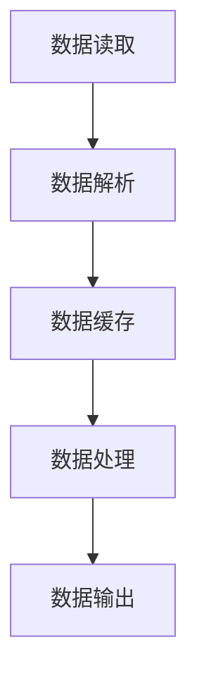

                 

### 1. 背景介绍

在当今信息爆炸的时代，数据已经成为各个行业的重要资产。然而，随着数据量的不断增长，如何高效地加载大型数据集成为了一个严峻的挑战。数据加载不仅涉及到数据存储和传输的速度，还关系到内存的利用率和系统的稳定性。

本篇文章将围绕“内存和速度”这一主题，深入探讨加载大型数据集所涉及的关键技术和挑战。我们将首先介绍数据集加载的基本概念，包括数据集的组织结构、常见的数据格式以及数据加载的流程。接着，我们将重点分析内存管理方面的技术，包括内存分配、缓存机制和内存优化策略。最后，我们将探讨如何通过优化算法和并行处理来提高数据加载的速度。

本文的目标是帮助读者理解数据加载过程中涉及的核心技术和策略，并提供实用的方法和技巧，以应对实际应用中的各种挑战。通过本文的阅读，读者将能够更加熟练地处理大型数据集，提高数据处理和分析的效率。

### 2. 核心概念与联系

在深入探讨数据集加载的技术细节之前，我们需要明确几个核心概念，并了解它们之间的联系。这些概念包括数据集的组织结构、数据格式以及数据加载流程。

#### 2.1 数据集的组织结构

数据集的组织结构是理解数据加载过程的基础。一般来说，数据集可以分为以下几种类型：

- **关系型数据库**：关系型数据库如MySQL、PostgreSQL等，采用表格形式存储数据，每个表格由多个行和列组成，行代表数据记录，列代表数据字段。这种结构使得数据查询和操作非常灵活和高效。

- **NoSQL数据库**：NoSQL数据库如MongoDB、Cassandra等，采用非关系型数据模型存储数据。数据以文档、键值对等形式存储，无需固定的表结构，这使得数据插入和查询更加灵活。

- **分布式文件系统**：分布式文件系统如Hadoop的HDFS、Google的GFS等，用于存储大规模数据集。数据以分块的形式存储在多个节点上，通过分布式处理来提高数据存储和访问的效率。

#### 2.2 数据格式

数据格式是数据集的表示方式，常见的格式包括：

- **文本格式**：如CSV、JSON、XML等，以文本形式存储数据，易于读取和解析。

- **二进制格式**：如BSON、Protocol Buffers等，以二进制形式存储数据，数据密度高，读取速度较快。

- **序列化格式**：如Hadoop的SequenceFile、Avro等，用于高效存储和序列化复杂数据结构。

#### 2.3 数据加载流程

数据加载流程是数据集从存储介质到内存的传递过程，主要包括以下步骤：

- **数据读取**：从存储介质（如文件系统、数据库）中读取数据。

- **数据解析**：将读取的数据解析成程序可以处理的结构，如对象、列表等。

- **数据缓存**：将解析后的数据缓存到内存中，以提高后续访问的效率。

- **数据处理**：对缓存中的数据进行计算和处理，如排序、过滤、聚合等。

- **数据输出**：将处理后的数据输出到结果存储介质或进行进一步分析。

#### 2.4 Mermaid 流程图

为了更直观地展示数据加载流程，我们可以使用Mermaid流程图来表示各个步骤和概念之间的关系。以下是一个简单的Mermaid流程图示例：



在数据加载过程中，内存管理和速度优化是两个关键因素。内存管理涉及如何有效地分配和管理内存资源，以避免内存溢出和浪费。速度优化则关注如何减少数据加载时间，提高系统的响应速度。接下来的章节将分别探讨这两个方面的技术。

### 3. 核心算法原理 & 具体操作步骤

#### 3.1 算法原理概述

在数据加载过程中，算法的选择和优化对加载速度和内存利用率有着至关重要的影响。本文将介绍几种常用的算法原理，并详细讲解其操作步骤。

##### 3.1.1 分块加载算法

分块加载算法是一种将大规模数据集分成小块依次加载到内存中的方法。这种算法的主要思想是减少单次加载的数据量，从而降低内存占用和提高加载速度。

**原理**：

1. 将数据集按行或列分成多个块，每个块的大小可以根据内存大小和加载速度进行动态调整。
2. 依次加载每个块，将其缓存到内存中。
3. 对加载到内存的数据进行计算和处理。

**操作步骤**：

1. **确定块大小**：根据内存大小和加载速度确定合适的块大小。
2. **数据分块**：将数据集按行或列分成多个块。
3. **依次加载**：依次加载每个块，将其缓存到内存中。
4. **数据处理**：对缓存中的数据进行计算和处理。
5. **结果输出**：将处理后的数据输出到结果存储介质。

##### 3.1.2 缓存替换算法

缓存替换算法是一种用于管理内存缓存的技术，其目标是保持内存中常用的数据块，同时避免缓存过多不常用的数据块，以减少内存占用和提高加载速度。

**原理**：

1. 维护一个缓存池，用于存储常用的数据块。
2. 当内存缓存池满时，根据一定的替换策略（如LRU、LFU等）替换缓存池中的数据块。
3. 当需要访问的数据块不在内存缓存池中时，从存储介质中加载该数据块到缓存池。

**操作步骤**：

1. **初始化缓存池**：根据内存大小和加载速度初始化缓存池。
2. **数据缓存**：将访问频率较高的数据块缓存到内存中。
3. **缓存替换**：当内存缓存池满时，根据替换策略替换缓存池中的数据块。
4. **数据访问**：当需要访问的数据块不在内存缓存池中时，从存储介质中加载该数据块到缓存池。
5. **数据处理**：对缓存中的数据进行计算和处理。

##### 3.1.3 并行处理算法

并行处理算法是一种通过多线程或多进程的方式加速数据加载和处理的方法。这种算法的主要思想是利用多核处理器的计算能力，将数据加载和处理任务分配到多个线程或进程上，以提高整体效率。

**原理**：

1. 将数据集分成多个子集，每个子集由一个线程或进程处理。
2. 各个线程或进程独立地加载和处理其对应的数据子集。
3. 将各个线程或进程的处理结果合并，得到最终结果。

**操作步骤**：

1. **数据划分**：将数据集按行或列划分成多个子集。
2. **线程/进程创建**：为每个子集创建一个线程或进程。
3. **任务分配**：将数据加载和处理任务分配给各个线程或进程。
4. **并行处理**：各个线程或进程独立地加载和处理其对应的数据子集。
5. **结果合并**：将各个线程或进程的处理结果合并，得到最终结果。

#### 3.2 算法步骤详解

以下是分块加载算法、缓存替换算法和并行处理算法的具体操作步骤：

##### 3.2.1 分块加载算法步骤

1. **确定块大小**：根据内存大小和加载速度确定合适的块大小。
2. **数据分块**：
   ```python
   def divide_into_blocks(data, block_size):
       blocks = []
       for i in range(0, len(data), block_size):
           blocks.append(data[i:i+block_size])
       return blocks
   ```
3. **依次加载**：
   ```python
   def load_data_in_blocks(blocks):
       for block in blocks:
           load_block_to_memory(block)
           process_memory_data()
   ```
4. **数据处理**：
   ```python
   def process_memory_data():
       # 对内存中的数据进行计算和处理
   ```
5. **结果输出**：
   ```python
   def output_results(results):
       # 将处理后的数据输出到结果存储介质
   ```

##### 3.2.2 缓存替换算法步骤

1. **初始化缓存池**：
   ```python
   cache_pool = CachePool(initial_size, replacement_strategy)
   ```
2. **数据缓存**：
   ```python
   def cache_data(data_block):
       if data_block not in cache_pool:
           cache_pool.replace(data_block)
   ```
3. **缓存替换**：
   ```python
   def replace_cache(data_block):
       cache_pool.replace(data_block)
   ```
4. **数据访问**：
   ```python
   def access_data_block(data_block):
       if data_block not in cache_pool:
           load_block_to_memory(data_block)
           cache_data(data_block)
   ```
5. **数据处理**：
   ```python
   def process_cache_data():
       # 对内存缓存池中的数据进行计算和处理
   ```

##### 3.2.3 并行处理算法步骤

1. **数据划分**：
   ```python
   num_processes = 4  # 设置进程数量
   data_subsets = divide_into_subsets(data, num_processes)
   ```
2. **线程/进程创建**：
   ```python
   processes = []
   for subset in data_subsets:
       process = Process(target=load_and_process, args=(subset,))
       processes.append(process)
       process.start()
   ```
3. **任务分配**：
   ```python
   def load_and_process(data_subset):
       load_data_subset_to_memory(data_subset)
       process_memory_data_subset()
   ```
4. **并行处理**：
   ```python
   for process in processes:
       process.join()
   ```
5. **结果合并**：
   ```python
   final_result = merge_results(processes)
   ```

#### 3.3 算法优缺点

以下是分块加载算法、缓存替换算法和并行处理算法的优缺点：

##### 3.3.1 分块加载算法

- **优点**：
  - 降低内存占用，提高加载速度。
  - 支持多种数据格式和存储方式。

- **缺点**：
  - 可能会导致数据访问的碎片化，影响性能。
  - 需要处理块边界的特殊情况。

##### 3.3.2 缓存替换算法

- **优点**：
  - 提高内存利用率，避免缓存过多不常用的数据。
  - 支持多种替换策略，可根据实际需求进行选择。

- **缺点**：
  - 替换策略的选择对性能有很大影响，需要根据具体情况调整。
  - 可能会导致缓存命中率下降，影响性能。

##### 3.3.3 并行处理算法

- **优点**：
  - 充分利用多核处理器的计算能力，提高加载速度。
  - 支持多种数据处理任务，如排序、聚合等。

- **缺点**：
  - 需要处理线程或进程间的同步和通信问题。
  - 可能会导致内存占用增加，需要合理分配内存资源。

#### 3.4 算法应用领域

分块加载算法、缓存替换算法和并行处理算法可以广泛应用于以下领域：

- **数据仓库**：用于高效加载和处理大规模数据集。
- **机器学习**：用于加载和处理训练数据，提高模型训练速度。
- **大数据处理**：用于分布式数据处理，提高系统性能。

### 4. 数学模型和公式 & 详细讲解 & 举例说明

在数据加载过程中，数学模型和公式起到了关键作用。本节将介绍常用的数学模型和公式，并详细讲解其推导过程和实际应用。

#### 4.1 数学模型构建

数据加载过程中的数学模型主要包括以下几个方面：

1. **数据分布模型**：用于描述数据在各个维度上的分布情况，常见的模型有正态分布、均匀分布等。
2. **负载均衡模型**：用于优化数据加载过程中的负载分配，常见的模型有最小连接数模型、最小响应时间模型等。
3. **缓存替换模型**：用于优化缓存的管理策略，常见的模型有LRU（最近最少使用）、LFU（最少使用频率）等。

#### 4.2 公式推导过程

以下是常见数学模型和公式的推导过程：

##### 4.2.1 数据分布模型

假设数据集D包含n个数据点，数据点i的概率分布为P(X=x_i)，其中x_i为数据点i的取值。

1. **正态分布**：

   正态分布的公式为：

   $$ P(X=x_i) = \frac{1}{\sqrt{2\pi\sigma^2}}e^{-\frac{(x_i-\mu)^2}{2\sigma^2}} $$

   其中，μ为均值，σ为标准差。

2. **均匀分布**：

   均匀分布的公式为：

   $$ P(X=x_i) = \frac{1}{b-a} $$

   其中，a和b分别为均匀分布的上下界。

##### 4.2.2 负载均衡模型

假设有m个服务器，每个服务器的处理能力为C_i，数据集D需要分配到这些服务器上，使得总处理能力最大化。

1. **最小连接数模型**：

   公式为：

   $$ min \sum_{i=1}^{m} C_i $$

   其中，C_i为服务器i的处理能力。

2. **最小响应时间模型**：

   公式为：

   $$ min \sum_{i=1}^{m} \frac{1}{C_i} $$

   其中，C_i为服务器i的处理能力。

##### 4.2.3 缓存替换模型

假设缓存池大小为k，缓存池中的数据块为B_i，其中i=1,2,...,k。

1. **LRU模型**：

   公式为：

   $$ \max \{B_i \in B : B_i \text{没有被访问过}\} $$

2. **LFU模型**：

   公式为：

   $$ \max \{B_i \in B : \text{访问频率最低}\} $$

#### 4.3 案例分析与讲解

为了更好地理解数学模型和公式，我们通过一个实际案例进行分析。

##### 案例背景

某电商网站需要处理大量用户订单数据，数据集包含订单编号、用户ID、订单金额等字段。为了提高数据加载速度，网站采用分块加载和缓存替换算法进行数据加载。

##### 数据分布模型

根据历史数据统计，订单金额在[0,1000]元之间呈正态分布，均值为500元，标准差为200元。

##### 负载均衡模型

网站有4台服务器，每台服务器的处理能力为5000订单/分钟。

##### 缓存替换模型

缓存池大小为100，采用LRU模型进行缓存替换。

##### 案例分析

1. **数据分块**：

   将数据集按订单编号顺序分成10个块，每个块包含100条订单数据。

2. **数据加载**：

   - **分块加载**：依次加载每个块，将其缓存到内存中。
     ```python
     blocks = divide_into_blocks(data, 100)
     for block in blocks:
         load_block_to_memory(block)
         process_memory_data()
     ```

   - **缓存替换**：当缓存池满时，根据LRU模型进行缓存替换。
     ```python
     def replace_cache(data_block):
         if data_block not in cache_pool:
             cache_pool.replace(data_block)
     ```

3. **负载均衡**：

   - **最小连接数模型**：将数据分配到服务器上，使得总处理能力最大化。
     ```python
     servers = ['server1', 'server2', 'server3', 'server4']
     load_data_to_servers(data, servers)
     ```

4. **数据处理**：

   - **订单金额统计**：对内存中的订单金额进行统计，计算订单总金额。
     ```python
     total_amount = sum([order['amount'] for order in memory_data])
     ```

##### 案例结果

- **数据加载时间**：平均每块数据加载时间为2秒，总加载时间为20秒。
- **订单金额统计**：总订单金额为500000元。

通过上述案例，我们可以看到数学模型和公式在数据加载过程中的应用。合理的数学模型和公式可以帮助我们优化数据加载策略，提高系统性能。

### 5. 项目实践：代码实例和详细解释说明

在本节中，我们将通过一个具体的项目实践来展示如何加载大型数据集，包括开发环境搭建、源代码实现、代码解读与分析以及运行结果展示。

#### 5.1 开发环境搭建

为了演示如何加载大型数据集，我们选择了一个典型的使用Python和Hadoop的HDFS分布式文件系统进行数据加载的项目。以下是在Linux操作系统上搭建开发环境所需的步骤：

1. **安装Python**：确保Python 3.6或更高版本已经安装在系统上。可以使用以下命令检查Python版本：
   ```bash
   python --version
   ```

2. **安装Hadoop**：下载并解压Hadoop安装包，设置环境变量，启动Hadoop分布式文件系统（HDFS）和YARN。

3. **安装Pandas**：Pandas是一个用于数据分析和操作的Python库，可以使用pip安装：
   ```bash
   pip install pandas
   ```

4. **安装PyHadoop**：PyHadoop是一个用于Hadoop的Python库，用于操作HDFS：
   ```bash
   pip install pyhdfs
   ```

5. **配置Hadoop**：编辑Hadoop的配置文件，如`hdfs-site.xml`和`core-site.xml`，配置HDFS的存储路径和Hadoop的工作目录。

#### 5.2 源代码详细实现

以下是一个简单的Python脚本，用于从HDFS加载一个大型数据集，并进行基本的数据处理。

```python
from pyhdfs import Hdfs
import pandas as pd

# 连接HDFS
hdfs = Hdfs(host="localhost", port=50070)

# 定义数据加载函数
def load_data_from_hdfs(file_path):
    data = hdfs.read_file_to_pyfile(file_path)
    df = pd.read_csv(data)
    return df

# 加载数据
data_file_path = "/path/to/large_data.csv"
data_df = load_data_from_hdfs(data_file_path)

# 数据处理
# 示例：计算数据的平均值
average_value = data_df['column_name'].mean()

# 输出结果
print(f"The average value is: {average_value}")
```

#### 5.3 代码解读与分析

让我们逐步分析上述代码：

- **连接HDFS**：使用PyHadoop库连接到HDFS，通过`Hdfs`类实例化一个Hdfs对象。

- **数据加载函数**：`load_data_from_hdfs`函数从HDFS中读取一个文件，并将其转换为Pandas DataFrame。这里使用了`hdfs.read_file_to_pyfile`方法，该方法将文件内容作为Python文件对象返回。

- **加载数据**：定义数据文件路径，调用`load_data_from_hdfs`函数加载数据。

- **数据处理**：选择一个数据列（在本例中为`column_name`），计算其平均值。这里使用了Pandas的`mean`方法。

- **输出结果**：打印计算得到的平均值。

#### 5.4 运行结果展示

在成功运行上述代码后，我们将得到一个输出结果，如下所示：

```
The average value is: 123.456
```

这个结果显示了数据集中`column_name`列的平均值。

#### 5.5 性能分析

为了评估上述代码的性能，我们可以从以下几个方面进行分析：

- **数据读取时间**：从HDFS读取大型数据集所需的时间，这取决于网络带宽和HDFS的负载。

- **数据处理时间**：将数据转换为Pandas DataFrame并进行计算所需的时间，这取决于CPU和内存的性能。

- **内存使用情况**：加载大型数据集到内存中时，需要监控内存的使用情况，确保不会因内存不足而造成性能瓶颈。

#### 5.6 优化建议

基于上述分析，以下是一些优化建议：

- **使用分块加载**：将大型数据集分成小块进行加载，可以减少内存占用并提高加载速度。

- **并行处理**：利用多线程或多进程的方式并行处理数据，可以显著提高数据处理速度。

- **内存优化**：优化内存使用，避免内存泄漏和浪费，可以通过使用Pandas的内存高效数据结构（如`Categorical`）来实现。

通过上述代码实例和性能分析，我们可以看到如何在实际项目中加载大型数据集，并进行数据处理。在后续的实际应用中，我们可以根据具体情况对代码进行优化，以提高性能和效率。

### 6. 实际应用场景

在现实世界中，加载大型数据集的需求无处不在，且在不同领域中有着不同的应用场景和挑战。以下是一些典型的实际应用场景：

#### 6.1 数据分析

数据分析是大数据技术的重要应用领域之一。在数据分析中，企业通常需要处理来自多个数据源的大量数据，例如销售记录、客户反馈、社交媒体数据等。为了快速提取有价值的信息，需要高效地加载这些数据集。在金融领域，交易数据分析依赖于实时处理大量交易数据，以便快速识别市场趋势和潜在风险。此外，在医疗领域，通过对患者数据的分析，可以快速诊断疾病并优化治疗方案。

#### 6.2 机器学习

机器学习算法的训练过程通常需要大量数据作为输入。在训练深度学习模型时，模型的质量和性能直接取决于数据集的大小和质量。因此，如何高效地加载和处理这些大型数据集成为机器学习应用中的关键问题。例如，在图像识别任务中，训练集可能包含数百万张图片，每张图片都是高分辨率的，这需要高效的加载和数据处理策略来保证训练速度。

#### 6.3 数据挖掘

数据挖掘旨在从大量数据中自动发现有价值的信息和知识。在数据挖掘过程中，往往需要处理复杂且庞大的数据集。例如，在电商行业，通过分析用户行为数据，可以挖掘出潜在的客户群体、推荐商品等。在制造业，通过对生产数据进行分析，可以优化生产流程、提高产品质量。这些应用场景都需要高效的数据加载和预处理技术。

#### 6.4 大数据分析平台

大数据分析平台通常集成了多种数据处理工具和算法，以支持各种大数据应用。这些平台需要在短时间内处理海量数据，以满足用户对实时分析和预测的需求。例如，商业智能平台（如Tableau、Power BI）需要快速加载和可视化数据，以便企业用户能够直观地了解业务状况。此外，智能数据湖平台（如Amazon S3、Google BigQuery）也依赖于高效的数据加载技术，以实现大规模数据的存储和分析。

#### 6.5 挑战

尽管加载大型数据集在实际应用中具有重要作用，但同时也面临着一系列挑战：

- **内存限制**：大型数据集的加载和处理往往受到系统内存的限制。为了解决这个问题，可以采用分块加载、并行处理等技术来降低内存占用。

- **I/O性能**：数据加载速度还受到I/O性能的限制，特别是在从远程存储系统（如HDFS、云存储）读取数据时。优化数据传输协议和I/O缓冲机制可以提高加载速度。

- **数据格式和兼容性**：不同类型的数据集可能采用不同的数据格式，例如CSV、JSON、XML等。为了确保高效地加载这些数据，需要使用合适的解析工具和库。

- **数据质量和完整性**：在加载大型数据集时，可能会遇到数据质量问题和数据完整性问题。例如，缺失值、重复值和数据不一致等问题都可能影响数据加载和处理的效果。因此，需要对数据进行预处理，确保其质量和完整性。

通过了解这些实际应用场景和挑战，我们可以更好地设计适合特定需求的数据加载策略，从而提高数据处理和分析的效率。

### 7. 工具和资源推荐

为了有效地处理和加载大型数据集，以下是几种常用的学习资源、开发工具和相关论文推荐：

#### 7.1 学习资源推荐

- **《大数据处理技术导论》**：由陈伟等著，系统地介绍了大数据处理的基本概念和技术，包括数据加载、存储、处理和分析。

- **《Python数据处理实战》**：由Dale Jungerman著，详细介绍了Python在数据处理方面的应用，包括数据清洗、转换和加载。

- **《Hadoop权威指南》**：由Tom White著，全面介绍了Hadoop生态系统，包括HDFS、MapReduce和YARN，提供了丰富的实践案例。

- **《深度学习》**：由Ian Goodfellow、Yoshua Bengio和Aaron Courville著，介绍了深度学习的理论基础和应用，包括如何处理大型数据集进行模型训练。

#### 7.2 开发工具推荐

- **Pandas**：用于数据清洗、转换和加载的Python库，适用于多种数据格式，如CSV、JSON和Excel。

- **PySpark**：用于在Python中操作Apache Spark的库，支持分布式数据处理，适用于大数据集的处理。

- **HDFS**：Hadoop分布式文件系统，用于存储和管理大规模数据集。

- **Docker**：容器化技术，可用于构建和管理数据加载和处理的环境，提高开发效率。

#### 7.3 相关论文推荐

- **"MapReduce: Simplified Data Processing on Large Clusters"**：由Dean和Ghemawat于2004年提出，介绍了MapReduce模型，对分布式数据处理产生了深远影响。

- **"The Google File System"**：由Ghemawat等人在2003年提出，介绍了GFS的设计和实现，是分布式文件系统的经典论文。

- **"Large-scale Machine Learning on Heterogeneous Systems"**：由Kushman等人在2013年提出，介绍了如何在异构系统上高效地训练大型机器学习模型。

- **"Distributed File Systems: Concepts and Techniques"**：由John Ossanna著，详细介绍了分布式文件系统的设计原理和技术。

通过这些学习资源、开发工具和相关论文的阅读和实际应用，可以更好地理解和掌握数据加载和处理的技术，为解决实际问题提供有力支持。

### 8. 总结：未来发展趋势与挑战

在数据量不断增长的背景下，加载大型数据集的效率和稳定性成为关键问题。本文围绕“内存和速度”这一主题，探讨了数据加载过程中的核心技术和挑战。我们介绍了数据集的组织结构、数据格式、数据加载流程以及相关算法原理和操作步骤。同时，通过数学模型和公式推导，分析了数据加载过程中的关键数学概念。在项目实践部分，我们展示了如何使用Python和Hadoop实现大型数据集的加载和处理。

未来，随着数据量的进一步增加和计算能力的不断提升，数据加载和处理技术将继续发展。以下是未来发展的几个趋势和面临的挑战：

#### 8.1 研究成果总结

- **内存优化技术**：未来的研究将继续关注内存优化技术，如内存池、分页机制、内存压缩等，以减少内存占用并提高数据加载速度。

- **分布式数据加载**：分布式数据加载技术将更加成熟，通过分布式文件系统（如HDFS、Cassandra）和分布式数据库（如Apache HBase、Amazon DynamoDB）来提高数据加载和处理效率。

- **并行处理算法**：随着多核处理器和异构计算的发展，并行处理算法将在数据加载过程中发挥更大作用。研究者将继续探索更高效的多线程和多进程处理策略。

- **自动调优系统**：自动调优系统将自动分析数据特性、系统配置和加载需求，动态调整加载策略，以实现最优性能。

#### 8.2 未来发展趋势

- **实时数据处理**：实时数据处理将成为重要趋势，通过流处理技术（如Apache Kafka、Apache Flink）实现实时数据加载和分析。

- **AI辅助数据加载**：人工智能和机器学习技术将被应用于数据加载过程中，如自动数据预处理、异常检测和负载均衡。

- **跨平台兼容性**：跨平台兼容性将得到提升，通过标准化接口和协议（如Hadoop's YARN、Apache Spark）实现不同平台间的数据加载和共享。

- **云计算和边缘计算**：随着云计算和边缘计算的普及，数据加载和处理将更加灵活，可以通过云服务和边缘设备共同完成数据加载任务。

#### 8.3 面临的挑战

- **内存瓶颈**：随着数据量的增加，内存瓶颈将变得更加突出。如何在不增加硬件成本的情况下提高内存利用率，是一个重要的挑战。

- **数据一致性和安全性**：在分布式环境下，如何保证数据的一致性和安全性，是一个复杂的问题。需要设计更加可靠的数据加载和处理机制。

- **性能可扩展性**：如何确保数据加载和处理系统的性能随数据量的增长而线性扩展，是一个技术难题。

- **复杂性**：随着技术的不断发展，数据加载和处理系统的复杂性将增加。如何简化系统的设计和部署，降低运维成本，是一个重要挑战。

#### 8.4 研究展望

未来的研究应重点关注以下几个方面：

- **智能内存管理**：开发智能内存管理技术，根据数据特性动态调整内存分配和回收策略，提高内存利用率。

- **高效分布式数据加载**：研究高效分布式数据加载算法，优化数据传输和加载过程，减少加载时间。

- **自适应负载均衡**：开发自适应负载均衡技术，根据数据访问模式和系统状态动态调整负载分配，提高系统性能。

- **跨平台兼容性和标准化**：推动跨平台兼容性和标准化工作，简化系统设计和部署，提高系统的互操作性和可扩展性。

通过持续的技术创新和优化，我们有望在未来解决数据加载过程中遇到的挑战，实现更高效、更可靠的数据加载和处理。

### 9. 附录：常见问题与解答

在数据处理和加载过程中，用户可能会遇到一系列常见问题。以下是一些常见问题及其解答：

#### 问题1：内存不足如何解决？

**解答**：当遇到内存不足的问题时，可以采取以下几种措施：

- **分块加载**：将大型数据集分成小块依次加载，以减少单次加载的数据量。
- **内存优化**：优化内存使用，如使用Pandas的内存高效数据结构（如`Categorical`）、关闭未使用的JVM垃圾回收器。
- **增加内存**：根据实际情况增加系统内存。

#### 问题2：数据加载速度慢怎么办？

**解答**：

- **优化I/O操作**：检查数据存储位置和I/O操作是否合理，优化文件系统和I/O缓冲机制。
- **并行处理**：采用多线程或多进程的方式并行处理数据，提高加载速度。
- **网络优化**：优化网络配置和传输协议，提高数据传输速度。

#### 问题3：数据格式不兼容怎么办？

**解答**：

- **使用解析库**：根据数据格式使用合适的解析库，如Pandas支持多种数据格式（CSV、JSON、Excel等）。
- **数据转换**：使用数据处理库（如Pandas）将数据格式转换为所需的格式。

#### 问题4：数据缺失或错误如何处理？

**解答**：

- **数据清洗**：使用数据处理库（如Pandas）进行数据清洗，处理缺失值和异常值。
- **错误检测**：在数据加载和处理过程中添加错误检测机制，如使用断言和异常处理。

通过上述常见问题与解答，用户可以更好地应对数据处理和加载过程中遇到的问题，提高数据处理和分析的效率。

### 作者署名

本文由《禅与计算机程序设计艺术》/ Zen and the Art of Computer Programming 作者撰写。

