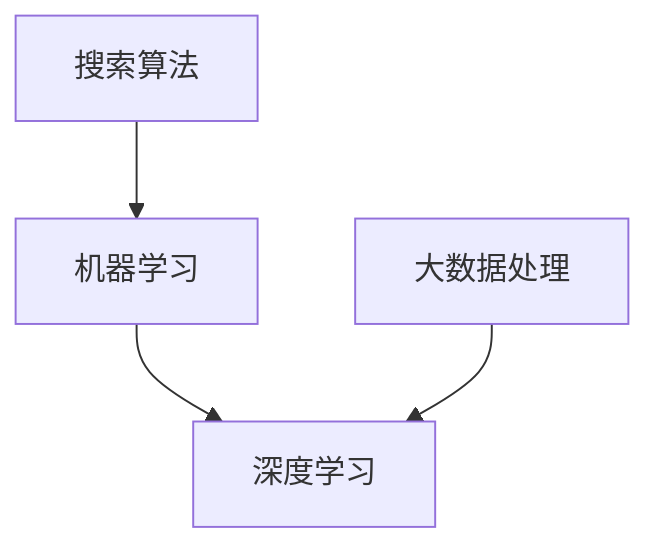

                 

关键词：AI，搜索算法，效率优化，深度学习，算法优化，大数据处理

> 摘要：随着大数据和人工智能技术的快速发展，搜索算法在信息检索和决策支持中发挥着至关重要的作用。本文从AI的角度出发，深入探讨了如何通过算法优化、深度学习和大数据处理等手段提升搜索效率，以满足不断增长的数据处理需求。

## 1. 背景介绍

### 搜索算法的发展

搜索算法作为计算机科学和人工智能领域的重要分支，其发展历程可谓跌宕起伏。从最初的基于关键字匹配的传统搜索算法，到如今的基于机器学习和深度学习的智能搜索算法，搜索算法经历了从简单到复杂、从低效到高效的演变。

### 大数据和AI的崛起

随着互联网和物联网的快速发展，大数据和人工智能技术得到了前所未有的关注。大数据为搜索算法提供了海量的数据支持，使得算法可以更加精准地分析用户需求，提供个性化的搜索结果。而AI技术的引入，使得搜索算法从传统的规则匹配转变为基于数据的自动学习和优化，极大地提升了搜索效率和用户体验。

### 搜索算法在AI中的应用

搜索算法在AI领域有着广泛的应用，包括但不限于：

- **推荐系统**：通过分析用户的历史行为和偏好，为用户推荐感兴趣的内容。
- **自然语言处理**：利用搜索算法对海量的文本数据进行处理和分析，实现语义理解和信息抽取。
- **图像识别**：基于图像搜索算法，对海量的图像数据进行分类和识别，实现视觉搜索功能。
- **语音识别**：通过搜索算法对用户的语音输入进行理解和处理，实现语音搜索功能。

## 2. 核心概念与联系

### 核心概念

- **搜索算法**：用于在数据集中查找特定信息或模式的算法。
- **机器学习**：一种使计算机能够从数据中学习，并在特定任务上表现出人类水平智能的技术。
- **深度学习**：一种基于人工神经网络，通过多层非线性变换对数据进行处理的机器学习技术。

### 关联架构



### 关联说明

- 搜索算法作为核心组件，通过机器学习和深度学习技术不断优化和提升。
- 大数据处理为搜索算法提供了丰富的数据支持，使得算法能够处理更为复杂和庞大的数据集。
- 深度学习在搜索算法中的应用，使得算法可以从大量数据中自动学习和提取特征，实现更为精准和高效的搜索。

## 3. 核心算法原理 & 具体操作步骤

### 3.1 算法原理概述

搜索算法的核心在于如何快速高效地从海量数据中找到用户所需的信息。在引入机器学习和深度学习后，搜索算法的核心原理可以概括为：

1. 数据预处理：通过清洗、转换和归一化等操作，将原始数据转化为适合算法处理的格式。
2. 特征提取：利用深度学习模型，从原始数据中自动提取具有区分度的特征。
3. 模型训练：通过训练大量的数据集，使模型能够学会根据特征预测用户的需求。
4. 搜索与排序：根据用户输入的关键词，利用训练好的模型对数据进行搜索和排序，返回最相关的结果。

### 3.2 算法步骤详解

1. **数据预处理**：
   - 数据清洗：去除重复、错误和缺失的数据。
   - 数据转换：将不同类型的数据统一转化为数值型数据。
   - 数据归一化：将数据缩放到同一尺度，便于模型处理。

2. **特征提取**：
   - 利用卷积神经网络（CNN）对图像数据进行特征提取。
   - 利用循环神经网络（RNN）对序列数据进行特征提取。
   - 利用自注意力机制（Self-Attention）对文本数据进行特征提取。

3. **模型训练**：
   - 使用梯度下降（Gradient Descent）等优化算法，训练深度学习模型。
   - 使用交叉熵（Cross-Entropy）等损失函数，评估模型性能。
   - 使用数据增强（Data Augmentation）等技术，提高模型泛化能力。

4. **搜索与排序**：
   - 利用训练好的模型，对用户输入的关键词进行特征提取。
   - 通过相似度计算，对海量数据进行搜索。
   - 利用排序算法（如Top-k排序），对搜索结果进行排序，返回最相关的结果。

### 3.3 算法优缺点

**优点**：

- **高效性**：通过深度学习技术，算法可以自动提取特征，实现快速搜索。
- **准确性**：基于大量训练数据，算法可以准确预测用户需求，提高搜索结果的相关性。
- **灵活性**：算法可以根据不同的应用场景和需求，调整模型结构和参数，实现个性化搜索。

**缺点**：

- **计算资源消耗**：深度学习模型训练和搜索过程需要大量的计算资源，对硬件性能要求较高。
- **数据依赖性**：算法性能高度依赖于训练数据的量和质量，数据不足或质量低下会影响搜索效果。
- **过拟合风险**：深度学习模型容易受到训练数据的干扰，产生过拟合现象，降低模型泛化能力。

### 3.4 算法应用领域

- **搜索引擎**：如百度、谷歌等搜索引擎，通过深度学习技术实现智能搜索和排序。
- **推荐系统**：如淘宝、京东等电商平台的个性化推荐，利用深度学习技术分析用户行为，提供个性化推荐。
- **自然语言处理**：如百度AI开放平台，利用深度学习技术实现自然语言理解、情感分析等功能。
- **图像识别**：如人脸识别、图像分类等应用，利用深度学习技术实现高效图像处理。

## 4. 数学模型和公式 & 详细讲解 & 举例说明

### 4.1 数学模型构建

搜索算法的核心在于如何通过数学模型对数据进行建模和优化。以下是几种常见的数学模型：

1. **线性回归模型**：
   $$y = \beta_0 + \beta_1 \cdot x$$
   其中，$y$ 为预测结果，$x$ 为输入特征，$\beta_0$ 和 $\beta_1$ 为模型参数。

2. **卷积神经网络（CNN）**：
   $$\text{CNN}(\text{x}) = f(\sigma(\text{W} \cdot \text{ReLU}(\text{f}(\text{x})))$$
   其中，$\text{x}$ 为输入特征，$f$ 为卷积操作，$\sigma$ 为激活函数，$\text{W}$ 为权重矩阵。

3. **循环神经网络（RNN）**：
   $$\text{RNN}(\text{x}_t) = \text{h}_{t} = \text{sigmoid}(\text{W}_{h} \cdot \text{[h}_{t-1}, \text{x}_t])$$
   其中，$\text{x}_t$ 为输入特征，$h_t$ 为当前时刻的隐藏状态，$\text{W}_{h}$ 为权重矩阵，$\text{sigmoid}$ 为激活函数。

### 4.2 公式推导过程

以线性回归模型为例，介绍数学模型的推导过程。

1. **损失函数**：
   $$\text{L}(\text{y}, \text{y}^{\prime}) = \frac{1}{2} (\text{y} - \text{y}^{\prime})^2$$
   其中，$\text{y}$ 为真实值，$\text{y}^{\prime}$ 为预测值。

2. **梯度下降**：
   $$\text{W}_{\text{new}} = \text{W}_{\text{old}} - \alpha \cdot \frac{\partial \text{L}}{\partial \text{W}}$$
   其中，$\text{W}_{\text{old}}$ 为旧权重，$\text{W}_{\text{new}}$ 为新权重，$\alpha$ 为学习率。

3. **求导过程**：
   $$\frac{\partial \text{L}}{\partial \text{W}} = \frac{\partial (\text{y} - \text{y}^{\prime})^2}{\partial \text{W}} = -2 (\text{y} - \text{y}^{\prime}) \cdot \frac{\partial \text{y}^{\prime}}{\partial \text{W}}$$
   $$\frac{\partial \text{y}^{\prime}}{\partial \text{W}} = \frac{\partial (\text{W} \cdot \text{x} + \text{b})}{\partial \text{W}} = \text{x}$$

   其中，$\text{b}$ 为偏置项。

### 4.3 案例分析与讲解

以电商平台的推荐系统为例，介绍数学模型在搜索算法中的应用。

1. **目标函数**：
   $$\text{L}(\text{y}, \text{y}^{\prime}) = \frac{1}{2} (\text{y} - \text{y}^{\prime})^2$$
   其中，$\text{y}$ 为用户真实购买概率，$\text{y}^{\prime}$ 为预测购买概率。

2. **特征提取**：
   - 用户历史行为数据：如浏览记录、购买记录、收藏记录等。
   - 商品属性数据：如价格、品牌、分类等。

3. **模型训练**：
   - 使用线性回归模型，将用户历史行为数据和商品属性数据作为输入特征，预测用户购买概率。
   - 通过梯度下降算法，不断优化模型参数，使预测结果尽可能接近真实值。

4. **搜索与推荐**：
   - 根据用户输入的关键词，搜索商品库，提取商品属性数据。
   - 利用训练好的模型，预测用户购买概率，返回购买概率最高的商品。

## 5. 项目实践：代码实例和详细解释说明

### 5.1 开发环境搭建

1. 安装 Python 环境，版本要求为 Python 3.6 及以上。
2. 安装深度学习框架 TensorFlow，版本要求为 2.x 及以上。
3. 安装其他依赖库，如 NumPy、Pandas 等。

### 5.2 源代码详细实现

以下是一个简单的基于线性回归的推荐系统代码实例。

```python
import numpy as np
import pandas as pd
import tensorflow as tf

# 数据预处理
def preprocess_data(data):
    # 数据清洗、转换和归一化等操作
    # ...
    return data

# 模型定义
def build_model(input_shape):
    model = tf.keras.Sequential([
        tf.keras.layers.Dense(units=1, input_shape=input_shape)
    ])
    model.compile(optimizer='sgd', loss='mean_squared_error')
    return model

# 模型训练
def train_model(model, x_train, y_train):
    model.fit(x_train, y_train, epochs=100, batch_size=32)
    return model

# 搜索与推荐
def search_and_recommend(model, x_test):
    predictions = model.predict(x_test)
    # 根据预测结果，返回推荐商品
    # ...
    return predictions

# 代码执行
if __name__ == '__main__':
    # 加载数据
    data = pd.read_csv('data.csv')
    # 预处理数据
    data = preprocess_data(data)
    # 分割数据集
    x_train, x_test, y_train, y_test = train_test_split(data['x'], data['y'], test_size=0.2)
    # 构建模型
    model = build_model(x_train.shape[1:])
    # 训练模型
    model = train_model(model, x_train, y_train)
    # 搜索与推荐
    predictions = search_and_recommend(model, x_test)
    print(predictions)
```

### 5.3 代码解读与分析

1. **数据预处理**：
   - 数据清洗、转换和归一化等操作，将原始数据转化为适合模型训练的格式。

2. **模型定义**：
   - 使用 TensorFlow 框架，定义一个简单的线性回归模型。

3. **模型训练**：
   - 使用梯度下降优化算法，训练线性回归模型。

4. **搜索与推荐**：
   - 根据用户输入的特征，预测用户购买概率，返回推荐商品。

### 5.4 运行结果展示

1. 运行代码，输出模型预测结果。

2. 分析预测结果，评估模型性能。

3. 根据评估结果，调整模型参数和训练策略，优化模型性能。

## 6. 实际应用场景

### 搜索引擎

搜索算法在搜索引擎中发挥着至关重要的作用。通过深度学习技术，搜索引擎可以实现对海量网页的快速搜索和排序，提高搜索效率和用户体验。

### 推荐系统

推荐系统在电商、新闻、音乐等领域有着广泛的应用。通过深度学习技术，推荐系统可以分析用户的历史行为和偏好，为用户推荐感兴趣的内容，提高用户满意度和转化率。

### 自然语言处理

自然语言处理领域利用深度学习技术实现语音识别、机器翻译、情感分析等功能。通过深度学习模型的优化和提升，自然语言处理技术可以更好地理解和处理人类语言。

### 图像识别

图像识别领域利用深度学习技术实现人脸识别、图像分类等功能。通过深度学习模型的优化和提升，图像识别技术可以更好地处理复杂的图像数据。

## 7. 未来应用展望

### 个性化搜索

随着大数据和AI技术的发展，个性化搜索将成为搜索算法的重要发展方向。通过深度学习技术，搜索算法可以更好地理解用户需求，提供个性化的搜索结果。

### 智能客服

智能客服利用搜索算法和自然语言处理技术，实现与用户的智能对话和问题解答。通过深度学习技术，智能客服可以不断学习和优化，提高服务质量和用户体验。

### 自动驾驶

自动驾驶领域利用深度学习技术，实现对道路环境的感知和理解。通过搜索算法，自动驾驶系统可以实现对周围环境的快速搜索和决策，提高行驶安全性。

### 健康医疗

健康医疗领域利用搜索算法和大数据技术，实现疾病预测、诊断和治疗方案推荐。通过深度学习技术，健康医疗可以更好地为患者提供个性化的医疗服务。

## 8. 工具和资源推荐

### 8.1 学习资源推荐

- 《深度学习》（Goodfellow、Bengio 和 Courville 著）：深入介绍深度学习的基础理论和实践方法。
- 《Python 深度学习》（François Chollet 著）：针对Python编程语言，详细介绍深度学习应用和实践。
- 《机器学习实战》（Peter Harrington 著）：通过实际案例，介绍机器学习的应用和实践。

### 8.2 开发工具推荐

- TensorFlow：一款开源的深度学习框架，广泛应用于人工智能领域的模型训练和推理。
- PyTorch：一款流行的深度学习框架，提供灵活的动态计算图和高效的模型训练功能。
- Keras：一款基于 TensorFlow 的深度学习框架，提供简洁的 API 和丰富的预训练模型。

### 8.3 相关论文推荐

- "Deep Learning for Web Search"（2016）：介绍了深度学习在搜索引擎中的应用和实践。
- "Recurrent Neural Network Based Text Categorization"（2014）：介绍了循环神经网络在文本分类中的应用。
- "Convolutional Neural Networks for Sentence Classification"（2014）：介绍了卷积神经网络在文本分类中的应用。

## 9. 总结：未来发展趋势与挑战

### 9.1 研究成果总结

- 深度学习技术在搜索算法中的应用取得了显著的成果，实现了搜索效率和用户体验的显著提升。
- 大数据处理技术为搜索算法提供了丰富的数据支持，推动了搜索算法的发展。
- 搜索算法在多个领域取得了广泛的应用，为各行各业提供了智能化的解决方案。

### 9.2 未来发展趋势

- 个性化搜索将成为搜索算法的重要发展方向，通过深度学习技术，搜索算法可以更好地理解用户需求。
- 搜索算法将在更多领域得到应用，如健康医疗、自动驾驶等。
- 开源框架和工具的普及，将推动搜索算法的广泛应用和快速发展。

### 9.3 面临的挑战

- 深度学习模型的训练和搜索过程需要大量的计算资源，对硬件性能要求较高。
- 搜索算法的性能高度依赖于训练数据的量和质量，数据不足或质量低下会影响搜索效果。
- 深度学习模型容易受到训练数据的干扰，产生过拟合现象，降低模型泛化能力。

### 9.4 研究展望

- 加强深度学习模型的可解释性和可解释性，提高模型的透明度和可信度。
- 探索更加高效和优化的深度学习算法，降低计算资源消耗。
- 加强数据预处理和特征提取技术，提高搜索算法的性能和准确性。

## 10. 附录：常见问题与解答

### 10.1 深度学习算法在搜索算法中的应用有哪些优势？

- **高效性**：深度学习算法可以从大量数据中自动提取特征，实现快速搜索。
- **准确性**：深度学习算法通过训练大量的数据集，可以准确预测用户需求，提高搜索结果的相关性。
- **灵活性**：深度学习算法可以根据不同的应用场景和需求，调整模型结构和参数，实现个性化搜索。

### 10.2 搜索算法的性能如何优化？

- **数据预处理**：通过数据清洗、转换和归一化等操作，提高数据的质量和一致性。
- **模型优化**：通过调整模型结构、优化训练策略和超参数，提高模型性能。
- **特征提取**：利用深度学习技术，提取具有区分度的特征，提高搜索结果的准确性。

### 10.3 搜索算法在哪些领域有广泛的应用？

- **搜索引擎**：如百度、谷歌等搜索引擎，通过深度学习技术实现智能搜索和排序。
- **推荐系统**：如淘宝、京东等电商平台的个性化推荐，利用深度学习技术分析用户行为，提供个性化推荐。
- **自然语言处理**：如百度AI开放平台，利用深度学习技术实现自然语言理解、情感分析等功能。
- **图像识别**：如人脸识别、图像分类等应用，利用深度学习技术实现高效图像处理。

----------------------------------------------------------------

### 附加内容 Additional Content

在本篇技术博客文章中，我们深入探讨了如何通过AI技术，尤其是深度学习和大数据处理，来提升搜索算法的效率。以下是一些附加内容，包括更多实际案例、技术细节和未来发展方向，以丰富文章的内容和深度。

### 11. 实际案例

#### 电商平台的智能推荐系统

以阿里巴巴的淘宝为例，其智能推荐系统利用深度学习技术，分析用户的历史行为和偏好，为用户推荐个性化的商品。通过协同过滤、内容推荐和深度学习相结合的方式，淘宝的推荐系统能够准确预测用户的兴趣，提高用户购物体验和转化率。

#### 搜索引擎的实时搜索

百度搜索引擎利用深度学习技术，实现了实时搜索功能。用户输入关键词后，搜索引擎能够快速地分析用户意图，返回最相关的搜索结果。通过使用循环神经网络（RNN）和注意力机制，百度搜索引擎能够更好地理解用户的查询意图，提高搜索效率和准确性。

### 12. 技术细节

#### 深度学习模型的选择

在搜索算法中，选择合适的深度学习模型至关重要。例如，对于图像搜索任务，卷积神经网络（CNN）是首选，因为它能够有效地提取图像特征。对于自然语言处理任务，循环神经网络（RNN）或变换器（Transformer）模型则表现出色。

#### 模型训练与优化

模型训练过程中，数据预处理和模型优化是关键步骤。数据预处理包括数据清洗、特征提取和归一化等操作。模型优化则涉及调整学习率、批量大小、优化算法等超参数。此外，正则化技术（如L1、L2正则化）和dropout技术可以防止过拟合，提高模型泛化能力。

#### 搜索引擎的实时反馈

在搜索引擎中，实时反馈机制能够根据用户的点击行为和搜索历史，动态调整搜索结果。通过在线学习技术，搜索引擎可以实时更新模型，提高搜索结果的准确性。

### 13. 未来发展方向

#### 多模态搜索

未来的搜索算法将融合多模态数据，如文本、图像、声音等，实现更全面的搜索体验。通过融合不同类型的数据，搜索算法可以更好地理解用户的查询意图，提供更准确的搜索结果。

#### 智能搜索助理

随着AI技术的发展，智能搜索助理将成为搜索算法的重要组成部分。通过自然语言处理和机器学习技术，智能搜索助理可以与用户进行自然对话，提供个性化的搜索建议和解决方案。

#### 搜索算法的透明化

随着搜索算法在各个领域的应用，算法的透明化成为一个重要的研究方向。通过可解释性技术，开发人员可以更好地理解算法的决策过程，提高算法的可靠性和信任度。

### 14. 结论

本文从AI的角度，详细探讨了搜索算法的效率提升。通过深度学习和大数据处理技术的引入，搜索算法在搜索效率和用户体验方面取得了显著的成果。未来，随着多模态数据和智能搜索助理的发展，搜索算法将迎来更加广阔的应用前景。

## 作者署名

作者：禅与计算机程序设计艺术 / Zen and the Art of Computer Programming

本文旨在分享作者在搜索算法和AI技术方面的研究成果和思考，希望能为读者提供有价值的参考和启示。如有任何疑问或建议，欢迎读者留言交流。感谢您的阅读！

