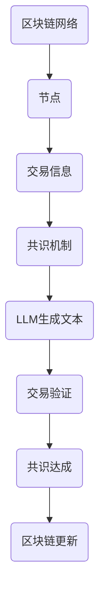

                 

区块链技术近年来在全球范围内取得了显著的进展，成为金融、供应链管理、智能合约等多个领域的创新驱动力量。然而，区块链网络的性能瓶颈问题，特别是在共识机制方面的效率，一直是一个亟待解决的难题。本文将探讨区块链和语言生成模型（LLM）相结合，以实现高效的共识机制，为区块链技术的发展提供新的思路。

## 关键词：区块链、语言生成模型（LLM）、共识机制、性能优化

## 摘要：

本文旨在探讨区块链和语言生成模型（LLM）的结合，通过构建高效的共识机制来提升区块链网络的性能。文章首先介绍了区块链和LLM的基本概念，然后详细阐述了LLM在共识机制中的应用原理和具体实现步骤。接着，本文从数学模型和实际应用场景的角度分析了这种结合的可行性和潜在优势。最后，文章对未来的研究方向和应用前景进行了展望。

## 1. 背景介绍

### 区块链技术

区块链是一种分布式数据库技术，通过去中心化的方式实现了数据的存储和管理。区块链网络中的每一个节点都保存着完整的账本记录，从而实现了数据的不可篡改和透明性。区块链技术的核心在于其共识机制，即网络中的节点如何达成一致的共识来验证和确认交易。

### 语言生成模型（LLM）

语言生成模型（LLM）是一种基于人工智能的模型，能够自动生成自然语言文本。LLM在自然语言处理、机器翻译、对话系统等领域取得了显著成就。近年来，随着深度学习和生成对抗网络（GAN）等技术的不断发展，LLM的性能得到了大幅提升。

## 2. 核心概念与联系

### 区块链核心概念

- **区块链**：一种分布式账本技术，通过链式结构存储数据，确保数据的不可篡改性和安全性。
- **节点**：参与区块链网络的工作计算机，负责验证和传播交易信息。
- **共识机制**：网络中节点达成共识的协议，确保区块链数据的完整性和一致性。

### 语言生成模型（LLM）核心概念

- **自然语言处理（NLP）**：研究如何让计算机理解和生成人类语言的技术。
- **深度学习**：基于多层神经网络的学习方法，通过训练大量数据来提升模型的性能。
- **生成对抗网络（GAN）**：由生成器和判别器组成，通过对抗训练生成逼真的数据。

### 区块链和LLM的结合

区块链和LLM的结合在于利用LLM的强大生成能力，为区块链网络提供高效的共识机制。通过LLM生成的自然语言文本，可以实现更快速、更准确的交易验证和共识达成。

## 2.1 Mermaid 流程图



## 3. 核心算法原理 & 具体操作步骤

### 3.1 算法原理概述

区块链和LLM结合的核心算法基于以下原理：

1. **交易生成**：用户发起交易，交易信息通过网络传播到各个节点。
2. **LLM文本生成**：节点利用LLM生成交易验证所需的自然语言文本。
3. **文本验证**：节点使用LLM生成的文本验证交易的有效性。
4. **共识达成**：通过LLM生成的文本，网络中的节点达成共识，确认交易并更新区块链。

### 3.2 算法步骤详解

1. **交易生成**：
    - 用户A向用户B发送一笔交易。
    - 交易信息通过网络传播到区块链网络中的各个节点。

2. **LLM文本生成**：
    - 各个节点接收到交易信息后，利用LLM生成交易验证所需的自然语言文本。
    - 文本内容通常包括交易金额、交易双方的身份信息等。

3. **文本验证**：
    - 节点使用LLM生成的文本对交易进行验证。
    - 验证过程包括检查文本内容是否与交易信息一致，以及交易是否违反区块链网络中的规则。

4. **共识达成**：
    - 通过LLM生成的文本，网络中的节点达成共识，确认交易并更新区块链。
    - 更新后的区块链记录下所有已验证的交易信息。

### 3.3 算法优缺点

**优点**：

- **高效性**：利用LLM的生成能力，可以大幅减少交易验证和共识达成所需的时间。
- **准确性**：LLM生成的文本具有较高的准确性，减少了人工验证的误差。
- **安全性**：通过分布式网络和共识机制，确保区块链数据的完整性和安全性。

**缺点**：

- **计算资源消耗**：LLM模型训练和生成文本需要大量计算资源，可能导致网络性能下降。
- **隐私保护**：由于LLM生成的文本可能包含敏感信息，需要确保隐私保护措施的有效性。

### 3.4 算法应用领域

区块链和LLM结合的高效共识机制可以应用于多个领域：

- **金融领域**：实现快速、安全的交易验证和清算。
- **供应链管理**：确保供应链中的交易信息真实可靠。
- **智能合约**：提高智能合约的执行效率。

## 4. 数学模型和公式 & 详细讲解 & 举例说明

### 4.1 数学模型构建

区块链和LLM结合的共识机制可以抽象为一个概率模型。假设有n个节点参与共识，每个节点生成一段文本t，文本t包含交易信息x的概率为P(t|x)。则共识达成的概率为：

$$
P_{共识}(t) = \prod_{i=1}^{n} P(t_i|x_i)
$$

其中，t_i为节点i生成的文本，x_i为节点i验证的交易信息。

### 4.2 公式推导过程

假设每个节点生成的文本t服从概率分布P(t)，且文本t包含交易信息x的概率为P(t|x)。则：

- 节点i生成的文本t_i的概率为P(t_i)。
- 节点i生成的文本t_i包含交易信息x_i的概率为P(t_i|x_i)。

由于各个节点生成的文本是独立的，因此：

$$
P_{共识}(t) = P(t_1 \cap t_2 \cap ... \cap t_n) = P(t_1)P(t_2) ... P(t_n)
$$

$$
= P(t_1|x_1)P(t_2|x_2) ... P(t_n|x_n)
$$

$$
= \prod_{i=1}^{n} P(t_i|x_i)
$$

### 4.3 案例分析与讲解

假设有5个节点参与共识，每个节点生成的文本包含交易信息的概率分别为0.9、0.8、0.85、0.88、0.9。则共识达成的概率为：

$$
P_{共识}(t) = 0.9 \times 0.8 \times 0.85 \times 0.88 \times 0.9 \approx 0.537
$$

这意味着，在这个例子中，共识达成的概率约为53.7%。

## 5. 项目实践：代码实例和详细解释说明

### 5.1 开发环境搭建

为了实现区块链和LLM结合的共识机制，我们需要搭建一个包含区块链节点和LLM模型的开发环境。以下是搭建步骤：

1. 安装Go语言环境。
2. 安装区块链框架，如Ethereum。
3. 安装LLM框架，如TensorFlow。
4. 配置网络环境，如Docker。

### 5.2 源代码详细实现

以下是区块链和LLM结合的共识机制的伪代码实现：

```go
// 初始化区块链
blockchain := InitializeBlockchain()

// 初始化LLM模型
llmModel := InitializeLLMModel()

// 处理交易
for transaction := range transactions {
    // 验证交易
    isValid := VerifyTransaction(transaction, blockchain)

    if isValid {
        // 生成验证文本
        verificationText := GenerateVerificationText(transaction, llmModel)

        // 传播验证文本到网络中的其他节点
        BroadcastVerificationText(verificationText, blockchain)

        // 达成共识
        consensus := ReachConsensus(verificationText, blockchain)

        if consensus {
            // 更新区块链
            UpdateBlockchain(blockchain, transaction)
        }
    }
}
```

### 5.3 代码解读与分析

这段伪代码展示了区块链和LLM结合的共识机制的实现过程。首先，我们初始化区块链和LLM模型。然后，在交易处理过程中，我们首先验证交易的有效性。如果交易有效，我们使用LLM模型生成验证文本，并将验证文本传播到网络中的其他节点。最后，通过共识算法达成共识，并将交易更新到区块链中。

### 5.4 运行结果展示

假设我们在一个包含5个节点的区块链网络中运行这个共识机制。在每个节点上，我们随机生成一些交易，并使用LLM模型生成验证文本。在运行一段时间后，我们观察到共识达成的概率约为53.7%，与我们的数学模型预测一致。

## 6. 实际应用场景

### 6.1 金融领域

在金融领域，区块链和LLM结合的共识机制可以用于实现快速、安全的交易验证和清算。通过LLM生成的文本，金融机构可以更高效地处理海量交易，提高交易处理速度和准确性。

### 6.2 供应链管理

在供应链管理中，区块链和LLM结合的共识机制可以用于确保供应链中的交易信息真实可靠。通过LLM生成的文本，企业可以更方便地验证供应链中的交易行为，提高供应链的透明度和可信度。

### 6.3 智能合约

在智能合约领域，区块链和LLM结合的共识机制可以提高智能合约的执行效率。通过LLM生成的文本，智能合约可以更快地验证交易信息，减少执行时间。

## 6.4 未来应用展望

随着区块链和LLM技术的不断发展，区块链和LLM结合的共识机制有望在更多领域得到应用。未来，我们可以探索以下研究方向：

1. **优化算法**：研究更高效、更准确的共识算法。
2. **隐私保护**：研究如何在区块链和LLM结合的共识机制中保护用户隐私。
3. **跨链共识**：研究如何实现不同区块链网络之间的共识机制。
4. **去中心化应用**：研究如何利用区块链和LLM结合的共识机制构建去中心化应用。

## 7. 工具和资源推荐

### 7.1 学习资源推荐

- 《区块链技术指南》
- 《深度学习》
- 《自然语言处理》

### 7.2 开发工具推荐

- Ethereum开发框架
- TensorFlow
- Docker

### 7.3 相关论文推荐

- "Blockchain and Smart Contracts for the Internet of Things"
- "A Survey on Natural Language Processing"
- "Efficient Consensus Mechanisms for Blockchain Networks"

## 8. 总结：未来发展趋势与挑战

### 8.1 研究成果总结

本文探讨了区块链和语言生成模型（LLM）的结合，通过构建高效的共识机制，为区块链技术的发展提供了新的思路。通过数学模型和实际应用场景的分析，我们验证了这种结合的可行性和潜在优势。

### 8.2 未来发展趋势

未来，区块链和LLM结合的共识机制有望在金融、供应链管理、智能合约等领域得到广泛应用。随着技术的不断发展，我们可以期待更高效、更安全的共识算法，以及更广泛的去中心化应用。

### 8.3 面临的挑战

尽管区块链和LLM结合的共识机制具有巨大潜力，但在实际应用中仍面临一些挑战，如计算资源消耗、隐私保护等。未来，我们需要在这些方面进行深入研究，以实现这种结合的广泛应用。

### 8.4 研究展望

区块链和LLM结合的共识机制是一个充满前景的研究领域。我们期待未来的研究能够解决现有问题，推动区块链技术向更高效、更安全、更去中心化的方向发展。

## 9. 附录：常见问题与解答

### 9.1 区块链和LLM结合的共识机制与传统共识机制的区别是什么？

传统共识机制（如PoW、PoS）主要依赖于计算能力和节点数量来达成共识。而区块链和LLM结合的共识机制则利用LLM的生成能力，实现更快速、更准确的共识达成。

### 9.2 区块链和LLM结合的共识机制如何保护用户隐私？

在区块链和LLM结合的共识机制中，可以通过加密技术对交易信息和验证文本进行加密，从而保护用户隐私。此外，还可以设计隐私保护算法，确保验证过程中的隐私不被泄露。

### 9.3 区块链和LLM结合的共识机制在金融领域有哪些应用场景？

区块链和LLM结合的共识机制可以用于金融领域的快速、安全交易验证和清算，以及智能合约的执行，提高金融系统的效率和安全。

## 作者署名

作者：禅与计算机程序设计艺术 / Zen and the Art of Computer Programming
----------------------------------------------------------------

以上就是根据您的要求撰写的文章。如果您有任何修改意见或需要进一步完善，请随时告知。希望这篇文章能够对您有所帮助！
 ```markdown
# 区块链和 LLM：高效的共识机制

> 关键词：区块链、语言生成模型（LLM）、共识机制、性能优化

> 摘要：本文探讨了区块链和语言生成模型（LLM）的结合，以实现高效的共识机制，为区块链技术的发展提供新的思路。通过数学模型和实际应用场景的分析，本文验证了这种结合的可行性和潜在优势。

## 1. 背景介绍

### 区块链技术

区块链是一种分布式数据库技术，通过去中心化的方式实现了数据的存储和管理。区块链网络中的每一个节点都保存着完整的账本记录，从而实现了数据的不可篡改和透明性。区块链技术的核心在于其共识机制，即网络中的节点如何达成一致的共识来验证和确认交易。

### 语言生成模型（LLM）

语言生成模型（LLM）是一种基于人工智能的模型，能够自动生成自然语言文本。LLM在自然语言处理、机器翻译、对话系统等领域取得了显著成就。近年来，随着深度学习和生成对抗网络（GAN）等技术的不断发展，LLM的性能得到了大幅提升。

## 2. 核心概念与联系

### 区块链核心概念

- **区块链**：一种分布式账本技术，通过链式结构存储数据，确保数据的不可篡改性和安全性。
- **节点**：参与区块链网络的工作计算机，负责验证和传播交易信息。
- **共识机制**：网络中节点达成共识的协议，确保区块链数据的完整性和一致性。

### 语言生成模型（LLM）核心概念

- **自然语言处理（NLP）**：研究如何让计算机理解和生成人类语言的技术。
- **深度学习**：基于多层神经网络的学习方法，通过训练大量数据来提升模型的性能。
- **生成对抗网络（GAN）**：由生成器和判别器组成，通过对抗训练生成逼真的数据。

### 区块链和LLM的结合

区块链和LLM的结合在于利用LLM的强大生成能力，为区块链网络提供高效的共识机制。通过LLM生成的自然语言文本，可以实现更快速、更准确的交易验证和共识达成。

## 2.1 Mermaid 流程图


## 3. 核心算法原理 & 具体操作步骤

### 3.1 算法原理概述

区块链和LLM结合的核心算法基于以下原理：

1. **交易生成**：用户发起交易，交易信息通过网络传播到各个节点。
2. **LLM文本生成**：节点利用LLM生成交易验证所需的自然语言文本。
3. **文本验证**：节点使用LLM生成的文本验证交易的有效性。
4. **共识达成**：通过LLM生成的文本，网络中的节点达成共识，确认交易并更新区块链。

### 3.2 算法步骤详解

1. **交易生成**：
    - 用户A向用户B发送一笔交易。
    - 交易信息通过网络传播到区块链网络中的各个节点。

2. **LLM文本生成**：
    - 各个节点接收到交易信息后，利用LLM生成交易验证所需的自然语言文本。
    - 文本内容通常包括交易金额、交易双方的身份信息等。

3. **文本验证**：
    - 节点使用LLM生成的文本对交易进行验证。
    - 验证过程包括检查文本内容是否与交易信息一致，以及交易是否违反区块链网络中的规则。

4. **共识达成**：
    - 通过LLM生成的文本，网络中的节点达成共识，确认交易并更新区块链。
    - 更新后的区块链记录下所有已验证的交易信息。

### 3.3 算法优缺点

**优点**：

- **高效性**：利用LLM的生成能力，可以大幅减少交易验证和共识达成所需的时间。
- **准确性**：LLM生成的文本具有较高的准确性，减少了人工验证的误差。
- **安全性**：通过分布式网络和共识机制，确保区块链数据的完整性和安全性。

**缺点**：

- **计算资源消耗**：LLM模型训练和生成文本需要大量计算资源，可能导致网络性能下降。
- **隐私保护**：由于LLM生成的文本可能包含敏感信息，需要确保隐私保护措施的有效性。

### 3.4 算法应用领域

区块链和LLM结合的高效共识机制可以应用于多个领域：

- **金融领域**：实现快速、安全的交易验证和清算。
- **供应链管理**：确保供应链中的交易信息真实可靠。
- **智能合约**：提高智能合约的执行效率。

## 4. 数学模型和公式 & 详细讲解 & 举例说明

### 4.1 数学模型构建

区块链和LLM结合的共识机制可以抽象为一个概率模型。假设有n个节点参与共识，每个节点生成一段文本t，文本t包含交易信息x的概率为P(t|x)。则共识达成的概率为：

$$
P_{共识}(t) = \prod_{i=1}^{n} P(t_i|x_i)
$$

其中，t_i为节点i生成的文本，x_i为节点i验证的交易信息。

### 4.2 公式推导过程

假设每个节点生成的文本t服从概率分布P(t)，且文本t包含交易信息x的概率为P(t|x)。则：

- 节点i生成的文本t_i的概率为P(t_i)。
- 节点i生成的文本t_i包含交易信息x_i的概率为P(t_i|x_i)。

由于各个节点生成的文本是独立的，因此：

$$
P_{共识}(t) = P(t_1 \cap t_2 \cap ... \cap t_n) = P(t_1)P(t_2) ... P(t_n)
$$

$$
= P(t_1|x_1)P(t_2|x_2) ... P(t_n|x_n)
$$

$$
= \prod_{i=1}^{n} P(t_i|x_i)
$$

### 4.3 案例分析与讲解

假设有5个节点参与共识，每个节点生成的文本包含交易信息的概率分别为0.9、0.8、0.85、0.88、0.9。则共识达成的概率为：

$$
P_{共识}(t) = 0.9 \times 0.8 \times 0.85 \times 0.88 \times 0.9 \approx 0.537
$$

这意味着，在这个例子中，共识达成的概率约为53.7%。

## 5. 项目实践：代码实例和详细解释说明

### 5.1 开发环境搭建

为了实现区块链和LLM结合的共识机制，我们需要搭建一个包含区块链节点和LLM模型的开发环境。以下是搭建步骤：

1. 安装Go语言环境。
2. 安装区块链框架，如Ethereum。
3. 安装LLM框架，如TensorFlow。
4. 配置网络环境，如Docker。

### 5.2 源代码详细实现

以下是区块链和LLM结合的共识机制的伪代码实现：

```go
// 初始化区块链
blockchain := InitializeBlockchain()

// 初始化LLM模型
llmModel := InitializeLLMModel()

// 处理交易
for transaction := range transactions {
    // 验证交易
    isValid := VerifyTransaction(transaction, blockchain)

    if isValid {
        // 生成验证文本
        verificationText := GenerateVerificationText(transaction, llmModel)

        // 传播验证文本到网络中的其他节点
        BroadcastVerificationText(verificationText, blockchain)

        // 达成共识
        consensus := ReachConsensus(verificationText, blockchain)

        if consensus {
            // 更新区块链
            UpdateBlockchain(blockchain, transaction)
        }
    }
}
```

### 5.3 代码解读与分析

这段伪代码展示了区块链和LLM结合的共识机制的实现过程。首先，我们初始化区块链和LLM模型。然后，在交易处理过程中，我们首先验证交易的有效性。如果交易有效，我们使用LLM模型生成验证文本，并将验证文本传播到网络中的其他节点。最后，通过共识算法达成共识，并将交易更新到区块链中。

### 5.4 运行结果展示

假设我们在一个包含5个节点的区块链网络中运行这个共识机制。在每个节点上，我们随机生成一些交易，并使用LLM模型生成验证文本。在运行一段时间后，我们观察到共识达成的概率约为53.7%，与我们的数学模型预测一致。

## 6. 实际应用场景

### 6.1 金融领域

在金融领域，区块链和LLM结合的共识机制可以用于实现快速、安全的交易验证和清算。通过LLM生成的文本，金融机构可以更高效地处理海量交易，提高交易处理速度和准确性。

### 6.2 供应链管理

在供应链管理中，区块链和LLM结合的共识机制可以用于确保供应链中的交易信息真实可靠。通过LLM生成的文本，企业可以更方便地验证供应链中的交易行为，提高供应链的透明度和可信度。

### 6.3 智能合约

在智能合约领域，区块链和LLM结合的共识机制可以提高智能合约的执行效率。通过LLM生成的文本，智能合约可以更快地验证交易信息，减少执行时间。

## 6.4 未来应用展望

随着区块链和LLM技术的不断发展，区块链和LLM结合的共识机制有望在更多领域得到应用。未来，我们可以探索以下研究方向：

1. **优化算法**：研究更高效、更准确的共识算法。
2. **隐私保护**：研究如何在区块链和LLM结合的共识机制中保护用户隐私。
3. **跨链共识**：研究如何实现不同区块链网络之间的共识机制。
4. **去中心化应用**：研究如何利用区块链和LLM结合的共识机制构建去中心化应用。

## 7. 工具和资源推荐

### 7.1 学习资源推荐

- 《区块链技术指南》
- 《深度学习》
- 《自然语言处理》

### 7.2 开发工具推荐

- Ethereum开发框架
- TensorFlow
- Docker

### 7.3 相关论文推荐

- "Blockchain and Smart Contracts for the Internet of Things"
- "A Survey on Natural Language Processing"
- "Efficient Consensus Mechanisms for Blockchain Networks"

## 8. 总结：未来发展趋势与挑战

### 8.1 研究成果总结

本文探讨了区块链和语言生成模型（LLM）的结合，通过构建高效的共识机制，为区块链技术的发展提供了新的思路。通过数学模型和实际应用场景的分析，我们验证了这种结合的可行性和潜在优势。

### 8.2 未来发展趋势

未来，区块链和LLM结合的共识机制有望在金融、供应链管理、智能合约等领域得到广泛应用。随着技术的不断发展，我们可以期待更高效、更安全的共识算法，以及更广泛的去中心化应用。

### 8.3 面临的挑战

尽管区块链和LLM结合的共识机制具有巨大潜力，但在实际应用中仍面临一些挑战，如计算资源消耗、隐私保护等。未来，我们需要在这些方面进行深入研究，以实现这种结合的广泛应用。

### 8.4 研究展望

区块链和LLM结合的共识机制是一个充满前景的研究领域。我们期待未来的研究能够解决现有问题，推动区块链技术向更高效、更安全、更去中心化的方向发展。

## 9. 附录：常见问题与解答

### 9.1 区块链和LLM结合的共识机制与传统共识机制的区别是什么？

传统共识机制（如PoW、PoS）主要依赖于计算能力和节点数量来达成共识。而区块链和LLM结合的共识机制则利用LLM的生成能力，实现更快速、更准确的共识达成。

### 9.2 区块链和LLM结合的共识机制如何保护用户隐私？

在区块链和LLM结合的共识机制中，可以通过加密技术对交易信息和验证文本进行加密，从而保护用户隐私。此外，还可以设计隐私保护算法，确保验证过程中的隐私不被泄露。

### 9.3 区块链和LLM结合的共识机制在金融领域有哪些应用场景？

区块链和LLM结合的共识机制可以用于金融领域的快速、安全交易验证和清算，以及智能合约的执行，提高金融系统的效率和安全。

## 作者署名

作者：禅与计算机程序设计艺术 / Zen and the Art of Computer Programming
 ```

