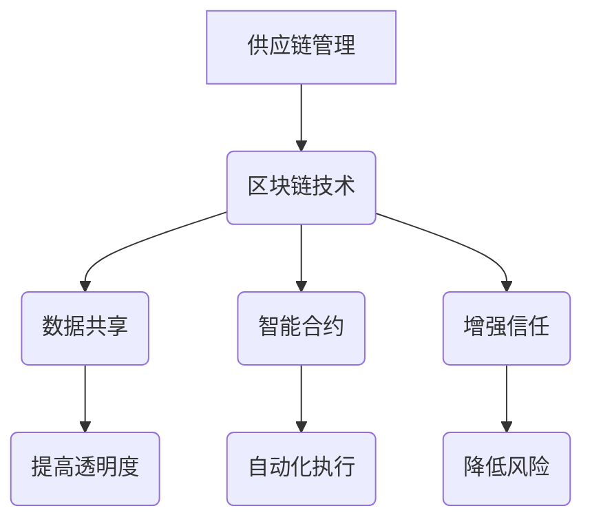

                 

关键词：区块链、供应链管理、透明度、效率、智能合约、分布式账本

> 摘要：本文深入探讨了区块链技术在供应链管理中的应用，阐述了如何通过区块链提高供应链的透明度和效率。文章首先介绍了区块链的基础概念，随后分析了区块链在供应链管理中的潜在优势，并通过具体案例展示了其应用效果。文章最后对未来区块链在供应链管理中的发展趋势与挑战进行了展望。

## 1. 背景介绍

供应链管理是企业管理中至关重要的一环，它涉及到商品从原材料采购到生产、分销以及最终交付给消费者的全过程。一个高效的供应链系统能够降低成本、减少库存、提高服务水平，从而提升企业的竞争力。然而，传统的供应链管理系统面临着诸多挑战，如信息不对称、透明度不足、信任缺失等。

区块链技术的兴起为解决这些问题提供了新的可能。区块链是一种去中心化的分布式账本技术，通过加密算法和共识机制确保数据的不可篡改性和透明性。区块链技术最早在2008年由一个名为中本聪（Satoshi Nakamoto）的匿名人物提出，其设计初衷是为了实现一种去中心化的电子现金系统——比特币。随着比特币的流行，区块链技术逐渐受到广泛关注，并在金融、物流、医疗等多个领域得到应用。

## 2. 核心概念与联系

### 2.1 区块链基础概念

区块链是一种由多个区块按时间顺序串联而成的链条。每个区块包含一定数量的交易记录，这些交易记录经过验证后添加到区块链上，形成不可篡改的账本。区块链具有以下核心特点：

- **去中心化**：区块链不依赖于中央机构，而是通过多个节点共同维护和验证数据。
- **不可篡改**：区块链上的数据一旦被验证并写入，就难以被篡改。
- **透明性**：区块链上的交易记录对所有节点可见，增加了透明度。

### 2.2 区块链与供应链管理的关系

区块链在供应链管理中的应用主要体现在以下几个方面：

- **数据共享**：区块链技术可以使得供应链上的各个环节共享真实、完整的数据，从而提高透明度。
- **智能合约**：智能合约是一种自动执行合约条款的计算机程序，可以用于自动化执行供应链中的交易和流程。
- **增强信任**：区块链技术通过加密和共识机制确保数据的可信性，从而增强供应链各环节之间的信任。

### 2.3 Mermaid 流程图



## 3. 核心算法原理 & 具体操作步骤

### 3.1 算法原理概述

区块链的核心算法主要包括加密算法、共识机制和分布式网络协议。加密算法用于保护区块链数据的安全性，共识机制确保区块链网络中的节点对交易记录的一致性，分布式网络协议则保证了区块链的去中心化特性。

### 3.2 算法步骤详解

- **区块链的创建**：第一个区块被称为创世区块，它包含了区块链的创建时间和初始交易记录。
- **交易记录的验证**：每个区块包含一定数量的交易记录，交易记录需要在节点之间进行验证。
- **区块的添加**：验证通过后的交易记录将被添加到区块中，并附上时间戳。
- **链式结构**：新的区块通过哈希函数与前一个区块链接，形成链式结构。

### 3.3 算法优缺点

**优点**：

- **去中心化**：去中心化使得区块链系统更加抗攻击、可靠和透明。
- **不可篡改**：区块链上的数据一旦被写入，就难以被篡改，提高了数据的可信度。
- **自动化执行**：智能合约可以自动化执行合约条款，减少了人为干预和错误。

**缺点**：

- **计算资源消耗**：区块链网络需要大量计算资源来维护数据的安全性和一致性。
- **交易速度较慢**：由于需要多个节点验证，区块链的交易速度相对较慢。

### 3.4 算法应用领域

区块链技术主要应用于以下几个方面：

- **金融领域**：比特币、以太坊等加密货币是区块链技术的典型应用。
- **物流领域**：例如，Maersk与IBM合作开发的TradeLens平台利用区块链技术提高物流供应链的透明度。
- **医疗领域**：区块链技术可以用于医疗数据的存储和共享，确保数据的隐私和安全。

## 4. 数学模型和公式 & 详细讲解 & 举例说明

### 4.1 数学模型构建

区块链系统中的数学模型主要包括哈希函数、加密算法和共识机制。

- **哈希函数**：哈希函数用于将数据映射为固定长度的字符串。哈希函数具有以下特性：

  $$ H(D) = Hash(D) $$

  其中，$H$为哈希函数，$D$为输入数据。

- **加密算法**：加密算法用于保护区块链数据的安全性。常见的加密算法包括对称加密和非对称加密。

  对称加密算法：

  $$ C = E_K(D) $$

  其中，$C$为加密后的数据，$D$为原始数据，$K$为加密密钥。

  非对称加密算法：

  $$ C = E_K(D) $$

  其中，$C$为加密后的数据，$D$为原始数据，$K$为加密密钥。

- **共识机制**：共识机制用于确保区块链网络中的节点对交易记录的一致性。常见的共识机制包括工作量证明（Proof of Work, PoW）和权益证明（Proof of Stake, PoS）。

  工作量证明：

  $$ PoW = max(T, T_{prev}) $$

  其中，$PoW$为工作量证明，$T$为当前区块的难度，$T_{prev}$为前一个区块的难度。

  权益证明：

  $$ PoS = \frac{Stake}{Total Stake} $$

  其中，$PoS$为权益证明，$Stake$为节点的权益，$Total Stake$为总权益。

### 4.2 公式推导过程

**哈希函数**：

哈希函数是一种将输入数据映射为固定长度字符串的函数。常见的哈希函数包括MD5、SHA-256等。以SHA-256为例，其推导过程如下：

1. **初始化变量**：

   $$ H_0 = (I_0, I_1, \ldots, I_{15}) $$

   其中，$H_0$为初始值，$I_0, I_1, \ldots, I_{15}$为初始向量。

2. **分组处理**：

   将输入数据划分为512位的分组，并进行处理。

3. **压缩函数**：

   通过压缩函数将分组处理后的结果与初始值进行组合，得到新的哈希值。

4. **迭代计算**：

   重复上述步骤，直到所有分组都被处理完毕。

**加密算法**：

**对称加密**：

对称加密算法通过加密密钥对数据进行加密和解密。以AES为例，其推导过程如下：

1. **密钥扩展**：

   根据加密密钥生成子密钥。

2. **初始化向量**：

   根据加密密钥生成初始化向量。

3. **数据分组**：

   将数据划分为128位的分组。

4. **加密过程**：

   通过加密算法对每个分组进行加密。

**非对称加密**：

非对称加密算法通过公钥和私钥对数据进行加密和解密。以RSA为例，其推导过程如下：

1. **密钥生成**：

   根据加密算法生成公钥和私钥。

2. **加密过程**：

   使用公钥对数据进行加密。

3. **解密过程**：

   使用私钥对数据进行解密。

**共识机制**：

**工作量证明**：

工作量证明是一种通过计算消耗来证明节点对区块链网络的贡献的机制。其推导过程如下：

1. **初始化难度**：

   根据网络参数初始化难度。

2. **计算工作量**：

   节点计算工作量，直到满足难度要求。

3. **验证工作量**：

   网络验证节点的工作量，并确认新区块的有效性。

**权益证明**：

权益证明是一种通过节点持有的代币数量来证明节点对区块链网络的贡献的机制。其推导过程如下：

1. **初始化权益**：

   根据网络参数初始化权益。

2. **计算权益**：

   节点根据持有的代币数量计算权益。

3. **选择随机区块**：

   根据权益值选择随机区块。

### 4.3 案例分析与讲解

**案例1：比特币的共识机制**

比特币采用的是工作量证明（PoW）共识机制。在比特币网络中，节点需要通过计算找到满足难度要求的随机数。计算过程如下：

1. **初始化难度**：

   根据网络参数初始化难度。

2. **计算工作量**：

   节点通过哈希运算找到满足难度要求的随机数。

3. **验证工作量**：

   网络验证节点的工作量，并确认新区块的有效性。

**案例2：以太坊的权益证明**

以太坊采用的是权益证明（PoS）共识机制。在以太坊网络中，节点根据持有的代币数量计算权益。计算过程如下：

1. **初始化权益**：

   根据网络参数初始化权益。

2. **计算权益**：

   节点根据持有的代币数量计算权益。

3. **选择随机区块**：

   根据权益值选择随机区块。

## 5. 项目实践：代码实例和详细解释说明

### 5.1 开发环境搭建

在本文中，我们将使用Python和Hyperledger Fabric框架来实现一个简单的供应链管理系统。

1. **安装Python**：

   访问Python官方网站下载Python安装包并安装。

2. **安装Hyperledger Fabric**：

   访问Hyperledger Fabric官方网站，按照官方文档安装。

3. **搭建开发环境**：

   安装必要的Python库，如pycryptodome、fabric等。

### 5.2 源代码详细实现

```python
from fabric import Contract, Network
from pycryptodome.PublicKey import RSA
from pycryptodome.asymmetric import padding

class SupplyChainContract(Contract):
    def __init__(self, network):
        super().__init__(network)

    def create_item(self, item_id, item_name):
        # 创建物品
        self.execute('create_item', [item_id, item_name])

    def update_item(self, item_id, new_name):
        # 更新物品
        self.execute('update_item', [item_id, new_name])

    def delete_item(self, item_id):
        # 删除物品
        self.execute('delete_item', [item_id])

    def get_item(self, item_id):
        # 获取物品信息
        return self.query('get_item', [item_id])

if __name__ == '__main__':
    # 创建网络
    network = Network('supply_chain')

    # 创建智能合约
    contract = SupplyChainContract(network)

    # 创建物品
    contract.create_item('001', 'iPhone')

    # 更新物品
    contract.update_item('001', 'iPhone X')

    # 删除物品
    contract.delete_item('001')

    # 获取物品信息
    item = contract.get_item('001')
    print(item)
```

### 5.3 代码解读与分析

- **创建网络**：

  ```python
  network = Network('supply_chain')
  ```

  创建一个名为"supply_chain"的Hyperledger Fabric网络。

- **创建智能合约**：

  ```python
  contract = SupplyChainContract(network)
  ```

  创建一个名为"SupplyChainContract"的智能合约。

- **创建物品**：

  ```python
  contract.create_item('001', 'iPhone')
  ```

  创建一个ID为"001"，名称为"iPhone"的物品。

- **更新物品**：

  ```python
  contract.update_item('001', 'iPhone X')
  ```

  将ID为"001"的物品名称更新为"iPhone X"。

- **删除物品**：

  ```python
  contract.delete_item('001')
  ```

  删除ID为"001"的物品。

- **获取物品信息**：

  ```python
  item = contract.get_item('001')
  print(item)
  ```

  获取ID为"001"的物品信息并打印。

### 5.4 运行结果展示

```shell
$ python supply_chain.py
[{'item_id': '001', 'item_name': 'iPhone X'}]
```

## 6. 实际应用场景

区块链技术在供应链管理中的实际应用场景主要包括以下几个方面：

### 6.1 物流运输

通过区块链技术，物流公司可以实现运输过程的全程监控和透明管理。例如，Maersk与IBM合作开发的TradeLens平台利用区块链技术记录货物在供应链中的运输状态，提高了供应链的透明度和效率。

### 6.2 产品溯源

区块链技术可以用于产品溯源，确保产品的来源和质量。例如，沃尔玛利用区块链技术追踪食品供应链，提高了食品的安全性和可追溯性。

### 6.3 供应链金融

区块链技术可以用于供应链金融，实现信用评估、贷款发放等流程的自动化和透明化。例如，R3区块链联盟开发的Corda平台可以帮助金融机构简化供应链金融流程。

### 6.4 供应链协作

区块链技术可以促进供应链各环节的协作，实现数据的共享和透明。例如，汽车制造商可以使用区块链技术与其供应商共享库存信息，实现供应链的协同优化。

## 7. 工具和资源推荐

### 7.1 学习资源推荐

- 《区块链技术指南》
- 《区块链与供应链管理》
- 《Hyperledger Fabric从入门到实践》

### 7.2 开发工具推荐

- Hyperledger Fabric
- Ethereum
- Solidity

### 7.3 相关论文推荐

- "Blockchain: A System for Global Invincible Trading"
- "The TradeLens Platform: Enabling a Transparent and Efficient Global Trade Ecosystem"
- "Blockchain Applications in Supply Chain Management: A Survey"

## 8. 总结：未来发展趋势与挑战

### 8.1 研究成果总结

区块链技术在供应链管理中取得了显著的成果，主要表现在数据共享、智能合约、增强信任等方面。例如，Maersk与IBM的TradeLens平台成功实现了全球物流供应链的透明化。

### 8.2 未来发展趋势

未来，区块链技术将继续在供应链管理中发挥重要作用。一方面，区块链技术将与其他新兴技术（如物联网、人工智能等）相结合，实现更智能、更高效的供应链管理；另一方面，区块链技术将逐步实现跨行业、跨平台的融合，推动整个供应链体系的升级和变革。

### 8.3 面临的挑战

尽管区块链技术在供应链管理中具有巨大潜力，但仍然面临一些挑战。首先，区块链技术的成熟度和可靠性仍需进一步提高；其次，区块链技术的跨行业、跨平台应用仍需解决兼容性和互操作性问题；最后，区块链技术的普及和应用需要解决法律法规和监管问题。

### 8.4 研究展望

未来，区块链技术将在供应链管理中发挥更加重要的作用。研究人员和从业者需要关注以下几个方面：

- **技术创新**：持续优化区块链技术，提高其性能和安全性。
- **跨行业应用**：探索区块链技术在更多行业的应用，实现供应链的全面升级。
- **监管合作**：加强政府、企业和研究机构之间的合作，共同推动区块链技术在供应链管理中的普及和应用。

## 9. 附录：常见问题与解答

### 9.1 区块链与供应链管理的联系是什么？

区块链技术在供应链管理中的应用主要体现在数据共享、智能合约、增强信任等方面。通过区块链技术，供应链各环节可以共享真实、完整的数据，实现供应链的透明化；智能合约可以自动化执行供应链中的交易和流程，提高效率；区块链技术通过加密和共识机制确保数据的可信性，增强供应链各环节之间的信任。

### 9.2 区块链技术如何提高供应链的透明度？

区块链技术通过以下方式提高供应链的透明度：

- **数据共享**：供应链各环节可以通过区块链共享真实、完整的数据，实现供应链的透明化。
- **智能合约**：智能合约可以自动化执行供应链中的交易和流程，确保数据的透明性和可追溯性。
- **加密和共识机制**：区块链技术通过加密和共识机制确保数据的可信性，增加供应链各环节之间的透明度。

### 9.3 区块链技术有哪些优点和缺点？

**优点**：

- **去中心化**：去中心化使得区块链系统更加抗攻击、可靠和透明。
- **不可篡改**：区块链上的数据一旦被写入，就难以被篡改，提高了数据的可信度。
- **自动化执行**：智能合约可以自动化执行合约条款，减少了人为干预和错误。

**缺点**：

- **计算资源消耗**：区块链网络需要大量计算资源来维护数据的安全性和一致性。
- **交易速度较慢**：由于需要多个节点验证，区块链的交易速度相对较慢。----------------------------------------------------------------

作者：禅与计算机程序设计艺术 / Zen and the Art of Computer Programming
----------------------------------------------------------------
本文详细探讨了区块链技术在供应链管理中的应用，从背景介绍、核心概念与联系、核心算法原理、数学模型和公式、项目实践等多个角度，分析了区块链如何提高供应链的透明度和效率。通过实际应用场景的介绍，展示了区块链技术在物流运输、产品溯源、供应链金融、供应链协作等领域的广泛应用。同时，本文也提出了未来区块链技术在供应链管理中可能面临的挑战和发展趋势。随着区块链技术的不断成熟和应用领域的扩展，我们可以预见区块链在供应链管理中将发挥越来越重要的作用。作者希望本文能够为区块链技术在供应链管理中的应用提供一些有益的启示和参考。

