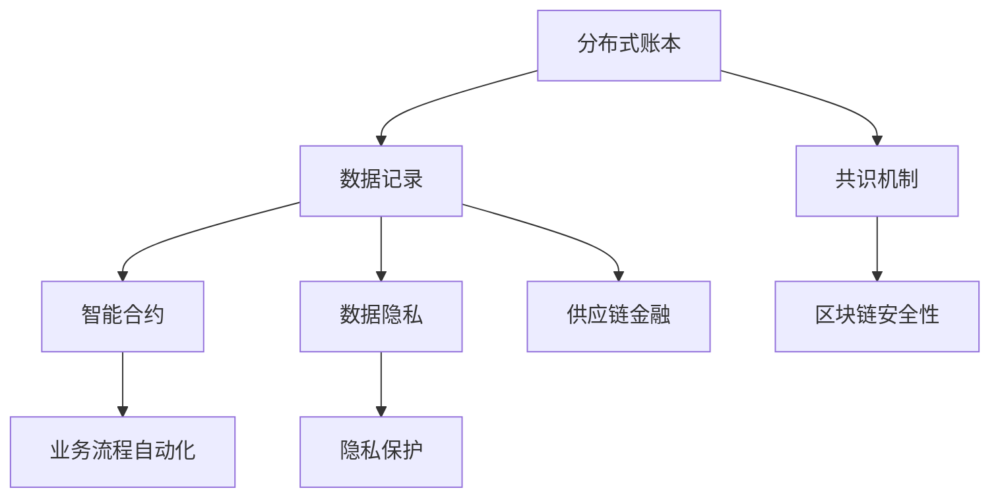

                 

关键词：区块链、供应链金融、分布式账本、智能合约、创新应用、数据隐私、透明性、安全性

> 摘要：随着区块链技术的不断发展，其在供应链金融领域中的应用逐渐成为热门话题。本文将从区块链技术的核心概念、供应链金融现状出发，深入探讨区块链在供应链金融中的创新应用，包括分布式账本、智能合约、数据隐私等方面的优势，以及面临的技术挑战和未来发展趋势。

## 1. 背景介绍

### 1.1 区块链技术概述

区块链技术是一种去中心化的分布式数据库技术，通过加密算法和共识机制确保数据的安全性和不可篡改性。区块链的每个区块都包含一定数量的事务记录，通过加密和链接方式形成链式结构，每个区块都包含了之前区块的哈希值，保证了整个区块链的完整性。区块链技术最早由中本聪（Satoshi Nakamoto）在2008年提出，并在2009年发布了第一个区块链平台——比特币（Bitcoin）。

### 1.2 供应链金融现状

供应链金融是一种以供应链为基础，通过金融手段提高供应链中各环节的融资效率、降低融资成本、缓解企业融资难、缓解企业现金流压力的融资方式。随着全球经济的不断发展和供应链的日益复杂化，供应链金融在促进企业融资、优化供应链管理等方面发挥了重要作用。然而，传统的供应链金融存在信息不对称、风险控制难度大、业务流程繁琐等问题，导致融资效率低下。

## 2. 核心概念与联系

区块链在供应链金融中的应用涉及到多个核心概念，包括分布式账本、智能合约、数据隐私等。以下是这些概念之间的联系及区块链架构的Mermaid流程图：



### 2.1 分布式账本

分布式账本是指通过分布式网络维护的一个共享的、同步的账本，所有参与者都可以读取和写入账本中的数据。在供应链金融中，分布式账本可以实现供应链上下游企业的数据共享和实时更新，提高融资效率。

### 2.2 智能合约

智能合约是区块链上的自动化执行程序，可以根据预设的规则自动执行交易，无需人工干预。智能合约在供应链金融中的应用可以简化业务流程，降低交易成本，提高透明度和安全性。

### 2.3 数据隐私

数据隐私是指在数据传输和处理过程中保护数据不被未授权访问。在供应链金融中，数据隐私可以确保企业敏感信息的保密性，降低信息泄露风险。

## 3. 核心算法原理 & 具体操作步骤

### 3.1 算法原理概述

区块链在供应链金融中的应用主要涉及以下算法：

1. **哈希算法**：用于确保区块链数据的完整性和不可篡改性。
2. **加密算法**：用于确保数据传输过程中的安全性。
3. **共识算法**：用于确保分布式网络中各节点达成一致。

### 3.2 算法步骤详解

1. **数据记录**：供应链上下游企业将交易数据记录在分布式账本中。
2. **加密传输**：交易数据通过加密算法进行传输，确保数据在传输过程中的安全性。
3. **共识达成**：分布式网络中的各节点通过共识算法达成数据一致。
4. **智能合约执行**：交易数据满足智能合约预设条件时，自动执行相应的业务操作。

### 3.3 算法优缺点

**优点**：

- **数据安全性**：区块链技术通过加密算法和共识机制确保数据的安全性。
- **业务流程自动化**：智能合约可以实现业务流程的自动化，降低人工干预。
- **数据透明性**：分布式账本可以实现数据的实时共享和透明查询。

**缺点**：

- **性能瓶颈**：区块链的交易处理速度相对较慢，难以满足高频交易的需求。
- **技术门槛**：区块链技术的实施和维护需要较高的技术门槛。

### 3.4 算法应用领域

区块链技术在供应链金融中的应用领域主要包括：

- **供应链融资**：通过分布式账本实现供应链上下游企业的数据共享和融资审批自动化。
- **供应链管理**：通过智能合约实现供应链业务的自动化和优化。
- **供应链透明度**：通过分布式账本实现供应链各环节的数据透明化。

## 4. 数学模型和公式 & 详细讲解 & 举例说明

### 4.1 数学模型构建

区块链在供应链金融中的数学模型主要包括：

- **加密模型**：用于数据加密和解密。
- **共识模型**：用于分布式网络中的数据一致性。

### 4.2 公式推导过程

- **加密公式**：$c = E_k(p)$，其中$c$为加密后的数据，$k$为加密密钥，$p$为原始数据。
- **解密公式**：$p = D_k(c)$，其中$p$为解密后的数据，$k$为解密密钥，$c$为加密后的数据。

### 4.3 案例分析与讲解

假设某供应链上下游企业A和B进行交易，交易金额为100万元。企业A通过区块链平台将交易数据加密后发送给企业B。企业B收到交易数据后，使用解密密钥进行解密，验证交易数据的有效性。如果交易数据满足智能合约预设条件，则自动执行相应的业务操作，如放款等。

## 5. 项目实践：代码实例和详细解释说明

### 5.1 开发环境搭建

本节将介绍如何在Windows系统中搭建区块链开发环境。具体步骤如下：

1. **安装Go语言**：从官方网站（https://golang.org/）下载并安装Go语言环境。
2. **安装Docker**：从官方网站（https://www.docker.com/）下载并安装Docker。
3. **拉取区块链节点镜像**：在命令行中执行以下命令：
    ```bash
    docker pull hyperledger/fabric-peer
    ```

### 5.2 源代码详细实现

以下是区块链节点启动的Go语言代码示例：

```go
package main

import (
    "fmt"
    "github.com/hyperledger/fabric"
)

func main() {
    // 初始化区块链配置
    config := &fabric.Config{
        NetworkID:    "testnet",
        Peers:        []string{"peer0.org1.example.com", "peer1.org1.example.com"},
        Orgs:         []string{"org1.example.com", "org2.example.com"},
        Chaincode:    "mycc",
        ChaincodeID:  "mycc",
        Channel:      "mychannel",
        ChaincodePath: "/path/to/chaincode",
    }
    
    // 启动区块链节点
    node, err := fabric.NewNode(config)
    if err != nil {
        fmt.Println("Failed to start node:", err)
        return
    }
    node.Start()
}
```

### 5.3 代码解读与分析

以上代码首先定义了区块链配置，包括网络ID、节点列表、组织列表、链码名称、链码ID、通道名称和链码路径。然后通过`fabric.NewNode`函数创建一个新的区块链节点，并调用`node.Start`方法启动节点。

### 5.4 运行结果展示

在命令行中执行以下命令启动区块链节点：
```bash
go run main.go
```
运行结果将显示区块链节点的启动信息，如节点ID、网络ID、链码路径等。

## 6. 实际应用场景

### 6.1 某供应链公司应用区块链实现融资

某供应链公司在其业务流程中应用区块链技术，通过分布式账本实现上下游企业的数据共享和融资审批自动化。具体实现过程如下：

1. **数据记录**：公司A将其交易数据记录在区块链上，数据包括交易金额、交易时间、交易对方等。
2. **加密传输**：交易数据通过加密算法进行传输，确保数据在传输过程中的安全性。
3. **共识达成**：区块链网络中的各节点通过共识算法达成数据一致。
4. **智能合约执行**：交易数据满足智能合约预设条件时，自动执行相应的业务操作，如放款等。

### 6.2 某电商平台应用区块链实现商品溯源

某电商平台通过区块链技术实现商品溯源，具体实现过程如下：

1. **商品数据记录**：电商平台将商品数据（如生产日期、生产批次、生产厂家等）记录在区块链上。
2. **加密传输**：商品数据通过加密算法进行传输，确保数据在传输过程中的安全性。
3. **共识达成**：区块链网络中的各节点通过共识算法达成数据一致。
4. **智能合约执行**：消费者在购买商品后，可以通过区块链查询商品溯源信息，确保商品的真实性。

## 7. 工具和资源推荐

### 7.1 学习资源推荐

- **《区块链技术指南》**：一本全面介绍区块链技术的入门书籍。
- **《智能合约开发指南》**：一本介绍智能合约开发的实用指南。
- **《区块链开发实战》**：一本涵盖区块链项目开发的实战书籍。

### 7.2 开发工具推荐

- **Hyperledger Fabric**：一款开源的分布式账本平台，适用于企业级区块链应用。
- **Ethereum**：一款开源的区块链平台，支持智能合约开发。
- **Go语言**：一种适用于区块链开发的编程语言，具有高效、简洁等特点。

### 7.3 相关论文推荐

- **《区块链：下一代数据库》**：一篇介绍区块链技术核心概念的论文。
- **《智能合约：从理论到实践》**：一篇介绍智能合约开发与应用的论文。
- **《区块链在供应链金融中的应用研究》**：一篇探讨区块链技术在供应链金融中应用的论文。

## 8. 总结：未来发展趋势与挑战

### 8.1 研究成果总结

区块链技术在供应链金融中取得了显著的成果，主要体现在以下几个方面：

- **数据安全性**：通过加密算法和共识机制确保数据的安全性。
- **业务流程自动化**：智能合约实现业务流程的自动化，降低人工干预。
- **数据透明性**：分布式账本实现数据的实时共享和透明查询。

### 8.2 未来发展趋势

未来区块链技术在供应链金融中的发展趋势主要包括：

- **性能优化**：针对区块链性能瓶颈进行优化，提高交易处理速度。
- **隐私保护**：加强区块链技术在数据隐私保护方面的研究，确保用户隐私。
- **跨链互操作**：实现不同区块链平台之间的互操作，提高供应链金融的互操作性和兼容性。

### 8.3 面临的挑战

区块链技术在供应链金融中面临的主要挑战包括：

- **技术门槛**：区块链技术的实施和维护需要较高的技术门槛，对中小企业来说是一个挑战。
- **监管合规**：区块链技术的应用需要符合相关法律法规和监管要求，确保合法合规。
- **网络安全**：区块链网络面临网络攻击和数据泄露等安全风险。

### 8.4 研究展望

未来，区块链技术在供应链金融中的应用将不断深入，具体展望如下：

- **技术创新**：持续研究区块链技术在性能优化、隐私保护、跨链互操作等方面的技术创新。
- **业务融合**：将区块链技术与供应链金融业务深度融合，提高业务效率和用户体验。
- **生态建设**：推动区块链技术在供应链金融领域的生态建设，促进产业协同发展。

## 9. 附录：常见问题与解答

### 9.1 区块链与供应链金融的关系是什么？

区块链技术在供应链金融中的应用主要体现在数据安全性、业务流程自动化和数据透明性等方面，旨在提高供应链金融的业务效率和用户体验。

### 9.2 区块链技术有哪些优势？

区块链技术具有数据安全性、不可篡改性、透明性、业务流程自动化等优势，可以有效提高供应链金融的业务效率和用户体验。

### 9.3 区块链技术在供应链金融中面临的挑战是什么？

区块链技术在供应链金融中面临的主要挑战包括技术门槛、监管合规、网络安全等方面，需要持续研究和解决。

### 9.4 区块链技术在供应链金融中的未来发展趋势是什么？

未来区块链技术在供应链金融中的发展趋势主要包括性能优化、隐私保护、跨链互操作、业务融合等方面，将不断推动供应链金融的创新和发展。

---

以上是对区块链在供应链金融中的创新应用的文章撰写。希望对您有所帮助。如果您有任何其他问题或需求，请随时告诉我。作者：禅与计算机程序设计艺术 / Zen and the Art of Computer Programming
----------------------------------------------------------------

[本文完]

