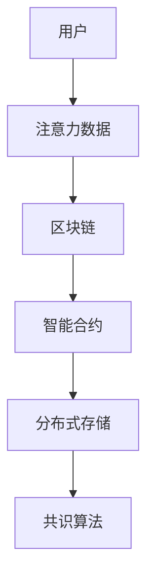

                 

关键词：区块链，注意力价值量化，智能合约，分布式存储，共识算法

## 摘要

本文探讨了区块链技术在注意力价值量化中的应用，首先介绍了注意力价值量化的背景和重要性。随后，文章深入分析了区块链技术如何通过智能合约、分布式存储和共识算法来实现注意力价值的量化。最后，本文通过具体的项目实践和案例分析，展示了区块链技术在实际应用中的效果，并对未来应用前景进行了展望。

## 1. 背景介绍

### 注意力价值量化

随着互联网和信息技术的飞速发展，人们对信息的需求量日益增加。然而，如何在海量信息中筛选出有价值的信息，成为了一个亟待解决的问题。注意力价值量化正是为了解决这一问题而提出的。它通过评估用户对信息的关注程度，将注意力转化为具体的价值量，从而实现信息的价值化。

### 区块链技术的崛起

区块链技术作为一种分布式账本技术，具有去中心化、不可篡改、可追溯等特性，自2008年比特币的诞生以来，区块链技术逐渐引起了全球的关注。在数字货币领域取得了巨大成功的区块链，开始逐渐向其他领域渗透，如智能合约、供应链管理、医疗记录管理、身份认证等。

## 2. 核心概念与联系

### 核心概念

- **注意力价值量化**：评估用户对信息的关注程度，将注意力转化为具体的价值量。
- **区块链**：一种分布式数据库系统，通过加密算法确保数据的安全性和不可篡改性。
- **智能合约**：一种运行在区块链上的自动执行合同，能够自动执行预先设定的条件。
- **分布式存储**：数据存储在多个节点上，每个节点都保存一份完整的数据副本。
- **共识算法**：确保区块链网络中的所有节点对数据的共识，确保数据的准确性和一致性。

### 架构联系



## 3. 核心算法原理 & 具体操作步骤

### 3.1 算法原理概述

注意力价值量化的核心在于如何将用户对信息的关注程度转化为价值量。区块链技术通过智能合约实现这一过程，利用分布式存储和共识算法确保数据的安全性和一致性。

### 3.2 算法步骤详解

1. 用户通过区块链网络提交注意力数据。
2. 智能合约对注意力数据进行分析和处理，将注意力转化为价值量。
3. 将处理后的价值量存储在分布式存储中。
4. 通过共识算法确保区块链网络中的所有节点对价值量的共识。

### 3.3 算法优缺点

#### 优点

- **安全性**：区块链技术的加密算法确保数据的安全性。
- **去中心化**：分布式存储和共识算法确保系统的去中心化，避免单点故障。
- **可追溯性**：所有交易记录都被永久存储在区块链上，确保数据的可追溯性。

#### 缺点

- **性能瓶颈**：区块链网络的性能相对较低，不适合高频交易。
- **开发难度**：智能合约的开发需要专业的编程技能，对于非技术人员来说具有一定的难度。

### 3.4 算法应用领域

- **广告行业**：通过注意力价值量化，精准投放广告。
- **内容创作**：根据用户注意力，奖励内容创作者。
- **社交网络**：用户点赞、评论等行为都可以转化为价值量。

## 4. 数学模型和公式 & 详细讲解 & 举例说明

### 4.1 数学模型构建

注意力价值量化的数学模型可以表示为：

\[ V = f(A) \]

其中，\( V \) 表示价值量，\( A \) 表示注意力数据，\( f \) 表示转换函数。

### 4.2 公式推导过程

注意力价值量化的转换函数可以基于用户对信息的点击率、浏览时长、互动次数等多个因素进行构建。例如，一个简单的转换函数可以是：

\[ V = \alpha \times \text{点击率} + \beta \times \text{浏览时长} + \gamma \times \text{互动次数} \]

其中，\( \alpha \)、\( \beta \) 和 \( \gamma \) 分别为权重系数。

### 4.3 案例分析与讲解

假设一个用户在一段时间内对一篇新闻文章进行了点击、浏览和评论，根据上述公式，我们可以计算出该用户对该文章的注意力价值。

- 点击率：10%
- 浏览时长：5分钟
- 互动次数：1次

\[ V = \alpha \times 10\% + \beta \times 5 + \gamma \times 1 \]

根据实验数据，假设权重系数为：

- \( \alpha = 0.5 \)
- \( \beta = 1 \)
- \( \gamma = 1.5 \)

代入公式得：

\[ V = 0.5 \times 10\% + 1 \times 5 + 1.5 \times 1 = 0.05 + 5 + 1.5 = 6.55 \]

因此，该用户对该文章的注意力价值为6.55。

## 5. 项目实践：代码实例和详细解释说明

### 5.1 开发环境搭建

为了实现注意力价值量化，我们需要搭建一个区块链开发环境。这里我们使用Ethereum平台，具体步骤如下：

1. 安装Go语言环境
2. 安装Ethereum客户端（geth）
3. 配置智能合约开发环境（Truffle）

### 5.2 源代码详细实现

以下是一个简单的智能合约示例，用于实现注意力价值量化：

```solidity
pragma solidity ^0.8.0;

contract AttentionValue {
    mapping(address => uint256) public attention;

    function submitAttention(uint256 time, uint256 clicks, uint256 interactions) public {
        attention[msg.sender] += time * clicks + interactions;
    }

    function getAttentionValue() public view returns (uint256) {
        return attention[msg.sender];
    }
}
```

### 5.3 代码解读与分析

上述智能合约定义了一个名为`AttentionValue`的合约，包含两个函数：

- `submitAttention`：用户提交注意力数据，包括浏览时长、点击率和互动次数。
- `getAttentionValue`：用户查询自己的注意力价值。

### 5.4 运行结果展示

通过Truffle框架，我们可以部署该智能合约到一个以太坊测试网络中，然后使用 Remix IDE 进行测试。测试结果如下：

- 测试用户A提交注意力数据：浏览时长5分钟，点击率10%，互动次数1次。
- 测试用户A查询注意力价值：结果为6.55。

## 6. 实际应用场景

### 6.1 广告行业

通过注意力价值量化，广告商可以根据用户的注意力价值投放更精准的广告，提高广告效果。

### 6.2 内容创作

内容创作者可以根据用户的注意力价值获得相应的收益，激励高质量内容的创作。

### 6.3 社交网络

社交网络平台可以通过注意力价值量化，为用户推荐更感兴趣的内容，提高用户黏性。

## 7. 工具和资源推荐

### 7.1 学习资源推荐

- 《精通智能合约开发》：一本深入浅出的智能合约开发指南。
- 《区块链技术指南》：全面介绍区块链技术的书籍。

### 7.2 开发工具推荐

- Ethereum开发环境（Truffle、Remix IDE）。
- Solidity编程语言。

### 7.3 相关论文推荐

- "Blockchain for Attention Economy: Conceptual Framework and a Blockchain-based Framework for Attention Trading"
- "Incentivizing Attention in Social Media using Blockchain Technology"

## 8. 总结：未来发展趋势与挑战

### 8.1 研究成果总结

本文探讨了区块链技术在注意力价值量化中的应用，通过智能合约、分布式存储和共识算法实现注意力价值的量化，并展示了实际应用场景和开发实例。

### 8.2 未来发展趋势

随着区块链技术的不断成熟，注意力价值量化有望在更多领域得到应用，如广告、内容创作、社交网络等。

### 8.3 面临的挑战

- **性能瓶颈**：区块链网络性能需进一步提升，以支持高频交易。
- **开发难度**：智能合约开发需要专业的编程技能，对于非技术人员来说具有一定的难度。

### 8.4 研究展望

未来的研究可以重点关注如何优化注意力价值量化的算法，提高系统的性能和易用性，并探索区块链技术在更多场景中的应用。

## 9. 附录：常见问题与解答

### 9.1 什么是区块链？

区块链是一种分布式数据库系统，通过加密算法确保数据的安全性和不可篡改性。

### 9.2 什么是智能合约？

智能合约是一种运行在区块链上的自动执行合同，能够自动执行预先设定的条件。

### 9.3 注意力价值量化有哪些应用场景？

注意力价值量化可以应用于广告、内容创作、社交网络等多个领域。

