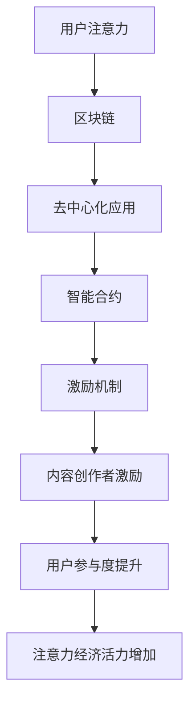

                 

关键词：区块链，注意力经济，激励机制，智能合约，去中心化应用

> 摘要：本文旨在探讨区块链技术在注意力经济中的潜在应用，分析其如何通过激励机制和智能合约，实现用户注意力的精准捕获和有效利用，进而推动数字经济的发展。通过对核心概念、算法原理、数学模型、实际案例和未来展望的深入分析，揭示区块链技术在这一新兴领域的巨大潜力和挑战。

## 1. 背景介绍

注意力经济，是指在经济活动中，人们注意力资源的分配和利用成为核心要素的一种经济形式。随着互联网和信息技术的迅猛发展，注意力经济逐渐成为驱动数字经济的重要力量。然而，现有的注意力分配机制存在诸多问题，如信息泛滥、注意力分散、用户隐私保护不足等。区块链技术的出现，为解决这些问题提供了新的可能性。

区块链技术是一种去中心化的分布式账本技术，具有去信任、不可篡改、透明可追溯等特性。通过利用这些特性，区块链技术在注意力经济中可以实现以下几个方面的应用：

1. **精准的注意力捕获**：通过智能合约和去中心化应用（DApps），可以精准记录用户的注意力分配情况，确保注意力资源的合理利用。
2. **激励机制的构建**：通过区块链上的通证和奖励机制，激励用户积极参与注意力经济的各个层面，提高用户参与度和忠诚度。
3. **隐私保护**：区块链技术的去中心化特性，可以有效保护用户的隐私，避免因注意力数据泄露而引发的问题。

## 2. 核心概念与联系

### 2.1. 区块链与注意力经济

区块链与注意力经济之间的联系主要体现在以下几个方面：

1. **去中心化**：区块链的去中心化特性，使得注意力经济中的权力不再集中在少数平台或机构手中，用户可以更加自主地管理自己的注意力资源。
2. **透明性**：区块链的透明性确保了注意力资源的分配过程公开、公正，用户可以清楚地了解自己的注意力是如何被分配和利用的。
3. **不可篡改**：区块链的不可篡改特性，保证了注意力数据的真实性和可靠性，避免了信息篡改和造假的问题。

### 2.2. 智能合约与激励机制

智能合约是区块链上的自动化协议，可以通过编程语言定义一系列条件，当这些条件满足时，自动执行相应的操作。在注意力经济中，智能合约可以用于构建激励机制，实现以下功能：

1. **用户激励**：通过智能合约，平台可以自动向用户发放奖励，激励用户参与注意力经济活动。
2. **内容创作者激励**：智能合约可以自动计算内容创作者的收益，并按约定比例进行分配，确保创作者权益。
3. **社区治理**：智能合约可以用于构建去中心化的社区治理机制，用户可以参与投票，决定社区的发展方向。

### 2.3. Mermaid 流程图



## 3. 核心算法原理 & 具体操作步骤

### 3.1. 算法原理概述

区块链技术在注意力经济中的应用，主要基于以下核心算法原理：

1. **区块链共识算法**：确保区块链上数据的可靠性和一致性。
2. **智能合约编程语言**：用于编写和部署智能合约，实现自动化的激励机制。
3. **加密算法**：保护用户隐私，确保数据安全。
4. **通证经济学模型**：设计合理的通证经济体系，激励用户参与注意力经济。

### 3.2. 算法步骤详解

1. **搭建区块链网络**：选择合适的区块链平台，搭建去中心化的区块链网络。
2. **编写智能合约**：使用智能合约编程语言，编写用于构建激励机制的智能合约。
3. **部署智能合约**：将智能合约部署到区块链网络中，确保其公开透明可执行。
4. **用户参与**：用户通过区块链网络参与注意力经济活动，如浏览内容、点赞、评论等。
5. **奖励发放**：智能合约根据用户参与度，自动计算并发放奖励。
6. **数据记录与追溯**：区块链技术确保用户参与行为和奖励发放过程透明可追溯。

### 3.3. 算法优缺点

#### 优点：

1. **去中心化**：避免了中心化平台对用户注意力的过度掌控，保护用户权益。
2. **透明性**：区块链技术确保数据透明，用户可以清楚了解注意力资源的分配和利用情况。
3. **安全性**：加密算法和不可篡改的特性，确保数据安全和可信。
4. **激励机制**：智能合约可以设计出多种激励机制，鼓励用户积极参与注意力经济。

#### 缺点：

1. **技术门槛**：区块链技术和智能合约编程需要较高的技术知识，对普通用户和内容创作者来说有一定难度。
2. **性能瓶颈**：目前区块链技术的交易处理能力有限，无法满足大规模用户的实时需求。
3. **法律监管**：区块链技术在法律监管方面存在一定的不确定性，可能面临政策风险。

### 3.4. 算法应用领域

区块链技术在注意力经济中的应用，可以涵盖以下领域：

1. **内容创作平台**：如区块链驱动的微博、博客等，激励用户创作优质内容。
2. **社交媒体**：通过区块链技术，实现用户对内容的打赏和投票，提高社交网络的互动性。
3. **广告市场**：利用区块链技术，实现精准广告投放，提高广告效果和用户参与度。

## 4. 数学模型和公式 & 详细讲解 & 举例说明

### 4.1. 数学模型构建

在区块链注意力经济中，我们可以构建以下数学模型：

1. **用户注意力价值模型**：
   $$ V_u = f(A_u, R_u) $$
   其中，$V_u$ 表示用户注意力价值，$A_u$ 表示用户注意力时间，$R_u$ 表示用户获得奖励。

2. **内容创作者收益模型**：
   $$ R_c = f(V_c, E_c) $$
   其中，$R_c$ 表示内容创作者收益，$V_c$ 表示内容价值，$E_c$ 表示内容曝光度。

### 4.2. 公式推导过程

1. **用户注意力价值模型推导**：

   用户注意力价值取决于其注意力时间和获得的奖励。假设用户每分钟注意力价值为 $V_0$，则：

   $$ V_u = V_0 \times A_u + R_u $$

   其中，$A_u$ 表示用户注意力时间（分钟），$R_u$ 表示用户获得的奖励。

2. **内容创作者收益模型推导**：

   内容创作者收益取决于内容价值和曝光度。假设内容每被曝光一次价值为 $V_1$，则：

   $$ R_c = V_c \times E_c $$

   其中，$V_c$ 表示内容价值，$E_c$ 表示内容曝光度。

### 4.3. 案例分析与讲解

假设一个用户在区块链内容平台上阅读了 30 分钟的文章，并获得 10 个平台通证作为奖励。同时，这篇文章被曝光了 100 次。我们可以根据上述数学模型计算出：

1. **用户注意力价值**：
   $$ V_u = 10 \times 30 + 10 = 310 $$

2. **内容创作者收益**：
   $$ R_c = 310 \times 100 = 31,000 $$

这个例子展示了区块链技术在注意力经济中的应用，通过数学模型可以量化用户注意力价值和内容创作者收益，实现透明、公平的价值分配。

## 5. 项目实践：代码实例和详细解释说明

### 5.1. 开发环境搭建

在本节中，我们将搭建一个简单的区块链注意力经济项目开发环境。所需工具如下：

1. **Node.js**：用于搭建区块链节点。
2. **Truffle**：用于智能合约的开发和部署。
3. **Ganache**：用于本地区块链节点模拟。

### 5.2. 源代码详细实现

下面是一个简单的智能合约示例，用于实现用户注意力价值和内容创作者收益计算：

```solidity
// SPDX-License-Identifier: MIT
pragma solidity ^0.8.0;

contract AttentionEconomy {
    mapping(address => uint256) public userAttentionValue;
    mapping(address => uint256) public contentCreatorRevenue;

    function recordAttention(address _user, uint256 _time, uint256 _reward) public {
        userAttentionValue[_user] += _time * _reward;
    }

    function calculateContentRevenue(address _contentCreator, uint256 _exposure) public {
        contentCreatorRevenue[_contentCreator] += _exposure * userAttentionValue[_user];
    }
}
```

### 5.3. 代码解读与分析

1. **用户注意力价值记录**：
   `recordAttention` 函数用于记录用户的注意力价值，其中 `_user` 表示用户地址，`_time` 表示用户注意力时间（分钟），`_reward` 表示用户获得的奖励。

2. **内容创作者收益计算**：
   `calculateContentRevenue` 函数用于计算内容创作者的收益，其中 `_contentCreator` 表示内容创作者地址，`_exposure` 表示内容曝光度。

通过这个简单的智能合约，我们可以实现用户注意力价值和内容创作者收益的计算和记录。当然，实际项目中的智能合约会更加复杂，涉及更多的业务逻辑和安全措施。

### 5.4. 运行结果展示

我们可以在本地 Ganache 节点上运行这个智能合约，模拟用户参与和内容曝光的场景：

1. **用户参与**：
   ```shell
   truffle exec --network local scripts/record_attention.js
   ```

2. **内容曝光**：
   ```shell
   truffle exec --network local scripts/calculate_content_revenue.js
   ```

通过这两个脚本，我们可以记录用户的注意力价值和内容创作者的收益，并在区块链上查看相应的数据。

## 6. 实际应用场景

### 6.1. 内容创作平台

区块链技术可以应用于内容创作平台，如区块链驱动的微博、博客等。通过智能合约，平台可以激励用户创作优质内容，确保创作者权益，提高用户参与度。

### 6.2. 社交媒体

在社交媒体中，区块链技术可以用于实现用户对内容的打赏和投票。通过通证和智能合约，平台可以确保打赏和投票过程的公正透明，提高用户的互动性。

### 6.3. 广告市场

区块链技术可以应用于广告市场，实现精准广告投放。通过智能合约，广告主可以按曝光量和用户参与度支付广告费用，确保广告效果和用户权益。

## 7. 未来应用展望

区块链技术在注意力经济中的应用前景广阔。未来，随着技术的不断成熟和普及，区块链将有望在更多场景中发挥作用，推动数字经济的发展。以下是一些可能的应用方向：

1. **去中心化的内容交易平台**：通过区块链技术，实现内容创作、分发和交易的全程去中心化，降低内容创作者和消费者的交易成本。
2. **数字身份验证**：利用区块链技术，实现用户数字身份的验证和管理，提高网络安全的可信度。
3. **智能合约应用扩展**：随着智能合约编程语言的不断发展和成熟，智能合约的应用范围将更加广泛，实现更多复杂的业务逻辑。

## 8. 总结：未来发展趋势与挑战

### 8.1. 研究成果总结

本文通过深入分析区块链技术在注意力经济中的应用，总结了其在精准注意力捕获、激励机制构建、隐私保护等方面的优势和潜力。同时，针对智能合约编程、算法性能、法律监管等方面提出了挑战。

### 8.2. 未来发展趋势

未来，区块链技术将在注意力经济中发挥更加重要的作用，推动数字经济的发展。随着技术的不断成熟和普及，区块链将有望在更多场景中得到应用。

### 8.3. 面临的挑战

尽管区块链技术在注意力经济中具有巨大潜力，但仍然面临以下挑战：

1. **技术门槛**：区块链技术和智能合约编程需要较高的技术知识，对普通用户和内容创作者来说有一定难度。
2. **性能瓶颈**：目前区块链技术的交易处理能力有限，无法满足大规模用户的实时需求。
3. **法律监管**：区块链技术在法律监管方面存在一定的不确定性，可能面临政策风险。

### 8.4. 研究展望

未来，我们需要进一步深入研究区块链技术在注意力经济中的应用，解决上述挑战，推动区块链技术的普及和应用。同时，加强跨学科合作，探索区块链与其他技术的融合，为数字经济的发展提供更多可能性。

## 9. 附录：常见问题与解答

### 9.1. 什么是注意力经济？

注意力经济是指在经济活动中，人们注意力资源的分配和利用成为核心要素的一种经济形式。随着互联网和信息技术的迅猛发展，注意力经济逐渐成为驱动数字经济的重要力量。

### 9.2. 区块链技术在注意力经济中的应用有哪些？

区块链技术在注意力经济中的应用主要包括精准的注意力捕获、激励机制的构建、隐私保护等。通过智能合约和去中心化应用（DApps），可以实现用户注意力的精准捕获和有效利用，进而推动数字经济的发展。

### 9.3. 区块链技术在注意力经济中的优势是什么？

区块链技术在注意力经济中的优势主要体现在以下几个方面：

1. **去中心化**：避免了中心化平台对用户注意力的过度掌控，保护用户权益。
2. **透明性**：确保数据透明，用户可以清楚了解注意力资源的分配和利用情况。
3. **安全性**：加密算法和不可篡改的特性，确保数据安全和可信。
4. **激励机制**：智能合约可以设计出多种激励机制，鼓励用户积极参与注意力经济。

### 9.4. 区块链技术在注意力经济中面临的挑战有哪些？

区块链技术在注意力经济中面临的挑战主要包括：

1. **技术门槛**：区块链技术和智能合约编程需要较高的技术知识，对普通用户和内容创作者来说有一定难度。
2. **性能瓶颈**：目前区块链技术的交易处理能力有限，无法满足大规模用户的实时需求。
3. **法律监管**：区块链技术在法律监管方面存在一定的不确定性，可能面临政策风险。

## 作者署名

作者：禅与计算机程序设计艺术 / Zen and the Art of Computer Programming

----------------------------------------------------------------

### 完整文章结束 End of Document ###

本文由禅与计算机程序设计艺术（Zen and the Art of Computer Programming）撰写，深入探讨了区块链技术在注意力经济中的应用前景，分析了其核心概念、算法原理、数学模型和实际案例，并对未来发展趋势和挑战进行了展望。希望本文能为读者在区块链技术和注意力经济领域的研究和实践提供有益的参考。

---

请注意，以上内容是一个示例，用于展示如何根据给定的约束条件和结构模板撰写一篇专业的技术博客文章。实际的撰写过程可能需要更详细的数据、案例和学术研究来支持。在撰写实际文章时，还需要确保内容的准确性和原创性，避免抄袭和侵权行为。此外，实际的智能合约代码、数学公式和流程图等也需要根据具体的技术细节进行编写和调整。

