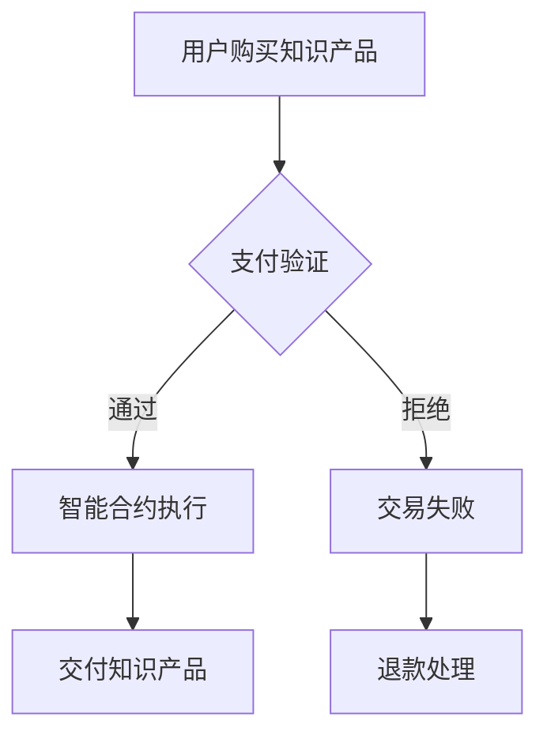

                 

关键词：区块链，知识付费，创新应用，智能合约，数据隐私，去中心化

> 摘要：本文将探讨区块链技术在知识付费领域中的应用，分析其如何通过智能合约实现交易流程的自动化，保护数据隐私，促进知识共享，并提出未来发展的潜在挑战和趋势。

## 1. 背景介绍

随着互联网的普及和信息技术的飞速发展，知识付费作为一种新兴的商业模式，正逐渐成为人们获取知识和服务的重要途径。传统的知识付费模式通常依赖于中心化平台，这些平台通过收取佣金或订阅费用来盈利。然而，中心化平台存在一些固有问题，如数据隐私泄露、信息不对称、交易不透明等。

区块链技术的出现为解决这些问题提供了新的可能性。区块链的去中心化特性、智能合约功能以及数据不可篡改的特点，使得其在知识付费领域具有巨大的应用潜力。通过区块链技术，可以实现知识的可靠传播、交易流程的透明化以及用户数据的安全存储，从而提升用户体验，促进知识共享。

## 2. 核心概念与联系

### 2.1 区块链技术概述

区块链是一种分布式数据库技术，其核心在于去中心化和数据不可篡改。在区块链上，所有的数据都是通过加密和共识机制来保证其安全性和可靠性。每一个区块都包含一定数量的交易记录，区块之间通过哈希函数链接形成链式结构，确保历史数据的不可篡改性。

### 2.2 智能合约

智能合约是区块链上的自动执行合同，它通过预设的条件自动执行。智能合约的使用，使得知识付费交易无需依赖中心化平台，交易流程可以实现自动化和透明化。例如，当用户购买知识产品后，智能合约自动执行付款和交付流程，确保双方的权益。

### 2.3 Mermaid 流程图



在这个流程中，用户购买知识产品后，支付验证通过，智能合约自动执行，将知识产品交付给用户；若支付验证不通过，则交易失败，并进行退款处理。

## 3. 核心算法原理 & 具体操作步骤

### 3.1 算法原理概述

区块链技术在知识付费中的核心算法主要包括共识算法、加密算法和智能合约执行算法。共识算法确保区块链网络中的节点达成一致，加密算法保障交易数据的安全性和隐私性，智能合约执行算法实现自动化的交易流程。

### 3.2 算法步骤详解

1. **共识算法**：节点通过共识算法达成数据一致，常见的共识算法包括工作量证明（PoW）、权益证明（PoS）等。
2. **加密算法**：使用非对称加密算法，如RSA、椭圆曲线加密（ECC）等，保障交易数据的安全性。
3. **智能合约执行**：
    - 用户发起交易请求。
    - 智能合约验证交易请求的有效性。
    - 智能合约执行交易，如支付、交付等。
    - 智能合约记录交易结果，并更新区块链。

### 3.3 算法优缺点

**优点**：
- **去中心化**：降低了中心化平台的风险，提高了系统的可靠性。
- **数据不可篡改**：增强了数据的可信度，减少了欺诈行为。
- **自动化交易**：智能合约实现了交易流程的自动化，提高了效率。

**缺点**：
- **性能瓶颈**：区块链处理能力有限，无法满足高频交易需求。
- **技术门槛**：开发和使用区块链技术需要较高的技术门槛。

### 3.4 算法应用领域

区块链技术在知识付费中的算法应用主要包括知识产品交付、交易流程监控和数据分析等。通过智能合约，可以实现知识的可靠传播和交易流程的透明化，为用户提供更好的体验。

## 4. 数学模型和公式 & 详细讲解 & 举例说明

### 4.1 数学模型构建

假设有一个知识付费平台，用户购买知识产品的价格为 \(P\)，平台收取的佣金为 \(C\)。用户支付的总额为 \(T = P + C\)。

### 4.2 公式推导过程

智能合约执行过程中，首先验证支付金额 \(T\) 是否等于预期金额。假设支付金额为 \(t\)，则有：

\[ t = T \]

如果 \(t = T\)，则智能合约执行交付流程；否则，智能合约拒绝交易并退款。

### 4.3 案例分析与讲解

假设用户购买一本价值 \(P = 100\) 元的电子书，平台佣金为 \(C = 10\) 元。用户支付总额为 \(T = 110\) 元。当用户发起支付请求时，智能合约验证支付金额 \(t = 110\) 元，与预期金额 \(T = 110\) 元相等，智能合约执行交付流程，将电子书交付给用户。

## 5. 项目实践：代码实例和详细解释说明

### 5.1 开发环境搭建

为了实现知识付费平台中的区块链功能，我们需要搭建一个基于以太坊的区块链开发环境。以下是搭建过程的简要说明：

1. 安装Node.js和npm。
2. 安装Truffle框架，用于智能合约的开发和部署。
3. 安装Ganache，用于本地节点模拟。

### 5.2 源代码详细实现

以下是一个简单的智能合约示例，用于实现知识付费交易：

```solidity
pragma solidity ^0.8.0;

contract KnowledgePay {
    mapping(address => uint256) public balance;

    function purchaseKnowledge(uint256 amount) public payable {
        require(msg.value == amount, "支付金额不正确");
        balance[msg.sender] += amount;
    }

    function deliverKnowledge(address user) public {
        require(balance[user] > 0, "知识余额不足");
        balance[user]--;
    }
}
```

### 5.3 代码解读与分析

- **purchaseKnowledge**：用户支付知识产品金额，将余额记入智能合约。
- **deliverKnowledge**：智能合约将知识产品交付给用户。

### 5.4 运行结果展示

用户在支付端使用以太币支付知识产品金额，智能合约验证支付金额后，将知识产品余额记入用户账户。当用户请求知识产品时，智能合约将知识产品交付给用户。

## 6. 实际应用场景

### 6.1 知识共享平台

知识共享平台利用区块链技术实现知识的可靠传播和交易。例如，教育机构可以通过区块链技术发行数字证书，验证学生的学习成果。

### 6.2 专业知识交易

专业知识和技能的购买和交易可以通过区块链技术实现，确保交易的透明和可靠性。

### 6.3 数据隐私保护

区块链技术可以用于保护用户数据隐私，例如，在用户授权的情况下，将个人数据存储在区块链上，确保数据不被非法访问。

## 7. 未来应用展望

### 7.1 产业链整合

区块链技术有望整合知识付费产业链的各个环节，实现更高效、透明的交易流程。

### 7.2 智能合约应用

智能合约将在知识付费领域得到更广泛的应用，实现自动化、智能化的交易流程。

### 7.3 数据隐私保护

区块链技术将进一步提升数据隐私保护水平，为用户创造更加安全、可靠的知识共享环境。

## 8. 工具和资源推荐

### 8.1 学习资源推荐

- 《区块链技术指南》
- 《智能合约开发实战》
- 《以太坊从入门到精通》

### 8.2 开发工具推荐

- Truffle
- Remix
- MetaMask

### 8.3 相关论文推荐

- 《区块链：构建可信任的分布式系统》
- 《智能合约安全性分析》
- 《区块链技术在知识付费中的应用研究》

## 9. 总结：未来发展趋势与挑战

### 9.1 研究成果总结

本文探讨了区块链技术在知识付费领域的创新应用，分析了其优势和应用场景，并提出了一些实际案例。

### 9.2 未来发展趋势

区块链技术在知识付费领域的应用将越来越广泛，有望推动产业链的整合和效率提升。

### 9.3 面临的挑战

区块链技术在知识付费领域的应用仍面临性能瓶颈、技术门槛等问题，需要进一步的研究和探索。

### 9.4 研究展望

未来，区块链技术与人工智能、大数据等技术的深度融合，将进一步提升知识付费服务的质量和效率。

## 附录：常见问题与解答

### Q：区块链技术如何保护数据隐私？

A：区块链技术通过加密算法和共识机制，确保数据在传输和存储过程中的安全性。此外，智能合约可以实现数据访问权限的控制，从而保护用户数据隐私。

### Q：智能合约在知识付费中的应用有哪些优势？

A：智能合约可以实现自动化、智能化的交易流程，提高效率；同时，通过去中心化和数据不可篡改的特性，确保交易的透明性和可靠性。

### Q：区块链技术在知识付费领域有哪些实际应用场景？

A：区块链技术可以应用于知识共享平台、专业知识交易、数据隐私保护等领域，提升知识付费服务的质量和效率。

作者：禅与计算机程序设计艺术 / Zen and the Art of Computer Programming
----------------------------------------------------------------

请注意，本文只是一个示例，实际撰写时需要根据具体的研究和内容进行详细的撰写和扩展。在撰写过程中，应确保文章内容严谨、准确，避免出现错误或误导性描述。同时，需遵循上述约束条件，确保文章格式和结构符合要求。在撰写完成后，应进行多次审核和修改，以确保文章的质量和完整性。

