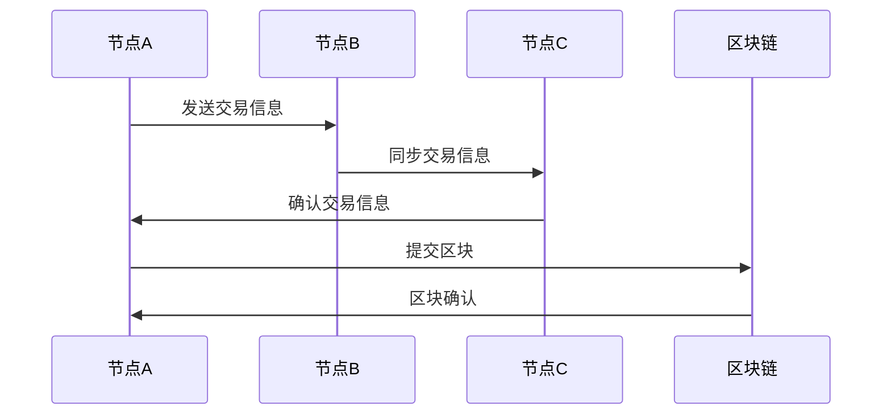
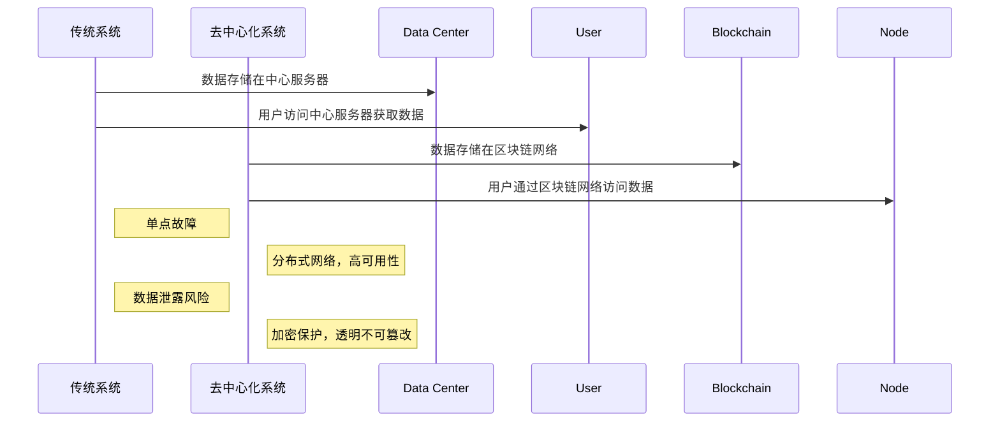

                 

关键词：区块链，去中心化应用，智能合约，加密货币，分布式系统

摘要：本文将深入探讨区块链技术的原理与应用，特别是去中心化应用（DApp）的开发。我们将从背景介绍入手，解释区块链的核心概念，并展示其与传统系统的对比。接着，我们将详细描述智能合约的工作原理，并提供具体的开发步骤。此外，文章还将探讨区块链的数学模型和实际应用场景，并通过实例说明如何进行代码实现和运行结果展示。最后，我们将展望区块链技术的未来发展趋势与挑战，并推荐相关学习资源和开发工具。

## 1. 背景介绍

区块链技术起源于比特币的诞生，自2008年由中本聪（Satoshi Nakamoto）首次提出以来，它已经从一种单一的数字货币演变成一种广泛认可的分布式账本技术。区块链技术通过去中心化的方式解决了传统集中式系统中的信任问题，使得数据的存储和传输更加安全、透明和不可篡改。

去中心化应用（DApp）是区块链技术的核心应用之一。与传统的应用程序不同，DApp不依赖于中央服务器，而是通过区块链网络来实现功能。这种去中心化的架构不仅提高了系统的可靠性，还允许用户直接参与和应用互动，从而推动了数字经济的发展。

智能合约是DApp的关键组件，它是一种自动执行、管理和执行的计算机协议。智能合约通过编程语言编写，运行在区块链上，确保了合同的自动化执行和不可篡改性。智能合约的出现极大地提升了交易效率和透明度，成为区块链技术的亮点之一。

## 2. 核心概念与联系

### 区块链网络结构

区块链网络由多个节点组成，每个节点都存储一份完整的区块链账本。这些节点通过共识算法（如工作量证明PoW、权益证明PoS等）达成共识，确保账本的一致性。以下是一个简单的区块链网络结构的 Mermaid 流程图：



### 去中心化系统与传统系统的对比

传统系统通常依赖于中央服务器，数据存储和操作都由中央服务器控制。这使得系统容易受到单点故障、数据泄露和中心化攻击的威胁。相比之下，去中心化系统通过分布式网络和共识机制实现了更高的安全性和透明度。

以下是一个对比传统系统和去中心化系统的 Mermaid 流程图：



## 3. 核心算法原理 & 具体操作步骤

### 3.1 算法原理概述

区块链的核心算法包括共识算法、加密算法和智能合约语言。共识算法用于确保区块链网络中的节点达成共识，加密算法用于保护数据和交易的安全，智能合约语言则用于编写和执行智能合约。

### 3.2 算法步骤详解

#### 3.2.1 共识算法

共识算法是区块链网络的核心，它确保了区块链账本的一致性。以下是共识算法的一般步骤：

1. 节点接收交易信息。
2. 节点将交易信息打包成区块。
3. 节点尝试挖掘新的区块。
4. 成功挖掘新区块的节点广播新区块给其他节点。
5. 其他节点验证新区块的有效性。
6. 如果验证通过，其他节点接受新区块，区块链长度增加。

#### 3.2.2 加密算法

区块链中的加密算法主要包括哈希算法和数字签名。哈希算法用于确保数据的唯一性和完整性，数字签名用于验证交易的有效性。

1. 交易信息经过哈希算法生成哈希值。
2. 发送方使用私钥对哈希值进行数字签名。
3. 接收方使用公钥验证数字签名。

#### 3.2.3 智能合约语言

智能合约语言用于编写智能合约，常见的智能合约语言包括Solidity、Vyper和WebAssembly。以下是一个简单的Solidity智能合约示例：

```solidity
pragma solidity ^0.8.0;

contract SimpleContract {
    uint256 public balance;

    constructor() {
        balance = 100;
    }

    function deposit() public payable {
        balance += msg.value;
    }

    function withdraw(uint256 amount) public {
        require(amount <= balance, "余额不足");
        balance -= amount;
        payable(msg.sender).transfer(amount);
    }
}
```

### 3.3 算法优缺点

#### 优点

1. 去中心化：去中心化使得区块链系统不受单点故障和中心化攻击的影响。
2. 透明性：所有交易记录都公开透明，不可篡改。
3. 安全性：加密算法和共识算法确保了数据和交易的安全。

#### 缺点

1. 性能问题：区块链网络的处理速度相对较慢，难以满足大规模交易需求。
2. 能耗问题：某些共识算法（如PoW）消耗大量能源。

### 3.4 算法应用领域

区块链技术广泛应用于金融、供应链管理、医疗记录管理、身份验证等领域。其去中心化、透明和不可篡改的特性使得区块链成为解决传统系统问题的有效工具。

## 4. 数学模型和公式 & 详细讲解 & 举例说明

### 4.1 数学模型构建

区块链的数学模型主要包括哈希函数、工作量证明（PoW）和权益证明（PoS）等。以下是这些数学模型的构建和推导。

#### 哈希函数

哈希函数是将任意长度的输入数据映射为固定长度的输出数据的函数。常见的哈希函数包括MD5、SHA-256等。以下是一个简单的哈希函数示例：

$$
H(x) = SHA-256(x)
$$

#### 工作量证明（PoW）

工作量证明是一种用于区块链网络共识的算法，其目的是确保节点在提交区块前进行一定的计算工作量。以下是一个简化的工作量证明模型：

$$
PoW = \text{find } x \text{ such that } H(x) \leq target
$$

其中，`target`是一个预定义的值，`x`是节点进行计算的目标。

#### 权益证明（PoS）

权益证明是一种替代工作量证明的共识算法，其目的是减少能源消耗并提高网络的安全性。以下是一个简化的权益证明模型：

$$
PoS = \text{node's stake} \times \text{time period}
$$

其中，`node's stake`是节点的权益，`time period`是节点获得挖矿权益的时间段。

### 4.2 公式推导过程

#### 哈希函数推导

哈希函数的设计原则是确保输出值的分布均匀，并使输入数据的微小变化导致输出值的巨大变化。以下是一个简单的哈希函数推导过程：

1. 初始化：选择一个适当的初始化值。
2. 分块：将输入数据分成多个块。
3. 哈希迭代：对每个块进行哈希运算，并将结果与前一个块的哈希值进行合并。
4. 输出：将最终合并的哈希值作为输出。

#### 工作量证明推导

工作量证明的目标是确保节点在提交区块前进行一定的计算工作量。以下是一个简化的工作量证明推导过程：

1. 初始化：选择一个适当的`target`值。
2. 计算工作量：节点生成随机数`x`，并进行哈希运算。
3. 检查：如果`H(x)`小于`target`，则节点的工作量通过验证。
4. 重复：如果工作量的验证失败，节点继续生成新的随机数，直到工作量通过验证。

#### 权益证明推导

权益证明的目标是确保节点获得挖矿权益的概率与其权益成正比。以下是一个简化的权益证明推导过程：

1. 初始化：选择一个适当的权益比例。
2. 计算权益：每个节点根据其权益计算获得挖矿权益的概率。
3. 时间段：在每个时间段内，根据节点获得的挖矿权益进行区块的选择和验证。
4. 更新：在每个时间段结束后，更新节点的权益和权益比例。

### 4.3 案例分析与讲解

#### 哈希函数应用

哈希函数在区块链中广泛应用于确保数据的唯一性和完整性。以下是一个简单的哈希函数应用案例：

1. 交易信息：一个包含付款人和收款人地址、金额等信息的交易。
2. 哈希运算：对交易信息进行SHA-256哈希运算。
3. 存储与验证：将哈希值存储在区块链中，并在验证交易时使用哈希值确保数据的完整性。

#### 工作量证明应用

工作量证明在区块链网络中用于确保区块的生成速度和安全性。以下是一个简化的工作量证明应用案例：

1. 初始化：网络初始化时，选择一个适当的`target`值。
2. 计算工作量：节点生成随机数`x`，并进行SHA-256哈希运算。
3. 验证：如果`H(x)`小于`target`，则节点的工作量通过验证，可以提交新区块。
4. 挖矿奖励：成功挖矿的节点获得一定的挖矿奖励，用于激励节点参与网络维护。

#### 权益证明应用

权益证明在区块链网络中用于确保挖矿权益的公平性和安全性。以下是一个简化的权益证明应用案例：

1. 初始化：网络初始化时，选择一个适当的权益比例。
2. 计算权益：每个节点根据其权益计算获得挖矿权益的概率。
3. 时间段：在每个时间段内，根据节点获得的挖矿权益进行区块的选择和验证。
4. 更新：在每个时间段结束后，更新节点的权益和权益比例，确保权益分配的公平性。

## 5. 项目实践：代码实例和详细解释说明

### 5.1 开发环境搭建

为了进行去中心化应用（DApp）的开发，我们需要搭建一个适合开发的区块链环境。以下是搭建区块链开发环境的步骤：

1. 安装Node.js：从官方网站（[https://nodejs.org/](https://nodejs.org/)）下载并安装Node.js。
2. 安装Truffle框架：使用npm命令安装Truffle框架。

   ```
   npm install -g truffle
   ```

3. 创建一个新的Truffle项目：

   ```
   truffle init
   ```

4. 安装Ganache：下载并安装Ganache，这是一个用于本地测试的以太坊节点。

### 5.2 源代码详细实现

我们使用Truffle框架创建一个简单的智能合约，并将其部署到Ganache本地测试网络。以下是源代码实现：

```solidity
pragma solidity ^0.8.0;

contract SimpleContract {
    uint256 public balance;

    constructor() {
        balance = 100;
    }

    function deposit() public payable {
        balance += msg.value;
    }

    function withdraw(uint256 amount) public {
        require(amount <= balance, "余额不足");
        balance -= amount;
        payable(msg.sender).transfer(amount);
    }
}
```

### 5.3 代码解读与分析

上述代码定义了一个简单的智能合约`SimpleContract`，其具有以下功能：

- `balance`：存储合约的余额。
- `constructor()`：合约构造函数，初始化`balance`为100。
- `deposit()`：接收以太币并将其添加到合约余额中。
- `withdraw()`：从合约余额中提取以太币，并转给发送者。

### 5.4 运行结果展示

1. 启动Ganache本地测试网络。

   ```
   truffle run migrate --network development
   ```

2. 使用Truffle框架连接到本地测试网络。

   ```
   truffle console
   ```

3. 在Truffle控制台执行以下命令进行测试：

   ```javascript
   let contractInstance = await SimpleContract.deployed();
   await contractInstance.deposit({value: 10});
   console.log(await contractInstance.balance());
   await contractInstance.withdraw(10);
   console.log(await contractInstance.balance());
   ```

   运行结果将显示合约余额的变化。

## 6. 实际应用场景

区块链技术具有广泛的应用场景，以下是一些典型的实际应用场景：

- **金融领域**：区块链技术被广泛应用于金融交易、支付、结算等领域。其去中心化和不可篡改的特性提高了金融系统的效率和安全性。
- **供应链管理**：区块链技术可以用于供应链管理，确保产品和原材料的来源可追溯，从而提高供应链的透明度和可靠性。
- **医疗记录管理**：区块链技术可以用于存储和共享医疗记录，确保数据的完整性和隐私性。
- **身份验证**：区块链技术可以用于身份验证和数字签名，确保用户身份的真实性和安全性。

### 6.4 未来应用展望

随着区块链技术的不断发展和成熟，未来它在各个领域的应用前景将更加广阔。以下是一些未来应用展望：

- **智能城市**：区块链技术可以用于智能城市的建设，实现城市管理的去中心化和智能化。
- **数字身份**：区块链技术可以用于创建数字身份，提高个人隐私保护和数据安全性。
- **物联网**：区块链技术可以与物联网（IoT）结合，实现设备间的安全通信和智能协同。

## 7. 工具和资源推荐

### 7.1 学习资源推荐

- **区块链入门书籍**：
  - 《精通比特币》（Mastering Bitcoin）
  - 《区块链：从数字货币到智能合约》（Blockchain: Blueprint for a New Economy）

- **区块链在线课程**：
  - Coursera上的《区块链革命》（Blockchain Revolution）
  - Udemy上的《以太坊和智能合约开发》（Ethereum and Smart Contract Development）

### 7.2 开发工具推荐

- **区块链开发框架**：
  - Truffle：用于以太坊智能合约开发和部署。
  - Geth：以太坊客户端，用于节点搭建和测试。

- **区块链测试网络**：
  - Ganache：用于本地测试以太坊智能合约。
  - Ropsten Test Network：用于以太坊智能合约的测试网络。

### 7.3 相关论文推荐

- **区块链技术综述**：
  - "Bitcoin: A Peer-to-Peer Electronic Cash System"（比特币：一种点对点的电子现金系统）
  - "The Blockchain: Promise, Mechanism, and Limitation"（区块链：期望、机制和限制）

- **智能合约研究**：
  - "The Economics of Contracts: A Framework for Analysis"（合同经济学：分析框架）
  - "Formalizing and Analyzing Smart Contracts"（形式化和分析智能合约）

## 8. 总结：未来发展趋势与挑战

### 8.1 研究成果总结

区块链技术自诞生以来，已经在金融、供应链管理、医疗记录管理等领域取得了显著的成果。其去中心化、透明和不可篡改的特性使得区块链成为解决传统系统问题的有效工具。智能合约的出现进一步提升了区块链的应用价值，推动了数字经济的发展。

### 8.2 未来发展趋势

随着技术的不断进步和应用的深入，区块链技术在未来有望在以下领域取得更大的突破：

- **智能城市**：区块链技术可以用于智能城市的建设，实现城市管理的去中心化和智能化。
- **数字身份**：区块链技术可以用于创建数字身份，提高个人隐私保护和数据安全性。
- **物联网**：区块链技术可以与物联网（IoT）结合，实现设备间的安全通信和智能协同。

### 8.3 面临的挑战

尽管区块链技术具有巨大的应用潜力，但它在实际应用中也面临一些挑战：

- **性能问题**：区块链网络的处理速度相对较慢，难以满足大规模交易需求。
- **能源消耗**：某些共识算法（如PoW）消耗大量能源，导致环境问题。
- **安全性**：区块链系统的安全性仍然存在一定风险，需要进一步研究和改进。

### 8.4 研究展望

未来的区块链研究将致力于解决上述挑战，提升区块链的性能、安全性和可持续性。同时，区块链与其他技术的结合，如人工智能、物联网等，也将推动区块链技术的进一步发展。通过不断创新和优化，区块链有望成为下一代数字基础设施的核心技术。

## 9. 附录：常见问题与解答

### Q：区块链技术是否可以完全取代传统中心化系统？

A：区块链技术具有去中心化、透明和不可篡改的特性，在某些场景下可以取代传统中心化系统。然而，区块链技术并非适用于所有场景。在处理高并发、大规模数据的情况下，传统中心化系统可能更具优势。因此，区块链技术更适合作为传统系统的补充，而非完全替代。

### Q：智能合约存在漏洞怎么办？

A：智能合约的漏洞可能导致严重的安全问题。为避免漏洞，开发者在编写智能合约时需要严格遵循最佳实践，进行充分的安全测试和审计。此外，智能合约的安全研究也在不断进行，旨在提高智能合约的安全性。

### Q：区块链技术是否会导致隐私泄露？

A：区块链技术本身并不涉及隐私问题，因为所有交易记录都是公开透明的。然而，某些应用场景下，区块链数据的公开可能导致隐私泄露。为解决隐私问题，研究者们提出了多种隐私保护方案，如零知识证明、环签名等。

## 作者署名

作者：禅与计算机程序设计艺术 / Zen and the Art of Computer Programming

----------------------------------------------------------------

### 结论 Conclusion

区块链技术作为一种革命性的分布式系统，已经展示了其在金融、供应链管理、医疗记录管理等多个领域的广泛应用潜力。通过去中心化、透明和不可篡改的特性，区块链技术为解决传统系统的信任问题和效率问题提供了新的解决方案。本文从背景介绍、核心概念、算法原理、数学模型、实际应用和未来展望等多个角度详细阐述了区块链技术，并推荐了相关的学习资源和开发工具。随着区块链技术的不断发展和成熟，我们有理由相信，它将在未来继续发挥重要作用，推动数字经济和社会的发展。

