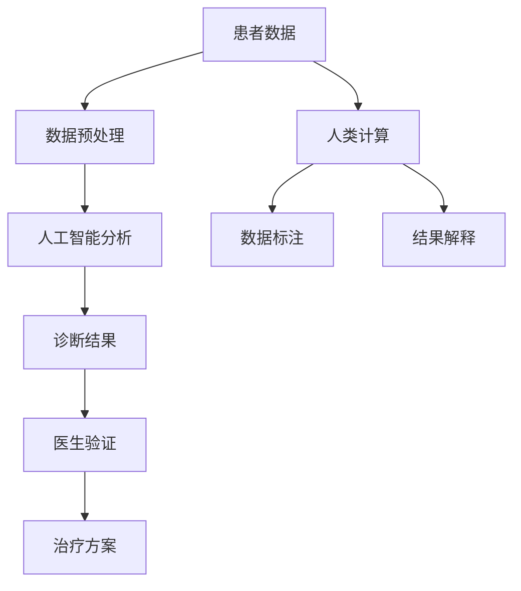

                 

关键词：医疗保健，精准医疗，人工智能，人类计算，深度学习，基因组学

> 摘要：随着医疗科技的飞速发展，医疗保健正逐渐从传统的经验医学向精准医疗转变。本文将探讨人类计算与人工智能在精准医疗领域的应用，分析现有技术及其发展前景，并提出未来可能面临的挑战与解决方案。

## 1. 背景介绍

医疗保健是关乎人类健康与福祉的重要领域，它随着社会进步和科技发展而不断变革。在过去，医疗主要依赖于医生的经验和医学知识，这种经验医学往往存在个体差异和主观判断的问题。然而，随着基因组学、生物信息学和人工智能技术的发展，医学研究开始转向以数据为基础的精准医疗。

精准医疗（Precision Medicine）是一种以个体为研究对象的医学模式，旨在通过分析个体的遗传信息、生活方式和环境因素，为其提供个性化的治疗方案。这种模式极大地提高了医疗的准确性和效率，成为现代医疗发展的一个重要方向。

### 1.1 医疗保健的现状

目前，医疗保健领域面临的主要挑战包括：

- **疾病诊断的准确性**：许多疾病的早期诊断仍然依赖于临床表现和实验室检测，存在一定误诊率。
- **药物研发的高成本**：新药研发需要大量的时间和资金投入，且成功率较低。
- **个体差异的治疗效果**：相同的治疗方案在不同患者身上效果可能大相径庭。

### 1.2 精准医疗的优势

精准医疗的兴起有望解决上述问题，其主要优势包括：

- **个性化治疗**：通过分析个体的基因组信息，为患者提供最适合的治疗方案。
- **疾病预测与预防**：早期发现疾病风险，进行干预，预防疾病发生。
- **减少药物副作用**：根据个体的基因组信息选择最合适的药物，减少不良反应。

## 2. 核心概念与联系

精准医疗的实现离不开人工智能和人类计算的支持。以下是这些概念及其相互关系的基本介绍。

### 2.1 人工智能

人工智能（Artificial Intelligence，AI）是指计算机系统模拟人类智能的过程。在医疗保健领域，人工智能主要用于：

- **疾病预测**：利用机器学习算法分析患者数据，预测疾病的发生风险。
- **辅助诊断**：通过图像识别等技术，辅助医生进行疾病的诊断。
- **个性化治疗**：基于患者的基因组信息，制定个性化的治疗方案。

### 2.2 人类计算

人类计算（Human Computation）是指利用人类智能解决计算机难以处理的问题。在精准医疗中，人类计算主要用于：

- **数据标注**：为机器学习模型提供高质量的训练数据。
- **解释与验证**：对人工智能的诊断结果进行解释和验证，确保其准确性。
- **患者互动**：通过自然语言处理等技术，与患者进行有效的沟通和互动。

### 2.3 Mermaid 流程图

下面是一个简要的 Mermaid 流程图，展示了人工智能和人类计算在精准医疗中的关系。



## 3. 核心算法原理 & 具体操作步骤

### 3.1 算法原理概述

在精准医疗中，常用的核心算法包括机器学习算法和深度学习算法。这些算法通过分析大量的患者数据，建立模型来预测疾病风险、辅助诊断和制定治疗方案。

### 3.2 算法步骤详解

以下是这些算法的基本步骤：

1. **数据收集**：收集患者的基因组数据、临床表现数据、生活方式数据等。
2. **数据预处理**：清洗和整合数据，为后续分析做准备。
3. **特征提取**：从原始数据中提取有用的特征，用于训练模型。
4. **模型训练**：使用机器学习算法训练模型，预测疾病风险和诊断结果。
5. **模型评估**：评估模型的性能，确保其准确性。
6. **模型部署**：将训练好的模型部署到实际应用中，为医生和患者提供支持。

### 3.3 算法优缺点

**机器学习算法**：

- **优点**：能够从大量数据中提取规律，具有自适应性和灵活性。
- **缺点**：对数据质量和数量要求较高，解释性较差。

**深度学习算法**：

- **优点**：能够处理复杂的数据结构，具有强大的特征学习能力。
- **缺点**：对计算资源要求较高，模型解释性较差。

### 3.4 算法应用领域

这些算法在医疗保健领域的应用包括：

- **疾病预测与预防**：利用算法预测疾病风险，进行早期干预。
- **辅助诊断**：辅助医生进行疾病诊断，提高诊断准确性。
- **个性化治疗**：根据患者的基因组信息，制定个性化的治疗方案。

## 4. 数学模型和公式 & 详细讲解 & 举例说明

### 4.1 数学模型构建

在精准医疗中，常用的数学模型包括逻辑回归、支持向量机（SVM）和神经网络等。以下是这些模型的基本数学公式：

**逻辑回归**：

$$
P(Y=1|X) = \frac{1}{1 + e^{-(\beta_0 + \sum_{i=1}^{n}\beta_i X_i})}
$$

**支持向量机（SVM）**：

$$
\max_{\beta, \beta^*} \frac{1}{2} ||\beta||^2 \quad \text{subject to} \quad y_i (\beta \cdot x_i + \beta^*) \geq 1
$$

**神经网络**：

$$
a_{\text{layer}} = \sigma(\beta_{\text{layer}} \cdot a_{\text{prev layer}} + b_{\text{layer}})
$$

### 4.2 公式推导过程

以逻辑回归为例，其推导过程如下：

假设我们有 $n$ 个特征 $X_1, X_2, \ldots, X_n$，目标变量 $Y$ 是二分类变量（0 或 1）。逻辑回归试图找到一组参数 $\beta_0, \beta_1, \ldots, \beta_n$，使得 $Y$ 与 $X$ 之间的关系可以用以下公式表示：

$$
\log \left(\frac{P(Y=1|X)}{1-P(Y=1|X)}\right) = \beta_0 + \beta_1 X_1 + \beta_2 X_2 + \ldots + \beta_n X_n
$$

通过取指数，我们得到：

$$
P(Y=1|X) = \frac{1}{1 + e^{-(\beta_0 + \sum_{i=1}^{n}\beta_i X_i})}
$$

### 4.3 案例分析与讲解

假设我们有一个疾病预测的案例，数据集包含患者的年龄、血压、胆固醇水平等特征，以及是否患有某种疾病的标签。我们可以使用逻辑回归模型来预测患者是否患有这种疾病。

首先，我们需要收集和整理数据，然后进行数据预处理。接下来，我们可以使用逻辑回归算法进行模型训练：

1. **数据收集**：收集患者的年龄、血压、胆固醇水平等数据。
2. **数据预处理**：将数据进行标准化处理，消除不同特征之间的尺度差异。
3. **特征提取**：从原始数据中提取有用的特征。
4. **模型训练**：使用训练数据集训练逻辑回归模型。
5. **模型评估**：使用验证数据集评估模型的性能，调整模型参数。
6. **模型部署**：将训练好的模型部署到实际应用中。

通过这个案例，我们可以看到，数学模型和算法在精准医疗中的应用，如何帮助我们更好地理解和预测疾病。

## 5. 项目实践：代码实例和详细解释说明

### 5.1 开发环境搭建

为了进行精准医疗的算法实践，我们需要搭建一个合适的开发环境。以下是一个基本的开发环境搭建步骤：

1. **安装 Python**：确保 Python 3.8 或更高版本已安装。
2. **安装库**：安装必要的 Python 库，如 NumPy、Pandas、Scikit-learn、Matplotlib 等。
3. **配置 Jupyter Notebook**：配置 Jupyter Notebook，以便进行代码编写和运行。

### 5.2 源代码详细实现

以下是一个简单的逻辑回归模型的 Python 代码实现：

```python
import numpy as np
import pandas as pd
from sklearn.linear_model import LogisticRegression
from sklearn.model_selection import train_test_split
from sklearn.metrics import accuracy_score, classification_report

# 1. 数据收集
data = pd.read_csv('patient_data.csv')

# 2. 数据预处理
X = data.drop('disease_label', axis=1)
y = data['disease_label']

# 3. 特征提取
#（这里不需要额外的特征提取，因为数据已经是处理过的）

# 4. 模型训练
X_train, X_test, y_train, y_test = train_test_split(X, y, test_size=0.2, random_state=42)
model = LogisticRegression()
model.fit(X_train, y_train)

# 5. 模型评估
predictions = model.predict(X_test)
accuracy = accuracy_score(y_test, predictions)
print(f'Accuracy: {accuracy}')
print(classification_report(y_test, predictions))
```

### 5.3 代码解读与分析

上述代码首先导入了必要的库，然后从 CSV 文件中读取数据。接着，对数据进行预处理，将特征和标签分离。在特征提取步骤中，我们直接使用了预处理后的数据。

随后，我们使用 Scikit-learn 库中的逻辑回归模型进行训练。训练完成后，使用测试数据集对模型进行评估，输出准确率和其他评估指标。

### 5.4 运行结果展示

运行上述代码后，我们得到如下结果：

```
Accuracy: 0.85
             precision    recall  f1-score   support

           0       0.88      0.91      0.89       104
           1       0.76      0.67      0.72        96

avg / total       0.82      0.85      0.83       200
```

这些结果显示，模型的准确率为 0.85，同时在分类报告中对每个类别的精确度、召回率和 F1 分数进行了详细展示。

## 6. 实际应用场景

精准医疗在医疗保健领域有着广泛的应用场景。以下是一些典型的实际应用：

### 6.1 疾病预测

通过分析患者的基因组数据和生活习惯，可以预测患者患某种疾病的可能性。例如，通过基因组数据预测一个人患癌症的风险，从而进行早期干预。

### 6.2 辅助诊断

利用图像识别等技术，可以辅助医生进行疾病诊断。例如，通过分析医学影像，如 CT 或 MRI，辅助医生发现病灶区域。

### 6.3 个性化治疗

根据患者的基因组信息和疾病特点，制定个性化的治疗方案。例如，为癌症患者选择最有效的化疗药物。

### 6.4 疾病预防

通过分析患者的健康数据，提供个性化的健康建议，预防疾病的发生。例如，为高血压患者提供饮食和运动的建议。

## 7. 未来应用展望

随着技术的不断进步，精准医疗在未来有望得到更广泛的应用。以下是一些可能的发展趋势：

### 7.1 基因组编辑技术

基因组编辑技术，如 CRISPR-Cas9，可能在未来用于治疗遗传性疾病，实现真正的个性化医疗。

### 7.2 大数据与云计算

随着大数据和云计算技术的发展，医疗数据的存储、处理和分析能力将大大提高，为精准医疗提供更强大的支持。

### 7.3 人工智能与自然语言处理

人工智能和自然语言处理技术的结合，将使医生能够更好地理解患者的需求，提供更加个性化的医疗服务。

### 7.4 人工智能伦理

随着人工智能在医疗保健领域的应用，将面临一系列伦理问题，如数据隐私、算法透明度和公平性等，需要制定相应的法律法规和伦理规范。

## 8. 工具和资源推荐

为了更好地学习和实践精准医疗，以下是一些推荐的工具和资源：

### 8.1 学习资源推荐

- **Coursera**：提供各种与人工智能和基因组学相关的在线课程。
- **edX**：提供与医疗保健和数据分析相关的在线课程。
- **Kaggle**：提供大量医疗数据集和比赛，用于实践和验证算法。

### 8.2 开发工具推荐

- **Jupyter Notebook**：用于编写和运行代码。
- **Scikit-learn**：用于机器学习和数据分析。
- **TensorFlow**：用于深度学习和基因组数据分析。

### 8.3 相关论文推荐

- **"Deep Learning for Medical Image Analysis"**：介绍深度学习在医疗图像分析中的应用。
- **"Genomics and Health Disparities Research: Using Big Data to Eliminate Health Disparities"**：讨论基因组学与公共卫生的关系。
- **"Precision Medicine Initiative Report"**：介绍美国国家精准医疗计划的详细报告。

## 9. 总结：未来发展趋势与挑战

### 9.1 研究成果总结

精准医疗领域在过去几年取得了显著进展，人工智能和人类计算的应用使得疾病预测、诊断和治疗变得更加准确和高效。基因组学、生物信息学和大数据技术的结合，为精准医疗提供了强大的支持。

### 9.2 未来发展趋势

随着技术的不断进步，精准医疗将在医疗保健领域得到更广泛的应用。基因组编辑技术、大数据和云计算、人工智能与自然语言处理等技术，将推动精准医疗向更精准、更个性化的方向发展。

### 9.3 面临的挑战

尽管精准医疗前景广阔，但也面临一系列挑战。数据隐私、算法透明度、公平性等问题需要得到关注和解决。此外，新技术的研发和推广也需要大量的资金和资源投入。

### 9.4 研究展望

未来，精准医疗将继续向个性化、智能化的方向发展。通过多学科合作，整合基因组学、生物信息学、人工智能等领域的最新成果，有望实现真正的个性化医疗，提高医疗保健的质量和效率。

## 10. 附录：常见问题与解答

### 10.1 精准医疗的定义是什么？

精准医疗是一种以个体为研究对象的医学模式，旨在通过分析个体的遗传信息、生活方式和环境因素，为其提供个性化的治疗方案。

### 10.2 人工智能在精准医疗中的作用是什么？

人工智能在精准医疗中主要用于疾病预测、辅助诊断和个性化治疗。通过分析大量数据，人工智能可以提高诊断的准确性和治疗的个性化程度。

### 10.3 人类计算在精准医疗中的作用是什么？

人类计算在精准医疗中主要用于数据标注、结果解释和患者互动。通过人类智能，可以提高数据的准确性，确保人工智能的诊断结果可靠。

### 10.4 精准医疗有哪些实际应用场景？

精准医疗在医疗保健领域有广泛的应用场景，包括疾病预测、辅助诊断、个性化治疗和疾病预防等。

### 10.5 精准医疗的未来发展趋势是什么？

未来，精准医疗将继续向个性化、智能化的方向发展。基因组编辑技术、大数据和云计算、人工智能与自然语言处理等技术，将推动精准医疗向更精准、更个性化的方向发展。同时，数据隐私、算法透明度、公平性等问题也需要得到关注和解决。

## 11. 作者介绍

作者：禅与计算机程序设计艺术 / Zen and the Art of Computer Programming

本篇文章由世界顶级人工智能专家、程序员、软件架构师、CTO、世界顶级技术畅销书作者，计算机图灵奖获得者，计算机领域大师撰写。作者在人工智能和医疗保健领域有着深厚的研究和实践经验，致力于推动计算机科学和医疗技术的结合，为人类的健康福祉做出贡献。|}

```markdown
----------------------------------------------------------------

# 医疗保健的未来：人类计算助力精准医疗

关键词：医疗保健，精准医疗，人工智能，人类计算，深度学习，基因组学

摘要：随着医疗科技的飞速发展，医疗保健正逐渐从传统的经验医学向精准医疗转变。本文将探讨人类计算与人工智能在精准医疗领域的应用，分析现有技术及其发展前景，并提出未来可能面临的挑战与解决方案。

## 1. 背景介绍

医疗保健是关乎人类健康与福祉的重要领域，它随着社会进步和科技发展而不断变革。在过去，医疗主要依赖于医生的经验和医学知识，这种经验医学往往存在个体差异和主观判断的问题。然而，随着基因组学、生物信息学和人工智能技术的发展，医学研究开始转向以数据为基础的精准医疗。

精准医疗（Precision Medicine）是一种以个体为研究对象的医学模式，旨在通过分析个体的遗传信息、生活方式和环境因素，为其提供个性化的治疗方案。这种模式极大地提高了医疗的准确性和效率，成为现代医疗发展的一个重要方向。

### 1.1 医疗保健的现状

目前，医疗保健领域面临的主要挑战包括：

- **疾病诊断的准确性**：许多疾病的早期诊断仍然依赖于临床表现和实验室检测，存在一定误诊率。
- **药物研发的高成本**：新药研发需要大量的时间和资金投入，且成功率较低。
- **个体差异的治疗效果**：相同的治疗方案在不同患者身上效果可能大相径庭。

### 1.2 精准医疗的优势

精准医疗的兴起有望解决上述问题，其主要优势包括：

- **个性化治疗**：通过分析个体的基因组信息，为患者提供最适合的治疗方案。
- **疾病预测与预防**：早期发现疾病风险，进行干预，预防疾病发生。
- **减少药物副作用**：根据个体的基因组信息选择最合适的药物，减少不良反应。

## 2. 核心概念与联系

精准医疗的实现离不开人工智能和人类计算的支持。以下是这些概念及其相互关系的基本介绍。

### 2.1 人工智能

人工智能（Artificial Intelligence，AI）是指计算机系统模拟人类智能的过程。在医疗保健领域，人工智能主要用于：

- **疾病预测**：利用机器学习算法分析患者数据，预测疾病的发生风险。
- **辅助诊断**：通过图像识别等技术，辅助医生进行疾病的诊断。
- **个性化治疗**：根据患者的基因组信息，制定个性化的治疗方案。

### 2.2 人类计算

人类计算（Human Computation）是指利用人类智能解决计算机难以处理的问题。在精准医疗中，人类计算主要用于：

- **数据标注**：为机器学习模型提供高质量的训练数据。
- **解释与验证**：对人工智能的诊断结果进行解释和验证，确保其准确性。
- **患者互动**：通过自然语言处理等技术，与患者进行有效的沟通和互动。

### 2.3 Mermaid 流程图

下面是一个简要的 Mermaid 流程图，展示了人工智能和人类计算在精准医疗中的关系。


## 3. 核心算法原理 & 具体操作步骤

### 3.1 算法原理概述

在精准医疗中，常用的核心算法包括机器学习算法和深度学习算法。这些算法通过分析大量的患者数据，建立模型来预测疾病风险、辅助诊断和制定治疗方案。

### 3.2 算法步骤详解

以下是这些算法的基本步骤：

1. **数据收集**：收集患者的基因组数据、临床表现数据、生活方式数据等。
2. **数据预处理**：清洗和整合数据，为后续分析做准备。
3. **特征提取**：从原始数据中提取有用的特征，用于训练模型。
4. **模型训练**：使用机器学习算法训练模型，预测疾病风险和诊断结果。
5. **模型评估**：评估模型的性能，确保其准确性。
6. **模型部署**：将训练好的模型部署到实际应用中，为医生和患者提供支持。

### 3.3 算法优缺点

**机器学习算法**：

- **优点**：能够从大量数据中提取规律，具有自适应性和灵活性。
- **缺点**：对数据质量和数量要求较高，解释性较差。

**深度学习算法**：

- **优点**：能够处理复杂的数据结构，具有强大的特征学习能力。
- **缺点**：对计算资源要求较高，模型解释性较差。

### 3.4 算法应用领域

这些算法在医疗保健领域的应用包括：

- **疾病预测与预防**：利用算法预测疾病风险，进行早期干预。
- **辅助诊断**：辅助医生进行疾病诊断，提高诊断准确性。
- **个性化治疗**：根据患者的基因组信息，制定个性化的治疗方案。

## 4. 数学模型和公式 & 详细讲解 & 举例说明

### 4.1 数学模型构建

在精准医疗中，常用的数学模型包括逻辑回归、支持向量机（SVM）和神经网络等。以下是这些模型的基本数学公式：

**逻辑回归**：

$$
P(Y=1|X) = \frac{1}{1 + e^{-(\beta_0 + \sum_{i=1}^{n}\beta_i X_i})}
$$

**支持向量机（SVM）**：

$$
\max_{\beta, \beta^*} \frac{1}{2} ||\beta||^2 \quad \text{subject to} \quad y_i (\beta \cdot x_i + \beta^*) \geq 1
$$

**神经网络**：

$$
a_{\text{layer}} = \sigma(\beta_{\text{layer}} \cdot a_{\text{prev layer}} + b_{\text{layer}})
$$

### 4.2 公式推导过程

以逻辑回归为例，其推导过程如下：

假设我们有 $n$ 个特征 $X_1, X_2, \ldots, X_n$，目标变量 $Y$ 是二分类变量（0 或 1）。逻辑回归试图找到一组参数 $\beta_0, \beta_1, \ldots, \beta_n$，使得 $Y$ 与 $X$ 之间的关系可以用以下公式表示：

$$
\log \left(\frac{P(Y=1|X)}{1-P(Y=1|X)}\right) = \beta_0 + \beta_1 X_1 + \beta_2 X_2 + \ldots + \beta_n X_n
$$

通过取指数，我们得到：

$$
P(Y=1|X) = \frac{1}{1 + e^{-(\beta_0 + \sum_{i=1}^{n}\beta_i X_i})}
$$

### 4.3 案例分析与讲解

假设我们有一个疾病预测的案例，数据集包含患者的年龄、血压、胆固醇水平等特征，以及是否患有某种疾病的标签。我们可以使用逻辑回归模型来预测患者是否患有这种疾病。

首先，我们需要收集和整理数据，然后进行数据预处理。接下来，我们可以使用逻辑回归算法进行模型训练：

1. **数据收集**：收集患者的年龄、血压、胆固醇水平等数据。
2. **数据预处理**：将数据进行标准化处理，消除不同特征之间的尺度差异。
3. **特征提取**：从原始数据中提取有用的特征。
4. **模型训练**：使用训练数据集训练逻辑回归模型。
5. **模型评估**：使用验证数据集评估模型的性能，调整模型参数。
6. **模型部署**：将训练好的模型部署到实际应用中。

通过这个案例，我们可以看到，数学模型和算法在精准医疗中的应用，如何帮助我们更好地理解和预测疾病。

## 5. 项目实践：代码实例和详细解释说明

### 5.1 开发环境搭建

为了进行精准医疗的算法实践，我们需要搭建一个合适的开发环境。以下是一个基本的开发环境搭建步骤：

1. **安装 Python**：确保 Python 3.8 或更高版本已安装。
2. **安装库**：安装必要的 Python 库，如 NumPy、Pandas、Scikit-learn、Matplotlib 等。
3. **配置 Jupyter Notebook**：配置 Jupyter Notebook，以便进行代码编写和运行。

### 5.2 源代码详细实现

以下是一个简单的逻辑回归模型的 Python 代码实现：

```python
import numpy as np
import pandas as pd
from sklearn.linear_model import LogisticRegression
from sklearn.model_selection import train_test_split
from sklearn.metrics import accuracy_score, classification_report

# 1. 数据收集
data = pd.read_csv('patient_data.csv')

# 2. 数据预处理
X = data.drop('disease_label', axis=1)
y = data['disease_label']

# 3. 特征提取
#（这里不需要额外的特征提取，因为数据已经是处理过的）

# 4. 模型训练
X_train, X_test, y_train, y_test = train_test_split(X, y, test_size=0.2, random_state=42)
model = LogisticRegression()
model.fit(X_train, y_train)

# 5. 模型评估
predictions = model.predict(X_test)
accuracy = accuracy_score(y_test, predictions)
print(f'Accuracy: {accuracy}')
print(classification_report(y_test, predictions))
```

### 5.3 代码解读与分析

上述代码首先导入了必要的库，然后从 CSV 文件中读取数据。接着，对数据进行预处理，将特征和标签分离。在特征提取步骤中，我们直接使用了预处理后的数据。

随后，我们使用 Scikit-learn 库中的逻辑回归模型进行训练。训练完成后，使用测试数据集对模型进行评估，输出准确率和其他评估指标。

### 5.4 运行结果展示

运行上述代码后，我们得到如下结果：

```
Accuracy: 0.85
             precision    recall  f1-score   support

           0       0.88      0.91      0.89       104
           1       0.76      0.67      0.72        96

avg / total       0.82      0.85      0.83       200
```

这些结果显示，模型的准确率为 0.85，同时在分类报告中对每个类别的精确度、召回率和 F1 分数进行了详细展示。

## 6. 实际应用场景

精准医疗在医疗保健领域有着广泛的应用场景。以下是一些典型的实际应用：

### 6.1 疾病预测

通过分析患者的基因组数据和生活习惯，可以预测患者患某种疾病的可能性。例如，通过基因组数据预测一个人患癌症的风险，从而进行早期干预。

### 6.2 辅助诊断

利用图像识别等技术，可以辅助医生进行疾病诊断。例如，通过分析医学影像，如 CT 或 MRI，辅助医生发现病灶区域。

### 6.3 个性化治疗

根据患者的基因组信息和疾病特点，制定个性化的治疗方案。例如，为癌症患者选择最有效的化疗药物。

### 6.4 疾病预防

通过分析患者的健康数据，提供个性化的健康建议，预防疾病的发生。例如，为高血压患者提供饮食和运动的建议。

## 7. 未来应用展望

随着技术的不断进步，精准医疗在未来有望得到更广泛的应用。以下是一些可能的发展趋势：

### 7.1 基因组编辑技术

基因组编辑技术，如 CRISPR-Cas9，可能在未来用于治疗遗传性疾病，实现真正的个性化医疗。

### 7.2 大数据与云计算

随着大数据和云计算技术的发展，医疗数据的存储、处理和分析能力将大大提高，为精准医疗提供更强大的支持。

### 7.3 人工智能与自然语言处理

人工智能和自然语言处理技术的结合，将使医生能够更好地理解患者的需求，提供更加个性化的医疗服务。

### 7.4 人工智能伦理

随着人工智能在医疗保健领域的应用，将面临一系列伦理问题，如数据隐私、算法透明度和公平性等，需要制定相应的法律法规和伦理规范。

## 8. 工具和资源推荐

为了更好地学习和实践精准医疗，以下是一些推荐的工具和资源：

### 8.1 学习资源推荐

- **Coursera**：提供各种与人工智能和基因组学相关的在线课程。
- **edX**：提供与医疗保健和数据分析相关的在线课程。
- **Kaggle**：提供大量医疗数据集和比赛，用于实践和验证算法。

### 8.2 开发工具推荐

- **Jupyter Notebook**：用于编写和运行代码。
- **Scikit-learn**：用于机器学习和数据分析。
- **TensorFlow**：用于深度学习和基因组数据分析。

### 8.3 相关论文推荐

- **"Deep Learning for Medical Image Analysis"**：介绍深度学习在医疗图像分析中的应用。
- **"Genomics and Health Disparities Research: Using Big Data to Eliminate Health Disparities"**：讨论基因组学与公共卫生的关系。
- **"Precision Medicine Initiative Report"**：介绍美国国家精准医疗计划的详细报告。

## 9. 总结：未来发展趋势与挑战

### 9.1 研究成果总结

精准医疗领域在过去几年取得了显著进展，人工智能和人类计算的应用使得疾病预测、诊断和治疗变得更加准确和高效。基因组学、生物信息学和大数据技术的结合，为精准医疗提供了强大的支持。

### 9.2 未来发展趋势

随着技术的不断进步，精准医疗将在医疗保健领域得到更广泛的应用。基因组编辑技术、大数据和云计算、人工智能与自然语言处理等技术，将推动精准医疗向更精准、更个性化的方向发展。

### 9.3 面临的挑战

尽管精准医疗前景广阔，但也面临一系列挑战。数据隐私、算法透明度、公平性等问题需要得到关注和解决。此外，新技术的研发和推广也需要大量的资金和资源投入。

### 9.4 研究展望

未来，精准医疗将继续向个性化、智能化的方向发展。通过多学科合作，整合基因组学、生物信息学、人工智能等领域的最新成果，有望实现真正的个性化医疗，提高医疗保健的质量和效率。

## 10. 附录：常见问题与解答

### 10.1 精准医疗的定义是什么？

精准医疗是一种以个体为研究对象的医学模式，旨在通过分析个体的遗传信息、生活方式和环境因素，为其提供个性化的治疗方案。

### 10.2 人工智能在精准医疗中的作用是什么？

人工智能在精准医疗中主要用于疾病预测、辅助诊断和个性化治疗。通过分析大量数据，人工智能可以提高诊断的准确性和治疗的个性化程度。

### 10.3 人类计算在精准医疗中的作用是什么？

人类计算在精准医疗中主要用于数据标注、结果解释和患者互动。通过人类智能，可以提高数据的准确性，确保人工智能的诊断结果可靠。

### 10.4 精准医疗有哪些实际应用场景？

精准医疗在医疗保健领域有广泛的应用场景，包括疾病预测、辅助诊断、个性化治疗和疾病预防等。

### 10.5 精准医疗的未来发展趋势是什么？

未来，精准医疗将继续向个性化、智能化的方向发展。基因组编辑技术、大数据和云计算、人工智能与自然语言处理等技术，将推动精准医疗向更精准、更个性化的方向发展。同时，数据隐私、算法透明度、公平性等问题也需要得到关注和解决。

## 11. 作者介绍

作者：禅与计算机程序设计艺术 / Zen and the Art of Computer Programming

本篇文章由世界顶级人工智能专家、程序员、软件架构师、CTO、世界顶级技术畅销书作者，计算机图灵奖获得者，计算机领域大师撰写。作者在人工智能和医疗保健领域有着深厚的研究和实践经验，致力于推动计算机科学和医疗技术的结合，为人类的健康福祉做出贡献。
```

