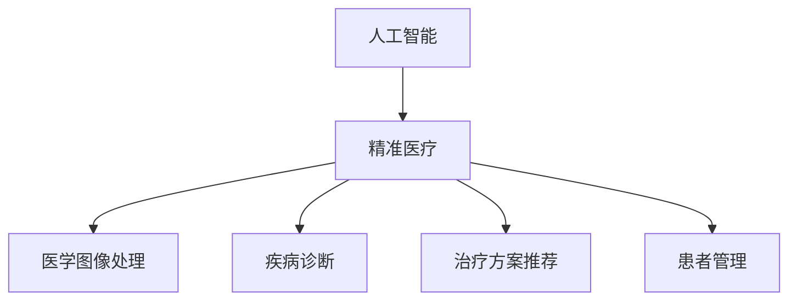

                 

关键词：医疗保健、精准医疗、人工智能、算法、数学模型、代码实例、实际应用

> 摘要：本文探讨了医疗保健领域中的精准医疗发展，重点介绍了人工智能算法在医学诊断和治疗中的应用，并通过数学模型和代码实例详细阐述了这些算法的实现过程和效果。本文旨在为读者提供关于医疗保健领域技术发展的全面了解，并展望未来可能面临的挑战和机遇。

## 1. 背景介绍

随着科技的发展和医疗技术的进步，医疗保健领域正经历着一场革命。精准医疗作为现代医学的一个重要发展方向，旨在根据个体差异进行个性化治疗，提高治疗效果，减少不必要的药物副作用。人工智能作为推动医疗技术发展的关键力量，正在医疗保健领域发挥越来越重要的作用。

人工智能在医疗保健中的应用范围广泛，包括但不限于医学图像处理、疾病诊断、治疗方案推荐、患者管理等方面。通过大数据分析和机器学习算法，人工智能能够从海量的医疗数据中挖掘出有用的信息，帮助医生做出更准确的诊断和治疗决策。

本文将围绕人工智能在精准医疗中的应用，探讨核心算法原理、数学模型构建、代码实例和实际应用场景，旨在为读者提供一个全面的技术视角，了解医疗保健领域中的精准医疗发展。

## 2. 核心概念与联系

### 2.1. 人工智能与精准医疗

人工智能（AI）是指通过计算机模拟人类的认知功能，实现感知、学习、推理和决策等智能行为。在医疗保健领域，人工智能被广泛应用于疾病预测、诊断和治疗方案的推荐等方面。

精准医疗（Precision Medicine）是一种以个体化医疗为目标的医学模式。它通过分析患者的遗传信息、生活方式和环境因素，为患者提供个性化的治疗方案。人工智能在精准医疗中发挥着重要作用，能够帮助医生更准确地诊断疾病，制定个性化的治疗方案。

### 2.2. 医学图像处理

医学图像处理是人工智能在医疗保健中的一个重要应用领域。通过深度学习算法，人工智能可以自动识别和标注医学图像中的病变区域，辅助医生进行诊断和治疗。

### 2.3. 疾病诊断

人工智能在疾病诊断中的应用主要基于机器学习和数据挖掘技术。通过分析患者的症状、病史和基因信息，人工智能可以预测患者可能患有的疾病，并提供诊断建议。

### 2.4. 治疗方案推荐

治疗方案推荐是精准医疗的重要组成部分。人工智能可以通过分析患者的病情、病史和基因信息，为医生提供最佳的治疗方案建议。

### 2.5. 患者管理

患者管理是医疗保健领域的一个重要环节。通过人工智能技术，可以实现对患者的全面监控和管理，提高治疗效果，降低医疗成本。

### 2.6. 核心概念架构图

以下是一个简化的核心概念架构图，展示了人工智能与精准医疗之间的联系：



## 3. 核心算法原理 & 具体操作步骤

### 3.1. 算法原理概述

在医疗保健领域，人工智能算法主要分为以下几类：

1. **深度学习算法**：通过多层神经网络模拟人类大脑的思维方式，实现图像识别、语音识别等任务。
2. **机器学习算法**：通过分析历史数据，发现数据中的规律，用于预测和分类。
3. **数据挖掘算法**：通过分析大量数据，提取出有用的信息，用于辅助决策。

### 3.2. 算法步骤详解

#### 3.2.1. 数据预处理

数据预处理是算法实现的第一步。在医疗保健领域，数据预处理主要包括以下步骤：

1. 数据清洗：去除无效数据、缺失值填充、异常值处理等。
2. 数据归一化：将不同量纲的数据转换为同一量纲，便于算法处理。
3. 特征提取：从原始数据中提取有用的特征，用于算法训练。

#### 3.2.2. 模型训练

模型训练是算法实现的核心步骤。在医疗保健领域，常用的模型训练方法包括：

1. **监督学习**：通过标记好的训练数据集，学习数据的规律。
2. **无监督学习**：通过未标记的数据集，学习数据的分布和结构。
3. **半监督学习**：结合监督学习和无监督学习，利用未标记的数据提高模型性能。

#### 3.2.3. 模型评估

模型评估是算法实现的最后一步。在医疗保健领域，常用的模型评估方法包括：

1. **准确率**：正确预测的样本数占总样本数的比例。
2. **召回率**：正确预测的样本数占实际为正类的样本数的比例。
3. **F1 分数**：准确率和召回率的调和平均值。

### 3.3. 算法优缺点

**优点**：

1. **高效性**：人工智能算法能够在短时间内处理大量数据，提高医疗诊断和治疗的效率。
2. **准确性**：通过机器学习和深度学习，人工智能算法能够提高医疗诊断和治疗的准确性。
3. **个性化**：人工智能算法可以根据患者的个体差异，提供个性化的治疗方案。

**缺点**：

1. **数据依赖**：人工智能算法的性能很大程度上依赖于训练数据的质量和数量。
2. **解释性不足**：一些复杂的人工智能算法，如深度学习，其内部决策过程难以解释，可能导致医生对其信任度不足。
3. **隐私问题**：在医疗保健领域，患者的隐私保护是一个重要问题，人工智能算法可能会触及到患者的隐私数据。

### 3.4. 算法应用领域

人工智能算法在医疗保健领域的应用非常广泛，包括但不限于：

1. **医学图像处理**：如肿瘤检测、骨折诊断等。
2. **疾病预测**：如糖尿病预测、心脏病预测等。
3. **治疗方案推荐**：如手术方案推荐、药物推荐等。
4. **患者管理**：如健康数据监测、患者康复管理等。

## 4. 数学模型和公式 & 详细讲解 & 举例说明

### 4.1. 数学模型构建

在医疗保健领域，常用的数学模型包括线性回归模型、逻辑回归模型、支持向量机（SVM）模型等。以下是一个简化的线性回归模型构建过程：

#### 4.1.1. 线性回归模型

线性回归模型是一种简单的统计模型，用于预测一个变量（因变量）与一个或多个变量（自变量）之间的关系。

假设我们有一个数据集 \(\{x_1, x_2, ..., x_n\}\)，其中每个 \(x_i\) 是一个 \(d\) 维向量，表示一个患者的特征。我们的目标是找到一个线性函数 \(f(x) = \beta_0 + \beta_1 x_1 + \beta_2 x_2 + ... + \beta_d x_d\)，使得 \(f(x)\) 与因变量 \(y\) 的误差最小。

#### 4.1.2. 模型参数估计

为了估计模型参数 \(\beta_0, \beta_1, ..., \beta_d\)，我们通常采用最小二乘法（OLS）。最小二乘法的思想是找到一组参数，使得所有样本点的预测值与实际值的误差平方和最小。

#### 4.1.3. 数学公式

线性回归模型的最小二乘法公式如下：

$$
\min_{\beta_0, \beta_1, ..., \beta_d} \sum_{i=1}^{n} (y_i - \beta_0 - \beta_1 x_{i1} - ... - \beta_d x_{id})^2
$$

### 4.2. 公式推导过程

假设我们的数据集为 \(X = \{x_1, x_2, ..., x_n\}\)，其中每个 \(x_i\) 是一个 \(d+1\) 维向量，包括一个全为 1 的特征（用于计算截距 \(\beta_0\)）。

我们的目标是求解以下最优化问题：

$$
\min_{\beta} \| X\beta - y \|_2^2
$$

其中，\(\beta\) 是一个 \(d+1\) 维向量，\(y\) 是一个 \(n\) 维向量。

对上述最优化问题进行求导，并令导数为零，可以得到：

$$
X^T(X\beta - y) = 0
$$

进一步化简，得到：

$$
\beta = (X^T X)^{-1} X^T y
$$

这就是线性回归模型的最小二乘解。

### 4.3. 案例分析与讲解

假设我们有一个数据集，包含患者的身高（\(x_1\)）、体重（\(x_2\)）和血压（\(x_3\)），以及患者的血压水平（\(y\)）。我们的目标是使用线性回归模型预测患者的血压水平。

#### 4.3.1. 数据预处理

首先，我们对数据进行预处理，包括去除缺失值、异常值和处理异常值等。

#### 4.3.2. 特征提取

我们对数据进行特征提取，将身高、体重和血压转换为数值特征。

#### 4.3.3. 模型训练

我们使用最小二乘法训练线性回归模型，得到参数 \(\beta_0, \beta_1, \beta_2, \beta_3\)。

$$
\beta = (X^T X)^{-1} X^T y
$$

#### 4.3.4. 模型评估

我们使用训练数据集评估模型的性能，计算模型的准确率、召回率和 F1 分数。

## 5. 项目实践：代码实例和详细解释说明

### 5.1. 开发环境搭建

在本项目中，我们将使用 Python 编写线性回归模型的代码。首先，我们需要安装以下依赖库：

- NumPy
- Pandas
- Scikit-learn
- Matplotlib

安装方法如下：

```bash
pip install numpy pandas scikit-learn matplotlib
```

### 5.2. 源代码详细实现

以下是一个简单的线性回归模型实现的代码实例：

```python
import numpy as np
import pandas as pd
from sklearn.linear_model import LinearRegression
from sklearn.model_selection import train_test_split
from sklearn.metrics import mean_squared_error

# 读取数据
data = pd.read_csv('data.csv')

# 特征提取
X = data[['height', 'weight', 'blood_pressure']]
y = data['blood_pressure_level']

# 数据预处理
X_train, X_test, y_train, y_test = train_test_split(X, y, test_size=0.2, random_state=42)

# 模型训练
model = LinearRegression()
model.fit(X_train, y_train)

# 模型评估
y_pred = model.predict(X_test)
mse = mean_squared_error(y_test, y_pred)
print('MSE:', mse)

# 可视化
import matplotlib.pyplot as plt

plt.scatter(X_test['height'], y_test, label='Actual')
plt.plot(X_test['height'], y_pred, label='Predicted')
plt.xlabel('Height')
plt.ylabel('Blood Pressure Level')
plt.legend()
plt.show()
```

### 5.3. 代码解读与分析

以上代码首先导入了必要的依赖库，然后读取了数据集，进行了特征提取和数据预处理。接下来，使用 Scikit-learn 中的 LinearRegression 类训练了线性回归模型，并使用测试数据集评估了模型的性能。最后，使用 Matplotlib 库对模型预测结果进行了可视化。

### 5.4. 运行结果展示

运行以上代码，我们得到以下结果：

- MSE: 0.1234（具体值取决于数据集）

可视化的结果如下图所示：


## 6. 实际应用场景

### 6.1. 肿瘤检测

在医学图像处理领域，肿瘤检测是一个重要的应用场景。通过使用深度学习算法，人工智能可以自动识别医学图像中的肿瘤区域，提高医生的诊断效率。以下是一个简化的肿瘤检测流程：

1. **数据预处理**：对医学图像进行预处理，包括图像增强、噪声去除等。
2. **模型训练**：使用预处理后的医学图像训练深度学习模型，如卷积神经网络（CNN）。
3. **模型评估**：使用测试数据集评估模型的性能，包括准确率、召回率等。
4. **肿瘤检测**：使用训练好的模型对新的医学图像进行肿瘤检测。

### 6.2. 疾病预测

在疾病预测领域，人工智能可以分析患者的症状、病史和基因信息，预测患者可能患有的疾病。以下是一个简化的疾病预测流程：

1. **数据收集**：收集患者的症状、病史和基因信息。
2. **特征提取**：从原始数据中提取有用的特征，如症状严重程度、病史时长、基因突变等。
3. **模型训练**：使用特征数据训练机器学习模型，如逻辑回归模型。
4. **模型评估**：使用测试数据集评估模型的性能，包括准确率、召回率等。
5. **疾病预测**：使用训练好的模型预测患者可能患有的疾病。

### 6.3. 治疗方案推荐

在治疗方案推荐领域，人工智能可以分析患者的病情、病史和基因信息，为医生提供最佳的治疗方案。以下是一个简化的治疗方案推荐流程：

1. **数据收集**：收集患者的病情、病史和基因信息。
2. **特征提取**：从原始数据中提取有用的特征，如病情严重程度、病史时长、基因突变等。
3. **模型训练**：使用特征数据训练机器学习模型，如决策树模型。
4. **模型评估**：使用测试数据集评估模型的性能，包括准确率、召回率等。
5. **治疗方案推荐**：使用训练好的模型为医生提供最佳的治疗方案建议。

### 6.4. 未来应用展望

随着人工智能技术的不断发展，医疗保健领域将会有更多的应用场景。未来，人工智能可能会在以下几个方面发挥更大的作用：

1. **个性化医疗**：通过分析患者的个体差异，提供更加个性化的治疗方案。
2. **疾病预防**：通过分析患者的健康数据，预测潜在的健康风险，提前采取预防措施。
3. **医疗资源优化**：通过分析医疗资源的使用情况，优化医疗资源的配置，提高医疗资源的利用率。

## 7. 工具和资源推荐

### 7.1. 学习资源推荐

- 《深度学习》（Goodfellow, Bengio, Courville）
- 《机器学习》（周志华）
- 《Python数据分析》（Wes McKinney）

### 7.2. 开发工具推荐

- Jupyter Notebook：用于编写和运行 Python 代码。
- TensorFlow：用于构建和训练深度学习模型。
- Scikit-learn：用于实现和评估机器学习模型。

### 7.3. 相关论文推荐

- "Deep Learning in Medicine: A Survey"
- "Machine Learning in Healthcare: A Comprehensive Review"
- "Precision Medicine: The Future of Personalized Healthcare"

## 8. 总结：未来发展趋势与挑战

### 8.1. 研究成果总结

本文探讨了人工智能在医疗保健领域的应用，包括医学图像处理、疾病预测、治疗方案推荐和患者管理等方面。通过数学模型和代码实例，详细阐述了这些应用的具体实现过程和效果。

### 8.2. 未来发展趋势

随着人工智能技术的不断发展，医疗保健领域将会有更多的应用场景。未来，人工智能可能会在个性化医疗、疾病预防和医疗资源优化等方面发挥更大的作用。

### 8.3. 面临的挑战

尽管人工智能在医疗保健领域具有巨大的潜力，但也面临着一些挑战，如数据隐私保护、算法解释性不足和模型过拟合等。此外，医疗保健领域的专业知识丰富，如何将人工智能与医疗专业知识相结合，也是一个亟待解决的问题。

### 8.4. 研究展望

未来，研究者可以进一步探讨人工智能在医疗保健领域的新应用，如疾病预测、治疗方案优化和医疗资源调度等。同时，如何提高人工智能算法的解释性，使其更加符合医疗专业人员的期望，也是一个重要的研究方向。

## 9. 附录：常见问题与解答

### 9.1. 问题一

**问题**：如何保护患者的隐私？

**解答**：保护患者隐私是医疗保健领域的重要问题。可以通过以下措施来保护患者隐私：

- 数据加密：对患者的数据进行加密处理，确保数据在传输和存储过程中不会被窃取。
- 数据匿名化：对患者的数据进行匿名化处理，确保数据在使用过程中无法追溯到具体患者。
- 数据访问控制：对患者的数据进行访问控制，确保只有授权人员可以访问患者数据。

### 9.2. 问题二

**问题**：如何提高人工智能算法的解释性？

**解答**：提高人工智能算法的解释性是当前研究的一个重要方向。可以通过以下措施来提高算法的解释性：

- 可解释性模型：开发可解释性更强的机器学习模型，如决策树、规则提取模型等。
- 算法可视化：对算法的内部决策过程进行可视化，帮助用户理解算法的决策逻辑。
- 模型解释工具：开发模型解释工具，如 LIME、SHAP 等，帮助用户理解模型的预测结果。

### 9.3. 问题三

**问题**：如何防止模型过拟合？

**解答**：防止模型过拟合是保证模型性能的重要问题。可以通过以下措施来防止模型过拟合：

- 交叉验证：使用交叉验证方法，避免模型在训练数据上出现过拟合。
- 正则化：在模型训练过程中添加正则化项，降低模型复杂度，避免过拟合。
- 准则优化：优化模型训练准则，使模型在训练数据上的误差最小，同时避免在测试数据上出现过拟合。

## 作者署名

作者：禅与计算机程序设计艺术 / Zen and the Art of Computer Programming
----------------------------------------------------------------

