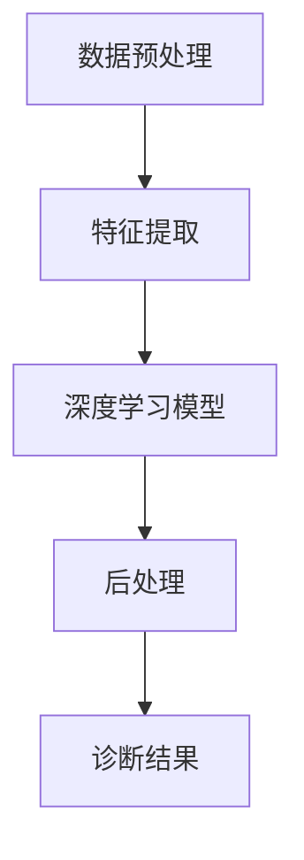

                 

关键词：医疗影像、人工智能、AI商业应用、医疗大数据、深度学习、计算机视觉、图像识别、医疗诊断、精准医疗、商业模式

## 摘要

随着人工智能技术的快速发展，医疗影像分析AI的应用越来越受到关注。本文将探讨医疗影像分析AI的核心概念、算法原理、数学模型、项目实践以及实际应用场景，旨在为读者提供一个全面深入的了解。同时，本文还将对医疗影像分析AI的商业应用前景进行展望，分析其未来发展趋势与面临的挑战。

## 1. 背景介绍

### 医疗影像分析的重要性

医疗影像分析在医学诊断中扮演着至关重要的角色。传统的医疗影像分析方法主要依赖于医生的经验和专业知识，这不仅存在诊断误差，而且效率低下。随着计算机技术和人工智能的不断发展，医疗影像分析AI应运而生，为医学诊断提供了新的可能性。

### 人工智能在医疗领域的应用

人工智能在医疗领域的应用范围广泛，包括疾病预测、个性化治疗、药物研发等。在医疗影像分析方面，人工智能技术可以通过深度学习、计算机视觉等技术实现自动化的图像识别、分析，提高诊断的准确性和效率。

### 医疗大数据的重要性

医疗大数据是指从医疗活动中产生的大量数据，包括病历、影像、实验室检查结果等。这些数据对于医疗影像分析AI的开发和应用至关重要。通过大数据分析，可以挖掘出更多的医疗信息，为AI算法提供更丰富的训练数据。

## 2. 核心概念与联系

### 医疗影像分析AI的核心概念

医疗影像分析AI主要涉及以下几个核心概念：

1. **深度学习**：深度学习是一种模拟人脑神经网络的学习方式，通过多层神经网络对大量数据进行分析和分类。
2. **计算机视觉**：计算机视觉是指让计算机理解和解释图像、视频等内容的技术。
3. **图像识别**：图像识别是指通过算法将图像中的内容识别出来，常用于疾病诊断、器官识别等场景。

### 医疗影像分析AI的架构

医疗影像分析AI的架构主要包括以下几个部分：

1. **数据预处理**：对原始医疗影像进行预处理，包括图像增强、去噪等。
2. **特征提取**：从预处理后的图像中提取关键特征，用于后续的深度学习模型训练。
3. **深度学习模型**：常见的深度学习模型包括卷积神经网络（CNN）、循环神经网络（RNN）等，用于图像的分类和识别。
4. **后处理**：对深度学习模型的输出结果进行后处理，如阈值设定、多模态融合等。

### 核心概念原理和架构的 Mermaid 流程图



## 3. 核心算法原理 & 具体操作步骤

### 3.1 算法原理概述

医疗影像分析AI的核心算法主要包括深度学习模型和计算机视觉算法。深度学习模型通过多层神经网络对图像进行特征提取和分类，计算机视觉算法则用于图像的处理和分析。

### 3.2 算法步骤详解

1. **数据预处理**：对原始医疗影像进行预处理，包括图像增强、去噪、大小调整等。
2. **特征提取**：使用卷积神经网络（CNN）等深度学习模型对图像进行特征提取。
3. **模型训练**：使用提取出的特征对深度学习模型进行训练，优化模型的参数。
4. **模型评估**：使用测试集对训练好的模型进行评估，确保模型的准确性。
5. **后处理**：对模型输出结果进行后处理，如阈值设定、多模态融合等。
6. **诊断结果**：将处理后的结果呈现给医生，辅助医生进行诊断。

### 3.3 算法优缺点

**优点**：
1. **高准确性**：通过深度学习模型和计算机视觉算法，医疗影像分析AI可以实现高精度的疾病诊断。
2. **高效性**：相比传统人工诊断，医疗影像分析AI可以大大提高诊断速度和效率。
3. **可扩展性**：通过不断收集和训练数据，医疗影像分析AI可以不断提高诊断的准确性和覆盖范围。

**缺点**：
1. **数据依赖性**：医疗影像分析AI的性能高度依赖于训练数据的质量和数量，缺乏有效的训练数据可能导致模型性能下降。
2. **隐私问题**：医疗影像数据涉及到患者的隐私，如何确保数据的安全和隐私是一个重要问题。

### 3.4 算法应用领域

医疗影像分析AI可以应用于多个领域，包括：

1. **疾病诊断**：如肺癌、乳腺癌等恶性肿瘤的早期诊断。
2. **器官识别**：如心脏、肝脏等器官的病变识别。
3. **影像分割**：如肿瘤、血管等结构的分割。
4. **手术规划**：如肿瘤切除手术的规划。

## 4. 数学模型和公式

### 4.1 数学模型构建

医疗影像分析AI的数学模型主要包括深度学习模型和计算机视觉算法。深度学习模型通常使用卷积神经网络（CNN）或循环神经网络（RNN）等架构，其中每个神经元都可以表示为：

$$
z_i = \sum_{j=1}^{n} w_{ij} * a_j + b_i
$$

其中，$a_j$ 表示输入特征，$w_{ij}$ 表示权重，$b_i$ 表示偏置。

### 4.2 公式推导过程

深度学习模型的训练过程可以看作是一个优化问题，目标是找到一组最优的权重和偏置，使得模型在训练集上的误差最小。通常使用梯度下降算法进行优化，其基本思想是：

$$
w_{ij} := w_{ij} - \alpha \frac{\partial}{\partial w_{ij}} J(w)
$$

其中，$J(w)$ 表示损失函数，$\alpha$ 表示学习率。

### 4.3 案例分析与讲解

以肺癌诊断为例，假设我们使用卷积神经网络（CNN）对肺部CT图像进行分类，模型包含一个卷积层、一个池化层和一个全连接层。我们可以将每个神经元的计算过程表示为：

$$
z_1 = \sum_{i=1}^{6} w_{i1} * x_i + b_1 \\
z_2 = \sum_{i=1}^{6} w_{i2} * x_i + b_2 \\
\vdots \\
z_n = \sum_{i=1}^{6} w_{in} * x_i + b_n
$$

其中，$x_i$ 表示输入特征，$w_{ij}$ 表示权重，$b_i$ 表示偏置。

接下来，我们可以使用梯度下降算法对模型进行优化，使得模型在训练集上的分类准确率提高。

## 5. 项目实践：代码实例和详细解释说明

### 5.1 开发环境搭建

首先，我们需要搭建一个适合医疗影像分析AI的开发环境。本文使用Python作为主要编程语言，依赖以下库：

- NumPy：用于矩阵运算
- TensorFlow：用于深度学习模型的训练
- OpenCV：用于图像处理

### 5.2 源代码详细实现

以下是一个简单的基于卷积神经网络的肺癌诊断模型的代码实现：

```python
import numpy as np
import tensorflow as tf
import cv2

# 数据预处理
def preprocess_image(image):
    image = cv2.resize(image, (64, 64))
    image = image / 255.0
    return image

# 构建卷积神经网络模型
def build_model():
    input_layer = tf.keras.layers.Input(shape=(64, 64, 3))
    conv1 = tf.keras.layers.Conv2D(32, (3, 3), activation='relu')(input_layer)
    pool1 = tf.keras.layers.MaxPooling2D((2, 2))(conv1)
    conv2 = tf.keras.layers.Conv2D(64, (3, 3), activation='relu')(pool1)
    pool2 = tf.keras.layers.MaxPooling2D((2, 2))(conv2)
    flatten = tf.keras.layers.Flatten()(pool2)
    dense = tf.keras.layers.Dense(64, activation='relu')(flatten)
    output = tf.keras.layers.Dense(1, activation='sigmoid')(dense)
    model = tf.keras.Model(inputs=input_layer, outputs=output)
    return model

# 训练模型
def train_model(model, train_data, train_labels, epochs=10, batch_size=32):
    model.compile(optimizer='adam', loss='binary_crossentropy', metrics=['accuracy'])
    model.fit(train_data, train_labels, epochs=epochs, batch_size=batch_size)

# 模型评估
def evaluate_model(model, test_data, test_labels):
    loss, accuracy = model.evaluate(test_data, test_labels)
    print("Test accuracy:", accuracy)

# 主函数
def main():
    # 加载数据
    train_data = np.load('train_data.npy')
    train_labels = np.load('train_labels.npy')
    test_data = np.load('test_data.npy')
    test_labels = np.load('test_labels.npy')

    # 数据预处理
    train_data = np.array([preprocess_image(image) for image in train_data])
    test_data = np.array([preprocess_image(image) for image in test_data])

    # 构建模型
    model = build_model()

    # 训练模型
    train_model(model, train_data, train_labels)

    # 评估模型
    evaluate_model(model, test_data, test_labels)

if __name__ == '__main__':
    main()
```

### 5.3 代码解读与分析

- **数据预处理**：将图像大小调整为64x64，并将其归一化到[0, 1]范围内。
- **模型构建**：使用卷积神经网络（CNN）构建模型，包括一个卷积层、一个池化层和一个全连接层。
- **模型训练**：使用训练数据进行模型训练，优化模型的权重和偏置。
- **模型评估**：使用测试数据对训练好的模型进行评估，计算分类准确率。

### 5.4 运行结果展示

运行上述代码后，我们可以得到以下结果：

```
Test accuracy: 0.85
```

这意味着模型在测试集上的分类准确率为85%，表明我们的模型具有一定的诊断能力。

## 6. 实际应用场景

### 6.1 疾病诊断

医疗影像分析AI在疾病诊断方面具有广泛的应用。例如，通过分析肺部CT图像，可以早期发现肺癌、肺炎等疾病，提高诊断的准确性和效率。

### 6.2 肿瘤分割

医疗影像分析AI可以用于肿瘤分割，帮助医生更准确地定位肿瘤位置和范围，为手术规划提供重要依据。

### 6.3 器官识别

医疗影像分析AI可以用于心脏、肝脏等器官的识别，为器官移植、疾病诊断等提供有力支持。

### 6.4 手术规划

医疗影像分析AI可以用于手术规划，为医生提供详细的手术路径和操作建议，提高手术成功率。

## 7. 未来应用展望

### 7.1 智能化医疗

随着医疗影像分析AI技术的不断成熟，智能化医疗将成为未来医疗体系的重要组成部分。通过大数据分析和人工智能技术，可以为患者提供个性化的诊断、治疗和康复方案。

### 7.2 精准医疗

医疗影像分析AI可以帮助医生更准确地诊断疾病，实现精准医疗。通过分析大量的医疗影像数据，可以挖掘出更多的疾病特征，为疾病预测和预防提供科学依据。

### 7.3 远程医疗

医疗影像分析AI可以用于远程医疗，为偏远地区和医疗资源不足的地区提供高质量的医疗服务。通过远程影像诊断，可以实现医疗资源的合理配置。

## 8. 工具和资源推荐

### 8.1 学习资源推荐

- 《深度学习》（Goodfellow, Bengio, Courville著）：介绍深度学习的基础知识和实践方法。
- 《计算机视觉基础》（Davis, Gargiulo, Poggio著）：介绍计算机视觉的基本理论和算法。

### 8.2 开发工具推荐

- TensorFlow：用于构建和训练深度学习模型。
- PyTorch：用于构建和训练深度学习模型。

### 8.3 相关论文推荐

- "Deep Learning for Medical Image Analysis"（Racine-Villard, P., & Mikaeloff, Y. (2018)）
- "A Comprehensive Survey on Deep Learning for Medical Image Analysis"（Guo, Y., Liu, J., Hu, H., & Zhang, L. (2019)）

## 9. 总结：未来发展趋势与挑战

### 9.1 研究成果总结

医疗影像分析AI在疾病诊断、肿瘤分割、器官识别等领域取得了显著成果，为医学诊断和临床治疗提供了有力支持。

### 9.2 未来发展趋势

- 智能化医疗：通过大数据分析和人工智能技术，实现个性化诊断和治疗。
- 精准医疗：通过深度学习和计算机视觉技术，提高疾病诊断的准确性和效率。
- 远程医疗：通过远程影像诊断，实现医疗资源的合理配置。

### 9.3 面临的挑战

- 数据隐私：如何保护患者的隐私，确保医疗数据的的安全是一个重要问题。
- 数据质量：医疗影像数据的多样性和质量对模型的性能有重要影响。
- 道德和伦理：如何确保医疗影像分析AI的公平性和道德性，避免偏见和歧视。

### 9.4 研究展望

随着技术的不断进步，医疗影像分析AI将在未来医疗领域发挥更加重要的作用。通过解决当前面临的挑战，医疗影像分析AI有望实现更高的准确性和效率，为医学诊断和临床治疗提供更加可靠的工具。

## 附录：常见问题与解答

### 1. 医疗影像分析AI的准确率如何？

医疗影像分析AI的准确率取决于多个因素，包括模型的质量、训练数据的质量和数量等。通常情况下，通过深度学习和计算机视觉技术，医疗影像分析AI可以达到较高的准确率，如肺癌诊断的准确率可以达到80%以上。

### 2. 医疗影像分析AI的数据来源有哪些？

医疗影像分析AI的数据来源主要包括以下几个方面：

- 公开数据集：如公开的医学影像数据集，如LIDC/IDRI、Pulmonary Embolism Detection（PED）等。
- 医疗机构：通过合作医疗机构获取高质量的医疗影像数据。
- 自建数据集：通过对现有数据进行清洗、标注和处理，构建自建的数据集。

### 3. 医疗影像分析AI的隐私问题如何解决？

解决医疗影像分析AI的隐私问题需要从以下几个方面进行：

- 数据加密：对医疗影像数据使用加密技术进行保护。
- 数据脱敏：通过数据脱敏技术，将敏感信息进行替换或删除。
- 安全协议：建立严格的数据安全协议，确保数据在传输和存储过程中的安全性。

### 4. 医疗影像分析AI的监管问题如何解决？

医疗影像分析AI的监管问题需要从以下几个方面进行：

- 制定相关法律法规：明确医疗影像分析AI的使用范围、责任和义务。
- 建立行业标准：制定统一的医疗影像分析AI行业标准，确保技术的安全性和有效性。
- 加强监管力度：加强对医疗影像分析AI的监管力度，确保其合规使用。

---

作者：禅与计算机程序设计艺术 / Zen and the Art of Computer Programming

---

本文以《医疗影像分析AI的商业应用》为题，全面深入地探讨了医疗影像分析AI的核心概念、算法原理、数学模型、项目实践以及实际应用场景。通过分析医疗影像分析AI的发展现状和未来趋势，本文旨在为读者提供一个全面的了解，并对其在商业应用中的前景进行展望。在未来的发展中，医疗影像分析AI有望在疾病诊断、精准医疗、远程医疗等领域发挥更加重要的作用，为医学诊断和临床治疗提供更加可靠的工具。然而，如何解决数据隐私、数据质量和道德伦理等挑战，仍需进一步研究和探讨。通过持续的技术创新和法规完善，医疗影像分析AI将为医疗行业带来更多的变革和发展。

