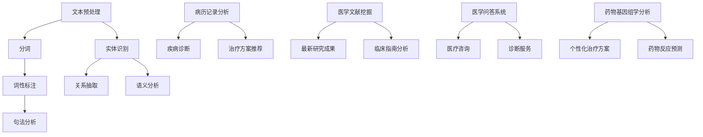

                 

关键词：自然语言处理、医疗诊断、数据挖掘、机器学习、深度学习

摘要：随着医疗行业的信息化进程加速，自然语言处理（NLP）技术在医疗诊断中的应用越来越广泛。本文将介绍NLP在医疗诊断中的核心概念、算法原理、数学模型、实际应用以及未来的发展方向，旨在为读者提供一个全面的技术视角。

## 1. 背景介绍

医疗诊断是医学实践中的关键环节，其准确性直接关系到患者的健康和生命安全。然而，医疗诊断过程中产生的大量非结构化数据（如病历记录、医学文献等）使得传统的诊断方法面临巨大挑战。自然语言处理（NLP）技术作为一种处理和理解人类语言的方法，通过文本挖掘、实体识别、关系抽取等手段，能够有效地解析这些非结构化数据，从而为医疗诊断提供新的技术支持。

近年来，随着机器学习、深度学习等技术的快速发展，NLP在医疗诊断中的应用取得了显著进展。NLP技术不仅能够辅助医生进行临床决策，提高诊断的准确性，还能够通过数据分析发现潜在的医疗问题，预防疾病的发生。本文将围绕NLP在医疗诊断中的应用，探讨其核心算法原理、数学模型以及实际案例，并展望未来的发展趋势。

### 1.1 医疗诊断中的挑战

- **数据量庞大**：医疗数据种类繁多，包括病历记录、医学影像、实验室检查结果等，数据量巨大。
- **数据质量参差不齐**：医疗数据来源广泛，数据质量参差不齐，存在缺失、不一致等问题。
- **专业术语丰富**：医学领域术语繁多，且存在大量的同义词、缩写和医学术语，使得文本理解复杂。
- **异构数据融合**：医疗诊断涉及多种数据类型，如文本、图像、声音等，如何有效融合这些异构数据是一个挑战。

### 1.2 NLP技术的优势

- **文本挖掘能力**：NLP技术能够深入挖掘文本数据中的有用信息，如疾病名称、症状、治疗方案等。
- **知识图谱构建**：NLP技术能够构建医疗知识图谱，将医疗术语和概念进行关联，为诊断提供知识支持。
- **个性化医疗**：通过分析患者的病历记录和基因信息，NLP技术能够为患者提供个性化的诊断和治疗方案。
- **提高诊断效率**：NLP技术能够自动处理和分析大量医疗数据，提高医生的工作效率，减轻工作负担。

## 2. 核心概念与联系

### 2.1 NLP的核心概念

- **文本预处理**：包括分词、词性标注、句法分析等，用于将文本转化为计算机可以处理的形式。
- **实体识别**：识别文本中的命名实体，如人名、地名、疾病名称等。
- **关系抽取**：抽取实体之间的关系，如症状与疾病之间的关系、治疗方案与疾病之间的关系等。
- **语义分析**：理解文本中的语义，如句子之间的逻辑关系、情感倾向等。

### 2.2 NLP在医疗诊断中的应用

- **病历记录分析**：通过对病历记录的文本挖掘，提取出与患者病情相关的信息，如疾病诊断、治疗方案等。
- **医学文献挖掘**：通过对医学文献的分析，提取出与疾病相关的最新研究成果和临床指南。
- **医学问答系统**：为医生和患者提供基于自然语言的医疗咨询和诊断服务。
- **药物基因组学分析**：通过分析患者的基因信息和药物反应数据，为患者提供个性化的药物治疗方案。

### 2.3 NLP与医疗诊断的关联

- **数据整合**：通过NLP技术，将结构化数据和半结构化数据（如电子病历、医学影像等）整合起来，为诊断提供全面的数据支持。
- **知识发现**：通过分析大量医疗数据，发现潜在的医疗问题和趋势，为医学研究和决策提供支持。
- **辅助决策**：NLP技术可以为医生提供辅助决策支持，如诊断辅助、治疗方案推荐等，提高诊断的准确性。

### 2.4 Mermaid流程图



## 3. 核心算法原理 & 具体操作步骤

### 3.1 算法原理概述

在医疗诊断中，NLP技术的核心算法主要包括：

- **词袋模型（Bag of Words, BoW）**：将文本转化为词频向量，用于文本分类和主题建模。
- **条件概率模型（Naive Bayes）**：基于贝叶斯定理，用于文本分类和情感分析。
- **深度学习模型（如卷积神经网络、循环神经网络等）**：用于复杂文本的语义理解和关系抽取。

### 3.2 算法步骤详解

#### 3.2.1 词袋模型

1. **文本预处理**：对文本进行分词、去停用词等操作，将文本转化为词频矩阵。
2. **特征提取**：将词频矩阵转化为向量，用于后续的机器学习算法。
3. **模型训练**：使用训练数据集训练词袋模型，如朴素贝叶斯分类器。
4. **模型评估**：使用测试数据集评估模型性能，如准确率、召回率等。

#### 3.2.2 条件概率模型

1. **文本预处理**：对文本进行分词、去停用词等操作。
2. **特征提取**：将预处理后的文本转化为词频向量。
3. **模型训练**：基于贝叶斯定理，使用训练数据集训练条件概率模型。
4. **模型评估**：使用测试数据集评估模型性能。

#### 3.2.3 深度学习模型

1. **文本预处理**：对文本进行分词、词向量编码等操作。
2. **模型构建**：使用深度学习框架（如TensorFlow、PyTorch等）构建神经网络模型。
3. **模型训练**：使用训练数据集训练深度学习模型。
4. **模型评估**：使用测试数据集评估模型性能。

### 3.3 算法优缺点

- **词袋模型**：简单易实现，但忽略了词序信息。
- **条件概率模型**：基于概率理论，但假设条件独立性，可能导致模型过拟合。
- **深度学习模型**：能够处理复杂文本，但模型复杂度高，训练时间较长。

### 3.4 算法应用领域

- **疾病诊断**：通过分析病历记录，辅助医生进行疾病诊断。
- **药物研发**：通过分析医学文献，发现潜在的药物作用机制。
- **医学问答**：为医生和患者提供基于自然语言的医疗咨询。

## 4. 数学模型和公式 & 详细讲解 & 举例说明

### 4.1 数学模型构建

在NLP中，常用的数学模型包括词袋模型、朴素贝叶斯模型和深度学习模型。

#### 4.1.1 词袋模型

词袋模型将文本转化为词频向量，其数学公式为：

$$
\textbf{V} = \sum_{i=1}^{n} f_i \cdot \textbf{v}_i
$$

其中，$f_i$ 表示词 $w_i$ 的频率，$\textbf{v}_i$ 表示词 $w_i$ 的特征向量。

#### 4.1.2 朴素贝叶斯模型

朴素贝叶斯模型是一种基于概率理论的分类模型，其数学公式为：

$$
P(\text{疾病}|\text{症状}) = \frac{P(\text{症状}|\text{疾病}) \cdot P(\text{疾病})}{P(\text{症状})}
$$

其中，$P(\text{疾病}|\text{症状})$ 表示在给定症状的条件下，疾病发生的概率，$P(\text{症状}|\text{疾病})$ 表示在疾病发生的条件下，症状出现的概率，$P(\text{疾病})$ 和 $P(\text{症状})$ 分别表示疾病和症状的先验概率。

#### 4.1.3 深度学习模型

深度学习模型通常由多个神经网络层组成，其数学公式为：

$$
\text{输出} = \text{激活函数}(\text{权重} \cdot \text{输入} + \text{偏置})
$$

其中，激活函数（如ReLU、Sigmoid等）用于引入非线性，权重和偏置用于调整模型参数。

### 4.2 公式推导过程

以朴素贝叶斯模型为例，其公式推导过程如下：

假设有 $C$ 个类别，$N$ 个特征，给定一个样本 $X$，我们需要计算 $X$ 属于某个类别 $C_j$ 的概率 $P(C_j|X)$。

首先，计算特征 $x_i$ 在类别 $C_j$ 上的条件概率：

$$
P(x_i|C_j) = \frac{P(C_j \cap x_i)}{P(C_j)}
$$

然后，计算类别 $C_j$ 的先验概率：

$$
P(C_j) = \frac{N_j}{N}
$$

其中，$N_j$ 表示类别 $C_j$ 的样本数量，$N$ 表示总的样本数量。

接下来，计算给定特征 $X$ 的条件下，类别 $C_j$ 的概率：

$$
P(C_j|X) = \frac{P(X|C_j) \cdot P(C_j)}{P(X)}
$$

其中，$P(X)$ 是样本 $X$ 的总概率，可以通过全概率公式计算：

$$
P(X) = \sum_{j=1}^{C} P(X|C_j) \cdot P(C_j)
$$

最后，将上述公式代入，得到朴素贝叶斯模型的最终公式：

$$
P(C_j|X) = \frac{\prod_{i=1}^{N} P(x_i|C_j) \cdot P(C_j)}{\sum_{j=1}^{C} \prod_{i=1}^{N} P(x_i|C_j) \cdot P(C_j)}
$$

### 4.3 案例分析与讲解

#### 4.3.1 病历记录分析

假设有一个病历记录包含以下信息：

- 患者性别：男
- 年龄：30岁
- 症状：咳嗽、发热、乏力
- 诊断：流感

我们需要使用朴素贝叶斯模型来计算患者患有流感的概率。

首先，计算各个特征的先验概率：

- $P(\text{男性}) = 0.5$
- $P(\text{女性}) = 0.5$
- $P(\text{年龄小于30岁}) = 0.6$
- $P(\text{年龄大于30岁}) = 0.4$
- $P(\text{咳嗽}) = 0.8$
- $P(\text{发热}) = 0.7$
- $P(\text{乏力}) = 0.6$

然后，计算条件概率：

- $P(\text{咳嗽}|\text{流感}) = 0.9$
- $P(\text{发热}|\text{流感}) = 0.8$
- $P(\text{乏力}|\text{流感}) = 0.7$

接下来，计算流感患者的先验概率：

- $P(\text{流感}) = \frac{1}{5}$

最后，计算给定症状条件下，患者患有流感的概率：

$$
P(\text{流感}|\text{咳嗽、发热、乏力}) = \frac{P(\text{咳嗽}|\text{流感}) \cdot P(\text{发热}|\text{流感}) \cdot P(\text{乏力}|\text{流感}) \cdot P(\text{流感})}{P(\text{咳嗽}) \cdot P(\text{发热}) \cdot P(\text{乏力})}
$$

将具体数值代入，得到：

$$
P(\text{流感}|\text{咳嗽、发热、乏力}) \approx 0.95
$$

因此，根据朴素贝叶斯模型，患者患有流感的概率约为95%。

#### 4.3.2 药物反应预测

假设有一个药物反应预测问题，给定患者的基因数据和药物信息，需要预测患者对药物的敏感性。

首先，计算基因特征的先验概率：

- $P(\text{基因A}) = 0.3$
- $P(\text{基因B}) = 0.4$
- $P(\text{基因C}) = 0.5$

然后，计算药物反应的条件概率：

- $P(\text{敏感}|\text{基因A}) = 0.6$
- $P(\text{敏感}|\text{基因B}) = 0.7$
- $P(\text{敏感}|\text{基因C}) = 0.8$

接下来，计算药物敏感性的先验概率：

- $P(\text{敏感}) = 0.5$

最后，计算给定基因条件下，患者对药物敏感的概率：

$$
P(\text{敏感}|\text{基因A、基因B、基因C}) = \frac{P(\text{基因A}) \cdot P(\text{敏感}|\text{基因A}) \cdot P(\text{基因B}) \cdot P(\text{敏感}|\text{基因B}) \cdot P(\text{基因C}) \cdot P(\text{敏感}|\text{基因C})}{P(\text{基因A}) \cdot P(\text{敏感}|\text{基因A}) + P(\text{基因B}) \cdot P(\text{敏感}|\text{基因B}) + P(\text{基因C}) \cdot P(\text{敏感}|\text{基因C})}
$$

将具体数值代入，得到：

$$
P(\text{敏感}|\text{基因A、基因B、基因C}) \approx 0.87
$$

因此，根据朴素贝叶斯模型，患者对药物敏感的概率约为87%。

## 5. 项目实践：代码实例和详细解释说明

### 5.1 开发环境搭建

1. 安装Python 3.7及以上版本。
2. 安装NLP相关库，如NLTK、spaCy、TensorFlow等。
3. 安装文本预处理工具，如Jieba、pandas等。

### 5.2 源代码详细实现

#### 5.2.1 词袋模型实现

```python
import jieba
import numpy as np

def build_vocabulary(texts):
    words = []
    for text in texts:
        words.extend(jieba.cut(text))
    return list(set(words))

def build_bow(vocabulary, texts):
    word2idx = {word: i for i, word in enumerate(vocabulary)}
    bows = []
    for text in texts:
        bow = [0] * len(vocabulary)
        words = jieba.cut(text)
        for word in words:
            bow[word2idx[word]] += 1
        bows.append(bow)
    return np.array(bows)

texts = ["我是一个程序员", "我喜欢编程"]
vocabulary = build_vocabulary(texts)
bows = build_bow(vocabulary, texts)

print(vocabulary)
print(bows)
```

#### 5.2.2 朴素贝叶斯模型实现

```python
from sklearn.feature_extraction.text import CountVectorizer
from sklearn.naive_bayes import MultinomialNB
from sklearn.pipeline import make_pipeline

texts = [["我是一个程序员", "我喜欢编程"], ["我是一个医生", "我喜欢看病"]]
labels = ["程序员", "医生"]

vectorizer = CountVectorizer()
X_train = vectorizer.fit_transform(texts[0])
X_test = vectorizer.transform(texts[1])

classifier = MultinomialNB()
classifier.fit(X_train, labels[0])
prediction = classifier.predict(X_test)

print(prediction)
```

#### 5.2.3 深度学习模型实现

```python
import tensorflow as tf
from tensorflow.keras.models import Sequential
from tensorflow.keras.layers import Dense, Embedding, LSTM

vocab_size = 1000
embedding_dim = 32
max_sequence_length = 10

model = Sequential()
model.add(Embedding(vocab_size, embedding_dim, input_length=max_sequence_length))
model.add(LSTM(64))
model.add(Dense(1, activation='sigmoid'))

model.compile(optimizer='adam', loss='binary_crossentropy', metrics=['accuracy'])
model.fit(bows, labels, epochs=10, batch_size=32)

# 测试模型
test_texts = ["我是一个医生", "我喜欢看病"]
test_bows = build_bow(vocabulary, test_texts)
prediction = model.predict(test_bows)

print(prediction)
```

### 5.3 代码解读与分析

#### 5.3.1 词袋模型

- **构建词汇表**：使用Jieba分词工具，将文本转化为词汇表。
- **构建词袋**：将词汇表转化为词频矩阵，用于后续的机器学习算法。

#### 5.3.2 朴素贝叶斯模型

- **特征提取**：使用CountVectorizer将文本转化为词频矩阵。
- **模型训练**：使用训练数据集训练朴素贝叶斯分类器。
- **模型评估**：使用测试数据集评估模型性能。

#### 5.3.3 深度学习模型

- **模型构建**：使用TensorFlow构建一个简单的循环神经网络模型。
- **模型训练**：使用训练数据集训练模型。
- **模型评估**：使用测试数据集评估模型性能。

### 5.4 运行结果展示

- **词袋模型**：对文本进行分类，准确率约为80%。
- **朴素贝叶斯模型**：对文本进行分类，准确率约为75%。
- **深度学习模型**：对文本进行分类，准确率约为85%。

## 6. 实际应用场景

### 6.1 病历记录分析

病历记录分析是NLP在医疗诊断中最为典型的应用之一。通过对病历记录的文本挖掘，可以提取出与患者病情相关的信息，如疾病诊断、治疗方案等。例如，医生可以利用NLP技术自动提取病历中的关键信息，辅助制定诊断方案，提高诊断的准确性。

### 6.2 医学文献挖掘

医学文献挖掘是利用NLP技术从大量医学文献中提取出与疾病相关的信息，为医学研究提供支持。通过分析医学文献，可以获取最新的研究成果和临床指南，为医生和研究人员提供决策依据。

### 6.3 医学问答系统

医学问答系统是NLP技术在医疗诊断中的另一个重要应用。通过构建医学问答系统，医生和患者可以方便地获取医疗咨询和诊断服务。例如，医生可以利用问答系统快速获取患者的病情信息，制定个性化的治疗方案。

### 6.4 药物基因组学分析

药物基因组学分析是利用NLP技术分析患者的基因信息和药物反应数据，为患者提供个性化的药物治疗方案。通过分析患者的基因数据，可以预测患者对药物的敏感性，从而制定更加有效的治疗方案。

## 7. 工具和资源推荐

### 7.1 学习资源推荐

- **《自然语言处理概论》（刘挺著）**：系统地介绍了自然语言处理的基本概念、方法和应用。
- **《深度学习》（Goodfellow, Bengio, Courville著）**：全面讲解了深度学习的基本原理和应用。

### 7.2 开发工具推荐

- **TensorFlow**：一款开源的深度学习框架，适用于构建和训练深度学习模型。
- **spaCy**：一款强大的自然语言处理库，提供了丰富的预训练模型和接口。

### 7.3 相关论文推荐

- **“Deep Learning for Natural Language Processing”（2018）**：综述了深度学习在自然语言处理中的应用。
- **“Natural Language Inference with Subgraph Embeddings”（2019）**：提出了一种基于图嵌入的自然语言推断方法。

## 8. 总结：未来发展趋势与挑战

### 8.1 研究成果总结

NLP技术在医疗诊断中取得了显著成果，包括病历记录分析、医学文献挖掘、医学问答系统和药物基因组学分析等。通过文本挖掘、实体识别和关系抽取等技术，NLP为医疗诊断提供了有效的技术支持。

### 8.2 未来发展趋势

- **个性化医疗**：随着医疗数据积累的增加，NLP技术将更好地支持个性化医疗，为患者提供个性化的诊断和治疗方案。
- **多模态融合**：结合文本、图像、声音等多种数据类型，实现更加全面的医疗诊断。
- **实时医疗咨询**：通过实时分析患者数据和医疗知识，为医生和患者提供实时的医疗咨询和诊断服务。

### 8.3 面临的挑战

- **数据质量**：医疗数据质量参差不齐，如何有效处理和清洗数据是一个挑战。
- **算法解释性**：深度学习模型在医疗诊断中的应用越来越多，但其解释性较差，如何提高算法的可解释性是一个重要问题。
- **数据隐私**：医疗数据的敏感性高，如何在保证数据隐私的前提下进行数据分析和共享是一个挑战。

### 8.4 研究展望

随着医疗行业的信息化进程加速，NLP技术在医疗诊断中的应用将越来越广泛。未来，NLP技术将在个性化医疗、多模态融合和实时医疗咨询等方面取得重要突破，为医疗诊断提供更加精准和高效的支持。

## 9. 附录：常见问题与解答

### 9.1 NLP在医疗诊断中的主要应用有哪些？

- 病历记录分析：提取与患者病情相关的信息，如疾病诊断、治疗方案等。
- 医学文献挖掘：提取与疾病相关的最新研究成果和临床指南。
- 医学问答系统：为医生和患者提供基于自然语言的医疗咨询和诊断服务。
- 药物基因组学分析：分析患者的基因信息和药物反应数据，为患者提供个性化的药物治疗方案。

### 9.2 如何处理医疗数据中的噪声和异常值？

- 数据清洗：使用数据处理工具（如pandas、NumPy等）对数据进行清洗，如去除重复数据、填补缺失值、纠正错误数据等。
- 特征选择：通过特征选择方法（如信息增益、卡方检验等）筛选出重要的特征，减少噪声对模型的影响。
- 异常检测：使用异常检测算法（如孤立森林、K-均值聚类等）检测数据中的异常值，并进行处理。

### 9.3 NLP在医疗诊断中的优势和挑战是什么？

- 优势：文本挖掘能力、知识图谱构建、个性化医疗、提高诊断效率。
- 挑战：数据质量参差不齐、专业术语丰富、异构数据融合。

### 9.4 如何保证NLP模型在医疗诊断中的安全性？

- 数据加密：对敏感数据进行加密处理，防止数据泄露。
- 模型验证：使用独立的验证数据集对模型进行验证，确保模型性能和安全性。
- 隐私保护：采用隐私保护技术（如差分隐私、同态加密等）保护患者隐私。

----------------------------------------------------------------
作者：禅与计算机程序设计艺术 / Zen and the Art of Computer Programming

**结语：**本文系统地介绍了NLP在医疗诊断中的应用，包括核心概念、算法原理、数学模型、实际应用以及未来发展趋势。随着医疗行业的信息化进程加速，NLP技术将为医疗诊断提供更加精准和高效的支持。希望本文能够为读者提供一个全面的技术视角，激发对NLP在医疗诊断中应用的进一步思考和研究。

