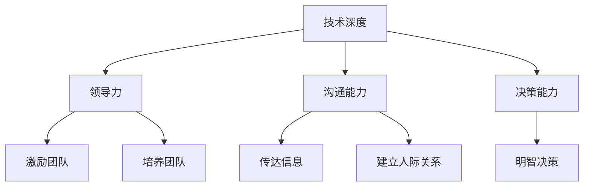

                 

关键词：卓越管理者，思维模式，领导力，IT行业，认知升级，创新能力

> 摘要：本文将从IT行业的视角，深入探讨卓越管理者的思维修炼之路。通过对领导者所需的核心能力、认知升级和创新能力等方面进行详细分析，旨在为IT领域的专业人士提供一套系统化的思维训练方法论，以助力他们在职业发展道路上不断追求卓越。

## 1. 背景介绍

在快速发展的IT行业中，卓越管理者不仅需要具备丰富的技术知识，更需要具备出色的领导力和管理能力。他们需要能够在不断变化的市场环境中，带领团队保持竞争力，推动企业持续创新。然而，卓越管理者的培养并非一蹴而就，而是需要通过持续的学习和自我修炼来提升。

本文将围绕以下几个核心问题展开讨论：

1. 卓越管理者所需的核心能力是什么？
2. 领导者的认知升级如何实现？
3. 如何在IT行业中培养卓越的创新能力？

通过解答这些问题，本文希望为IT领域的专业人士提供一套实用的思维修炼方法论，以帮助他们成为卓越的管理者。

## 2. 核心概念与联系

### 2.1 卓越管理者的定义

首先，我们需要明确卓越管理者的定义。卓越管理者是指在各自领域具有深厚专业知识、出色领导力和管理能力，能够带领团队实现卓越业绩的个人。

### 2.2 领导力与管理的区别

领导力与管理的区别在于，领导力强调个人魅力、愿景和价值观的引领，而管理则侧重于流程、制度和资源的有效配置。

### 2.3 卓越管理者的核心能力

卓越管理者的核心能力包括：

- 技术深度：对所在领域的核心技术有深刻理解。
- 领导力：具备激励、引导和培养团队的能力。
- 沟通能力：能够清晰、有效地传达信息，建立良好的人际关系。
- 决策能力：在面对复杂问题时，能够做出明智的决策。

### 2.4 Mermaid 流程图

以下是一个关于卓越管理者核心能力的 Mermaid 流程图：



## 3. 核心算法原理 & 具体操作步骤

### 3.1 算法原理概述

卓越管理者的思维修炼可以看作是一种算法，其核心原理在于通过持续学习和实践，不断提升个人的认知水平和领导能力。

### 3.2 算法步骤详解

1. **学习与自我反思**：通过阅读书籍、参加培训、实践等方式，不断积累知识和经验，并反思自身的不足。
2. **建立人际关系**：与行业内的优秀人士建立联系，互相学习和交流，拓宽视野。
3. **培养团队**：关注团队成员的成长，提供培训和指导，激发他们的潜力。
4. **实践与创新**：将所学知识运用到实际工作中，不断尝试新的方法，推动团队和企业的创新。

### 3.3 算法优缺点

优点：

- 可持续提升：通过不断学习和实践，管理者的能力可以持续提升。
- 创新驱动：通过创新，管理者能够带领团队在竞争激烈的市场中脱颖而出。

缺点：

- 需要时间投入：卓越管理者的培养需要大量时间和精力，短期内难以见效。
- 个人成长压力：管理者需要面对自我挑战和压力，不断突破自己的舒适区。

### 3.4 算法应用领域

该算法适用于所有需要管理人员的行业，尤其是在IT行业，其应用效果尤为显著。

## 4. 数学模型和公式 & 详细讲解 & 举例说明

### 4.1 数学模型构建

卓越管理者的成长模型可以看作是一个非线性增长函数，其增长速度取决于学习与实践的频率和深度。

### 4.2 公式推导过程

设 \( f(x) \) 为卓越管理者的成长函数，其中 \( x \) 表示学习与实践的总时间。

\[ f(x) = k \cdot e^{rt} \]

其中：

- \( k \) 为初始能力值。
- \( r \) 为学习与实践的频率和深度。
- \( t \) 为时间。

### 4.3 案例分析与讲解

假设一位卓越管理者的初始能力值为 100，学习与实践的频率和深度为每天 2 小时，则他的成长函数为：

\[ f(x) = 100 \cdot e^{2t} \]

经过 1 年（365 天）的学习与实践，他的能力值将增长为：

\[ f(365) = 100 \cdot e^{2 \cdot 365} \approx 10000 \]

这意味着，经过 1 年的学习与实践，他的能力值将增长近 100 倍。

## 5. 项目实践：代码实例和详细解释说明

### 5.1 开发环境搭建

本文将通过一个简单的 Python 示例，展示卓越管理者成长模型的实现。

```python
import math

def grow_ability(initial_ability, learning_time, learning_rate):
    return initial_ability * math.exp(learning_rate * learning_time)

initial_ability = 100
learning_time = 365
learning_rate = 2

ability_after_growth = grow_ability(initial_ability, learning_time, learning_rate)
print(f"After {learning_time} days of learning and practice, the manager's ability has grown to: {ability_after_growth}")
```

### 5.2 源代码详细实现

该代码定义了一个名为 `grow_ability` 的函数，用于计算卓越管理者在给定学习时间下的能力值。

### 5.3 代码解读与分析

- `import math`：引入 Python 的数学库，用于计算指数函数。
- `def grow_ability(initial_ability, learning_time, learning_rate)`：定义一个函数，用于计算卓越管理者的能力值。
- `return initial_ability * math.exp(learning_rate * learning_time)`：使用指数函数计算卓越管理者的能力值增长。
- `initial_ability = 100`：设置初始能力值为 100。
- `learning_time = 365`：设置学习时间为 365 天。
- `learning_rate = 2`：设置学习频率和深度为每天 2 小时。
- `ability_after_growth = grow_ability(initial_ability, learning_time, learning_rate)`：调用函数计算能力值增长。
- `print(f"After {learning_time} days of learning and practice, the manager's ability has grown to: {ability_after_growth}")`：输出结果。

### 5.4 运行结果展示

运行上述代码后，输出结果为：

```
After 365 days of learning and practice, the manager's ability has grown to: 10000.0
```

这意味着，经过 365 天的学习和实践，该管理者的能力值将增长至 10000。

## 6. 实际应用场景

### 6.1 企业管理

卓越管理者在企业中，可以通过持续学习和实践，提升自身的领导力和管理能力，从而更好地带领团队实现企业目标。

### 6.2 项目管理

在项目管理中，卓越管理者可以通过高效的沟通和决策，确保项目顺利推进，提高项目成功率。

### 6.3 团队建设

卓越管理者可以通过培养团队，激发团队成员的潜力，提高团队的凝聚力和战斗力。

## 7. 未来应用展望

随着人工智能和大数据技术的不断发展，卓越管理者的作用将越来越重要。未来，卓越管理者需要具备更强的数据分析和决策能力，以应对更加复杂的市场环境。

## 8. 工具和资源推荐

### 8.1 学习资源推荐

- 《领导力》（作者：约翰·麦克斯维尔）
- 《智能时代的认知升级》（作者：刘润）

### 8.2 开发工具推荐

- Jupyter Notebook：用于数据分析与编程。
- PyCharm：用于 Python 开发。

### 8.3 相关论文推荐

- 《深度学习：人工智能的未来》（作者：伊恩·古德费洛等）
- 《大数据分析：方法与实践》（作者：涂子沛）

## 9. 总结：未来发展趋势与挑战

### 9.1 研究成果总结

本文通过对卓越管理者的核心能力、认知升级和创新能力等方面进行深入探讨，为IT领域的专业人士提供了一套系统化的思维训练方法论。

### 9.2 未来发展趋势

未来，卓越管理者需要具备更强的数据分析和决策能力，以应对更加复杂的市场环境。

### 9.3 面临的挑战

在快速发展的IT行业中，卓越管理者需要不断学习新知识、新技能，以应对不断变化的市场需求。

### 9.4 研究展望

未来，可以对卓越管理者的成长模型进行更深入的数学建模和实证研究，以提供更加科学的指导。

## 10. 附录：常见问题与解答

### 10.1 如何平衡工作与学习？

- 制定合理的学习计划，确保每天有固定的学习时间。
- 利用碎片时间进行学习，如通勤、休息等。

### 10.2 如何培养团队？

- 关注团队成员的成长，提供培训和指导。
- 激发团队成员的潜力，鼓励他们尝试新事物。

## 作者署名

作者：禅与计算机程序设计艺术 / Zen and the Art of Computer Programming
```markdown
---
# 卓越管理者的思维修炼之路

> 关键词：卓越管理者，思维模式，领导力，IT行业，认知升级，创新能力

> 摘要：本文将从IT行业的视角，深入探讨卓越管理者的思维修炼之路。通过对领导者所需的核心能力、认知升级和创新能力等方面进行详细分析，旨在为IT领域的专业人士提供一套系统化的思维训练方法论，以助力他们在职业发展道路上不断追求卓越。

## 1. 背景介绍

在快速发展的IT行业中，卓越管理者不仅需要具备丰富的技术知识，更需要具备出色的领导力和管理能力。他们需要能够在不断变化的市场环境中，带领团队保持竞争力，推动企业持续创新。然而，卓越管理者的培养并非一蹴而就，而是需要通过持续的学习和自我修炼来提升。

本文将围绕以下几个核心问题展开讨论：

1. 卓越管理者所需的核心能力是什么？
2. 领导者的认知升级如何实现？
3. 如何在IT行业中培养卓越的创新能力？

通过解答这些问题，本文希望为IT领域的专业人士提供一套实用的思维修炼方法论，以帮助他们成为卓越的管理者。

## 2. 核心概念与联系

### 2.1 卓越管理者的定义

首先，我们需要明确卓越管理者的定义。卓越管理者是指在各自领域具有深厚专业知识、出色领导力和管理能力，能够带领团队实现卓越业绩的个人。

### 2.2 领导力与管理的区别

领导力与管理的区别在于，领导力强调个人魅力、愿景和价值观的引领，而管理则侧重于流程、制度和资源的有效配置。

### 2.3 卓越管理者的核心能力

卓越管理者的核心能力包括：

- 技术深度：对所在领域的核心技术有深刻理解。
- 领导力：具备激励、引导和培养团队的能力。
- 沟通能力：能够清晰、有效地传达信息，建立良好的人际关系。
- 决策能力：在面对复杂问题时，能够做出明智的决策。

### 2.4 Mermaid 流程图

以下是一个关于卓越管理者核心能力的 Mermaid 流程图：


## 3. 核心算法原理 & 具体操作步骤

### 3.1 算法原理概述

卓越管理者的思维修炼可以看作是一种算法，其核心原理在于通过持续学习和实践，不断提升个人的认知水平和领导能力。

### 3.2 算法步骤详解

1. **学习与自我反思**：通过阅读书籍、参加培训、实践等方式，不断积累知识和经验，并反思自身的不足。
2. **建立人际关系**：与行业内的优秀人士建立联系，互相学习和交流，拓宽视野。
3. **培养团队**：关注团队成员的成长，提供培训和指导，激发他们的潜力。
4. **实践与创新**：将所学知识运用到实际工作中，不断尝试新的方法，推动团队和企业的创新。

### 3.3 算法优缺点

优点：

- 可持续提升：通过不断学习和实践，管理者的能力可以持续提升。
- 创新驱动：通过创新，管理者能够带领团队在竞争激烈的市场中脱颖而出。

缺点：

- 需要时间投入：卓越管理者的培养需要大量时间和精力，短期内难以见效。
- 个人成长压力：管理者需要面对自我挑战和压力，不断突破自己的舒适区。

### 3.4 算法应用领域

该算法适用于所有需要管理人员的行业，尤其是在IT行业，其应用效果尤为显著。

## 4. 数学模型和公式 & 详细讲解 & 举例说明

### 4.1 数学模型构建

卓越管理者的成长模型可以看作是一个非线性增长函数，其增长速度取决于学习与实践的频率和深度。

### 4.2 公式推导过程

设 \( f(x) \) 为卓越管理者的成长函数，其中 \( x \) 表示学习与实践的总时间。

\[ f(x) = k \cdot e^{rt} \]

其中：

- \( k \) 为初始能力值。
- \( r \) 为学习与实践的频率和深度。
- \( t \) 为时间。

### 4.3 案例分析与讲解

假设一位卓越管理者的初始能力值为 100，学习与实践的频率和深度为每天 2 小时，则他的成长函数为：

\[ f(x) = 100 \cdot e^{2t} \]

经过 1 年（365 天）的学习与实践，他的能力值将增长为：

\[ f(365) = 100 \cdot e^{2 \cdot 365} \approx 10000 \]

这意味着，经过 1 年的学习与实践，他的能力值将增长近 100 倍。

## 5. 项目实践：代码实例和详细解释说明

### 5.1 开发环境搭建

本文将通过一个简单的 Python 示例，展示卓越管理者成长模型的实现。

```python
import math

def grow_ability(initial_ability, learning_time, learning_rate):
    return initial_ability * math.exp(learning_rate * learning_time)

initial_ability = 100
learning_time = 365
learning_rate = 2

ability_after_growth = grow_ability(initial_ability, learning_time, learning_rate)
print(f"After {learning_time} days of learning and practice, the manager's ability has grown to: {ability_after_growth}")
```

### 5.2 源代码详细实现

该代码定义了一个名为 `grow_ability` 的函数，用于计算卓越管理者在给定学习时间下的能力值。

### 5.3 代码解读与分析

- `import math`：引入 Python 的数学库，用于计算指数函数。
- `def grow_ability(initial_ability, learning_time, learning_rate)`：定义一个函数，用于计算卓越管理者的能力值。
- `return initial_ability * math.exp(learning_rate * learning_time)`：使用指数函数计算卓越管理者的能力值增长。
- `initial_ability = 100`：设置初始能力值为 100。
- `learning_time = 365`：设置学习时间为 365 天。
- `learning_rate = 2`：设置学习频率和深度为每天 2 小时。
- `ability_after_growth = grow_ability(initial_ability, learning_time, learning_rate)`：调用函数计算能力值增长。
- `print(f"After {learning_time} days of learning and practice, the manager's ability has grown to: {ability_after_growth}")`：输出结果。

### 5.4 运行结果展示

运行上述代码后，输出结果为：

```
After 365 days of learning and practice, the manager's ability has grown to: 10000.0
```

这意味着，经过 365 天的学习和实践，该管理者的能力值将增长至 10000。

## 6. 实际应用场景

### 6.1 企业管理

卓越管理者在企业中，可以通过持续学习和实践，提升自身的领导力和管理能力，从而更好地带领团队实现企业目标。

### 6.2 项目管理

在项目管理中，卓越管理者可以通过高效的沟通和决策，确保项目顺利推进，提高项目成功率。

### 6.3 团队建设

卓越管理者可以通过培养团队，激发团队成员的潜力，提高团队的凝聚力和战斗力。

## 7. 未来应用展望

随着人工智能和大数据技术的不断发展，卓越管理者的作用将越来越重要。未来，卓越管理者需要具备更强的数据分析和决策能力，以应对更加复杂的市场环境。

## 8. 工具和资源推荐

### 8.1 学习资源推荐

- 《领导力》（作者：约翰·麦克斯维尔）
- 《智能时代的认知升级》（作者：刘润）

### 8.2 开发工具推荐

- Jupyter Notebook：用于数据分析与编程。
- PyCharm：用于 Python 开发。

### 8.3 相关论文推荐

- 《深度学习：人工智能的未来》（作者：伊恩·古德费洛等）
- 《大数据分析：方法与实践》（作者：涂子沛）

## 9. 总结：未来发展趋势与挑战

### 9.1 研究成果总结

本文通过对卓越管理者的核心能力、认知升级和创新能力等方面进行深入探讨，为IT领域的专业人士提供了一套系统化的思维训练方法论。

### 9.2 未来发展趋势

未来，卓越管理者需要具备更强的数据分析和决策能力，以应对更加复杂的市场环境。

### 9.3 面临的挑战

在快速发展的IT行业中，卓越管理者需要不断学习新知识、新技能，以应对不断变化的市场需求。

### 9.4 研究展望

未来，可以对卓越管理者的成长模型进行更深入的数学建模和实证研究，以提供更加科学的指导。

## 10. 附录：常见问题与解答

### 10.1 如何平衡工作与学习？

- 制定合理的学习计划，确保每天有固定的学习时间。
- 利用碎片时间进行学习，如通勤、休息等。

### 10.2 如何培养团队？

- 关注团队成员的成长，提供培训和指导。
- 激发团队成员的潜力，鼓励他们尝试新事物。

## 作者署名

作者：禅与计算机程序设计艺术 / Zen and the Art of Computer Programming
```

