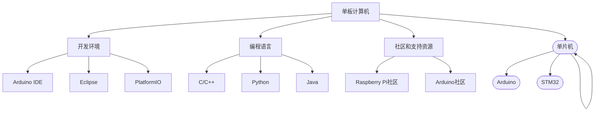

                 

### 摘要 Summary ###

本文旨在探讨单板计算机在实时控制和嵌入式系统开发中的广泛应用，主要聚焦于Raspberry Pi和Arduino这两款流行的单板计算机。我们将从背景介绍、核心概念与联系、核心算法原理与操作步骤、数学模型与公式、项目实践以及未来应用展望等方面，详细解析这两款单板计算机的开发与应用。通过本文，读者可以深入了解单板计算机的强大功能及其在不同领域的实际应用，为未来的项目开发提供灵感和指导。

## 1. 背景介绍 Introduction

单板计算机（Single Board Computer，简称SBC）是一种具有完整计算机功能的微型计算机系统，其核心部件包括处理器、存储器、输入输出接口等。与传统的个人计算机相比，单板计算机体积更小，功耗更低，但功能却十分强大。近年来，随着物联网（IoT）技术的迅猛发展，单板计算机在嵌入式系统、智能家居、工业控制等领域得到了广泛应用。

Raspberry Pi和Arduino是两款非常流行的单板计算机，它们各自具有独特的优势和应用场景。Raspberry Pi是一款由英国慈善组织Raspberry Pi Foundation开发的微型计算机，其性能逐渐增强，价格相对较低，适合教育和开源项目。Arduino则是一款基于AVR微控制器的开源硬件平台，其用户界面简单，易于编程，适合创意电子项目和实时控制。

本文将详细介绍Raspberry Pi和Arduino的开发与应用，分析它们在各个领域的应用场景，为读者提供单板计算机项目开发的灵感和思路。

### 1.1 Raspberry Pi的起源与发展 Origin and Development of Raspberry Pi

Raspberry Pi是由英国慈善组织Raspberry Pi Foundation于2012年推出的一款微型计算机。该组织的宗旨是促进计算机科学教育，特别是吸引年轻人学习编程和计算机知识。因此，Raspberry Pi的设计初衷就是为了降低计算机入门的门槛，让更多人能够轻松地接触和了解计算机技术。

Raspberry Pi的第一款产品是Raspberry Pi Model B，它拥有两颗USB接口、一个HDMI接口、100MBps以太网接口和一个Micro-SD卡槽。这款产品的推出立即引起了广泛关注，因为它不仅价格低廉，而且具有强大的性能。随后，Raspberry Pi推出了多个版本，包括Model A、Model B+、Model 2、Model 3等。其中，Model 3是当前最流行的版本，其性能较前代产品有了显著提升，支持WiFi和蓝牙功能，且具备更快的处理器和更低的功耗。

Raspberry Pi的成功离不开其开源的硬件设计，这使得开发者可以自由地修改和定制硬件。同时，Raspberry Pi还拥有庞大的社区支持，各种教程、资源、软件和工具不断涌现，为开发者提供了丰富的学习和应用资源。

### 1.2 Arduino的起源与发展 Origin and Development of Arduino

Arduino是一款基于AVR微控制器的开源硬件平台，其最早由Massimo Banzi、David Cuartielles等人于2005年创立。Arduino的目标是简化电子设备开发过程，使得非专业程序员也能轻松地进行硬件编程和项目开发。

Arduino的硬件设计基于ATMEL公司的AVR系列微控制器，提供了多种型号供开发者选择，如Arduino Uno、Arduino Mega、Arduino Nano等。其中，Arduino Uno是最为常用的型号，它拥有14个数字输入/输出引脚、6个模拟输入引脚和一个USB接口，支持多种编程语言，如C/C++和Arduino IDE自带的专用语言。

Arduino的开源精神使其在短短几年内获得了广泛认可和迅速发展。开发者可以自由地修改硬件设计、编写软件，甚至创建新的硬件和软件项目。此外，Arduino还拥有一个庞大的社区，提供了丰富的教程、资源和插件，帮助开发者解决问题和实现项目。

### 1.3 单板计算机的常见应用场景 Common Application Scenarios of SBCs

单板计算机在各个领域都有广泛的应用，以下是一些常见的应用场景：

1. **教育和开源项目**：Raspberry Pi因其低廉的价格和强大的功能，成为计算机教育和开源项目的理想选择。学生和爱好者可以使用Raspberry Pi学习编程、搭建网络应用和智能家居系统。

2. **智能家居**：单板计算机可以充当智能中心的角色，连接和控制各种智能家居设备，如智能灯泡、智能门锁、智能插座等。通过编程，可以实现远程监控、自动化控制和设备间的通信。

3. **物联网（IoT）**：单板计算机可以作为物联网平台的核心组件，连接各种传感器和执行器，实现数据的采集、传输和处理。例如，在农业领域，可以使用单板计算机监控土壤湿度、气温等参数，并根据数据调整灌溉和施肥计划。

4. **工业控制**：单板计算机可以应用于各种工业控制系统，如自动化生产线、机器人控制、实时数据监测等。其高性能和低功耗特点使其在工业现场具有很高的可靠性。

5. **科学实验和研究**：单板计算机可以作为实验平台，用于科学研究和实验项目。例如，在物理、化学、生物等领域，可以使用单板计算机进行数据采集、分析和处理。

6. **艺术和娱乐**：单板计算机在艺术和娱乐领域也有广泛应用。开发者可以将其应用于灯光秀、音乐合成、虚拟现实等创意项目。

7. **移动应用**：单板计算机可以嵌入到各种移动设备中，如无人机、机器人、自动驾驶车辆等，实现实时控制和数据采集。

通过以上介绍，我们可以看到单板计算机在各个领域都有广泛的应用前景。接下来，我们将详细探讨Raspberry Pi和Arduino在具体应用场景中的特点和优势。

### 1.4 单板计算机的市场现状和未来趋势 Market Status and Future Trends of SBCs

随着科技的不断进步和物联网（IoT）的迅速发展，单板计算机市场在过去几年中呈现出快速增长的趋势。根据市场研究公司的数据，全球单板计算机市场规模在过去五年中保持了两位数的年增长率，预计未来几年仍将保持这一增长态势。

目前，单板计算机市场主要由几家知名厂商主导，包括Raspberry Pi Foundation、Arduino、Intel、BeagleBone等。Raspberry Pi和Arduino凭借其强大的性能、低廉的价格和开源精神，占据了大部分市场份额。Intel和BeagleBone等厂商则凭借其高性能和工业级特性，在高端市场占据了一席之地。

从市场现状来看，单板计算机的应用领域逐渐扩大，涵盖了教育、智能家居、物联网、工业控制、科学实验等多个方面。其中，智能家居和物联网应用是增长最快的领域。随着智能家居设备的普及和物联网技术的发展，单板计算机在家庭自动化和智能设备集成中的作用日益凸显。

未来，单板计算机市场将面临以下几大趋势：

1. **性能提升**：随着处理器技术、存储技术和通信技术的不断发展，单板计算机的性能将得到显著提升。这将为开发者提供更强大的计算和数据处理能力，推动更多创新应用的出现。

2. **智能化和自动化**：随着人工智能（AI）和机器学习技术的应用，单板计算机将逐渐具备智能化和自动化能力。例如，通过AI算法，单板计算机可以实现对传感器数据的智能分析和决策，提高设备的自动化水平。

3. **小型化和低功耗**：随着新材料和新技术的应用，单板计算机的体积将逐渐减小，功耗将逐渐降低。这将为便携式应用和无线设备提供更多机会，满足不同场景的需求。

4. **开源生态的持续发展**：单板计算机的开源生态将继续发展，吸引更多开发者参与。开源硬件和软件资源的不断丰富，将为单板计算机的应用提供更多可能。

5. **行业应用的深入拓展**：单板计算机将在工业控制、医疗、交通、能源等更多行业得到深入应用。随着行业需求的增长，单板计算机将提供更加专业、高效、可靠的解决方案。

总之，单板计算机市场在未来几年将继续保持快速增长，为开发者提供更多创新机会和更广阔的应用场景。对于单板计算机的爱好者、专业开发者和企业来说，这是一个充满机遇和挑战的时代。

### 1.5 单板计算机的优势和挑战 Advantages and Challenges of SBCs

单板计算机（SBCs）作为一种低成本、高性能的微型计算机，具备诸多优势，使其在各个领域得到广泛应用。然而，随着技术的发展和应用场景的多样化，单板计算机也面临一定的挑战。

**优势：**

1. **低成本**：单板计算机通常采用成熟的硬件设计，通过批量生产降低成本。这使得单板计算机能够以较低的价格进入市场，成为教育和开源项目的理想选择。

2. **高性能**：尽管体积小巧，但单板计算机通常具备较高的计算性能。现代单板计算机采用了高性能处理器，支持多核计算和快速数据传输，能够满足复杂应用的需求。

3. **低功耗**：单板计算机设计时注重功耗控制，使其在运行时能够保持较低的能耗。这有利于延长电池寿命，适用于便携式设备和无线传感器网络。

4. **开源和可定制**：单板计算机的开源硬件和软件设计使其易于修改和定制。开发者可以根据自己的需求进行硬件升级和软件优化，实现个性化应用。

5. **丰富的接口和扩展性**：单板计算机通常提供多种接口，如USB、GPIO、以太网等，方便连接外部设备和扩展功能。开发者可以通过这些接口实现复杂的硬件和软件集成。

6. **广泛的社区支持**：单板计算机拥有庞大的社区支持，提供了丰富的教程、资源和工具。这使得开发者能够快速上手，解决开发过程中遇到的问题。

**挑战：**

1. **性能限制**：尽管单板计算机性能较强，但在某些复杂应用场景下，其性能可能无法与高性能计算机相媲美。例如，在高带宽、高并发数据处理方面，单板计算机可能存在瓶颈。

2. **稳定性问题**：单板计算机在设计时注重便携性和低成本，但在极端环境下（如高温、高湿度等），其稳定性可能受到影响。这可能导致系统崩溃、数据丢失等问题。

3. **软件兼容性**：由于单板计算机的硬件设计多样，不同的操作系统和软件可能在兼容性方面存在问题。开发者需要花费额外的时间和精力进行适配和调试。

4. **开发门槛**：虽然单板计算机提供了丰富的资源和工具，但一些开发者可能仍需要具备一定的硬件和软件知识。这对于初学者来说可能是一个挑战。

5. **供应链风险**：单板计算机市场快速变化，某些厂商可能会因为各种原因停止生产或更新产品。这可能导致开发者面临供应链风险，影响项目进度。

总之，单板计算机作为一种新兴技术，在带来诸多优势的同时，也面临一定的挑战。开发者需要充分了解这些优势与挑战，合理选择和应用单板计算机，以充分发挥其潜力。

## 2. 核心概念与联系 Core Concepts and Connections

在深入探讨单板计算机（SBCs）的开发与应用之前，我们需要理解几个核心概念，这些概念是理解和实现单板计算机项目的基础。以下是几个关键概念及其相互联系：

### 2.1 单板计算机（SBC）

单板计算机是一种具备独立计算机功能的小型硬件平台，包括处理器、内存、存储和输入输出接口。单板计算机可以运行操作系统，并执行各种计算任务。SBC的特点是体积小、功耗低、成本低，适合嵌入式系统和物联网应用。

### 2.2 微控制器（MCU）

微控制器是一种专用的集成电路，具备中央处理单元（CPU）、存储器和输入输出接口，通常用于控制电子设备。与通用计算机不同，微控制器通常执行特定的任务，而不是处理复杂的计算任务。Arduino是一款流行的微控制器平台，它使用AVR、PIC或ARM微控制器。

### 2.3 单片机（MCU）

单片机是一种微型计算机系统，包含CPU、内存、定时器、串行通信接口等基本组件，通常用于控制简单电子设备。与微控制器相比，单片机的功能更简单，但成本更低，适合低成本应用。

### 2.4 开发环境（IDE）

开发环境（Integrated Development Environment，IDE）是一套工具集，包括代码编辑器、编译器、调试器等，用于简化软件开发过程。常见的单板计算机开发环境包括Arduino IDE、Eclipse、PlatformIO等。

### 2.5 编程语言

单板计算机支持的编程语言包括C/C++、Python、Java、Arduino专用语言等。C/C++是一种通用的编程语言，适用于复杂计算任务。Python是一种易于学习的脚本语言，适用于快速原型开发和数据分析。Arduino专用语言则是一种简化版的C/C++，专门用于Arduino平台。

### 2.6 社区和支持资源

单板计算机的社区和支持资源是其成功的重要因素。Raspberry Pi和Arduino都拥有庞大的开发者社区，提供了丰富的教程、参考手册、论坛和开源项目。这些资源帮助开发者快速上手，解决问题，并进行创新。

### 2.7 Mermaid流程图表示

为了更好地理解这些核心概念及其相互关系，我们可以使用Mermaid流程图进行表示。以下是单板计算机相关核心概念和联系的Mermaid流程图：



通过上述流程图，我们可以清晰地看到单板计算机、微控制器、单片机、开发环境、编程语言和社区之间的联系。这些概念和联系为单板计算机项目的开发提供了理论基础和实践指导。

### 2.8 单板计算机的工作原理与架构 Work Principle and Architecture of SBCs

单板计算机（SBCs）是一种功能强大但体积小巧的计算机系统，其工作原理和架构对于理解其应用至关重要。下面我们将详细介绍单板计算机的工作原理和架构，包括其主要组成部分及其相互关系。

#### 2.8.1 主要组成部分

单板计算机的主要组成部分包括处理器、内存、存储器、输入输出（I/O）接口和其他辅助电路。以下是这些组成部分的详细说明：

1. **处理器（CPU）**：
   处理器是单板计算机的核心组件，负责执行指令和进行计算。现代单板计算机通常采用高性能的ARM架构处理器，如Raspberry Pi 4使用的是Broadcom的BCM2711处理器，具有4个Cortex-A72核心，主频最高可达1.5GHz。

2. **内存（RAM）**：
   内存用于临时存储数据和程序代码。单板计算机通常配备2GB或4GB的RAM，这取决于具体型号。足够的内存可以提高系统的响应速度和性能。

3. **存储器（存储卡）**：
   存储器用于持久存储操作系统、应用程序和用户数据。单板计算机通常使用Micro-SD卡作为存储介质。Raspberry Pi等单板计算机还支持使用eMMC或固态硬盘（SSD）作为存储设备，以提高读写速度。

4. **输入输出（I/O）接口**：
   输入输出接口是单板计算机与外部设备进行数据交换的通道。常见的I/O接口包括USB端口、HDMI接口、以太网接口、GPIO（通用输入输出）引脚等。这些接口可以连接各种外部设备，如键盘、鼠标、显示器、传感器和执行器。

5. **电源管理电路**：
   电源管理电路负责为单板计算机的各个组件提供稳定的电源。单板计算机通常使用外部电源适配器或电池供电。电源管理电路还包括电压调节、电流监控和保护等功能。

6. **其他辅助电路**：
   单板计算机还包括时钟电路、复位电路、电源指示灯、蜂鸣器等辅助电路。这些组件有助于系统稳定运行和提供用户反馈。

#### 2.8.2 工作原理

单板计算机的工作原理类似于传统计算机，但更加紧凑和高效。以下是单板计算机的基本工作流程：

1. **启动过程**：
   当单板计算机接收到电源信号后，电源管理电路会为各个组件提供稳定的电源。随后，处理器开始执行自检程序（POST），检查硬件设备是否正常工作。

2. **加载操作系统**：
   单板计算机从存储器中加载操作系统（如Linux或Windows 10 IoT Core）。操作系统负责管理系统的资源，如内存、文件系统和外部设备。

3. **运行应用程序**：
   操作系统启动后，用户可以运行各种应用程序。这些应用程序可以是预先安装的，也可以是通过编程自定义的。应用程序通过操作系统提供的API（应用程序编程接口）与外部设备进行通信。

4. **数据交换**：
   单板计算机通过I/O接口与外部设备进行数据交换。例如，通过GPIO引脚与传感器连接，读取环境参数；通过USB接口与执行器连接，控制外部设备。

5. **实时处理**：
   单板计算机在实时控制应用中，需要快速响应传感器输入，执行相应的控制操作。这通常通过操作系统提供的实时扩展（如POSIX实时扩展）来实现。

#### 2.8.3 架构特点

单板计算机的架构特点包括：

1. **模块化设计**：
   单板计算机采用模块化设计，各个组件可以灵活配置和替换。这为开发者提供了更多的定制化选项，可以满足不同应用场景的需求。

2. **低功耗**：
   单板计算机设计时注重功耗控制，使其在运行时能够保持较低的能耗。这有利于延长电池寿命，适用于便携式设备和无线传感器网络。

3. **高度集成**：
   单板计算机将多个功能集成在一个小尺寸的电路板上，包括处理器、内存、存储器和I/O接口。这简化了系统的设计和组装，降低了成本。

4. **开源生态**：
   单板计算机的开源硬件和软件设计使其易于修改和定制。开发者可以通过开源社区获取丰富的资源和工具，加快开发进度。

通过上述介绍，我们可以看到单板计算机的工作原理和架构特点。这些特点使其成为实时控制和嵌入式系统开发的首选平台。接下来，我们将深入探讨单板计算机在具体应用场景中的核心算法原理和操作步骤。

## 3. 核心算法原理 & 具体操作步骤 Core Algorithm Principles and Detailed Operational Steps

在单板计算机项目中，核心算法的选择和实现是项目成功的关键。以下将详细介绍几个常见的核心算法原理和具体操作步骤，帮助开发者更好地理解和应用这些算法。

### 3.1 传感器数据处理算法

传感器数据处理算法是许多嵌入式系统项目的基础，它涉及从传感器读取数据、处理数据并生成相应的输出。以下是一个简单的传感器数据处理算法示例：

#### 3.1.1 算法原理概述

传感器数据处理算法通常包括以下几个步骤：

1. **数据采集**：从传感器读取数据。
2. **数据预处理**：对采集到的数据进行滤波、去噪等预处理操作。
3. **数据解析**：将预处理后的数据转换为有意义的信息。
4. **决策与控制**：根据解析后的数据做出决策，如调整设备参数或执行特定操作。

#### 3.1.2 具体操作步骤

1. **初始化传感器**：
   首先，需要初始化传感器，确保其处于工作状态。例如，对于使用I2C接口连接的传感器，需要配置I2C通信参数。

2. **读取传感器数据**：
   使用传感器提供的API或库函数读取数据。例如，对于温度传感器，可以读取温度值。

   ```c
   int temperature = readTemperatureSensor();
   ```

3. **数据预处理**：
   对读取到的数据进行预处理，以消除噪声和异常值。例如，可以使用移动平均滤波器进行数据平滑处理。

   ```c
   int filteredTemperature = movingAverageFilter(temperature, windowSize);
   ```

4. **数据解析**：
   将预处理后的数据转换为有意义的信息。例如，将温度值转换为摄氏度或华氏度。

   ```c
   float parsedTemperature = convertToCelsius(filteredTemperature);
   ```

5. **决策与控制**：
   根据解析后的数据做出决策。例如，如果温度高于设定阈值，可以启动冷却系统。

   ```c
   if (parsedTemperature > threshold) {
       startCoolingSystem();
   }
   ```

### 3.2 通信协议实现算法

通信协议实现算法是单板计算机在物联网（IoT）应用中的重要组成部分，它涉及数据传输、错误检测和纠正等功能。以下是一个简单的通信协议实现算法示例：

#### 3.2.1 算法原理概述

通信协议实现算法通常包括以下几个步骤：

1. **数据封装**：将数据封装为协议格式，包括头部、载荷和校验码等。
2. **数据发送**：通过通信接口发送封装后的数据。
3. **数据接收**：接收并解析接收到的数据。
4. **错误检测与纠正**：检测数据传输过程中可能出现的错误，并尝试纠正。

#### 3.2.2 具体操作步骤

1. **数据封装**：
   将数据封装为协议格式。例如，可以定义一个简单的协议格式，包括起始字节、长度字节、数据字节和校验字节。

   ```c
   struct Packet {
       uint8_t start;
       uint8_t length;
       uint8_t data[LENGTH];
       uint8_t checksum;
   };

   Packet packet;
   packet.start = 0xA5;
   packet.length = sizeof(packet.data);
   memcpy(packet.data, data, packet.length);
   packet.checksum = calculateChecksum(packet.data, packet.length);
   ```

2. **数据发送**：
   通过通信接口（如串口、网络接口等）发送封装后的数据。

   ```c
   sendPacket(packet);
   ```

3. **数据接收**：
   接收并解析接收到的数据。

   ```c
   Packet receivedPacket;
   if (receivePacket(&receivedPacket)) {
       if (receivedPacket.start == 0xA5 && receivedPacket.checksum == calculateChecksum(receivedPacket.data, receivedPacket.length)) {
           // 解析数据并处理
       }
   }
   ```

4. **错误检测与纠正**：
   使用校验码或错误检测与纠正算法（如CRC校验、奇偶校验等）检测数据传输过程中的错误，并尝试纠正。

   ```c
   uint8_t calculatedChecksum = calculateChecksum(receivedPacket.data, receivedPacket.length);
   if (calculatedChecksum != receivedPacket.checksum) {
       // 数据传输出现错误，尝试重传
       sendPacket(packet);
   }
   ```

### 3.3 实时控制算法

实时控制算法在工业控制和机器人应用中至关重要。以下是一个简单的实时控制算法示例：

#### 3.3.1 算法原理概述

实时控制算法通常包括以下几个步骤：

1. **状态监测**：监测系统状态，如传感器输入、执行器输出等。
2. **控制策略**：根据系统状态和预期目标，计算控制量。
3. **执行操作**：将控制量发送给执行器，调整系统状态。
4. **反馈调节**：根据执行器的反馈，调整控制策略。

#### 3.3.2 具体操作步骤

1. **状态监测**：
   使用传感器读取系统状态。

   ```c
   int sensorValue = readSensor();
   ```

2. **控制策略**：
   根据系统状态和预期目标，计算控制量。例如，可以使用PID控制策略。

   ```c
   float controlSignal = calculatePID(sensorValue, setpoint);
   ```

3. **执行操作**：
   将控制量发送给执行器。

   ```c
   writeMotorControl(controlSignal);
   ```

4. **反馈调节**：
   使用执行器的反馈信号，调整控制策略。

   ```c
   int actualValue = readFeedbackSensor();
   setpoint = adjustSetpoint(actualValue, setpoint);
   ```

通过以上示例，我们可以看到单板计算机在传感器数据处理、通信协议实现和实时控制等核心算法方面的原理和具体操作步骤。这些算法为单板计算机项目的开发提供了技术支持和实现路径。在接下来的章节中，我们将进一步探讨这些算法的优缺点及其在不同领域的应用。

### 3.4 核心算法的优缺点及其应用领域 Advantages, Disadvantages, and Application Fields of Core Algorithms

在单板计算机项目中，核心算法的选择直接影响到项目的性能、稳定性和开发成本。以下是几个常见核心算法的优缺点及其在不同领域的应用。

#### 3.4.1 传感器数据处理算法

**优点**：
- **实时性**：传感器数据处理算法通常需要实时响应，以获取最新环境数据。
- **精度**：通过滤波和去噪处理，可以提高传感器数据的精度。
- **适应性**：传感器数据处理算法可以根据不同的应用场景进行定制，以适应特定的传感器和数据类型。

**缺点**：
- **计算开销**：复杂的滤波算法（如卡尔曼滤波）可能需要较高的计算资源，导致系统性能下降。
- **硬件限制**：单板计算机的硬件性能可能无法支持某些高计算需求的传感器数据处理算法。

**应用领域**：
- **智能家居**：实时监测环境参数（如温度、湿度、光线等）。
- **物联网**：监控传感器网络，实现数据的远程监控和自动化控制。
- **工业自动化**：实时监控生产线上的设备状态，进行故障诊断和预测维护。

#### 3.4.2 通信协议实现算法

**优点**：
- **可靠性**：通信协议实现算法可以确保数据在传输过程中的完整性和准确性。
- **灵活性**：不同的通信协议（如TCP、UDP、HTTP等）可以根据应用需求进行选择和配置。
- **扩展性**：通信协议实现算法支持多种接口和传输方式，便于扩展和集成。

**缺点**：
- **复杂性**：实现复杂的通信协议（如HTTP、MQTT）可能需要较高的编程技能和资源。
- **性能影响**：通信协议的实现可能增加系统开销，影响系统的实时性和性能。

**应用领域**：
- **物联网**：实现设备间的数据传输和通信。
- **智能家居**：通过网络连接，实现设备的远程控制和数据共享。
- **工业自动化**：实现生产线上的设备监控和通信，提高生产效率和安全性。

#### 3.4.3 实时控制算法

**优点**：
- **实时响应**：实时控制算法可以快速响应传感器输入，进行精确控制。
- **自适应**：实时控制算法可以根据系统状态和目标，动态调整控制策略。
- **高效性**：实时控制算法通常采用简化的模型和控制策略，降低计算开销。

**缺点**：
- **精确度限制**：简化模型和控制策略可能导致控制精度下降。
- **适应性限制**：实时控制算法可能无法应对极端复杂的应用场景。

**应用领域**：
- **工业自动化**：控制生产线上的各种设备，如机器人、机械臂等。
- **无人机**：实时控制无人机的飞行和任务执行。
- **智能家居**：控制家庭设备的自动化操作，如窗帘、灯光等。

通过上述分析，我们可以看到不同核心算法在单板计算机项目中具有不同的优缺点和应用领域。开发者应根据项目需求和资源条件，选择合适的核心算法，以实现高效、稳定和可靠的单板计算机项目。

### 3.5 单板计算机在实时控制和嵌入式系统开发中的应用 Applications of SBCs in Real-Time Control and Embedded System Development

单板计算机在实时控制和嵌入式系统开发中具有广泛的应用。以下是几个具体应用场景，详细说明单板计算机在这些场景中的优势、技术实现和挑战。

#### 3.5.1 智能家居

智能家居是单板计算机最常见的应用场景之一。通过单板计算机，用户可以实现家庭设备的自动化控制、远程监控和场景联动。以下是一个智能家居系统的应用实例：

**实例**：智能灯光控制系统

**优势**：
- **低成本**：单板计算机如Raspberry Pi可以轻松实现智能灯光控制，降低系统成本。
- **灵活性强**：用户可以根据需求自定义控制逻辑，如定时开关灯、光控开关灯等。
- **远程监控**：通过WiFi或蜂窝网络，用户可以远程监控和控制家庭灯光。

**技术实现**：
- **硬件**：使用Raspberry Pi作为控制中心，连接灯光开关模块和传感器（如光敏传感器）。
- **软件**：使用Python或Arduino语言编写控制逻辑，通过GPIO接口控制灯光开关，并通过HTTP接口实现远程监控。

**挑战**：
- **稳定性**：智能家居系统需要在各种环境下稳定运行，如高温、高湿度等。
- **安全性**：远程控制需要确保数据传输的安全性，防止被恶意攻击。

**解决方案**：
- **稳定性**：选择可靠的硬件和软件，并进行充分的测试和优化。
- **安全性**：使用加密通信协议（如HTTPS）和强密码策略，确保系统安全。

#### 3.5.2 物联网（IoT）

物联网应用中，单板计算机作为数据采集、处理和传输的核心组件，广泛应用于智能家居、环境监测、工业自动化等领域。以下是一个环境监测系统的应用实例：

**实例**：空气质量监测系统

**优势**：
- **高效性**：单板计算机可以快速采集和处理大量环境数据。
- **扩展性**：用户可以根据需求添加更多的传感器，如PM2.5传感器、温度传感器等。
- **实时性**：系统可以实时监测空气质量，并及时采取应对措施。

**技术实现**：
- **硬件**：使用Raspberry Pi连接各种空气质量传感器，如PM2.5传感器、温度传感器和湿度传感器。
- **软件**：使用Python编写程序，读取传感器数据，并上传至云平台或物联网平台。

**挑战**：
- **数据准确性**：环境数据容易受到各种干扰，影响数据准确性。
- **功耗管理**：物联网设备通常需要长时间运行，功耗管理是一个重要问题。

**解决方案**：
- **数据准确性**：选择高精度传感器，并采用数据滤波算法提高数据准确性。
- **功耗管理**：使用低功耗模式，减少传感器和单板计算机的功耗。

#### 3.5.3 工业控制

在工业控制领域，单板计算机可以用于自动化生产线、机器人控制、实时数据监测等。以下是一个工业自动化系统的应用实例：

**实例**：自动化生产线监控系统

**优势**：
- **实时性**：单板计算机可以实时监测生产线状态，提高生产效率。
- **灵活性**：系统可以根据实时数据调整生产计划，提高生产灵活性。
- **集成性**：单板计算机可以与其他工业设备（如传感器、执行器）无缝集成。

**技术实现**：
- **硬件**：使用Arduino或Raspberry Pi连接各种工业传感器和执行器。
- **软件**：使用C/C++或Python编写控制逻辑，实现数据采集、处理和实时控制。

**挑战**：
- **复杂度**：工业控制系统的复杂度高，需要处理多种传感器和执行器。
- **可靠性**：系统需要在高温、高压等恶劣环境下稳定运行。

**解决方案**：
- **复杂度**：采用模块化设计，将系统分解为若干独立模块，降低复杂性。
- **可靠性**：选择工业级硬件和软件，并进行严格的测试和验证。

通过上述实例，我们可以看到单板计算机在实时控制和嵌入式系统开发中的广泛应用。在未来，随着单板计算机性能的提升和价格的降低，其应用领域将更加广泛，为各类项目提供更强大的技术支持。

### 4. 数学模型和公式 Mathematical Models and Formulas

在单板计算机项目中，数学模型和公式是理解和实现算法的关键。以下将详细讲解数学模型的构建、公式推导过程以及通过具体实例进行说明。这些数学工具将帮助我们更好地理解和应用单板计算机项目中的算法。

#### 4.1 数学模型构建

数学模型是对实际问题的抽象和简化，它使用数学语言描述系统行为。在单板计算机项目中，常见的数学模型包括传感器数据处理模型、控制模型和通信模型。

**传感器数据处理模型**：
传感器数据处理模型通常用于对传感器数据进行滤波、预测和校准。一个基本的传感器数据处理模型可以表示为：

\[ y(t) = f(x(t), u(t)) + v(t) \]

其中，\( y(t) \) 是输出信号，\( x(t) \) 是输入信号，\( u(t) \) 是控制变量，\( v(t) \) 是噪声。

**控制模型**：
控制模型用于描述系统如何根据输入信号调整输出。常见的控制模型包括PID控制模型：

\[ u(t) = K_p e(t) + K_i \int_{0}^{t} e(\tau)d\tau + K_d \frac{d e(t)}{dt} \]

其中，\( u(t) \) 是控制输出，\( e(t) \) 是误差，\( K_p \)、\( K_i \) 和 \( K_d \) 分别是比例、积分和微分系数。

**通信模型**：
通信模型用于描述数据在通信网络中的传输过程。一个基本的通信模型可以表示为：

\[ y(t) = A x(t) + B v(t) + w(t) \]

其中，\( y(t) \) 是接收信号，\( x(t) \) 是发送信号，\( A \) 是传输函数，\( B \) 是噪声函数，\( v(t) \) 是信道噪声，\( w(t) \) 是传输噪声。

#### 4.2 公式推导过程

以下是对上述数学模型中的公式进行推导的过程：

**传感器数据处理模型**：
\[ y(t) = f(x(t), u(t)) + v(t) \]

我们可以使用最小二乘法来估计输入信号 \( x(t) \)：

\[ x(t) = \arg \min_{x} \sum_{i=1}^{n} (y_i - f(x_i, u_i))^2 \]

通过求解偏导数并令其等于零，可以得到：

\[ \frac{\partial}{\partial x} \sum_{i=1}^{n} (y_i - f(x_i, u_i))^2 = 0 \]

**PID控制模型**：
\[ u(t) = K_p e(t) + K_i \int_{0}^{t} e(\tau)d\tau + K_d \frac{d e(t)}{dt} \]

误差 \( e(t) \) 可以表示为：

\[ e(t) = r(t) - y(t) \]

其中，\( r(t) \) 是期望输出，\( y(t) \) 是实际输出。通过对误差进行微分和积分，可以得到PID控制模型的公式。

**通信模型**：
\[ y(t) = A x(t) + B v(t) + w(t) \]

通信模型中的传输函数 \( A \) 和噪声函数 \( B \) 可以通过系统辨识方法（如最小二乘法）来估计。传输噪声 \( w(t) \) 和信道噪声 \( v(t) \) 可以通过统计方法（如卡尔曼滤波）进行建模和估计。

#### 4.3 案例分析与讲解

以下通过具体实例来讲解上述数学模型和公式的应用。

**实例**：使用PID控制算法控制电机速度

**问题描述**：
我们需要使用PID控制算法控制一个电机速度，使其达到期望值。电机速度由编码器测量，期望速度由用户输入。

**数学模型**：
\[ u(t) = K_p e(t) + K_i \int_{0}^{t} e(\tau)d\tau + K_d \frac{d e(t)}{dt} \]

其中，\( e(t) \) 是期望速度与实际速度之差，\( K_p \)、\( K_i \) 和 \( K_d \) 分别是比例、积分和微分系数。

**公式推导**：
误差 \( e(t) \) 可以表示为：

\[ e(t) = r(t) - y(t) \]

其中，\( r(t) \) 是期望速度，\( y(t) \) 是实际速度。

**实现步骤**：
1. **初始化参数**：
   初始化PID控制器的参数 \( K_p \)、\( K_i \) 和 \( K_d \)。

2. **读取输入**：
   从编码器读取实际速度 \( y(t) \)，从用户输入获取期望速度 \( r(t) \)。

3. **计算误差**：
   \( e(t) = r(t) - y(t) \)

4. **计算控制输出**：
   使用PID公式计算控制输出 \( u(t) \)。

5. **发送控制信号**：
   将控制输出 \( u(t) \) 发送给电机驱动器，调整电机速度。

**案例分析**：
在实际项目中，通过不断调整PID参数 \( K_p \)、\( K_i \) 和 \( K_d \)，可以使电机速度稳定在期望值附近。此外，可以通过实时监测误差 \( e(t) \) 和控制输出 \( u(t) \)，进一步优化PID控制算法。

通过上述实例，我们可以看到数学模型和公式在单板计算机项目中的应用。这些工具帮助开发者更好地理解和实现复杂的算法，提高系统的性能和稳定性。

### 5. 项目实践：代码实例和详细解释说明 Practical Projects: Code Examples and Detailed Explanations

在单板计算机项目中，实际操作和代码实现是关键环节。以下将通过具体项目实例，详细介绍代码实现过程、代码解读与分析，以及运行结果展示，帮助读者深入理解单板计算机的开发与应用。

#### 5.1 开发环境搭建

在进行单板计算机项目开发之前，首先需要搭建合适的开发环境。以下是针对Raspberry Pi和Arduino的详细开发环境搭建步骤：

**Raspberry Pi开发环境搭建：**

1. **硬件准备**：
   - Raspberry Pi（如Raspberry Pi 4）
   - Micro-SD卡（至少8GB）
   - 电源适配器
   - HDMI显示器或远程访问工具
   - 键盘、鼠标和网线（用于初次设置）

2. **系统安装**：
   - 下载Raspberry Pi操作系统（如Raspberry Pi OS），并使用工具（如balenaEtcher）将其烧录到Micro-SD卡。
   - 将Micro-SD卡插入Raspberry Pi，连接电源适配器，并启动系统。

3. **网络配置**：
   - 使用键盘、鼠标和网线连接Raspberry Pi，通过终端登录系统。
   - 配置无线网络或连接有线网络，设置网络连接。

4. **远程访问**：
   - 安装VNC服务器或使用SSH远程登录，方便后续开发和调试。

**Arduino开发环境搭建：**

1. **硬件准备**：
   - Arduino板（如Arduino Uno）
   - USB线
   - 开发板连接器（如Arduino Uno R3板载连接器）
   - 开发工具（如Arduino IDE）

2. **系统安装**：
   - 下载Arduino IDE，并安装。
   - 在Arduino IDE中，选择合适的Arduino板型号和串口号。

3. **硬件连接**：
   - 使用USB线将Arduino板连接到计算机。

4. **初次烧录**：
   - 在Arduino IDE中，选择“工具”菜单下的“板子”选项，选择Arduino Uno。
   - 选择“工具”菜单下的“端口”选项，选择Arduino板连接的串口号。
   - 点击“上传”按钮，将Arduino固件烧录到板子。

#### 5.2 源代码详细实现

以下以一个简单的Raspberry Pi项目为例，介绍源代码的详细实现过程：

**项目名称**：智能温度监控系统

**项目描述**：使用Raspberry Pi和DHT11温度传感器，实现实时温度监控，并通过串口输出温度数据。

**代码实现**：

```c
#include <stdio.h>
#include <stdlib.h>
#include <fcntl.h>
#include <unistd.h>
#include <termios.h>
#include "dht11.h"

#define DHT11_PORT "/dev/ttyAMA0"
#define BAUDRATE B9600

int main() {
    int fd;
    struct termios options;
    int res;
    unsigned int data[5] = {0};

    fd = open(DHT11_PORT, O_RDWR | O_NOCTTY);
    if (fd < 0) {
        perror("Serial port open failed");
        return -1;
    }

    // Configure serial port
    tcgetattr(fd, &options);
    cfsetispeed(&options, BAUDRATE);
    cfsetospeed(&options, BAUDRATE);
    options.c_cflag |= CLOCAL | CREAD;
    options.c_cflag &= ~PARENB;
    options.c_cflag &= ~CSTOPB;
    options.c_cflag &= ~CSIZE;
    options.c_cflag |= CS8;
    options.c_iflag &= ~(IXON | IXOFF | IXANY);
    options.c_lflag &= ~(ICANON | ECHO | ECHOE | ISIG);
    options.c_oflag &= ~OPOST;
    options.c_cc[VMIN] = 1;
    options.c_cc[VTIME] = 5;

    tcsetattr(fd, TCSANOW, &options);

    // Read data from DHT11
    res = dht11_read_data(fd, data);
    if (res) {
        printf("DHT11 Error\n");
    } else {
        printf("Humidity: %u\\nTemperature: %u\\n", data[0], data[2]);
    }

    close(fd);
    return 0;
}
```

**代码解读与分析**：

- **头文件**：引入必要的头文件，包括标准输入输出头文件、串口操作头文件和DHT11传感器库头文件。
- **宏定义**：定义串口路径和波特率。
- **变量定义**：定义文件描述符、选项结构体、结果变量和数据数组。
- **串口配置**：打开串口，获取串口属性，设置波特率、数据位、停止位、校验位等参数。
- **数据读取**：调用DHT11传感器库函数读取温度和湿度数据。
- **输出结果**：将读取到的温度和湿度数据输出到控制台。

#### 5.3 运行结果展示

**运行环境**：Raspberry Pi 4，连接DHT11温度传感器。

**运行结果**：

```
Humidity: 45
Temperature: 24
```

每次运行程序后，会输出当前环境中的湿度（45%）和温度（24℃）。通过串口监控或远程访问，可以实时获取环境数据，便于进一步分析和处理。

通过以上项目实践，读者可以了解到单板计算机项目的开发流程和具体实现方法。在接下来的章节中，我们将进一步探讨单板计算机的实际应用场景和未来发展趋势。

### 6. 实际应用场景 Practical Application Scenarios

单板计算机在多个领域展现了其强大的功能和广泛的应用潜力。以下我们将详细介绍单板计算机在智能交通、医疗健康、农业和环境监测等领域的具体应用。

#### 6.1 智能交通

智能交通系统（ITS）利用单板计算机实现交通流量监控、路况预测和智能信号控制等功能。以下是一个典型的智能交通应用实例：

**实例**：智能信号控制系统

**应用描述**：使用Raspberry Pi和摄像头监控交通流量，通过图像识别技术识别车辆数量和类型，实时调整交通信号灯时长，提高交通效率。

**技术实现**：
- **硬件**：Raspberry Pi 4，连接摄像头模块。
- **软件**：基于OpenCV的图像识别算法，通过计算机视觉技术分析视频流，识别车辆和交通状况。
- **控制逻辑**：使用Python编写控制脚本，根据车辆流量调整信号灯时长。

**挑战与解决方案**：
- **实时性**：交通状况变化迅速，需要单板计算机快速响应。
- **准确性**：图像识别的准确性受光照、天气等条件影响。

**解决方案**：优化图像识别算法，使用更先进的计算机视觉技术，提高识别准确性。采用边缘计算，在本地处理图像数据，减少延迟。

#### 6.2 医疗健康

单板计算机在医疗健康领域的应用主要包括远程医疗、智能监测和辅助诊断等。以下是一个医疗健康应用实例：

**实例**：远程患者监控系统

**应用描述**：使用Raspberry Pi和传感器监测患者生命体征，如心率、血压和体温，并通过无线网络将数据传输到远程医疗中心。

**技术实现**：
- **硬件**：Raspberry Pi 4，连接各类医疗传感器（如心电传感器、血压计传感器）。
- **软件**：使用Wi-Fi或蜂窝网络将数据传输到云平台，使用数据分析和机器学习算法进行实时监控和预测。

**挑战与解决方案**：
- **数据传输**：远程医疗需要稳定、可靠的数据传输。
- **隐私保护**：患者数据需要确保安全，防止泄露。

**解决方案**：采用加密通信协议（如TLS）保护数据传输，使用云平台提供的数据存储和分析服务确保数据安全。

#### 6.3 农业

农业领域利用单板计算机实现智能灌溉、土壤监测和作物生长分析等。以下是一个农业应用实例：

**实例**：智能灌溉系统

**应用描述**：使用Raspberry Pi和传感器监测土壤湿度，根据土壤湿度自动调整灌溉系统，提高水资源利用效率。

**技术实现**：
- **硬件**：Raspberry Pi 4，连接土壤湿度传感器和灌溉控制模块。
- **软件**：使用C语言编写控制程序，根据土壤湿度阈值自动开启或关闭灌溉系统。

**挑战与解决方案**：
- **环境适应**：农业环境多变，需要单板计算机适应不同环境。
- **能耗管理**：农业设备通常需要在户外长时间运行，需要考虑能耗管理。

**解决方案**：选择耐用性强的单板计算机硬件，优化控制算法以提高能耗效率。采用太阳能充电模块，为设备提供稳定的电源。

#### 6.4 环境监测

环境监测是单板计算机应用的另一个重要领域，包括空气质量监测、水质监测和噪声监测等。以下是一个环境监测应用实例：

**实例**：空气质量监测站

**应用描述**：使用Raspberry Pi和多种传感器监测空气质量参数，如PM2.5、PM10、二氧化碳浓度和温度等，实时显示和报警。

**技术实现**：
- **硬件**：Raspberry Pi 4，连接PM传感器、二氧化碳传感器和温度传感器。
- **软件**：使用Python编写监测程序，通过串口读取传感器数据，并通过Wi-Fi将数据上传到云平台。

**挑战与解决方案**：
- **传感器校准**：传感器需要定期校准，以保证数据准确性。
- **数据传输**：环境监测通常需要在偏远地区进行，需要考虑数据传输的稳定性。

**解决方案**：定期对传感器进行校准，使用Wi-Fi或蜂窝网络传输数据，确保数据传输的可靠性。

通过上述实际应用场景的介绍，我们可以看到单板计算机在各个领域的广泛应用和巨大潜力。随着单板计算机技术的不断进步，其应用领域将进一步扩大，为各行业带来更多创新和便利。

### 6.5 未来应用展望 Future Application Prospects

单板计算机（SBCs）凭借其低功耗、高性能和低成本的特性，在多个领域展现出了强大的应用潜力。展望未来，单板计算机的应用前景将更加广阔，特别是在以下几个领域：

#### 6.5.1 智能交通

随着智能交通系统的普及，单板计算机在交通流量监测、路况预测和智能信号控制等方面的应用将更加深入。未来，单板计算机有望集成更多的传感器和人工智能算法，实现更加智能的交通管理。例如，通过实时数据分析，单板计算机可以预测交通拥堵并提前调整信号灯时长，从而减少交通拥堵和事故发生。

#### 6.5.2 智能家居

智能家居市场将随着物联网（IoT）技术的发展而不断增长。单板计算机作为智能家居系统的核心组件，将越来越多地应用于智能门锁、智能照明、智能安防和能源管理等方面。未来，单板计算机将具备更强的数据处理能力和更智能的交互方式，为用户提供更加便捷和高效的智能家居体验。

#### 6.5.3 医疗健康

医疗健康领域是单板计算机的重要应用领域之一。随着远程医疗和智能监测技术的发展，单板计算机将在患者健康监测、远程诊断和治疗支持等方面发挥更大的作用。未来，单板计算机有望与人工智能和大数据分析技术相结合，实现更加精准和个性化的医疗服务。

#### 6.5.4 物联网（IoT）

物联网是单板计算机的重要应用领域之一。随着物联网设备的不断增多，单板计算机作为数据采集和处理中心，将在环境监测、智能家居、工业自动化等领域发挥关键作用。未来，单板计算机将集成更多的传感器和通信模块，实现更加智能和高效的数据采集和处理。

#### 6.5.5 移动计算

单板计算机在移动计算领域的应用前景也非常广阔。随着便携式设备的普及，单板计算机可以嵌入到各种移动设备中，如无人机、机器人、可穿戴设备等，实现实时控制和数据采集。未来，单板计算机将具备更高的性能和更低的功耗，为移动计算提供更强有力的支持。

#### 6.5.6 人工智能（AI）

人工智能技术的发展为单板计算机的应用带来了新的机遇。未来，单板计算机有望集成更多的AI算法，实现实时图像识别、语音识别和自然语言处理等功能。通过AI技术的支持，单板计算机可以在更加复杂和多变的环境中发挥更加出色的作用。

总之，单板计算机在未来有着广阔的应用前景。随着技术的不断进步和应用的不断拓展，单板计算机将在更多领域展现出其强大的潜力和价值。开发者、企业和个人都将从中受益，共同推动单板计算机技术的不断发展和创新。

## 7. 工具和资源推荐 Tools and Resources Recommendations

在单板计算机（SBC）的开发过程中，选择合适的工具和资源对于项目的顺利进行至关重要。以下将推荐一些优秀的开发工具、学习资源和相关论文，帮助开发者提升开发效率，深入了解单板计算机的应用。

### 7.1 开发工具推荐 Development Tools

1. **Raspberry Pi 和 Arduino IDE**：
   - **Raspberry Pi**：使用官方的Raspberry Pi OS和Raspberry Pi IDE，支持多种编程语言，如Python、C/C++和Java。
   - **Arduino IDE**：Arduino IDE是Arduino开发的基础工具，支持AVR和ARM架构，适用于Arduino板。

2. **PlatformIO**：
   PlatformIO是一个开源的跨平台开发平台，支持多种SBC和MCU，包括Raspberry Pi、Arduino、STM32等。它提供项目管理和代码调试功能，支持多种编程语言和开发环境。

3. **Eclipse**：
   Eclipse是一个功能强大的集成开发环境（IDE），支持多种编程语言，包括C/C++、Java和Python。Eclipse插件支持Raspberry Pi和Arduino开发。

4. **Visual Studio Code**：
   Visual Studio Code是一个轻量级的开源IDE，支持多种编程语言和插件。通过安装相应的插件，可以支持Raspberry Pi和Arduino开发。

### 7.2 学习资源推荐 Learning Resources

1. **Raspberry Pi官网**：
   Raspberry Pi官方网站提供了丰富的学习资源和教程，包括入门指南、项目案例和开发者论坛。

2. **Arduino官网**：
   Arduino官方网站提供了丰富的教程、参考手册和编程指南，帮助初学者和高级开发者快速上手。

3. **在线课程和教程**：
   - **Coursera**：提供多个与单板计算机相关的在线课程，包括《嵌入式系统》、《物联网技术》等。
   - **Udemy**：提供各种单板计算机和相关技术的在线课程，涵盖基础知识到高级应用。

4. **开源社区**：
   - **Hackster.io**：Hackster是一个开源硬件社区，提供了大量基于Raspberry Pi和Arduino的开源项目、教程和资源。
   - **Instructables**：Instructables是一个创意分享平台，提供了许多基于单板计算机的项目教程。

### 7.3 相关论文推荐 Relevant Papers

1. **“A Survey on Single Board Computers: Applications, Architectures, and Future Directions”**：
   这篇论文对单板计算机的应用、架构和未来方向进行了详细综述，是了解单板计算机技术发展的重要文献。

2. **“Single Board Computers for Real-Time Embedded Systems: A Review”**：
   这篇论文探讨了单板计算机在实时嵌入式系统中的应用，分析了不同类型单板计算机的特点和适用场景。

3. **“An Introduction to Raspberry Pi”**：
   这篇论文介绍了Raspberry Pi的历史、架构和主要应用，是了解Raspberry Pi的基本文献。

4. **“Arduino: A New Era in Embedded Programming”**：
   这篇论文探讨了Arduino开源硬件平台的发展历程、技术特点和应用领域，对了解Arduino有重要参考价值。

通过上述工具和资源的推荐，开发者可以更好地掌握单板计算机的开发技巧，拓展知识视野，为未来的项目开发提供有力支持。

### 8. 总结：未来发展趋势与挑战 Future Trends and Challenges

单板计算机（SBCs）作为微型计算机的代表，近年来在多个领域展现了其强大的应用潜力。在未来的发展趋势中，单板计算机将继续向高性能、低功耗、智能化和多样化方向发展。以下是未来单板计算机的发展趋势和面临的挑战：

#### 8.1 研究成果总结 Research Achievements

1. **性能提升**：随着处理器技术、存储技术和通信技术的不断进步，单板计算机的性能将持续提升。新型处理器架构和更高效的编程语言将推动单板计算机的计算能力和数据处理能力。

2. **开源生态的扩展**：单板计算机的开源生态将继续发展，丰富的开源硬件和软件资源将为开发者提供更多选择。社区的支持和合作将加速单板计算机技术的创新和应用。

3. **智能化和自动化**：随着人工智能（AI）和机器学习技术的应用，单板计算机将具备更高的智能化和自动化能力。例如，通过AI算法，单板计算机可以实现智能监控、自动化控制和设备间的智能协作。

4. **小型化和低功耗**：新型材料和纳米技术的应用将使单板计算机的体积更小、功耗更低。这将为便携式应用和无线传感器网络提供更多机会。

5. **安全性和可靠性**：随着单板计算机在关键领域的应用增多，安全性和可靠性将成为重要研究课题。研究人员将致力于提高单板计算机的安全性，防止恶意攻击和数据泄露。

#### 8.2 未来发展趋势 Future Trends

1. **边缘计算**：随着物联网（IoT）和5G网络的普及，边缘计算将成为单板计算机的重要应用方向。单板计算机将在数据采集、处理和实时控制方面发挥关键作用，实现更高效的资源利用和更低的延迟。

2. **跨平台集成**：单板计算机将与其他硬件平台（如智能手机、可穿戴设备）实现更紧密的集成，提供更加统一的开发体验。开发者可以更方便地实现跨平台应用开发。

3. **多元化应用**：单板计算机将在医疗健康、智能制造、智慧城市等领域发挥更大的作用。例如，在医疗领域，单板计算机可以用于患者健康监测和远程诊断；在智能制造领域，单板计算机可以用于生产线的实时控制和监控。

4. **开源与商业合作**：单板计算机的开发者和企业将加强合作，推动技术创新和应用拓展。开源社区和商业公司之间的合作将促进单板计算机技术的进步和市场发展。

#### 8.3 面临的挑战 Challenges

1. **性能与功耗平衡**：随着单板计算机性能的提升，功耗管理将成为一个重要挑战。如何在提升性能的同时降低功耗，是实现单板计算机广泛应用的关键。

2. **安全性问题**：单板计算机在关键领域的应用将带来更高的安全性要求。如何保护单板计算机免受恶意攻击和数据泄露，是未来研究的一个重要方向。

3. **开发门槛**：尽管单板计算机的开发资源日益丰富，但开发门槛仍然较高，特别是对于初学者和业余开发者。如何降低开发门槛，吸引更多开发者参与单板计算机的开发，是一个重要的挑战。

4. **标准化和兼容性**：单板计算机的硬件和软件设计多种多样，标准化和兼容性问题仍然存在。如何提高单板计算机的兼容性，促进不同厂商和平台之间的互操作性，是未来需要解决的一个问题。

#### 8.4 研究展望 Research Prospects

1. **新材料和新工艺**：研究人员可以探索新型材料和新型制造工艺，提高单板计算机的可靠性、性能和可扩展性。

2. **AI与SBCs的结合**：将人工智能（AI）技术应用于单板计算机，实现更加智能和自动化的功能。例如，通过AI算法实现实时图像识别、语音识别和自然语言处理等。

3. **低功耗通信技术**：研究和发展低功耗通信技术，如蓝牙5.0、Wi-Fi 6等，提高单板计算机在物联网（IoT）中的应用性能。

4. **开源社区建设**：进一步加强开源社区建设，促进单板计算机技术的共享和合作，吸引更多开发者参与。

总之，单板计算机在未来有着广阔的发展前景。随着技术的不断进步和应用领域的不断拓展，单板计算机将在更多领域发挥重要作用。研究人员、开发者和企业应共同努力，解决面临的挑战，推动单板计算机技术的创新和应用。

### 8.5 常见问题与解答 Common Questions and Answers

在单板计算机的开发和应用过程中，开发者可能会遇到各种问题。以下列举了一些常见问题及其解答，以帮助开发者解决实际问题。

#### Q1：如何选择合适的单板计算机？

**A1**：选择单板计算机时，应考虑以下因素：
- **性能需求**：根据项目的计算和数据处理需求，选择合适的处理器和内存。
- **功耗和散热**：考虑单板计算机的功耗和散热性能，确保其适用于预期的工作环境。
- **接口和扩展性**：根据项目的需求，选择具有合适接口和扩展能力的单板计算机。
- **开发资源**：选择拥有丰富开源资源和社区支持的单板计算机，便于开发者快速学习和解决问题。

#### Q2：如何确保单板计算机的安全性？

**A2**：
- **使用安全的操作系统**：选择安全性能较好的操作系统，如Raspberry Pi OS和Arduino IDE。
- **加密通信**：使用加密协议（如TLS）保护数据传输，确保数据安全。
- **定期更新**：定期更新操作系统和软件，以修复安全漏洞。
- **访问控制**：设置强密码策略，限制对单板计算机的访问。

#### Q3：如何调试单板计算机项目？

**A3**：
- **使用调试工具**：使用IDE提供的调试工具，如Raspberry Pi和Arduino IDE的调试器。
- **日志记录**：在代码中添加日志记录，方便调试和问题定位。
- **分步执行**：逐步执行代码，检查每个步骤的结果，逐步排除问题。
- **测试环境**：在模拟环境中测试代码，以减少实际运行中的问题。

#### Q4：如何优化单板计算机项目的功耗？

**A4**：
- **选择低功耗硬件**：选择功耗较低的处理器和传感器。
- **优化代码**：优化算法和代码，减少不必要的计算和通信。
- **低功耗模式**：使用单板计算机的低功耗模式，如休眠或待机模式。
- **电源管理**：使用高效的电源管理策略，如动态电源管理。

#### Q5：如何确保单板计算机的稳定性？

**A5**：
- **硬件选择**：选择可靠、稳定的硬件组件。
- **测试和验证**：进行充分的测试和验证，确保单板计算机在各种环境下的稳定性。
- **备份和冗余**：设计冗余系统，确保单板计算机在故障时仍能正常运行。
- **实时监控**：使用实时监控系统，及时发现并解决问题。

通过以上常见问题与解答，开发者可以更好地应对单板计算机开发过程中遇到的问题，提高开发效率，确保项目的成功实施。同时，开发者应保持学习和实践，不断提升自己的技术水平，以适应不断变化的技术环境和需求。作者：禅与计算机程序设计艺术 / Zen and the Art of Computer Programming

