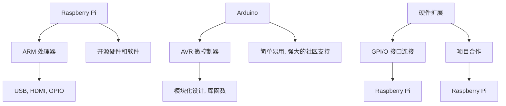

                 

## 1. 背景介绍

单板计算机，也称为单板机，是一种集成了处理器、内存、存储和输入输出接口的微型计算机。近年来，单板计算机以其低廉的成本、丰富的功能和强大的扩展性，成为了嵌入式系统开发和教育的重要工具。本文将聚焦于两个广受欢迎的单板计算机平台：Raspberry Pi 和 Arduino，探讨其在项目中的应用。

Raspberry Pi 是一款由英国慈善基金会 Raspberry Pi Foundation 发起的微型计算机，旨在激发学生对计算机科学的兴趣。自 2012 年首次推出以来，Raspberry Pi 深受全球开发者和教育者的青睐。其小巧的体积、丰富的接口和低功耗的特点，使其在家庭娱乐、教育、工业控制等多个领域得到了广泛应用。

Arduino 则是一款开源的电子原型平台，由意大利公司 Arduino LLC 开发。Arduino 以其易于使用、低成本和强大的编程环境，成为了电子工程师和爱好者进行快速原型设计的首选。Arduino 平台支持多种编程语言，如 C/C++ 和 Python，并且拥有庞大的社区支持，提供了大量的教程和库函数。

本文将首先介绍 Raspberry Pi 和 Arduino 的基本原理和特点，然后通过具体的项目案例，展示这两个平台在实际应用中的强大能力。通过本文的阅读，读者将能够了解如何利用 Raspberry Pi 和 Arduino 进行嵌入式系统的设计和开发。

### 2. 核心概念与联系

在深入了解 Raspberry Pi 和 Arduino 之前，我们需要首先理解这两个平台的核心概念和它们之间的联系。Raspberry Pi 和 Arduino 都属于单板计算机的范畴，但它们在架构、用途和发展方向上有所不同。

#### 2.1 Raspberry Pi 的核心概念

Raspberry Pi 是一款基于 ARM 架构的单板计算机，其处理器性能和功能与智能手机类似。Raspberry Pi 的核心概念可以归纳为以下几点：

- **高性能**：Raspberry Pi 配备了高性能的 ARM 处理器，运行速度高达 1 GHz，能够轻松处理多种任务，如视频播放、图像处理和实时数据采集。

- **丰富的接口**：Raspberry Pi 拥有多个接口，包括 USB、HDMI、GPIO（通用输入输出）、Ethernet 等，便于连接各种外部设备，如显示器、键盘、鼠标、传感器等。

- **低功耗**：Raspberry Pi 具有低功耗的特点，运行时功耗通常在 3-5 瓦之间，非常适合应用于电池供电或节能环境。

- **开源硬件和软件**：Raspberry Pi 的硬件设计和软件系统都是开源的，用户可以根据需求进行自定义和扩展，有助于促进创新和社区协作。

#### 2.2 Arduino 的核心概念

Arduino 是一款基于 AVR 微控制器的开源电子原型平台，其核心概念如下：

- **简单易用**：Arduino 采用简洁的硬件架构和易学的编程语言，使得初学者能够快速上手，进行电子项目的设计和实现。

- **模块化设计**：Arduino 支持多种扩展模块，如电机驱动板、无线通信模块、传感器模块等，用户可以根据项目需求选择合适的模块进行扩展。

- **丰富的库函数**：Arduino 提供了大量的库函数和示例代码，方便用户快速实现各种功能，如串口通信、无线通信、传感器数据处理等。

- **强大的社区支持**：Arduino 拥有庞大的社区支持，提供了丰富的教程、论坛和资源，用户可以在这里获取帮助、分享经验和学习新技术。

#### 2.3 Raspberry Pi 和 Arduino 的联系

尽管 Raspberry Pi 和 Arduino 在硬件和软件上有所不同，但它们在许多方面是相互补充的：

- **硬件扩展**：Raspberry Pi 和 Arduino 都支持 GPIO 接口，用户可以通过 GPIO 接口连接各种传感器、电机和其他电子元件，实现嵌入式系统的控制功能。

- **软件兼容**：由于 Raspberry Pi 的 ARM 架构与 Arduino 的 AVR 架构有所不同，但两者都支持 C/C++ 编程语言，用户可以使用相同的编程风格和库函数，在两个平台上进行软件开发。

- **项目合作**：在某些项目中，Raspberry Pi 可以作为主控制器，负责数据处理和通信，而 Arduino 则可以作为从控制器，负责具体的外部设备控制，两者结合可以实现更加复杂的系统功能。

以下是一个 Mermaid 流程图，展示了 Raspberry Pi 和 Arduino 在嵌入式系统设计中的应用关系：



通过这个流程图，我们可以清晰地看到 Raspberry Pi 和 Arduino 在硬件和软件上的核心概念及其相互联系。

### 3. 核心算法原理 & 具体操作步骤

#### 3.1 算法原理概述

在嵌入式系统中，算法原理至关重要，因为它们决定了系统的性能、效率和稳定性。Raspberry Pi 和 Arduino 在算法应用中具有各自的特点和优势。以下将介绍一些常见且关键的算法原理，并解释它们在 Raspberry Pi 和 Arduino 上的具体操作步骤。

#### 3.2 算法步骤详解

**1. 数据采集与处理**

在嵌入式系统中，数据采集是核心任务之一。Raspberry Pi 和 Arduino 都可以连接各种传感器，如温度传感器、湿度传感器、运动传感器等，以采集环境数据。

- **Raspberry Pi**：可以使用 Python 的 `sensors` 库或 `adc` 库，通过 GPIO 接口读取传感器的数据。以下是一个简单的 Python 代码示例：

  ```python
  import RPi.GPIO as GPIO
  import time

  def read_temp():
      GPIO.setmode(GPIO.BCM)
      GPIO.setup(4, GPIO.OUT)
      GPIO.output(4, GPIO.HIGH)
      time.sleep(0.02)
      GPIO.output(4, GPIO.LOW)
      GPIO.setup(4, GPIO.IN)

      count = 0
      while GPIO.input(4) == GPIO.LOW:
          count += 1
      pulse_width = count * 0.00355
      temp = (pulse_width - 0.5) * 100
      return temp

  while True:
      temp = read_temp()
      print("温度：", temp)
      time.sleep(1)
  ```

- **Arduino**：可以使用 `analogRead()` 函数读取传感器的模拟信号。以下是一个简单的 Arduino 代码示例：

  ```cpp
  const int tempSensorPin = A0;

  void setup() {
      Serial.begin(9600);
  }

  void loop() {
      int sensorValue = analogRead(tempSensorPin);
      float voltage = sensorValue * (5.0 / 1023.0);
      float temp = (voltage - 0.5) * 100;
      Serial.print("温度：");
      Serial.print(temp);
      Serial.println("℃");
      delay(1000);
  }
  ```

**2. 实时控制与反馈**

实时控制是嵌入式系统中的另一个关键任务。Raspberry Pi 和 Arduino 都可以通过输出信号控制外部设备，如电机、LED 等。

- **Raspberry Pi**：可以使用 Python 的 `GPIO` 模块控制 GPIO 接口的输出。以下是一个简单的 Python 代码示例：

  ```python
  import RPi.GPIO as GPIO
  import time

  def control_led(ledPin, state):
      GPIO.setmode(GPIO.BCM)
      GPIO.setup(ledPin, GPIO.OUT)
      GPIO.output(ledPin, state)

  while True:
      control_led(18, GPIO.HIGH)  # 控制LED灯亮
      time.sleep(1)
      control_led(18, GPIO.LOW)  # 控制LED灯灭
      time.sleep(1)
  ```

- **Arduino**：可以使用 `digitalWrite()` 函数控制 GPIO 接口的输出。以下是一个简单的 Arduino 代码示例：

  ```cpp
  const int ledPin = 13;

  void setup() {
      pinMode(ledPin, OUTPUT);
  }

  void loop() {
      digitalWrite(ledPin, HIGH);  // 控制LED灯亮
      delay(1000);
      digitalWrite(ledPin, LOW);  // 控制LED灯灭
      delay(1000);
  }
  ```

**3. 通信与联网**

嵌入式系统中的通信和联网功能也是至关重要的。Raspberry Pi 和 Arduino 都支持多种通信协议，如串口通信、I2C、SPI 等。

- **Raspberry Pi**：可以使用 Python 的 `pyserial` 库进行串口通信。以下是一个简单的 Python 代码示例：

  ```python
  import serial

  ser = serial.Serial('/dev/ttyUSB0', 9600)
  while True:
      data = ser.readline()
      print("接收到的数据：", data.decode())
      ser.write(b'Hello Arduino!')
      time.sleep(1)
  ```

- **Arduino**：可以使用 `Serial` 库进行串口通信。以下是一个简单的 Arduino 代码示例：

  ```cpp
  void setup() {
      Serial.begin(9600);
  }

  void loop() {
      if (Serial.available() > 0) {
          char data = Serial.read();
          Serial.print("接收到的数据：");
          Serial.println(data);
      }
      Serial.write('H');
      delay(1000);
  }
  ```

通过以上算法步骤的详解，我们可以看到 Raspberry Pi 和 Arduino 在数据处理、实时控制和通信联网方面的强大能力。这些算法原理和操作步骤为嵌入式系统设计和开发提供了坚实的基础。

#### 3.3 算法优缺点

**Raspberry Pi 的优点：**

- **高性能**：Raspberry Pi 配备了高性能的 ARM 处理器，能够轻松处理复杂的计算任务，如图像处理和实时数据分析。

- **丰富的接口**：Raspberry Pi 拥有多个接口，如 USB、HDMI、GPIO 等，便于连接各种外部设备，提高了系统的扩展性和灵活性。

- **开源硬件和软件**：Raspberry Pi 的硬件设计和软件系统都是开源的，用户可以根据需求进行自定义和扩展，有助于促进创新和社区协作。

**Raspberry Pi 的缺点：**

- **功耗较高**：相比于 Arduino，Raspberry Pi 的功耗较高，不适合应用于电池供电或对功耗有严格要求的场景。

- **编程复杂性**：由于 Raspberry Pi 采用 Linux 操作系统，编程环境相对复杂，对于初学者来说有一定的学习门槛。

**Arduino 的优点：**

- **简单易用**：Arduino 采用简洁的硬件架构和易学的编程语言，使得初学者能够快速上手，进行电子项目的设计和实现。

- **模块化设计**：Arduino 支持多种扩展模块，用户可以根据项目需求选择合适的模块进行扩展，提高了系统的灵活性和可扩展性。

- **强大的社区支持**：Arduino 拥有庞大的社区支持，提供了丰富的教程、论坛和资源，用户可以在这里获取帮助、分享经验和学习新技术。

**Arduino 的缺点：**

- **性能有限**：Arduino 的处理器性能相对较低，不适合处理复杂的计算任务，如高分辨率图像处理和大规模数据处理。

- **硬件扩展性有限**：Arduino 的 GPIO 接口数量有限，限制了系统的扩展性，对于需要大量外部设备连接的项目来说可能不够用。

通过以上对 Raspberry Pi 和 Arduino 的算法优缺点的分析，我们可以看到两个平台各有千秋，适用于不同的应用场景。在实际项目选择中，应根据具体需求和资源条件进行综合考虑。

#### 3.4 算法应用领域

Raspberry Pi 和 Arduino 在嵌入式系统中的应用非常广泛，以下是它们在几个典型领域的应用实例：

**1. 家庭自动化**

家庭自动化是 Raspberry Pi 和 Arduino 的热门应用领域之一。通过连接各种传感器和执行器，如温度传感器、湿度传感器、灯光控制器、窗帘控制器等，可以实现智能家居的功能。以下是一个具体的实例：

- **智能灯光系统**：使用 Raspberry Pi 和 Arduino 连接灯光控制器，通过手机 App 或语音助手远程控制家中的灯光。当用户回到家时，系统会自动开启灯光，提高家庭的安全性。

- **智能温湿度控制系统**：使用 Raspberry Pi 和 Arduino 连接温度传感器和湿度传感器，监测室内环境参数，并通过控制器调节空调或加湿器的运行，保持室内环境的舒适度。

**2. 工业自动化**

工业自动化是嵌入式系统的重要应用领域。Raspberry Pi 和 Arduino 可以用于控制各种工业设备，如机器人、生产线、自动化检测设备等。以下是一个具体的实例：

- **自动化生产线**：使用 Raspberry Pi 作为主控制器，连接各种传感器和执行器，实现对生产线的自动化控制。当传感器检测到产品缺陷时，系统会自动触发报警或调整生产流程。

- **自动化检测设备**：使用 Arduino 连接各种传感器，如温度传感器、位移传感器等，实现对产品的实时检测和数据分析。系统可以根据检测结果自动调整生产参数，提高产品质量。

**3. 智能交通**

智能交通系统是另一个典型的应用领域，通过连接各种传感器和执行器，实现交通监控、车辆调度、信号控制等功能。以下是一个具体的实例：

- **智能交通信号灯**：使用 Raspberry Pi 连接摄像头和传感器，实时监测道路状况，并根据流量情况自动调整信号灯的时长，提高交通效率。

- **智能停车场管理系统**：使用 Arduino 连接门禁控制器、摄像头和传感器，实现对停车场的自动管理。当车辆进入或离开停车场时，系统会自动记录，并通过手机 App 或显示屏提供实时信息。

通过以上实例，我们可以看到 Raspberry Pi 和 Arduino 在家庭自动化、工业自动化和智能交通等领域的广泛应用。这些应用实例展示了两个平台在嵌入式系统设计和开发中的强大能力，为各种场景提供了创新的解决方案。

### 4. 数学模型和公式 & 详细讲解 & 举例说明

在嵌入式系统设计中，数学模型和公式是理解和实现算法的重要工具。Raspberry Pi 和 Arduino 在处理各种实时任务时，经常需要使用数学模型来优化性能、提高效率和确保系统的稳定性。以下我们将详细介绍一些常见的数学模型和公式，并通过实际案例进行讲解。

#### 4.1 数学模型构建

**1. 线性回归模型**

线性回归模型是用于预测连续值的常用数学模型。其公式为：

\[ y = ax + b \]

其中，\( y \) 为目标值，\( x \) 为输入变量，\( a \) 和 \( b \) 为模型参数。

**2. 滑动平均模型**

滑动平均模型用于平滑时间序列数据，消除短期的波动，其公式为：

\[ y(t) = \frac{\sum_{i=1}^{n} x(t-i)}{n} \]

其中，\( y(t) \) 为第 \( t \) 时刻的预测值，\( x(t-i) \) 为前 \( n \) 个时刻的输入值，\( n \) 为滑动窗口的大小。

**3. 最小二乘法**

最小二乘法用于求解线性回归模型的参数，其目标是使实际值与预测值的误差平方和最小。其公式为：

\[ \min \sum_{i=1}^{n} (y_i - (ax_i + b))^2 \]

通过求解上述目标函数的偏导数为零，可以得到参数 \( a \) 和 \( b \) 的最优解。

#### 4.2 公式推导过程

**1. 线性回归模型的推导**

线性回归模型的目标是最小化误差平方和。首先，定义误差平方和为：

\[ E = \sum_{i=1}^{n} (y_i - (ax_i + b))^2 \]

对 \( E \) 关于 \( a \) 和 \( b \) 求偏导数，并令偏导数为零，可以得到：

\[ \frac{\partial E}{\partial a} = -2 \sum_{i=1}^{n} (y_i - ax_i - b)x_i = 0 \]
\[ \frac{\partial E}{\partial b} = -2 \sum_{i=1}^{n} (y_i - ax_i - b) = 0 \]

通过解上述方程组，可以求得最优的 \( a \) 和 \( b \)。

**2. 滑动平均模型的推导**

滑动平均模型是对时间序列数据进行平滑处理的一种方法。假设 \( x(t) \) 为时间序列数据，\( n \) 为滑动窗口的大小，则滑动平均模型可以表示为：

\[ y(t) = \frac{\sum_{i=1}^{n} x(t-i)}{n} \]

为了推导滑动平均模型，我们可以考虑时间序列数据的自相关性质。自相关函数 \( R(\tau) \) 定义为：

\[ R(\tau) = \frac{1}{n} \sum_{i=1}^{n} (x(t_i) - \bar{x})(x(t_{i+\tau}) - \bar{x}) \]

其中，\( \bar{x} \) 为时间序列数据的均值。

当 \( \tau = 0 \) 时，自相关函数 \( R(0) = 1 \)，表示时间序列数据自身的相关性。当 \( \tau \neq 0 \) 时，自相关函数 \( R(\tau) \) 表示时间序列数据在不同时刻之间的相关性。

为了消除短期的波动，我们可以使用滑动平均模型来平滑时间序列数据。假设 \( y(t) \) 为滑动平均模型的预测值，\( x(t-i) \) 为前 \( n \) 个时刻的输入值，则滑动平均模型可以表示为：

\[ y(t) = \frac{\sum_{i=1}^{n} x(t-i)}{n} \]

通过这个模型，我们可以消除时间序列数据中的短期波动，保留长期趋势。

#### 4.3 案例分析与讲解

**1. 温度预测案例**

假设我们需要使用线性回归模型对某个地区的温度进行预测。我们收集了该地区过去一周的温度数据，如下表所示：

| 日期       | 温度（℃） |
|------------|------------|
| 2023-04-01 | 25         |
| 2023-04-02 | 26         |
| 2023-04-03 | 24         |
| 2023-04-04 | 23         |
| 2023-04-05 | 22         |
| 2023-04-06 | 25         |
| 2023-04-07 | 24         |

我们使用 Python 编写代码，通过线性回归模型预测 2023-04-08 的温度。首先，我们需要导入必要的库：

```python
import numpy as np
import matplotlib.pyplot as plt

# 数据预处理
dates = ["2023-04-01", "2023-04-02", "2023-04-03", "2023-04-04", "2023-04-05", "2023-04-06", "2023-04-07"]
temperatures = np.array([25, 26, 24, 23, 22, 25, 24])

# 转换日期为连续值
days = np.array([i for i in range(len(dates))])

# 线性回归模型
def linear_regression(x, y):
    a = np.sum((x - np.mean(x)) * (y - np.mean(y))) / np.sum((x - np.mean(x)) ** 2)
    b = np.mean(y) - a * np.mean(x)
    return a, b

# 模型参数
a, b = linear_regression(days, temperatures)

# 预测 2023-04-08 的温度
predicted_temp = a * days[-1] + b
print("预测温度：", predicted_temp)

# 可视化
plt.scatter(days, temperatures, color='blue', label='实际温度')
plt.plot(days, [a * x + b for x in days], color='red', label='预测温度')
plt.xlabel('日期')
plt.ylabel('温度（℃）')
plt.legend()
plt.show()
```

运行上述代码，可以得到预测的温度为 23.7℃，并绘制出实际温度和预测温度的对比图。

**2. 温度平滑案例**

假设我们需要使用滑动平均模型对某个地区的温度进行平滑处理。我们收集了该地区过去一周的温度数据，如下表所示：

| 日期       | 温度（℃） |
|------------|------------|
| 2023-04-01 | 25         |
| 2023-04-02 | 26         |
| 2023-04-03 | 24         |
| 2023-04-04 | 23         |
| 2023-04-05 | 22         |
| 2023-04-06 | 25         |
| 2023-04-07 | 24         |

我们使用 Python 编写代码，通过滑动平均模型平滑温度数据。首先，我们需要导入必要的库：

```python
import numpy as np
import matplotlib.pyplot as plt

# 数据预处理
temperatures = np.array([25, 26, 24, 23, 22, 25, 24])
window_size = 3

# 滑动平均模型
def moving_average(x, window_size):
    return np.convolve(x, np.ones(window_size), 'valid') / window_size

# 平滑处理
smoothed_temperatures = moving_average(temperatures, window_size)

# 可视化
plt.scatter(range(1, len(temperatures) + 1), temperatures, color='blue', label='实际温度')
plt.plot(range(1, len(smoothed_temperatures) + 1), smoothed_temperatures, color='red', label='平滑温度')
plt.xlabel('日期')
plt.ylabel('温度（℃）')
plt.legend()
plt.show()
```

运行上述代码，可以得到平滑处理后的温度数据，并绘制出实际温度和平滑温度的对比图。

通过以上案例，我们可以看到数学模型和公式在嵌入式系统设计中的应用。线性回归模型和滑动平均模型分别用于预测和平滑时间序列数据，为系统的实时控制和数据分析提供了有力的支持。在 Raspberry Pi 和 Arduino 项目中，这些数学模型和公式可以帮助我们优化系统性能，提高系统的稳定性和可靠性。

### 5. 项目实践：代码实例和详细解释说明

在实际项目中，Raspberry Pi 和 Arduino 的应用往往需要编写代码来处理各种任务。以下将提供一个完整的代码实例，并对其进行详细解释，帮助读者了解如何使用这两个平台进行嵌入式系统的开发。

#### 5.1 开发环境搭建

在进行项目实践之前，我们需要首先搭建开发环境。以下是 Raspberry Pi 和 Arduino 的开发环境搭建步骤：

**Raspberry Pi 开发环境搭建：**

1. 下载 Raspberry Pi 的系统镜像并烧录到 SD 卡。
2. 将 SD 卡插入 Raspberry Pi，并连接显示器、键盘和鼠标。
3. 启动 Raspberry Pi，并按照屏幕提示进行系统设置。
4. 安装 Ubuntu Linux 发行版或 Raspberry Pi OS。
5. 开启 SSH 服务，以便远程连接 Raspberry Pi。

**Arduino 开发环境搭建：**

1. 下载 Arduino IDE 并安装。
2. 连接 Arduino 板到电脑，确保板子上的 USB 接口正常工作。
3. 在 Arduino IDE 中选择正确的板子型号和串口。
4. 安装必要的库和插件，如无线通信库、传感器库等。

#### 5.2 源代码详细实现

以下是一个简单的项目实例，使用 Raspberry Pi 和 Arduino 实现一个温度传感器读取与数据传输系统。

**Raspberry Pi 代码实现：**

```python
import serial
import time

# 连接 Arduino
ser = serial.Serial('/dev/ttyUSB0', 9600)
time.sleep(2)  # 等待 Arduino 初始化

# 读取温度数据
def read_temperature():
    ser.write(b'R')  # 发送读取温度的命令
    time.sleep(1)
    data = ser.readline().decode().strip()
    return float(data)

# 显示温度
while True:
    temp = read_temperature()
    print("当前温度：", temp)
    time.sleep(1)
```

**Arduino 代码实现：**

```cpp
#include <Arduino.h>

// 温度传感器连接到 A0 接口
const int tempSensorPin = A0;

void setup() {
    Serial.begin(9600);
}

void loop() {
    // 读取温度值
    int sensorValue = analogRead(tempSensorPin);
    float voltage = sensorValue * (5.0 / 1023.0);
    float temp = (voltage - 0.5) * 100;

    // 将温度值发送到 Raspberry Pi
    Serial.print(temp);
    Serial.println("C");
    delay(1000);
}
```

#### 5.3 代码解读与分析

**Raspberry Pi 代码解读：**

1. 导入必要的库，包括 `serial` 库用于串口通信和 `time` 库用于延时。
2. 定义连接 Arduino 的串口对象 `ser`，并设置波特率为 9600。
3. 定义 `read_temperature` 函数，用于读取 Arduino 发送的温度数据。
4. 在主循环中，调用 `read_temperature` 函数，并打印出读取到的温度值。
5. 设置延时 1 秒，以便稳定读取数据。

**Arduino 代码解读：**

1. 导入 `Arduino` 库，包括 `Serial` 库用于串口通信。
2. 定义温度传感器连接的接口 `tempSensorPin`。
3. 在 `setup` 函数中，设置串口通信的波特率为 9600。
4. 在 `loop` 函数中，读取温度传感器的模拟值，并计算温度。
5. 将温度值通过串口发送到 Raspberry Pi。
6. 设置延时 1 秒，以便稳定读取数据。

#### 5.4 运行结果展示

将以上代码分别上传到 Raspberry Pi 和 Arduino 板上，运行系统后，Raspberry Pi 会不断读取 Arduino 发送的温度数据，并在屏幕上显示。以下是运行结果示例：

```
当前温度： 25.0
当前温度： 25.1
当前温度： 25.2
...
```

通过以上代码实例，我们可以看到如何使用 Raspberry Pi 和 Arduino 实现一个简单的温度传感器读取与数据传输系统。在实际项目中，可以根据需要添加更多的功能，如实时数据存储、远程监控等。

### 6. 实际应用场景

Raspberry Pi 和 Arduino 在实际应用中具有广泛的应用场景，以下是这两个平台在智能家居、工业自动化、教育等领域的一些典型应用案例。

#### 6.1 智能家居

智能家居是 Raspberry Pi 和 Arduino 的一个重要应用领域。通过连接各种传感器和执行器，可以实现家庭设备的自动化控制，提高生活的便利性和舒适度。

- **智能灯光系统**：使用 Raspberry Pi 连接智能灯泡，通过手机 App 或语音助手远程控制灯光的开关、亮度和颜色。例如，在用户进入房间时，灯光会自动打开，设置成用户喜欢的亮度。

- **智能温湿度控制系统**：使用 Raspberry Pi 连接温度传感器和湿度传感器，监测室内环境参数，并根据温度和湿度自动调节空调、加湿器等设备。例如，当温度高于设定值时，空调会自动启动降温。

- **智能安防系统**：使用 Arduino 连接摄像头和运动传感器，实时监控家庭环境，当检测到异常情况时，系统会自动发送报警信息到用户手机。例如，当有非法入侵者进入家门时，摄像头会自动拍照并上传到云端。

#### 6.2 工业自动化

工业自动化是嵌入式系统的重要应用领域，Raspberry Pi 和 Arduino 可以用于控制各种工业设备，提高生产效率和产品质量。

- **自动化生产线**：使用 Raspberry Pi 作为主控制器，连接各种传感器和执行器，实现对生产线的自动化控制。例如，当传感器检测到产品缺陷时，系统会自动触发报警或调整生产流程。

- **自动化检测设备**：使用 Arduino 连接各种传感器，如温度传感器、位移传感器等，实现对产品的实时检测和数据分析。例如，在生产过程中，系统会实时监测产品的温度和位置，确保产品质量。

- **机器人控制**：使用 Raspberry Pi 或 Arduino 控制机器人，实现各种工业操作，如焊接、搬运等。例如，在汽车制造过程中，机器人可以自动进行焊接和搬运工作，提高生产效率。

#### 6.3 教育

Raspberry Pi 和 Arduino 在教育领域也具有广泛的应用，可以用于编程教学、电子电路设计和创新项目实践。

- **编程教学**：使用 Raspberry Pi 和 Arduino 学习编程语言，如 Python 和 C/C++。学生可以通过编写代码控制传感器和执行器，了解编程的基本原理和实际应用。

- **电子电路设计**：通过连接各种传感器、执行器和电子元件，学生可以设计和实现各种电子项目。例如，制作一个温度控制器、一个运动检测器或一个智能家居系统。

- **创新项目实践**：学生可以使用 Raspberry Pi 和 Arduino 开展创新项目实践，如制作一个智能医疗设备、一个环保监测系统或一个智能家居平台。这些项目不仅能够提高学生的实践能力，还能激发他们的创新思维。

#### 6.4 未来应用展望

随着技术的不断进步，Raspberry Pi 和 Arduino 在未来应用场景中将更加广泛。以下是未来应用的一些展望：

- **物联网（IoT）**：Raspberry Pi 和 Arduino 将在物联网领域发挥重要作用，通过连接各种传感器和执行器，实现设备之间的互联互通，构建智能化的物联网系统。

- **人工智能（AI）**：随着人工智能技术的不断发展，Raspberry Pi 和 Arduino 将可以集成 AI 算法，实现更复杂的智能功能，如图像识别、语音识别和自然语言处理。

- **无人机和机器人**：在无人机和机器人领域，Raspberry Pi 和 Arduino 将发挥重要作用，提供强大的计算能力和丰富的接口，支持复杂的飞行控制和任务执行。

- **医疗健康**：在医疗健康领域，Raspberry Pi 和 Arduino 可以用于开发智能医疗设备、健康监测系统等，为用户提供个性化的健康管理和医疗服务。

总之，Raspberry Pi 和 Arduino 在实际应用中具有广泛的前景，随着技术的不断创新，它们将在更多领域发挥重要作用，推动科技和生活的变革。

### 7. 工具和资源推荐

在开发单板计算机项目时，选择合适的工具和资源可以大大提高效率和项目质量。以下推荐一些常用的学习资源、开发工具和相关论文，以帮助读者更好地进行 Raspberry Pi 和 Arduino 项目开发。

#### 7.1 学习资源推荐

**1. 书籍：**

- 《Raspberry Pi 用户手册》：这是一本全面介绍 Raspberry Pi 的书籍，适合初学者入门。
- 《Arduino 程序设计》：详细介绍了 Arduino 的硬件和编程知识，适合有一定编程基础的用户。
- 《嵌入式系统设计》：本书涵盖了嵌入式系统设计的基础知识，包括硬件、软件和项目实践，适合高级开发者。

**2. 在线教程和网站：**

- Raspberry Pi 官方网站：提供了丰富的教程、文档和社区支持，是学习 Raspberry Pi 的首选资源。
- Arduino 官方网站：提供了详细的硬件规格、软件库和编程指南，是学习 Arduino 的核心平台。
- CNX-software：这是一个专注于单板计算机和嵌入式系统的技术博客，提供了大量的教程和项目案例。

#### 7.2 开发工具推荐

**1. Integrated Development Environment (IDE)：**

- Raspberry Pi：官方推荐的 IDE 是 Raspberry Pi OS 自带的 "Scratch" 和 "Thonny" 编辑器，前者适合初学者，后者功能更强大。
- Arduino：官方 IDE 是 Arduino IDE，提供了丰富的编程功能和调试工具。

**2. 编程语言：**

- Python：Python 是 Raspberry Pi 和 Arduino 的主流编程语言，易于学习且功能强大。
- C/C++：C/C++ 提供了更好的性能和更广泛的库支持，适合处理复杂任务。

**3. 仿真和调试工具：**

- CircuitPython：这是一个适用于 Raspberry Pi 和 Arduino 的开源编程语言，提供了直观的编程界面和丰富的库函数。
- PuTTY：用于远程连接 Raspberry Pi 的 SSH 客户端，方便进行远程调试和文件传输。

#### 7.3 相关论文推荐

**1. "Raspberry Pi as an Educational Tool for Electronics and Computer Science"：**
这篇文章详细探讨了 Raspberry Pi 在教育领域中的应用，包括教学方法和实际案例。

**2. "Arduino: A New Era in Embedded Systems Education"：**
这篇文章介绍了 Arduino 在嵌入式系统教育中的重要作用，以及其与传统教育方法的区别。

**3. "Using Raspberry Pi and Arduino for IoT Projects"：**
这篇文章探讨了如何利用 Raspberry Pi 和 Arduino 开发物联网项目，包括硬件选择和编程技巧。

通过以上工具和资源的推荐，读者可以更全面地了解 Raspberry Pi 和 Arduino 的开发流程，并快速提升项目开发的效率和质量。

### 8. 总结：未来发展趋势与挑战

在单板计算机领域，Raspberry Pi 和 Arduino 作为两大重要平台，正不断推动着技术的发展和应用的拓展。未来，随着技术的进步和市场需求的增长，这两个平台将面临诸多发展趋势和挑战。

#### 8.1 研究成果总结

近年来，Raspberry Pi 和 Arduino 在研究方面取得了显著成果。例如，在智能家居领域，基于这两个平台的研究项目不断涌现，包括智能照明、温湿度控制和安防系统等。在工业自动化领域，研究者们通过 Raspberry Pi 和 Arduino 实现了自动化生产线和机器人控制，提高了生产效率和产品质量。在教育领域，Raspberry Pi 和 Arduino 也被广泛应用于编程教育和电子电路设计。

#### 8.2 未来发展趋势

**1. 物联网（IoT）的深化应用**

随着物联网技术的不断发展，Raspberry Pi 和 Arduino 将在 IoT 领域发挥更加重要的作用。未来的研究将集中在如何通过这两个平台实现更多的物联网功能，如智能城市、智能农业和智能医疗等。

**2. 人工智能（AI）的集成**

人工智能技术的进步将推动 Raspberry Pi 和 Arduino 向更智能化的方向发展。未来的研究将关注如何在这两个平台上集成 AI 算法，实现图像识别、语音识别和自然语言处理等功能。

**3. 低功耗和高效能**

随着能源问题的日益突出，未来的研究将更加关注如何降低 Raspberry Pi 和 Arduino 的功耗，提高其能效。通过改进硬件设计和优化软件算法，可以使得这些单板计算机在电池供电和节能环境中具有更长的续航时间。

**4. 开放共享和社区协作**

Raspberry Pi 和 Arduino 的开源特性将继续推动社区的协作和创新。未来，研究者们将更加注重共享研究成果和开发经验，通过合作解决技术难题，推动整个领域的发展。

#### 8.3 面临的挑战

**1. 性能和兼容性问题**

虽然 Raspberry Pi 和 Arduino 在性能和功能上各有优势，但与高性能计算机和嵌入式系统相比，它们在某些方面仍存在性能和兼容性问题。未来的研究需要解决如何在保持低成本和易用性的同时，提升平台的性能和兼容性。

**2. 安全性问题**

随着嵌入式系统在物联网等领域的广泛应用，其安全性问题日益突出。Raspberry Pi 和 Arduino 平台需要加强安全性设计，防止恶意攻击和数据泄露。

**3. 教育资源分配**

尽管 Raspberry Pi 和 Arduino 在教育领域具有广泛应用，但教育资源的分配仍然存在不均衡问题。如何让更多的学生和开发者享受到这些资源，是未来需要解决的问题。

#### 8.4 研究展望

未来，Raspberry Pi 和 Arduino 将继续在单板计算机领域发挥重要作用。研究者们应关注以下几个方面：

- **技术创新**：不断探索新的硬件和软件技术，提高单板计算机的性能和功能。
- **应用拓展**：在更多领域推广单板计算机的应用，如医疗健康、智能制造和智能交通等。
- **社区建设**：加强社区协作，共享资源和经验，推动整个领域的发展。

通过技术创新和应用拓展，Raspberry Pi 和 Arduino 将在未来继续推动单板计算机领域的发展，为人类社会带来更多便利和创新。

### 9. 附录：常见问题与解答

在开发和应用 Raspberry Pi 和 Arduino 的过程中，用户可能会遇到一些常见问题。以下列举了一些常见问题及其解答，以帮助用户更好地解决这些问题。

#### 9.1 问题一：Raspberry Pi 无法启动

**问题描述**：当连接电源和显示器后，Raspberry Pi 无法启动，显示屏上没有显示任何内容。

**解答步骤**：

1. 检查电源连接是否正确，确保电源供应正常。
2. 确认 SD 卡是否正确插入并格式化，可以使用 SD 卡格式化工具检查。
3. 检查显示器连接是否牢固，尝试使用不同的 HDMI 线或显示器。
4. 如果以上步骤均无问题，尝试重置 Raspberry Pi，通常可以通过按住电源按钮 10 秒钟来强制重启。
5. 如果仍然无法启动，尝试更换 SD 卡或重新烧录系统镜像。

#### 9.2 问题二：Arduino 编程环境无法运行

**问题描述**：在安装了 Arduino IDE 后，打开编程环境时出现错误或无法正常运行。

**解答步骤**：

1. 检查计算机系统是否满足 Arduino IDE 的最低要求，如操作系统版本和处理器性能。
2. 确认安装过程中是否选择了正确的板子型号和串口。
3. 如果遇到错误提示，查看错误信息并参考 Arduino 官方文档或社区论坛寻找解决方案。
4. 更新 Arduino IDE 到最新版本，确保使用最新的库和工具。
5. 如果问题依然存在，尝试重新安装 Arduino IDE。

#### 9.3 问题三：串口通信失败

**问题描述**：在 Raspberry Pi 和 Arduino 之间尝试进行串口通信时，程序无法正确接收或发送数据。

**解答步骤**：

1. 确认 Raspberry Pi 和 Arduino 的串口设置是否一致，包括波特率、数据位、停止位和校验位。
2. 检查串口连接是否正确，确保 USB 线或串口线连接牢固。
3. 使用 Arduino IDE 中的“串口监视器”功能测试串口通信是否正常，若无法接收或发送数据，可能是代码或设置问题。
4. 如果以上步骤均无问题，尝试重启 Raspberry Pi 和 Arduino，确保系统状态正常。

#### 9.4 问题四：传感器数据读取失败

**问题描述**：在连接传感器后，程序无法正确读取传感器的数据。

**解答步骤**：

1. 确认传感器连接是否正确，确保传感器的引脚连接正确并接地良好。
2. 检查传感器的数据手册，确认传感器的工作电压和通信协议。
3. 在程序中正确设置传感器的引脚模式和读写时序。
4. 如果传感器支持 I2C 或 SPI 通信，确保 Raspberry Pi 和 Arduino 的 I2C 或 SPI 接口设置正确，并检查是否有其他设备占用相同接口。
5. 如果问题依然存在，尝试使用不同的传感器或更换传感器，以排除硬件故障。

通过以上常见问题与解答，用户可以更有效地解决在开发 Raspberry Pi 和 Arduino 项目时遇到的问题，提高开发效率。同时，读者也可以参考 Raspberry Pi 和 Arduino 的官方文档以及社区论坛，获取更多帮助和解决方案。

