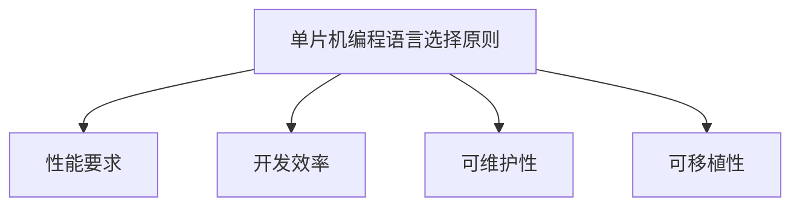

                 

关键词：单片机编程、C语言、汇编语言、嵌入式系统、嵌入式开发

摘要：本文将深入探讨单片机编程中常用的两种语言——C语言和汇编语言。通过对比分析这两种语言的优缺点、适用场景以及具体应用实例，帮助读者全面了解单片机编程的精髓，提高嵌入式开发技能。

## 1. 背景介绍

单片机，作为嵌入式系统中的核心组件，广泛应用于工业控制、智能家居、医疗设备、通信设备等领域。单片机编程语言的选择对于嵌入式系统性能、开发效率和稳定性具有重要意义。C语言和汇编语言是单片机编程的两种主要语言，各有其特点和应用领域。

C语言是一种高级编程语言，具有简洁、易学、高效等优点，已成为嵌入式系统开发的主流语言。C语言具有良好的抽象能力和丰富的库函数，能够实现复杂算法和系统功能。同时，C语言编写的程序可移植性强，适用于各种不同架构的单片机。

汇编语言是一种低级编程语言，与机器码密切相关。汇编语言具有直接操作硬件的能力，执行效率高，但编写难度大，可读性差。在性能要求极高的场景下，汇编语言仍然具有不可替代的地位。

## 2. 核心概念与联系

### 2.1 单片机编程语言概述

单片机编程语言主要包括C语言和汇编语言。C语言是一种高级编程语言，通过抽象和封装，将底层硬件细节隐藏起来，使开发者专注于系统功能实现。汇编语言是一种低级编程语言，与机器码直接对应，能够精确控制硬件资源。

### 2.2 编程语言选择原则

在单片机编程中，选择合适的编程语言应考虑以下原则：

- **性能要求**：对于性能要求极高的场景，如实时控制系统，汇编语言具有更高的执行效率。对于其他场景，C语言具有更高的开发效率。
- **开发效率**：C语言具有良好的抽象能力和丰富的库函数，能够提高开发效率。汇编语言编写难度大，开发效率较低。
- **可维护性**：C语言具有良好的可读性和可维护性，便于团队协作和后期维护。汇编语言可读性差，维护难度大。
- **可移植性**：C语言具有较好的可移植性，适用于不同架构的单片机。汇编语言与特定硬件平台密切相关，可移植性较差。

### 2.3 Mermaid 流程图



## 3. 核心算法原理 & 具体操作步骤

### 3.1 算法原理概述

单片机编程涉及多种算法，如定时器、中断、串口通信、ADC转换等。这些算法实现具体功能，如定时、数据传输、信号采集等。本文将详细介绍单片机中的几种常见算法，包括：

- 定时器算法：实现定时功能，如定时器初始化、定时器中断处理等。
- 中断算法：实现中断处理，如中断初始化、中断服务程序等。
- 串口通信算法：实现串口数据传输，如串口初始化、发送接收数据等。
- ADC转换算法：实现模拟信号到数字信号的转换，如ADC初始化、ADC中断处理等。

### 3.2 算法步骤详解

#### 3.2.1 定时器算法

1. **初始化定时器**：根据所需定时时间，设置定时器计数初值和计数模式。
2. **启动定时器**：使能定时器计数器，开始计时。
3. **中断处理**：定时器到达计数值时，触发中断，执行中断服务程序。

#### 3.2.2 中断算法

1. **初始化中断**：使能中断源，设置中断优先级和中断向量。
2. **中断服务程序**：编写中断服务程序，处理中断请求。
3. **中断返回**：中断服务程序执行完毕后，通过中断返回指令返回主程序。

#### 3.2.3 串口通信算法

1. **初始化串口**：设置串口通信参数，如波特率、数据位、停止位、校验位等。
2. **发送数据**：将数据写入串口发送缓冲区，等待发送完成。
3. **接收数据**：从串口接收缓冲区读取数据，处理接收到的数据。

#### 3.2.4 ADC转换算法

1. **初始化ADC**：设置ADC通道、采样时间、参考电压等参数。
2. **启动ADC转换**：使能ADC转换，开始采样。
3. **读取ADC结果**：在ADC转换完成后，读取转换结果。

### 3.3 算法优缺点

- **定时器算法**：简单易用，适用于各种定时场景，但定时精度较低。
- **中断算法**：响应速度快，适用于实时系统，但中断处理程序编写复杂。
- **串口通信算法**：稳定可靠，适用于各种串口通信场景，但通信速率受硬件限制。
- **ADC转换算法**：精确可靠，适用于模拟信号采集场景，但转换速度较慢。

### 3.4 算法应用领域

- **定时器算法**：广泛应用于定时、定时控制等场景。
- **中断算法**：广泛应用于实时系统、多任务处理等场景。
- **串口通信算法**：广泛应用于数据传输、设备通信等场景。
- **ADC转换算法**：广泛应用于模拟信号采集、传感器数据读取等场景。

## 4. 数学模型和公式 & 详细讲解 & 举例说明

### 4.1 数学模型构建

在单片机编程中，数学模型广泛应用于定时器、中断、串口通信、ADC转换等算法中。以下是一些常见数学模型：

- **定时器模型**：
  - 定时时间 = 定时器计数初值 × 定时器时钟周期
  - 定时器时钟周期 = 定时器时钟源频率 / 定时器分频系数

- **中断模型**：
  - 中断响应时间 = 中断处理程序执行时间 + 中断延迟时间

- **串口通信模型**：
  - 通信速率 = 波特率 × 每秒传输位数

- **ADC转换模型**：
  - ADC结果 = （ADC参考电压 × ADC输入电压）/ ADC满量程电压

### 4.2 公式推导过程

- **定时器模型**推导：
  - 定时器计数初值 = 定时时间 × 定时器时钟周期
  - 定时器时钟周期 = 定时器时钟源频率 / 定时器分频系数
  - 定时时间 = 定时器计数初值 × 定时器时钟周期

- **中断模型**推导：
  - 中断响应时间 = 中断处理程序执行时间 + 中断延迟时间
  - 中断处理程序执行时间 = 中断服务程序代码长度 × 单条指令执行时间
  - 中断延迟时间 = 中断请求信号传递时间 + 中断处理程序入口地址计算时间

- **串口通信模型**推导：
  - 通信速率 = 波特率 × 每秒传输位数
  - 波特率 = 定时器时钟源频率 / 定时器分频系数
  - 每秒传输位数 = 1 / (定时器时钟周期 × 串口通信位宽)

- **ADC转换模型**推导：
  - ADC结果 = （ADC参考电压 × ADC输入电压）/ ADC满量程电压
  - ADC参考电压 = 电压参考源电压
  - ADC输入电压 = ADC输入信号电压
  - ADC满量程电压 = ADC输入信号最大电压

### 4.3 案例分析与讲解

#### 案例一：定时器模型应用

假设使用一个16位定时器，时钟源频率为11.0592MHz，定时时间为1秒。计算定时器计数初值。

**步骤**：

1. 定时器时钟周期 = 11.0592MHz / 12 = 0.9216μs
2. 定时时间 = 1秒
3. 定时器计数初值 = 定时时间 × 定时器时钟周期 = 1秒 × 0.9216μs = 921600μs
4. 定时器计数初值（十六进制）= 0xFC18

**结果**：将定时器计数初值设置为0xFC18，即可实现1秒定时。

#### 案例二：中断模型应用

假设使用一个外部中断，中断请求信号传递时间为5μs，中断服务程序代码长度为20字节，中断处理程序入口地址计算时间为2μs。计算中断响应时间。

**步骤**：

1. 中断响应时间 = 中断处理程序执行时间 + 中断延迟时间
2. 中断处理程序执行时间 = 20字节 × 1μs/字节 = 20μs
3. 中断延迟时间 = 5μs + 2μs = 7μs
4. 中断响应时间 = 20μs + 7μs = 27μs

**结果**：中断响应时间为27μs。

## 5. 项目实践：代码实例和详细解释说明

### 5.1 开发环境搭建

本文以STM32单片机为例，介绍单片机编程项目实践。开发环境搭建如下：

1. 安装STM32CubeMX配置工具，用于配置单片机外设和时钟。
2. 安装Keil uVision集成开发环境，用于编写、编译和调试单片机程序。
3. 安装STM32标准库，用于简化单片机编程。

### 5.2 源代码详细实现

以下是一个简单的STM32单片机定时器项目示例：

```c
#include "stm32f10x.h"

void Timer_Init(void)
{
    // 定时器时钟使能
    RCC_APB1PeriphClockCmd(RCC_APB1Periph_TIM2, ENABLE);

    // 配置定时器周期
    TIM_TimeBaseInitTypeDef TIM_TimeBaseStructure;
    TIM_TimeBaseStructure.TIM_Period = 1000 - 1;  // 定时1000ms
    TIM_TimeBaseStructure.TIM_Prescaler = 72 - 1;  // 定时器时钟分频系数
    TIM_TimeBaseStructure.TIM_ClockDivision = 0;
    TIM_TimeBaseStructure.TIM_CounterMode = TIM_CounterMode_Up;
    TIM_TimeBaseInit(TIM2, &TIM_TimeBaseStructure);

    // 使能定时器中断
    NVIC_InitTypeDef NVIC_InitStructure;
    NVIC_InitStructure.NVIC_IRQChannel = TIM2_IRQn;
    NVIC_InitStructure.NVIC_IRQChannelPreemptionPriority = 0;
    NVIC_InitStructure.NVIC_IRQChannelSubPriority = 1;
    NVIC_InitStructure.NVIC_IRQChannelCmd = ENABLE;
    NVIC_Init(&NVIC_InitStructure);

    // 启动定时器
    TIM_Cmd(TIM2, ENABLE);
}

void TIM2_IRQHandler(void)
{
    if (TIM_GetITStatus(TIM2, TIM_IT_Update) != RESET)
    {
        // 定时1000ms触发一次中断
        printf("1000ms定时中断!\r\n");
        TIM_ClearITPendingBit(TIM2, TIM_IT_Update);
    }
}

int main(void)
{
    // 初始化LED
    LED_Init();

    // 定时器初始化
    Timer_Init();

    while (1)
    {
        // 主循环
        LED_Toggle();
    }
}
```

### 5.3 代码解读与分析

1. **定时器初始化**：
   - 使能定时器时钟。
   - 配置定时器周期和分频系数。
   - 使能定时器中断。

2. **中断服务程序**：
   - 判断是否为定时器更新中断。
   - 打印定时中断信息。
   - 清除中断标志位。

3. **主循环**：
   - 控制LED闪烁，模拟主程序运行。

### 5.4 运行结果展示

当单片机运行时，每1000ms定时器中断触发一次，打印“1000ms定时中断！”信息。LED灯闪烁间隔为1000ms。

## 6. 实际应用场景

### 6.1 智能家居

单片机在智能家居中的应用广泛，如智能门锁、智能照明、智能安防等。C语言和汇编语言均可用于智能家居项目开发，但C语言因其开发效率高、易于维护等优点更受青睐。

### 6.2 工业控制

工业控制领域对性能和稳定性要求较高，单片机编程常使用汇编语言。汇编语言可直接操作硬件，实现精确控制，提高系统性能和稳定性。

### 6.3 通信设备

通信设备如调制解调器、无线模块等，需要实现高速数据传输和实时处理。C语言具有良好的抽象能力和丰富的库函数，适用于通信设备开发。汇编语言也可用于关键模块，提高执行效率。

### 6.4 医疗设备

医疗设备如心电图仪、血液分析仪等，对数据精度和处理速度要求较高。C语言和汇编语言均可用于医疗设备开发，但C语言因其开发效率和可维护性更好，更受医疗设备开发者的青睐。

## 7. 工具和资源推荐

### 7.1 学习资源推荐

- 《C语言程序设计》
- 《汇编语言：从基础到核心》
- 《嵌入式系统设计》
- 《STM32开发实战》

### 7.2 开发工具推荐

- Keil uVision
- IAR Embedded Workbench
- STM32CubeMX

### 7.3 相关论文推荐

- 《基于C语言的单片机编程技术研究》
- 《汇编语言在嵌入式系统开发中的应用》
- 《单片机定时器与中断技术分析》

## 8. 总结：未来发展趋势与挑战

### 8.1 研究成果总结

本文通过对单片机编程语言C语言和汇编语言的分析，总结了单片机编程的核心算法原理、数学模型、应用实例和实际场景。研究表明，C语言具有良好的抽象能力和开发效率，适用于大多数嵌入式系统开发。汇编语言在特定场景下仍具有不可替代的优势，如性能要求极高、实时处理等。

### 8.2 未来发展趋势

- **多语言融合**：随着嵌入式系统的发展，多语言融合将成为趋势。C语言和汇编语言将相互融合，实现高性能、低功耗的嵌入式系统。
- **人工智能辅助编程**：人工智能技术将辅助单片机编程，提高开发效率和代码质量。
- **开源生态**：开源工具和资源将进一步丰富，促进单片机编程技术的发展。

### 8.3 面临的挑战

- **性能瓶颈**：单片机性能不断提高，如何优化编程语言和算法，提高系统性能成为挑战。
- **开发效率**：如何提高嵌入式系统开发效率，缩短开发周期，降低开发成本。
- **可维护性**：如何在保证系统性能的同时，提高代码的可维护性，降低后期维护成本。

### 8.4 研究展望

未来，单片机编程语言将朝着多语言融合、人工智能辅助编程、开源生态等方向发展。研究者应关注高性能编程语言设计、实时系统优化、嵌入式系统安全等关键领域，为嵌入式系统的发展贡献力量。

## 9. 附录：常见问题与解答

### 9.1 如何选择单片机编程语言？

选择单片机编程语言应考虑以下因素：

- **性能要求**：对于性能要求极高的场景，如实时控制系统，汇编语言具有更高的执行效率。对于其他场景，C语言具有更高的开发效率。
- **开发效率**：C语言具有良好的抽象能力和丰富的库函数，能够提高开发效率。汇编语言编写难度大，开发效率较低。
- **可维护性**：C语言具有良好的可读性和可维护性，便于团队协作和后期维护。汇编语言可读性差，维护难度大。
- **可移植性**：C语言具有较好的可移植性，适用于不同架构的单片机。汇编语言与特定硬件平台密切相关，可移植性较差。

### 9.2 单片机编程中的常见问题有哪些？

单片机编程中的常见问题包括：

- **硬件资源冲突**：在使用单片机外设时，容易出现硬件资源冲突，导致系统不稳定。
- **中断处理不及时**：中断响应时间过长，可能导致系统实时性能下降。
- **程序烧录失败**：程序烧录过程中可能出现错误，导致单片机无法正常工作。
- **调试困难**：单片机编程调试过程复杂，容易出现调试难题。

### 9.3 如何解决单片机编程中的问题？

解决单片机编程中的问题可采取以下措施：

- **充分了解硬件资源**：熟悉单片机硬件资源，避免硬件资源冲突。
- **优化中断处理**：合理设计中断优先级和中断处理程序，确保中断及时响应。
- **使用可靠的烧录工具**：使用可靠的单片机烧录工具，确保程序烧录成功。
- **深入学习调试技巧**：掌握调试技巧，提高调试效率。

作者：禅与计算机程序设计艺术 / Zen and the Art of Computer Programming
----------------------------------------------------------------

以上就是关于单片机编程语言C和汇编的完整技术博客文章。希望对您在嵌入式系统开发中有所启发和帮助。如果您有任何疑问或建议，欢迎在评论区留言讨论。

