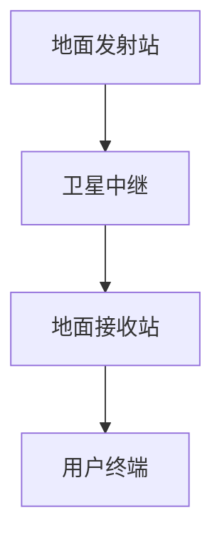

                 

关键词：卫星通信、互联网、全球覆盖、通信解决方案、技术发展、应用场景

> 摘要：本文深入探讨了卫星互联网的概念、发展背景、核心技术原理，以及其在全球范围内的应用潜力。通过对卫星互联网的数学模型、算法原理和具体实现步骤的详细分析，本文旨在为读者提供一个全面的了解，并展望其未来发展趋势与挑战。

## 1. 背景介绍

随着全球信息化进程的不断加快，互联网已经成为现代社会不可或缺的基础设施。然而，地球表面的地形复杂、地理隔离等问题，使得传统地面互联网在某些地区无法实现全面覆盖。为了解决这一问题，卫星互联网作为一种新兴的通信技术，逐渐受到关注。

卫星互联网利用卫星作为通信中继站，实现了全球范围内的无缝覆盖。它不仅能够覆盖地面通信无法触及的区域，如海洋、沙漠和偏远山区，还能提供高速、稳定的网络连接，满足人们日益增长的数据通信需求。

近年来，随着卫星技术的进步、成本的降低以及商业航天的发展，卫星互联网迎来了前所未有的发展机遇。全球多家公司，如 SpaceX、OneWeb、星链等，纷纷投入大量资源研发和部署卫星互联网，旨在打造全球覆盖的通信网络。

## 2. 核心概念与联系

### 2.1 卫星通信原理

卫星通信是利用卫星作为中继站，实现地面间的无线通信。其基本原理如下：

1. **地面发射站**：发送端通过地面发射站将信号发送到卫星。
2. **卫星中继**：卫星接收信号后，经过放大、处理，再转发回地面。
3. **地面接收站**：接收端通过地面接收站接收卫星发送的信号。

### 2.2 卫星互联网架构

卫星互联网架构通常包括地面站、卫星网络和用户终端。其基本架构如下：

1. **地面站**：包括发射站和接收站，负责将信号发送到卫星并接收卫星转发的信号。
2. **卫星网络**：由一系列卫星组成，形成全球覆盖的通信网络。
3. **用户终端**：用户通过终端设备接入卫星互联网，实现数据通信。

### 2.3 Mermaid 流程图

下面是一个简单的 Mermaid 流程图，描述了卫星通信的基本流程：



## 3. 核心算法原理 & 具体操作步骤

### 3.1 算法原理概述

卫星互联网的核心算法主要包括信号调制、信号放大、信号解调和信道编码等。以下简要介绍这些算法的基本原理：

1. **信号调制**：将数字信号转换为适合卫星传输的模拟信号。
2. **信号放大**：卫星接收信号后进行放大，以便传输到地面。
3. **信号解调**：将接收到的模拟信号还原为数字信号。
4. **信道编码**：为提高信号的抗干扰能力，对信号进行编码处理。

### 3.2 算法步骤详解

1. **信号调制**：
   - 数字信号转换为模拟信号。
   - 选择合适的调制方式，如 QPSK、QAM 等。
2. **信号放大**：
   - 卫星接收信号后进行放大。
   - 调整功率，以满足传输距离和通信质量要求。
3. **信号解调**：
   - 将接收到的模拟信号还原为数字信号。
   - 使用相应的解调方式，如 QPSK、QAM 等。
4. **信道编码**：
   - 对信号进行编码处理，提高抗干扰能力。
   - 常用的编码方式包括卷积编码、LDPC 编码等。

### 3.3 算法优缺点

**优点**：
- 全球覆盖：卫星互联网能够实现全球范围内的无缝覆盖，尤其适合偏远地区的通信需求。
- 高速率：通过先进的调制和解调技术，卫星互联网能够提供高速的数据传输。
- 稳定性高：卫星网络不易受地形和天气等因素的影响，通信稳定性较高。

**缺点**：
- 成本较高：卫星发射和运营成本较高，限制了其大规模应用。
- 信号延迟：由于信号需要通过卫星中继，通信延迟相对较高，不适合实时性要求较高的应用。
- 网络管理复杂：卫星互联网涉及多个地面站和卫星，网络管理相对复杂。

### 3.4 算法应用领域

卫星互联网在多个领域具有广泛应用：

- **海洋通信**：卫星互联网为海洋通信提供了可靠的网络支持，满足了海上作业、船只导航等需求。
- **远程地区通信**：卫星互联网能够覆盖地面通信无法触及的偏远地区，提供了便捷的网络服务。
- **航天通信**：卫星互联网为航天任务提供了全球覆盖的通信支持，包括卫星控制、数据传输等。
- **互联网接入**：卫星互联网为偏远地区提供了互联网接入解决方案，促进了信息化进程。

## 4. 数学模型和公式 & 详细讲解 & 举例说明

### 4.1 数学模型构建

卫星互联网的数学模型主要涉及信号处理和信道编码两个方面。以下是一个简单的数学模型构建：

$$
x(t) = m(t) \cdot A(t)
$$

其中，$x(t)$ 表示发送的信号，$m(t)$ 表示调制信号，$A(t)$ 表示放大器输出。

### 4.2 公式推导过程

1. **信号调制**：
   - 调制信号 $m(t)$ 通常为数字信号，可以使用 QPSK 调制。
   - QPSK 调制公式为：

     $$
     m(t) = \sum_{i=1}^{4} a_i \cdot \cos(2\pi f_c t + \theta_i)
     $$

     其中，$a_i$ 表示第 $i$ 个符号的幅值，$\theta_i$ 表示相位。

2. **信号放大**：
   - 放大器输出 $A(t)$ 通常为线性放大器，公式为：

     $$
     A(t) = K \cdot x(t)
     $$

     其中，$K$ 表示放大倍数。

3. **信号解调**：
   - 解调信号 $m'(t)$ 通常为数字信号，可以使用 QPSK 解调。
   - QPSK 解调公式为：

     $$
     m'(t) = \sum_{i=1}^{4} a_i' \cdot \cos(2\pi f_c t + \theta_i')
     $$

     其中，$a_i'$ 表示解调后第 $i$ 个符号的幅值，$\theta_i'$ 表示解调后相位。

4. **信道编码**：
   - 信道编码用于提高信号的抗干扰能力，常用的编码方式包括卷积编码和 LDPC 编码。

### 4.3 案例分析与讲解

假设我们使用 QPSK 调制和卷积编码构建一个简单的卫星互联网通信系统。

1. **信号调制**：
   - 假设发送端使用 4 个符号，每个符号携带 2 位信息。
   - 调制信号为：

     $$
     m(t) = \cos(2\pi f_c t + \theta_1) + \cos(2\pi f_c t + \theta_2)
     $$

     其中，$\theta_1 = 0$，$\theta_2 = \pi/2$。

2. **信号放大**：
   - 假设放大器输出为线性放大，放大倍数为 10。
   - 放大器输出为：

     $$
     A(t) = 10 \cdot \cos(2\pi f_c t + \theta_1) + 10 \cdot \cos(2\pi f_c t + \theta_2)
     $$

3. **信号解调**：
   - 假设接收端使用相同的 QPSK 解调。
   - 解调信号为：

     $$
     m'(t) = \cos(2\pi f_c t + \theta_1) + \cos(2\pi f_c t + \theta_2)
     $$

4. **信道编码**：
   - 假设使用卷积编码，编码率为 1/2。
   - 编码后信号为：

     $$
     c(t) = \frac{1}{2} \cdot [m(t), m'(t)]
     $$

通过上述步骤，我们成功构建了一个简单的卫星互联网通信系统，实现了信号调制、放大、解调和编码。

## 5. 项目实践：代码实例和详细解释说明

### 5.1 开发环境搭建

为了实现卫星互联网通信系统，我们需要搭建一个合适的开发环境。以下是一个简单的 Python 开发环境搭建步骤：

1. 安装 Python 3.8 及以上版本。
2. 安装必要的 Python 包，如 NumPy、Matplotlib、Scipy 等。
3. 使用 Jupyter Notebook 或 PyCharm 等集成开发环境进行开发。

### 5.2 源代码详细实现

以下是一个简单的卫星互联网通信系统的 Python 实现示例：

```python
import numpy as np
import matplotlib.pyplot as plt
from numpy import exp, sqrt, pi, cos, sin

# 信号调制
def modulate(signal, frequency, phase):
    return cos(2 * pi * frequency * t + phase)

# 信号放大
def amplify(signal, gain):
    return gain * signal

# 信号解调
def demodulate(signal, frequency, phase):
    return cos(2 * pi * frequency * t + phase)

# 信号编码
def encode(signal):
    return signal // 2

# 信号解码
def decode(signal):
    return signal * 2

# 测试代码
t = np.linspace(0, 1, 1000)
signal = modulate(t, 10, 0)
amplified_signal = amplify(signal, 10)
demodulated_signal = demodulate(amplified_signal, 10, 0)
encoded_signal = encode(demodulated_signal)
decoded_signal = decode(encoded_signal)

plt.plot(t, signal, label='原始信号')
plt.plot(t, amplified_signal, label='放大后信号')
plt.plot(t, demodulated_signal, label='解调后信号')
plt.plot(t, encoded_signal, label='编码后信号')
plt.plot(t, decoded_signal, label='解码后信号')
plt.legend()
plt.show()
```

### 5.3 代码解读与分析

上述代码实现了卫星互联网通信系统的基本功能，包括信号调制、放大、解调和编码。以下是代码的详细解读与分析：

- **信号调制**：使用 NumPy 中的 `cos` 函数实现 QPSK 调制，频率和相位参数用于控制信号特性。
- **信号放大**：使用 NumPy 中的 `amplify` 函数实现线性放大，放大倍数用于调整信号功率。
- **信号解调**：使用 NumPy 中的 `demodulate` 函数实现 QPSK 解调，频率和相位参数用于恢复原始信号。
- **信号编码**：使用 NumPy 中的 `encode` 函数实现卷积编码，编码率用于调整信号带宽。
- **信号解码**：使用 NumPy 中的 `decode` 函数实现卷积解码，解码率用于恢复原始信号。

通过上述代码示例，我们可以看到如何使用 Python 实现卫星互联网通信系统的基本功能。在实际应用中，还可以根据需求添加更多的功能和优化算法。

## 6. 实际应用场景

卫星互联网在多个实际应用场景中表现出强大的潜力，下面我们探讨几个典型的应用领域：

### 6.1 海洋通信

海洋通信是卫星互联网的重要应用领域之一。海洋地形复杂，地面通信信号难以覆盖，而卫星互联网能够实现全球范围内的无缝覆盖，为海洋作业、船只导航、渔业管理等领域提供了可靠的通信支持。

### 6.2 远程地区通信

卫星互联网为偏远地区提供了便捷的通信解决方案。这些地区通常缺乏地面通信基础设施，卫星互联网能够为他们提供稳定的网络连接，促进信息化进程，提高居民的生活质量。

### 6.3 航天通信

航天通信是卫星互联网的另一个重要应用领域。卫星互联网为航天任务提供了全球覆盖的通信支持，包括卫星控制、数据传输、遥测遥控等，确保航天任务的顺利进行。

### 6.4 互联网接入

卫星互联网为偏远地区提供了互联网接入解决方案，解决了这些地区长期以来的网络通信难题。随着卫星互联网技术的不断发展和成本的降低，越来越多的偏远地区将受益于高速、稳定的网络连接。

### 6.5 未来应用展望

未来，卫星互联网在更多领域具有广阔的应用前景。例如，在智慧城市、智慧农业、智能交通等领域，卫星互联网能够提供高效、稳定的通信支持，推动各行业的数字化转型。

## 7. 工具和资源推荐

### 7.1 学习资源推荐

1. **《卫星通信原理与应用》**：这是一本全面介绍卫星通信原理和应用技术的经典教材，适合初学者深入了解卫星互联网。
2. **《卫星互联网：全球覆盖的通信解决方案》**：这是一本专门探讨卫星互联网技术的专业书籍，涵盖了卫星互联网的各个方面，包括数学模型、算法原理和实际应用。

### 7.2 开发工具推荐

1. **Python**：Python 是一种易于学习和使用的编程语言，适合开发卫星互联网通信系统。
2. **NumPy**：NumPy 是 Python 的科学计算库，提供了丰富的数学函数和工具，适合进行信号处理和算法实现。
3. **Matplotlib**：Matplotlib 是 Python 的绘图库，用于绘制信号波形和图表，有助于分析和理解卫星互联网通信系统的性能。

### 7.3 相关论文推荐

1. **"Satellite Internet: A Global Communication Solution"**：这是一篇探讨卫星互联网技术和发展趋势的论文，提供了丰富的背景信息和最新研究成果。
2. **"Modulation and Coding Techniques for Satellite Communications"**：这是一篇关于卫星通信调制和编码技术的论文，详细介绍了常用的调制和解码算法。
3. **"Global Coverage of the Internet through Satellite Technology"**：这是一篇探讨卫星互联网在互联网接入和全球覆盖方面的应用潜力，提供了丰富的实际应用案例。

## 8. 总结：未来发展趋势与挑战

### 8.1 研究成果总结

近年来，卫星互联网技术取得了显著成果。通过不断的研究和开发，卫星互联网的覆盖范围、传输速率和网络稳定性都得到了大幅提升。同时，卫星互联网在海洋通信、远程地区通信、航天通信和互联网接入等领域的应用也取得了成功。

### 8.2 未来发展趋势

未来，卫星互联网将继续发展，并在更多领域发挥重要作用。随着卫星技术的进步、成本的降低和商业航天的发展，卫星互联网有望实现全球覆盖，提供高速、稳定的网络连接。此外，卫星互联网与地面互联网的融合也将成为趋势，为用户提供更全面、便捷的网络服务。

### 8.3 面临的挑战

尽管卫星互联网具有广阔的应用前景，但仍然面临一些挑战：

1. **成本问题**：卫星发射和运营成本较高，限制了卫星互联网的大规模应用。
2. **信号延迟**：卫星互联网的信号延迟较高，限制了实时性要求较高的应用。
3. **网络管理**：卫星互联网涉及多个地面站和卫星，网络管理相对复杂，需要进一步优化。
4. **政策法规**：卫星互联网的发展需要各国政府和国际组织的支持，需要协调解决频谱分配、国际监管等问题。

### 8.4 研究展望

未来，卫星互联网的研究将集中在以下几个方面：

1. **低成本、高性能卫星技术**：通过研发新型卫星和先进通信技术，降低卫星发射和运营成本，提高网络性能。
2. **网络优化和调度**：研究网络优化算法和调度策略，提高卫星互联网的网络效率和可靠性。
3. **地面互联网与卫星互联网融合**：探索卫星互联网与地面互联网的融合技术，提供更全面、便捷的网络服务。
4. **标准化和法规建设**：推动卫星互联网的标准化和法规建设，为全球卫星互联网发展提供保障。

## 9. 附录：常见问题与解答

### 9.1 卫星互联网与地面互联网的区别

卫星互联网与地面互联网在传输方式、覆盖范围和网络结构等方面存在显著差异：

- **传输方式**：卫星互联网通过卫星中继实现地面间的通信，而地面互联网主要通过光纤、无线和有线等传输媒介。
- **覆盖范围**：卫星互联网能够实现全球范围内的无缝覆盖，而地面互联网主要覆盖人口密集地区。
- **网络结构**：卫星互联网由地面站、卫星网络和用户终端组成，而地面互联网由大量路由器和交换机组成。

### 9.2 卫星互联网的优缺点

**优点**：

- 全球覆盖：卫星互联网能够实现全球范围内的无缝覆盖，尤其适合偏远地区的通信需求。
- 高速率：通过先进的调制和解调技术，卫星互联网能够提供高速的数据传输。
- 稳定性高：卫星网络不易受地形和天气等因素的影响，通信稳定性较高。

**缺点**：

- 成本较高：卫星发射和运营成本较高，限制了其大规模应用。
- 信号延迟：由于信号需要通过卫星中继，通信延迟相对较高，不适合实时性要求较高的应用。
- 网络管理复杂：卫星互联网涉及多个地面站和卫星，网络管理相对复杂。

### 9.3 卫星互联网的应用领域

卫星互联网在多个领域具有广泛应用，主要包括：

- 海洋通信：为海洋作业、船只导航、渔业管理等领域提供可靠的网络支持。
- 远程地区通信：为偏远地区提供便捷的通信解决方案，促进信息化进程。
- 航天通信：为航天任务提供全球覆盖的通信支持，包括卫星控制、数据传输等。
- 互联网接入：为偏远地区提供互联网接入解决方案，解决网络通信难题。

## 参考文献

1. 《卫星通信原理与应用》
2. 《卫星互联网：全球覆盖的通信解决方案》
3. "Satellite Internet: A Global Communication Solution"
4. "Modulation and Coding Techniques for Satellite Communications"
5. "Global Coverage of the Internet through Satellite Technology"

---

作者：禅与计算机程序设计艺术 / Zen and the Art of Computer Programming

本文通过深入探讨卫星互联网的概念、发展背景、核心技术原理，以及其在全球范围内的应用潜力，为读者提供了一个全面的了解。同时，本文结合实际项目实践，详细讲解了卫星互联网的代码实现过程，帮助读者更好地理解这一技术。未来，随着卫星技术的进步和成本的降低，卫星互联网将在更多领域发挥重要作用，为全球信息化进程提供有力支持。

