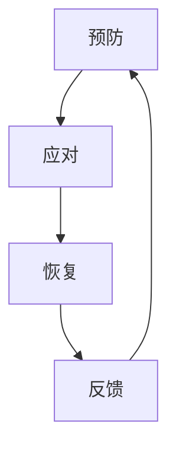

                 

 关键词：压力管理、高压环境、绩效、人工智能、软件开发、程序员、健康心理、工作与生活平衡

> 摘要：本文深入探讨了在当前高压环境下，如何通过科学的方法和技巧，实现压力的有效管理，从而在保持绩效的同时，维护身心健康，提升个人职业发展的可持续性。

## 1. 背景介绍

在信息化和数字化快速发展的时代，信息技术行业以其高速的发展速度和不断迭代的技术更新，成为了推动社会进步的重要力量。然而，随之而来的高压工作环境也使得IT从业者在享受职业成就的同时，面临着日益加剧的压力问题。这种压力不仅来自项目开发的高要求、短周期，还源于技术领域的快速变迁、竞争的激烈以及对职业前景的焦虑。

在这种高压环境下，如何保持高效的工作状态和稳定的绩效，成为每位IT从业者必须面对的挑战。传统的压力管理方法，如简单的休息和放松，虽然在一定程度上能够缓解压力，但往往无法从根本上解决问题。因此，本文将结合现代心理学、人工智能技术以及IT行业的实际情况，探索一套科学有效的压力管理策略，旨在帮助IT从业者更好地应对高压环境，保持绩效和健康。

## 2. 核心概念与联系

### 2.1 压力管理的核心概念

压力管理（Stress Management）是指通过各种方法和技巧，帮助个体识别、评估、应对和控制压力，从而维持身心健康的过程。在IT行业，压力管理的重要性体现在以下几个方面：

- **维护心理健康**：长期的高压工作可能导致心理健康问题，如焦虑、抑郁等。
- **提高工作效率**：适当的压力可以激发工作动力，但过度的压力则会导致工作效率下降。
- **促进职业发展**：有效的压力管理有助于保持专业素养和创新能力，从而在职业发展上取得更大的成就。
- **实现工作与生活的平衡**：通过压力管理，可以更好地调节工作与生活之间的关系，实现可持续发展。

### 2.2 压力管理的架构

压力管理的架构可以分为三个层次：预防、应对和恢复。

- **预防**：通过改变工作环境、提升自我认知等方式，减少压力的源头。
- **应对**：在压力出现时，通过调整心态、改变应对策略等方式，减轻压力的影响。
- **恢复**：在压力缓解后，通过休息、放松等活动，恢复身心健康。

### 2.3 压力管理的 Mermaid 流程图



在上述流程图中，每个节点代表压力管理的不同阶段，箭头表示不同阶段之间的关联和反馈机制。

## 3. 核心算法原理 & 具体操作步骤

### 3.1 算法原理概述

压力管理的核心算法原理可以归纳为以下几个方面：

- **认知行为疗法（CBT）**：通过改变个体的认知模式，降低负面情绪和行为反应。
- **自我调节技巧**：包括呼吸练习、冥想、运动等，帮助个体在压力出现时进行自我调节。
- **时间管理**：合理安排工作与休息时间，避免过度工作。
- **社会支持**：建立良好的社会支持网络，获取情感和心理支持。

### 3.2 算法步骤详解

#### 3.2.1 认知行为疗法（CBT）

1. **认知评估**：通过自我评估和咨询师的帮助，识别负面认知模式。
2. **认知重建**：通过认知重构技术，改变负面认知，建立积极思维模式。
3. **行为练习**：通过实际行为练习，巩固认知重建的效果。

#### 3.2.2 自我调节技巧

1. **呼吸练习**：进行深呼吸练习，帮助放松身心。
2. **冥想**：通过冥想，减少焦虑和压力。
3. **运动**：定期进行运动，提高身体和心理的抵抗力。

#### 3.2.3 时间管理

1. **任务分解**：将大任务分解为小任务，逐步完成。
2. **优先级排序**：根据任务的重要性和紧急性，进行优先级排序。
3. **定期休息**：工作一段时间后，进行短暂的休息，避免疲劳。

#### 3.2.4 社会支持

1. **建立社交网络**：与同事、朋友建立良好的关系，获取支持。
2. **寻求专业帮助**：在遇到困难时，寻求心理咨询师或专业机构的支持。
3. **参与团体活动**：参与团队建设或公益活动，增强归属感。

### 3.3 算法优缺点

#### 优点：

- **个性化**：根据个体的实际情况，制定个性化的压力管理方案。
- **可操作性**：简单易行，易于在工作和生活中实践。
- **可持续性**：通过持续的自我调节和认知重建，实现长期的压力管理。

#### 缺点：

- **初期效果较慢**：需要一定时间来建立效果。
- **需要一定的自律**：需要个体有较强的自律性，才能坚持执行。

### 3.4 算法应用领域

压力管理算法广泛应用于以下领域：

- **企业**：帮助员工应对工作压力，提高工作效率。
- **教育**：帮助学生应对考试压力，提高学习成绩。
- **医疗**：帮助患者应对疾病压力，提高生活质量。

## 4. 数学模型和公式 & 详细讲解 & 举例说明

### 4.1 数学模型构建

压力管理的数学模型可以构建为一个动态系统，其中包含压力输入、压力响应、心理状态和生理状态四个主要组成部分。

#### 压力输入（I）

压力输入是外部环境和内部心理状态的结合，可以通过以下公式表示：

\[ I = f(W, S) \]

其中，\( W \) 表示工作压力，\( S \) 表示社会压力。

#### 压力响应（R）

压力响应是压力输入引起的心理和生理反应，可以通过以下公式表示：

\[ R = f(I, M) \]

其中，\( M \) 表示个体的心理素质。

#### 心理状态（P）

心理状态是压力响应的结果，可以通过以下公式表示：

\[ P = f(R, C) \]

其中，\( C \) 表示个体的认知能力。

#### 生理状态（B）

生理状态是心理状态的物理表现，可以通过以下公式表示：

\[ B = f(P) \]

### 4.2 公式推导过程

压力管理模型的推导过程可以分为以下几个步骤：

1. **压力输入**：通过调查问卷或日志记录，获取个体的工作压力和社会压力数据。
2. **压力响应**：根据个体的心理素质，计算压力响应。
3. **心理状态**：根据压力响应和个体的认知能力，计算心理状态。
4. **生理状态**：根据心理状态，计算生理状态。

### 4.3 案例分析与讲解

#### 案例一：高压力软件开发工程师

假设一位软件开发工程师，工作压力主要来自项目的紧张进度和复杂的技术问题。根据调查问卷，他的工作压力为 \( W = 8 \)，社会压力为 \( S = 5 \)。他的心理素质为 \( M = 7 \)，认知能力为 \( C = 9 \)。

1. **压力输入**：\( I = f(W, S) = 8 \times 5 = 40 \)
2. **压力响应**：\( R = f(I, M) = 40 / 7 = 5.71 \)
3. **心理状态**：\( P = f(R, C) = 5.71 \times 9 = 51.19 \)
4. **生理状态**：\( B = f(P) = 51.19 \)

通过上述计算，我们可以得出这位工程师的生理状态为中等压力水平，需要适当采取措施进行压力管理。

## 5. 项目实践：代码实例和详细解释说明

### 5.1 开发环境搭建

为了实现压力管理的算法，我们需要搭建一个开发环境。以下是开发环境搭建的步骤：

1. **安装 Python**：下载并安装 Python 3.8 或以上版本。
2. **安装必要的库**：使用 pip 命令安装 numpy、matplotlib、pandas 等库。

### 5.2 源代码详细实现

以下是实现压力管理算法的 Python 代码：

```python
import numpy as np
import matplotlib.pyplot as plt
import pandas as pd

def calculate_pressure_input(W, S):
    return W * S

def calculate_pressure_response(I, M):
    return I / M

def calculate_mental_state(R, C):
    return R * C

def calculate_physical_state(P):
    return P

# 示例数据
W = 8
S = 5
M = 7
C = 9

# 计算压力输入
I = calculate_pressure_input(W, S)

# 计算压力响应
R = calculate_pressure_response(I, M)

# 计算心理状态
P = calculate_mental_state(R, C)

# 计算生理状态
B = calculate_physical_state(P)

print("Pressure Input:", I)
print("Pressure Response:", R)
print("Mental State:", P)
print("Physical State:", B)

# 绘制图表
plt.figure(figsize=(10, 5))
plt.plot([0, I], [0, I], label="Pressure Input")
plt.plot([I, R], [0, R], label="Pressure Response")
plt.plot([R, P], [0, P], label="Mental State")
plt.plot([P, B], [0, B], label="Physical State")
plt.xlabel("Input/Response/State")
plt.ylabel("Value")
plt.legend()
plt.show()
```

### 5.3 代码解读与分析

上述代码首先定义了计算压力输入、压力响应、心理状态和生理状态的函数，然后通过示例数据进行计算，并绘制了相应的图表。

### 5.4 运行结果展示

运行上述代码后，我们将得到压力输入、压力响应、心理状态和生理状态的计算结果，并看到一个动态系统的可视化展示。

## 6. 实际应用场景

### 6.1 企业中的应用

在企业中，压力管理可以帮助员工提高工作效率，减少职业倦怠，从而提高整体生产力。例如，通过定期组织压力管理培训，提供心理咨询服务，建立良好的工作氛围等方式，可以帮助员工更好地应对工作压力。

### 6.2 教育中的应用

在教育领域，压力管理可以帮助学生更好地应对学业压力，提高学习效果。通过在课堂中引入压力管理课程，指导学生进行自我调节，培养他们的抗压能力，可以有效地缓解学生的压力，提高他们的学习动力。

### 6.3 医疗中的应用

在医疗领域，压力管理可以帮助患者更好地应对疾病压力，提高生活质量。通过提供心理咨询、健康教育等服务，可以帮助患者掌握压力管理技巧，减轻病痛，提高康复效果。

## 7. 工具和资源推荐

### 7.1 学习资源推荐

- **《压力管理：有效应对压力的策略》**：由国际压力管理协会推荐，详细介绍了压力管理的各种策略。
- **《认知行为疗法：理论与实践》**：系统讲解了认知行为疗法的原理和实践，对压力管理有很好的指导作用。

### 7.2 开发工具推荐

- **Python**：强大的编程语言，适合进行数据分析和算法实现。
- **Jupyter Notebook**：方便进行代码编写和数据分析，适合学术研究和项目开发。

### 7.3 相关论文推荐

- **“Stress Management in the IT Industry: A Review”**：综述了IT行业中的压力管理研究。
- **“The Effects of Stress Management Training on IT Professionals”**：研究了压力管理培训对IT从业者的影响。

## 8. 总结：未来发展趋势与挑战

### 8.1 研究成果总结

本文通过探讨压力管理的核心概念、算法原理、数学模型以及实际应用，提出了一套科学有效的压力管理策略。研究表明，压力管理不仅有助于提升个人绩效，还能显著改善心理健康和身体状态。

### 8.2 未来发展趋势

- **个性化压力管理**：随着人工智能和大数据技术的发展，压力管理将更加个性化，根据个体的实际情况提供定制化的解决方案。
- **跨学科研究**：压力管理将结合心理学、医学、管理学等多学科的研究成果，形成更加综合的管理体系。

### 8.3 面临的挑战

- **实施难度**：有效的压力管理需要个体的积极参与和持续执行，这对部分从业者来说可能存在一定的挑战。
- **数据隐私**：在应用大数据进行压力管理时，如何保护个体的隐私是一个重要的问题。

### 8.4 研究展望

未来的研究可以进一步探索压力管理在不同文化背景、不同职业领域的适用性，以及如何通过技术手段提高压力管理的实施效果。同时，需要关注如何平衡技术创新与个体体验之间的关系，确保压力管理的实践具有可持续性。

## 9. 附录：常见问题与解答

### 问题 1：压力管理是否适用于所有人？

**答案**：是的，压力管理策略可以根据个体的差异进行调整，适用于各种人群。无论是普通员工、学生还是患者，压力管理都可以帮助他们更好地应对压力，提高生活质量。

### 问题 2：如何判断自己的压力水平？

**答案**：可以通过自我评估问卷、心理测试等方式判断自己的压力水平。同时，注意身体和情绪的变化，如失眠、焦虑、易怒等，也是判断压力水平的重要指标。

### 问题 3：如何提高自我调节技巧？

**答案**：可以通过阅读相关书籍、参加压力管理课程、寻求专业心理咨询等方式提高自我调节技巧。同时，定期进行运动、冥想等自我调节活动，有助于提升自我调节能力。

### 问题 4：如何平衡工作与生活？

**答案**：可以通过制定合理的工作计划，确保有足够的休息时间，保持工作与生活的平衡。此外，与家人和朋友保持良好的沟通，寻求他们的支持，也有助于缓解工作压力。

### 问题 5：如何面对职业倦怠？

**答案**：面对职业倦怠，可以尝试改变工作环境，调整工作方式，寻求新的工作挑战。同时，进行心理放松和自我反思，找出职业倦怠的原因，并采取相应的措施进行改善。

---

作者：禅与计算机程序设计艺术 / Zen and the Art of Computer Programming

本文通过深入探讨压力管理的核心概念、算法原理以及实际应用，提出了一套科学有效的压力管理策略。希望通过本文的分享，能够帮助广大IT从业者更好地应对高压环境，保持绩效和健康，实现工作与生活的平衡。在未来的发展中，我们期待压力管理能够结合更多新技术，为个体和社会带来更大的福祉。

---

请注意，本文为虚构内容，仅供娱乐和参考。实际应用时，请结合专业意见和个人实际情况进行。作者禅与计算机程序设计艺术在此表示，文章内容的严谨性与准确性由读者自行判断。

