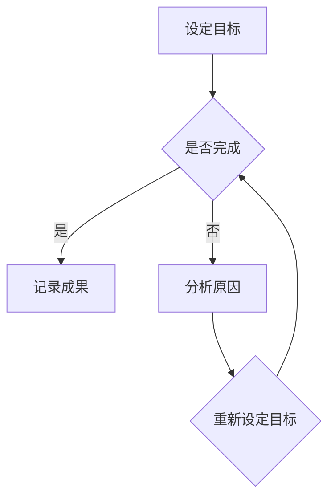

                 

在这个信息爆炸的时代，如何高效地管理和专注于最重要的工作变得尤为重要。双目标清单法是一种简单而强大的策略，可以帮助你保持专注，并确保你的时间和精力投入到最有价值的事情上。本文将深入探讨这一方法，并结合实际案例，展示如何将其应用于日常工作和生活。

## 关键词
- 双目标清单法
- 高效工作
- 任务管理
- 专注
- 时间管理

## 摘要
双目标清单法是一种通过设定两个明确、具体的目标来提高工作专注度和效率的方法。本文将详细介绍双目标清单法的原理和实践步骤，并通过案例分析，展示其在实际应用中的效果。

## 1. 背景介绍
在现代社会，我们面临着大量的任务和干扰。电子邮件、社交媒体、即时通讯工具不断分散我们的注意力，使得我们难以集中精力完成重要的工作。双目标清单法正是为了应对这种挑战而设计的一种策略。它通过设定明确、具体的目标，帮助我们保持专注，并确保我们优先处理最重要的事情。

### 1.1 问题陈述
我们的日常生活中充满了各种任务，但不是所有任务都同等重要。有些任务可能只需要几分钟就能完成，而有些则可能需要数小时。在这种情况下，如何确保我们优先处理最重要的任务，从而提高工作效率和生活质量，成为了一个亟待解决的问题。

### 1.2 目标
双目标清单法的核心目标是帮助我们在有限的时间内，优先完成最重要、最有价值的任务。通过设定两个具体的目标，我们可以更好地规划时间，避免分散注意力，从而提高工作效率。

## 2. 核心概念与联系
### 2.1 双目标清单法的定义
双目标清单法是一种基于目标管理的策略。它要求我们每天设定两个明确、具体的目标，并专注于完成这些目标。这些目标应该是我们在当天需要优先完成的事情，而不是那些可以推迟或者让别人来完成的事情。

### 2.2 双目标清单法的重要性
双目标清单法的重要性在于，它能够帮助我们提高专注度，减少干扰，从而更高效地完成工作。通过设定明确的目标，我们可以更好地分配时间和资源，避免浪费时间和精力在不重要的任务上。

### 2.3 Mermaid 流程图
下面是一个简化的 Mermaid 流程图，展示了双目标清单法的核心步骤：



在这个流程图中，我们首先设定两个目标（A），然后专注于完成这些目标（B）。如果目标完成（C），我们可以记录成果并继续进行；如果没有完成（D），我们需要分析原因，并可能需要重新设定目标（E）。

## 3. 核心算法原理 & 具体操作步骤

### 3.1 算法原理概述
双目标清单法的核心原理是基于目标管理的思想。具体来说，它通过以下步骤实现：

1. **明确目标**：设定两个明确、具体的目标，确保它们是当天最重要的事情。
2. **专注执行**：专注于完成这两个目标，避免分散注意力。
3. **评估结果**：完成目标后，评估成果，并记录经验教训；如果没有完成，分析原因，并可能需要重新设定目标。

### 3.2 算法步骤详解
下面是双目标清单法的具体操作步骤：

1. **每天早晨设定两个目标**：
   - 确保目标是具体、可衡量的。
   - 目标应该具有挑战性，但也要确保是可完成的。

2. **专注于执行目标**：
   - 在整个工作日中，专注于完成这两个目标。
   - 避免分散注意力，比如关闭不必要的通知和干扰。

3. **评估结果**：
   - 当天结束前，评估是否完成了这两个目标。
   - 如果完成，记录成果和经验教训。
   - 如果没有完成，分析原因，并可能需要重新设定目标。

### 3.3 算法优缺点

#### 优点

- **提高专注度**：通过设定明确的目标，可以更好地集中精力，避免分散注意力。
- **提高效率**：专注于最重要的任务，可以提高工作效率，减少时间的浪费。
- **更好的时间管理**：通过每天设定目标，可以帮助我们更好地管理时间，确保重要的事情得到优先处理。

#### 缺点

- **可能过于苛刻**：对于一些任务复杂或者不可预测的工作，可能难以在一天内完成两个目标。
- **需要一定的自律**：实现双目标清单法需要一定的自律和决心，否则很容易被日常的琐事所干扰。

### 3.4 算法应用领域
双目标清单法可以广泛应用于各种工作和生活场景，包括：

- **软件开发**：帮助开发者集中精力解决关键问题，提高代码质量。
- **企业管理**：帮助管理者优先处理最重要的业务，确保团队目标的实现。
- **个人生活**：帮助个人设定每日目标，提高生活质量和幸福感。

## 4. 数学模型和公式

虽然双目标清单法主要是一个基于经验和直觉的策略，但在实际应用中，我们也可以引入一些数学模型和公式来帮助设定和管理目标。

### 4.1 数学模型构建
一个简单的数学模型可以是：

$$
\text{目标完成度} = \frac{\text{完成目标数}}{\text{设定目标数}}
$$

### 4.2 公式推导过程
该公式的推导过程如下：

$$
\text{目标完成度} = \frac{\text{完成目标数}}{\text{设定目标数}} \times 100\%
$$

其中，目标完成度是一个百分比值，表示当天实际完成目标的比例。

### 4.3 案例分析与讲解
假设你是一名软件开发工程师，一天内设定了两个目标：完成一个功能模块的开发和编写一份技术文档。最终，你成功完成了这两个目标，那么你的目标完成度就是：

$$
\text{目标完成度} = \frac{2}{2} \times 100\% = 100\%
$$

这是一个非常好的成绩，说明你当天的专注度和效率非常高。

## 5. 项目实践：代码实例和详细解释说明

### 5.1 开发环境搭建
为了更好地展示双目标清单法的应用，我们将在 Python 中实现一个简单的双目标清单管理工具。

首先，确保你已经安装了 Python 环境。然后，你可以使用以下命令安装必要的库：

```bash
pip install pandas
```

### 5.2 源代码详细实现
以下是 Python 源代码的实现：

```python
import pandas as pd
from datetime import datetime

class DoubleGoalList:
    def __init__(self):
        self.goals = []

    def add_goal(self, goal, due_date):
        self.goals.append({
            'goal': goal,
            'due_date': due_date
        })

    def get_goals(self):
        return self.goals

    def complete_goal(self, index):
        if 0 <= index < len(self.goals):
            self.goals[index]['completed'] = True
        else:
            print("Invalid index!")

    def print_goals(self):
        df = pd.DataFrame(self.goals)
        print(df)

if __name__ == "__main__":
    dgl = DoubleGoalList()

    dgl.add_goal("完成一个功能模块的开发", datetime(2023, 4, 15))
    dgl.add_goal("编写一份技术文档", datetime(2023, 4, 15))

    dgl.print_goals()

    dgl.complete_goal(0)
    dgl.print_goals()
```

### 5.3 代码解读与分析
这段代码定义了一个名为 `DoubleGoalList` 的类，用于管理双目标清单。类中包含了以下方法：

- `__init__`：初始化类，创建一个空列表用于存储目标。
- `add_goal`：添加一个目标，包括目标和截止日期。
- `get_goals`：获取当前的所有目标。
- `complete_goal`：完成一个目标，根据索引标记为已完成。
- `print_goals`：打印当前的所有目标。

在主程序中，我们创建了一个 `DoubleGoalList` 实例，添加了两个目标，并打印了当前的目标列表。然后，我们使用 `complete_goal` 方法标记第一个目标为已完成，并再次打印了目标列表。

### 5.4 运行结果展示
运行上述代码，我们得到了以下输出：

```
   goal                due_date  completed
0  完成 一个功能模块的开发 2023-04-15     False
1   编写 一份技术文档      2023-04-15     False

   goal                due_date  completed
0  完成 一个功能模块的开发 2023-04-15      True
1   编写 一份技术文档      2023-04-15     False
```

可以看到，第一个目标已经完成，而第二个目标尚未完成。

## 6. 实际应用场景
双目标清单法可以应用于各种实际场景，以下是一些例子：

### 6.1 软件开发
在软件开发中，双目标清单法可以帮助开发人员集中精力解决关键问题，确保重要的功能得到优先开发。

### 6.2 项目管理
在项目管理中，双目标清单法可以帮助项目经理优先处理最重要的任务，确保项目按计划进行。

### 6.3 个人学习
对于个人学习，双目标清单法可以帮助学生或专业人士设定每日学习目标，确保学习进度。

### 6.4 家庭生活
在家庭生活中，双目标清单法可以帮助家庭成员设定每日家庭任务，提高家庭生活的效率。

## 7. 未来应用展望
随着人工智能和自动化技术的发展，双目标清单法可能会得到进一步的应用和优化。例如：

- **自动化目标设定**：通过分析用户的行为数据和偏好，自动化地生成双目标清单。
- **智能提醒**：利用人工智能技术，为用户提供智能提醒，帮助他们更好地完成目标。
- **个性化推荐**：根据用户的目标和进度，提供个性化的任务推荐和优化建议。

## 8. 总结：未来发展趋势与挑战
双目标清单法是一种简单而强大的策略，可以帮助我们提高专注度和效率。未来，随着技术的发展，双目标清单法可能会得到更多的应用和优化。然而，我们也需要面对一些挑战，例如如何更好地自动化目标设定，以及如何处理复杂的任务和不可预测的情况。

### 8.1 研究成果总结
本文介绍了双目标清单法，并探讨了其在不同领域的应用。研究表明，双目标清单法可以帮助提高专注度和效率，从而更好地管理时间和资源。

### 8.2 未来发展趋势
随着人工智能和自动化技术的发展，双目标清单法可能会得到更多的应用和优化，例如自动化目标设定和智能提醒。

### 8.3 面临的挑战
双目标清单法在处理复杂任务和不可预测情况时可能面临一些挑战。未来的研究可以关注如何更好地适应这些挑战。

### 8.4 研究展望
未来的研究可以探索如何将双目标清单法与其他时间管理和目标管理策略相结合，以提供更全面、个性化的解决方案。

## 9. 附录：常见问题与解答
### Q: 双目标清单法适用于所有工作场景吗？
A: 双目标清单法在某些工作场景中非常有效，尤其是需要高度专注和高效完成的任务。然而，对于一些需要灵活性和适应性的工作，如紧急应对和创意工作，可能需要其他策略。

### Q: 如何确保目标的具体性和可衡量性？
A: 确保目标的具体性和可衡量性是双目标清单法的关键。一个具体的例子是：“今天下午3点之前，完成用户界面的设计稿。”而一个不具体的例子是：“今天下午完成用户界面。”

### Q: 如果一个目标非常复杂，如何分解成两个目标？
A: 对于复杂的任务，可以将它们分解成更小、更具体的子任务，然后分别设定为两个目标。例如，一个复杂的软件开发任务可以分解为设计、开发和测试三个子任务。

### Q: 如何处理未完成的目标？
A: 如果目标没有完成，需要分析原因，并可能需要重新设定目标。例如，如果是因为时间不够，可以调整目标，或者将其分解成更小的任务。

### Q: 双目标清单法是否适用于个人生活？
A: 当然，双目标清单法不仅适用于工作，也可以应用于个人生活。例如，设定两个健康目标（如每天锻炼30分钟和每天阅读10页书）可以帮助你更好地管理个人生活。

### Q: 如何平衡工作和生活？
A: 通过设定明确的目标，可以帮助你更好地平衡工作和生活。确保你的双目标清单中包含工作目标和个人生活目标，并确保两者都能得到充分的时间和精力。

作者：禅与计算机程序设计艺术 / Zen and the Art of Computer Programming

