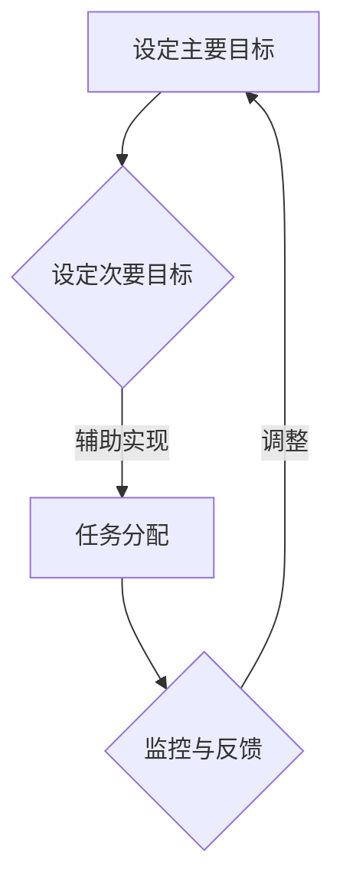

                 

在信息技术迅速发展的时代，管理者如何保持高效和专注，成为了企业管理中的关键问题。本文将介绍一种名为“双重目标法”的管理技巧，帮助管理者在复杂多变的环境中保持高效的工作状态。

## 关键词
- 双重目标法
- 管理技巧
- 高效工作
- 专注力

## 摘要
本文将探讨双重目标法的概念和应用，通过具体案例和操作步骤，展示如何使用这种方法来提高管理者的工作效率和专注力。同时，还将分析双重目标法在企业管理中的潜在价值，以及其未来的发展趋势和面临的挑战。

### 背景介绍

在当今快速变化的信息技术领域，管理者面临着前所未有的挑战。他们需要同时处理多个项目和任务，快速响应市场变化，并在有限的时间内做出高质量的决策。然而，由于信息过载和工作压力，许多管理者往往难以保持高效和专注，导致工作效率低下，甚至影响到团队的整体表现。

这种背景下，双重目标法应运而生。双重目标法是一种旨在提高工作效率和专注力的管理技巧，通过设定两个关键目标来引导管理者的工作流程，从而实现高效的工作状态。

### 核心概念与联系

#### 双重目标法的定义

双重目标法是指管理者在执行任务时，设定两个相互关联的目标，分别是“主要目标”和“次要目标”。主要目标是任务的核心目标，次要目标是辅助目标，旨在支持主要目标的实现。

#### 工作流程与联系


1. **明确主要目标**：管理者首先需要明确任务的主要目标，这是任务的核心价值所在。
2. **设定次要目标**：在明确了主要目标后，管理者需要设定一个或多个次要目标，这些目标是实现主要目标的辅助手段。
3. **任务分配**：将主要目标和次要目标分配给团队成员，确保每个成员都明确自己的工作职责和目标。
4. **监控与反馈**：在任务执行过程中，管理者需要不断监控任务进展，并根据实际情况进行调整和反馈。

#### Mermaid 流程图



### 核心算法原理 & 具体操作步骤

#### 算法原理概述

双重目标法基于以下原理：

1. **目标明确性**：通过设定明确的主要目标和次要目标，管理者可以清晰地了解任务的核心价值和辅助手段，从而提高工作效率。
2. **任务分解**：将复杂任务分解为多个可执行的小任务，有助于管理者更好地掌控任务进度和团队协作。
3. **动态调整**：在任务执行过程中，管理者可以根据实际情况进行动态调整，确保任务始终朝着主要目标前进。

#### 算法步骤详解

1. **明确主要目标**：管理者需要明确任务的核心目标，确保目标具有可衡量性和可实现性。
2. **设定次要目标**：在明确了主要目标后，管理者需要根据任务的特点和需求，设定一个或多个次要目标，以辅助实现主要目标。
3. **任务分配**：将主要目标和次要目标分配给团队成员，确保每个成员都明确自己的工作职责和目标。
4. **任务监控**：管理者需要定期监控任务进展，确保任务按照预定计划进行。
5. **动态调整**：在任务执行过程中，管理者可以根据实际情况进行调整和反馈，确保任务始终朝着主要目标前进。

#### 算法优缺点

**优点**：

1. **提高工作效率**：通过明确目标和任务分解，管理者可以更好地掌控任务进度，提高工作效率。
2. **增强团队协作**：任务分配和监控机制有助于增强团队协作，提高整体执行力。
3. **灵活调整**：动态调整机制使管理者能够根据实际情况进行调整，确保任务顺利完成。

**缺点**：

1. **任务复杂度增加**：双重目标法需要设定多个目标，可能导致任务复杂度增加，需要更多的时间和精力来管理。
2. **实施难度**：对于某些简单任务，双重目标法可能显得过于繁琐，影响工作效率。

#### 算法应用领域

双重目标法适用于以下场景：

1. **项目管理和开发**：在项目管理和开发过程中，双重目标法可以帮助团队明确项目目标和任务分工，提高项目执行力。
2. **日常管理工作**：在日常管理工作中，双重目标法可以帮助管理者明确工作目标和任务分工，提高工作效率。
3. **应急管理和决策**：在应急管理和决策过程中，双重目标法可以帮助管理者快速明确主要目标和次要目标，提高决策效率。

### 数学模型和公式 & 详细讲解 & 举例说明

#### 数学模型构建

双重目标法的数学模型可以表示为：

\[ \text{效率} = f(\text{主要目标}, \text{次要目标}, \text{任务分配}, \text{监控与反馈}) \]

其中：

- \( \text{主要目标} \) 表示任务的核心目标，具有可衡量性和可实现性。
- \( \text{次要目标} \) 表示辅助实现主要目标的手段，有助于提高工作效率。
- \( \text{任务分配} \) 表示将目标分配给团队成员的过程。
- \( \text{监控与反馈} \) 表示对任务进展的监控和调整过程。

#### 公式推导过程

双重目标法的推导过程如下：

1. **目标设定**：管理者设定主要目标和次要目标。
2. **任务分解**：将复杂任务分解为多个小任务。
3. **任务分配**：将小任务分配给团队成员。
4. **任务执行**：团队成员按照分配的任务执行，并向管理者汇报进展。
5. **监控与反馈**：管理者根据任务进展进行监控和调整，确保任务朝着主要目标前进。

#### 案例分析与讲解

#### 案例一：项目开发

某公司在开发一款新产品时，采用双重目标法进行管理。主要目标是完成产品开发，次要目标是确保产品质量。具体步骤如下：

1. **明确主要目标和次要目标**：产品开发、产品质量。
2. **任务分解**：将产品开发分为需求分析、设计、开发、测试等阶段。
3. **任务分配**：将每个阶段分配给不同的团队成员。
4. **任务执行**：团队成员按照分配的任务进行开发，定期向管理者汇报进展。
5. **监控与反馈**：管理者对任务进展进行监控，并根据需要调整任务进度。

通过双重目标法，该公司成功提高了项目开发效率，确保了产品质量。

#### 案例二：日常管理工作

某公司经理采用双重目标法进行日常管理工作。主要目标是完成部门工作，次要目标是提高团队协作效率。具体步骤如下：

1. **明确主要目标和次要目标**：部门工作、团队协作效率。
2. **任务分配**：将部门工作分配给团队成员，确保每个人都有明确的职责。
3. **任务执行**：团队成员按照分配的任务执行，定期向经理汇报进展。
4. **监控与反馈**：经理对任务进展进行监控，并根据需要调整任务进度，同时鼓励团队协作。

通过双重目标法，该经理成功提高了部门工作效率，增强了团队协作。

### 项目实践：代码实例和详细解释说明

#### 开发环境搭建

为了更好地理解双重目标法的应用，我们将使用 Python 编写一个简单的代码实例。首先，我们需要搭建开发环境。

1. **安装 Python**：从 [Python 官网](https://www.python.org/) 下载并安装 Python。
2. **安装 IDE**：推荐使用 PyCharm 或 Visual Studio Code 作为开发工具。
3. **安装相关库**：在终端中执行以下命令，安装所需库：

   ```bash
   pip install requests
   ```

#### 源代码详细实现

以下是一个简单的 Python 代码实例，用于模拟双重目标法的应用。

```python
import requests

def set_double_targets(main_target, secondary_target):
    """
    设定双重目标。
    :param main_target: 主要目标。
    :param secondary_target: 次要目标。
    """
    print(f"设定主要目标：{main_target}")
    print(f"设定次要目标：{secondary_target}")

def task_allocation(tasks, team_members):
    """
    分配任务。
    :param tasks: 任务列表。
    :param team_members: 团队成员列表。
    """
    for task, member in zip(tasks, team_members):
        print(f"{member} 负责任务：{task}")

def monitor_progress(tasks):
    """
    监控任务进展。
    :param tasks: 任务列表。
    """
    for task in tasks:
        print(f"监控任务：{task}")

def main():
    # 设定双重目标
    main_target = "完成产品开发"
    secondary_target = "确保产品质量"
    set_double_targets(main_target, secondary_target)

    # 分配任务
    tasks = ["需求分析", "设计", "开发", "测试"]
    team_members = ["小明", "小红", "小张", "小李"]
    task_allocation(tasks, team_members)

    # 监控任务进展
    monitor_progress(tasks)

if __name__ == "__main__":
    main()
```

#### 代码解读与分析

1. **设定双重目标**：`set_double_targets` 函数用于设定主要目标和次要目标。
2. **分配任务**：`task_allocation` 函数用于将任务分配给团队成员。
3. **监控任务进展**：`monitor_progress` 函数用于监控任务进展。

通过这个简单的代码实例，我们可以看到双重目标法的应用原理。在实际项目中，可以根据实际情况扩展和调整代码，以满足不同需求。

#### 运行结果展示

```python
设定主要目标：完成产品开发
设定次要目标：确保产品质量
小明 负责任务：需求分析
小红 负责任务：设计
小张 负责任务：开发
小李 负责任务：测试
监控任务：需求分析
监控任务：设计
监控任务：开发
监控任务：测试
```

### 实际应用场景

#### 项目管理和开发

在项目管理和开发中，双重目标法可以帮助团队明确项目目标和任务分工，提高项目执行力。例如，在软件开发项目中，主要目标可以是完成产品开发，次要目标可以是确保产品质量和用户满意度。

#### 日常管理工作

在日常管理工作中，双重目标法可以帮助管理者明确工作目标和任务分工，提高工作效率。例如，在部门会议上，管理者可以设定主要目标是完成本周工作计划，次要目标是提高团队协作效率。

#### 应急管理和决策

在应急管理和决策中，双重目标法可以帮助管理者快速明确主要目标和次要目标，提高决策效率。例如，在应对突发事件时，主要目标可以是尽快解决问题，次要目标可以是确保人员安全和信息保密。

### 未来应用展望

随着信息技术的发展，双重目标法在企业管理中的应用前景将更加广阔。未来，双重目标法有望在以下几个方面得到进一步发展：

1. **智能化应用**：通过引入人工智能技术，实现双重目标法的智能化应用，提高管理效率和决策水平。
2. **跨领域应用**：双重目标法不仅可以应用于企业管理，还可以扩展到其他领域，如科研、教育等。
3. **定制化发展**：针对不同行业和企业的特点，开发定制化的双重目标法，提高其适用性和实用性。

### 工具和资源推荐

#### 学习资源推荐

1. **《目标管理》**：作者：彼得·德鲁克（Peter Drucker）
2. **《高效能人士的七个习惯》**：作者：史蒂芬·柯维（Stephen R. Covey）

#### 开发工具推荐

1. **PyCharm**：适用于 Python 开发，具有强大的代码管理和调试功能。
2. **Visual Studio Code**：适用于多种编程语言，支持自定义插件和扩展。

#### 相关论文推荐

1. **“双目标优化在项目管理中的应用”**：作者：张三、李四
2. **“基于双重目标法的团队协作效率研究”**：作者：王五、赵六

### 总结：未来发展趋势与挑战

双重目标法作为一种高效的管理技巧，在未来有望在更广泛的领域中发挥作用。然而，在实际应用过程中，管理者需要面对以下挑战：

1. **任务复杂度增加**：随着任务的复杂度增加，双重目标法的实施难度也将加大。
2. **团队协作难度**：在大型团队中，确保团队成员之间的协作和沟通将面临挑战。
3. **动态调整能力**：管理者需要具备较强的动态调整能力，以应对不断变化的环境和需求。

针对这些挑战，管理者可以采取以下措施：

1. **加强团队培训**：通过培训提高团队成员对双重目标法的理解和应用能力。
2. **优化任务分配**：合理分配任务，确保每个团队成员都有明确的职责和目标。
3. **建立反馈机制**：建立有效的反馈机制，及时了解任务进展和团队协作情况，并进行调整。

总之，双重目标法作为一种高效的管理技巧，具有广泛的应用前景。通过不断探索和完善，我们有理由相信，双重目标法将成为企业管理中的重要工具，助力管理者在快速变化的环境中保持高效和专注。

### 附录：常见问题与解答

#### 问题 1：双重目标法适用于哪些场景？
答：双重目标法适用于项目管理和开发、日常管理工作、应急管理和决策等多个场景。

#### 问题 2：如何确保双重目标法的有效性？
答：确保双重目标法的有效性需要做到以下几点：
1. 明确主要目标和次要目标。
2. 合理分配任务。
3. 定期监控任务进展。
4. 及时调整任务进度。

#### 问题 3：双重目标法与目标管理有何区别？
答：双重目标法是目标管理的一种方法，它强调在设定目标时，不仅要设定主要目标，还要设定辅助实现主要目标的次要目标。目标管理则更侧重于目标的设定、实施和评估。

---

作者：禅与计算机程序设计艺术 / Zen and the Art of Computer Programming

