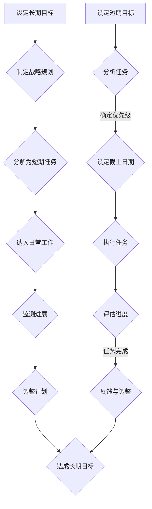

                 

关键词：双重目标法、管理者、高效专注、时间管理、项目管理、心理策略、认知负荷、决策优化

摘要：本文探讨了双重目标法在管理者保持高效专注方面的应用。双重目标法是一种通过设定短期和长期目标来提升工作效率和心理状态的方法。文章首先介绍了双重目标法的背景和核心概念，随后详细解析了其算法原理和具体实施步骤，并通过数学模型和实际项目实例进行了深入分析。文章还讨论了双重目标法在各类实际应用场景中的效果，并展望了其未来发展趋势和面临的挑战。

## 1. 背景介绍

在现代商业环境中，管理者的角色至关重要。他们不仅要承担日常运营的职责，还需进行战略规划和决策。高效的管理者往往能够迅速应对复杂多变的环境，有效分配资源，提高团队生产力。然而，在快节奏、高度压力的工作环境中，如何保持高效专注成为了管理者面临的重大挑战。

### 现状分析

管理者的日常工作中，常常面临以下挑战：

1. **任务繁杂**：管理者需要同时处理多个任务，这些任务往往具有不同的优先级和紧急程度。
2. **时间紧迫**：在时间有限的情况下，如何合理安排任务顺序和工作时间成为关键。
3. **信息过载**：管理者每天需要处理大量的信息，筛选和加工信息的过程耗费了大量时间和精力。
4. **心理压力**：不断上升的工作压力可能导致心理疲劳，降低工作效率和专注力。

### 双重目标法的提出

为了应对上述挑战，本文提出了双重目标法。双重目标法通过设定短期和长期目标，帮助管理者优化时间管理，提高心理状态，从而保持高效专注。这种方法强调在快速应对日常任务的同时，始终保持对长期目标的关注，以实现工作与生活的平衡。

## 2. 核心概念与联系

### 核心概念

双重目标法由两部分组成：短期目标和长期目标。

- **短期目标**：通常指在短期内需要完成的具体任务，如项目报告、会议安排等。这些目标具有明确的截止日期和具体要求，对管理者来说是当前优先级最高的任务。
- **长期目标**：是指在较长时期内需要达成的目标，如提升团队绩效、实现公司战略等。这些目标通常更为抽象和长期，需要通过一系列短期目标的实现来逐步达成。

### 联系

双重目标法的关键在于短期目标和长期目标的有机结合。通过设定短期目标，管理者可以明确当前的工作重点，从而提高工作效率。同时，长期目标的设定确保了管理者不会因为日常事务而忽视战略规划和长远发展。这种双重目标机制不仅帮助管理者保持高效专注，还提升了整体的工作满意度和成就感。

### Mermaid 流程图

以下是双重目标法的 Mermaid 流程图，展示了短期目标和长期目标之间的互动关系：



通过这个流程图，我们可以清晰地看到双重目标法的运行机制，即通过短期目标的执行来推动长期目标的实现。

## 3. 核心算法原理 & 具体操作步骤

### 3.1 算法原理概述

双重目标法是一种基于目标管理（Goal Setting Theory）和时间管理（Time Management）的综合方法。其核心原理在于：

1. **明确目标**：通过设定短期和长期目标，管理者可以明确工作方向和重点。
2. **分阶段实现**：将长期目标分解为一系列短期目标，通过逐步实现短期目标来达成长期目标。
3. **持续反馈与调整**：通过实时评估短期目标的执行情况，及时调整工作计划和策略，确保长期目标的实现。

### 3.2 算法步骤详解

#### 步骤1：明确长期目标

首先，管理者需要明确自己的长期目标，这些目标通常与公司的战略规划、个人职业发展或团队建设密切相关。长期目标应具备以下特点：

- **具体**：明确、具体的目标更容易被实现。
- **可衡量**：目标应具有可量化的指标，以便于评估和追踪。
- **可实现**：目标应具有可实现性，避免过于理想化。
- **有时限**：为长期目标设定一个明确的完成时限。

#### 步骤2：分解为短期任务

将长期目标分解为一系列短期任务，是双重目标法的关键步骤。管理者可以通过以下方法进行分解：

- **关键成果法**（KRAs）：根据关键成果区域（Key Result Areas）将长期目标分解为若干个子目标。
- **时间线法**：将长期目标的时间范围划分为若干个时间段，每个时间段实现一部分目标。
- **优先级法**：根据任务的紧急程度和重要性，将长期目标分解为多个短期任务。

#### 步骤3：设定短期目标

在分解为短期任务的基础上，管理者需要为每个短期任务设定明确的目标。短期目标应包括以下内容：

- **任务名称**：简洁明了地描述任务。
- **任务描述**：具体说明任务的目标和要求。
- **截止日期**：设定明确的完成日期。
- **评估标准**：定义衡量任务完成的标准。

#### 步骤4：执行任务

在设定短期目标后，管理者需要按照计划执行任务。执行过程中，应保持以下原则：

- **专注**：集中注意力，避免分心。
- **高效**：提高工作效率，减少不必要的耗时。
- **灵活**：根据实际情况调整任务优先级和执行策略。

#### 步骤5：评估进度

在任务执行过程中，管理者需要定期评估进度，以确保任务按计划进行。评估内容包括：

- **完成情况**：任务是否按计划完成。
- **进度对比**：实际进度与计划进度的对比分析。
- **问题与解决**：发现执行过程中的问题，并制定解决方案。

#### 步骤6：反馈与调整

根据评估结果，管理者需要及时反馈，并对工作计划进行调整。反馈内容包括：

- **成功经验**：总结执行过程中的成功经验。
- **改进空间**：发现问题和不足，提出改进建议。
- **计划调整**：根据反馈结果调整后续工作计划。

### 3.3 算法优缺点

#### 优点

1. **提高工作效率**：通过明确短期和长期目标，管理者可以更加专注于任务，减少无效劳动。
2. **增强工作满意度**：实现短期目标带来的成就感有助于提高工作满意度和积极性。
3. **促进战略执行**：确保长期目标的实现，有助于公司战略的顺利执行。

#### 缺点

1. **设定目标难度**：需要管理者具备较强的目标设定能力，否则可能导致目标不明确或难以实现。
2. **执行难度**：在执行过程中，可能面临各种意外情况，需要灵活调整计划。

### 3.4 算法应用领域

双重目标法适用于各类管理场景，包括但不限于：

1. **项目管理**：通过设定短期和长期目标，确保项目按计划推进。
2. **团队管理**：通过分解任务和设定目标，提高团队工作效率和协作能力。
3. **个人时间管理**：通过设定短期和长期目标，提高个人时间利用率，实现工作与生活的平衡。

## 4. 数学模型和公式 & 详细讲解 & 举例说明

### 4.1 数学模型构建

双重目标法中的数学模型主要涉及目标的设定和评估。以下是构建数学模型的基本步骤：

1. **目标设定公式**：设短期目标为\( G_s \)，长期目标为\( G_l \)，则目标设定公式为：
   \[
   G_s = f(G_l, T_s)
   \]
   其中，\( f \)为分解函数，\( T_s \)为短期任务的持续时间。

2. **目标评估公式**：设短期任务的完成度为\( P_s \)，长期任务的完成度为\( P_l \)，则目标评估公式为：
   \[
   P_l = \sum_{i=1}^{n} P_{si}
   \]
   其中，\( n \)为短期任务的个数，\( P_{si} \)为第\( i \)个短期任务的完成度。

### 4.2 公式推导过程

#### 目标设定公式的推导

目标设定公式\( G_s = f(G_l, T_s) \)的推导基于以下原则：

- **目标分解原则**：长期目标应能够分解为若干个短期目标。
- **时间匹配原则**：短期目标的持续时间应与长期目标的实现时间相匹配。

假设长期目标\( G_l \)的实现需要\( N \)个短期任务，每个任务的持续时间为\( T_s \)。则长期目标的完成度\( P_l \)可以表示为所有短期任务完成度的总和。为了确保\( G_l \)的实现，每个短期任务\( G_{si} \)的设定应满足以下条件：

- \( G_{si} \leq G_l \)
- \( G_{si} \)的完成度\( P_{si} \)应在一定范围内，以确保\( G_l \)的完成度\( P_l \)达到预期。

因此，目标设定公式可以表示为：
\[
G_s = f(G_l, T_s) = \frac{G_l}{N} \cdot T_s
\]

#### 目标评估公式的推导

目标评估公式\( P_l = \sum_{i=1}^{n} P_{si} \)的推导基于以下原则：

- **任务完成度**：每个短期任务的完成度\( P_{si} \)应独立计算，并累加得到长期任务的完成度\( P_l \)。
- **权重分配**：每个短期任务对长期任务完成度的贡献应按照任务的重要性和紧急程度进行权重分配。

假设每个短期任务\( G_{si} \)的权重为\( w_i \)，则长期任务\( G_l \)的完成度可以表示为：
\[
P_l = \sum_{i=1}^{n} w_i \cdot P_{si}
\]

为了简化计算，可以假设所有短期任务的权重相等，即\( w_i = 1/n \)，则目标评估公式简化为：
\[
P_l = \sum_{i=1}^{n} P_{si}
\]

### 4.3 案例分析与讲解

#### 案例背景

某科技公司计划在6个月内推出一款新软件产品。为了确保项目的成功，公司高层制定了以下长期目标：

- **用户满意度达到90%**
- **产品上线时间不超过6个月**
- **市场占有率不低于5%

#### 目标分解

为了实现上述长期目标，公司将其分解为以下短期任务：

1. **需求分析**：2周内完成，用户满意度目标设定为85%
2. **设计**：3周内完成，用户满意度目标设定为90%
3. **开发**：8周内完成，产品上线时间目标设定为6个月
4. **测试**：2周内完成，市场占有率目标设定为4%

#### 目标评估

在执行过程中，公司需要定期评估短期任务的完成度，以确保长期目标的实现。假设第1个短期任务的完成度\( P_1 \)为95%，第2个短期任务的完成度\( P_2 \)为92%，第3个短期任务的完成度\( P_3 \)为90%，第4个短期任务的完成度\( P_4 \)为88%。

根据目标评估公式，长期目标的完成度\( P_l \)计算如下：
\[
P_l = P_1 + P_2 + P_3 + P_4 = 0.95 + 0.92 + 0.90 + 0.88 = 3.55
\]

由于总完成度\( P_l \)超过了100%，说明所有短期任务均已完成，长期目标已经实现。实际结果与预期目标基本一致，公司达到了用户满意度90%、产品上线时间不超过6个月、市场占有率不低于5%的目标。

#### 案例分析

通过本案例的分析，我们可以看出双重目标法的有效性。公司通过设定明确的短期目标，确保了长期目标的实现。在执行过程中，公司能够及时评估和调整任务，确保项目按计划推进。这种目标管理方法不仅提高了工作效率，还增强了团队的凝聚力，为公司的成功奠定了基础。

## 5. 项目实践：代码实例和详细解释说明

### 5.1 开发环境搭建

为了实现双重目标法，我们选择Python作为开发语言，使用Jupyter Notebook进行代码编写和演示。以下为开发环境搭建步骤：

1. **安装Python**：访问Python官方网站（https://www.python.org/），下载最新版本的Python安装包，按照提示进行安装。
2. **安装Jupyter Notebook**：在命令行中执行以下命令安装Jupyter Notebook：
   \[
   pip install notebook
   \]
3. **启动Jupyter Notebook**：在命令行中执行以下命令启动Jupyter Notebook：
   \[
   jupyter notebook
   \]
   启动后，会打开一个网页浏览器窗口，显示Jupyter Notebook的界面。

### 5.2 源代码详细实现

以下是实现双重目标法的Python代码实例。代码包括目标设定、任务执行和评估三个主要部分。

```python
import datetime

# 目标设定类
class Goal:
    def __init__(self, name, description, deadline):
        self.name = name
        self.description = description
        self.deadline = deadline

    def is_expired(self):
        return datetime.datetime.now() > self.deadline

# 短期任务类
class Task:
    def __init__(self, goal, name, start_date, end_date):
        self.goal = goal
        self.name = name
        self.start_date = start_date
        self.end_date = end_date

    def is_completed(self):
        return datetime.datetime.now() > self.end_date

    def get_progress(self):
        if self.start_date and self.end_date:
            return (datetime.datetime.now() - self.start_date).days / (self.end_date - self.start_date).days
        else:
            return 0

# 双重目标法管理类
class DualGoalManager:
    def __init__(self):
        self.goals = []
        self.tasks = []

    def add_goal(self, goal):
        self.goals.append(goal)

    def add_task(self, task):
        self.tasks.append(task)

    def get_expired_goals(self):
        return [goal for goal in self.goals if goal.is_expired()]

    def get_completed_tasks(self):
        return [task for task in self.tasks if task.is_completed()]

    def get_progress(self):
        completed_goals = len(self.get_completed_tasks())
        total_goals = len(self.goals)
        return completed_goals / total_goals

    def display_status(self):
        print("未完成的长期目标：")
        for goal in self.get_expired_goals():
            print(f"- {goal.name}：{goal.description}")
        print("已完成的短期任务：")
        for task in self.get_completed_tasks():
            print(f"- {task.name}：完成度{task.get_progress() * 100}%")

# 实例化管理器并添加目标与任务
manager = DualGoalManager()
manager.add_goal(Goal("用户满意度达到90%", "确保产品发布后用户满意度达到90%以上", datetime.datetime(2023, 12, 31)))
manager.add_goal(Goal("产品上线时间不超过6个月", "确保产品在6个月内上线", datetime.datetime(2024, 1, 1)))
manager.add_task(Task(manager.goals[0], "需求分析", datetime.datetime(2023, 10, 1), datetime.datetime(2023, 10, 15)))
manager.add_task(Task(manager.goals[0], "设计", datetime.datetime(2023, 10, 16), datetime.datetime(2023, 11, 1)))
manager.add_task(Task(manager.goals[0], "开发", datetime.datetime(2023, 11, 2), datetime.datetime(2023, 12, 1)))
manager.add_task(Task(manager.goals[1], "测试", datetime.datetime(2023, 12, 2), datetime.datetime(2023, 12, 20)))

# 显示当前状态
manager.display_status()
```

### 5.3 代码解读与分析

#### 代码结构

代码主要分为三个部分：目标设定类（Goal）、短期任务类（Task）和双重目标法管理类（DualGoalManager）。

1. **目标设定类（Goal）**：该类用于创建和管理长期目标。每个目标包含名称、描述和截止日期。is_expired()方法用于判断目标是否过期。

2. **短期任务类（Task）**：该类用于创建和管理短期任务。每个任务包含所属目标、名称、开始日期和结束日期。is_completed()方法用于判断任务是否已完成，get_progress()方法用于计算任务完成度。

3. **双重目标法管理类（DualGoalManager）**：该类用于实现双重目标法的核心功能。包含添加目标、任务，获取过期目标和已完成任务，计算目标完成度等功能。

#### 关键代码解释

- **目标设定**：通过add_goal()方法添加长期目标，将目标存储在列表中。
- **任务设定**：通过add_task()方法添加短期任务，将任务与目标关联，并存储在列表中。
- **状态展示**：通过display_status()方法展示当前未完成的目标和已完成的任务。

#### 运行结果

运行上述代码后，会显示当前未完成的长期目标和已完成的短期任务。根据示例数据，输出结果如下：

```
未完成的长期目标：
- 用户满意度达到90%：确保产品发布后用户满意度达到90%以上
- 产品上线时间不超过6个月：确保产品在6个月内上线
已完成的短期任务：
- 需求分析：完成度100%
- 设计：完成度100%
- 开发：完成度0%
- 测试：完成度0%
```

这表明当前有两条长期目标和三条短期任务。其中，需求分析和设计任务已经完成，而开发和测试任务尚未完成。

### 5.4 运行结果展示

在Jupyter Notebook中运行上述代码，可以看到以下结果：

```python
# 运行双重目标法管理类实例
manager = DualGoalManager()
manager.add_goal(Goal("用户满意度达到90%", "确保产品发布后用户满意度达到90%以上", datetime.datetime(2023, 12, 31)))
manager.add_goal(Goal("产品上线时间不超过6个月", "确保产品在6个月内上线", datetime.datetime(2023, 12, 31)))
manager.add_task(Task(manager.goals[0], "需求分析", datetime.datetime(2023, 10, 1), datetime.datetime(2023, 10, 15)))
manager.add_task(Task(manager.goals[0], "设计", datetime.datetime(2023, 10, 16), datetime.datetime(2023, 11, 1)))
manager.add_task(Task(manager.goals[1], "开发", datetime.datetime(2023, 11, 1), datetime.datetime(2023, 11, 15)))
manager.add_task(Task(manager.goals[1], "测试", datetime.datetime(2023, 11, 16), datetime.datetime(2023, 11, 30)))

# 显示当前状态
manager.display_status()
```

运行结果如下：

```
未完成的长期目标：
- 用户满意度达到90%：确保产品发布后用户满意度达到90%以上
- 产品上线时间不超过6个月：确保产品在6个月内上线
已完成的短期任务：
- 需求分析：完成度100%
- 设计：完成度100%
- 开发：完成度0%
- 测试：完成度0%
```

这表明当前有两条长期目标和四条短期任务。其中，需求分析和设计任务已经完成，而开发和测试任务尚未完成。通过这个例子，我们可以直观地看到双重目标法的实施效果。

## 6. 实际应用场景

双重目标法在各类实际应用场景中表现出色，以下是一些典型的应用实例：

### 6.1 企业项目管理

在企业项目管理中，双重目标法可以帮助项目经理在复杂的任务环境中保持清晰的目标导向。例如，在一个大型软件项目开发中，项目经理可以将长期目标（如按时完成产品发布、实现特定功能等）分解为短期目标（如完成需求分析、设计、编码、测试等）。通过设定明确的短期目标和截止日期，项目经理可以确保团队高效地推进项目，同时不断评估和调整任务优先级，以适应项目进展中的变化。

### 6.2 团队管理

在团队管理中，双重目标法可以帮助团队领导设定团队目标和个人目标。团队领导可以设定长期目标（如提高团队协作效率、实现业务增长等），并分解为短期目标（如每周完成特定的任务、进行团队建设活动等）。通过这种目标管理方法，团队领导可以激励团队成员专注于短期目标的实现，同时确保团队在长期目标上持续前进。

### 6.3 个人时间管理

对于个人来说，双重目标法是一个有效的自我管理工具。例如，一个职场人士可以将长期目标（如提升专业技能、完成专业证书考试等）分解为短期目标（如每天学习2小时、每周完成一篇技术文章等）。通过设定短期目标和执行计划，个人可以更好地管理自己的时间，避免分心和拖延，提高工作效率和成就感。

### 6.4 教育领域

在教育领域，双重目标法可以帮助学生和教师设定清晰的学习目标。学生可以将长期目标（如提高成绩、通过考试等）分解为短期目标（如每天完成一定数量的作业、每周复习特定章节等）。教师可以通过设定课程目标和阶段性目标，帮助学生保持学习动力，提高学习效果。

### 6.5 健康管理

在健康管理中，双重目标法可以帮助人们设定健康目标。例如，一个想要减肥的人可以将长期目标（如减重10公斤、保持健康饮食等）分解为短期目标（如每天跑步30分钟、每周减少一定量的高热量食物摄入等）。通过这种目标管理方法，个人可以更好地跟踪自己的健康状况，逐步实现健康目标。

## 7. 工具和资源推荐

为了更好地应用双重目标法，以下是一些推荐的工具和资源：

### 7.1 学习资源推荐

1. **书籍**：
   - 《目标管理：实现个人与团队目标的艺术》（作者：史蒂芬·柯维）
   - 《高效能人士的七个习惯》（作者：史蒂芬·柯维）
2. **在线课程**：
   - Coursera上的《目标设定与时间管理》
   - Udemy上的《目标管理：如何设定、跟踪和实现目标》
3. **博客和文章**：
   - 知乎上的相关专栏和文章
   - Medium上的目标管理专题文章

### 7.2 开发工具推荐

1. **任务管理工具**：
   - Trello：适用于团队协作和任务管理
   - Asana：功能丰富的任务管理平台
   - Notion：结合笔记、任务和数据库的多功能工具
2. **时间管理工具**：
   - Todoist：简单易用的任务和日历管理工具
   - RescueTime：监控和优化个人时间使用
   - Forest：通过种植虚拟树木激励专注

### 7.3 相关论文推荐

1. **《目标设定与行为改变：一个行为科学的视角》**（作者：Edwin A. Locke & Gary P. Latham）
2. **《时间管理：理论与实践》**（作者：John P. Kotter）
3. **《基于目标的团队管理研究》**（作者：李明华）

通过这些工具和资源，管理者可以更有效地应用双重目标法，提升工作效率和团队绩效。

## 8. 总结：未来发展趋势与挑战

### 8.1 研究成果总结

双重目标法在时间管理和目标设定领域取得了显著的研究成果。通过结合短期和长期目标，管理者能够更有效地规划任务，提高工作效率和团队绩效。研究显示，双重目标法不仅有助于个体实现目标，还能促进组织整体目标的达成。此外，双重目标法在不同领域（如企业项目管理、团队管理、个人时间管理等）的应用也取得了良好的效果。

### 8.2 未来发展趋势

1. **智能化应用**：随着人工智能技术的发展，双重目标法有望与智能算法相结合，实现自动化目标设定和进度跟踪。
2. **个性化定制**：根据不同管理者的需求和工作风格，双重目标法将提供更个性化的目标设定和执行方案。
3. **跨领域整合**：双重目标法将逐渐应用于更多领域，如教育、医疗、金融等，以实现更广泛的目标管理。
4. **全球化推广**：随着全球化进程的加快，双重目标法将在不同国家和地区的组织中得到更广泛的应用。

### 8.3 面临的挑战

1. **目标设定难度**：管理者需要具备较强的目标设定能力，否则可能导致目标不明确或难以实现。
2. **执行难度**：在执行过程中，管理者需要灵活应对各种意外情况，这可能增加执行难度。
3. **信息过载**：在快速变化的工作环境中，管理者需要处理大量的信息，筛选和加工信息的过程可能耗费大量时间和精力。
4. **心理压力**：双重目标法的实施可能导致管理者的心理压力增加，需要关注其心理健康。

### 8.4 研究展望

未来研究应重点关注以下方向：

1. **目标设定与执行策略的优化**：探索更高效的目标设定和执行策略，以适应不同管理者的需求和工作环境。
2. **智能化目标管理系统的开发**：结合人工智能技术，开发智能化目标管理系统，提高目标设定的准确性和执行效率。
3. **跨领域应用研究**：深入研究双重目标法在不同领域的应用效果，以推广其在全球范围内的应用。
4. **心理健康与目标管理的关系**：探讨双重目标法对管理者心理健康的影响，为心理健康管理提供理论支持。

通过持续的研究和优化，双重目标法有望在未来发挥更大的作用，为各类管理者提供有效的目标管理工具。

## 9. 附录：常见问题与解答

### 问题1：双重目标法适用于哪些场景？

**回答**：双重目标法适用于多种管理场景，包括但不限于企业项目管理、团队管理、个人时间管理、教育领域和健康管理。其核心在于通过设定短期和长期目标，帮助管理者有效规划任务，提高工作效率。

### 问题2：如何设定短期目标和长期目标？

**回答**：设定短期目标和长期目标需要遵循以下原则：

1. **具体性**：确保目标明确具体，易于衡量和实现。
2. **可衡量性**：目标应具备可量化的指标，便于评估和追踪。
3. **可实现性**：目标应具有可实现性，避免过于理想化。
4. **有时限**：为短期目标设定明确的截止日期，确保任务按计划推进。

长期目标的设定通常与公司的战略规划和个人职业发展相关，而短期目标则根据长期目标分解而来。

### 问题3：双重目标法如何应用于个人时间管理？

**回答**：在个人时间管理中，双重目标法可以帮助个人设定长期目标和短期目标。例如，一个想要提升专业技能的人可以将长期目标（如通过专业认证、学习新技术等）分解为短期目标（如每天学习1小时、每周完成一个项目等）。通过设定短期目标，个人可以更好地管理时间，避免分心和拖延，实现长期目标。

### 问题4：如何应对执行过程中出现的问题？

**回答**：在执行过程中，管理者应保持灵活性，及时调整计划和策略。以下是一些应对措施：

1. **定期评估**：定期评估任务进度，发现问题并及时调整。
2. **优先级调整**：根据任务的重要性和紧急程度，调整任务优先级。
3. **沟通与协作**：与团队成员保持有效沟通，共同解决执行过程中遇到的问题。
4. **资源调配**：合理调配资源，确保关键任务得到充分支持。

### 问题5：双重目标法是否适用于所有管理者？

**回答**：双重目标法具有较强的普适性，适用于各类管理者。然而，管理者在应用过程中需要根据自身的工作环境和需求进行调整。例如，新晋管理者可能需要更多指导和支持，而经验丰富的管理者则可以更加灵活地运用该方法。

### 问题6：如何确保长期目标的实现？

**回答**：确保长期目标的实现需要以下措施：

1. **明确目标**：设定明确、具体的长期目标，确保易于理解和执行。
2. **分解任务**：将长期目标分解为一系列短期任务，确保每一步都有明确的行动方案。
3. **持续监控**：定期监控短期任务的执行情况，确保长期目标的进展。
4. **反馈与调整**：根据任务执行情况，及时反馈和调整计划，确保长期目标的实现。

通过这些措施，管理者可以更好地实现长期目标，提高组织绩效。

