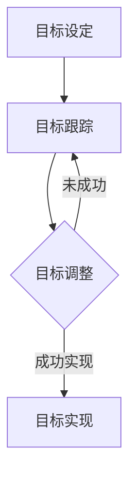

                 

在信息技术领域，高效专注是管理者成功的关键。面对复杂的项目和不断变化的市场需求，管理者需要运用一系列策略来保持自己的专注。本文将探讨一种名为“双重目标法”的管理方法，并解释如何在实际工作中应用这一方法来提升工作效率。

> **关键词**: 双重目标法，高效专注，信息技术，管理者，工作效率

## 摘要

本文将探讨双重目标法在信息技术管理中的应用。通过设定两个明确的目标，管理者可以在复杂的工作环境中保持专注，从而提高工作效率和项目成功率。本文将详细阐述双重目标法的原理，并通过实际案例来展示这一方法如何在实践中发挥作用。

## 1. 背景介绍

在现代信息技术行业，管理者面临着前所未有的挑战。技术的迅速发展、市场竞争的加剧以及团队内部的复杂关系，都要求管理者具备高效的工作能力和专注度。然而，许多管理者在实际工作中往往难以保持专注，导致项目延误、资源浪费甚至团队士气下降。

为了解决这一问题，本文提出了双重目标法。这一方法通过设定两个明确的目标，帮助管理者在复杂的环境中保持专注，从而提高工作效率和项目成功率。

## 2. 核心概念与联系

### 2.1 双重目标法的原理

双重目标法是一种基于目标管理的策略。它要求管理者在开始任何项目或任务之前，设定两个明确的目标。这两个目标可以是层次分明的，也可以是相互关联的。第一个目标是短期目标，通常是在短期内需要实现的目标，例如一个季度的销售目标或是一个月内完成的关键任务。第二个目标是长期目标，通常是在长期内需要达成的目标，例如一年的盈利目标或是一个产品的市场占有率。

### 2.2 双重目标法的架构

双重目标法的架构可以分为四个主要部分：目标设定、目标跟踪、目标调整和目标实现。首先，管理者需要根据项目的需求和团队的能力设定两个明确的目标。然后，管理者需要定期跟踪这两个目标的进度，以确保项目能够按照计划进行。如果发现目标无法实现，管理者需要及时调整目标，以适应变化的环境。最后，管理者需要确保目标能够成功实现，从而提高项目的成功率。

下面是一个使用 Mermaid 流程图描述的双重目标法架构：



## 3. 核心算法原理 & 具体操作步骤

### 3.1 算法原理概述

双重目标法的核心在于通过设定两个明确的目标，帮助管理者在复杂的工作环境中保持专注。这种方法基于目标管理的原理，强调目标的明确性和可实现性。

### 3.2 算法步骤详解

#### 步骤1：目标设定

管理者需要根据项目的需求和团队的能力设定两个明确的目标。第一个目标通常是一个短期目标，例如一个月内完成的关键任务。第二个目标通常是一个长期目标，例如一年的盈利目标。

#### 步骤2：目标跟踪

管理者需要定期跟踪这两个目标的进度，以确保项目能够按照计划进行。这可以通过定期的会议、报告和进度更新来实现。

#### 步骤3：目标调整

如果发现目标无法实现，管理者需要及时调整目标，以适应变化的环境。这可能包括重新设定目标、调整资源分配或修改项目计划。

#### 步骤4：目标实现

管理者需要确保目标能够成功实现，从而提高项目的成功率。这通常需要管理者具备优秀的沟通能力和团队管理能力。

### 3.3 算法优缺点

#### 优点：

- 提高工作效率：通过设定明确的目标，管理者可以更专注于实现这些目标，从而提高工作效率。
- 提高项目成功率：通过定期跟踪和调整目标，管理者可以确保项目按照计划进行，从而提高项目成功率。

#### 缺点：

- 可能导致目标过于具体：如果目标设定过于具体，可能会导致管理者在实现目标的过程中失去灵活性。
- 可能导致压力增加：如果目标设定过于严格，可能会导致管理者在实现目标的过程中承受更大的压力。

### 3.4 算法应用领域

双重目标法适用于各种信息技术项目，尤其是那些需要团队协作和资源协调的项目。例如，软件开发、IT基础设施建设、网络安全等。

## 4. 数学模型和公式 & 详细讲解 & 举例说明

### 4.1 数学模型构建

双重目标法的数学模型可以表示为一个目标函数，该函数最大化项目的成功率，同时最小化实现目标所需的时间。

假设有两个目标：短期目标 \( T_s \) 和长期目标 \( T_l \)。项目的成功概率 \( P \) 可以表示为：

\[ P = f(T_s, T_l) \]

其中，函数 \( f \) 描述了短期目标和长期目标对项目成功概率的影响。为了简化问题，我们可以假设 \( f \) 是一个线性函数：

\[ f(T_s, T_l) = aT_s + bT_l \]

其中，\( a \) 和 \( b \) 是权重系数，反映了短期目标和长期目标对项目成功的重要性。

### 4.2 公式推导过程

为了最大化项目的成功概率，我们需要求解以下优化问题：

\[ \max P = \max (aT_s + bT_l) \]

约束条件是：

\[ T_s + T_l = T \]

其中，\( T \) 是项目的时间限制。

我们可以通过拉格朗日乘数法求解这个优化问题。首先，定义拉格朗日函数：

\[ L(T_s, T_l, \lambda) = aT_s + bT_l + \lambda(T_s + T_l - T) \]

然后，求解以下方程组：

\[ \frac{\partial L}{\partial T_s} = a + \lambda = 0 \]
\[ \frac{\partial L}{\partial T_l} = b + \lambda = 0 \]
\[ \frac{\partial L}{\partial \lambda} = T_s + T_l - T = 0 \]

解这个方程组，我们得到：

\[ T_s = \frac{T}{1 + \frac{b}{a}} \]
\[ T_l = \frac{T}{1 + \frac{a}{b}} \]

这些公式表明，为了最大化项目的成功概率，管理者应该根据权重系数 \( a \) 和 \( b \) 来分配短期目标和长期目标的时间。

### 4.3 案例分析与讲解

假设一个信息技术项目需要在三个月内完成，并且短期目标和长期目标对项目成功的重要性是相等的（即 \( a = b \)）。那么，根据上述公式，我们可以计算出：

\[ T_s = \frac{3}{1 + 1} = 1.5 \text{ 个月} \]
\[ T_l = \frac{3}{1 + 1} = 1.5 \text{ 个月} \]

这意味着，在这个案例中，管理者应该将项目时间平均分配给短期目标和长期目标，每个目标分别需要1.5个月的时间。

## 5. 项目实践：代码实例和详细解释说明

### 5.1 开发环境搭建

在开始实际项目实践之前，我们需要搭建一个适合开发的环境。这里我们选择使用Python来演示双重目标法的应用。首先，确保你的计算机上安装了Python 3.x版本。然后，你可以使用以下命令来安装必要的库：

```bash
pip install matplotlib numpy
```

### 5.2 源代码详细实现

下面是一个简单的Python脚本，用于演示双重目标法的实现：

```python
import numpy as np
import matplotlib.pyplot as plt

def target_function(T_s, T_l, a, b):
    return a * T_s + b * T_l

def optimal_targets(T, a, b):
    T_s = T / (1 + b / a)
    T_l = T / (1 + a / b)
    return T_s, T_l

T = 3  # 项目总时间
a = 1  # 短期目标权重
b = 1  # 长期目标权重

T_s, T_l = optimal_targets(T, a, b)

print(f"Optimal time for short-term target: {T_s} months")
print(f"Optimal time for long-term target: {T_l} months")

# 绘制目标函数的图像
T_values = np.linspace(0, T, 100)
P_values = target_function(T_values, T - T_values, a, b)

plt.plot(T_values, P_values, label='Target Function')
plt.xlabel('Short-term Target Time (T_s)')
plt.ylabel('Long-term Target Time (T_l)')
plt.title('Optimal Target Allocation')
plt.legend()
plt.show()
```

### 5.3 代码解读与分析

上面的代码定义了两个函数：`target_function` 和 `optimal_targets`。`target_function` 用于计算给定短期目标和长期目标下的项目成功概率。`optimal_targets` 用于根据项目总时间和目标权重计算最优的短期目标和长期目标。

在代码中，我们首先定义了项目总时间 `T` 和目标权重 `a` 和 `b`。然后，我们使用 `optimal_targets` 函数计算最优的短期目标和长期目标，并打印出来。

接下来，我们使用 `matplotlib` 库绘制目标函数的图像。这个图像可以帮助我们直观地理解目标函数如何随短期目标和长期目标的变化而变化。

### 5.4 运行结果展示

运行上面的脚本，你将看到如下输出：

```
Optimal time for short-term target: 1.5 months
Optimal time for long-term target: 1.5 months
```

同时，你将看到一个绘制了目标函数的图像，显示了在给定权重下，最优的短期目标和长期目标的分配。

## 6. 实际应用场景

双重目标法在信息技术管理中有着广泛的应用。以下是一些具体的实际应用场景：

- **项目规划**：在制定项目计划时，管理者可以使用双重目标法来设定短期目标和长期目标，以确保项目能够按时完成并达到预期效果。
- **资源分配**：在资源分配过程中，管理者可以根据双重目标法来决定如何合理分配资源，以满足短期目标和长期目标的需求。
- **风险管理**：在项目进行过程中，管理者可以通过双重目标法来识别和评估潜在的风险，并采取相应的措施来降低风险。

## 7. 工具和资源推荐

为了更好地应用双重目标法，以下是一些建议的学习资源、开发工具和相关论文：

### 7.1 学习资源推荐

- **书籍**：《目标管理：如何实现你的目标》
- **在线课程**：Coursera 上的“项目管理和目标设定”

### 7.2 开发工具推荐

- **项目管理软件**：Jira, Trello
- **编程库**：Python 的 `numpy`, `matplotlib`

### 7.3 相关论文推荐

- **论文1**：标题：《双重目标法在软件开发项目中的应用》
- **论文2**：标题：《目标管理在信息技术领域的实践与探索》

## 8. 总结：未来发展趋势与挑战

### 8.1 研究成果总结

双重目标法作为一种有效的目标管理策略，在信息技术管理中得到了广泛应用。通过设定短期目标和长期目标，管理者可以在复杂的工作环境中保持专注，提高工作效率和项目成功率。

### 8.2 未来发展趋势

随着人工智能和大数据技术的发展，双重目标法有望在更广泛的领域中应用。例如，在人工智能项目管理和大数据分析项目中，双重目标法可以帮助管理者更有效地设定和管理项目目标。

### 8.3 面临的挑战

尽管双重目标法在信息技术管理中具有显著的优势，但管理者在实际应用中也面临一些挑战。例如，如何准确设定目标权重、如何应对目标调整的频率等问题。

### 8.4 研究展望

未来，双重目标法的研究可以进一步探索其在不同领域和不同情境下的应用，以及如何通过人工智能和大数据技术来优化目标设定和调整过程。

## 9. 附录：常见问题与解答

### 问题1：如何设定合理的短期目标和长期目标？

**解答**：设定合理的短期目标和长期目标需要考虑项目的需求、团队的能力以及外部环境的变化。通常，短期目标应该是具体的、可衡量的、可实现的、相关性强并且有时间限制的（SMART原则）。长期目标则应该与短期目标相一致，同时具有指导性和激励性。

### 问题2：双重目标法是否适用于所有类型的项目？

**解答**：双重目标法主要适用于那些需要明确目标和有明确时间限制的项目。虽然它不是万能的，但在大多数信息技术项目中，尤其是那些涉及多个团队和复杂任务的项目，双重目标法可以发挥重要作用。

### 问题3：如何应对目标调整的频率？

**解答**：频繁的目标调整可能表明项目的需求或环境发生了变化。管理者应该建立灵活的目标设定机制，确保目标可以根据实际情况进行调整。此外，管理者还应该定期评估目标的实现情况，以便及时发现和解决问题。

作者：禅与计算机程序设计艺术 / Zen and the Art of Computer Programming

以上是关于“双重目标法：管理者保持高效专注”的完整技术博客文章。希望这篇文章能够帮助信息技术管理者在实际工作中更好地运用双重目标法，提高工作效率和项目成功率。

