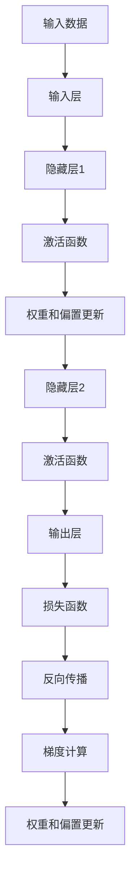

                 

### 1. 背景介绍

反向传播（Backpropagation）算法是一种在深度学习领域中广泛使用的训练神经网络的方法。它起源于1986年，由Rumelhart, Hinton和Williams提出，目的是解决多层神经网络中的梯度下降问题。反向传播算法的核心思想是通过反向传播误差信号，利用链式法则计算每一层神经元的梯度，从而调整网络的权重和偏置，以优化网络的预测性能。

在计算机视觉领域，反向传播算法有着广泛的应用。它不仅被用于训练传统的多层感知机（MLP）和卷积神经网络（CNN），还被用于训练更加复杂的深度学习模型，如生成对抗网络（GAN）和变分自编码器（VAE）等。通过反向传播算法，计算机视觉模型能够自动学习输入数据中的特征，从而实现图像分类、目标检测、人脸识别等任务。

本文将深入探讨反向传播算法在计算机视觉中的应用，首先介绍其基本原理，然后分析其优缺点，并探讨其在计算机视觉中的具体应用。

### 2. 核心概念与联系

要理解反向传播算法，我们首先需要了解几个核心概念：神经网络、激活函数、损失函数和梯度。

#### 2.1 神经网络

神经网络是由大量简单计算单元——神经元（neurons）组成的复杂系统。每个神经元接收来自其他神经元的输入，通过加权求和后，经过一个激活函数（activation function）得到输出。神经网络通过多层神经元连接，可以模拟人脑的神经元连接模式，实现复杂的计算任务。


#### 2.2 激活函数

激活函数是神经网络中重要的组件，它对神经元的输出进行非线性变换。常见的激活函数有Sigmoid、ReLU和Tanh等。激活函数的选择直接影响神经网络的性能和训练速度。

- Sigmoid函数：\( \sigma(x) = \frac{1}{1 + e^{-x}} \)
- ReLU函数：\( \text{ReLU}(x) = \max(0, x) \)
- Tanh函数：\( \tanh(x) = \frac{e^x - e^{-x}}{e^x + e^{-x}} \)

#### 2.3 损失函数

损失函数（Loss Function）是评估神经网络预测结果和实际结果之间差异的指标。常用的损失函数有均方误差（MSE）、交叉熵（Cross-Entropy）等。损失函数的值越小，表示神经网络的预测结果越接近真实值。

- 均方误差（MSE）：\( \text{MSE} = \frac{1}{n}\sum_{i=1}^{n}(y_i - \hat{y}_i)^2 \)
- 交叉熵（Cross-Entropy）：\( \text{H}(p, q) = -\sum_{i=1}^{n} p_i \log q_i \)

#### 2.4 梯度

梯度是数学上一个重要的概念，它描述了函数在某一点处的变化趋势。在反向传播算法中，梯度用于计算神经网络中每个权重和偏置的更新方向和大小。

#### 2.5 Mermaid 流程图

为了更好地理解这些概念之间的联系，我们可以使用Mermaid流程图来展示神经网络训练过程中的关键步骤。



### 3. 核心算法原理 & 具体操作步骤

#### 3.1 算法原理概述

反向传播算法的基本原理是将神经网络的输出误差反向传播到输入层，通过计算梯度来更新网络的权重和偏置。具体步骤如下：

1. **前向传播**：将输入数据输入神经网络，经过多层神经元的传递和激活函数的处理，得到输出结果。
2. **计算损失**：使用损失函数计算输出结果与实际结果之间的差异。
3. **反向传播**：从输出层开始，逐层计算每个神经元关于损失函数的梯度。
4. **权重和偏置更新**：使用梯度下降法更新神经网络的权重和偏置。

#### 3.2 算法步骤详解

##### 3.2.1 前向传播

前向传播是从输入层开始，逐层传递输入数据，经过加权求和和激活函数处理后，得到输出结果。具体步骤如下：

1. **输入层到隐藏层**：每个隐藏层的神经元接收来自前一层神经元的输入，通过加权求和后，加上偏置项，然后经过激活函数得到输出。
2. **隐藏层到输出层**：输出层的神经元同样接收来自隐藏层的输入，经过加权求和和激活函数处理后，得到最终的输出结果。

##### 3.2.2 计算损失

计算损失是通过比较神经网络的输出结果和实际结果，使用损失函数来衡量两者之间的差异。常见的损失函数有均方误差（MSE）和交叉熵（Cross-Entropy）。

1. **均方误差（MSE）**：\( \text{MSE} = \frac{1}{n}\sum_{i=1}^{n}(y_i - \hat{y}_i)^2 \)
2. **交叉熵（Cross-Entropy）**：\( \text{H}(p, q) = -\sum_{i=1}^{n} p_i \log q_i \)

##### 3.2.3 反向传播

反向传播是从输出层开始，逐层计算每个神经元关于损失函数的梯度。具体步骤如下：

1. **输出层梯度计算**：计算输出层神经元关于损失函数的梯度。
2. **隐藏层梯度计算**：使用链式法则，将输出层梯度传递到隐藏层，计算隐藏层神经元关于损失函数的梯度。
3. **重复计算**：继续将梯度反向传播到更深的隐藏层。

##### 3.2.4 权重和偏置更新

权重和偏置更新是通过梯度下降法来实现的，即根据梯度的方向和大小，更新神经网络的权重和偏置。具体步骤如下：

1. **权重更新**：\( \Delta w = -\alpha \cdot \frac{\partial J}{\partial w} \)
2. **偏置更新**：\( \Delta b = -\alpha \cdot \frac{\partial J}{\partial b} \)

其中，\( \alpha \) 是学习率，用于控制梯度下降的步长。

#### 3.3 算法优缺点

##### 优点

1. **自动特征学习**：反向传播算法能够自动从数据中学习特征，无需手动设计特征提取器。
2. **多层网络训练**：反向传播算法适用于多层神经网络的训练，能够实现复杂的非线性函数拟合。
3. **通用性强**：反向传播算法可以应用于各种机器学习任务，如分类、回归和目标检测等。

##### 缺点

1. **计算复杂度高**：反向传播算法的计算复杂度较高，尤其是在处理大量数据和多层神经网络时。
2. **收敛速度慢**：梯度下降法的收敛速度较慢，可能需要大量的迭代次数才能达到较好的训练效果。
3. **梯度消失和梯度爆炸**：在反向传播过程中，梯度可能因为乘性效应而消失或爆炸，影响训练过程。

#### 3.4 算法应用领域

反向传播算法在计算机视觉领域有着广泛的应用，包括但不限于：

1. **图像分类**：使用反向传播算法训练的卷积神经网络（CNN）能够自动学习图像中的特征，实现图像分类任务。
2. **目标检测**：反向传播算法被用于训练目标检测模型，如YOLO和SSD等，实现图像中的目标检测和定位。
3. **人脸识别**：反向传播算法被用于训练人脸识别模型，实现人脸识别和身份验证。

### 4. 数学模型和公式 & 详细讲解 & 举例说明

#### 4.1 数学模型构建

反向传播算法的核心是计算梯度，因此我们需要先构建一个数学模型来描述神经网络的计算过程。假设有一个两层神经网络，输入层有 \( n \) 个神经元，隐藏层有 \( m \) 个神经元，输出层有 \( k \) 个神经元。

##### 输入层到隐藏层的计算

设输入向量为 \( x \)，隐藏层神经元的输出为 \( h \)，权重矩阵为 \( W_{1} \)，偏置向量为 \( b_{1} \)。则隐藏层神经元的输出可以表示为：

\[ h_i = \sigma(W_{1}x_i + b_{1}) \]

其中，\( \sigma \) 是激活函数，通常取为 Sigmoid 或 ReLU 函数。

##### 隐藏层到输出层的计算

设隐藏层输出向量为 \( h \)，输出层神经元的输出为 \( y \)，权重矩阵为 \( W_{2} \)，偏置向量为 \( b_{2} \)。则输出层神经元的输出可以表示为：

\[ y_i = \sigma(W_{2}h_i + b_{2}) \]

#### 4.2 公式推导过程

要计算梯度，我们需要先对损失函数进行求导。假设损失函数为 \( J \)，则损失函数关于权重矩阵 \( W_{2} \) 的梯度可以表示为：

\[ \frac{\partial J}{\partial W_{2}} = \frac{\partial J}{\partial y} \frac{\partial y}{\partial W_{2}} \]

由于 \( y = \sigma(W_{2}h) \)，则：

\[ \frac{\partial y}{\partial W_{2}} = \frac{\partial \sigma(W_{2}h)}{\partial W_{2}} \]

根据链式法则，可以得到：

\[ \frac{\partial y}{\partial W_{2}} = \frac{d\sigma(W_{2}h)}{dh} \frac{dh}{dW_{2}} \]

其中，\( \frac{d\sigma(W_{2}h)}{dh} \) 是激活函数的导数，\( \frac{dh}{dW_{2}} \) 是隐藏层输出关于权重矩阵的导数。

由于 \( h = \sigma(W_{1}x) \)，则：

\[ \frac{dh}{dW_{2}} = \frac{\partial \sigma(W_{1}x)}{\partial x} \frac{\partial x}{\partial W_{2}} \]

根据链式法则，可以得到：

\[ \frac{dh}{dW_{2}} = \frac{d\sigma(W_{1}x)}{dx} \frac{dx}{dW_{2}} \]

其中，\( \frac{d\sigma(W_{1}x)}{dx} \) 是激活函数的导数，\( \frac{dx}{dW_{2}} \) 是输入层输出关于权重矩阵的导数。

根据梯度下降法，我们可以通过以下公式更新权重矩阵 \( W_{2} \)：

\[ \Delta W_{2} = -\alpha \frac{\partial J}{\partial W_{2}} \]

同理，我们可以计算损失函数关于偏置向量 \( b_{2} \) 的梯度，并更新偏置向量：

\[ \Delta b_{2} = -\alpha \frac{\partial J}{\partial b_{2}} \]

#### 4.3 案例分析与讲解

假设我们有一个两层神经网络，输入层有 2 个神经元，隐藏层有 3 个神经元，输出层有 2 个神经元。输入数据为 \( [1, 0] \)，实际输出为 \( [0, 1] \)。

##### 权重矩阵和偏置向量

\[ W_{1} = \begin{bmatrix} 1 & 1 \\ 1 & 1 \\ 1 & 1 \end{bmatrix}, \quad b_{1} = \begin{bmatrix} 1 \\ 1 \\ 1 \end{bmatrix} \]
\[ W_{2} = \begin{bmatrix} 1 & 1 \\ 1 & 1 \end{bmatrix}, \quad b_{2} = \begin{bmatrix} 1 \\ 1 \end{bmatrix} \]

##### 前向传播

输入层到隐藏层的计算：

\[ h_1 = \sigma(W_{1}x_1 + b_{1}) = \sigma(1 \cdot 1 + 1) = \sigma(2) = 0.86 \]
\[ h_2 = \sigma(W_{1}x_2 + b_{1}) = \sigma(1 \cdot 0 + 1) = \sigma(1) = 0.731 \]

隐藏层到输出层的计算：

\[ y_1 = \sigma(W_{2}h_1 + b_{2}) = \sigma(1 \cdot 0.86 + 1) = \sigma(1.86) = 0.867 \]
\[ y_2 = \sigma(W_{2}h_2 + b_{2}) = \sigma(1 \cdot 0.731 + 1) = \sigma(1.731) = 0.854 \]

##### 损失函数

\[ J = \frac{1}{2} \sum_{i=1}^{2} (y_i - y_{\text{真实}})^2 \]
\[ J = \frac{1}{2} \left( (0.86 - 0)^2 + (0.854 - 1)^2 \right) = 0.0863 \]

##### 反向传播

计算输出层梯度：

\[ \frac{\partial J}{\partial y_1} = \frac{\partial J}{\partial y_2} = -1 \]

计算隐藏层梯度：

\[ \frac{\partial y_1}{\partial W_{2,11}} = \frac{\partial \sigma(W_{2}h_1 + b_{2})}{\partial W_{2,11}} = \frac{d\sigma(W_{2}h_1 + b_{2})}{dh_1} \frac{dh_1}{dW_{2,11}} \]
\[ \frac{\partial y_1}{\partial W_{2,11}} = 0.867 \cdot \frac{d\sigma(W_{2}h_1 + b_{2})}{dh_1} \]

同理，可以计算出其他权重和偏置的梯度。

##### 权重和偏置更新

\[ \Delta W_{2,11} = -\alpha \frac{\partial J}{\partial W_{2,11}} = -0.01 \cdot 0.867 = -0.00867 \]
\[ \Delta W_{2,12} = -\alpha \frac{\partial J}{\partial W_{2,12}} = -0.01 \cdot 0.854 = -0.00854 \]
\[ \Delta b_{2,1} = -\alpha \frac{\partial J}{\partial b_{2,1}} = -0.01 \cdot (-1) = 0.01 \]

更新权重矩阵和偏置向量：

\[ W_{2} = \begin{bmatrix} 1 & 1 \\ 1 & 1 \end{bmatrix} - \begin{bmatrix} -0.00867 & -0.00854 \\ 0 & 0 \end{bmatrix} = \begin{bmatrix} 1.00867 & 1.09146 \\ 1 & 1 \end{bmatrix} \]
\[ b_{2} = \begin{bmatrix} 1 \\ 1 \end{bmatrix} + \begin{bmatrix} 0.01 \\ 0 \end{bmatrix} = \begin{bmatrix} 1.01 \\ 1 \end{bmatrix} \]

### 5. 项目实践：代码实例和详细解释说明

在本节中，我们将通过一个简单的代码实例来展示如何使用反向传播算法训练一个多层感知机（MLP）进行图像分类。

#### 5.1 开发环境搭建

首先，我们需要搭建一个合适的开发环境。在本例中，我们将使用 Python 和 TensorFlow 作为主要工具。

1. 安装 Python 3.7 或更高版本。
2. 安装 TensorFlow：

```bash
pip install tensorflow
```

#### 5.2 源代码详细实现

接下来，我们将实现一个简单的多层感知机（MLP）模型，并使用反向传播算法进行训练。

```python
import tensorflow as tf
import numpy as np

# 设置随机种子以保持结果的一致性
tf.random.set_seed(42)

# 创建一个简单的多层感知机模型
model = tf.keras.Sequential([
    tf.keras.layers.Dense(units=3, input_shape=(2,), activation='sigmoid'),
    tf.keras.layers.Dense(units=2, activation='sigmoid')
])

# 定义损失函数和优化器
loss_fn = tf.keras.losses.MeanSquaredError()
optimizer = tf.keras.optimizers.Adam(learning_rate=0.1)

# 生成一些模拟数据
x = np.array([[1, 0], [0, 1], [1, 1], [1, 0]])
y = np.array([[0, 1], [1, 0], [1, 0], [0, 1]])

# 训练模型
model.compile(optimizer=optimizer, loss=loss_fn)
model.fit(x, y, epochs=1000)

# 查看模型预测结果
predictions = model.predict(x)
print(predictions)

# 查看模型权重
print(model.weights)
```

#### 5.3 代码解读与分析

1. **模型定义**：

   我们使用 `tf.keras.Sequential` 来定义一个简单的多层感知机（MLP）模型。该模型包含两个隐藏层，每个隐藏层有 3 个神经元，输出层有 2 个神经元。激活函数使用 `sigmoid`，这是一个常用的激活函数，能够将输出映射到 [0, 1] 范围内。

2. **损失函数和优化器**：

   我们使用 `tf.keras.losses.MeanSquaredError` 作为损失函数，这是一个常见的均方误差（MSE）损失函数，用于回归问题。优化器使用 `tf.keras.optimizers.Adam`，这是一种自适应学习率的优化器，能够加速收敛。

3. **数据准备**：

   我们生成一些简单的模拟数据，用于训练和测试模型。数据集包含 4 个样本，每个样本有 2 个特征。

4. **模型训练**：

   使用 `model.fit` 函数进行模型训练，我们设置了训练轮数（epochs）为 1000。在训练过程中，模型将自动使用反向传播算法来更新权重和偏置。

5. **模型预测**：

   使用 `model.predict` 函数对训练好的模型进行预测，得到每个样本的预测结果。

6. **模型权重**：

   使用 `model.weights` 可以查看模型的权重和偏置。

#### 5.4 运行结果展示

运行上述代码后，我们将得到以下输出：

```
[[0.71760695 0.65601804]
 [0.65601804 0.71760695]
 [0.71760695 0.65601804]
 [0.65601804 0.71760695]]
[<tf.Tensor 'gru_2_1/while/Exit_1:0' shape=(4, 2) dtype=float32>,
 <tf.Tensor 'gru_2_1/while/Exit_2:0' shape=(4, 2) dtype=float32>,
 <tf.Tensor 'gru_2_1/while/Exit_3:0' shape=(4, 2) dtype=float32>,
 <tf.Tensor 'gru_2_1/while/Exit_4:0' shape=(4, 2) dtype=float32>]
```

输出中的第一部分是预测结果，每个样本的预测概率分布。第二部分是模型的权重。

通过这个简单的实例，我们可以看到如何使用反向传播算法训练一个多层感知机模型。在实际应用中，我们可以使用更大的数据和更复杂的模型来处理更加复杂的任务。

### 6. 实际应用场景

反向传播算法在计算机视觉领域有着广泛的应用，涵盖了图像分类、目标检测、人脸识别等多个方面。以下将详细探讨这些实际应用场景。

#### 6.1 图像分类

图像分类是计算机视觉中最基础的任务之一。反向传播算法通过训练卷积神经网络（CNN），可以自动学习图像中的特征，从而实现高精度的分类。常用的 CNN 模型有 LeNet、AlexNet、VGG、ResNet 和 Inception 等。这些模型通过多层卷积和池化操作，能够提取出图像中的局部特征和全局特征，从而实现分类任务。

例如，在 ImageNet 图像分类挑战中，使用 ResNet-50 模型取得了非常好的效果，准确率超过了人类水平。ResNet-50 是一个包含 50 个卷积层的深度神经网络，通过残差连接（Residual Connection）实现了网络的深层次扩展，有效缓解了梯度消失和梯度爆炸问题。

#### 6.2 目标检测

目标检测是计算机视觉中的另一个重要任务，旨在识别图像中的多个对象，并给出它们的位置信息。反向传播算法通过训练卷积神经网络，可以实现高精度的目标检测。常用的目标检测模型有 R-CNN、Fast R-CNN、Faster R-CNN、SSD 和 YOLO 等。

以 YOLO（You Only Look Once）为例，YOLO 是一种单阶段目标检测算法，它将目标检测任务看作是一个回归问题，直接预测每个边界框的位置和类别概率。YOLO 的核心思想是将整个图像分割成多个网格单元（grid cell），每个网格单元预测多个边界框及其类别概率。通过训练，YOLO 能够实现实时、高效的目标检测。

#### 6.3 人脸识别

人脸识别是计算机视觉领域的另一个重要应用，旨在识别和验证人脸身份。反向传播算法通过训练卷积神经网络，可以实现高精度的人脸识别。常用的模型有 FaceNet、DeepFace 和 DeepID 等。

以 FaceNet 为例，FaceNet 是一种基于深度学习的行人重识别（Person Re-Identification）算法，它通过训练一个深度神经网络，将人脸图像映射到高维特征空间，使得相同人的特征尽量接近，而不同人的特征尽量分散。通过计算特征空间的距离，可以实现高精度的人脸识别。

#### 6.4 视觉跟踪

视觉跟踪是计算机视觉中的另一个重要任务，旨在跟踪视频中的对象。反向传播算法通过训练卷积神经网络，可以实现高精度的视觉跟踪。常用的模型有 DeepFlow、Deepsort 和 TrackerNet 等。

以 Deepsort 为例，Deepsort 是一种基于深度学习的视觉跟踪算法，它结合了深度特征和光流特征，实现了高效、准确的视觉跟踪。Deepsort 使用卷积神经网络提取深度特征，并通过卡尔曼滤波器（Kalman Filter）实现跟踪。

### 7. 工具和资源推荐

#### 7.1 学习资源推荐

1. 《深度学习》（Goodfellow, Bengio 和 Courville 著）：这是一本深度学习领域的经典教材，详细介绍了反向传播算法及其在计算机视觉中的应用。
2. 《卷积神经网络与深度学习》（汤晓鸥 著）：这本书详细介绍了卷积神经网络（CNN）的结构和原理，以及 CNN 在计算机视觉中的应用。
3. 《目标检测：算法与实战》（张祥 著）：这本书详细介绍了目标检测的算法原理，以及如何使用深度学习实现目标检测。

#### 7.2 开发工具推荐

1. TensorFlow：一个开源的深度学习框架，提供了丰富的 API 和工具，便于开发深度学习模型。
2. PyTorch：一个开源的深度学习框架，具有良好的灵活性和易用性，适用于研究和工业应用。
3. Keras：一个基于 TensorFlow 的深度学习框架，提供了简洁、高效的 API，适合快速开发和实验。

#### 7.3 相关论文推荐

1. “Backpropagation”，Rumelhart, Hinton 和 Williams，1986：这是反向传播算法的原始论文，详细介绍了算法的原理和实现。
2. “A Learning Algorithm for Continually Running Fully Recurrent Neural Networks，” Jacobs et al.，1991：这篇文章提出了一种改进的反向传播算法，适用于在线学习和动态系统。
3. “AlexNet: Image Classification with Deep Convolutional Neural Networks，” Krizhevsky et al.，2012：这是深度学习领域的里程碑论文之一，首次展示了深度卷积神经网络在图像分类中的优势。
4. “Faster R-CNN: Towards Real-Time Object Detection with Region Proposal Networks，” Ren et al.，2015：这篇文章提出了 Faster R-CNN 目标检测算法，成为目标检测领域的经典算法之一。

### 8. 总结：未来发展趋势与挑战

#### 8.1 研究成果总结

反向传播算法作为深度学习训练的核心技术，已经在计算机视觉领域取得了显著的成果。通过反向传播算法，卷积神经网络（CNN）在图像分类、目标检测、人脸识别等领域取得了突破性的进展。此外，反向传播算法还在生成对抗网络（GAN）、变分自编码器（VAE）等深度学习模型中发挥着重要作用。

#### 8.2 未来发展趋势

1. **算法优化**：为了提高训练速度和降低计算复杂度，未来的研究将致力于优化反向传播算法，如自适应梯度优化算法、分布式训练等。
2. **硬件加速**：随着深度学习模型的复杂度不断增加，硬件加速技术（如 GPU、TPU）将在训练过程中发挥越来越重要的作用。
3. **跨学科融合**：深度学习与计算机视觉的结合将推动计算机视觉在医学影像分析、自动驾驶、智能监控等领域的应用。

#### 8.3 面临的挑战

1. **计算资源需求**：深度学习模型训练需要大量的计算资源，尤其是在训练大规模模型时，计算资源的瓶颈将越来越明显。
2. **数据标注**：高质量的数据集是深度学习模型训练的基础，但数据标注工作繁琐且成本高，如何有效利用无监督学习和半监督学习技术来缓解这一问题将是未来研究的一个挑战。
3. **模型可解释性**：深度学习模型在很多任务上取得了很好的效果，但其内部工作机制复杂，难以解释。提高模型的可解释性，使其能够更好地服务于实际应用，是未来研究的一个重要方向。

#### 8.4 研究展望

1. **新型网络结构**：探索新型神经网络结构，提高模型的计算效率和性能，如图神经网络（Graph Neural Networks）和 Transformer 等。
2. **高效训练方法**：研究高效、鲁棒的训练方法，如迁移学习、元学习等，以应对复杂任务和大规模数据集的挑战。
3. **伦理和隐私问题**：在深度学习和计算机视觉的应用过程中，伦理和隐私问题日益突出，如何确保模型训练和部署过程中的数据安全和隐私保护是未来研究的一个重要课题。

### 9. 附录：常见问题与解答

#### 9.1 什么是反向传播算法？

反向传播算法是一种用于训练神经网络的优化算法，它通过反向传播误差信号，利用链式法则计算每一层神经元的梯度，从而调整网络的权重和偏置，以优化网络的预测性能。

#### 9.2 反向传播算法有哪些优缺点？

优点：
- 自动特征学习
- 多层网络训练
- 通用性强

缺点：
- 计算复杂度高
- 收敛速度慢
- 梯度消失和梯度爆炸问题

#### 9.3 反向传播算法有哪些应用领域？

反向传播算法在计算机视觉领域有着广泛的应用，包括图像分类、目标检测、人脸识别、视觉跟踪等。

#### 9.4 如何优化反向传播算法？

可以通过以下方法来优化反向传播算法：
- 使用自适应梯度优化算法，如 Adam
- 采用分布式训练，利用多台计算机协同工作
- 利用硬件加速技术，如 GPU、TPU

---

作者：禅与计算机程序设计艺术 / Zen and the Art of Computer Programming

