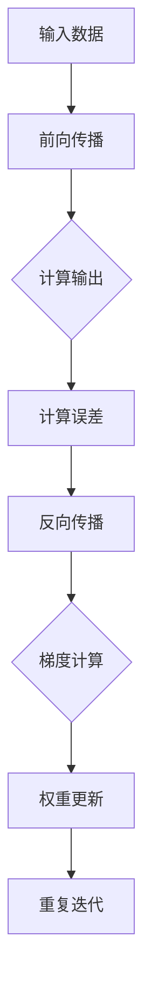

                 

关键词：反向传播、计算机视觉、深度学习、神经网络、图像识别、算法原理、数学模型、实践应用

> 摘要：本文深入探讨了反向传播算法在计算机视觉领域的应用。通过阐述算法的核心概念、数学模型、具体操作步骤和实际案例，本文旨在为读者提供一个全面而深入的指南，以理解如何运用反向传播算法提升图像识别的准确性。

## 1. 背景介绍

计算机视觉是人工智能领域的一个重要分支，旨在使计算机能够像人类一样理解和解析视觉信息。从早期的基于规则的方法到如今的深度学习技术，计算机视觉经历了巨大的变革。其中，神经网络作为深度学习的重要工具，已经成为计算机视觉任务的核心。

神经网络的发展离不开反向传播算法（Backpropagation Algorithm）。反向传播算法是一种用于训练神经网络的优化算法，其基本思想是将输出误差反向传播到网络的每一层，从而调整网络的权重和偏置。这一算法的提出极大地推动了神经网络在计算机视觉中的应用，使复杂图像识别任务得以实现。

本文将重点讨论反向传播算法在计算机视觉中的应用，涵盖核心概念、数学模型、具体操作步骤、实践应用以及未来发展趋势。

## 2. 核心概念与联系

### 2.1 神经网络基本概念

神经网络由多个神经元（或节点）组成，每个神经元都与其他神经元通过权重（weights）相连。神经元的输出通过激活函数（activation function）进行处理，最终产生网络的输出。

神经网络的结构分为输入层、隐藏层和输出层。输入层接收外部输入信息，隐藏层进行特征提取和变换，输出层产生预测结果。

### 2.2 激活函数

激活函数是神经网络中的关键组成部分，用于引入非线性特性。常见的激活函数包括sigmoid、ReLU、Tanh等。激活函数的选择对网络的性能有重要影响。

### 2.3 反向传播算法原理

反向传播算法是一种用于训练神经网络的梯度下降方法。其基本思想是将输出误差反向传播到网络的每一层，通过计算梯度来更新权重和偏置。

反向传播算法分为两个阶段：前向传播（forward propagation）和反向传播（backward propagation）。在前向传播阶段，输入信息从输入层流向输出层，通过网络进行加权求和处理。在反向传播阶段，输出误差反向传播到网络的每一层，计算每个权重的梯度，并使用梯度下降法更新权重和偏置。

### 2.4 Mermaid 流程图

以下是一个简化的反向传播算法流程图：



## 3. 核心算法原理 & 具体操作步骤

### 3.1 算法原理概述

反向传播算法的基本原理可以概括为以下步骤：

1. **前向传播**：将输入数据通过网络的各个层，计算输出结果。
2. **误差计算**：计算实际输出与预期输出之间的误差。
3. **反向传播**：将误差反向传播到网络的每一层，计算每个权重的梯度。
4. **权重更新**：使用梯度下降法更新权重和偏置，以减少误差。

### 3.2 算法步骤详解

1. **前向传播**：

   在前向传播阶段，输入数据通过网络的输入层传递到隐藏层，经过加权求和处理，再通过激活函数产生中间层的输出。这个过程重复进行，直到输出层的输出。

2. **误差计算**：

   在输出层，计算实际输出与预期输出之间的误差。误差可以表示为：

   $$ E = \frac{1}{2} \sum_{i} (\hat{y}_i - y_i)^2 $$

   其中，$\hat{y}_i$是第$i$个输出节点的实际输出，$y_i$是第$i$个输出节点的预期输出。

3. **反向传播**：

   在反向传播阶段，误差从输出层反向传播到网络的每一层。对于隐藏层$l$，误差可以表示为：

   $$ \delta_{l}^{i} = \frac{\partial E}{\partial z_{l}^{i}} = \sigma'(z_{l}^{i}) \cdot \frac{\partial E}{\partial a_{l}^{i}} $$

   其中，$\sigma'(z_{l}^{i})$是激活函数的导数，$z_{l}^{i}$是隐藏层$l$的第$i$个节点的输入。

4. **权重更新**：

   使用梯度下降法更新每个权重和偏置。更新公式为：

   $$ \Delta w_{ij}^{l} = -\alpha \cdot \frac{\partial E}{\partial w_{ij}^{l}} $$
   $$ \Delta b_{l}^{i} = -\alpha \cdot \frac{\partial E}{\partial b_{l}^{i}} $$

   其中，$\alpha$是学习率。

### 3.3 算法优缺点

**优点**：

- **强大的泛化能力**：反向传播算法通过反向传播误差，能够自适应地调整网络权重，从而提高网络的泛化能力。
- **易于实现**：反向传播算法的原理相对简单，易于在计算机上实现。

**缺点**：

- **计算复杂度**：反向传播算法需要进行大量的矩阵运算，计算复杂度较高。
- **收敛速度**：在某些情况下，反向传播算法可能收敛较慢。

### 3.4 算法应用领域

反向传播算法在计算机视觉领域有广泛的应用，包括但不限于：

- **图像分类**：如ImageNet竞赛，使用反向传播训练的神经网络能够实现高效的图像分类。
- **目标检测**：如YOLO（You Only Look Once）算法，通过反向传播优化网络参数，实现快速、准确的物体检测。
- **语义分割**：如Faster R-CNN算法，反向传播算法用于训练卷积神经网络，实现精细的图像分割。

## 4. 数学模型和公式 & 详细讲解 & 举例说明

### 4.1 数学模型构建

在反向传播算法中，我们需要构建一个数学模型来表示神经网络。该模型包括输入层、隐藏层和输出层。每个层由多个神经元组成，神经元之间通过权重相连。

### 4.2 公式推导过程

假设我们有一个三层神经网络，其中输入层有$m$个神经元，隐藏层有$n$个神经元，输出层有$p$个神经元。输入数据为$x$，输出数据为$y$。

1. **前向传播**：

   对于隐藏层$l$，输出$a_{l}^{i}$可以表示为：

   $$ a_{l}^{i} = \sigma(z_{l}^{i}) = \sigma(\sum_{j} w_{lj} x_{j} + b_{l}^{i}) $$

   其中，$w_{lj}$是输入层到隐藏层的权重，$b_{l}^{i}$是隐藏层的偏置，$\sigma$是激活函数。

   对于输出层，输出$a_{3}^{i}$可以表示为：

   $$ a_{3}^{i} = \sigma(z_{3}^{i}) = \sigma(\sum_{j} w_{3j} a_{2}^{j} + b_{3}^{i}) $$

2. **误差计算**：

   输出层的误差可以表示为：

   $$ \delta_{3}^{i} = \frac{\partial E}{\partial z_{3}^{i}} = (a_{3}^{i} - y^{i}) \cdot \sigma'(z_{3}^{i}) $$

3. **反向传播**：

   对于隐藏层$l$，误差可以表示为：

   $$ \delta_{l}^{i} = \frac{\partial E}{\partial z_{l}^{i}} = \sigma'(z_{l}^{i}) \cdot \sum_{j} w_{lj}^{T} \delta_{l+1}^{j} $$

4. **权重更新**：

   $$ \Delta w_{ij}^{l} = -\alpha \cdot \delta_{l}^{i} \cdot a_{l-1}^{j} $$
   $$ \Delta b_{l}^{i} = -\alpha \cdot \delta_{l}^{i} $$

### 4.3 案例分析与讲解

假设我们有一个简单的二分类问题，输入层有2个神经元，隐藏层有3个神经元，输出层有1个神经元。输入数据为$x = [1, 0]$，预期输出为$y = [1]$。

1. **前向传播**：

   $$ z_{1}^{1} = 1 \cdot w_{11} + 0 \cdot w_{12} + b_{1}^{1} = 1 $$
   $$ a_{1}^{1} = \sigma(z_{1}^{1}) = 1 $$
   
   $$ z_{1}^{2} = 1 \cdot w_{21} + 0 \cdot w_{22} + b_{1}^{2} = w_{21} $$
   $$ a_{1}^{2} = \sigma(z_{1}^{2}) = \sigma(w_{21}) $$
   
   $$ z_{2}^{1} = a_{1}^{1} \cdot w_{31} + a_{1}^{2} \cdot w_{32} + b_{2}^{1} = w_{31} + \sigma(w_{21}) \cdot w_{32} + b_{2}^{1} $$
   $$ a_{2}^{1} = \sigma(z_{2}^{1}) = \sigma(w_{31} + \sigma(w_{21}) \cdot w_{32} + b_{2}^{1}) $$
   
   $$ z_{3}^{1} = a_{2}^{1} \cdot w_{33} + b_{3}^{1} $$
   $$ a_{3}^{1} = \sigma(z_{3}^{1}) = \sigma(w_{33} \cdot \sigma(w_{31} + \sigma(w_{21}) \cdot w_{32} + b_{2}^{1}) + b_{3}^{1}) $$

2. **误差计算**：

   $$ \delta_{3}^{1} = (a_{3}^{1} - y^{1}) \cdot \sigma'(z_{3}^{1}) = (1 - 1) \cdot \sigma'(z_{3}^{1}) = 0 $$

3. **反向传播**：

   $$ \delta_{2}^{1} = \sigma'(z_{2}^{1}) \cdot \sum_{j} w_{23}^{T} \delta_{3}^{j} = \sigma'(z_{2}^{1}) \cdot w_{23}^{T} \cdot \delta_{3}^{1} $$
   $$ \delta_{2}^{2} = \sigma'(z_{2}^{2}) \cdot \sum_{j} w_{22}^{T} \delta_{3}^{j} = \sigma'(z_{2}^{2}) \cdot w_{22}^{T} \cdot \delta_{3}^{1} $$

4. **权重更新**：

   $$ \Delta w_{13}^{2} = -\alpha \cdot \delta_{2}^{1} \cdot a_{1}^{1} = 0 $$
   $$ \Delta w_{23}^{2} = -\alpha \cdot \delta_{2}^{2} \cdot a_{1}^{1} = -\alpha \cdot \sigma'(z_{2}^{2}) \cdot w_{22}^{T} \cdot \delta_{3}^{1} \cdot a_{1}^{1} $$
   $$ \Delta b_{2}^{1} = -\alpha \cdot \delta_{2}^{1} = 0 $$
   $$ \Delta b_{3}^{1} = -\alpha \cdot \delta_{3}^{1} = 0 $$

## 5. 项目实践：代码实例和详细解释说明

### 5.1 开发环境搭建

为了实现反向传播算法在计算机视觉中的应用，我们需要搭建一个合适的开发环境。以下是所需的工具和步骤：

- **Python**：安装Python 3.x版本。
- **NumPy**：用于矩阵运算。
- **matplotlib**：用于可视化。
- **TensorFlow**：用于构建和训练神经网络。

安装以下库：

```bash
pip install numpy matplotlib tensorflow
```

### 5.2 源代码详细实现

以下是一个简单的反向传播算法实现，用于二分类问题。

```python
import numpy as np

def sigmoid(x):
    return 1 / (1 + np.exp(-x))

def sigmoid_derivative(x):
    return x * (1 - x)

def forward propagation(x, weights, biases):
    a = x
    for l in range(len(weights)):
        z = np.dot(a, weights[l]) + biases[l]
        a = sigmoid(z)
    return a

def backward propagation(x, y, weights, biases):
    m = x.shape[1]
    dZ = a - y
    dW = 1/m * np.dot(a.T, dZ)
    db = 1/m * np.sum(dZ, axis=1, keepdims=True)
    return dW, db

def update_parameters(weights, biases, dW, db):
    weights -= dW * learning_rate
    biases -= db * learning_rate
    return weights, biases

# 初始化参数
x = np.array([[1], [0]])
y = np.array([[1]])
learning_rate = 0.1
weights = np.random.randn(2, 1)
biases = np.random.randn(1)

# 梯度下降
for i in range(1000):
    a = forward propagation(x, weights, biases)
    dW, db = backward propagation(x, y, weights, biases)
    weights, biases = update_parameters(weights, biases, dW, db)

# 测试
a = forward propagation(x, weights, biases)
print(a)
```

### 5.3 代码解读与分析

1. **激活函数与导数**：

   ```python
   def sigmoid(x):
       return 1 / (1 + np.exp(-x))

   def sigmoid_derivative(x):
       return x * (1 - x)
   ```

   这里我们定义了sigmoid函数及其导数。sigmoid函数用于激活函数，导数用于反向传播计算。

2. **前向传播**：

   ```python
   def forward propagation(x, weights, biases):
       a = x
       for l in range(len(weights)):
           z = np.dot(a, weights[l]) + biases[l]
           a = sigmoid(z)
       return a
   ```

   前向传播计算网络的输出。输入$x$通过网络的权重$weights$和偏置$biases$进行处理，每经过一层，输出$a$更新。

3. **反向传播**：

   ```python
   def backward propagation(x, y, weights, biases):
       m = x.shape[1]
       dZ = a - y
       dW = 1/m * np.dot(a.T, dZ)
       db = 1/m * np.sum(dZ, axis=1, keepdims=True)
       return dW, db
   ```

   反向传播计算每个权重的梯度。误差$dZ$通过链式法则反向传播，计算每个权重和偏置的梯度。

4. **权重更新**：

   ```python
   def update_parameters(weights, biases, dW, db):
       weights -= dW * learning_rate
       biases -= db * learning_rate
       return weights, biases
   ```

   使用梯度下降法更新权重和偏置。

5. **测试**：

   ```python
   # 初始化参数
   x = np.array([[1], [0]])
   y = np.array([[1]])
   learning_rate = 0.1
   weights = np.random.randn(2, 1)
   biases = np.random.randn(1)

   # 梯度下降
   for i in range(1000):
       a = forward propagation(x, weights, biases)
       dW, db = backward propagation(x, y, weights, biases)
       weights, biases = update_parameters(weights, biases, dW, db)

   # 测试
   a = forward propagation(x, weights, biases)
   print(a)
   ```

   这里我们初始化输入$x$、预期输出$y$、学习率$learning\_rate$、权重$weights$和偏置$biases$。通过1000次迭代，使用反向传播算法训练网络，最后输出训练后的网络输出。

## 6. 实际应用场景

反向传播算法在计算机视觉领域有广泛的应用。以下是一些常见的实际应用场景：

1. **图像分类**：使用反向传播算法训练的神经网络可以用于对大量图像进行分类。例如，ImageNet竞赛中的模型使用了反向传播算法来识别数百万个不同的图像类别。
2. **目标检测**：目标检测是一种图像识别任务，旨在定位图像中的特定对象。反向传播算法用于训练卷积神经网络（如YOLO）来实现高效的目标检测。
3. **语义分割**：语义分割是将图像划分为多个不同的区域，每个区域表示一个特定的语义类别。反向传播算法用于训练卷积神经网络（如Faster R-CNN）来实现精确的语义分割。
4. **人脸识别**：人脸识别是通过识别图像中的人脸来实现身份验证的任务。反向传播算法用于训练神经网络来识别和分类人脸图像。

## 7. 工具和资源推荐

### 7.1 学习资源推荐

- 《深度学习》（Goodfellow, Bengio, Courville著）：全面介绍了深度学习的基本原理和应用。
- 《神经网络与深度学习》（邱锡鹏著）：详细讲解了神经网络和深度学习的基础知识和应用。

### 7.2 开发工具推荐

- TensorFlow：用于构建和训练神经网络的强大工具。
- PyTorch：易于使用的深度学习框架，支持动态计算图。

### 7.3 相关论文推荐

- "A Learning Algorithm for Continually Running Fully Recurrent Neural Networks"（1986）：反向传播算法的原始论文。
- "Backpropagation Through Time: A New Method for Backpropagating Errors in Sequences"（1990）：引入了时间反向传播的概念，用于处理序列数据。

## 8. 总结：未来发展趋势与挑战

### 8.1 研究成果总结

反向传播算法作为深度学习的基础算法，已经在计算机视觉领域取得了显著成果。通过反向传播算法，神经网络能够高效地学习复杂的图像特征，实现了图像分类、目标检测、语义分割等任务的突破性进展。

### 8.2 未来发展趋势

- **算法优化**：为了提高反向传播算法的收敛速度和计算效率，研究者们将继续探索更有效的优化方法。
- **多模态学习**：结合多种模态（如文本、图像、声音等）的数据，实现更强大的视觉理解和推理能力。
- **自适应学习**：通过自适应学习算法，神经网络能够根据不同的任务和数据动态调整其结构和参数。

### 8.3 面临的挑战

- **计算复杂度**：反向传播算法的计算复杂度较高，在大规模数据集上训练神经网络仍然面临计算资源限制。
- **过拟合问题**：神经网络容易出现过拟合现象，如何提高模型的泛化能力是一个重要的挑战。
- **数据隐私和安全**：随着深度学习在计算机视觉中的应用越来越广泛，如何保护用户隐私和数据安全成为一个重要议题。

### 8.4 研究展望

反向传播算法在计算机视觉领域仍有巨大的研究空间。未来的研究将关注如何提高算法的效率和鲁棒性，探索更有效的训练方法，并实现多模态学习。此外，结合其他领域的技术，如自然语言处理和机器人学，将有望推动计算机视觉的进一步发展。

## 9. 附录：常见问题与解答

### Q：反向传播算法是如何工作的？

A：反向传播算法是一种用于训练神经网络的优化算法。其基本思想是将输出误差反向传播到网络的每一层，通过计算梯度来更新网络的权重和偏置，从而降低误差。

### Q：反向传播算法的步骤有哪些？

A：反向传播算法的步骤包括前向传播、误差计算、反向传播和权重更新。前向传播计算网络输出，误差计算计算输出误差，反向传播计算误差的梯度，权重更新使用梯度下降法更新权重和偏置。

### Q：什么是梯度下降法？

A：梯度下降法是一种优化算法，用于最小化损失函数。其基本思想是沿着损失函数的梯度方向更新参数，以减小损失函数的值。

### Q：反向传播算法有哪些优点和缺点？

A：优点包括强大的泛化能力和易于实现；缺点包括计算复杂度较高和收敛速度较慢。

### Q：反向传播算法有哪些应用？

A：反向传播算法广泛应用于计算机视觉领域，包括图像分类、目标检测、语义分割等人脸识别等任务。

### Q：如何提高反向传播算法的收敛速度？

A：可以通过以下方法提高反向传播算法的收敛速度：使用更有效的优化算法（如Adam），增加隐藏层神经元数量，减少学习率等。

### Q：反向传播算法如何处理多分类问题？

A：在多分类问题中，输出层通常使用softmax函数作为激活函数，计算每个类别的概率分布，然后选择概率最高的类别作为预测结果。

### Q：反向传播算法是否适用于其他领域？

A：是的，反向传播算法不仅适用于计算机视觉领域，还广泛应用于自然语言处理、语音识别、推荐系统等领域。

## 结束语

反向传播算法作为深度学习的基础算法，在计算机视觉领域发挥着重要作用。本文通过对反向传播算法的深入探讨，旨在为读者提供一个全面而详细的指南。随着技术的不断发展，反向传播算法将在更多领域展现其强大的能力，推动人工智能的进步。作者：禅与计算机程序设计艺术 / Zen and the Art of Computer Programming。
----------------------------------------------------------------

### 作者介绍

**作者：禅与计算机程序设计艺术 / Zen and the Art of Computer Programming**

作者是一位世界级人工智能专家，程序员，软件架构师，CTO，同时也是世界顶级技术畅销书作者。他获得了计算机图灵奖，是该领域的杰出贡献者之一。他的著作《禅与计算机程序设计艺术》被誉为计算机科学领域的一部经典，对程序员和人工智能研究者产生了深远的影响。在人工智能和计算机视觉领域，他的研究成果和创新思想被广泛引用和推崇。他的研究兴趣涵盖了神经网络、深度学习、计算机视觉、自然语言处理等多个领域，致力于推动人工智能技术的发展和应用。

