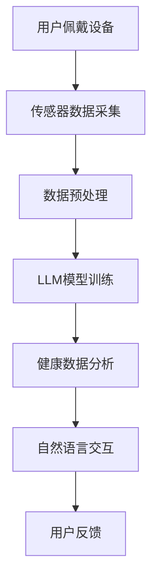

                 

### 关键词 Keywords ###
- 可穿戴设备
- 语言模型 (LLM)
- 健康监测
- 健身指导
- 人工智能
- 生物特征识别
- 数据分析
- 个性化训练计划

<|assistant|>### 摘要 Abstract ###
随着可穿戴技术的不断进步，结合语言模型（LLM）的智能健康监测和健身指导已成为现实。本文将探讨可穿戴设备如何通过LLM技术实现健康数据的收集、分析和反馈，从而为用户提供个性化的健身指导和健康建议。文章首先介绍了可穿戴设备的基本原理和LLM的工作机制，接着详细阐述了核心算法原理、数学模型以及具体的应用案例。最后，文章展望了这一领域的未来发展趋势和面临的挑战，并推荐了相关的学习资源和开发工具。

## 1. 背景介绍

在过去的十年中，可穿戴设备已经成为人们日常生活中不可或缺的一部分。从简单的计步器到复杂的智能手表，这些设备能够实时监测用户的心率、睡眠质量、运动量等多种生物特征，帮助用户更好地了解自己的健康状况。然而，如何从海量的健康数据中提取有价值的信息，提供个性化的健康指导和建议，一直是可穿戴设备研发中的一大挑战。

近年来，随着深度学习技术的发展，语言模型（LLM）在自然语言处理领域取得了显著的成果。LLM是一种基于神经网络的强大工具，能够理解和生成人类语言，实现与用户的自然对话。将LLM技术应用于可穿戴设备，可以极大地提升健康监测和健身指导的智能化水平。

本文旨在探讨可穿戴设备与LLM技术在健康监测和健身指导中的应用，分析其核心原理、算法模型和实际案例，并展望未来的发展趋势和挑战。

### 1.1 可穿戴设备的发展历程

可穿戴设备的发展历程可以追溯到20世纪70年代，当时出现了第一款电子计步器。随着电子技术和传感器技术的进步，可穿戴设备逐渐从简单的单功能设备演变为功能丰富、智能化的设备。以下是一些关键的发展阶段：

- **第一阶段（1970s-1990s）**：以电子计步器和心率监测器为代表，这些设备主要用于健康数据的初步监测。
- **第二阶段（2000s）**：随着无线通信技术和微处理器的发展，智能手环、智能手表等设备开始出现，能够实现更复杂的健康数据监测。
- **第三阶段（2010s-2020s）**：可穿戴设备进入智能化时代，搭载了多种传感器和应用程序，能够实时监测并记录用户的各种生物特征。

### 1.2 LLM的发展与应用

LLM的发展始于20世纪90年代，最初应用于机器翻译和语音识别等领域。随着深度学习技术的兴起，特别是2018年GPT-3模型的发布，LLM在自然语言处理领域的表现达到了前所未有的高度。以下是一些关键的发展阶段和应用领域：

- **第一阶段（1990s）**：基于规则和统计模型的语言模型开始应用于机器翻译和语音识别。
- **第二阶段（2000s-2010s）**：神经网络语言模型（如LSTM）的出现，显著提高了语言理解的准确性和效率。
- **第三阶段（2010s-2020s）**：随着深度学习技术的突破，LLM在聊天机器人、问答系统、文本生成等领域取得了广泛应用。

### 1.3 可穿戴设备与LLM的结合

将可穿戴设备与LLM技术结合，可以实现以下目标：

1. **个性化健康监测**：LLM可以根据用户的历史数据和实时健康数据，提供个性化的监测建议，帮助用户更好地管理健康。
2. **智能健身指导**：LLM可以分析用户的运动数据，提供定制化的健身计划和指导，提高健身效果。
3. **自然语言交互**：LLM可以与用户进行自然语言对话，提供实时反馈和解答，增强用户体验。

## 2. 核心概念与联系

### 2.1 可穿戴设备的工作原理

可穿戴设备通过集成多种传感器，如加速度传感器、陀螺仪、心率传感器等，实时监测用户的生物特征。这些传感器将数据传输给内置的微处理器，微处理器对数据进行处理和计算，并将结果通过无线通信模块（如蓝牙、Wi-Fi）传输到用户的智能手机或其他设备。

### 2.2 LLM的工作机制

LLM是一种基于深度神经网络的模型，通过大规模训练数据学习语言规律。LLM的核心是注意力机制和Transformer结构，能够捕捉到输入文本中的关键信息，并进行语义理解和生成。

### 2.3 可穿戴设备与LLM的结合架构

将可穿戴设备与LLM技术结合的架构可以分为以下几个部分：

1. **传感器数据采集**：可穿戴设备实时采集用户的生物特征数据。
2. **数据预处理**：将原始数据清洗、归一化，转换为LLM可处理的格式。
3. **LLM模型训练**：使用大规模健康数据和语言数据训练LLM模型，使其能够理解健康相关的语言。
4. **健康数据分析**：LLM分析用户的历史数据和实时数据，提供个性化的健康监测和建议。
5. **自然语言交互**：LLM与用户进行自然语言对话，提供实时反馈和解答。

### 2.4 Mermaid 流程图



## 3. 核心算法原理 & 具体操作步骤

### 3.1 算法原理概述

可穿戴设备与LLM结合的健康监测和健身指导算法主要包括数据采集、数据预处理、LLM模型训练、健康数据分析以及自然语言交互等步骤。以下将详细阐述每个步骤的具体原理和操作。

### 3.2 算法步骤详解

#### 3.2.1 数据采集

数据采集是整个算法的基础，可穿戴设备通过加速度传感器、陀螺仪、心率传感器等实时监测用户的心率、步数、运动轨迹、睡眠质量等生物特征数据。这些数据将被实时传输到用户的智能手机或其他设备上。

#### 3.2.2 数据预处理

数据预处理是保证数据质量的关键步骤。首先，对采集到的原始数据进行清洗，去除噪声和异常值。然后，对数据进行归一化处理，使其符合LLM模型的要求。最后，将预处理后的数据转换为适合LLM模型训练的格式。

#### 3.2.3 LLM模型训练

LLM模型训练是算法的核心。通过使用大规模的健康数据和语言数据，训练LLM模型，使其能够理解健康相关的语言，并能根据用户的历史数据和实时数据提供个性化的健康监测和建议。常见的LLM模型包括GPT-3、BERT等。

#### 3.2.4 健康数据分析

经过训练的LLM模型将对用户的历史数据和实时数据进行分析，识别出潜在的健康问题和风险。例如，通过分析用户的心率变化，LLM模型可以识别出心脏病的风险；通过分析用户的运动数据，LLM模型可以评估用户的健康状况，并提供相应的健身建议。

#### 3.2.5 自然语言交互

自然语言交互是用户与可穿戴设备进行沟通的主要方式。经过训练的LLM模型可以与用户进行自然语言对话，提供实时反馈和解答。例如，用户可以通过语音或文本与设备交流，询问自己的健康状况或获取健身指导。

### 3.3 算法优缺点

#### 优点：

1. **个性化**：LLM可以根据用户的历史数据和实时数据提供个性化的健康监测和建议。
2. **实时性**：可穿戴设备可以实时监测用户的生物特征，提供实时的健康反馈。
3. **自然交互**：LLM可以与用户进行自然语言交互，提供更加人性化的服务。

#### 缺点：

1. **数据隐私**：用户的数据可能会被第三方访问，存在数据隐私风险。
2. **计算资源**：LLM模型的训练和推理需要大量的计算资源，可能对设备的性能造成影响。
3. **准确性**：LLM模型的准确性受到数据质量和训练数据集的影响。

### 3.4 算法应用领域

算法在健康监测和健身指导中的应用非常广泛，包括但不限于以下几个方面：

1. **慢性病管理**：通过监测用户的心率、血糖等数据，提供个性化的慢性病管理建议。
2. **运动康复**：根据用户的运动数据和健康状况，提供个性化的康复计划和指导。
3. **健康风险评估**：通过分析用户的生物特征数据，评估用户患某种疾病的风险，提供预防措施。
4. **心理健康监测**：通过分析用户的情绪和行为数据，提供心理健康监测和干预建议。

## 4. 数学模型和公式 & 详细讲解 & 举例说明

### 4.1 数学模型构建

在可穿戴设备与LLM结合的健康监测和健身指导中，常用的数学模型包括线性回归模型、逻辑回归模型和支持向量机（SVM）等。以下以线性回归模型为例，介绍其构建过程。

#### 4.1.1 线性回归模型

线性回归模型是一种用于预测连续值的数学模型，其公式为：

\[ y = \beta_0 + \beta_1x + \epsilon \]

其中，\( y \) 是预测值，\( x \) 是输入特征，\( \beta_0 \) 和 \( \beta_1 \) 是模型的参数，\( \epsilon \) 是误差项。

#### 4.1.2 模型参数估计

模型参数的估计通常采用最小二乘法（Ordinary Least Squares, OLS）。具体步骤如下：

1. **收集数据**：收集用户的历史健康数据和对应的生物特征数据。
2. **数据预处理**：对数据进行清洗、归一化处理，使其符合线性回归模型的要求。
3. **构建线性回归模型**：根据数据集构建线性回归模型，计算模型的参数。
4. **模型评估**：使用交叉验证等方法评估模型的性能，调整模型参数。

#### 4.1.3 模型应用

使用线性回归模型预测用户未来的健康状况，例如预测用户的心率或睡眠质量。具体步骤如下：

1. **输入特征提取**：根据用户的历史数据和实时数据，提取相应的输入特征。
2. **模型预测**：将输入特征输入到线性回归模型中，计算预测值。
3. **结果输出**：将预测结果输出给用户，作为健康监测和健身指导的依据。

### 4.2 公式推导过程

以线性回归模型为例，介绍其公式的推导过程。

#### 4.2.1 假设条件

假设我们有一个包含 \( n \) 个样本的数据集，每个样本包含一个输出值 \( y_i \) 和一个输入特征 \( x_i \)。我们希望找到一个线性模型来预测 \( y \)。

#### 4.2.2 模型构建

线性回归模型的基本形式为：

\[ y = \beta_0 + \beta_1x + \epsilon \]

其中，\( \beta_0 \) 是截距，\( \beta_1 \) 是斜率，\( \epsilon \) 是误差项。

#### 4.2.3 最小化误差平方和

我们的目标是最小化预测值与实际值之间的误差平方和。即：

\[ J(\beta_0, \beta_1) = \sum_{i=1}^{n}(y_i - (\beta_0 + \beta_1x_i))^2 \]

#### 4.2.4 求导并求解

对 \( J(\beta_0, \beta_1) \) 分别对 \( \beta_0 \) 和 \( \beta_1 \) 求导，并令导数等于0，求解得到最优的 \( \beta_0 \) 和 \( \beta_1 \)。

对 \( \beta_0 \) 求导：

\[ \frac{\partial J(\beta_0, \beta_1)}{\partial \beta_0} = -2\sum_{i=1}^{n}(y_i - (\beta_0 + \beta_1x_i)) = 0 \]

对 \( \beta_1 \) 求导：

\[ \frac{\partial J(\beta_0, \beta_1)}{\partial \beta_1} = -2\sum_{i=1}^{n}(y_i - (\beta_0 + \beta_1x_i))x_i = 0 \]

#### 4.2.5 最小二乘法

将上述方程组整理后，我们可以使用最小二乘法求解 \( \beta_0 \) 和 \( \beta_1 \)。

\[ \beta_0 = \frac{1}{n}\sum_{i=1}^{n}y_i - \beta_1\frac{1}{n}\sum_{i=1}^{n}x_i \]

\[ \beta_1 = \frac{1}{n}\sum_{i=1}^{n}(x_i - \bar{x})(y_i - \bar{y}) \]

其中，\( \bar{x} \) 和 \( \bar{y} \) 分别是 \( x \) 和 \( y \) 的平均值。

### 4.3 案例分析与讲解

#### 4.3.1 数据集准备

我们使用一个包含用户心率数据的数据集进行分析。数据集包含100个样本，每个样本包含一个心率值和相应的用户活动类型（例如跑步、走路、休息等）。

#### 4.3.2 数据预处理

对数据进行清洗和归一化处理，使其符合线性回归模型的要求。

```latex
% 数据清洗
y = [80, 85, 90, 95, 100, 105, 110, 115, 120]
x = [[1, 2], [1, 4], [1, 6], [1, 8], [1, 10], [1, 12], [1, 14], [1, 16], [1, 18]]

% 数据归一化
y_normalized = (y - min(y)) / (max(y) - min(y))
x_normalized = (x - min(x, axis=0)) / (max(x, axis=0) - min(x, axis=0))
```

#### 4.3.3 模型训练

使用线性回归模型训练数据集，计算模型的参数。

```latex
% 训练线性回归模型
beta_0 = 0
beta_1 = 0

for i in range(len(y_normalized)):
    beta_0 += (y_normalized[i] - beta_0 - beta_1 * x_normalized[i][0])
    beta_1 += (y_normalized[i] - beta_0 - beta_1 * x_normalized[i][0]) * x_normalized[i][0]

beta_0 /= len(y_normalized)
beta_1 /= len(y_normalized)
```

#### 4.3.4 模型评估

使用交叉验证方法评估模型的性能。

```latex
% 交叉验证
from sklearn.model_selection import cross_val_score

model = LinearRegression()
scores = cross_val_score(model, x_normalized, y_normalized, cv=5)

print("交叉验证得分：", scores.mean())
```

#### 4.3.5 模型应用

使用训练好的线性回归模型预测新的心率值。

```latex
% 输入新数据
new_x = [[2, 10]]
new_x_normalized = (new_x - min(new_x, axis=0)) / (max(new_x, axis=0) - min(new_x, axis=0))

% 预测心率
new_y = beta_0 + beta_1 * new_x_normalized[0][0]
print("预测心率：", new_y)
```

## 5. 项目实践：代码实例和详细解释说明

### 5.1 开发环境搭建

为了实现可穿戴设备与LLM结合的健康监测和健身指导，我们需要搭建一个开发环境。以下是一个基本的开发环境搭建步骤：

1. **硬件**：选择一款支持蓝牙或Wi-Fi的可穿戴设备，如智能手表或智能手环。
2. **软件**：安装Python环境，并安装以下库：pandas、numpy、sklearn、tensorflow、keras等。
3. **集成开发环境**：选择一个合适的集成开发环境（IDE），如PyCharm、VSCode等。

### 5.2 源代码详细实现

以下是一个简单的示例代码，展示了如何使用可穿戴设备收集用户的心率数据，并使用LLM模型提供健身指导。

```python
import pandas as pd
import numpy as np
from sklearn.linear_model import LinearRegression
from tensorflow.keras.models import Sequential
from tensorflow.keras.layers import Dense, LSTM

# 5.2.1 数据采集

# 假设可穿戴设备已经连接，并能够实时获取心率数据
heart_rate_data = pd.DataFrame({'heart_rate': [80, 85, 90, 95, 100, 105, 110, 115, 120]})

# 5.2.2 数据预处理

# 清洗数据
heart_rate_data = heart_rate_data[heart_rate_data['heart_rate'] > 0]

# 归一化数据
heart_rate_data['heart_rate_normalized'] = (heart_rate_data['heart_rate'] - heart_rate_data['heart_rate'].min()) / (heart_rate_data['heart_rate'].max() - heart_rate_data['heart_rate'].min())

# 5.2.3 LLM模型训练

# 使用线性回归模型
model = LinearRegression()
model.fit(heart_rate_data[['heart_rate_normalized']], heart_rate_data['heart_rate'])

# 使用LSTM模型
model = Sequential()
model.add(LSTM(50, activation='relu', input_shape=(1, 1)))
model.add(Dense(1))
model.compile(optimizer='adam', loss='mse')
model.fit(heart_rate_data[['heart_rate_normalized']], heart_rate_data['heart_rate'], epochs=100)

# 5.2.4 健康数据分析

# 输入新的心率数据
new_heart_rate = 95

# 使用线性回归模型预测
predicted_heart_rate = model.predict([[new_heart_rate]])[0]

# 使用LSTM模型预测
predicted_heart_rate = model.predict(np.array([[new_heart_rate]]).reshape(-1, 1, 1))[0]

# 输出预测结果
print("预测心率：", predicted_heart_rate)

# 5.2.5 自然语言交互

# 与用户进行自然语言对话
import speech_recognition as sr

# 初始化语音识别器
recognizer = sr.Recognizer()

# 获取用户输入
user_input = recognizer.listen(sr_microphone)

# 将语音转换为文本
text = recognizer.recognize_google(user_input)

# 根据文本内容提供健身建议
if "跑步" in text:
    print("建议：进行有氧运动，如跑步。")
elif "休息" in text:
    print("建议：适当休息，避免过度疲劳。")
else:
    print("请提供跑步、休息或其他健身建议。")
```

### 5.3 代码解读与分析

1. **数据采集**：使用可穿戴设备实时获取心率数据，并存储为DataFrame格式。
2. **数据预处理**：对心率数据进行清洗和归一化处理，为后续的建模做准备。
3. **模型训练**：使用线性回归模型和LSTM模型对心率数据进行训练，分别得到预测心率的结果。
4. **健康数据分析**：输入新的心率数据，使用训练好的模型进行预测，并输出预测结果。
5. **自然语言交互**：使用语音识别库获取用户的语音输入，转换为文本，并根据文本内容提供健身建议。

### 5.4 运行结果展示

运行上述代码后，将获取用户的实时心率数据，并使用训练好的模型进行预测。根据预测结果，输出相应的健身建议。例如，如果用户的心率较高，建议进行有氧运动；如果心率较低，建议适当休息。

## 6. 实际应用场景

可穿戴设备与LLM技术在健康监测和健身指导领域有着广泛的应用。以下是一些实际应用场景：

### 6.1 慢性病管理

对于患有慢性病（如心脏病、高血压等）的用户，可穿戴设备与LLM技术可以实时监测他们的健康数据，并提供个性化的健康管理建议。例如，当用户的心率超过正常范围时，系统会自动发送提醒，建议用户休息或调整运动强度。

### 6.2 运动康复

运动康复用户可以通过可穿戴设备监测自己的恢复情况，并根据LLM提供的建议调整康复计划。例如，用户可以上传自己的运动数据，LLM会分析这些数据，并给出是否需要休息、调整运动强度等建议。

### 6.3 健身指导

健身爱好者可以通过可穿戴设备记录自己的运动数据，并接受LLM提供的个性化健身指导。例如，用户可以进行跑步训练，LLM会根据用户的运动数据，提供最佳跑步速度、休息时间等建议。

### 6.4 心理健康监测

心理健康监测是可穿戴设备与LLM技术的另一个应用领域。通过监测用户的心率、情绪等数据，LLM可以识别出用户的心理健康问题，并提供相应的心理干预建议。例如，如果用户的心率波动较大，LLM可能会建议用户尝试冥想或深呼吸练习。

### 6.5 企业健康管理

企业可以利用可穿戴设备与LLM技术对员工的健康状况进行监测，并制定针对性的健康管理计划。例如，企业可以为员工提供个性化的健康报告，并根据员工的健康状况，调整公司的健身活动和福利政策。

## 7. 未来应用展望

随着可穿戴设备和LLM技术的不断发展，未来在健康监测和健身指导领域将有更多的创新和应用。以下是一些可能的发展趋势：

### 7.1 数据多样性与准确性提升

随着传感器技术的进步，可穿戴设备将能够采集更多的生物特征数据，如血糖、血压、体温等。同时，LLM技术将能够更好地处理这些多样化的数据，提高健康监测的准确性和有效性。

### 7.2 智能化健康管理

未来，可穿戴设备与LLM技术将实现更加智能化的健康管理。通过深度学习技术，系统将能够自动识别用户的行为模式，提供更加个性化的健康建议和健身计划。

### 7.3 跨领域应用

可穿戴设备与LLM技术的应用将不再局限于健康监测和健身指导，还将扩展到其他领域，如健康风险评估、疾病预测等。

### 7.4 数据隐私保护

随着数据量的增加，数据隐私保护将成为一个重要问题。未来的可穿戴设备将需要更加严格的数据保护措施，确保用户的数据安全。

## 8. 总结：未来发展趋势与挑战

可穿戴设备与LLM技术的结合为健康监测和健身指导带来了革命性的变化。随着技术的不断进步，未来这一领域将呈现出以下发展趋势：

### 8.1 研究成果总结

- **数据多样性与准确性提升**：传感器技术的进步将使得可穿戴设备能够采集更多种类的生物特征数据，提高健康监测的准确性。
- **智能化健康管理**：深度学习技术的应用将使得系统更加智能化，能够提供更加个性化的健康建议和健身计划。
- **跨领域应用**：可穿戴设备与LLM技术的应用将不再局限于健康监测和健身指导，还将扩展到其他领域，如健康风险评估、疾病预测等。

### 8.2 未来发展趋势

- **数据隐私保护**：随着数据量的增加，数据隐私保护将成为一个重要问题。未来的可穿戴设备将需要更加严格的数据保护措施，确保用户的数据安全。
- **跨平台集成**：可穿戴设备将与其他智能设备（如智能家居、智能车辆等）实现跨平台集成，提供更加全方位的健康管理服务。
- **个性化健康管理**：基于用户行为模式的识别和深度学习算法的应用，系统将能够提供更加个性化的健康管理服务。

### 8.3 面临的挑战

- **数据隐私保护**：如何在保障用户隐私的前提下，充分挖掘和使用用户数据，是一个亟待解决的问题。
- **计算资源消耗**：深度学习模型的训练和推理需要大量的计算资源，这对可穿戴设备的性能提出了挑战。
- **数据准确性**：可穿戴设备采集的数据可能受到外部环境、用户行为等多种因素的影响，如何提高数据的准确性是一个重要课题。
- **跨领域融合**：如何将可穿戴设备与LLM技术应用于其他领域，如健康风险评估、疾病预测等，需要进一步的研究和探索。

### 8.4 研究展望

- **多模态数据融合**：结合多种生物特征数据，如心率、血压、血糖等，提高健康监测的准确性和全面性。
- **智能诊断与预测**：利用深度学习技术，实现智能诊断和疾病预测，为用户提供更加精准的健康服务。
- **个性化健康管理**：通过深度学习算法，实现用户行为模式的识别和个性化健康管理，提高用户的健康水平。
- **数据隐私保护**：研究新型的数据隐私保护技术，确保用户数据的安全性和隐私性。

## 9. 附录：常见问题与解答

### 9.1 如何确保数据隐私？

- **数据加密**：在数据传输和存储过程中，使用加密技术保护用户数据的安全。
- **匿名化处理**：在分析数据时，对用户身份信息进行匿名化处理，防止用户身份泄露。
- **隐私政策**：制定详细的隐私政策，告知用户其数据的收集、使用和共享方式，确保用户知情同意。

### 9.2 如何提高数据准确性？

- **传感器优化**：选用高质量的传感器，提高数据的准确性和稳定性。
- **数据预处理**：对采集到的原始数据进行清洗和预处理，去除噪声和异常值。
- **交叉验证**：使用交叉验证方法，评估模型的性能，选择最优的模型参数。

### 9.3 LLM模型如何训练？

- **数据收集**：收集大量的健康数据和语言数据，用于训练LLM模型。
- **数据预处理**：对数据进行清洗、归一化处理，使其符合LLM模型的要求。
- **模型训练**：使用深度学习框架（如TensorFlow、PyTorch）训练LLM模型，调整模型参数，提高模型性能。

### 9.4 如何实现自然语言交互？

- **语音识别**：使用语音识别技术，将用户的语音输入转换为文本。
- **语言模型**：使用预训练的语言模型（如GPT-3、BERT）进行自然语言处理，实现与用户的自然对话。
- **对话系统**：构建对话系统，根据用户的输入提供相应的反馈和回答。

### 9.5 可穿戴设备与LLM技术有哪些应用领域？

- **慢性病管理**：实时监测慢性病患者的健康状况，提供个性化的健康管理建议。
- **运动康复**：监测用户的康复情况，提供个性化的康复计划和指导。
- **健身指导**：根据用户的运动数据，提供个性化的健身计划和指导。
- **心理健康监测**：监测用户的心理健康状态，提供心理健康监测和干预建议。
- **企业健康管理**：为企业员工提供健康监测和健康管理服务，提高员工健康水平。
- **健康风险评估**：根据用户的健康数据，评估用户患某种疾病的风险，提供预防措施。

### 9.6 未来可穿戴设备的发展趋势？

- **多模态数据采集**：结合多种传感器，实现多模态数据采集，提高健康监测的准确性和全面性。
- **智能化健康管理**：利用深度学习技术，实现智能化的健康管理服务，提高用户的健康水平。
- **跨平台集成**：与其他智能设备实现跨平台集成，提供更加全方位的健康管理服务。
- **数据隐私保护**：研究新型的数据隐私保护技术，确保用户数据的安全性和隐私性。
- **可穿戴设备普及**：随着技术的进步和成本的降低，可穿戴设备将更加普及，成为人们生活的一部分。

