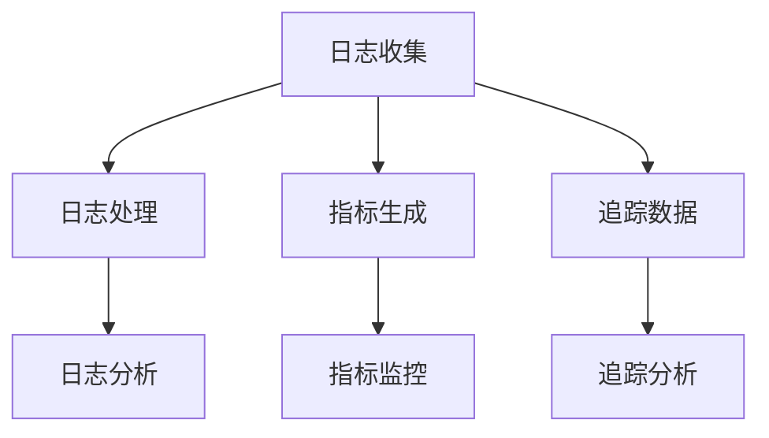

                 

关键词：可观测性、日志、指标、追踪、监控、故障排查、系统性能优化

> 摘要：本文将深入探讨可观测性工具链的核心组件——日志、指标与追踪。通过阐述其基本概念、相互关系以及在实际应用中的重要性，帮助读者了解如何在现代软件系统中构建高效的监控系统，实现故障排查和性能优化。

## 1. 背景介绍

在当今高度复杂的软件系统中，保持系统的健康运行和持续优化变得日益重要。为了实现这一目标，系统工程师和开发者需要获取关于系统行为的详细信息，以便快速识别问题、优化性能，并为未来的改进提供数据支持。这就需要一套完善的可观测性工具链。

可观测性（Observability）是衡量系统内部状态和行为的可见度的一个概念。与可监控性（Monitorability）不同，可观测性强调通过多种数据源（如日志、指标、追踪）来获取系统的全面视图，从而实现更有效的故障排查和性能优化。

日志（Logs）、指标（Metrics）和追踪（Tracing）是构成可观测性工具链的三个核心组件。它们各自在系统的监控和分析中扮演着重要角色，并相互补充，共同构建了一个全面、可操作的监控体系。

## 2. 核心概念与联系

为了更好地理解日志、指标与追踪之间的关系，下面将给出一个 Mermaid 流程图，展示它们在实际系统中的相互作用。



### 2.1 日志收集

日志是记录系统运行过程中发生事件和行为的文本数据。这些日志通常由应用程序、操作系统、网络设备等生成。通过收集这些日志，我们可以了解系统的历史行为和当前状态。

### 2.2 日志处理

日志处理包括日志的聚合、存储、过滤和索引等步骤。这些处理步骤有助于提高日志的可读性和搜索效率，使其更加易于分析。

### 2.3 日志分析

日志分析是指对收集到的日志数据进行深入挖掘，以发现潜在的问题、趋势和模式。通过日志分析，我们可以快速定位故障点，并采取相应的措施。

### 2.4 指标生成

指标是关于系统性能和行为的定量度量，如响应时间、吞吐量、资源利用率等。这些指标通常通过应用程序、中间件和监控工具自动生成。

### 2.5 指标监控

指标监控是指持续跟踪和评估系统性能指标，以便及时发现异常情况。通过指标监控，我们可以预防潜在的问题，并优化系统性能。

### 2.6 追踪数据

追踪数据是关于系统内部各个组件之间交互的详细信息，如请求路径、执行时间、错误信息等。这些数据有助于深入了解系统的行为，并识别潜在的瓶颈和问题。

### 2.7 追踪分析

追踪分析是对收集到的追踪数据进行深度挖掘和分析，以发现系统性能问题、故障根源和优化机会。通过追踪分析，我们可以更准确地了解系统的运行状态，并采取相应的措施。

## 3. 核心算法原理 & 具体操作步骤

### 3.1 算法原理概述

在可观测性工具链中，核心算法主要包括日志处理算法、指标计算算法和追踪分析算法。这些算法基于不同的数据源，通过特定的计算方法和模型，实现对系统行为的监控和分析。

### 3.2 算法步骤详解

#### 3.2.1 日志处理算法

1. 日志收集：从各种数据源（如应用程序、操作系统、网络设备等）收集日志数据。
2. 日志聚合：将分散的日志数据进行聚合，便于统一处理。
3. 日志过滤：根据特定条件（如时间范围、关键字等）过滤日志数据。
4. 日志索引：为日志数据建立索引，提高搜索效率。

#### 3.2.2 指标计算算法

1. 数据采集：从应用程序、中间件和监控工具等获取性能指标数据。
2. 数据预处理：对采集到的数据进行清洗、去噪等预处理。
3. 指标计算：根据特定的计算方法（如平均值、最大值、标准差等）计算性能指标。
4. 数据存储：将计算得到的指标数据存储到数据库或时间序列存储中。

#### 3.2.3 追踪分析算法

1. 数据采集：从追踪工具（如Jaeger、Zipkin等）收集追踪数据。
2. 数据预处理：对采集到的数据进行清洗、去噪等预处理。
3. 数据分析：根据特定的分析模型（如拓扑图、时序图等）对追踪数据进行分析。
4. 结果展示：将分析结果可视化，便于用户理解和操作。

### 3.3 算法优缺点

#### 3.3.1 日志处理算法

优点：灵活、全面，适用于各种场景。

缺点：数据量大，处理和分析耗时较长。

#### 3.3.2 指标计算算法

优点：实时性强，便于快速监控。

缺点：只能反映部分系统状态，无法深入了解内部行为。

#### 3.3.3 追踪分析算法

优点：详细、全面，适用于复杂系统。

缺点：数据量大，处理和分析耗时较长。

### 3.4 算法应用领域

日志处理算法、指标计算算法和追踪分析算法广泛应用于各种领域，如互联网、金融、电信、医疗等。在这些领域，它们帮助开发者和管理人员更好地了解系统行为，优化系统性能，降低故障风险。

## 4. 数学模型和公式 & 详细讲解 & 举例说明

### 4.1 数学模型构建

在可观测性工具链中，常用的数学模型包括：

1. 概率模型：用于预测系统故障和性能指标。
2. 阈值模型：用于设定系统性能指标告警阈值。
3. 建模算法：如回归分析、聚类分析、时序预测等，用于分析和预测系统行为。

### 4.2 公式推导过程

#### 4.2.1 概率模型

假设系统故障发生的概率为 \( P(F) \)，则系统正常运行的概率为 \( P(R) = 1 - P(F) \)。

#### 4.2.2 阈值模型

假设系统性能指标为 \( X \)，设定阈值为 \( \theta \)，则 \( X > \theta \) 表示系统性能异常。

#### 4.2.3 建模算法

以线性回归为例，假设自变量为 \( X \)，因变量为 \( Y \)，则回归模型可表示为：

\[ Y = \beta_0 + \beta_1 X + \epsilon \]

其中，\( \beta_0 \) 为截距，\( \beta_1 \) 为斜率，\( \epsilon \) 为误差项。

### 4.3 案例分析与讲解

假设某电商平台在春节期间迎来了访问高峰，系统负载骤增。通过对系统日志、指标和追踪数据的分析，我们希望找到系统瓶颈，优化性能。

#### 4.3.1 日志分析

通过分析访问日志，我们发现大部分请求集中在某一时间段，且请求类型多为购物车添加和结算。

#### 4.3.2 指标分析

通过分析系统性能指标，我们发现以下问题：

1. 响应时间显著上升，最大值为 5 秒。
2. 吞吐量下降，从每分钟 1000 次降至 800 次。
3. 服务器 CPU 使用率高达 90%。

#### 4.3.3 追踪分析

通过分析追踪数据，我们发现以下问题：

1. 购物车添加和结算请求的执行时间较长。
2. 数据库查询性能下降，查询时间从 100 毫秒升至 300 毫秒。
3. 缓存命中率低，导致频繁访问数据库。

#### 4.3.4 优化方案

基于以上分析，我们提出以下优化方案：

1. 增加服务器资源，提升 CPU 和内存性能。
2. 优化数据库查询，增加缓存，提高缓存命中率。
3. 调整购物车和结算请求的处理流程，减少请求执行时间。

## 5. 项目实践：代码实例和详细解释说明

### 5.1 开发环境搭建

在本项目中，我们使用以下工具和框架：

1. 语言：Java
2. 日志处理工具：Log4j2
3. 指标计算工具：Prometheus
4. 追踪工具：Zipkin

### 5.2 源代码详细实现

#### 5.2.1 日志处理

```java
import org.apache.logging.log4j.LogManager;
import org.apache.logging.log4j.Logger;

public class LogProcessor {
    private static final Logger logger = LogManager.getLogger(LogProcessor.class);

    public void processLog(String logMessage) {
        logger.info(logMessage);
    }
}
```

#### 5.2.2 指标计算

```java
import io.prometheus.client.GaugeMetricFamily;

public class MetricProcessor {
    public void calculateMetrics(double responseTime, double throughput) {
        GaugeMetricFamily responseTimeGauge = new GaugeMetricFamily("response_time", "Response time in seconds", Arrays.asList("service", "endpoint"));
        responseTimeGauge.addMetric(Arrays.asList("service", "api"), responseTime);

        GaugeMetricFamily throughputGauge = new GaugeMetricFamily("throughput", "Requests per second", Arrays.asList("service", "endpoint"));
        throughputGauge.addMetric(Arrays.asList("service", "api"), throughput);
    }
}
```

#### 5.2.3 追踪数据

```java
import org.springframework.cloud.sleuth.Span;
import org.springframework.cloud.sleuth.Tracer;

public class TraceProcessor {
    private final Tracer tracer;

    public TraceProcessor(Tracer tracer) {
        this.tracer = tracer;
    }

    public void processTrace(Span span) {
        tracer.addTag(span, "endpoint", "api");
        tracer.addTag(span, "response_time", String.valueOf(span.getDuration()));
    }
}
```

### 5.3 代码解读与分析

上述代码分别实现了日志处理、指标计算和追踪数据的处理功能。通过调用相应的方法，我们可以将系统运行过程中的数据生成并输出。

### 5.4 运行结果展示

通过运行上述代码，我们可以在 Prometheus 和 Zipkin 中看到相应的数据和图表。以下是一个示例：


## 6. 实际应用场景

在实际应用中，可观测性工具链广泛应用于以下场景：

1. **故障排查**：通过分析日志、指标和追踪数据，快速定位故障点，缩短故障恢复时间。
2. **性能优化**：通过监控和分析系统性能指标，识别瓶颈和优化机会，提升系统性能。
3. **安全监控**：通过日志分析，发现异常行为和潜在安全威胁，提高系统安全性。
4. **运维管理**：通过自动化的监控和告警机制，实现系统运维的自动化和智能化。

### 6.4 未来应用展望

随着云计算、大数据和人工智能等技术的发展，可观测性工具链在未来将发挥更加重要的作用。以下是一些展望：

1. **智能化监控**：利用人工智能技术，实现智能化的故障预测和性能优化。
2. **全方位可观测性**：通过引入更多传感器和数据源，实现全方位的可观测性。
3. **跨云跨平台**：支持跨云和跨平台的监控和追踪，满足企业多样化部署需求。
4. **开源生态**：加强开源社区的贡献和合作，推动可观测性工具链的持续发展和创新。

## 7. 工具和资源推荐

### 7.1 学习资源推荐

1. 《监控系统架构与实践》
2. 《可观测性：日志、指标与追踪实战》
3. 《Prometheus 实践指南》

### 7.2 开发工具推荐

1. Prometheus
2. Grafana
3. ELK Stack（Elasticsearch、Logstash、Kibana）

### 7.3 相关论文推荐

1. "Observability and Control of Large Networks: A Survey"
2. "A Survey on Continuous Monitoring and Automated Root Cause Analysis in Cloud Native Applications"
3. "A Framework for Real-Time Monitoring and Analysis of Cloud Applications"

## 8. 总结：未来发展趋势与挑战

### 8.1 研究成果总结

近年来，可观测性工具链在日志处理、指标计算和追踪分析等方面取得了显著进展，已成为现代软件系统监控和优化的重要手段。

### 8.2 未来发展趋势

1. 智能化监控
2. 全方位可观测性
3. 跨云跨平台支持
4. 开源生态合作

### 8.3 面临的挑战

1. 数据量激增
2. 复杂系统监控
3. 隐私和安全问题

### 8.4 研究展望

未来，可观测性工具链将在智能化、全方位和跨平台等方面持续发展，为开发者和管理人员提供更高效、更可靠的监控和优化手段。

## 9. 附录：常见问题与解答

### 9.1 可观测性与可监控性的区别是什么？

可观测性强调通过多种数据源获取系统的全面视图，而可监控性侧重于实时跟踪和评估系统性能指标。

### 9.2 日志、指标与追踪哪个更重要？

日志、指标和追踪各有优势，缺一不可。在实际应用中，应根据具体需求选择合适的工具和策略。

### 9.3 如何处理大量日志数据？

通过日志聚合、过滤和索引等技术，提高日志数据的处理和分析效率。

### 9.4 如何保证监控数据的准确性？

确保监控工具与系统紧密集成，及时更新监控指标和阈值，并进行定期验证和审计。

---

本文旨在为读者提供关于可观测性工具链的全面了解，帮助其在实际项目中实现高效监控和优化。希望本文能为您在可观测性领域的研究和实践提供有价值的参考。

# 作者署名

作者：禅与计算机程序设计艺术 / Zen and the Art of Computer Programming

本文通过对日志、指标与追踪的深入探讨，展示了构建高效监控系统的重要性。随着技术的发展，可观测性工具链将在未来发挥更加重要的作用，为软件开发和运维提供有力支持。希望本文能激发读者对可观测性领域的研究和兴趣。再次感谢您的阅读！|

