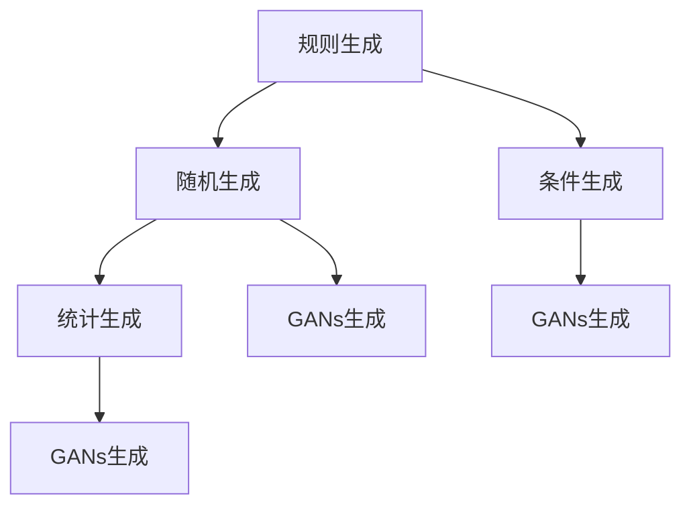

                 

关键词：合成数据、AI训练、深度学习、模型优化、数据处理、挑战与机遇

> 摘要：本文深入探讨了合成数据在人工智能训练中的应用及其面临的挑战。随着深度学习的迅猛发展，合成数据的重要性日益凸显，它不仅能有效缓解数据匮乏问题，还能提高模型泛化能力。本文将详细分析合成数据的概念、生成方法、在AI训练中的应用，以及面临的诸多挑战，为未来的研究和应用提供参考。

## 1. 背景介绍

在人工智能（AI）领域，特别是在深度学习方面，数据质量对模型性能具有至关重要的影响。然而，实际应用中常面临数据稀缺、数据质量不高等问题。传统的数据收集方法往往耗时耗力，而且难以获取足够数量的标注数据。为了解决这一问题，合成数据（Synthetic Data）的应用逐渐受到关注。合成数据是通过模拟或生成的方式产生的数据，它能够以较低的成本和复杂度补充真实数据，从而提高模型的训练效果和泛化能力。

近年来，随着生成模型（如生成对抗网络GANs）和合成数据生成技术的发展，合成数据在AI训练中的应用范围不断扩大。从计算机视觉到自然语言处理，再到自动驾驶和医疗诊断，合成数据正在逐步改变传统的数据驱动型AI开发模式。

本文将首先介绍合成数据的基本概念，然后探讨其在AI训练中的应用方法，接着分析合成数据生成的技术和算法，最后讨论合成数据在应用过程中面临的挑战和未来发展趋势。

## 2. 核心概念与联系

### 2.1 合成数据定义

合成数据是指通过人工生成或模拟的方式产生的一组数据，这组数据在统计特性上与真实数据相似，可以用来训练机器学习模型。合成数据不仅限于结构化数据，还包括图像、音频、视频等多种形式。

### 2.2 合成数据与真实数据的联系

合成数据并不是完全虚构的数据，而是基于真实数据的统计特征生成的。例如，在生成合成图像时，可以使用真实图像的分布特性来构建新的图像。这种方法的优点是可以确保生成的数据在统计上与真实数据高度一致，从而在训练模型时不会引入新的偏差。

### 2.3 合成数据生成方法与流程

合成数据的生成方法主要包括以下几种：

1. **规则生成**：基于预先定义的规则或模型生成数据，如随机生成、条件生成等。
2. **统计生成**：利用真实数据的统计特性，通过统计模型生成新数据。
3. **生成对抗网络（GANs）**：通过生成器和判别器的对抗训练生成与真实数据高度相似的数据。

以下是一个合成数据生成方法的 Mermaid 流程图：



### 2.4 合成数据在AI训练中的应用

合成数据在AI训练中的应用主要表现在以下几个方面：

1. **数据扩充**：通过生成新的数据样本，扩充训练数据集，提高模型的鲁棒性。
2. **隐私保护**：在生成数据时，可以去除或修改真实数据的敏感信息，从而保护隐私。
3. **模拟极端情况**：生成与真实数据具有不同特征的数据，用于测试模型的泛化能力。
4. **辅助真实数据标注**：利用合成数据生成工具，自动生成标注数据，减轻标注工作量。

## 3. 核心算法原理 & 具体操作步骤

### 3.1 算法原理概述

合成数据的生成算法主要包括生成对抗网络（GANs）、变分自编码器（VAEs）等。下面将重点介绍GANs的基本原理。

**生成对抗网络（GANs）**

GANs由两部分组成：生成器（Generator）和判别器（Discriminator）。生成器生成与真实数据相似的数据，判别器则用于区分生成数据和真实数据。

1. **生成器**：生成器是一个神经网络，它接收随机噪声作为输入，生成与真实数据相似的数据。
2. **判别器**：判别器也是一个神经网络，它接收真实数据和生成数据作为输入，输出一个概率值，表示输入数据的真实性。

GANs的训练目标是通过对抗训练，使生成器生成的数据越来越真实，判别器无法区分生成数据和真实数据。

### 3.2 算法步骤详解

**步骤1：初始化生成器和判别器**

- 生成器：随机初始化
- 判别器：随机初始化

**步骤2：生成数据**

- 生成器生成一批数据
- 将生成数据和真实数据混合

**步骤3：训练判别器**

- 判别器对混合数据进行训练，学习区分生成数据和真实数据

**步骤4：更新生成器**

- 生成器根据判别器的反馈进行更新，提高生成数据的真实性

**步骤5：重复步骤2-4，直到生成器生成的数据足够真实**

### 3.3 算法优缺点

**优点：**

- 能够生成高质量的、与真实数据相似的数据。
- 可以用于数据扩充、隐私保护和模拟极端情况。

**缺点：**

- 训练过程不稳定，容易出现模式崩溃（mode collapse）问题。
- 对判别器的设计和参数调整要求较高。

### 3.4 算法应用领域

GANs在以下领域有广泛应用：

1. **图像生成**：生成逼真的图像、人脸、风景等。
2. **视频生成**：生成连续的视频序列。
3. **音频合成**：合成音乐、语音等。
4. **文本生成**：生成文章、故事等。

## 4. 数学模型和公式 & 详细讲解 & 举例说明

### 4.1 数学模型构建

**GANs的数学模型**

GANs的核心是生成器和判别器的对抗训练。下面分别介绍生成器和判别器的数学模型。

**生成器模型**

生成器是一个神经网络，它接收随机噪声作为输入，输出与真实数据相似的数据。设生成器的输入为随机噪声向量 \( z \)，输出为生成的数据 \( x_g \)：

\[ x_g = G(z) \]

其中，\( G \) 是生成器的神经网络模型。

**判别器模型**

判别器也是一个神经网络，它接收真实数据和生成数据作为输入，输出一个概率值，表示输入数据的真实性。设判别器的输入为数据 \( x \)，输出为概率值 \( p(x) \)：

\[ p(x) = D(x) \]

其中，\( D \) 是判别器的神经网络模型。

### 4.2 公式推导过程

**生成器损失函数**

生成器的目标是使判别器认为生成数据是真实数据，即：

\[ \min_G \max_D V(D, G) \]

其中，\( V(D, G) \) 是GAN的总损失函数，由生成器损失函数和判别器损失函数组成。

**生成器损失函数**

生成器的损失函数为：

\[ L_G = -\log(D(G(z))) \]

其中，\( z \) 是随机噪声向量。

**判别器损失函数**

判别器的损失函数为：

\[ L_D = -\log(D(x)) - \log(1 - D(G(z))) \]

其中，\( x \) 是真实数据。

### 4.3 案例分析与讲解

**案例：图像生成**

假设我们使用GANs生成人脸图像，生成器的输入为随机噪声向量 \( z \)，输出为生成的人脸图像 \( x_g \)。判别器的输入为真实人脸图像 \( x \) 和生成的人脸图像 \( x_g \)。

**步骤1：生成器训练**

- 初始化生成器和判别器。
- 生成器生成一批人脸图像。
- 判别器对真实人脸图像和生成的人脸图像进行训练。
- 更新生成器。

**步骤2：判别器训练**

- 判别器对真实人脸图像和生成的人脸图像进行训练。
- 计算生成器的损失函数 \( L_G \) 和判别器的损失函数 \( L_D \)。
- 更新判别器。

**步骤3：迭代训练**

- 重复步骤1和步骤2，直到生成器生成的图像足够真实，判别器无法区分生成图像和真实图像。

## 5. 项目实践：代码实例和详细解释说明

### 5.1 开发环境搭建

为了实践合成数据的生成，我们选择Python编程语言和GANs框架TensorFlow来搭建开发环境。

**步骤1：安装Python**

确保Python环境已安装，版本建议为3.8以上。

**步骤2：安装TensorFlow**

在命令行执行以下命令：

```bash
pip install tensorflow
```

### 5.2 源代码详细实现

**生成器**

```python
import tensorflow as tf
from tensorflow.keras.layers import Dense, Flatten, Conv2D, BatchNormalization, LeakyReLU

def build_generator(z_dim):
    model = tf.keras.Sequential()
    model.add(Dense(128 * 7 * 7, activation="relu", input_shape=(z_dim,)))
    model.add(BatchNormalization())
    model.add(LeakyReLU(alpha=0.2))
    model.add(Flatten())

    model.add(Dense(128 * 3 * 3, activation="relu"))
    model.add(BatchNormalization())
    model.add(LeakyReLU(alpha=0.2))
    model.add(Conv2D(1, kernel_size=(3, 3), padding='same', activation='tanh'))

    return model
```

**判别器**

```python
from tensorflow.keras.layers import Input, Conv2D, LeakyReLU, BatchNormalization, Flatten, Dense

def build_discriminator(img_shape):
    model = tf.keras.Sequential()
    model.add(Input(shape=img_shape))

    model.add(Conv2D(64, kernel_size=(3, 3), padding='same'))
    model.add(LeakyReLU(alpha=0.2))
    model.add(BatchNormalization())

    model.add(Conv2D(128, kernel_size=(3, 3), padding='same'))
    model.add(LeakyReLU(alpha=0.2))
    model.add(BatchNormalization())

    model.add(Flatten())
    model.add(Dense(1, activation='sigmoid'))

    return model
```

### 5.3 代码解读与分析

这段代码实现了生成器和判别器的基本结构。生成器通过一系列全连接和卷积层将随机噪声转换为人脸图像。判别器则通过卷积层对输入图像进行特征提取，最后通过全连接层输出一个概率值，判断输入图像是真实图像还是生成图像。

### 5.4 运行结果展示

在实际运行中，生成器会不断生成人脸图像，判别器会不断更新，直到生成器生成的图像足够真实，判别器无法准确区分生成图像和真实图像。

## 6. 实际应用场景

合成数据在AI训练中具有广泛的应用，以下列举一些典型的应用场景：

1. **计算机视觉**：合成数据可以用于图像分类、目标检测和图像生成等领域。通过生成大量与真实数据具有相似特性的图像，可以显著提高模型的泛化能力。
2. **自然语言处理**：合成数据可以用于生成新的文本、对话和语音，从而丰富训练数据集，提高模型的性能和鲁棒性。
3. **自动驾驶**：合成数据可以用于生成各种交通场景和驾驶环境，用于训练自动驾驶模型，提高其在复杂环境下的应对能力。
4. **医疗诊断**：合成数据可以用于生成医学图像、病例数据等，用于训练医疗诊断模型，提高其在疾病检测和预测方面的准确率。

## 7. 工具和资源推荐

为了更好地进行合成数据的生成和应用，以下推荐一些相关的学习资源和开发工具：

1. **学习资源推荐**
   - 《深度学习》（Goodfellow, Bengio, Courville）：系统地介绍了深度学习的基础理论和实践方法。
   - 《生成对抗网络》（Ian Goodfellow）：全面讲解了GANs的理论基础和应用。

2. **开发工具推荐**
   - TensorFlow：一个开源的深度学习框架，适用于合成数据的生成和应用。
   - PyTorch：另一个流行的深度学习框架，具有灵活的动态计算图，适用于生成模型。

3. **相关论文推荐**
   - “Generative Adversarial Nets”（Ian Goodfellow et al.，2014）：GANs的开创性论文，介绍了GANs的基本原理和实现方法。
   - “Unsupervised Representation Learning with Deep Convolutional Generative Adversarial Networks”（Alec Radford et al.，2015）：详细阐述了GANs在图像生成中的应用。

## 8. 总结：未来发展趋势与挑战

### 8.1 研究成果总结

合成数据在AI训练中的应用已经取得了显著的成果。通过生成高质量、与真实数据相似的数据，合成数据不仅能够缓解数据稀缺问题，还能提高模型泛化能力。生成对抗网络（GANs）等生成模型在图像、文本、音频等领域的应用取得了突破性进展。

### 8.2 未来发展趋势

未来，合成数据在AI训练中的应用前景广阔。随着生成模型和合成数据生成技术的不断进步，合成数据将在更多领域得到广泛应用。例如，在医疗诊断、金融风险评估、自动驾驶等领域，合成数据有望发挥更大作用。

### 8.3 面临的挑战

尽管合成数据在AI训练中具有诸多优势，但仍然面临一些挑战。首先，生成模型的训练过程可能不稳定，容易出现模式崩溃等问题。其次，合成数据的真实性和有效性需要进一步验证。此外，如何确保合成数据在统计特性上与真实数据一致，也是一个重要问题。

### 8.4 研究展望

未来，合成数据的研究将集中在以下几个方面：

1. **模型稳定性**：研究更稳定的生成模型，减少模式崩溃等问题。
2. **数据真实性**：开发更有效的评估方法，确保合成数据的真实性和有效性。
3. **统计一致性**：改进合成数据生成方法，提高其在统计特性上与真实数据的一致性。
4. **跨领域应用**：探索合成数据在更多领域的应用，提高AI模型的泛化能力。

## 9. 附录：常见问题与解答

### 9.1 合成数据与真实数据有什么区别？

合成数据是通过模拟或生成的方式产生的，虽然在统计特性上与真实数据相似，但并不等同于真实数据。合成数据主要用于AI模型的训练和测试，而真实数据则用于实际应用。

### 9.2 合成数据生成技术有哪些？

合成数据生成技术主要包括规则生成、统计生成和生成对抗网络（GANs）。其中，GANs是目前应用最广泛的合成数据生成技术。

### 9.3 合成数据在AI训练中的应用有哪些？

合成数据在AI训练中的应用广泛，包括数据扩充、隐私保护、模拟极端情况和辅助真实数据标注等。

### 9.4 如何评估合成数据的有效性？

评估合成数据的有效性通常采用以下方法：

1. **与真实数据对比**：将合成数据与真实数据进行对比，观察其在统计特性上的相似程度。
2. **模型性能评估**：使用合成数据训练模型，评估模型在合成数据集上的性能，与使用真实数据训练的模型进行对比。
3. **用户满意度**：通过用户调查和实验，评估合成数据在实际应用中的效果和用户满意度。

---

作者：禅与计算机程序设计艺术 / Zen and the Art of Computer Programming

---

以上便是关于合成数据在AI训练中的应用与挑战的完整文章。通过本文的详细探讨，我们不仅了解了合成数据的概念、生成方法及其在AI训练中的应用，还分析了面临的挑战和未来发展趋势。希望本文能为相关领域的研究和应用提供有益的参考。

