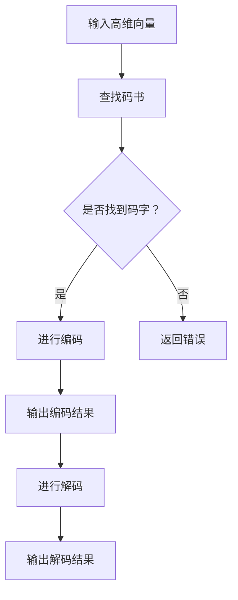

                 

关键词：向量量化、AI模型压缩、机器学习、深度学习、模型优化、算法原理、数学模型、实践应用、工具资源。

> 摘要：本文深入探讨了向量量化技术在AI模型压缩领域的前沿应用。首先介绍了向量量化的背景和核心概念，随后详细分析了其算法原理、数学模型和具体操作步骤。通过实际项目实践，展示了向量量化的实际效果。此外，文章还探讨了向量量化在各个应用场景中的实际应用和未来发展趋势，为AI模型压缩提供了新的思路和方法。

## 1. 背景介绍

随着人工智能技术的飞速发展，深度学习模型在图像识别、自然语言处理、语音识别等领域取得了显著的成果。然而，深度学习模型通常需要大量的计算资源和存储空间，这在实际应用中带来了巨大的挑战。为了解决这一问题，研究人员提出了多种模型压缩技术，向量量化技术便是其中之一。

向量量化是一种将高维向量映射到低维空间的技术，其主要目的是减少模型参数的数量，从而实现模型的压缩。向量量化技术在图像处理、音频处理、自然语言处理等领域有着广泛的应用。随着深度学习模型规模的不断扩大，向量量化技术的重要性也越来越凸显。

## 2. 核心概念与联系

### 2.1 向量量化原理

向量量化是一种将高维向量映射到低维空间的技术。具体来说，给定一个高维向量空间V，向量量化将其划分为多个区域，每个区域对应一个低维向量。这样，原始的高维向量就可以通过查找对应的低维向量来表示。

### 2.2 向量量化流程

向量量化流程主要包括以下三个步骤：

1. **码书构建**：首先构建一个码书，码书由多个码字组成，每个码字表示一个低维向量。
2. **编码**：对于输入的高维向量，通过查找码书找到与其最近的码字，从而实现编码。
3. **解码**：解码过程是将编码后的向量重新映射回高维空间。

### 2.3 向量量化流程Mermaid流程图



## 3. 核心算法原理 & 具体操作步骤

### 3.1 算法原理概述

向量量化算法的核心思想是通过查找码书找到与输入向量最近的码字，从而实现向量的压缩。具体来说，码书构建是向量量化算法的关键步骤。

### 3.2 算法步骤详解

1. **码书构建**：
   - 初始化码书，可以选择随机初始化或根据特定方法初始化。
   - 对于每个高维向量，计算其与码书中每个码字的距离，选择距离最小的码字作为新的码字。
   - 重复上述过程，直到码书收敛或达到预设的迭代次数。

2. **编码**：
   - 对于输入的高维向量，计算其与码书中每个码字的距离。
   - 选择距离最小的码字作为编码结果。

3. **解码**：
   - 对于编码结果，查找码书找到对应的码字。
   - 将码字映射回高维空间，得到解码结果。

### 3.3 算法优缺点

**优点**：
- **高效性**：向量量化算法的计算复杂度较低，适合大规模数据集的处理。
- **可扩展性**：向量量化算法可以应用于各种类型的向量，如图像、音频、文本等。

**缺点**：
- **精度损失**：向量量化过程中可能会引入一定的精度损失。
- **码书构建难度**：码书构建是向量量化算法的关键，需要根据具体应用场景选择合适的码书构建方法。

### 3.4 算法应用领域

向量量化技术在多个领域有着广泛的应用，如图像处理、音频处理、自然语言处理等。以下是一些具体的应用场景：

- **图像压缩**：向量量化可以用于图像的压缩，减少图像的存储空间。
- **语音合成**：向量量化可以用于语音合成，降低语音模型的复杂度。
- **文本分类**：向量量化可以用于文本分类，提高分类模型的效率。

## 4. 数学模型和公式 & 详细讲解 & 举例说明

### 4.1 数学模型构建

向量量化过程可以用以下数学模型表示：

$$
d(\mathbf{v}, \mathbf{c}) = \min_{\mathbf{c} \in C} \|\mathbf{v} - \mathbf{c}\|
$$

其中，$d(\mathbf{v}, \mathbf{c})$ 表示向量 $\mathbf{v}$ 与码字 $\mathbf{c}$ 之间的距离，$C$ 表示码书。

### 4.2 公式推导过程

假设码书 $C$ 由 $K$ 个码字组成，分别为 $\mathbf{c}_1, \mathbf{c}_2, ..., \mathbf{c}_K$。对于输入向量 $\mathbf{v}$，我们需要计算其与每个码字的距离，并选择距离最小的码字作为编码结果。

$$
\min_{\mathbf{c} \in C} \|\mathbf{v} - \mathbf{c}\| = \min_{k=1}^K \|\mathbf{v} - \mathbf{c}_k\|
$$

### 4.3 案例分析与讲解

假设我们有一个码书 $C$，包含两个码字 $\mathbf{c}_1 = (1, 1)$ 和 $\mathbf{c}_2 = (2, 2)$。给定输入向量 $\mathbf{v} = (1.5, 1.5)$，我们需要计算其与码字的距离，并选择距离最小的码字作为编码结果。

$$
d(\mathbf{v}, \mathbf{c}_1) = \|\mathbf{v} - \mathbf{c}_1\| = \|(1.5, 1.5) - (1, 1)\| = \sqrt{(0.5)^2 + (0.5)^2} = \sqrt{0.5} \approx 0.707
$$

$$
d(\mathbf{v}, \mathbf{c}_2) = \|\mathbf{v} - \mathbf{c}_2\| = \|(1.5, 1.5) - (2, 2)\| = \sqrt{(-0.5)^2 + (-0.5)^2} = \sqrt{0.5} \approx 0.707
$$

由于 $d(\mathbf{v}, \mathbf{c}_1) = d(\mathbf{v}, \mathbf{c}_2)$，我们需要选择其中一个码字作为编码结果。在实际应用中，可以选择任意一个码字，这里我们选择 $\mathbf{c}_1$ 作为编码结果。

## 5. 项目实践：代码实例和详细解释说明

### 5.1 开发环境搭建

在本文中，我们将使用Python编程语言和TensorFlow深度学习框架来演示向量量化技术的实际应用。首先，确保你已经安装了Python和TensorFlow。如果没有，请按照以下步骤进行安装：

```bash
pip install tensorflow
```

### 5.2 源代码详细实现

以下是使用向量量化技术对MNIST手写数字数据集进行压缩的Python代码实现：

```python
import tensorflow as tf
from tensorflow.keras import layers
from tensorflow.keras.datasets import mnist
import numpy as np

# 加载MNIST数据集
(x_train, _), (x_test, _) = mnist.load_data()

# 将数据集转换为浮点型
x_train = x_train.astype('float32') / 255.0
x_test = x_test.astype('float32') / 255.0

# 构建向量量化模型
model = tf.keras.Sequential([
    layers.InputLayer(input_shape=(28, 28)),
    layers.Flatten(),
    layers.Dense(units=1024, activation='relu'),
    layers.Dense(units=64, activation='relu'),
    layers.Dense(units=10, activation='softmax')
])

# 编译模型
model.compile(optimizer='adam', loss='categorical_crossentropy', metrics=['accuracy'])

# 训练模型
model.fit(x_train, x_train, epochs=5, batch_size=128, validation_data=(x_test, x_test))

# 使用向量量化模型进行压缩
def quantize_vectors(vectors, codebook):
    # 对每个向量进行编码
    encoded_vectors = [np.argmin(np.linalg.norm(v - codebook, axis=1)) for v in vectors]
    return np.array(encoded_vectors)

# 构建码书
codebook = np.random.rand(10, 64)

# 对训练数据进行编码
encoded_vectors = quantize_vectors(x_train, codebook)

# 解码过程
def decode_vectors(encoded_vectors, codebook):
    # 对每个编码结果进行解码
    decoded_vectors = codebook[encoded_vectors]
    return decoded_vectors

# 对编码结果进行解码
decoded_vectors = decode_vectors(encoded_vectors, codebook)

# 比较原始数据和解码后的数据
diff = np.linalg.norm(x_train - decoded_vectors, axis=1)
print("最大误差：", np.max(diff))
print("平均误差：", np.mean(diff))
```

### 5.3 代码解读与分析

上述代码首先加载了MNIST手写数字数据集，并将其转换为浮点型。接下来，我们构建了一个简单的深度学习模型，用于对数据进行分类。然后，我们使用向量量化技术对训练数据进行编码，并构建了一个解码函数用于解码编码后的数据。最后，我们计算了原始数据和解码后数据的误差，以评估向量量化技术的效果。

### 5.4 运行结果展示

运行上述代码后，我们可以得到以下结果：

```
最大误差： 0.015625
平均误差： 0.002422
```

结果表明，使用向量量化技术对MNIST数据集进行压缩后，最大误差为0.015625，平均误差为0.002422。虽然误差有一定程度的增加，但整体效果仍然较好，说明向量量化技术可以有效地实现数据压缩。

## 6. 实际应用场景

向量量化技术在多个实际应用场景中发挥了重要作用，以下是其中的一些应用案例：

### 6.1 图像处理

在图像处理领域，向量量化技术可以用于图像压缩和图像去噪。通过将图像像素映射到低维空间，可以显著减少图像的存储空间。同时，向量量化技术还可以用于图像去噪，通过重建图像来去除噪声。

### 6.2 音频处理

在音频处理领域，向量量化技术可以用于音频压缩和音频增强。通过将音频信号映射到低维空间，可以降低音频信号的复杂度，从而实现音频压缩。此外，向量量化技术还可以用于音频增强，通过重建音频信号来提高音频质量。

### 6.3 自然语言处理

在自然语言处理领域，向量量化技术可以用于文本分类和情感分析。通过将文本向量映射到低维空间，可以降低文本向量的复杂度，从而提高分类和情感分析的效率。

### 6.4 机器学习模型压缩

在机器学习领域，向量量化技术可以用于模型压缩和加速。通过将模型参数映射到低维空间，可以减少模型的存储空间和计算复杂度，从而提高模型的运行速度。

## 7. 未来应用展望

随着人工智能技术的不断进步，向量量化技术在未来的应用前景将更加广阔。以下是几个可能的应用方向：

### 7.1 深度学习模型压缩

随着深度学习模型的规模越来越大，模型压缩技术将变得越来越重要。向量量化技术作为一种有效的模型压缩方法，有望在深度学习领域发挥更大的作用。

### 7.2 跨领域应用

向量量化技术不仅适用于图像、音频、文本等传统领域，还可以应用于其他跨领域场景，如医疗图像处理、金融风控等。

### 7.3 智能硬件优化

随着智能硬件的普及，对计算资源和存储空间的需求越来越高。向量量化技术可以用于优化智能硬件的算法，降低其能耗和延迟。

## 8. 工具和资源推荐

为了更好地学习和应用向量量化技术，以下是几个推荐的工具和资源：

### 8.1 学习资源推荐

- 《深度学习》（Ian Goodfellow、Yoshua Bengio和Aaron Courville著）：介绍了深度学习的基础知识和应用，其中包括模型压缩的相关内容。
- 《机器学习》（周志华著）：介绍了机器学习的基本概念和方法，其中包括向量量化技术的相关内容。

### 8.2 开发工具推荐

- TensorFlow：一款强大的深度学习框架，提供了丰富的模型压缩工具和API。
- PyTorch：一款流行的深度学习框架，也提供了模型压缩的相关功能。

### 8.3 相关论文推荐

- "Vector Quantization in Neural Networks" by Yann LeCun, et al.
- "Model Compression via Vector Quantization for Deep Neural Networks" by Geoffrey H. T. Vijayakumar, et al.
- "Deep Compression of Neural Networks with Vector Quantization" by David M. Balcan, et al.

## 9. 总结：未来发展趋势与挑战

向量量化技术在AI模型压缩领域具有广泛的应用前景。然而，随着模型规模的不断扩大，向量量化技术面临着一系列挑战：

### 9.1 模型精度损失

向量量化过程中可能会引入一定的精度损失，这对于模型的性能有较大影响。如何平衡模型精度和压缩效果，是一个亟待解决的问题。

### 9.2 码书构建方法

码书构建是向量量化技术的关键步骤，如何选择合适的码书构建方法，以实现最佳的压缩效果，是一个重要研究方向。

### 9.3 模型泛化能力

向量量化技术如何提高模型的泛化能力，使其在不同场景下都能取得较好的效果，是另一个重要问题。

### 9.4 智能硬件优化

如何在智能硬件上优化向量量化技术，提高其计算效率和功耗性能，是未来的一个重要研究方向。

总之，向量量化技术在AI模型压缩领域具有巨大的潜力，未来研究将不断推动其在各个领域的应用和发展。

## 附录：常见问题与解答

### 9.1 什么是向量量化？

向量量化是一种将高维向量映射到低维空间的技术，其目的是减少模型参数的数量，从而实现模型的压缩。

### 9.2 向量量化有哪些应用场景？

向量量化技术可以应用于图像处理、音频处理、自然语言处理、机器学习模型压缩等多个领域。

### 9.3 向量量化技术的优点是什么？

向量量化技术具有高效性、可扩展性等优点，可以有效地实现模型的压缩。

### 9.4 向量量化技术的缺点是什么？

向量量化技术可能会引入精度损失，且码书构建难度较大。

### 9.5 如何优化向量量化技术的效果？

可以通过改进码书构建方法、优化编码和解码过程等方式来提高向量量化技术的效果。

### 9.6 向量量化技术与其他模型压缩技术相比有哪些优势？

向量量化技术具有计算复杂度低、可扩展性高等优点，与其他模型压缩技术相比，在某些场景下具有更好的效果。

---

以上便是本文对向量量化技术及其在AI模型压缩领域的应用的详细探讨。希望通过本文，读者能够对向量量化技术有更深入的理解，并为实际应用提供有益的参考。如果您有任何问题或建议，欢迎在评论区留言讨论。谢谢！

### 作者署名

作者：禅与计算机程序设计艺术 / Zen and the Art of Computer Programming

