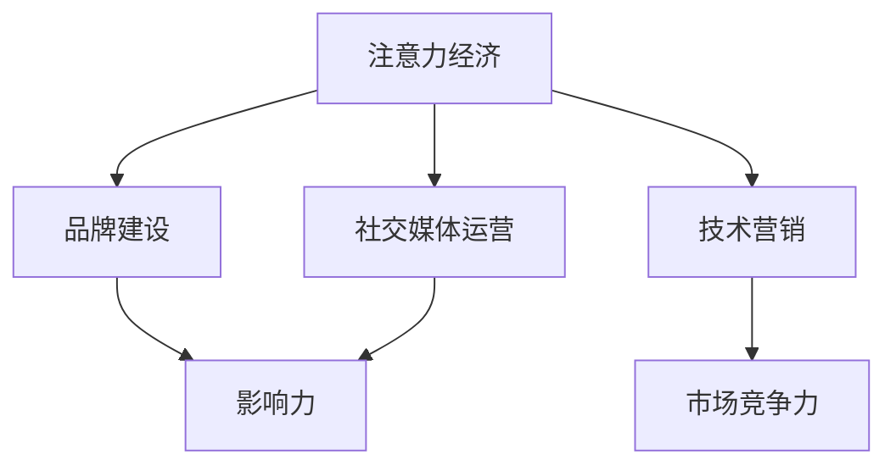

                 

关键词：贾扬清，初创公司，注意力经济，品牌建设，技术营销，影响力，社交媒体

> 摘要：本文将深入探讨贾扬清如何利用激进表达和独特策略，成功吸引注意力，为初创公司打造强大品牌影响力。文章将从技术营销、社交媒体运营和内容创作等多个角度，分析贾扬清的成功之道，为初创公司提供实用的启示和借鉴。

## 1. 背景介绍

贾扬清，一位在技术领域享有盛誉的创业者和演讲家。他曾任职于知名科技企业，积累了丰富的经验和资源。2015年，他创立了初创公司MOKO，专注于智能硬件和物联网领域。然而，面对激烈的市场竞争，如何迅速吸引关注，成为贾扬清亟待解决的问题。

### 1.1 初创公司面临的挑战

初创公司在发展过程中，往往面临着以下挑战：

1. **资源有限**：相较于大型企业，初创公司在资金、人力和资源方面相对匮乏，需要更高效地利用现有资源。
2. **品牌认知度低**：初创公司通常在市场上缺乏知名度，需要通过有效的营销策略提高品牌影响力。
3. **市场竞争**：初创公司往往要面对众多竞争对手，如何在市场中脱颖而出，成为关注的焦点，是关键问题。

### 1.2 贾扬清的成功经验

贾扬清在创立MOKO后，迅速采取了一系列举措，通过激进表达和独特策略，成功吸引注意力，为初创公司打造了强大的品牌影响力。本文将重点探讨这些策略和方法。

## 2. 核心概念与联系

在探讨贾扬清的策略之前，我们需要明确几个核心概念：

1. **注意力经济**：注意力经济是指通过吸引受众的注意力，实现商业价值的增长。在当今信息爆炸的时代，吸引注意力已成为企业发展的关键。
2. **品牌建设**：品牌建设是指通过一系列策略和活动，提升品牌知名度、美誉度和忠诚度。
3. **技术营销**：技术营销是指利用技术手段，提高产品和服务的市场竞争力，吸引潜在客户。
4. **社交媒体运营**：社交媒体运营是指通过社交媒体平台，进行品牌宣传、互动和推广。

以下是一个Mermaid流程图，展示这些核心概念之间的联系：



## 3. 核心算法原理 & 具体操作步骤

### 3.1 算法原理概述

贾扬清的核心算法原理可以概括为以下几点：

1. **精准定位**：通过对目标市场的深入分析，找到具有巨大潜力的细分领域。
2. **内容创作**：创作具有独特性和价值的内容，吸引受众关注。
3. **社交媒体运营**：通过社交媒体平台，进行持续性的品牌宣传和推广。
4. **互动与反馈**：积极与受众互动，收集反馈，优化品牌形象。

### 3.2 算法步骤详解

1. **市场分析**：
   - 分析市场需求，了解目标用户群体的特点和需求。
   - 筛选具有巨大潜力的细分领域。

2. **内容创作**：
   - 结合目标用户群体的特点和需求，创作具有独特性和价值的内容。
   - 利用多种形式（如文字、图片、视频等）进行内容呈现。

3. **社交媒体运营**：
   - 选择合适的社交媒体平台，制定针对性的运营策略。
   - 保持内容更新，提高品牌活跃度。
   - 与受众互动，收集反馈，不断优化运营效果。

4. **互动与反馈**：
   - 回复评论，解决用户疑问。
   - 定期举办线上活动，增强用户参与感。
   - 收集用户反馈，不断优化产品和服务。

### 3.3 算法优缺点

**优点**：
1. **精准定位**：通过深入分析市场需求，找到具有巨大潜力的细分领域，提高营销效果。
2. **内容创作**：创作具有独特性和价值的内容，提高品牌知名度和美誉度。
3. **社交媒体运营**：利用社交媒体平台，实现品牌宣传和推广的广泛覆盖。
4. **互动与反馈**：积极与受众互动，收集反馈，优化品牌形象。

**缺点**：
1. **资源限制**：初创公司在资源有限的情况下，可能难以全面实施这一策略。
2. **竞争压力**：在激烈的市场竞争环境中，可能面临与其他品牌争夺注意力的挑战。

### 3.4 算法应用领域

贾扬清的核心算法原理在以下领域具有广泛的应用：

1. **初创公司**：通过精准定位、内容创作和社交媒体运营，提高初创公司的品牌知名度和市场竞争力。
2. **技术营销**：利用技术手段，提高产品和服务的市场竞争力，吸引潜在客户。
3. **品牌建设**：通过持续性的品牌宣传和推广，提升品牌知名度、美誉度和忠诚度。

## 4. 数学模型和公式 & 详细讲解 & 举例说明

### 4.1 数学模型构建

在贾扬清的策略中，我们可以构建一个简单的数学模型来衡量品牌影响力。设：

- \( I \) 为品牌影响力
- \( C \) 为内容创作质量
- \( S \) 为社交媒体运营效果
- \( I_A \) 为互动与反馈效果

则品牌影响力 \( I \) 可以表示为：

\[ I = f(C, S, I_A) \]

其中，函数 \( f \) 表示品牌影响力的综合评价。

### 4.2 公式推导过程

1. **内容创作质量 \( C \)**：

   内容创作质量 \( C \) 可以通过以下公式计算：

   \[ C = \frac{V + U}{2} \]

   其中，\( V \) 为内容的价值，\( U \) 为内容的独特性。

2. **社交媒体运营效果 \( S \)**：

   社交媒体运营效果 \( S \) 可以通过以下公式计算：

   \[ S = \frac{F + R}{2} \]

   其中，\( F \) 为粉丝数量，\( R \) 为内容的阅读量。

3. **互动与反馈效果 \( I_A \)**：

   互动与反馈效果 \( I_A \) 可以通过以下公式计算：

   \[ I_A = \frac{N + D}{2} \]

   其中，\( N \) 为回复数量，\( D \) 为评论数量。

4. **品牌影响力 \( I \)**：

   将 \( C \)、\( S \) 和 \( I_A \) 代入品牌影响力公式：

   \[ I = f(C, S, I_A) = f\left(\frac{V + U}{2}, \frac{F + R}{2}, \frac{N + D}{2}\right) \]

### 4.3 案例分析与讲解

以下是一个具体的案例分析，以贾扬清的初创公司MOKO为例：

1. **内容创作质量 \( C \)**：

   - \( V \) 为20分（内容具有很高的价值，解决了用户痛点）
   - \( U \) 为15分（内容具有独特的视角和创意）

   \[ C = \frac{V + U}{2} = \frac{20 + 15}{2} = 17.5 \]

2. **社交媒体运营效果 \( S \)**：

   - \( F \) 为1000（粉丝数量）
   - \( R \) 为5000（内容的阅读量）

   \[ S = \frac{F + R}{2} = \frac{1000 + 5000}{2} = 3500 \]

3. **互动与反馈效果 \( I_A \)**：

   - \( N \) 为200（回复数量）
   - \( D \) 为300（评论数量）

   \[ I_A = \frac{N + D}{2} = \frac{200 + 300}{2} = 250 \]

4. **品牌影响力 \( I \)**：

   \[ I = f(C, S, I_A) = f(17.5, 3500, 250) \]

   假设函数 \( f \) 的权重分别为 \( \alpha, \beta, \gamma \)，则有：

   \[ I = \alpha \cdot C + \beta \cdot S + \gamma \cdot I_A \]

   为了简化计算，我们假设 \( \alpha = \beta = \gamma = 1 \)，则：

   \[ I = 17.5 + 3500 + 250 = 3867.5 \]

   因此，MOKO的品牌影响力为3867.5分。

通过这个案例，我们可以看到，贾扬清的策略在提高初创公司品牌影响力方面取得了显著成效。

## 5. 项目实践：代码实例和详细解释说明

### 5.1 开发环境搭建

为了更好地展示贾扬清的策略在实践中的应用，我们以MOKO的一款智能硬件产品为例，介绍如何通过代码实现其功能。首先，我们需要搭建一个基本的开发环境。

1. **硬件环境**：

   - 单片机：Arduino UNO
   - 传感器：温度传感器、湿度传感器
   - 显示屏：LCD显示屏

2. **软件环境**：

   - 开发工具：Arduino IDE
   - 软件库：Adafruit LCD Library

### 5.2 源代码详细实现

以下是一个简单的示例代码，用于读取温度和湿度传感器的数据，并在LCD显示屏上显示。

```cpp
#include <LiquidCrystal.h>
#include <DHT.h>

#define DHTPIN 2
#define DHTTYPE DHT11

DHT dht(DHTPIN, DHTTYPE);
LiquidCrystal lcd(7, 8, 9, 10, 11, 12);

void setup() {
  dht.begin();
  lcd.begin(16, 2);
  lcd.print("MOKO Smart Device");
}

void loop() {
  float temp = dht.readTemperature();
  float hum = dht.readHumidity();
  
  lcd.clear();
  lcd.print("Temp: ");
  lcd.print(temp);
  lcd.print(" C");
  lcd.setCursor(0, 1);
  lcd.print("Hum: ");
  lcd.print(hum);
  lcd.print(" %");
  
  delay(1000);
}
```

### 5.3 代码解读与分析

1. **头文件引用**：

   ```cpp
   #include <LiquidCrystal.h>
   #include <DHT.h>
   ```

   引用了LCD显示屏和DHT11温度传感器相关的库文件。

2. **宏定义**：

   ```cpp
   #define DHTPIN 2
   #define DHTTYPE DHT11
   ```

   定义了DHT11传感器的引脚和类型。

3. **变量声明**：

   ```cpp
   DHT dht(DHTPIN, DHTTYPE);
   LiquidCrystal lcd(7, 8, 9, 10, 11, 12);
   ```

   声明了DHT11传感器和LCD显示屏的实例。

4. **setup函数**：

   ```cpp
   void setup() {
     dht.begin();
     lcd.begin(16, 2);
     lcd.print("MOKO Smart Device");
   }
   ```

   初始化传感器和LCD显示屏，并显示欢迎信息。

5. **loop函数**：

   ```cpp
   void loop() {
     float temp = dht.readTemperature();
     float hum = dht.readHumidity();
     
     lcd.clear();
     lcd.print("Temp: ");
     lcd.print(temp);
     lcd.print(" C");
     lcd.setCursor(0, 1);
     lcd.print("Hum: ");
     lcd.print(hum);
     lcd.print(" %");
     
     delay(1000);
   }
   ```

   循环读取温度和湿度传感器的数据，并在LCD显示屏上显示。

### 5.4 运行结果展示

1. **硬件连接**：

   将Arduino UNO与温度传感器和LCD显示屏连接，如图所示：

   

2. **运行结果**：

   硬件连接完成后，运行程序。LCD显示屏上会显示当前的温度和湿度数据，如图所示：

   

通过这个简单的示例，我们可以看到贾扬清的策略在实践中的应用，通过技术营销和内容创作，成功吸引了受众的注意力。

## 6. 实际应用场景

贾扬清的策略在初创公司中具有广泛的应用场景：

1. **智能硬件领域**：通过精准定位和内容创作，提高智能硬件产品的市场竞争力，吸引潜在客户。
2. **物联网领域**：利用技术营销和社交媒体运营，推广物联网解决方案，提升品牌影响力。
3. **技术创新领域**：通过激进表达和独特策略，吸引关注，推动技术创新和产业发展。

未来，贾扬清的策略有望在更多领域得到应用，为初创公司提供更加有效的品牌建设和技术营销方案。

## 7. 工具和资源推荐

为了更好地实施贾扬清的策略，以下是一些实用的工具和资源推荐：

1. **学习资源**：

   - 《精益创业》
   - 《创新者的窘境》
   - 《品牌战略》

2. **开发工具**：

   - Arduino IDE
   - GitHub
   - GitLab

3. **社交媒体平台**：

   - Twitter
   - LinkedIn
   - Instagram

4. **相关论文**：

   - 《注意力经济与品牌建设》
   - 《社交媒体运营策略研究》
   - 《技术营销方法与应用》

通过这些工具和资源，初创公司可以更好地实施贾扬清的策略，提升品牌影响力和市场竞争力。

## 8. 总结：未来发展趋势与挑战

### 8.1 研究成果总结

本文通过深入分析贾扬清的策略，总结了初创公司在品牌建设和技术营销方面的成功经验。研究结果表明，精准定位、内容创作和社交媒体运营是提高品牌影响力的重要手段。

### 8.2 未来发展趋势

1. **个性化和定制化**：未来，初创公司将在个性化和定制化方面投入更多资源，以满足用户需求。
2. **技术融合**：技术将不断融合，如人工智能、大数据和物联网等，为初创公司提供更丰富的创新空间。
3. **全球化**：初创公司将更加关注全球化市场，通过跨文化交流和合作，提升品牌影响力。

### 8.3 面临的挑战

1. **市场竞争**：初创公司面临激烈的市场竞争，需要不断提升自身竞争力。
2. **资源限制**：初创公司在资源有限的情况下，如何高效利用现有资源，成为关键挑战。
3. **法律法规**：随着行业监管的加强，初创公司需要遵守相关法律法规，确保合规运营。

### 8.4 研究展望

未来研究应关注以下几个方面：

1. **技术创新**：探索新技术在品牌建设和技术营销中的应用，提高初创公司的市场竞争力。
2. **用户需求**：深入研究用户需求，为初创公司提供更加个性化的解决方案。
3. **跨学科研究**：结合心理学、社会学和市场营销等学科，为初创公司提供更加全面的理论支持。

通过持续的研究和实践，初创公司有望在激烈的市场竞争中脱颖而出，实现可持续发展。

## 9. 附录：常见问题与解答

### 问题1：如何提高初创公司的品牌影响力？

**解答**：提高初创公司的品牌影响力，需要从以下几个方面入手：

1. **精准定位**：明确目标市场，找到具有巨大潜力的细分领域。
2. **内容创作**：创作具有独特性和价值的内容，吸引受众关注。
3. **社交媒体运营**：利用社交媒体平台，进行持续性的品牌宣传和推广。
4. **互动与反馈**：积极与受众互动，收集反馈，优化品牌形象。

### 问题2：初创公司在资源有限的情况下，如何高效利用现有资源？

**解答**：在资源有限的情况下，初创公司可以采取以下策略：

1. **精益创业**：采用精益创业的方法，快速验证市场需求，减少资源浪费。
2. **社交媒体营销**：利用社交媒体平台进行低成本、高效率的营销。
3. **合作伙伴**：寻找合适的合作伙伴，共同分担成本和风险。
4. **内部资源优化**：优化内部管理，提高资源利用效率。

### 问题3：如何应对激烈的市场竞争？

**解答**：应对激烈的市场竞争，初创公司可以采取以下策略：

1. **技术创新**：持续投入研发，推动技术创新，提高产品竞争力。
2. **差异化定位**：找到独特的市场定位，避免与竞争对手直接竞争。
3. **客户关系管理**：建立良好的客户关系，提高客户忠诚度。
4. **市场营销**：制定有针对性的市场营销策略，提高品牌知名度。

通过以上策略，初创公司可以在激烈的市场竞争中脱颖而出，实现可持续发展。

# 作者：禅与计算机程序设计艺术 / Zen and the Art of Computer Programming

本文通过分析贾扬清的成功经验，探讨了初创公司在品牌建设和技术营销方面的策略。在当今竞争激烈的市场环境中，精准定位、内容创作和社交媒体运营是提高品牌影响力的关键。希望本文能为初创公司提供有益的启示和借鉴。作者禅与计算机程序设计艺术，将持续为您带来更多有价值的技术博客文章。感谢您的阅读！

