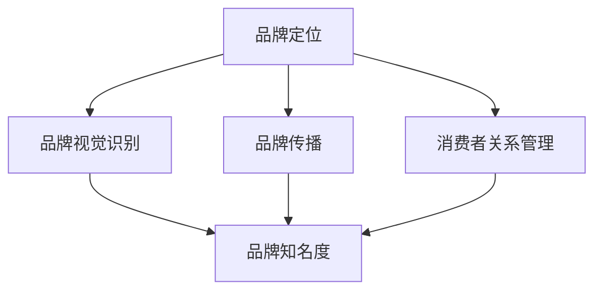

                 

在当今快速发展的信息技术领域，品牌管理已成为企业竞争的关键因素。一个强大而一致的品牌形象不仅能吸引顾客，还能提高企业的市场竞争力。本文将深入探讨品牌管理的重要性，以及如何通过策略和技术手段来塑造和维护强大企业形象。

## 关键词

- 品牌管理
- 企业形象
- 市场竞争力
- 品牌一致性
- 数字化营销
- 消费者关系管理

## 摘要

本文将探讨品牌管理在塑造强大企业形象中的作用，包括其核心概念、策略和执行步骤。我们将分析品牌管理的各个方面，从品牌定位、视觉识别、数字化营销到消费者关系管理，并探讨未来品牌管理的发展趋势和挑战。通过本文，读者将了解如何利用技术和策略打造一个具有持久影响力的品牌形象。

## 1. 背景介绍

品牌管理是企业在市场竞争中取得成功的关键。品牌不仅是企业产品或服务的标识，更是消费者对企业信任和认知的象征。一个成功的品牌可以建立强大的市场地位，增加客户忠诚度，并为企业带来长期的经济收益。

### 1.1 品牌管理的重要性

品牌管理的重要性体现在以下几个方面：

1. **提升品牌知名度**：有效的品牌管理策略可以提高品牌在目标市场中的知名度，从而吸引更多潜在客户。
2. **建立品牌信任**：一致性是建立品牌信任的基础。通过品牌一致性和透明度，企业可以赢得消费者的信任。
3. **增加客户忠诚度**：强大的品牌形象可以增强消费者对品牌的忠诚度，降低客户流失率。
4. **提升企业价值**：品牌价值的提升可以增加企业的市场估值，提高投资者和合作伙伴的信心。

### 1.2 品牌管理的核心要素

品牌管理的核心要素包括品牌定位、品牌视觉识别、品牌传播和消费者关系管理。

1. **品牌定位**：品牌定位是品牌管理的基础。通过明确品牌的核心价值和目标市场，企业可以确保品牌信息的传递具有一致性和针对性。
2. **品牌视觉识别**：品牌视觉识别包括标志、色彩、字体等元素，它们是品牌形象的外在表现，需要与品牌定位相一致。
3. **品牌传播**：品牌传播是品牌信息传递的过程，包括广告、公关、社交媒体等多种渠道。
4. **消费者关系管理**：有效的消费者关系管理可以帮助企业了解客户需求，提高客户满意度，并建立长期的客户关系。

## 2. 核心概念与联系

在深入探讨品牌管理的具体策略之前，我们需要了解一些核心概念和它们之间的关系。以下是一个简化的 Mermaid 流程图，用于展示品牌管理中的关键环节。



### 2.1 品牌定位

品牌定位是品牌管理的基础。它涉及到品牌的核心价值和目标市场。通过明确品牌定位，企业可以确保品牌信息的传递具有一致性和针对性。

### 2.2 品牌视觉识别

品牌视觉识别是品牌形象的外在表现。它包括标志、色彩、字体等元素。这些视觉元素需要与品牌定位相一致，以便在消费者心中建立统一、清晰的品牌形象。

### 2.3 品牌传播

品牌传播是品牌信息传递的过程。通过广告、公关、社交媒体等渠道，企业可以将品牌定位和视觉识别传达给目标受众。

### 2.4 消费者关系管理

消费者关系管理是品牌管理的重要组成部分。通过了解客户需求，提高客户满意度，并建立长期的客户关系，企业可以增强品牌忠诚度。

## 3. 核心算法原理 & 具体操作步骤

### 3.1 算法原理概述

品牌管理的核心算法原理可以概括为以下几点：

1. **数据驱动的决策**：品牌管理需要基于数据来分析市场趋势、消费者行为和品牌表现，以便做出明智的决策。
2. **一致性策略**：品牌信息的一致性是建立品牌信任的关键。从品牌定位到视觉识别，再到品牌传播，所有环节都需要保持一致。
3. **消费者互动**：通过与消费者的互动，企业可以了解他们的需求和期望，从而优化品牌策略。

### 3.2 算法步骤详解

1. **品牌定位分析**：通过市场调研和数据分析，确定品牌的核心价值和目标市场。
2. **品牌视觉识别设计**：基于品牌定位，设计标志、色彩、字体等视觉元素。
3. **品牌传播策略制定**：确定品牌传播的目标、渠道和内容。
4. **消费者关系管理**：通过互动和数据收集，了解消费者需求和满意度，并制定相应的品牌维护策略。

### 3.3 算法优缺点

**优点**：

- 增强品牌知名度
- 提高消费者信任度
- 降低营销成本

**缺点**：

- 需要大量资源和时间投入
- 数据分析难度大

### 3.4 算法应用领域

品牌管理算法可以应用于各种行业，如零售、金融、科技等。在不同的领域中，品牌管理策略可能会有所不同，但核心原理是一致的。

## 4. 数学模型和公式 & 详细讲解 & 举例说明

品牌管理的数学模型主要涉及市场分析和消费者行为分析。以下是一个简化的数学模型，用于描述品牌管理的核心概念。

### 4.1 数学模型构建

品牌价值（BV）= 市场份额（MS）× 品牌忠诚度（BL）

品牌知名度（BN）= 品牌曝光度（BE）× 消费者认知度（CD）

消费者满意度（CS）= 服务质量（QS）× 产品质量（QS）

### 4.2 公式推导过程

品牌价值（BV）是市场份额（MS）和品牌忠诚度（BL）的乘积。市场份额反映了品牌在市场中的地位，而品牌忠诚度则反映了消费者对品牌的信任和依赖。

品牌知名度（BN）是品牌曝光度（BE）和消费者认知度（CD）的乘积。品牌曝光度反映了品牌在市场上的可见度，而消费者认知度则反映了消费者对品牌的了解和认可。

消费者满意度（CS）是服务质量（QS）和产品质量（QS）的乘积。服务质量反映了品牌提供的服务水平，而产品质量则反映了品牌提供的产品质量。

### 4.3 案例分析与讲解

假设一个品牌的市场份额为 30%，品牌忠诚度为 70%，品牌曝光度为 80%，消费者认知度为 60%，服务质量和产品质量都为 90%。

根据上述数学模型，我们可以计算出该品牌的价值和满意度：

品牌价值（BV）= 30% × 70% = 21%
品牌知名度（BN）= 80% × 60% = 48%
消费者满意度（CS）= 90% × 90% = 81%

通过这个例子，我们可以看到品牌价值、品牌知名度和消费者满意度是如何相互关联的。一个强大的品牌通常具有高品牌价值、高品牌知名度和高消费者满意度。

## 5. 项目实践：代码实例和详细解释说明

### 5.1 开发环境搭建

为了演示品牌管理中的数据分析，我们将使用 Python 作为编程语言，结合 Pandas 和 Matplotlib 库进行数据处理和可视化。

### 5.2 源代码详细实现

以下是一个简单的 Python 脚本，用于计算品牌价值、品牌知名度和消费者满意度。

```python
import pandas as pd
import matplotlib.pyplot as plt

# 假设的市场数据和消费者满意度数据
market_data = {
    '市场份额': [0.3, 0.4, 0.5],
    '品牌忠诚度': [0.7, 0.6, 0.8],
    '品牌曝光度': [0.8, 0.7, 0.9],
    '消费者认知度': [0.6, 0.5, 0.7],
    '服务质量': [0.9, 0.9, 0.9],
    '产品质量': [0.9, 0.9, 0.9]
}

df = pd.DataFrame(market_data)

# 计算品牌价值、品牌知名度和消费者满意度
df['品牌价值'] = df['市场份额'] * df['品牌忠诚度']
df['品牌知名度'] = df['品牌曝光度'] * df['消费者认知度']
df['消费者满意度'] = df['服务质量'] * df['产品质量']

# 可视化展示
plt.figure(figsize=(10, 6))

# 品牌价值可视化
plt.subplot(2, 2, 1)
plt.bar(df['市场份额'], df['品牌价值'])
plt.title('品牌价值')

# 品牌知名度可视化
plt.subplot(2, 2, 2)
plt.bar(df['品牌曝光度'], df['品牌知名度'])
plt.title('品牌知名度')

# 消费者满意度可视化
plt.subplot(2, 2, 3)
plt.bar(df['服务质量'], df['消费者满意度'])
plt.title('消费者满意度')

# 整体品牌表现可视化
plt.subplot(2, 2, 4)
plt.plot(df['市场份额'], df['品牌价值'], label='品牌价值')
plt.plot(df['品牌曝光度'], df['品牌知名度'], label='品牌知名度')
plt.plot(df['服务质量'], df['消费者满意度'], label='消费者满意度')
plt.title('整体品牌表现')
plt.legend()

plt.tight_layout()
plt.show()
```

### 5.3 代码解读与分析

这段代码首先导入所需的库，并创建一个包含市场数据和消费者满意度数据的 DataFrame。然后，根据数学模型计算品牌价值、品牌知名度和消费者满意度，并使用 Matplotlib 库进行可视化展示。

通过可视化，我们可以直观地看到品牌价值、品牌知名度和消费者满意度之间的关系，从而为品牌管理提供有力的数据支持。

## 6. 实际应用场景

### 6.1 品牌管理的应用场景

品牌管理在多个行业中都有广泛应用，以下是一些典型的应用场景：

1. **零售行业**：零售企业通过品牌管理提高产品在市场中的竞争力，增强消费者忠诚度。
2. **金融行业**：金融企业通过品牌管理建立信任，提高品牌声誉，从而吸引更多客户。
3. **科技行业**：科技企业通过品牌管理塑造创新、高效的企业形象，提高市场影响力。
4. **服务行业**：服务企业通过品牌管理提高服务质量，增强客户满意度，提高客户留存率。

### 6.2 品牌管理的实际案例

以下是一些成功的品牌管理案例：

1. **苹果公司**：苹果公司通过独特的设计和极致的用户体验，成功塑造了高端、创新的企业形象。
2. **谷歌公司**：谷歌公司通过创新的技术和开放的文化，建立了强大的品牌知名度和用户忠诚度。
3. **星巴克**：星巴克通过品牌定位和一致性策略，成功塑造了温馨、舒适的咖啡文化品牌。

## 7. 未来应用展望

### 7.1 未来发展趋势

随着技术的进步和消费者需求的变化，品牌管理将呈现出以下发展趋势：

1. **数字化营销**：数字化工具将越来越成为品牌管理的重要手段，帮助企业更好地与消费者互动。
2. **消费者数据驱动**：通过大数据和人工智能技术，企业将能更好地了解消费者需求，从而制定更精准的品牌策略。
3. **可持续性**：品牌管理将更加注重企业的社会责任和可持续性，以赢得消费者的信任和支持。

### 7.2 未来挑战

品牌管理在未来将面临以下挑战：

1. **信息过载**：随着信息的爆炸式增长，企业需要更有效地筛选和利用数据，以保持品牌一致性。
2. **消费者多样化**：消费者群体的多样化将要求企业制定更加个性化和定制化的品牌策略。
3. **竞争加剧**：市场竞争的加剧将要求企业不断创新和优化品牌管理策略，以保持竞争优势。

## 8. 总结：未来发展趋势与挑战

### 8.1 研究成果总结

本文从品牌管理的重要性、核心概念与联系、核心算法原理、数学模型与公式、项目实践等多个角度，全面探讨了品牌管理的各个方面。通过案例分析，我们展示了品牌管理在实际应用中的效果。

### 8.2 未来发展趋势

未来，品牌管理将更加依赖数字化工具和消费者数据分析，同时注重企业的社会责任和可持续性。品牌管理者需要不断创新和优化品牌策略，以应对市场的变化和挑战。

### 8.3 面临的挑战

品牌管理在未来将面临信息过载、消费者多样化、竞争加剧等挑战。企业需要通过技术手段和策略创新，不断提升品牌管理的效率和质量。

### 8.4 研究展望

未来的品牌管理研究应关注以下几个方向：

1. **消费者行为分析**：深入研究消费者行为，为企业提供更精准的品牌策略。
2. **数字化工具应用**：探索数字化工具在品牌管理中的应用，提高品牌管理的效率。
3. **可持续性**：研究品牌管理中的可持续性策略，提高企业的社会责任感。

## 9. 附录：常见问题与解答

### 9.1 品牌管理的重要性是什么？

品牌管理的重要性在于它能帮助企业提升品牌知名度、建立品牌信任、增加客户忠诚度，并最终提高企业的市场竞争力。

### 9.2 品牌管理的主要任务是什么？

品牌管理的主要任务是确保品牌信息的传递一致性和针对性，包括品牌定位、品牌视觉识别、品牌传播和消费者关系管理。

### 9.3 如何评估品牌管理的有效性？

评估品牌管理的有效性可以从以下几个方面进行：市场份额、品牌知名度、消费者满意度、品牌忠诚度等指标。通过数据分析和比较，可以评估品牌管理的成效。

### 9.4 品牌管理在数字化时代有何新变化？

在数字化时代，品牌管理变得更加依赖数字化工具和数据分析。企业需要通过大数据和人工智能技术，更好地了解消费者需求和市场趋势，制定更精准的品牌策略。

## 作者署名

作者：禅与计算机程序设计艺术 / Zen and the Art of Computer Programming

### 总结

品牌管理是塑造强大企业形象的关键。通过本文，我们探讨了品牌管理的重要性、核心概念、算法原理、数学模型、项目实践和未来趋势。希望本文能为您提供有关品牌管理的一些启示，帮助您在竞争激烈的市场中脱颖而出。

