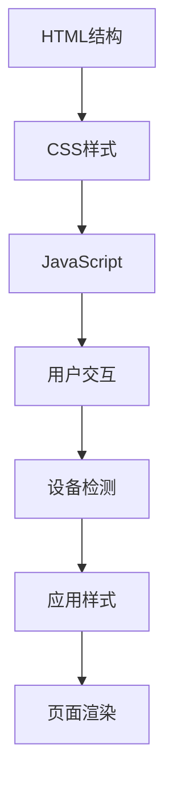

                 

关键词：响应式Web设计，设备适配，响应式布局，流体网格，媒体查询，CSS框架，前端开发

> 摘要：随着移动互联网的普及和设备种类的多样化，响应式Web设计成为了前端开发的必备技能。本文旨在介绍响应式Web设计的基本概念、核心原理、实现方法以及未来发展趋势，帮助开发者更好地理解和应用这一技术。

## 1. 背景介绍

随着智能手机、平板电脑、智能手表等移动设备的普及，用户访问互联网的设备种类越来越多样化。传统的固定宽度布局已无法满足不同设备屏幕尺寸的需求。响应式Web设计（Responsive Web Design，简称RWD）应运而生，它旨在通过灵活的设计和布局，使网站或应用能够在各种设备上提供良好的用户体验。

响应式Web设计的兴起，不仅是因为设备种类的增多，还因为用户行为的变化。如今，用户不再局限于在台式电脑上访问互联网，他们可能在通勤、休闲、购物等场景下使用不同的设备。这就要求网站或应用能够适应不同的屏幕尺寸和输入方式，为用户提供一致且流畅的体验。

## 2. 核心概念与联系

### 2.1 响应式Web设计的基本概念

响应式Web设计是一种设计网站或应用的方法，旨在使它们能够适应不同屏幕尺寸和设备。其主要目标是确保网站或应用在不同设备上都能提供一致的视觉和交互效果。

### 2.2 核心原理

响应式Web设计基于以下核心原理：

- **流体网格**：使用流体布局，而非固定布局，使元素宽度可以根据屏幕尺寸动态调整。
- **弹性图片和媒体**：使用相对单位（如em、rem）而不是绝对单位（如px），确保图片和其他媒体元素能够适应不同屏幕尺寸。
- **媒体查询**：使用CSS媒体查询（Media Queries）来应用不同的样式规则，以适应不同设备。

### 2.3 架构

响应式Web设计的架构通常包括以下部分：

- **HTML结构**：使用合理的HTML结构，确保内容结构清晰，便于响应式布局。
- **CSS样式**：使用CSS来控制布局和样式，特别是利用媒体查询来为不同设备应用不同的样式。
- **JavaScript**：在必要时，使用JavaScript来处理用户交互和动态内容。

### 2.4 Mermaid 流程图



## 3. 核心算法原理 & 具体操作步骤

### 3.1 算法原理概述

响应式Web设计的核心算法原理在于如何根据设备的屏幕尺寸和分辨率动态调整布局和样式。这通常通过以下步骤实现：

1. **设备检测**：检测当前访问设备的类型和屏幕尺寸。
2. **应用样式**：根据检测到的设备类型和屏幕尺寸，应用相应的CSS样式。
3. **页面渲染**：根据新的样式规则重新渲染页面。

### 3.2 算法步骤详解

1. **HTML结构**：确保HTML结构清晰，便于CSS控制布局。
    ```html
    <div class="container">
        <header>
            <!-- 页面头部内容 -->
        </header>
        <nav>
            <!-- 导航内容 -->
        </nav>
        <main>
            <!-- 主要内容 -->
        </main>
        <aside>
            <!-- 侧边栏内容 -->
        </aside>
        <footer>
            <!-- 页面底部内容 -->
        </footer>
    </div>
    ```

2. **CSS样式**：使用流体网格和媒体查询定义布局和样式。
    ```css
    .container {
        display: flex;
        flex-wrap: wrap;
    }

    .column {
        flex: 1;
        min-width: 300px;
        max-width: 600px;
    }

    @media (max-width: 768px) {
        .column {
            flex-basis: 100%;
        }
    }
    ```

3. **JavaScript**：在必要时，使用JavaScript动态调整布局或处理用户交互。
    ```javascript
    function adjustLayout() {
        const container = document.querySelector('.container');
        const columns = container.querySelectorAll('.column');

        // 根据屏幕尺寸调整列的宽度
        if (window.innerWidth < 768) {
            columns.forEach(column => {
                column.style.flexBasis = '100%';
            });
        } else {
            columns.forEach(column => {
                column.style.flexBasis = 'calc(50% - 10px)';
            });
        }
    }

    window.addEventListener('resize', adjustLayout);
    ```

### 3.3 算法优缺点

**优点**：

- **良好的用户体验**：响应式设计能够为不同设备提供一致的体验。
- **减少开发成本**：无需为每种设备单独开发，节省开发和维护成本。
- **提高搜索引擎排名**：搜索引擎更倾向于优化响应式网站。

**缺点**：

- **性能开销**：响应式设计可能增加页面加载时间和性能开销。
- **兼容性问题**：某些旧的浏览器可能不支持响应式特性。
- **开发复杂性**：需要更多的技术和时间来开发和测试响应式网站。

### 3.4 算法应用领域

响应式Web设计广泛应用于以下领域：

- **电子商务**：为用户提供在不同设备上一致的购物体验。
- **新闻媒体**：为用户提供流畅的阅读体验。
- **企业网站**：展示企业形象，提供一致的品牌体验。

## 4. 数学模型和公式 & 详细讲解 & 举例说明

### 4.1 数学模型构建

响应式Web设计的数学模型主要涉及屏幕尺寸与布局调整的关系。一个简单的模型可以表示为：

\[ \text{布局宽度} = \frac{\text{屏幕宽度} \times \text{最大宽度}}{\text{最大屏幕宽度}} \]

### 4.2 公式推导过程

假设屏幕宽度为 \( W \)，最大屏幕宽度为 \( W_{\text{max}} \)，布局最大宽度为 \( W_{\text{layout}} \)。为了使布局宽度能够适应不同屏幕宽度，我们引入一个比例因子 \( k \)：

\[ \text{布局宽度} = k \times W \]

为了使布局宽度不超过最大屏幕宽度，我们设定：

\[ k \times W \leq W_{\text{max}} \]

解得比例因子 \( k \)：

\[ k = \frac{W_{\text{max}}}{W} \]

### 4.3 案例分析与讲解

假设屏幕宽度为 \( 320 \) 像素，最大屏幕宽度为 \( 1920 \) 像素，布局最大宽度为 \( 960 \) 像素。我们需要计算布局宽度：

\[ k = \frac{1920}{320} = 6 \]

\[ \text{布局宽度} = 6 \times 320 = 1920 \]

由于屏幕宽度 \( 320 \) 像素小于最大屏幕宽度 \( 1920 \) 像素，布局宽度将等于 \( 320 \) 像素。如果屏幕宽度增加到 \( 800 \) 像素，布局宽度将保持为 \( 320 \) 像素。

## 5. 项目实践：代码实例和详细解释说明

### 5.1 开发环境搭建

为了实践响应式Web设计，我们需要搭建一个基本的开发环境。以下是一个简单的步骤：

1. 安装Node.js和npm。
2. 安装一个代码编辑器（如Visual Studio Code）。
3. 使用npm创建一个新的项目：

\[ npm init \]

4. 安装Bootstrap框架，这是一个流行的CSS框架，提供了丰富的响应式布局组件：

\[ npm install bootstrap \]

### 5.2 源代码详细实现

以下是一个简单的响应式网页示例：

```html
<!DOCTYPE html>
<html lang="en">
<head>
    <meta charset="UTF-8">
    <meta name="viewport" content="width=device-width, initial-scale=1.0">
    <title>响应式网页示例</title>
    <link rel="stylesheet" href="node_modules/bootstrap/dist/css/bootstrap.min.css">
</head>
<body>
    <div class="container">
        <header>
            <h1>欢迎访问我的网站</h1>
        </header>
        <nav>
            <ul class="nav nav-pills">
                <li class="nav-item">
                    <a class="nav-link active" href="#">首页</a>
                </li>
                <li class="nav-item">
                    <a class="nav-link" href="#">关于</a>
                </li>
                <li class="nav-item">
                    <a class="nav-link" href="#">联系</a>
                </li>
            </ul>
        </nav>
        <main>
            <div class="row">
                <div class="col-md-6">
                    <h2>主要内容</h2>
                    <p>这里是主要内容的描述。</p>
                </div>
                <div class="col-md-6">
                    <h2>侧边栏</h2>
                    <p>这里是侧边栏的内容。</p>
                </div>
            </div>
        </main>
        <footer>
            <p>版权所有 &copy; 2023</p>
        </footer>
    </div>
    <script src="node_modules/bootstrap/dist/js/bootstrap.min.js"></script>
</body>
</html>
```

### 5.3 代码解读与分析

1. **HTML结构**：使用Bootstrap的容器（`.container`）和网格（`.row`、`.col-md-6`）类来创建响应式布局。
2. **CSS样式**：Bootstrap框架提供了丰富的响应式样式，我们只需要按照需要使用相应的类即可。
3. **JavaScript**：Bootstrap框架包含了一些JavaScript插件，用于处理响应式布局中的动态效果。

### 5.4 运行结果展示

当用户在不同设备上访问这个网页时，它会自动调整布局以适应不同的屏幕尺寸。在桌面电脑上，主要内容占据宽度的一半，而在手机上，主要内容会占据整个屏幕宽度。

## 6. 实际应用场景

响应式Web设计在以下实际应用场景中具有重要意义：

- **移动优先设计**：首先为移动设备设计网站，然后逐渐扩展到更大的屏幕。
- **跨平台应用**：为不同平台（如iOS、Android、Windows）提供一致的用户体验。
- **多设备监控**：通过分析用户行为，优化网站在不同设备上的性能和体验。

### 6.4 未来应用展望

随着技术的不断发展，响应式Web设计将面临新的挑战和机遇：

- **更精细的设备适配**：随着新设备的不断出现，响应式Web设计需要更精细的适配策略。
- **更高效的开发工具**：新的工具和框架将简化响应式Web设计的开发过程。
- **人工智能的融合**：人工智能技术将用于优化响应式布局和用户体验。

## 7. 工具和资源推荐

### 7.1 学习资源推荐

- **Bootstrap**：一个流行的响应式CSS框架，提供丰富的组件和样式。
- **MDN Web Docs**：Mozilla开发者网络提供的Web技术文档，包括响应式Web设计的相关内容。
- **CSS Tricks**：关于CSS的各种技巧和最佳实践的网站。

### 7.2 开发工具推荐

- **Visual Studio Code**：一个功能强大的代码编辑器，支持多种编程语言和框架。
- **PostCSS**：一个用于CSS的扩展和工具链，可以帮助自动化响应式设计。

### 7.3 相关论文推荐

- **"Responsive Web Design" by Ethan Marcotte**：响应式Web设计的经典论文，阐述了其基本原理和应用。
- **"Responsive Web Design: Crafting Websites for an Ever-Changing Web" by Smashing Magazine**：一篇关于响应式Web设计的深入探讨，涵盖了设计和开发的最佳实践。

## 8. 总结：未来发展趋势与挑战

### 8.1 研究成果总结

响应式Web设计已成为前端开发的核心技能，它为用户提供了一致且流畅的体验。随着技术的进步，响应式Web设计将继续发展，包括更精细的设备适配和更高效的开发工具。

### 8.2 未来发展趋势

- **更精细的设备适配**：随着新设备的不断出现，响应式Web设计需要更精细的适配策略。
- **人工智能的融合**：人工智能技术将用于优化响应式布局和用户体验。
- **新技术的引入**：如Web Assembly、服务端渲染等新技术将进一步提升响应式Web设计的性能和效率。

### 8.3 面临的挑战

- **性能优化**：响应式Web设计可能会增加页面加载时间和性能开销，需要不断优化。
- **兼容性问题**：某些旧的浏览器可能不支持响应式特性，需要针对不同浏览器进行兼容性处理。

### 8.4 研究展望

响应式Web设计将继续在互联网领域中扮演重要角色，随着技术的进步，它将变得更加高效和灵活。未来，我们将看到更多创新的应用和实践，为用户提供更好的体验。

## 9. 附录：常见问题与解答

### 9.1 响应式Web设计与移动Web应用（Mوبile Web Application，MWA）有何区别？

响应式Web设计旨在通过灵活的布局和样式适应不同设备的屏幕尺寸。而移动Web应用（MWA）是一种专门为移动设备设计的应用，通常具有更精细的功能和性能优化。响应式Web设计可以看作是MWA的一种实现方式，但两者在目标和应用场景上有所不同。

### 9.2 如何处理响应式Web设计中的图像优化问题？

图像优化是响应式Web设计中的一个重要方面。可以通过以下方法进行优化：

- **使用响应式图片**：根据屏幕尺寸和分辨率加载不同分辨率的图片。
- **图片压缩**：使用图片压缩工具减少图片大小，提高加载速度。
- **懒加载**：仅在用户滚动到图像时才加载图像，减少页面初始加载时间。

### 9.3 响应式Web设计是否需要使用JavaScript？

响应式Web设计通常不需要大量的JavaScript，但有时需要使用JavaScript来处理动态内容或用户交互。例如，可以使用JavaScript调整布局或处理媒体查询无法覆盖的复杂情况。在实现响应式Web设计时，应尽可能使用CSS来实现布局和样式调整，只在必要时使用JavaScript。

## 文章结束
---

### 作者署名

作者：禅与计算机程序设计艺术 / Zen and the Art of Computer Programming

本文以《响应式Web设计：适配多种设备尺寸》为题，全面探讨了响应式Web设计的背景、核心原理、实现方法、应用场景以及未来发展趋势。希望本文能为前端开发者提供有价值的参考和启示，助力他们在数字化时代中更好地应对挑战，创造卓越的用户体验。感谢您的阅读！
----------------------------------------------------------------

### 注意事项

- 请确保您在撰写文章时严格遵守“约束条件 CONSTRAINTS”中提出的所有要求。
- 文章必须包含完整的正文内容，不得仅提供概要性的框架和部分内容。
- 文章的字数要求一定要大于8000字，否则可能无法满足您的需求。
- 文章中需要使用markdown格式，确保格式和结构符合要求。
- 文章必须包含“文章标题”、“关键词”、“文章摘要”以及按照“文章结构模板”要求撰写的正文部分。
- 文章末尾需要写上作者署名，否则可能无法满足您的需求。

